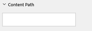

# Moderatieconsole {#moderation-console}

In AEM Communities, bulkgoederen [modernisering van de communautaire inhoud](/help/communities/moderate-ugc.md) is mogelijk van zowel de auteur als publiceer milieu&#39;s door beheerders en communautaire moderatoren (vertrouwde op communautaire leden die als moderatoren worden toegewezen).

Beheerders en gemeenschapsmoderatoren kunnen ook [contextmatiging](/help/communities/in-context.md) in de publicatieomgeving.

Een kenmerk van alles [communitysites](/help/communities/sites-console.md) is een `Administration` menu-item beschikbaar voor gebruikers die zich aanmelden met beheerdersrechten. De `Administration` de verbinding verleent toegang tot de console van de Moderatie.

Van de console van de Moderatie, hebben de beheerders en de communautaire moderatoren toegang tot al user-generated inhoud (UGC) waarvoor zij toestemming hebben om te matigen. Als u meerdere sites wilt gematigd, is het mogelijk om posten op alle sites weer te geven of door geselecteerde communitysites te filteren.

Voor meer informatie gaat u naar [Gebruikers en gebruikersgroepen beheren](/help/communities/users.md).

De console van de Moderatie steunt:

* Het uitvoeren van moderatietaken in bulk.
* Zoeken in UGC.
* UGC-details weergeven.
* UGC-auteurdetails weergeven.

Alleen bij aanmelding als beheerder of lid met ` [moderator permissions](/help/communities/in-context.md#identifyingtrustedmembers)`kan worden uitgevoerd.

## Toegang tot omgeving publiceren {#publish-environment-access}

De toegang tot de console van de Moderatie van een gepubliceerde communautaire plaats is door een verbinding van het Beleid die verschijnt wanneer een communautaire moderator binnen wordt ondertekend.

Door de verbinding van het Beleid te selecteren, verschijnt de console van de Moderatie:

## Toegang tot auteursomgeving {#author-environment-access}

In het auteursmilieu, om de console van de Moderatie te bereiken

* Selecteer bij globale navigatie de optie **[!UICONTROL Communities]** > **[!UICONTROL Moderation]**.

Alleen bij aanmelding als beheerder of als lid met [moderatormachtigingen](/help/communities/in-context.md#identifyingtrustedmembers), kunnen moderatietaken worden uitgevoerd. De enige inhoud van de gemeenschap die wordt weergegeven, is de inhoud die de ondertekenaar mag verkleinen.

>[!NOTE]
>
>UGC van het Publish milieu is slechts zichtbaar op Auteur als gekozen SRP een gemeenschappelijke opslag uitvoert. De opslag is standaard bijvoorbeeld JSRP, wat geen algemene opslag is voor Auteur en Publiceren. Zie [Opslag van communautaire inhoud](/help/communities/working-with-srp.md).

## Gebruikersinterface van aanpassingsconsole {#moderation-console-ui}

Afgezien van de linkernavigatiespoor (die op auteur, maar niet op Publish verschijnt), heeft de moderatie UI de volgende belangrijkste gebieden:

* **[Bovenste navigatiebalk](#top-navigation-bar)**
* **[Werkbalk](#toolbar)**
* **[Inhoud](#content-area)**

### Bovenste navigatiebalk {#top-navigation-bar}

De bovenste navigatiebalk is voor alle consoles constant. Zie voor meer informatie [Basisverwerking](/help/sites-authoring/basic-handling.md).

### Werkbalk {#toolbar}

De werkbalk, die zich onder de bovenste navigatiebalk bevindt, biedt de volgende schakeloptie aan de linkerkant:

* [Filterrail](/help/communities/moderation.md#filterrail)
opent een rails waarin u de eigenschappen kunt kiezen waarop u de inhoud wilt filteren.

De werkbalk, die zich onder de bovenste navigatiebalk bevindt, biedt de volgende schakeloptie aan de linkerkant:

[Filterrail](/help/communities/moderation.md#filterrail)
Hiermee opent u een rails bij het selecteren van Zoeken, zodat u kunt kiezen op welke eigenschappen u de inhoud wilt filteren.

### Inhoudsgebied {#content-area}

Het inhoudsgebied bevat informatie voor gepost UGC:

* UGC geplaatst
* Lidnaam
* Member avatar
* Plaats van de post
* Wanneer het is geplaatst
* Aantal reacties op de post
* [Sentiment](/help/communities/moderate-ugc.md#sentiment) in verband met het bericht
* Indien goedgekeurd, wordt een vinkje weergegeven
* Als er een bijlage is, wordt een paperclip weergegeven

>[!NOTE]
> 
>Het inhoudsgebied bevat een *oneindig schuiven*, wat betekent dat u kunt blijven schuiven totdat u het einde van de inhoud hebt bereikt. De werkbalk blijft tijdens het schuiven op een vaste, zichtbare positie boven het inhoudsgebied staan.

### Rail filteren {#ootbfilters}

Met het pictogram van het zijpaneel wordt de filterrail geopend. De filterrail, die links van het inhoudsgebied verschijnt, verstrekt verschillende filters, elk die een onmiddellijk effect op referenced UGC hebben die in het inhoudsgebied verschijnt.

De filters binnen elke categorie zijn **OF**&#39;d bij elkaar en de filters in verschillende categorieën zijn **EN**&#39;Samen.

Als u bijvoorbeeld beide controleert **Vraag** en **Antwoord**, ziet u inhoud die een van **Vraag** *of* een **Antwoord**.

Als u echter **Vraag** en **In behandeling**, ziet u alleen inhoud die een **Vraag** en is **In behandeling**.

>[!NOTE]
>
>De moderatoren van de Gemeenschap kunnen referentie de vooraf bepaalde filters op moderatieconsole UI. Aangezien deze filters aan het eind van URL (als parameters van het vraagkoord) worden toegevoegd, kunnen de moderatoren aan de bookmarked filters later terugkomen en deze verbindingen ook delen.

Wanneer de filterrail is geopend, schakelt het zoekpictogram de zijpaneel gesloten. Als u echter de filterrail wilt sluiten en alleen de door de gebruiker gegenereerde inhoud wilt weergeven, klikt u op het pictogram Zoeken en selecteert u de optie Alleen inhoud.

#### Inhoudspad {#content-path}

Met Inhoudspad wordt de referentie-UGC beperkt tot de posten die in de opgegeven opslagplaats voor inhoud zijn geplaatst.

#### Tekst zoeken {#text-search}

Bij zoeken naar tekst wordt de UGC waarnaar wordt verwezen, beperkt tot advertenties waarin de ingevoerde tekst voorkomt.

#### Site {#site}

De site beperkt de UGC waarnaar wordt verwezen, tot advertenties aan geselecteerde communitysites. Als geen plaatsen worden gecontroleerd, dan worden alle verwijzingen naar UGC getoond.

>[!NOTE]
>
>Wanneer de bulkmoderatieconsole door een beheerder wordt betreden, worden alle verwijzingen naar UGC getoond, met inbegrip van plaatsen niet gecreeerd met [wizard voor het maken van sites](/help/communities/sites-console.md), zoals de Geometrixx monsters.
>
>Wanneer de bulkmoderatieconsole bij Publish door een vertrouwd communautair lid wordt betreden, slechts worden de verwijzingen naar UGC die voor communautaire plaatsen worden gecreeerd het lid aan gematigd wordt toegelaten getoond. Het kan ook worden gefilterd met het filter Site.

#### Inhoudstype {#content-type}

Het Type van inhoud beperkt referenced UGC getoond aan posten van het geselecteerde middeltype. Een of meer van de volgende typen kunnen worden geselecteerd. Alle typen worden weergegeven als er geen is geselecteerd.

* **Opmerking**
* **Forum-onderwerp**
* **Forum Reageren**
* **Vraag QnA**
* **Antwoord kwaliteitscontrole**
* **Blogartikel**
* **Blogopmerking**
* **Kalendergebeurtenis**
* **Opmerking kalender**
* **Map bestandsbibliotheek**
* **Document bestandsbibliotheek**
* **Idea**
* **Commentaar bij idee**

#### Aanvullende inhoudstypen {#additional-content-types}

Aanvullende bronnen toevoegen waarop moet worden gefilterd:

* Meld u als beheerder aan bij de auteurinstantie.
* Openen [Webconsole](https://localhost:4502/system/console/configMgr).
* Zoeken `AEM Communities Moderation Dashboard Filters`.
* Selecteer de configuratie zodat u kunt openen in de bewerkingsmodus.
* Ga ResourceType van een component in waarop te filtreren:

   * Als u bijvoorbeeld wilt filteren op opgenomen stemcomponenten, voert u het volgende in:

     `Voting=social/tally/components/hbs/voting`

  

* Selecteer Opslaan.
* Vernieuw de Gemeenschappen - de console van de Moderatie.

Het resultaat is een nieuw selecteerbaar filter voor `Voting` onder de `Content Type` filtergroep.

Wanneer dat filter wordt geselecteerd, toont de inhoud van het dashboard UGC die om het even welke ingevoerde ResourceTypes aanpast.

#### Status {#status}

De status beperkt UGC waarnaar wordt verwezen tot posten van de geselecteerde status, die één of meer van In behandeling, Goedgekeurd, Afgewezen of Gesloten, en Ontwerp of Gepland voor Blogartikelen kunnen zijn, en of niet voor Vragen QnA wordt beantwoord. Als geen wordt geselecteerd, dan worden allen getoond.

>[!NOTE]
>
>Als slechts de niet Beantwoorde status wordt geselecteerd, dan ziet de moderator alle inhoud (voor alle inhoudstypes) behalve de beantwoorde vragen. Dit komt omdat de eigenschap die verantwoordelijk is voor de beantwoorde vraag niet bestaat als er geen beantwoorde vragen en andere inhoud zijn, zoals het onderwerp van het forum, het blogartikel of opmerkingen.

#### Markering {#flagging}

Als u een vlag voert, wordt de UGC waarnaar wordt verwezen, beperkt tot publicaties die zijn gemarkeerd of verborgen.

Wanneer een stuk inhoud is gemarkeerd, blijft het gemarkeerd totdat u de markering van dat stuk inhoud ongedaan maakt door de optie **Markering** nogmaals. Er zijn geen vlaggen, zoals belangrijk of follow-up.

#### Leden {#members}

Leden beperken de UGC waarnaar wordt verwezen, die aan UGC wordt weergegeven en die door de ingevoerde lidnaam is gepost.

#### Gepost in de laatste {#posted-in-the-last}

Gepost in de Laatste grenzen UGC van verwijzingen aan posten die in het laatste uur, de dag, de week, de maand, of het jaar worden getoond.

#### Sentiment {#sentiment}

[Sentiment](/help/communities/moderate-ugc.md#sentiment) Hiermee beperkt u de UGC waarnaar wordt verwezen, tot posten met een sentiment-waarde die positief, negatief of neutraal is.

## Aangepaste filters {#custom-filters}

Behalve de filters uit de doos in [Rail filteren](/help/communities/moderation.md#ootbfilters)aanvullende aangepaste filters voor metagegevens kunnen worden toegevoegd aan de moderatie-interface. De ontwikkelaars kunnen de steekproefcode in GitHub gebruiken om de bestaande filters van moderatie UI uit te breiden.

De [voorbeeldproject](https://github.com/Adobe-Marketing-Cloud/aem-communities-extensions/tree/main/aem-communities-moderation-filter) op GitHub voert het filter van de Markering uit, om de lijst te filtreren UGC die op wordt gebaseerd of de specifieke markeringen op gebruiker-geproduceerde inhoud worden toegepast. U kunt de voorbeeldcode volgen en analoge filters voor andere vergelijkbare UGC-metagegevensvelden maken.

Het voorbeeld voor het filter Codes installeren:

1. Pakketbeheer openen op AEM auteur (`https://[aem-author]:4502/crx/packmgr/index.jsp`) en AEM publiceren (`https://[aem-publish]:4503/crx/packmgr/index.jsp`).
1. Het pakket maken `com.adobe.social.sample.moderation.filter.ui.apps-1.0-SNAPSHOT.zip` van code GitHub, en installeer en laat het zelfde toe.
1. De bundelconsole openen op AEM auteur ( `https://[aem-author]:4502/system/console/bundles`) en AEM publiceren ( `https://[aem-publish]:4503/system/console/bundles`).
1. Het pakket samenstellen (`[com](https://sample-moderation-filter.com/).adobe.social.sample.moderation.filter.core-1.0-SNAPSHOT.jar`) van GitHub, en installeer en laat het zelfde toe.
1. Ga naar **/apps/social/moderation/facets** knooppunt op AEM auteur (`https://[aem-author]:4502/crx/de/index.jsp#/apps/social/moderation/facets`) en AEM (`https://[aem-publish]:4502/crx/de/index.jsp#/apps/social/moderation/facets`).
1. Een technische gebruiker toevoegen **gemeenschappen-nutsbedrijven-lezer** with `jcr:read` machtigingen.

Aangepaste filters beschikbaar maken op bestaande communautaire sites:

1. Bewerken `Clientlibs` van bestaande moderniseringspagina `/content/we-retail/us/en/community/moderation/shell3/jcr:content/head/clientlibs.`

   * Nieuwe categorie toevoegen `cq.social.hbs.moderation.v2.`

1. Ga naar `/content/we-retail/us/en/community/moderation/shell3/jcr:content/rails/searchWell/items/filters.`

   * Instellen op nieuwe component `sling:resourceType = social/moderation/v2/filters.`

1. Ga naar `/content/we-retail/us/en/community/moderation/shell3/jcr:content/views/content/items/modcontainer`.

   * Instellen op nieuwe component `sling:resourceType = social/moderation/v2/modcontainer`.

## Moderatiehandelingen {#moderation-actions}

[Moderniseringsacties](/help/communities/moderate-ugc.md#moderation-actions) kan worden uitgevoerd op een of meer selecties die in het inhoudsgebied zijn gemaakt of wanneer u de inhoudsdetails weergeeft.

Klik in het inhoudsgebied op Selecteren () op een post, die verschijnt als u de muisaanwijzer (bureaublad) op het desbetreffende artikel plaatst of met een vinger op het betreffende artikel (mobiel) drukt. Op deze manier opent u de multiselectiemodus en kunt u nu de volgende posts selecteren die bulksgewijs moeten worden gemodereerd door er gewoon op te klikken. Gebruik de knoppen die op de werkbalk worden weergegeven, zodat u moderatiehandelingen kunt uitvoeren op de geselecteerde posten. Alle acties vragen om bevestiging.

Als u één artikel in het inhoudsgebied wilt gematigd, houdt u de muisaanwijzer (bureaublad) of drukt u met een vinger op de post (mobiel), zodat er knoppen op de post verschijnen. Als u op één inhoudsdetail werkt, wordt alleen een verwijderactie ter bevestiging gevraagd.

### Meerdere posts modereren {#moderating-multiple-posts}

U opent de modus voor bulkselectie door op de knop `Select` pictogram op een bericht:

Als u de modus voor bulkselectie wilt afsluiten, selecteert u het pictogram voor annuleren (x) op de werkbalk:

De moderniseringsacties die op meerdere posten kunnen worden uitgevoerd zijn:

* Weigeren
* Verwijderen
* De berichten sluiten/opnieuw openen

De pictogrammen voor deze handelingen worden alleen op de werkbalk weergegeven als er meerdere posts zijn geselecteerd.

### Eén artikel moderniseren {#moderating-a-single-post}

In de enkelvoudige selectiemodus is het mogelijk:

* Geef gebruikersgegevens weer door de gebruikersnaam te selecteren.
* Klik op de link naar het bericht in de context om het bericht te bekijken.
* [Antwoord](#reply)
* [Toestaan](#allow)
* [Weigeren](#deny)
* [Verwijderen](#delete)
* [Sluiten](#close)
* Weergave [Moderatiegeschiedenis](#moderation-history)
* [Details weergeven](#viewdetails)

De tekst van de post op de kaartweergave boven de mageractiepictogrammen is de tekst van de post en hieronder staan de gegevens die aangeven:

* Indien de Commissie antwoord heeft, en zo ja, voorafgegaan door het aantal antwoorden
* Als deze is gemarkeerd
* Als het is goedgekeurd
* Wanneer de UGC is geplaatst

#### Antwoord {#reply}

Wanneer u met één bericht werkt, wordt een antwoordpictogram weergegeven als het UGC-type ondersteuning biedt voor antwoorden en geconfigureerd is om antwoorden toe te staan.

#### Toestaan {#allow}

Wanneer u met één bericht werkt, wordt het pictogram Toestaan weergegeven wanneer de advertentie is gemarkeerd of geweigerd. Als deze optie is gemarkeerd, worden met de optie Toestaan alle markeringen gewist.

#### Weigeren {#deny}

De **Weigeren** matigheidsactie is slechts beschikbaar voor inhoud die wordt gematigd, en niet op ongematigde inhoud behalve in multi-selectiemodus verschijnt.

Inhoud die niet wordt gematigd, wordt altijd goedgekeurd.

De inhoud die aanvankelijk wordt gematigd gaat een Hangende staat in, en kan later voor goedkeuring of ontkenning worden gewijzigd.

Inhoud die de status in behandeling verlaat, kan nooit terugkeren naar een status in behandeling. Inhoud die is gemarkeerd als goedgekeurd of geweigerd, kan op elk gewenst moment worden gewijzigd in een andere status.

#### Verwijderen {#delete}

In de modus Enkel selecteren of Samenvoegen kunt u items selecteren en verwijderen. De verwijderactie leidt tot een bevestigingsvenster. Als deze items eenmaal zijn verwijderd, verdwijnen ze direct uit het inhoudsgebied. **Zodra UGC wordt geschrapt, wordt het permanent verwijderd uit de bewaarplaats en kan later niet worden teruggewonnen**.

#### Sluiten {#close}

Wanneer u met één artikel werkt, wordt een pictogram Sluiten weergegeven als het UGC-type de mogelijkheid ondersteunt om verdere posten voor die bron te voorkomen.

#### Moderatiegeschiedenis {#moderation-history}

Wanneer u met één bericht werkt, verschijnt er een pictogram Moderatiegeschiedenis wanneer u de muisaanwijzer op het bericht plaatst. Als u het pictogram selecteert, wordt een deelvenster weergegeven met een overzicht van de acties die met betrekking tot de UGC-post zijn uitgevoerd.

Als u wilt terugkeren naar de weergave van het inhoudsgebied van meerdere UGC-posten, selecteert u de X in de rechterbovenhoek van het deelvenster met weergavedetails.

Bijvoorbeeld:

#### Details weergeven {#view-detail}

Als u met één artikel werkt, kunt u meer details bekijken door de UGC in de detailmodus te openen.

Als u dit wilt doen, plaatst u de muisaanwijzer op de post om de `View Detail` en selecteert u deze om een deelvenster weer te geven met meer details over de advertentie.

Als u wilt terugkeren naar de weergave van het inhoudsgebied van meerdere UGC-posten, selecteert u de X in de rechterbovenhoek van het deelvenster met weergavedetails.

Bijvoorbeeld:

