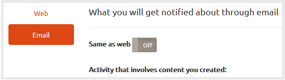

# Publikaties {#communities-notifications}

## Overzicht {#overview}

AEM Communities biedt een meldingssectie waarin gebeurtenissen worden weergegeven die van belang zijn voor de ondertekenaars in het community-lid.

Meldingen lijken op [activiteiten](/help/communities/essentials-activities.md) en [abonnementen](/help/communities/subscriptions.md) die kunnen voortvloeien uit:

* Het lid dat inhoud plaatst.
* Het lid dat ervoor kiest een ander lid te volgen.
* Het lid dat ervoor kiest om specifieke onderwerpen, artikelen en andere draden van inhoud te volgen.
* Het lid dat (@genoemd) een ander lid van de gemeenschap in een gebruiker etiketteert produceerde inhoud.

Wat meldingen onderscheidt van activiteiten en abonnementen is:

* Een koppeling naar de sectie Meldingen staat altijd in de koptekst van een communitysite:

   * De activiteiten vereisen [activity stream, functie](/help/communities/functions.md#activity-stream-function) op te nemen in de structuur van de site van de gemeenschap .
   * Abonnementen vereist [configuratie van e-mail](/help/communities/email.md).

* De implementatie van meldingen verloopt via schaalbare en pluggable kanalen:

   * Activiteiten zijn alleen beschikbaar op het web.
   * Abonnementen zijn alleen beschikbaar via e-mail.

Vanaf Gemeenschappen [FP1](/help/communities/deploy-communities.md#latestfeaturepack)De beschikbare kennisgevingskanalen zijn:

* Het webkanaal, toegankelijk via de `Notifications` koppeling.
* Het e-mailkanaal, beschikbaar wanneer e-mail correct is geconfigureerd.

Toekomstige kanalen zijn mobiel en desktop.

### Vereisten {#requirements}

**E-mail configureren**

E-mail moet worden gevormd om het e-mailkanaal voor berichten functioneel te zijn.

Voor instructies over het instellen van e-mailberichten raadpleegt u [E-mail configureren](/help/communities/analytics.md).

**Volgen inschakelen**

Componenten moeten worden geconfigureerd om het volgende in te schakelen. Functies die het volgende toestaan, zijn [blog](/help/communities/blog-feature.md), [forum](/help/communities/forum.md), [QnA](/help/communities/working-with-qna.md), [kalender](/help/communities/calendar.md), [bestandsbibliotheek](/help/communities/file-library.md), en [opmerkingen](/help/communities/comments.md).

**Opmerking**:

* Onderdelen die binnen de gemeenschap worden gebruikt [sitesjablonen](/help/communities/sites.md) en [groepssjablonen](/help/communities/tools-groups.md) kan reeds worden gevormd om te volgen.

* Gebruikersprofielen zijn al zo geconfigureerd dat andere leden deze kunnen volgen.

## Meldingen van de volgende {#notifications-from-following}


De **[!UICONTROL Follow]** biedt een manier om vermeldingen als activiteiten, abonnementen en/of meldingen te volgen. Elke keer als **[!UICONTROL Follow]** is geselecteerd, is het mogelijk om een selectie in of uit te schakelen. De `Email Subscriptions` selectie is alleen aanwezig als dit is geconfigureerd.

Als een van de volgende methoden is geselecteerd, verandert de tekst van de knop in **[!UICONTROL Following]**. Voor het gemak is het mogelijk `Unfollow All` om alle methoden uit te schakelen.

De **[!UICONTROL Follow]** wordt weergegeven:

* Wanneer u het profiel van een ander lid weergeeft.
* Op een hoofdpagina met functies, zoals forums, QnA en blogs:

   * Volg alle activiteiten voor die algemene functie.

* Voor een specifiek bericht, zoals een forumonderwerp, een QnA-vraag of een blogartikel:

   * Hiermee wordt alle activiteit voor die specifieke vermelding gevolgd.

## Meldingsinstellingen beheren {#managing-notification-settings}

Als u de koppeling Instellingen kennisgeving op de pagina Meldingen selecteert, kan elk lid bepalen hoe meldingen worden ontvangen.

Het webkanaal is altijd ingeschakeld.


Het e-mailkanaal, dat afhankelijk is van de juiste [configuratie van e-mail](/help/communities/email.md)biedt dezelfde instellingen als voor het webkanaal.

Het e-mailkanaal is standaard uitgeschakeld.



Het kan door een lid worden aangezet, maar nog hangt van e-mail af die wordt gevormd.


## Meldingen weergeven {#viewing-notifications}

### Webmeldingen {#web-notifications}

A [wizard heeft een communitysite gemaakt](/help/communities/sites-console.md) bevat nu een koppeling naar de `Notifications` in de koptekstbalk van de site boven de banner. In tegenstelling tot berichten, worden de berichten gecreeerd voor elke communautaire plaats, terwijl de berichten tijdens het proces van de plaatsverwezenlijking moeten worden toegelaten.

Als u de gepubliceerde site wilt bezoeken, selecteert u de optie `Notifications` via de koppeling worden alle meldingen voor het lid weergegeven .


### E-mailmeldingen {#email-notifications}

Wanneer het e-mailkanaal is ingeschakeld, ontvangt het lid een e-mail met een koppeling naar de inhoud op het web.


## E-mailberichten aanpassen {#customize-email-notifications}

Organisaties kunnen de e-mailmeldingen aanpassen door [bedekken](/help/communities/client-customize.md#overlays) de sjablonen op **/libs/settings/community/templates/email/html**.

Als u bijvoorbeeld de e-mailmeldingen voor een melding wilt wijzigen (voor een onderdeel van een community), voegt u een **indien** voorwaarde voor werkwoord **noemen** in de malplaatjes van de componenten waarvoor u toeliet **@mnotices** ondersteuning.

Als u de sjabloon voor e-mailmeldingen voor @notify in blogopmerkingen wilt wijzigen, plaatst u de sjabloon voor het vak op: **/libs/settings/community/templates/email/html/social.journal.components.hbs.comment/nl**

```java
{{#equals this.verb "mention"}}\
    A new mention <a href="{{objectUrl}}">comment</a> {{#if this.target.properties.[jcr:title]}}to the article "{{{target.displayName}}}" {{/if}}was added by {{{user.name}}} on {{dateUtil this.published format="EEE, d MMM yyyy HH:mm:ss z"}}.\n \
{{/equals}}\
```
