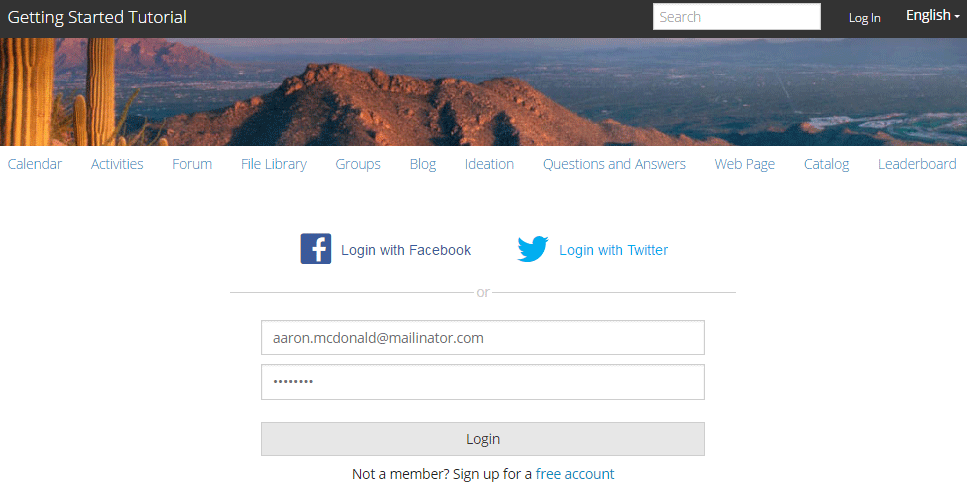

# Geniet van de gepubliceerde site {#experience-the-published-site}

## Bladeren naar nieuwe site bij publicatie {#browse-to-new-site-on-publish}

Nu de nieuwe site voor gemeenschappen is gepubliceerd, bladert u naar de URL die wordt weergegeven bij het maken van de site, maar naar de publicatieserver, bijvoorbeeld:

* Auteur-URL = https://localhost:4502/content/sites/engage/en.html
* URL publiceren = https://localhost:4503/content/sites/engage/en.html

Om verwarring over welk lid bij auteur en publicatie is aangemeld, te minimaliseren, wordt aangeraden voor elke instantie verschillende browsers te gebruiken.

Wanneer de bezoeker van de site voor het eerst op de gepubliceerde site aankomt, is deze doorgaans nog niet aangemeld en is de site anoniem.

`https://localhost:4503/content/sites/engage/en.html {#http-localhost-content-sites-engage-en-html}`

## Anonieme sitebezoeker {#anonymous-site-visitor}

Een anonieme sitebezoeker ziet het volgende in de gebruikersinterface:

* Titel van de site (zelfstudie Aan de slag)
* Geen profielkoppeling
* Geen berichtenkoppeling
* Geen koppeling voor meldingen
* Zoekveld
* Aanmeldingskoppeling
* De merkbanner
* Menukoppelingen voor de componenten die zijn opgenomen in het referentiesjabloon voor sites.

Als u verschillende koppelingen selecteert, bevindt de modus Alleen-lezen zich.

### Anonieme toegang tot JCR {#prevent-anonymous-access-on-jcr} voorkomen

Een bekende beperking stelt de inhoud van de communautaire plaats aan anonieme bezoekers door jcr inhoud en json bloot, hoewel **anonieme toegang toestaan** voor de inhoud van de plaats gehandicapt is. Nochtans, kan dit gedrag worden gecontroleerd gebruikend de Beperkingen van het Schuiven als oplossing.

Voer de volgende stappen uit om de inhoud van uw site te beschermen tegen toegang door anonieme gebruikers via jcr-inhoud en json:

1. Ga naar https:// hostnaam:port/editor.html/content/site/sitename.html voor een AEM-auteurinstantie.

   >[!NOTE]
   >
   >Ga niet naar de gelokaliseerde site.

1. Ga naar **Pagina-eigenschappen**.

   

1. Ga naar **Geavanceerd** tabblad.

1. Schakel **Verificatievereiste** in.

   

1. Voeg het pad van de aanmeldingspagina toe. Bijvoorbeeld **/content/......./GetStarted**.
1. Publiceer de pagina.

## Vertrouwd communautair lid {#trusted-community-member}

Deze ervaring veronderstelt [Aaron McDonald](/help/communities/tutorials.md#demo-users) de rollen van [gemeenschapsmanager en moderator](/help/communities/create-site.md#roles) werd toegewezen. Als dat niet het geval is, gaat u terug naar de auteursomgeving om [de site-instellingen te wijzigen](/help/communities/sites-console.md#modifying-site-properties) en selecteert u Aaron McDonald als zowel communitymanager als moderator.

Selecteer in de rechterbovenhoek `Log in` en onderteken met gebruikersnaam (aaron.mcdonald@mailinator.com) en wachtwoord (password). Meld u aan met de Twitter- of Facebook-referenties.

Zodra u bent aangemeld als lid van de geregistreerde gemeenschap, ziet u de volgende menu-items om op uw communitysite te klikken en deze te verkennen:

* **Met de optie** Profiel kunt u uw profiel weergeven en bewerken.
* [De optie ](/help/communities/configure-messaging.md) Berichten geeft u de opdracht om een berichtensectie te sturen, waar u:

   1. Bekijk de directe berichten die u hebt ontvangen (Postvak IN), verzonden (Items verzenden) en verwijderd (Prullenbak).
   1. Stel nieuwe directe berichten samen om naar individuen en groepen te verzenden.

* [Met de optie ](/help/communities/notifications.md) Meldingen wordt u naar de sectie Meldingen geleid. Hier kunt u uw belangwekkende gebeurtenissen weergeven en de berichtinstellingen bewerken.
* [De ](/help/communities/published-site.md#moderationlink) Administratie leidt u aan de Pagina van de Moderatie van AEM Communities, als u moderatievoorrechten hebt.

U ziet dat de kalenderpagina de startpagina is omdat de gekozen Sjabloon Referentie-site eerst de kalenderfunctie bevatte, gevolgd door de functie Activiteitenstroom, de functie Forum, enzovoort. Deze structuur is zichtbaar vanuit de console [Sitesjabloon](/help/communities/sites.md#edit-site-template) of wanneer u site-eigenschappen wijzigt in de auteursomgeving:

>[!NOTE]
>
>Voor meer informatie over de onderdelen en functies van de Gemeenschappen gaat u naar:
>
>* [Community Components](/help/communities/author-communities.md)  (voor auteurs)
>* [Component, Function en Feature Essentials](/help/communities/essentials.md)  (voor ontwikkelaars)

### Forum link {#forum-link}

U kunt de standaardfunctie voor forums weergeven door de koppeling Forum te selecteren.

Leden kunnen een nieuw onderwerp plaatsen of een onderwerp volgen.

Sitebezoekers kunnen artikelen weergeven en op verschillende manieren sorteren.

### Groepskoppeling {#groups-link}

Aangezien Aaron een groepsbeheerder is, zal het selecteren van de verbinding van Groepen Aaron toestaan om een nieuwe communautaire groep tot stand te brengen door een groepsmalplaatje, beeld te selecteren, of de groep open of geheim is, en het uitnodigen van leden.

Dit is een voorbeeld waarin een groep wordt gemaakt in de publicatieomgeving.

Groepen kunnen ook in de auteursomgeving worden gecreeerd en binnen de communautaire plaats in het auteursmilieu worden beheerd ([Community Groepen console](/help/communities/groups.md)). De ervaring van [het creëren van groepen op auteur](/help/communities/nested-groups.md) is daarna in dit leerprogramma.

Een referentiegroep maken:

1. Selecteer **Nieuwe groep**
1. **Het tabblad Instellingen**

   * Groepsnaam: `Sports`
   * Beschrijving : `A parent group for various sporting groups`.
   * Groepsnaam URL: `sports`
   * Selecteer `Open Group` (een lid van de gemeenschap toestaan om deel te nemen door lid te worden van de gemeenschap)

1. **Tabblad Sjabloon**

   * Selecteer `Reference Group` (bevat een groepfunctie in zijn structuur om geneste groepen toe te staan)

1. Selecteer **Groep maken**

   

Nadat de nieuwe groep wordt gecreeerd, **selecteer de nieuwe Groep van Sport** om twee (genestelde) binnen tot stand te brengen groepen. Aangezien een sitestructuur niet kan beginnen met de groepsfunctie, moet u na het openen van de Sportgroep de koppeling Groepen selecteren:

De tweede set koppelingen, die begint met `Blog`, behoren tot de momenteel geselecteerde groep, de groep `Sports`. Door de verbinding `Groups` van Sport te selecteren, is het mogelijk om twee groepen binnen de groep van Sport te nesten.

Voeg bijvoorbeeld twee `new groups` toe.

* Een met de naam `Baseball`

   * Laat deze ingesteld staan als een `Open Group` (vereist lidmaatschap).
   * Selecteer `Conversational Group` op het tabblad Sjablonen.

* Een met de naam `Gymnastics`

   * Wijzig de instelling in `Member Only Group` (beperkt lidmaatschap).
   * Selecteer `Conversational Group` op het tabblad Sjablonen.

**Opmerking**:

* Mogelijk moet de pagina worden vernieuwd voordat beide groepen worden weergegeven.
* Deze sjabloon bevat de groepfunctie *niet*, zodat het nesten van groepen niet meer mogelijk is.
* Op auteur, verstrekt [de console van Groepen](/help/communities/groups.md) een derde keus - a `Public Group` (facultatief lidmaatschap).

Nadat beide groepen zijn gemaakt, selecteert u de Baseball-groep, een open groep en ziet u de koppelingen:

`Discussions` `What's New` `Members`

De koppelingen van de groep worden weergegeven onder de koppelingen van de hoofdsite en resulteren in de volgende weergave:

Op auteur - met administratieve voorrechten, navigeer aan [de Groepen van Gemeenschappen console](/help/communities/members.md) en voeg Weston McCall aan `Community Engage Gymnastics <uid> Members` groep toe.

Als u doorgaat met publiceren, meldt u zich af als Aaron McDonald en bekijkt u de groepen in de Sports Group als anonieme bezoeker van de site:

* Van homepage
* Koppeling `Groups` selecteren
* Koppeling `Sports` selecteren
* Selecteer de verbinding `Groups` van Sport

Alleen de Baseball-groep is zichtbaar.

Meld u aan bij Weston McCall (weston.mccall@dodgit.com / wachtwoord) en navigeer naar dezelfde locatie. Let op: Weston kan de open `Join` groep `Baseball` en de private `enter or Leave` groep &lt;a2/> openen.`Gymnastics`

### Koppeling naar webpagina {#web-page-link}

Selecteer de koppeling Webpagina om de basiswebpagina weer te geven die in de site is opgenomen. U kunt de standaardinstellingen AEM de ontwerpgereedschappen gebruiken om inhoud aan deze pagina toe te voegen in de ontwerpomgeving.

Ga bijvoorbeeld naar **auteur**-instantie, open de map `engage` in de [Community Sites-console](/help/communities/sites-console.md), selecteer het pictogram **Site openen** om de modus Schrijver bewerken te activeren. Selecteer vervolgens de modus Voorvertoning om de koppeling `Web Page` te selecteren en selecteer vervolgens de modus Bewerken om de componenten Titel en Tekst toe te voegen. Ten slotte publiceert u alleen de pagina of de hele site opnieuw.

### Moderatiekoppeling {#moderationlink}

Wanneer het communitylid moderatievoorrechten heeft, dan zal de verbinding van de Moderatie zichtbaar zijn en het selecteren zal het geposte communautaire inhoud tonen en het toestaan om [gematigd](/help/communities/moderate-ugc.md) op een manier gelijkend op [moderatieconsole](/help/communities/moderation.md) in het auteursmilieu te zijn.

Gebruik de knop Vorige van de browser om terug te keren naar de gepubliceerde site. De meeste consoles zijn niet toegankelijk via globale navigatie in de publicatieomgeving. 

## Zelfregistratie {#self-registration}

Nadat u zich hebt afgemeld, kunt u een nieuwe gebruikersregistratie maken.

* Selecteer `Log In`
* Selecteer `Sign up for a new account`

Standaard is het e-mailadres de aanmeldings-id. Als deze optie is uitgeschakeld, kan de bezoeker zijn of haar eigen aanmeldings-id (gebruikersnaam) invoeren. De gebruikersnaam moet uniek zijn in de publicatieomgeving.

Nadat u de naam, het e-mailadres en het wachtwoord van de gebruiker hebt opgegeven en `Sign Up` hebt geselecteerd, wordt de gebruiker gemaakt en kunnen deze worden ondertekend.

Nadat u zich hebt aangemeld, is de eerste pagina die wordt weergegeven de `Profile`-pagina, die zij kunnen aanpassen.

Als het lid zijn aanmeldings-id vergeet, wordt het e-mailadres gebruikt.

