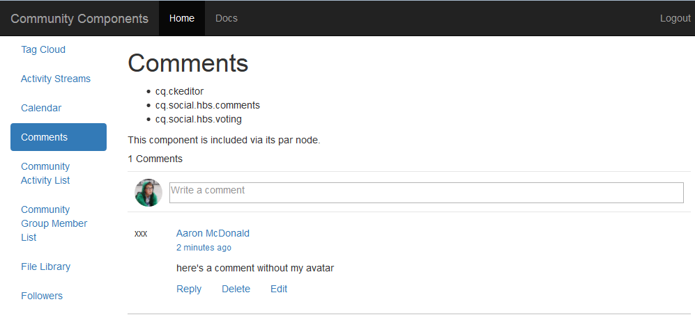

# Ervaar de gepubliceerde site {#experience-the-published-site}

## Bladeren naar nieuwe site bij publicatie {#browse-to-new-site-on-publish}

Nu de nieuwe site voor gemeenschappen is gepubliceerd, bladert u naar de URL die wordt weergegeven bij het maken van de site, maar naar de publicatieserver, bijvoorbeeld

* A\uthor URL = https://localhost:4502/content/sites/engage/en.html
* URL publiceren = https://localhost:4503/content/sites/engage/en.html

Om verwarring over welk lid bij auteur en publicatie is aangemeld, te minimaliseren, wordt aangeraden voor elke instantie verschillende browsers te gebruiken.

Wanneer de bezoeker van de site voor het eerst op de gepubliceerde site aankomt, is deze doorgaans nog niet aangemeld en is de site anoniem.

`https://localhost:4503/content/sites/engage/en.html {#http-localhost-content-sites-engage-en-html}`

## Anonieme sitebezoeker {#anonymous-site-visitor}

Een anonieme sitebezoeker ziet het volgende in de gebruikersinterface:

* Titel van de site. Aan de slag - zelfstudie
* geen profielkoppeling
* geen berichtenkoppeling
* geen koppeling naar meldingen
* zoekveld
* Koppeling met aanmelden
* De merkbanner
* Menukoppelingen voor de componenten die zijn opgenomen in het referentiesjabloon voor de site

Als u verschillende koppelingen selecteert, bevindt de modus Alleen-lezen zich.

### Anonieme toegang tot JCR voorkomen {#prevent-anonymous-access-on-jcr}

Een bekende beperking stelt de inhoud van de communautaire plaats aan anonieme bezoekers door jcr inhoud en json bloot, hoewel het **toestaan van anonieme toegang** voor de inhoud van de plaats wordt onbruikbaar gemaakt. Nochtans, kan dit gedrag worden gecontroleerd gebruikend de Beperkingen van het Schuiven als oplossing.

Voer de volgende stappen uit om de inhoud van uw site te beschermen tegen toegang door anonieme gebruikers via jcr-inhoud en json:

1. Ga naar https://&lt;host>:&lt;port>/editor.html/content/site/&lt;sitename>.html voor een AEM-auteur-exemplaar.

   >[!NOTE]
   >
   >Ga niet naar de gelokaliseerde site.

1. Ga naar **Pagina-eigenschappen**.

   

1. Ga naar **Geavanceerd **tabblad.

   

1. Schakel **verificatievereiste** in.
1. Voeg het pad van de aanmeldingspagina toe. Bijvoorbeeld **/content/......./GetStarted**.
1. Publiceer de pagina.

## Vertrouwd lid van de Gemeenschap {#trusted-community-member}

Deze ervaring veronderstelt [Aaron McDonald](/help/communities/tutorials.md#demo-users) de rol van [gemeenschapsleider en moderator](/help/communities/create-site.md#roles)werd toegewezen. Als dat niet het geval is, gaat u terug naar de auteursomgeving om de site-instellingen [te](/help/communities/sites-console.md#modifying-site-properties) wijzigen en selecteert u Aaron McDonald als gemeenschapsbeheerder en moderator.

Selecteer in de rechterbovenhoek de gebruikersnaam &quot;aaron.mcdonald@mailinator.com&quot; `Log in`en het wachtwoord &quot;password&quot; en onderteken deze. Meld u aan met de Twitter- of Facebook-referenties.

Zodra u bent aangemeld als lid van de geregistreerde gemeenschap, ziet u de volgende menu-items om op uw communitysite te klikken en deze te verkennen:

* **Met de optie Profiel** kunt u uw profiel weergeven en bewerken.
* [De optie Berichten](/help/communities/configure-messaging.md) geeft u de opdracht om een berichtensectie te sturen, waar u:

1. Bekijk de directe berichten die u hebt ontvangen (Postvak IN), verzonden (Items verzenden) en verwijderd (Prullenbak).
1. Stel nieuwe directe berichten samen om naar individuen en groepen te verzenden.

* [De optie Meldingen](/help/communities/notifications.md) geeft u de opdracht om de sectie Meldingen te openen waarin u uw belangwekkende gebeurtenissen kunt bekijken en de berichtinstellingen kunt bewerken.
* [Het beleid](/help/communities/published-site.md#moderationlink) leidt u aan de Pagina van de Moderatie van de Gemeenschappen AEM, als u moderatie voorrechten hebt.

U ziet dat de kalenderpagina de startpagina is omdat de gekozen Sjabloon Referentie-site eerst de kalenderfunctie bevatte, gevolgd door de functie Activiteitenstroom, de functie Forum, enzovoort. Deze structuur is zichtbaar van de console van het Malplaatje [van de](/help/communities/sites.md#edit-site-template) Plaats of wanneer het wijzigen van plaatseigenschappen in het auteursmilieu:

>[!NOTE]
>
>Ga voor meer informatie over communautaire componenten en functies naar
>
>* [Community Components](/help/communities/author-communities.md) (voor auteurs)
>* [Component, Function en Feature Essentials](/help/communities/essentials.md) (voor ontwikkelaars)
>

### Forum-koppeling {#forum-link}

U kunt de standaardfunctie voor forums weergeven door de koppeling Forum te selecteren.

Leden kunnen een nieuw onderwerp plaatsen of een onderwerp volgen.

Sitebezoekers kunnen artikelen weergeven en op verschillende manieren sorteren.

### Groepen koppelen {#groups-link}

Aangezien Aaron een groepsbeheerder is, zal het selecteren van de verbinding van Groepen Aaron toestaan om een nieuwe communautaire groep tot stand te brengen door een groepsmalplaatje, beeld te selecteren, of de groep open of geheim is, en het uitnodigen van leden.

Dit is een voorbeeld waarin een groep wordt gemaakt in de publicatieomgeving.

Groepen kunnen ook in de auteursomgeving worden gecreeerd en binnen de communautaire plaats in het auteursmilieu (de console [van](/help/communities/groups.md)Communautaire Groepen) worden beheerd. In deze zelfstudie wordt vervolgens uitgelegd hoe u groepen [kunt maken over de auteur](/help/communities/nested-groups.md) .

Een referentiegroep maken:

1. Selecteer **Nieuwe groep**
1. **Het tabblad Instellingen**

   * Groepsnaam: `Sports`
   * Beschrijving : `A parent group for various sporting groups`
   * Groepsnaam URL: `sports`
   * selecteren `Open Group` (alle leden van de gemeenschap laten deelnemen door lid te worden)

1. **Tabblad Sjabloon**

   * select `Reference Group` (bevat een groepfunctie in de structuur om geneste groepen toe te staan)

1. Selecteer Groep **maken**

Nadat er een nieuwe groep is gemaakt, **selecteert u de nieuwe groep** Sport om er twee (geneste) groepen in te maken. Aangezien een sitestructuur niet kan beginnen met de groepsfunctie, moet u na het openen van de Sportgroep de koppeling Groepen selecteren:

De tweede set koppelingen, die begint met `Blog`, behoort tot de momenteel geselecteerde groep, de `Sports`groep. Door de verbinding van Sport te selecteren `Groups` , is het mogelijk om twee groepen binnen de groep van Sport te nesten.

Voeg bijvoorbeeld twee n toe `ew groups.`

* een naam `Baseball`

   * laten staan als een `Open Group` (vereist lidmaatschap)
   * Selecteer op het tabblad Sjablonen de optie `Conversational Group`

* een naam `Gymnastics`

   * de instelling wijzigen in `Member Only Group` (beperkt lidmaatschap)
   * Selecteer op het tabblad Sjablonen de optie `Conversational Group`

**Kennisgeving **:

* Mogelijk moet de pagina worden vernieuwd voordat beide groepen worden weergegeven
* this template does *not *include the groups function, so no more nesting of groups will be unable
* op auteur, verstrekt de console [van](/help/communities/groups.md) Groepen een derde keus - een `Public Group` (facultatief lidmaatschap)

Nadat beide groepen zijn gemaakt, selecteert u de Baseball-groep, een open groep en ziet u de koppelingen:

`Discussions` `What's New` `Members`

De koppelingen van de groep worden weergegeven onder de koppelingen van de hoofdsite en resulteren in de volgende weergave:

Op auteur - met administratieve voorrechten, navigeer aan de console [van de Groepen van](/help/communities/members.md) Gemeenschappen en voeg Weston McCall aan de `Community Engage Gymnastics <uid> Members` groep toe.

Als u doorgaat met publiceren, meldt u zich af als Aaron McDonald en bekijkt u de groepen in de Sports Group als anonieme bezoeker van de site:

* van homepage
* Selecteer `Groups`koppeling
* Selecteer `Sports`koppeling
* Selecteer de `Groups`koppeling Sport

Alleen de Baseball-groep is zichtbaar.

Meld u aan bij Weston McCall (weston.mccall@dodgit.com / wachtwoord) en navigeer naar dezelfde locatie. Let op: Weston kan de open `Join` groep en `Baseball` de private `enter or Leave` `Gymnastics`groep aantrekken.

### Koppeling naar webpagina {#web-page-link}

Selecteer de koppeling Webpagina om de basiswebpagina weer te geven die in de site is opgenomen. De standaard AEM-ontwerpgereedschappen kunnen worden gebruikt om inhoud aan deze pagina toe te voegen in de ontwerpomgeving.

Ga bijvoorbeeld naar de **auteur** -instantie, open de `engage` map in de console Communitysites en selecteer het pictogram Site **** openen om de modus Schrijfbewerking te openen. Selecteer vervolgens de voorvertoningsmodus om de `Web Page`koppeling te selecteren en selecteer vervolgens de bewerkingsmodus om titel- en tekstcomponenten toe te voegen. Ten slotte publiceert u alleen de pagina of de hele site opnieuw.

### Moderniseringskoppeling {#moderationlink}

Wanneer het communautaire lid moderatievoorrechten heeft, dan zal de verbinding van de Moderatie zichtbaar zijn en het selecteren zal het geposte communautaire inhoud tonen en het toestaan om op een manier te worden [gematigd](/help/communities/moderate-ugc.md) gelijkend op de [moderatieconsole](/help/communities/moderation.md) in het auteursmilieu.

Gebruik de knop Vorige van de browser om terug te keren naar de gepubliceerde site. De meeste consoles zijn niet toegankelijk via globale navigatie in de publicatieomgeving. 

## Zelfregistratie {#self-registration}

Nadat u zich hebt afgemeld, kunt u een nieuwe gebruikersregistratie maken.

* select `Log In`
* select `Sign up for a new account`

 

Standaard is het e-mailadres de aanmeldings-id. Als deze optie is uitgeschakeld, kan de bezoeker zijn of haar eigen aanmeldings-id (gebruikersnaam) invoeren. De gebruikersnaam moet uniek zijn in de publicatieomgeving.

Als u de naam, het e-mailadres en het wachtwoord van de gebruiker hebt opgegeven, `Sign Up`wordt de gebruiker gemaakt en kunnen deze worden ondertekend.

Nadat u zich hebt aangemeld, is de eerste weergegeven pagina de `Profile`pagina die ze kunnen aanpassen.

Als het lid zijn aanmeldings-id vergeet, wordt het e-mailadres gebruikt.

