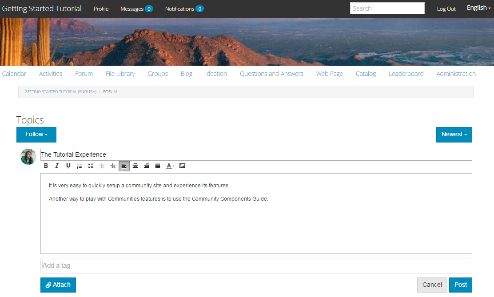
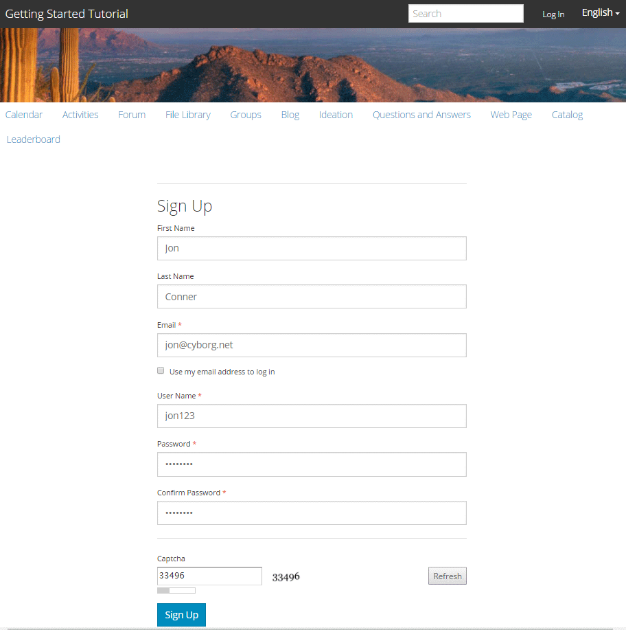

# De gepubliceerde site beleven {#experience-the-published-site}

## Bladeren naar nieuwe site op Publish {#browse-to-new-site-on-publish}

Nu de nieuwe site voor gemeenschappen is gepubliceerd, bladert u naar de URL die wordt weergegeven bij het maken van de site, maar bijvoorbeeld op de publicatieserver:

* Auteur-URL = https://localhost:4502/content/sites/engage/en.html
* PUBLISH URL = https://localhost:4503/content/sites/engage/en.html

Om verwarring over welk lid bij auteur en publicatie is aangemeld, te minimaliseren, wordt aangeraden voor elke instantie verschillende browsers te gebruiken.

Wanneer de bezoeker van de site voor het eerst op de gepubliceerde site aankomt, is deze doorgaans nog niet aangemeld en is deze anoniem.

`https://localhost:4503/content/sites/engage/en.html {#http-localhost-content-sites-engage-en-html}`

## Anonieme sitebezoeker {#anonymous-site-visitor}

Een anonieme sitebezoeker ziet het volgende in de gebruikersinterface:

* Titel van de site (zelfstudie Aan de slag)
* Geen profielkoppeling
* Geen berichtenkoppeling
* Geen koppeling voor meldingen
* Zoekveld
* Aanmeldingskoppeling
* De merkbanner
* Menukoppelingen voor de componenten die zijn opgenomen in het referentiesjabloon voor sites.

Als u verschillende koppelingen selecteert, ziet u dat deze zich in de modus Alleen-lezen bevinden.

### Anonieme toegang tot JCR voorkomen {#prevent-anonymous-access-on-jcr}

Een bekende beperking stelt de inhoud van de communautaire plaats aan anonieme bezoekers door jcr inhoud en json bloot, hoewel **anonieme toegang** toestaat voor de inhoud van de plaats wordt onbruikbaar gemaakt. Nochtans, kan dit gedrag worden gecontroleerd gebruikend de Beperkingen van het Schuiven als oplossing.

Voer de volgende stappen uit om de inhoud van uw site te beschermen tegen toegang door anonieme gebruikers via jcr-inhoud en json:

1. Ga bij AEM instantie Auteur naar https:// hostnaam:port/editor.html/content/site/sitename.html.

   >[!NOTE]
   >
   >Ga niet naar de gelokaliseerde site.

1. Ga naar **Eigenschappen van de Pagina**.

   

1. Ga naar **Geavanceerd** tabel.

1. Laat **Vereiste van de Authentificatie** toe.

   

1. Voeg het pad van de aanmeldingspagina toe. Bijvoorbeeld **/content/..../GetStarted**.
1. Publish de pagina.

## Vertrouwd lid van de Gemeenschap {#trusted-community-member}

Deze ervaring veronderstelt [ Aaron McDonald ](/help/communities/tutorials.md#demo-users) werd toegewezen de rollen van [ communautaire manager en moderator ](/help/communities/create-site.md#roles). Als niet, terugkeer aan het auteursmilieu aan [ wijzigt de plaatsinstellingen ](/help/communities/sites-console.md#modifying-site-properties) en selecteert Aaron McDonald als zowel communautaire manager als moderator.

Selecteer in de rechterbovenhoek `Log in` en onderteken met gebruikersnaam (aaron.mcdonald@mailinator.com) en wachtwoord (password). U kunt zich aanmelden met Twitter- of Facebook-referenties.

Zodra u bent aangemeld als lid van de geregistreerde gemeenschap, ziet u de volgende menu-items om op uw communitysite te klikken en deze te verkennen:

* **de optie van het Profiel** laat u uw profiel bekijken en uitgeven.
* [ de optie van Berichten ](/help/communities/configure-messaging.md) geeft u de opdracht om overseinensectie te leiden, waar u het volgende kunt doen:

   1. Geef de directe berichten weer die u hebt ontvangen (Postvak IN), verzonden (Items verzenden) en verwijderd (Prullenmand).
   1. Stel nieuwe directe berichten samen zodat u naar individuen en groepen kunt verzenden.

* [ Berichten ](/help/communities/notifications.md) optie leidt u aan berichtensectie, waar u uw gebeurtenissen van belang kunt bekijken en berichtmontages uitgeven.
* [ Beleid ](/help/communities/published-site.md#moderationlink) leidt u aan de Pagina van de Moderatie van AEM Communities, als u moderatievoorrechten hebt.

U ziet dat de kalenderpagina de startpagina is omdat de gekozen Sjabloon Referentie-site eerst de kalenderfunctie bevatte, gevolgd door de functie Activiteitenstroom, de functie Forum, enzovoort. Deze structuur is zichtbaar van de [ console van het Malplaatje van de Plaats ](/help/communities/sites.md#edit-site-template) of wanneer het wijzigen van plaatseigenschappen in het auteursmilieu:

>[!NOTE]
>
>Voor meer informatie over de onderdelen en functies van de Gemeenschappen gaat u naar:
>
>* [ Componenten van Gemeenschappen ](/help/communities/author-communities.md) (voor auteurs)
>* [ Component, Functie, en de Hoofdzaak van de Eigenschap ](/help/communities/essentials.md) (voor ontwikkelaars)

### Forum-koppeling {#forum-link}

U kunt de standaardfunctie voor forums weergeven door de koppeling Forum te selecteren.

Leden kunnen een nieuw onderwerp plaatsen of een onderwerp volgen.

Sitebezoekers kunnen artikelen weergeven en op verschillende manieren sorteren.

### Groepen koppelen {#groups-link}

Aangezien Aaron een groepsbeheerder is, laat het selecteren van de verbinding van Groepen Aaron een communautaire groep tot stand brengen door een groepsmalplaatje, beeld te selecteren, of de groep open of geheim is, en het uitnodigen van leden.

Dit is een voorbeeld waarin een groep wordt gemaakt in de publicatieomgeving.

De groepen kunnen ook in het auteursmilieu worden gecreeerd en binnen de communautaire plaats in het auteursmilieu worden geleid ([ Community console van Groepen ](/help/communities/groups.md)). De ervaring van [ creërend groepen op auteur ](/help/communities/nested-groups.md) is daarna in dit leerprogramma.

Een referentiegroep maken:

1. Selecteer **Nieuwe Groep**
1. **het lusje van Montages**

   * Groepsnaam: `Sports`
   * Beschrijving: `A parent group for various sporting groups` .
   * Groepsnaam URL: `sports`
   * Selecteer `Open Group` (een lid van de gemeenschap toestaan deel te nemen door lid te worden)

1. **lusje van het Malplaatje**

   * Selecteer `Reference Group` (bevat een groepfunctie in de structuur om geneste groepen toe te staan)

1. Selecteer **tot Groep** leiden

   

Nadat de nieuwe groep wordt gecreeerd, **selecteer de nieuwe groep van Sport** om twee (genestelde) groepen binnen het tot stand te brengen. Aangezien een sitestructuur niet kan beginnen met de groepsfunctie, moet u na het openen van de Sportgroep de koppeling Groepen selecteren:

De tweede set koppelingen, die begint met `Blog` , behoort tot de groep die momenteel is geselecteerd, de `Sports` -groep. Als u de koppeling Sport `Groups` selecteert, kunt u twee groepen nesten in de groep Sport.

Voeg bijvoorbeeld twee `new groups` toe.

* Een naam `Baseball`

   * Laat deze ingesteld staan als een `Open Group` (vereist lidmaatschap).
   * Selecteer op het tabblad Sjablonen de optie `Conversational Group` .

* Een naam `Gymnastics`

   * Wijzig de instelling in `Member Only Group` (beperkt lidmaatschap).
   * Selecteer op het tabblad Sjablonen de optie `Conversational Group` .

**Bericht**:

* Mogelijk moet de pagina worden vernieuwd voordat beide groepen worden weergegeven.
* Dit malplaatje ** omvat niet de groepsfunctie, zodat is het verder nesten van groepen mogelijk.
* Op auteur, verstrekt de [ console van Groepen ](/help/communities/groups.md) een derde keus - a `Public Group` (facultatief lidmaatschap).

Nadat beide groepen zijn gemaakt, selecteert u de Baseball-groep, een open groep en ziet u de koppelingen:

`Discussions` `What's New` `Members`

De koppelingen van de groep worden weergegeven onder de koppelingen van de hoofdsite en resulteren in de volgende weergave:

Op auteur - met administratieve voorrechten, navigeer aan de [ console van de Groepen van Gemeenschappen ](/help/communities/members.md) en voeg Weston McCall aan de `Community Engage Gymnastics <uid> Members` groep toe.

Als u doorgaat met publiceren, meldt u zich af als Aaron McDonald en bekijkt u de groepen in de Sports Group als anonieme bezoeker van de site:

* Van homepage
* Koppeling selecteren `Groups`
* Koppeling selecteren `Sports`
* De koppeling Sport&#39; `Groups` selecteren

Alleen de Baseball-groep is zichtbaar.

Meld u aan bij Weston McCall (weston.mccall@dodgit.com / wachtwoord) en navigeer naar dezelfde locatie. Let op: Weston kan `Join` de open `Baseball` -groep en `enter or Leave` de private `Gymnastics` -groep  .

### Koppeling naar webpagina {#web-page-link}

Selecteer de koppeling Webpagina om de basiswebpagina weer te geven die in de site is opgenomen. U kunt de standaardinstellingen AEM de ontwerpgereedschappen gebruiken om inhoud aan deze pagina toe te voegen in de ontwerpomgeving.

Bijvoorbeeld, ga naar **auteur** instantie, open de `engage` omslag in de [ console van de Plaatsen van Gemeenschappen ](/help/communities/sites-console.md), selecteer het **Open pictogram van de Plaats** om auteur in te gaan geef wijze uit. Selecteer vervolgens de voorvertoningsmodus zodat u de koppeling `Web Page` kunt selecteren en selecteer vervolgens de bewerkingsmodus om titel- en tekstcomponenten toe te voegen. Laatste, publiceer of enkel de pagina of de volledige plaats opnieuw.

### Moderniseringskoppeling {#moderationlink}

Wanneer het lid van de gemeenschap moderatie voorrechten heeft, dan is de verbinding van de Moderatie zichtbaar. Het selecteren van de verbinding toont de communautaire inhoud die wordt gepost, en laat het [ gematigd ](/help/communities/moderate-ugc.md) op een manier gelijkend op de [ moderatieconsole ](/help/communities/moderation.md) in het auteursmilieu zijn.

Gebruik de knop Vorige van de browser om terug te keren naar de gepubliceerde site. De meeste consoles zijn niet toegankelijk via globale navigatie in de publicatieomgeving.

## Zelfregistratie {#self-registration}

Nadat u zich hebt afgemeld, kunt u een gebruikersregistratie maken.

* Selecteren `Log In`
* Selecteren `Sign up for a new account`

Standaard is het e-mailadres de aanmeldings-id. Als deze optie is uitgeschakeld, kan de bezoeker zijn of haar eigen aanmeldings-id (gebruikersnaam) invoeren. De gebruikersnaam moet uniek zijn in de publicatieomgeving.

Als u de naam, het e-mailadres en het wachtwoord van de gebruiker hebt opgegeven en `Sign Up` hebt geselecteerd, wordt de gebruiker gemaakt en kunnen deze worden ondertekend.

Nadat u zich hebt aangemeld, is de eerste pagina die wordt weergegeven de `Profile` -pagina die zij kunnen aanpassen.

Als het lid zijn aanmeldings-id vergeet, wordt het e-mailadres gebruikt.

