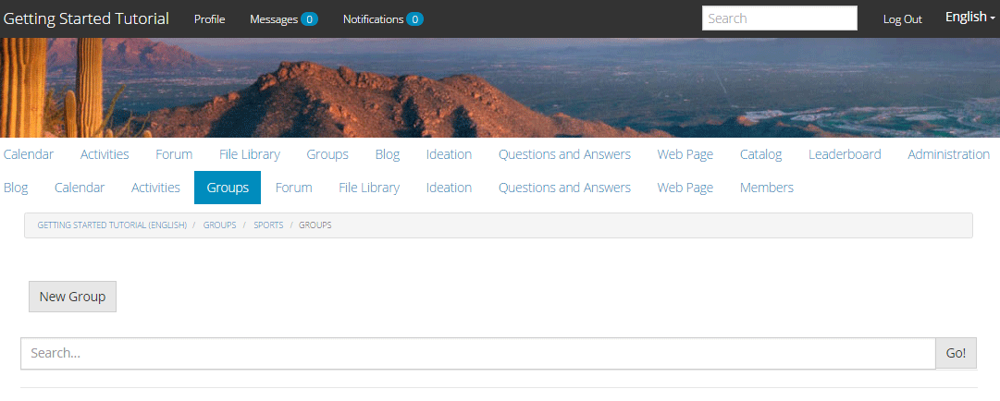

# De gepubliceerde site beleven {#experience-the-published-site}

## Bladeren naar nieuwe site bij publicatie {#browse-to-new-site-on-publish}

Nu de nieuwe site voor gemeenschappen is gepubliceerd, bladert u naar de URL die wordt weergegeven bij het maken van de site, maar bijvoorbeeld op de publicatieserver:

* Auteur-URL = https://localhost:4502/content/sites/engage/en.html
* URL publiceren = https://localhost:4503/content/sites/engage/en.html

Om verwarring over welk lid bij auteur en publicatie is aangemeld, te minimaliseren, wordt aangeraden voor elke instantie verschillende browsers te gebruiken.

Wanneer de bezoeker van de site voor het eerst op de gepubliceerde site aankomt, is deze doorgaans nog niet aangemeld en is deze anoniem.

`https://localhost:4503/content/sites/engage/en.html {#http-localhost-content-sites-engage-en-html}`

## Anonieme sitebezoeker {#anonymous-site-visitor}

Een anonieme sitebezoeker ziet het volgende in de gebruikersinterface:

* Titel van de site (zelfstudie Aan de slag)
* Geen profielkoppeling
* Geen berichtenkoppeling
* Geen koppeling voor meldingen
* Zoekveld
* Aanmeldingskoppeling
* De merkbanner
* Menukoppelingen voor de componenten die zijn opgenomen in het referentiesjabloon voor sites.

Als u verschillende koppelingen selecteert, ziet u dat deze zich in de modus Alleen-lezen bevinden.

### Anonieme toegang tot JCR voorkomen {#prevent-anonymous-access-on-jcr}

Een bekende beperking stelt de inhoud van de communautaire site aan anonieme bezoekers via jcr-inhoud en json bloot, hoewel **anonieme toegang toestaan** is uitgeschakeld voor de inhoud van de site. Nochtans, kan dit gedrag worden gecontroleerd gebruikend de Beperkingen van het Schuiven als oplossing.

Voer de volgende stappen uit om de inhoud van uw site te beschermen tegen toegang door anonieme gebruikers via jcr-inhoud en json:

1. Ga bij AEM instantie Auteur naar https:// hostnaam:port/editor.html/content/site/sitename.html.

   >[!NOTE]
   >
   >Ga niet naar de gelokaliseerde site.

1. Ga naar **Pagina-eigenschappen**.

   

1. Ga naar **Geavanceerd** tab.

1. Inschakelen **Verificatievereiste**.

   

1. Voeg het pad van de aanmeldingspagina toe. Bijvoorbeeld: **/content/..../GetStarted**.
1. Publiceer de pagina.

## Vertrouwd lid van de Gemeenschap {#trusted-community-member}

Deze ervaring gaat uit van [Aaron McDonald](/help/communities/tutorials.md#demo-users) is toegewezen aan de rollen van [gemeenschapsbeheerder en moderator](/help/communities/create-site.md#roles). Zo niet, ga dan terug naar de auteursomgeving naar [de site-instellingen wijzigen](/help/communities/sites-console.md#modifying-site-properties) en selecteer Aaron McDonald als gemeenschapsleider en moderator.

Selecteer in de rechterbovenhoek `Log in`en ondertekenen met gebruikersnaam (aaron.mcdonald@mailinator.com) en wachtwoord (wachtwoord). U kunt zich aanmelden met Twitter- of Facebook-referenties.

Zodra u bent aangemeld als lid van de geregistreerde gemeenschap, ziet u de volgende menu-items om op uw communitysite te klikken en deze te verkennen:

* **Profiel** kunt u uw profiel bekijken en bewerken.
* [Berichten](/help/communities/configure-messaging.md) de optie geeft u de opdracht om berichten te sturen, waar u het volgende kunt doen:

   1. Geef de directe berichten weer die u hebt ontvangen (Postvak IN), verzonden (Items verzenden) en verwijderd (Prullenmand).
   1. Stel nieuwe directe berichten samen zodat u naar individuen en groepen kunt verzenden.

* [Meldingen](/help/communities/notifications.md) deze optie geeft u door naar de sectie Meldingen, waarin u uw belangwekkende gebeurtenissen kunt bekijken en de berichtinstellingen kunt bewerken.
* [Administratie](/help/communities/published-site.md#moderationlink) leidt u aan de Pagina van de Moderatie van AEM Communities, als u moderatie voorrechten hebt.

U ziet dat de kalenderpagina de startpagina is omdat de gekozen Sjabloon Referentie-site eerst de kalenderfunctie bevatte, gevolgd door de functie Activiteitenstroom, de functie Forum, enzovoort. Deze structuur is zichtbaar vanuit de [Sitesjabloon](/help/communities/sites.md#edit-site-template) console of bij het wijzigen van site-eigenschappen in de ontwerpomgeving:

>[!NOTE]
>
>Voor meer informatie over de onderdelen en functies van de Gemeenschappen gaat u naar:
>
>* [Community-componenten](/help/communities/author-communities.md) (voor auteurs)
>* [Component, Function en Feature Essentials](/help/communities/essentials.md) (voor ontwikkelaars)

### Forum-koppeling {#forum-link}

U kunt de standaardfunctie voor forums weergeven door de koppeling Forum te selecteren.

Leden kunnen een nieuw onderwerp plaatsen of een onderwerp volgen.

Sitebezoekers kunnen artikelen weergeven en op verschillende manieren sorteren.

### Groepen koppelen {#groups-link}

Aangezien Aaron een groepsbeheerder is, laat het selecteren van de verbinding van Groepen Aaron een communautaire groep tot stand brengen door een groepsmalplaatje, beeld te selecteren, of de groep open of geheim is, en het uitnodigen van leden.

Dit is een voorbeeld waarin een groep wordt gemaakt in de publicatieomgeving.

Groepen kunnen ook in de auteursomgeving worden gecreeerd en binnen de communautaire plaats in het auteursmilieu worden beheerd ([Community Group-console](/help/communities/groups.md)). De ervaring van [groepen maken op auteur](/help/communities/nested-groups.md) is volgende in deze zelfstudie.

Een referentiegroep maken:

1. Selecteren **Nieuwe groep**
1. **Het tabblad Instellingen**

   * Groepsnaam: `Sports`
   * Omschrijving: `A parent group for various sporting groups`.
   * Groepsnaam URL: `sports`
   * Selecteren `Open Group` ( elk lid van de gemeenschap toestaan deel te nemen door lid te worden )

1. **Tabblad Sjabloon**

   * Selecteren `Reference Group` (bevat een groepfunctie in de structuur om geneste groepen toe te staan)

1. Selecteren **Groep maken**

   

Nadat nieuwe groep is gemaakt, **Selecteer de nieuwe groep Sport** om er twee (geneste) groepen in te maken. Aangezien een sitestructuur niet kan beginnen met de groepsfunctie, moet u na het openen van de Sportgroep de koppeling Groepen selecteren:

De tweede set koppelingen, te beginnen met `Blog`, behoren tot de momenteel geselecteerde groep, `Sports` groep. Door de Sport te selecteren&#39; `Groups` kunnen twee groepen in de groep Sport worden genest.

Voeg bijvoorbeeld twee `new groups`.

* Eén naam `Baseball`

   * Laat het als een `Open Group` (vereist lidmaatschap).
   * Selecteer op het tabblad Sjablonen de optie `Conversational Group`.

* Eén naam `Gymnastics`

   * De instelling wijzigen in `Member Only Group` (beperkt lidmaatschap).
   * Selecteer op het tabblad Sjablonen de optie `Conversational Group`.

**Kennisgeving**:

* Mogelijk moet de pagina worden vernieuwd voordat beide groepen worden weergegeven.
* Deze sjabloon doet dit *niet* omvat de groepfunctie, zodat het nesten van groepen niet meer mogelijk is.
* Op auteur: [Groepsconsole](/help/communities/groups.md) biedt een derde keuze - a `Public Group` (optioneel lidmaatschap).

Nadat beide groepen zijn gemaakt, selecteert u de Baseball-groep, een open groep en ziet u de koppelingen:

`Discussions` `What's New` `Members`

De koppelingen van de groep worden weergegeven onder de koppelingen van de hoofdsite en resulteren in de volgende weergave:

Navigeer bij de auteur - met beheerdersrechten naar de [console Gemeenschappen/Groepen](/help/communities/members.md) en voegt Weston McCall toe aan de `Community Engage Gymnastics <uid> Members` groep.

Als u doorgaat met publiceren, meldt u zich af als Aaron McDonald en bekijkt u de groepen in de Sports Group als anonieme bezoeker van de site:

* Van homepage
* Selecteren `Groups` link
* Selecteren `Sports` link
* Selecteer de Sport&#39; `Groups` link

Alleen de Baseball-groep is zichtbaar.

Meld u aan bij Weston McCall (weston.mccall@dodgit.com / wachtwoord) en navigeer naar dezelfde locatie. Let op: Weston kan `Join` open `Baseball` groep en `enter or Leave` particuliere `Gymnastics` groep.

### Koppeling naar webpagina {#web-page-link}

Selecteer de koppeling Webpagina om de basiswebpagina weer te geven die in de site is opgenomen. U kunt de standaardinstellingen AEM de ontwerpgereedschappen gebruiken om inhoud aan deze pagina toe te voegen in de ontwerpomgeving.

Ga bijvoorbeeld naar **auteur** -instantie, opent u de `engage` in de [Community Sites-console](/help/communities/sites-console.md), selecteert u de **Site openen** pictogram om de bewerkingsmodus voor auteurs te activeren. Selecteer vervolgens de voorvertoningsmodus, zodat u de optie `Web Page` en selecteert u vervolgens de bewerkingsmodus om de componenten Titel en Tekst toe te voegen. Laatste, publiceer of enkel de pagina of de volledige plaats opnieuw.

### Moderniseringskoppeling {#moderationlink}

Wanneer het lid van de gemeenschap moderatie voorrechten heeft, dan is de verbinding van de Moderatie zichtbaar. Als u de koppeling selecteert, wordt de inhoud van de community die wordt gepost, weergegeven en kan deze worden [gematigd](/help/communities/moderate-ugc.md) op vergelijkbare wijze als de [moderatieconsole](/help/communities/moderation.md) in de ontwerpomgeving.

Gebruik de knop Vorige van de browser om terug te keren naar de gepubliceerde site. De meeste consoles zijn niet toegankelijk via globale navigatie in de publicatieomgeving.

## Zelfregistratie {#self-registration}

Nadat u zich hebt afgemeld, kunt u een gebruikersregistratie maken.

* Selecteren `Log In`
* Selecteren `Sign up for a new account`

Standaard is het e-mailadres de aanmeldings-id. Als deze optie is uitgeschakeld, kan de bezoeker zijn of haar eigen aanmeldings-id (gebruikersnaam) invoeren. De gebruikersnaam moet uniek zijn in de publicatieomgeving.

Nadat u de naam, het e-mailadres en het wachtwoord van de gebruiker hebt opgegeven, selecteert u `Sign Up` maakt de gebruiker en stelt deze in staat te ondertekenen.

Nadat u zich hebt aangemeld, wordt de eerste pagina weergegeven met de bijbehorende `Profile` pagina, die ze kunnen aanpassen.

Als het lid zijn aanmeldings-id vergeet, wordt het e-mailadres gebruikt.

