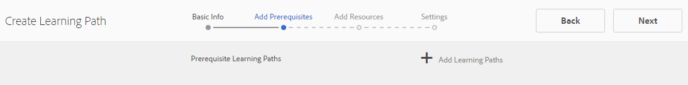

# Bronnenconsole inschakelen {#enablement-resources-console}

Voor AEM Communities, is de console van Middelen waar de Managers [van](users.md) Enablement creeert, leidt en middelen aan leden van een enablement communautaire plaats toewijst.

## Vereisten {#requirements}

Alvorens enablement middelen voor een communautaire plaats toe te voegen, moeten de instanties AEM behoorlijk worden gevormd, die omvatten:

* SCORM
* FFmpeg

Voor details, zie het [Vormen Enablement](enablement.md).

>[!CAUTION]
>
>Als SCORM na de verwezenlijking van de communautaire plaats wordt geïnstalleerd, om het even welke toelatingsmiddelen aanwezig alvorens SCORM wordt geïnstalleerd moet worden opnieuw gemaakt.

>[!NOTE]
>
>Met de versie van [AEM 6.3](deploy-communities.md#latestfeaturepack) en de gelijkwaardige eigenschap van Gemeenschappen verpakt [AEM 6.2 FP3](deploy-communities.md#latestfeaturepack) en [AEM 6.1 FP7](https://docs.adobe.com/content/docs/en/aem/6-1/deploy/communities.html#Latest het Pak van de Eigenschap), vereist de enablement eigenschap niet meer een [gegevensbestand](mysql.md)MySQL.

## Terminologie {#terminology}

### Resource {#resource}

Middelen zijn essentieel voor een [activeringsgemeenschap](overview.md#enablement-community). Het zijn de materialen die aan leden worden toegewezen die hen toelaten om hun vaardigheden te verbeteren.

Kenmerken van een bron:

* Mag van het type zijn:
   * Afbeelding (JPG, PNG, GIF, BMP)
   * Video (MP4)
   * Flash (SWF)
   * Document (PDF)
   * Quiz (SCORM)
* Er kan naar worden verwezen vanuit een of meer leerpaden.

### Leerpad {#learning-path}

Een leerpad is een logische reeks actiemiddelen die samen zijn gegroepeerd om eenvoudig toe te wijzen aan leden.

### Ledengroep {#members-group}

Wanneer een communautaire plaats wordt gecreeerd, wordt de naam die aan de plaats voor URL wordt gegeven gebruikt in de verwezenlijking van de [plaats specifieke gebruikersgroepen](users.md) die met diverse toestemmingen voor diverse rollen worden gevormd. Al deze automatisch gemaakte groepen krijgen de voorvoegsel `Community <site-name>`.

Een dergelijke gebruikersgroep is een `Community <site-name> Members` groep die geregistreerde gebruikers in de publicatieomgeving identificeert als leden van de community. Zie de zelfstudie Aan de [slag met AEM Communities for Enablement](getting-started-enablement.md) voor een voorbeeld.

Voor [betrokkenheidsgemeenschappen](overview.md#egagementcommunity)is het redelijk bezoekers van de site toe te staan zichzelf te registreren of sociale aanmelding te gebruiken, waarna ze automatisch worden toegevoegd aan de ledengroep.

Voor [enablement gemeenschappen](overview.md#enablement-community), wordt geadviseerd om de plaats privé te maken die dan een beheerder vereist om gebruikers aan de lidgroep toe te voegen.

## Toegang tot de Middelen van Enablement van een Plaats van de Gemeenschap {#accessing-a-community-site-s-enablement-resources}

### Navigeren naar bronnen van gemeenschappen {#navigate-to-communities-resources}

In het auteursmilieu, om de console van Middelen te bereiken

* Vanuit globale navigatie: **[!UICONTROL Navigation]** > **[!UICONTROL Communities]** > **[!UICONTROL Resources]**

   

### Een Community-site selecteren {#select-a-community-site}

De console van de Middelen van Gemeenschappen zal alle communautaire plaatsen tonen.

De middelen van Enablement worden gecreeerd voor een specifieke communautaire plaats na het selecteren van de plaats van de console van Middelen.

Zodra een specifieke communautaire plaats wordt geselecteerd, zijn om het even welke bestaande enablement middelen en het leren wegen toegankelijk voor het beheren en wijzigen, en de nieuwe enablement middelen en het leren wegen kunnen worden gecreeerd.

#### Zoeken {#search-features}

Selecteer het pictogram voor het in- en uitschakelen van het zijpaneel om te zoeken naar een activeringsbron of leerpad. Als deze optie is ingeschakeld, wordt een zoekvenster aan de linkerkant van de console geopend met een tekstvak waarin u zoektermen kunt invoeren.

#### Selectiemodus {#selection-mode}

Als u meerdere bronnen voor activering wilt selecteren, selecteert u eerst de muis door de muisaanwijzer op de kaart te plaatsen en vervolgens het pictogram van het vinkje te selecteren. Als u een andere kaart selecteert, wordt deze aan de selectiegroep toegevoegd. Als u een tweede keer de-selectiekaart selecteert, wordt de kaart uitgeschakeld.

## Een bron maken {#create-a-resource}

Om een nieuw enablement middel aan de communautaire plaats toe te voegen

* Selecteer het `Create` pictogram.
* Selecteer **[!UICONTROL Resource]** in het submenu dat wordt weergegeven.

Dit lanceert een geleidelijke proces van:

* De bron beschrijven (naam, kaartafbeelding en tekst).
* De broninhoud selecteren.
* Een omslagafbeelding voor de bron selecteren.
* Broncontactpersonen identificeren.
* Bronnen toewijzen aan leden.

Wanneer de bron deel uitmaakt van een cursus, dient u een leerpad toe te wijzen aan de leden. De taken kunnen worden toegevoegd nadat het enablement middel is gecreeerd.

### 1 Basisinformatie {#basic-info}

* **[!UICONTROL Afbeelding toevoegen]**

   (*Facultatief*) een beeld om op de kaart voor het enablement middel in de de taakpagina van het lid evenals de console van Middelen te tonen. De afbeelding wordt geselecteerd in het lokale bestandssysteem van de server. Als er geen afbeelding wordt opgegeven, wordt een miniatuur gegenereerd voor de geüploade bron.

   ***Opmerking***: De aanbevolen afbeeldingsgrootte is niet gewoon 480 x 480 pixels. Door het responsieve ontwerp van de kaarten tot verschillende browserafmetingen, varieert de weergavegrootte van 220 x 165 pixels tot 400 x 165 pixels.

* **[!UICONTROL Sitenaam]**

   (*alleen*-lezen) De communitysite waaraan de bron wordt toegevoegd.

* **[!UICONTROL Bronnaam]**

   (*Vereist*) De weergavenaam voor de bron. Een geldige knooppuntnaam wordt gecreeerd van de vertoningsnaam.

* **[!UICONTROL Tags]**

   (*Optioneel*) U kunt een of meer tags kiezen die de enablement-bron aan een of meer catalogi koppelen. Zie [Tagging Enablement Resources](tag-resources.md).

* **[!UICONTROL Tonen in catalogus]**

   Als deze optie uitgeschakeld is, wordt de resource voor activering niet weergegeven in een catalogus. Indien gecontroleerd, zal het enablement middel in alle catalogi tenzij [voorgefiltreerd](catalog-developer-essentials.md#pre-filters) of de lidfilters van UI verschijnen. De optie Standaard is uitgeschakeld.

* **[!UICONTROL Beschrijving]**

   (*Optioneel*) De beschrijving die moet worden weergegeven voor de enablement-bron.

* **[!UICONTROL Klein element]**

   (*Optioneel*) Selectie uit AEM-middelen. Een miniatuurafbeelding die de bron vertegenwoordigt in de publicatieomgeving, zoals in een catalogus.

* **[!UICONTROL Groot element]**

   (*Optioneel*) Selectie uit AEM-middelen. Een grote afbeelding die de bron in de publicatieomgeving vertegenwoordigt, bijvoorbeeld op de hoofdpagina voor een bron.

* **[!UICONTROL Content Fragment-element]**

   (*Optioneel*) Selectie uit AEM-middelen. A content fragment that may be referenced in the publish environment, but is not in use by default.

* Selecteer **[!UICONTROL Volgende]**

### 2 Inhoud toevoegen {#add-content}

Hoewel het lijkt alsof er meerdere bronnen voor activering zijn geselecteerd, is er slechts één optie toegestaan.

Selecteer `'+' icon`in de rechterbovenhoek het item om het proces voor het kiezen van de bron te starten door de bron te identificeren.

* **[!UICONTROL Uploaden vanuit mijn lokale bestanden]**

   Als u bestanden uploadt vanuit het lokale bestandssysteem, gebruikt u de native bestandsbrowser om een bestand te selecteren en te uploaden. Ondersteunde bestandstypen zijn SCORM.zip (HTML5 of SWF), MP4-video, SWF, PDF en afbeeldingstypen (JPG, PNG, GIF, BMP). De bestandsnaam wordt de naam van het element, dat wordt toegevoegd aan de elementenbibliotheek.

* **[!UICONTROL Middelenbibliotheek doorbladeren]**

   Selecteer een optie in de middelenbibliotheek. De selectie is beperkt tot de selecties die zichtbaar zijn binnen de site van de community.

* **[!UICONTROL Een externe URL toevoegen]**

   Voer een koppeling in naar de leerinhoud.

   Voer in het dialoogvenster dat wordt geopend het volgende in:

   * **[!UICONTROL Titel]**

      De naam van het element voor de enablement-bron.

   * **[!UICONTROL URL]**

      De URL naar een element.

* **[!UICONTROL Een Adobe Connect-URL toevoegen]**

   Voer een koppeling naar een Adobe Connect-sessie in.

   Voer in het dialoogvenster dat wordt geopend het volgende in:

   * **[!UICONTROL Titel]**

      De naam van het element voor de enablement-bron.

   * **[!UICONTROL URL]**

      De URL naar een Adobe Connect-sessie.

* **[!UICONTROL Een externe bron definiëren]**

   Voer de locatie in waar het materiaal moet worden weergegeven. De waarden voor de successtatus en de score worden handmatig ingevoerd (zie [Rapporten](reports.md)). Een geüploade omslagafbeelding kan worden gebruikt voor aanvullende informatie.

   Voer in het dialoogvenster dat wordt geopend het volgende in:

   * **[!UICONTROL Titel]**

      De naam van het element voor de enablement-bron.

   * **[!UICONTROL Locatie]**

      De locatie van een fysieke site, zoals een lesruimte.

#### Voorbeeld van een toegevoegde videobron {#example-of-an-added-video-resource}

* **[!UICONTROL Bronomslagafbeelding]**

   De omslagafbeelding is een afbeelding die wordt weergegeven wanneer de bron van de activering voor het eerst wordt weergegeven. De omslagafbeelding wordt bijvoorbeeld weergegeven wanneer een videobron nog niet wordt afgespeeld. Als een aangepaste afbeelding niet wordt geüpload, wordt een standaardafbeelding weergegeven. Voor videobronnen kan het mogelijk zijn een miniatuur [te](enablement.md#ffmpeg)genereren, maar alleen wanneer deze is geüpload en niet wanneer er naar de video wordt verwezen als een URL. Voor locatiebronnen kan de afbeelding worden gebruikt om aanvullende informatie te verschaffen.

   De aanbevolen grootte voor de omslagafbeelding is 640 x 360 px.

* Selecteer **[!UICONTROL Volgende]**.

### 3 Instellingen {#settings}

>[!NOTE]
>
>Leerlingen moeten niet rechtstreeks zijn ingeschreven voor bronnen voor activering waarnaar vanuit een leerpad moet worden verwezen. Studenten hoeven alleen deel te nemen aan het leerpad.
>
>Als een lid in zowel een middel als een het leren weg wordt ingeschreven die verwijzingen dat middel, zullen hun taken zowel het enige middel als het middel binnen de het leren weg tonen.

* **[!UICONTROL Sociale instellingen]**

   Met deze instellingen bepaalt u of studenten invoer kunnen leveren met betrekking tot de activeringsbron. De [moderatie montages](sites-console.md#moderation) zijn die van de oudercommunautaire plaats.

   * **[!UICONTROL Opmerkingen toestaan]**

      Als deze optie is ingeschakeld, mogen leden opmerkingen maken over de bron. Standaard is ingeschakeld.

   * **[!UICONTROL Classificaties toestaan]**

      Als deze optie is ingeschakeld, mogen leden de bron beoordelen. Standaard is ingeschakeld.

   * **[!UICONTROL Anonieme toegang toestaan]**

      Als deze optie ingeschakeld is, mogen anonieme sitebezoekers de bron in een catalogus bekijken wanneer de site van de community anonieme toegang toestaat. De optie Standaard is uitgeschakeld.

* **[!UICONTROL Vervaldatum]**

   *(Optioneel)* Er kan een datum worden geselecteerd waarop de toewijzing moet worden voltooid.

* **[!UICONTROL Resource Author]**

   *(Optioneel)* De auteur van de enablement-bron. Gebruik het keuzemenu om gebruikers te selecteren die lid zijn van de [ledengroep](#members-group).

* **[!UICONTROL Resource contact&amp;ast;]**

   *(Vereist)* Een persoon die het lid kan contacteren betreffende het enablement middel. Gebruik het keuzemenu om gebruikers te selecteren die lid zijn van de [ledengroep](#members-group).

* **[!UICONTROL Resource Expert]**

   *(Facultatief)* Een persoon het lid kan contacteren die deskundigheid betreffende het enablement middel heeft. Gebruik het keuzemenu om gebruikers te selecteren die lid zijn van de [ledengroep](#members-group).

### 4 Toewijzingen {#assignments}

* **[!UICONTROL Toewijzingen toevoegen]**

   Gebruik het keuzemenu om te selecteren uit [leden](#members-group) - De gebruikers en gebruikersgroepen (weergegeven in vette letters) - die u wilt inschrijven als studenten. Wanneer leden zich aanmelden bij de communitysite, worden de bronnen voor activering (en leerpaden) waarin ze zijn ingeschreven, weergegeven op de pagina [Toewijzingen](functions.md#assignments-function) .

* Selecteer **[!UICONTROL Maken]**.

   

Succesvolle verwezenlijking van het enablement middel keert aan de console van Middelen met het pas gecreëerde middel geselecteerd terug. Van deze console, is het mogelijk om het middel [te](#managing-a-resource)beheren.

## Een leerpad maken {#create-a-learning-path}

Een nieuw leerpad toevoegen aan de communitysite

* Selecteer het `Create` pictogram
* Selecteer **[!UICONTROL Leerpad]** in het submenu dat wordt weergegeven.

Dit lanceert een geleidelijke proces van:

* Het leerpad identificeren.
* Een kaartafbeelding die het leerpad weergeeft aan de studenten.
* Verwijzen van de enablement middelen om in de het leren weg te omvatten.
* Optioneel de bronnen bestellen.
* Optioneel vereiste leerpaden identificeren.
* Een contactpersoon voor leerpaden identificeren.
* Leden inschrijven.

Voor actiemiddelen die deel uitmaken van een leerpad, mogen de taken alleen worden uitgevoerd voor het leerpad en niet voor de individuele bronnen.

### Basisinformatie {#basic-info-1}

* **[!UICONTROL Afbeelding toevoegen]**

   (*Optioneel*) Een afbeelding die op de kaart wordt weergegeven voor het leerpad in de toewijzingspagina van het lid en in de bronnenconsole. De afbeelding wordt geselecteerd in het lokale bestandssysteem van de server. Als er geen afbeelding wordt opgegeven, wordt een miniatuur gegenereerd voor de geüploade bron.

   ***Opmerking***: De aanbevolen afbeeldingsgrootte is niet langer gewoon 480 x 480 pixels. Door het responsieve ontwerp van de kaarten tot verschillende browserafmetingen, varieert de weergavegrootte van 220 x 165 pixels tot 400 x 165 pixels.

* **[!UICONTROL Sitenaam]**

   (Alleen *lezen*) De communitysite waaraan de bron wordt toegevoegd.

* **[!UICONTROL Leerpadnaam]**

   (*Vereist*) De weergavenaam voor het leerpad. Een geldige knooppuntnaam wordt gecreeerd van de vertoningsnaam.

* **[!UICONTROL Tags]**

   (*Optioneel*) U kunt een of meer tags kiezen die het leerpad koppelen aan een of meer catalogi. Zie [Tagging Enablement Resources](tag-resources.md).

* **[!UICONTROL Tonen in catalogus]**

   Als deze optie is uitgeschakeld, wordt het leerpad niet weergegeven in een catalogus. Als gecontroleerd, zal de het leren weg in alle catalogi tenzij [vooraf gefiltreerd](catalog-developer-essentials.md#pre-filters) of de lidfilters van UI verschijnen. Als u het leerpad in een catalogus weergeeft, hebt u indirect toegang tot alle bijbehorende bronnen. De optie Standaard is uitgeschakeld.

* **[!UICONTROL Beschrijving]**

   (*Optioneel*) De beschrijving die moet worden weergegeven voor de enablement-bron.

* **[!UICONTROL Klein element]**

   (*Optioneel*) Selectie uit AEM-middelen. Een miniatuurafbeelding die de bron vertegenwoordigt in de publicatieomgeving, zoals in een catalogus.

* **[!UICONTROL Groot element]**

   (*Optioneel*) Selectie uit AEM-middelen. Een grote afbeelding die de bron in de publicatieomgeving vertegenwoordigt, bijvoorbeeld op de hoofdpagina voor een bron.

* **[!UICONTROL Content Fragment-element]**

   (*Optioneel*) Selectie uit AEM-middelen. A content fragment that may be referenced in the publish environment, but is not in use by default.

* Selecteer **[!UICONTROL Volgende]**.

### Voorwaarden toevoegen {#add-prerequisites}

* **[!UICONTROL Vereiste leerpaden]**

   (*Optioneel*) Wanneer u andere gepubliceerde leerpaden selecteert, moeten deze zijn voltooid voordat een student dit leerpad kan selecteren.

* Selecteer **[!UICONTROL Volgende]**.

### Bronnen toevoegen {#add-resources}

* **[!UICONTROL Volgorde afdwingen in leerpad]**

   (*Optioneel*) Indien ingesteld op Aan, is de volgorde waarin de bronnen voor activering worden toegevoegd de volgorde waarin studenten het leerpad moeten doorlopen. Standaard uitgeschakeld.

* **[!UICONTROL Bronnen]**

   Één of meerdere Middelen die van onder de *gepubliceerde* enablement middelen worden gekozen die voor de huidige communautaire plaats worden gecreeerd.

>[!NOTE]
>
>U kunt alleen de bronnen selecteren die beschikbaar zijn op hetzelfde niveau als het leerpad. Bijvoorbeeld, voor een leerweg die in een groep wordt gecreeerd slechts zijn de middelen van het groepsniveau beschikbaar; voor een leerpad dat in een gemeenschapssite is gemaakt, zijn de bronnen in die site beschikbaar voor toevoeging aan het leerpad.

* Selecteer **[!UICONTROL Volgende]**.

### Instellingen {#settings-1}

* **[!UICONTROL Inschrijvingen toevoegen]**

   Gebruik het keuzemenu om te kiezen uit de leden en lidgroepen (vet weergegeven) die lid zijn van de [ledengroep](#members-group)van de site van de community. U hoeft geen toewijzingen toe te voegen wanneer u het leerpad maakt. De eigenschappen van het leerpad kunnen worden gewijzigd om later studenten toe te voegen.

* **[!UICONTROL Leerpad contactpersoon&amp;ast;]**

   *(Vereist)* Een persoon waarmee het lid contact kan opnemen met betrekking tot het leerpad. Gebruik het keuzemenu om een keuze te maken uit de gebruikers die lid zijn van de [ledengroep](#members-group)van de community.

* Selecteer **[!UICONTROL Maken]**

>[!NOTE]
>
>Inschakelingsbronnen waarnaar wordt verwezen vanuit het leerpad mogen niet dezelfde toewijzingen (studenten) vermelden, als deze er zijn.
>
>Als een lid in zowel een enablement middel als een het leren weg wordt ingeschreven die verwijzingen die middel, hun taken zowel het enige middel als het middel binnen de het leren weg tonen.

## Een bron beheren {#managing-a-resource}

Om één enkel enablement middel te beheren:

* Van de console van **[!UICONTROL Middelen]** , selecteer de communautaire plaats die het middel bevat.
* Selecteer de bron.

Voor de geselecteerde enablement-bron is het mogelijk:

* Eigenschappen weergeven (standaard)
* Eigenschappen bewerken
* Verwijderen
* Publiceren
* Publiceren ongedaan maken

Om een nieuwe versie van het enablement middel te uploaden, wordt het geadviseerd om een nieuwe middel tot stand te brengen, en dan leden van de oude versie uit te schrijven en hen in de nieuwe versie in te schrijven.

### Bron bewerken {#edit-resource}

Door het potloodpictogram te selecteren, worden de stappen voor het creëren van een enablement middel getoond beschikbaar gemaakt zodat om het even welke verstrekte informatie kan worden gewijzigd.

Als de enige verandering taken op de stap van Montages moet wijzigen, dan leidt het opslaan van de veranderingen tot de wijzigingen die worden gepubliceerd. Als er andere wijzigingen worden aangebracht, moet de bron expliciet worden gepubliceerd na het opslaan.

### Bron verwijderen {#delete-resource}

Door het trashcan-pictogram te selecteren, wordt de enablement-bron `Deleted` na bevestiging geselecteerd.

### Publiceren {#publish}

Voordat studenten een toegewezen activeringscursus kunnen zien, moet deze worden gepubliceerd:

* Selecteer het pictogram van de wereld aan `Publish`.
* Selecteer nogmaals **[!UICONTROL Publiceren]** in het dialoogvenster dat verschijnt.
* Selecteer **[!UICONTROL Sluiten]**.

Hoewel in het dialoogvenster staat dat de handeling in de wachtrij staat, wordt deze vaak onmiddellijk gepubliceerd.

### Publiceren ongedaan maken {#unpublish}

Als u de bronnen voor activering tijdelijk ontoegankelijk wilt maken voor leden in de publicatieomgeving zonder deze te verwijderen, gebruikt u het wereldpictogram voor `Unpublish` de bron.

### Rapport {#report}

Het pictogram Rapport biedt toegang tot de rapporten die worden gegenereerd wanneer studenten in de publicatieomgeving werken met hun toegewezen bronnen voor activering. Het rapport varieert afhankelijk van het type van middel.

Voor alle leerwegen, is het mogelijk om een rapport te bekijken dat of op middelen of studenten ( `User Report`.) wordt gebaseerd

Dit Rapport is specifiek voor het huidige enablement middel of het leren weg. De mate van rapportage hangt af van het feit of [Adobe Analytics](analytics.md) al dan niet een licentie heeft en is ingeschakeld voor de site van de gebruikersgemeenschap. De rapporten [Tijdlijn](#timeline), [Betrokkenheid](#viewer-engagement)van de Viewer en [Betrokkenheid van apparaat](#engagement-by-device) worden geïmporteerd uit Adobe Analytics op basis van het [opiniepeilingsinterval](analytics.md#report-importer).

Voor alle instellingsbronnen, ongeacht of Adobe Analytics is ingeschakeld, zijn er rapporten over de status [en](#assignee-status) beoordelingen [van](#ratings) ontvangers en een tabel met [rapportoverzicht](#report-summary) .

#### Tijdlijn {#timeline}

Het rapport Analytics Timeline toont wanneer gebeurtenissen in de loop der tijd optreden voor deze activeringsbron:

* **Weergaven**

   Een weergave is wanneer een student de pagina met brongegevens bezoekt.

* **Afspelen**

   Een afspeelbewerking wordt uitgevoerd wanneer alLearning communiceert met de bron, zoals het afspelen van een video of het openen van een PDF.

* **Waarderingen**

   Een classificatie is wanneer een leerling een sterwaardering toewijst aan een bron.

* **Opmerkingen**

   Een opmerking is wanneer alLearning een opmerking toevoegt.

De verticale as is het aantal gebeurtenissen.

De horizontale as is de kalendertijd.

[Adobe Analytics vereist](sites-console.md#analytics).

#### Betrokkenheid van viewer {#viewer-engagement}

Het rapport Betrokkenheid van de Analyse Viewer toont voor videobronnen het aantal studenten dat de bron heeft bekeken en, als het niet tot het einde is afgespeeld, op welk punt studenten het afspelen hebben gestopt.

De verticale as is het aantal studenten dat deze bron heeft bekeken.

De horizontale as is de duur van deze resource.

[Org-id voor marketingcloud vereist](sites-console.md#enablement).

#### Betrokkenheid per apparaat {#engagement-by-device}

In het rapport Analytics Engagement by Device (Betrokkenheid bij analyse per apparaat) voor videobronnen wordt het percentage van weergaven beschreven dat vanaf desktop en mobiel is afgespeeld.

[Org-id voor marketingcloud vereist](sites-console.md#enablement).

#### Status van ontvanger {#assignee-status}

In het statusrapport van de ontvanger, dat is gebaseerd op het aantal studenten, wordt beschreven hoeveel leerlingen

* **Niet gestart**
* **In uitvoering**
* **Voltooid**

#### Waarderingen {#ratings}

Het beoordelingsrapport is gebaseerd op het aantal leerlingen dat de activeringsbron heeft beoordeeld, waarbij het aantal sterrenwaarderingen wordt weergegeven, gevolgd door een overzicht van het totale aantal beoordelingen en de gemiddelde beoordeling.

#### Samenvatting van rapport {#report-summary}

Voor een enablement middel, is de Samenvatting van het Rapport een lijstlijst.

* Elke leerling die met de bron heeft gewerkt
   * Hun status
   * Of aan hen de middel werd toegewezen
      * In tegenstelling tot het vinden van de bron in een catalogus
      * Aantal geposte opmerkingen
      * De eventueel toegekende rating

Voor een het leren Rapport van het Middel van de weg, is de Samenvatting van het Rapport een lijstlijst

* Elke bron die is opgenomen in het leerpad
   * Status publiceren
   * Aantal weergaven
   * Aantal afspelen
   * Gemiddelde beoordeling
   * Format
   * Grootte
   * Naam van communautaire site

Voor een leerpad Rapport van de Gebruiker, is het Overzicht van het Rapport een lijstlijst.

* Elke leerling die is toegewezen aan het leerpad:
   * Aantal voltooide middelen.
   * Hun status.

U kunt de weergave van de tabel aanpassen door kolommen te selecteren met de `Show / hide columns` kiezer.

#### Rapport downloaden als CSV {#download-report-as-csv}

De lijst van Rapporten Summiere kan in formaat CSV worden gedownload gebruikend een knoop bij de bovenkant van de console.

* Voor een enablement resource: `Download Resource Report as CSV` .
* Voor een leerpad: `Download Learning Path Report as CSV` .

De volledige samenvatting van Rapporten wordt gedownload ongeacht kolommen voor vertoning worden gekozen.
