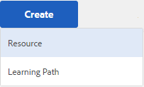

# Bronnenconsole {#enablement-resources-console} inschakelen

Voor AEM Communities, is de console van Middelen waar [Managers Enablement](users.md) creeer, beheer en wijs middelen aan leden van een enablement communautaire plaats toe.

## Vereisten {#requirements}

Alvorens enablement middelen voor een communautaire plaats toe te voegen, moeten de AEM instanties behoorlijk worden gevormd, die omvatten:

* SCORM
* FFmpeg

Voor details, zie [Het vormen Enablement](enablement.md).

>[!CAUTION]
>
>Als SCORM na de verwezenlijking van de communautaire plaats wordt geïnstalleerd, om het even welke toelatingsmiddelen aanwezig alvorens SCORM wordt geïnstalleerd moet worden opnieuw gemaakt.

>[!NOTE]
>
>Met de release van [AEM 6.3](deploy-communities.md#latestfeaturepack) en de equivalente Communitypakketten [AEM 6.2 FP3](deploy-communities.md#latestfeaturepack) en [AEM 6.1 FP7] (https://docs.adobe.com/content/docs/en/aem/6-1/deploy/communities.html#Latest Feature Pack) vereist de functie enablement niet langer een [MySQL database](mysql.md).

## Terminologie {#terminology}

### Bron {#resource}

De middelen zijn essentieel aan een [enablement community](overview.md#enablement-community). Het zijn de materialen die aan leden worden toegewezen die hen toelaten om hun vaardigheden te verbeteren.

Kenmerken van een bron:

* Mag van het type zijn:
   * Afbeelding (JPG, PNG, GIF, BMP)
   * Video (MP4)
   * Flash (SWF)
   * Document (PDF)
   * Quiz (SCORM)
* Er kan naar worden verwezen vanuit een of meer leerpaden.

### Leerpad {#learning-path}

Een leerpad is een logische reeks actiemiddelen die samen zijn gegroepeerd om eenvoudig toe te wijzen aan leden.

### Ledengroep {#members-group}

Wanneer een communautaire plaats wordt gecreeerd, wordt de naam die aan de plaats voor URL wordt gegeven gebruikt in de verwezenlijking van [plaats specifieke gebruikersgroepen](users.md) die met diverse toestemmingen voor diverse rollen worden gevormd. Al deze automatisch gemaakte groepen worden voorafgegaan door `Community <site-name>`.

Een dergelijke gebruikersgroep is de groep `Community <site-name> Members`, die geregistreerde gebruikers in de publicatieomgeving identificeert als leden van de community. Zie de zelfstudie [Aan de slag met AEM Communities for Enablement](getting-started-enablement.md) bijvoorbeeld.

Voor [betrokkenheidsgemeenschappen](overview.md#egagementcommunity) is het redelijk bezoekers van de site toe te staan zichzelf te registreren of sociale aanmelding te gebruiken, waarna ze automatisch worden toegevoegd aan de ledengroep.

Voor [enablement gemeenschappen](overview.md#enablement-community), wordt het geadviseerd om de plaats privé te maken die dan een beheerder vereist om gebruikers aan de lidgroep toe te voegen.

## Toegang tot de Middelen {#accessing-a-community-site-s-enablement-resources} van Enablement van een Plaats van de Gemeenschap

### Navigeer naar Community-bronnen {#navigate-to-communities-resources}

In het auteursmilieu, om de console van Middelen te bereiken

* Vanuit globale navigatie: **[!UICONTROL Navigation]** > **[!UICONTROL Communities]** > **[!UICONTROL Resources]**

   

### Een communautaire site selecteren {#select-a-community-site}

De console van de Middelen van Gemeenschappen zal alle communautaire plaatsen tonen.

De middelen van Enablement worden gecreeerd voor een specifieke communautaire plaats na het selecteren van de plaats van de console van Middelen.

Zodra een specifieke communautaire plaats wordt geselecteerd, zijn om het even welke bestaande enablement middelen en het leren wegen toegankelijk voor het beheren en wijzigen, en de nieuwe enablement middelen en het leren wegen kunnen worden gecreeerd.

#### Zoeken {#search-features}

Selecteer het pictogram voor het in- en uitschakelen van het zijpaneel om te zoeken naar een activeringsbron of leerpad. Als deze optie is ingeschakeld, wordt een zoekvenster aan de linkerkant van de console geopend met een tekstvak waarin u zoektermen kunt invoeren.

#### Selectiemodus {#selection-mode}

Als u meerdere bronnen voor activering wilt selecteren, selecteert u eerst de muis door de muisaanwijzer op de kaart te plaatsen en vervolgens het pictogram van het vinkje te selecteren. Als u een andere kaart selecteert, wordt deze aan de selectiegroep toegevoegd. Als u een tweede keer de-selectiekaart selecteert, wordt de kaart uitgeschakeld.

## Een bron maken {#create-a-resource}

Om een nieuw enablement middel aan de communautaire plaats toe te voegen

* Selecteer het pictogram `Create`.
* Selecteer **[!UICONTROL Resource]** in het submenu dat wordt weergegeven.

Dit lanceert een geleidelijke proces van:

* De bron beschrijven (naam, kaartafbeelding en tekst).
* De broninhoud selecteren.
* Een omslagafbeelding voor de bron selecteren.
* Broncontactpersonen identificeren.
* Bronnen toewijzen aan leden.

Wanneer de bron deel uitmaakt van een cursus, dient u een leerpad toe te wijzen aan de leden. De taken kunnen worden toegevoegd nadat het enablement middel is gecreeerd.

### 1 Basisinformatie {#basic-info}

* **[!UICONTROL Add Image]**

   (*Facultatief*) een beeld om op de kaart voor het enablement middel in de de taakpagina van het lid evenals de console van Middelen te tonen. De afbeelding wordt geselecteerd in het lokale bestandssysteem van de server. Als er geen afbeelding wordt opgegeven, wordt een miniatuur gegenereerd voor de geüploade bron.

   ***Opmerking***: De aanbevolen afbeeldingsgrootte is niet gewoon 480 x 480 pixels. Door het responsieve ontwerp van de kaarten tot verschillende browserafmetingen, varieert de weergavegrootte van 220 x 165 pixels tot 400 x 165 pixels.

* **[!UICONTROL Site Name]**

   (*readonly*) De communautaire plaats waaraan de bron wordt toegevoegd.

* **[!UICONTROL Resource Name]**

   (*Required*) De vertoningsnaam voor het middel. Een geldige knooppuntnaam wordt gecreeerd van de vertoningsnaam.

* **[!UICONTROL Tags]**

   (*Optioneel*) U kunt een of meer tags kiezen die de activeringsbron koppelen aan een of meer catalogi. Zie [Tags toewijzen Bronnen](tag-resources.md).

* **[!UICONTROL Show in Catalog]**

   Als deze optie uitgeschakeld is, wordt de resource voor activering niet weergegeven in een catalogus. Als deze optie is ingeschakeld, wordt de enablement-bron in alle catalogi weergegeven, tenzij [voorgefilterd](catalog-developer-essentials.md#pre-filters) of de lidfilters van de UI. De optie Standaard is uitgeschakeld.

* **[!UICONTROL Description]**

   (*Optioneel*) De beschrijving die moet worden weergegeven voor de enablement-bron.

* **[!UICONTROL Small Asset]**

   (*Optioneel*) Geselecteerd vanuit AEM Assets. Een miniatuurafbeelding die de bron vertegenwoordigt in de publicatieomgeving, zoals in een catalogus.

* **[!UICONTROL Large Asset]**

   (*Optioneel*) Geselecteerd vanuit AEM Assets. Een grote afbeelding die de bron in de publicatieomgeving vertegenwoordigt, bijvoorbeeld op de hoofdpagina voor een bron.

* **[!UICONTROL Content Fragment Asset]**

   (*Optioneel*) Geselecteerd vanuit AEM Assets. A content fragment that may be referenced in the publish environment, but is not in use by default.

* Selecteer **[!UICONTROL Next]**

### 2 Inhoud toevoegen {#add-content}

Hoewel het lijkt alsof er meerdere bronnen voor activering zijn geselecteerd, is er slechts één optie toegestaan.

Selecteer `'+' icon`, in de hogere juiste hoek, om met het proces te beginnen om het middel te kiezen door de bron te identificeren.

* **[!UICONTROL Upload from my local files]**

   Als u bestanden uploadt vanuit het lokale bestandssysteem, gebruikt u de native bestandsbrowser om een bestand te selecteren en te uploaden. Ondersteunde bestandstypen zijn SCORM.zip (HTML5 of SWF), MP4-video, SWF, PDF en afbeeldingstypen (JPG, PNG, GIF, BMP). De bestandsnaam wordt de naam van het element, dat wordt toegevoegd aan de elementenbibliotheek.

* **[!UICONTROL Browse Asset Library]**

   Selecteer een optie in de middelenbibliotheek. De selectie is beperkt tot de selecties die zichtbaar zijn binnen de site van de community.

* **[!UICONTROL Add an external URL]**

   Voer een koppeling in naar de leerinhoud.

   Voer in het dialoogvenster dat wordt geopend het volgende in:

   * **[!UICONTROL Title]**

      De naam van het element voor de enablement-bron.

   * **[!UICONTROL URL]**

      De URL naar een element.

* **[!UICONTROL Add an Adobe Connect URL]**

   Voer een koppeling naar een Adobe Connect-sessie in.

   Voer in het dialoogvenster dat wordt geopend het volgende in:

   * **[!UICONTROL Title]**

      De naam van het element voor de enablement-bron.

   * **[!UICONTROL URL]**

      De URL naar een Adobe Connect-sessie.

* **[!UICONTROL Define an External Resource]**

   Voer de locatie in waar het materiaal moet worden weergegeven. De waarden voor de successtatus en de score zijn manueel ingegaan (zie [Rapporten](reports.md)). Een geüploade omslagafbeelding kan worden gebruikt voor aanvullende informatie.

   Voer in het dialoogvenster dat wordt geopend het volgende in:

   * **[!UICONTROL Title]**

      De naam van het element voor de enablement-bron.

   * **[!UICONTROL Location]**

      De locatie van een fysieke site, zoals een lesruimte.

#### Voorbeeld van een toegevoegde videobron {#example-of-an-added-video-resource}

* **[!UICONTROL Resource Cover Image]**

   De omslagafbeelding is een afbeelding die wordt weergegeven wanneer de bron van de activering voor het eerst wordt weergegeven. De omslagafbeelding wordt bijvoorbeeld weergegeven wanneer een videobron nog niet wordt afgespeeld. Als een aangepaste afbeelding niet wordt geüpload, wordt een standaardafbeelding weergegeven. Voor videobronnen is het mogelijk om [een miniatuur te genereren](enablement.md#ffmpeg), maar alleen wanneer deze is geüpload en niet wanneer er naar de video wordt verwezen als een URL. Voor locatiebronnen kan de afbeelding worden gebruikt om aanvullende informatie te verschaffen.

   De aanbevolen grootte voor de omslagafbeelding is 640 x 360 px.

* Selecteer **[!UICONTROL Next]**.

### 3 instellingen {#settings}

>[!NOTE]
>
>Leerlingen moeten niet rechtstreeks zijn ingeschreven voor bronnen voor activering waarnaar vanuit een leerpad moet worden verwezen. Studenten hoeven alleen deel te nemen aan het leerpad.
>
>Als een lid in zowel een middel als een het leren weg wordt ingeschreven die verwijzingen dat middel, zullen hun taken zowel het enige middel als het middel binnen de het leren weg tonen.

* **[!UICONTROL Social Settings]**

   Met deze instellingen bepaalt u of studenten invoer kunnen leveren met betrekking tot de activeringsbron. De [moderatie-instellingen](sites-console.md#moderation) zijn die van de bovenliggende communitysite.

   * **[!UICONTROL Allow Commenting]**

      Als deze optie is ingeschakeld, mogen leden opmerkingen maken over de bron. Standaard is ingeschakeld.

   * **[!UICONTROL Allow Ratings]**

      Als deze optie is ingeschakeld, mogen leden de bron beoordelen. Standaard is ingeschakeld.

   * **[!UICONTROL Allow Anonymous Access]**

      Als deze optie ingeschakeld is, mogen anonieme sitebezoekers de bron in een catalogus bekijken wanneer de site van de community anonieme toegang toestaat. De optie Standaard is uitgeschakeld.

* **[!UICONTROL Due Date]**

   *(Optioneel)* Er kan een datum worden gekozen waarop de toewijzing moet worden voltooid.

* **[!UICONTROL Resource Author]**

   *(Optioneel)* De auteur van de resource voor activering. Gebruik het keuzemenu om gebruikers te selecteren die lid zijn van de [ledengroep](#members-group).

* **[!UICONTROL Resource Contact&ast;]**

   *(Vereist)* Een persoon die het lid kan contacteren betreffende het enablement middel. Gebruik het keuzemenu om gebruikers te selecteren die lid zijn van de [ledengroep](#members-group).

* **[!UICONTROL Resource Expert]**

   *(Facultatief)* Een persoon het lid kan contacteren die deskundigheid betreffende het enablement middel heeft. Gebruik het keuzemenu om gebruikers te selecteren die lid zijn van de [ledengroep](#members-group).

### 4 Toewijzingen {#assignments}

* **[!UICONTROL Add Assignees]**

   Gebruik het keuzemenu om te selecteren uit [leden](#members-group) - De gebruikers en gebruikersgroepen (die in vette letters worden vermeld) - die als Leerlingen moeten worden ingeschreven. Wanneer leden zich aanmelden bij de communitysite, worden de bronnen voor activering (en leerpaden) waarin ze zijn ingeschreven, weergegeven op de pagina [Toewijzingen](functions.md#assignments-function).

* Selecteer **[!UICONTROL Create]**.

   

Succesvolle verwezenlijking van het enablement middel keert aan de console van Middelen met het pas gecreëerde middel geselecteerd terug. Vanuit deze console is het mogelijk om [de resource](#managing-a-resource) te beheren.

## Een leerpad maken {#create-a-learning-path}

Een nieuw leerpad toevoegen aan de communitysite

* Het pictogram `Create` selecteren
* Selecteer **[!UICONTROL Learning Path]** in het submenu dat wordt weergegeven.

Dit lanceert een geleidelijke proces van:

* Het leerpad identificeren.
* Een kaartafbeelding die het leerpad weergeeft aan de studenten.
* Verwijzen van de enablement middelen om in de het leren weg te omvatten.
* Optioneel de bronnen bestellen.
* Optioneel vereiste leerpaden identificeren.
* Een contactpersoon voor leerpaden identificeren.
* Leden inschrijven.

Voor actiemiddelen die deel uitmaken van een leerpad, mogen de taken alleen worden uitgevoerd voor het leerpad en niet voor de individuele bronnen.

### Basisinformatie {#basic-info-1}

* **[!UICONTROL Add Image]**

   (*Optioneel*) Een afbeelding die op de kaart wordt weergegeven voor het leerpad in de toewijzingspagina van het lid en de Bronnenconsole. De afbeelding wordt geselecteerd in het lokale bestandssysteem van de server. Als er geen afbeelding wordt opgegeven, wordt een miniatuur gegenereerd voor de geüploade bron.

   ***Opmerking***: De aanbevolen afbeeldingsgrootte is niet langer gewoon 480 x 480 pixels. Door het responsieve ontwerp van de kaarten tot verschillende browserafmetingen, varieert de weergavegrootte van 220 x 165 pixels tot 400 x 165 pixels.

* **[!UICONTROL Site Name]**

   (*Alleen-lezen*) De communitysite waaraan de bron wordt toegevoegd.

* **[!UICONTROL Learning Path Name]**

   (*Required*) De vertoningsnaam voor de het leren weg. Een geldige knooppuntnaam wordt gecreeerd van de vertoningsnaam.

* **[!UICONTROL Tags]**

   (*Optioneel*) U kunt een of meer tags kiezen die het leerpad koppelen aan een of meer catalogi. Zie [Tags toewijzen Bronnen](tag-resources.md).

* **[!UICONTROL Show in Catalog]**

   Als deze optie is uitgeschakeld, wordt het leerpad niet weergegeven in een catalogus. Als deze optie is ingeschakeld, wordt het leerpad weergegeven in alle catalogi, tenzij [voorgefilterd](catalog-developer-essentials.md#pre-filters) of de lidfilters van de gebruikersinterface. Als u het leerpad in een catalogus weergeeft, hebt u indirect toegang tot alle bijbehorende bronnen. De optie Standaard is uitgeschakeld.

* **[!UICONTROL Description]**

   (*Optioneel*) De beschrijving die moet worden weergegeven voor de enablement-bron.

* **[!UICONTROL Small Asset]**

   (*Optioneel*) Geselecteerd vanuit AEM Assets. Een miniatuurafbeelding die de bron vertegenwoordigt in de publicatieomgeving, zoals in een catalogus.

* **[!UICONTROL Large Asset]**

   (*Optioneel*) Geselecteerd vanuit AEM Assets. Een grote afbeelding die de bron in de publicatieomgeving vertegenwoordigt, bijvoorbeeld op de hoofdpagina voor een bron.

* **[!UICONTROL Content Fragment Asset]**

   (*Optioneel*) Geselecteerd vanuit AEM Assets. A content fragment that may be referenced in the publish environment, but is not in use by default.

* Selecteer **[!UICONTROL Next]**.

### Voorwaarden {#add-prerequisites} toevoegen

* **[!UICONTROL Prerequisite Learning Paths]**

   (*Optioneel*) Als er andere gepubliceerde leerpaden zijn geselecteerd, moeten deze zijn voltooid voordat een student dit leerpad kan selecteren.

* Selecteer **[!UICONTROL Next]**.

### Bronnen toevoegen {#add-resources}

* **[!UICONTROL Enforce Order in Learning Path]**

   (*Optioneel*) Indien ingesteld op Aan, is de volgorde waarin de bronnen voor activering worden toegevoegd de volgorde waarin studenten het leerpad moeten doorlopen. Standaard uitgeschakeld.

* **[!UICONTROL Resources]**

   Een of meer bronnen die zijn gekozen uit de *gepubliceerde*-activeringsbronnen die zijn gemaakt voor de huidige communitysite.

>[!NOTE]
>
>U kunt alleen de bronnen selecteren die beschikbaar zijn op hetzelfde niveau als het leerpad. Bijvoorbeeld, voor een leerweg die in een groep wordt gecreeerd slechts zijn de middelen van het groepsniveau beschikbaar; voor een leerpad dat in een gemeenschapssite is gemaakt, zijn de bronnen in die site beschikbaar voor toevoeging aan het leerpad.

* Selecteer **[!UICONTROL Next]**.

### Instellingen {#settings-1}

* **[!UICONTROL Add Enrollments]**

   Gebruik het keuzemenu om te selecteren uit de leden en lidgroepen (in vet letterbeeld vermeld) die lid zijn van de [lidgroep](#members-group) van de communautaire plaats. U hoeft geen toewijzingen toe te voegen wanneer u het leerpad maakt. De eigenschappen van het leerpad kunnen worden gewijzigd om later studenten toe te voegen.

* **[!UICONTROL Learning Path Contact&ast;]**

   *(Vereist)* Een persoon die het lid kan contacteren met betrekking tot het leerpad. Gebruik het keuzemenu om te selecteren uit de gebruikers die lid zijn van de [ledengroep](#members-group) van de communautaire site.

* Selecteer **[!UICONTROL Create]**

>[!NOTE]
>
>Inschakelingsbronnen waarnaar wordt verwezen vanuit het leerpad mogen niet dezelfde toewijzingen (studenten) vermelden, als deze er zijn.
>
>Als een lid in zowel een enablement middel als een het leren weg wordt ingeschreven die verwijzingen die middel, hun taken zowel het enige middel als het middel binnen de het leren weg tonen.

## Een bron beheren {#managing-a-resource}

Om één enkel enablement middel te beheren:

* Van de **[!UICONTROL Resources]** console, selecteer de communautaire plaats die de middel bevat.
* Selecteer de bron.

Voor de geselecteerde enablement-bron is het mogelijk:

* Eigenschappen weergeven (standaard)
* Eigenschappen bewerken
* Verwijderen
* Publicatie
* Publiceren ongedaan maken

Om een nieuwe versie van het enablement middel te uploaden, wordt het geadviseerd om een nieuwe middel tot stand te brengen, en dan leden van de oude versie uit te schrijven en hen in de nieuwe versie in te schrijven.

### Bron {#edit-resource} bewerken

Door het potloodpictogram te selecteren, worden de stappen voor het creëren van een enablement middel getoond beschikbaar gemaakt zodat om het even welke verstrekte informatie kan worden gewijzigd.

Als de enige verandering taken op de stap van Montages moet wijzigen, dan leidt het opslaan van de veranderingen tot de wijzigingen die worden gepubliceerd. Als er andere wijzigingen worden aangebracht, moet de bron expliciet worden gepubliceerd na het opslaan.

### Bron {#delete-resource} verwijderen

Door het trashcan-pictogram te selecteren, is de enablement-bron `Deleted` na bevestiging.

### Publicatie {#publish}

Voordat studenten een toegewezen activeringscursus kunnen zien, moet deze worden gepubliceerd:

* Selecteer het wereldpictogram aan `Publish`.
* Selecteer **[!UICONTROL Publish]** nogmaals in het dialoogvenster dat verschijnt.
* Selecteer **[!UICONTROL Close]**.

Hoewel in het dialoogvenster staat dat de handeling in de wachtrij staat, wordt deze vaak onmiddellijk gepubliceerd.

### Publiceren {#unpublish} ongedaan maken

Om de enablement middelen aan leden in het publicatiemilieu tijdelijk ontoegankelijk te maken zonder het te schrappen, gebruik het wereldpictogram aan `Unpublish` het middel.

### Rapport {#report}

Het pictogram Rapport biedt toegang tot de rapporten die worden gegenereerd wanneer studenten in de publicatieomgeving werken met hun toegewezen bronnen voor activering. Het rapport varieert afhankelijk van het type van middel.

Voor alle leerwegen, is het mogelijk om een rapport te bekijken dat of op middelen of studenten ( `User Report`) wordt gebaseerd.

Dit Rapport is specifiek voor het huidige enablement middel of het leren weg. De mate waarin rapporten worden verschaft, hangt af van het feit of [Adobe Analytics](analytics.md) een licentie heeft en is ingeschakeld voor de site van de gebruikersgemeenschap. De [Timeline](#timeline), [Viewer Engagement](#viewer-engagement) en [Engagement by Device](#engagement-by-device) rapporten worden geïmporteerd uit Adobe Analytics op basis van het [pollinginterval](analytics.md#report-importer).

Voor alle machtigingsmiddelen, ongeacht of Adobe Analytics wordt toegelaten, zijn er rapporten over [Status van de Ontvanger](#assignee-status) en [Ratings](#ratings) evenals een [Overzicht van het Rapport](#report-summary) lijst.

#### Tijdlijn {#timeline}

Het rapport Analytics Timeline toont wanneer gebeurtenissen in de loop der tijd optreden voor deze activeringsbron:

* **Weergaven**

   Een weergave is wanneer een student de pagina met brongegevens bezoekt.

* **Afspelen**

   Een afspeelbewerking wordt uitgevoerd wanneer alLearning communiceert met de bron, zoals het afspelen van een video of het openen van een PDF.

* **Waarderingen**

   Een classificatie is wanneer een leerling een sterwaardering toewijst aan een bron.

* **Opmerkingen**

   Een opmerking is wanneer alLearning een opmerking toevoegt.

De verticale as is het aantal gebeurtenissen.

De horizontale as is de kalendertijd.

[Adobe Analytics vereist](sites-console.md#analytics).

#### Betrokkenheid van de viewer {#viewer-engagement}

Het rapport Betrokkenheid van de Analyse Viewer toont voor videobronnen het aantal studenten dat de bron heeft bekeken en, als het niet tot het einde is afgespeeld, op welk punt studenten het afspelen hebben gestopt.

De verticale as is het aantal studenten dat deze bron heeft bekeken.

De horizontale as is de duur van deze resource.

[Marketing Cloud-Org-id vereist](sites-console.md#enablement).

#### Betrokkenheid van apparaat {#engagement-by-device}

In het rapport Analytics Engagement by Device (Betrokkenheid bij analyse per apparaat) voor videobronnen wordt het percentage van weergaven beschreven dat vanaf desktop en mobiel is afgespeeld.

[Marketing Cloud-Org-id vereist](sites-console.md#enablement).

#### Status van toewijzing {#assignee-status}

In het statusrapport van de ontvanger, dat is gebaseerd op het aantal studenten, wordt beschreven hoeveel leerlingen

* **Niet gestart**
* **In uitvoering**
* **Voltooid**

#### Waarderingen {#ratings}

Het beoordelingsrapport is gebaseerd op het aantal leerlingen dat de activeringsbron heeft beoordeeld, waarbij het aantal sterrenwaarderingen wordt weergegeven, gevolgd door een overzicht van het totale aantal beoordelingen en de gemiddelde beoordeling.

#### Rapportoverzicht {#report-summary}

Voor een enablement middel, is de Samenvatting van het Rapport een lijstlijst.

* Elke leerling die met de bron heeft gewerkt
   * Hun status
   * Of aan hen de middel werd toegewezen
      * In tegenstelling tot het vinden van de bron in een catalogus
      * Aantal geposte opmerkingen
      * De eventueel toegekende rating

Voor een het leren Rapport van het Middel van de weg, is de Samenvatting van het Rapport een lijstlijst

* Elke bron die is opgenomen in het leerpad
   * Status publiceren
   * Aantal weergaven
   * Aantal afspelen
   * Gemiddelde beoordeling
   * Format
   * Grootte
   * Naam van communautaire site

Voor een leerpad Rapport van de Gebruiker, is het Overzicht van het Rapport een lijstlijst.

* Elke leerling die is toegewezen aan het leerpad:
   * Aantal voltooide middelen.
   * Hun status.

Het is mogelijk om de weergave van de tabel aan te passen door kolommen te selecteren met de kiezer `Show / hide columns`.

#### Rapport downloaden als CSV {#download-report-as-csv}

De lijst van Rapporten Summiere kan in formaat CSV worden gedownload gebruikend een knoop bij de bovenkant van de console.

* Voor een enablement resource: `Download Resource Report as CSV` knop.
* Voor een leerpad: `Download Learning Path Report as CSV` knop.

De volledige samenvatting van Rapporten wordt gedownload ongeacht kolommen voor vertoning worden gekozen.
