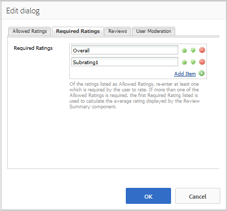

# Overzicht van revisies en revisies gebruiken (weergave) {#using-reviews-and-reviews-summary-display}

De `Reviews` component is een samenstelling van [Comments](comments.md) en [Rating](rating.md) componenten klaar voor gebruik.

De `Reviews Summary (Display)` component verstrekt een samenvatting van een actieve of gesloten instantie van een `Reviews` component voor vertoning elders op de plaats.

>[!NOTE]
>
>Anonieme publicatie van een revisie wordt niet ondersteund. Site-bezoekers moeten zich registreren (lid worden) en zich aanmelden om deel te nemen. De ondertekende bezoeker kan zijn of haar revisie op elk gewenst moment bijwerken.

## Een revisie toevoegen aan een pagina {#adding-a-review-to-a-page}

Als u een `Reviews`-component in de ontwerpmodus aan een pagina wilt toevoegen, gebruikt u de componentbrowser om `Communities / Reviews` te zoeken en deze naar de juiste positie op een pagina te slepen, zoals een positie ten opzichte van de functie die gebruikers kunnen controleren.

Voor noodzakelijke informatie, bezoek [de Grondbeginselen van Componenten van Gemeenschappen](basics.md).

Als de [vereiste client-side bibliotheken](reviews-basics.md#essentials-for-client-side) worden opgenomen, wordt de `Reviews`-component op deze manier weergegeven.

## Revisies {#configuring-reviews} configureren

Selecteer de geplaatste `Reviews` component en selecteer `Configure` pictogram dat het Edit dialoog opent.

Geef onder het tabblad **[!UICONTROL Allowed Ratings]** de volledige lijst met classificaties op die aan de leden moeten worden weergegeven. De eerste rating moet een algemene/algemene rating zijn, aangezien de rating de gemiddelde rating voor de `Review Summary (Display)`-component vormt. De volgende twee classificaties in de standaardconfiguratie moeten een andere titel krijgen dan &quot;Subrating 1&quot; of &quot;Subrating 2&quot;.

* **[!UICONTROL Allowed Ratings]**

   Een lijst met waarderingen waaruit een lid kan kiezen.

   Gebruik de toetsen Pijl-omhoog, Pijl-omlaag en Pijl-verwijderen om de zichtbare selecties te wijzigen.

   Klik **[!UICONTROL Add Item]** om een andere beoordelingskeuze toe te voegen.

Voer onder het tabblad **[!UICONTROL Required Ratings]** opnieuw items in de lijst met **[!UICONTROL Allowed Ratings]** in die moeten worden beoordeeld. Als een item alleen wordt opgegeven op het tabblad Toegestane waarderingen, kan het item niet worden gemarkeerd wanneer het door het lid wordt verzonden.

Op de website worden vereiste classificaties gemarkeerd met een sterretje. Als een item vereist is en niet is gemarkeerd, wordt een bericht weergegeven aan het lid en wordt de verzending geweigerd totdat alle vereiste beoordelingen zijn gemarkeerd.

* **[!UICONTROL Required Ratings]**

   Een subset van toegestane ratings die aangeeft welke ratings vereist zijn.

   Gebruik de toetsen Pijl-omhoog, Pijl-omlaag en Pijl-verwijderen om de zichtbare selecties te wijzigen.

   Klik **[!UICONTROL Add Item]** om een andere reactiekeus toe te voegen.

>[!NOTE]
>
>Als een punt op **[!UICONTROL Required Ratings]** tabel wordt ingegaan die niet op **[!UICONTROL Allowed Ratings]** tabel wordt gespecificeerd, dan is het niet inbegrepen in de punten aan tarief.

Geef onder het tabblad **[!UICONTROL Reviews]** op hoe revisies worden verwerkt.

* **[!UICONTROL Allow Replies]**

   Als deze optie is ingeschakeld, kunt u reacties op revisies toestaan. De optie Standaard is uitgeschakeld.

* **[!UICONTROL Closed]**

   Als deze optie is ingeschakeld, wordt de revisie afgesloten voor nieuwe revisies en antwoorden. De optie Standaard is uitgeschakeld.

* **[!UICONTROL Allow File Uploads]**

   Als deze optie is ingeschakeld, mogen bestandsbijlagen worden geüpload voor de revisie. De optie Standaard is uitgeschakeld.

* **Max. bestandsgrootte**

   Alleen relevant als **[!UICONTROL Allow File Uploads]** is ingeschakeld. Dit veld beperkt de grootte (in bytes) van een geüpload bestand. De standaardwaarde is 10 MB.

* **[!UICONTROL Max Message Length]**

   Maximumaantal tekens dat in het tekstvak kan worden ingevoerd. De standaardwaarde is 4096 tekens.

* **[!UICONTROL Allowed File Types]**

   Alleen relevant als **[!UICONTROL Allow File Uploads]** is ingeschakeld. Een door komma&#39;s gescheiden lijst met bestandsextensies met het &quot;punt&quot;-scheidingsteken. Bijvoorbeeld: .jpg, .jpeg, .png, .doc, .docx, .pdf. Als er bestandstypen worden opgegeven, zijn deze niet toegestaan. De standaardinstelling is niet opgegeven, zodat alle bestandstypen zijn toegestaan.

* **[!UICONTROL Rich Text Editor]**

   Als deze optie ingeschakeld is, kunnen er berichten met markeringen worden ingevoerd. De optie Standaard is uitgeschakeld.

* **[!UICONTROL Allow Voting]**

   Indien ingeschakeld, neemt u de functie Stemmen op voor een onderwerp. De optie Standaard is uitgeschakeld.

Geef onder het tabblad **[!UICONTROL User Moderation]** op hoe de geposte revisies worden beheerd. Zie [Door gebruiker gegenereerde inhoud modereren](moderate-ugc.md) voor meer informatie.

* **[!UICONTROL Pre-Moderation]**

   Als deze optie is ingeschakeld, moeten revisies worden goedgekeurd voordat ze op een publicatiesite worden weergegeven. De optie Standaard is uitgeschakeld.

* **[!UICONTROL Delete Reviews]**

   Als deze optie is ingeschakeld, kan het lid dat de revisie heeft geplaatst deze verwijderen. De optie Standaard is uitgeschakeld.

* **[!UICONTROL Deny Reviews]**

   Als gecontroleerd, sta moderators toe om overzichten te ontkennen. De optie Standaard is uitgeschakeld.

* **[!UICONTROL Close / Reopen Reviews]**

   Als deze optie ingeschakeld is, kan de moderator de revisies sluiten en opnieuw openen. De optie Standaard is uitgeschakeld.

* **[!UICONTROL Flag Reviews]**

   Als deze optie is ingeschakeld, kunnen leden beoordelingen als onjuist markeren. De optie Standaard is uitgeschakeld.

* **[!UICONTROL Flag Reason List]**

   Als deze optie is ingeschakeld, kunnen leden in een vervolgkeuzelijst de reden kiezen waarom een revisie als onjuist is gemarkeerd. De optie Standaard is uitgeschakeld.

* **[!UICONTROL Custom Flag Reason]**

   Als deze optie is ingeschakeld, kunnen leden hun eigen reden opgeven om een revisie als ongeschikt te bestempelen. De optie Standaard is uitgeschakeld.

* **[!UICONTROL Moderation Threshold]**

   Voer het aantal keren in dat een revisie door leden moet worden gemarkeerd voordat moderatoren op de hoogte worden gesteld. De standaardwaarde is één keer (1).

* **[!UICONTROL Flagging Limit]**

   Voer het aantal keren in dat een revisie moet worden gemarkeerd voordat deze wordt verborgen in de openbare weergave. Dit getal moet groter dan of gelijk zijn aan **[!UICONTROL Moderation Threshold]**. De standaardwaarde is 5.

### Revisieoverzicht (weergave) toevoegen aan een pagina {#adding-a-review-summary-display-to-a-page}

Als u een `Reviews Summary (Display)`-component wilt toevoegen aan een pagina in de ontwerpmodus, zoekt u de component

* `Communities / Reviews Summary (Display)`

en sleep de revisie naar de juiste plaats op een pagina waarop een overzicht van een actieve of gesloten revisie moet worden weergegeven.

Voor noodzakelijke informatie, bezoek [de Grondbeginselen van Componenten van Gemeenschappen](basics.md).

Als de [vereiste client-side bibliotheken](reviews-basics.md#essentials-for-client-side) worden opgenomen, wordt de `Reviews Summary (Display)`component op deze manier weergegeven.

>[!NOTE]
>
>Het &quot;gemiddelde&quot; stemt overeen met de stemmen voor het eerste item op de tabbladen Toegestane ratings van de te beoordelen evaluatie.

### Overzicht van revisies configureren (weergave) {#configuring-reviews-summary-display}

Selecteer de geplaatste `Reviews Summary (Display)` component en selecteer `Configure` pictogram dat het Edit dialoog opent.

Onder de tab **[!UICONTROL Review Summary]**

* `Review Path`

   ga of doorblader aan de geplaatste instantie van de `reviews`component in om samen te vatten, bijvoorbeeld als toegevoegd aan de Web-pagina van [de plaats van de Ingenieur van de Geometrixx, ](getting-started.md) de weg zou zijn:

   `/content/sites/engage/en/page/jcr:content/content/primary/reviews`

* `Include histogram`

   Als deze optie is ingeschakeld, neemt u de weergave op van een staafgrafiek die aangeeft hoeveel van elke sterwaardering de overzichten bevatten. De optie Standaard is uitgeschakeld.

### Wijzigen in een aangepast revisietype {#changing-to-a-custom-review-type}

De component Reviews gebruikt het opmerkingensysteem.

Door het Type van Middel van Commentaar te veranderen, zal het commentaarsysteem niet meer een geval van een commentaar gebruikend het gebrek, maar eerder een produceren die (uitgebreid) door ontwikkelaars is aangepast.

Zodra de types van douanemiddel bekend zijn, ga [Ontwerpwijze](../../help/sites-authoring/default-components-designmode.md) in en klik op de geplaatste `Comments` component tweemaal om een dialoog met een extra lusje te openen.

Geef onder het tabblad **[!UICONTROL Resource Types]** het aangepaste resourceType op voor nieuwe instanties van de `Comments or Voting`-componenten:

* **[!UICONTROL Comment Resource Type]**

   Navigeer naar het resourceType van uitgebreide `comment`component (enige commentaar) in /apps. Bijvoorbeeld, `/apps/social/commons/components/hbs/comments/comment`.

   Deze bron identificeert het resourceType van de UGC die is gemaakt wanneer een bezoeker een opmerking plaatst.

* **[!UICONTROL Voting Resource Type]**

   Navigeer naar het resourceType van een uitgebreide `voting`component in /apps. Bijvoorbeeld, `/apps/social/components/hbs/voting`.

   Met deze bron wordt het bronnentype van de UGC geïdentificeerd die wordt gemaakt wanneer een bezoeker een stem plaatst.

* **[!UICONTROL Comment System Resource Type]**

   Navigeer naar het resourceType van uitgebreide `comments`component (het Systeem van de Commentaar) in /apps. Leeg laten tenzij het paginamalplaatje [dynamisch ](scf.md#add-or-include-a-communities-component) het Systeem van de Commentaar in het onderliggende manuscript in plaats van wordt toegevoegd aan de pagina als middel (commentaarknoop) omvat. Leer meer door over [ te lezen {{include} helper](handlebars-helpers.md#include).

## Ervaring {#site-visitor-experience} voor bezoekers van site

### Moderatoren en beheerders {#moderators-and-administrators}

Wanneer de ondertekende binnen gebruiker moderator of beheerdervoorrechten heeft, kunnen zij de matigingstaken uitvoeren die door de configuratie van de component worden toegelaten, ongeacht wie de controle authored.

### Leden {#members}

Wanneer de bezoeker van de site zich aanmeldt, is het mogelijk dat:

* Nieuwe revisie verzenden
* Een eigen revisie bewerken
* Een eigen revisie verwijderen
* Opmerkingen van anderen markeren

Er is slechts één score per lid toegestaan. Het lid kan zijn rating te allen tijde wijzigen.

### Anonieme {#anonymous}

Sitebezoekers die niet zijn aangemeld, kunnen alleen geposte revisies lezen, deze vertalen indien deze worden ondersteund, maar mogen geen score of revisie toevoegen en de revisieopmerkingen van anderen niet markeren.

## Aanvullende informatie {#additional-information}

Meer informatie vindt u op de pagina [Essentiële elementen revisie](reviews-basics.md) voor ontwikkelaars.

Zie [Door gebruiker gegenereerde inhoud modereren](moderate-ugc.md) voor de moderatie van geposte opmerkingen.

Zie [Door gebruiker gegenereerde inhoud omzetten](translate-ugc.md) voor een vertaling van geposte opmerkingen.
