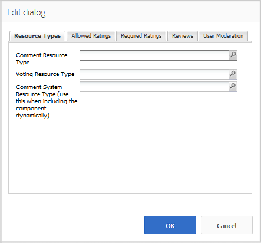

# Overzicht van revisies en revisies gebruiken (weergave) {#using-reviews-and-reviews-summary-display}

De `Reviews` component is een samenstelling van [Opmerkingen](comments.md) en [Classificatie](rating.md) gebruiksklare componenten.

De `Reviews Summary (Display)` component verstrekt een samenvatting van een actieve of gesloten instantie van een `Reviews` voor weergave elders op de site.

>[!NOTE]
>
>Anonieme terbeschikkingstelling van een revisie wordt niet ondersteund. Site-bezoekers moeten zich registreren (lid worden) en zich aanmelden om deel te nemen. De aangemelde bezoeker kan zijn of haar revisie op elk gewenst moment bijwerken.

## Een revisie toevoegen aan een pagina {#adding-a-review-to-a-page}

Als u een `Reviews` van een component aan een pagina op auteurswijze, gebruik componentenbrowser om van `Communities / Reviews` en sleep het naar de juiste positie op een pagina, zoals een positie ten opzichte van de functie die gebruikers kunnen bekijken.

Voor de nodige informatie gaat u naar [Grondbeginselen van Community-componenten](basics.md).

Wanneer de [vereiste clientbibliotheken](reviews-basics.md#essentials-for-client-side) worden opgenomen, is dit hoe `Reviews` wordt weergegeven.

## Revisies configureren {#configuring-reviews}

Selecteer de geplaatste `Reviews` zodat u toegang hebt tot `Configure` wordt het dialoogvenster Bewerken geopend.

Onder de **[!UICONTROL Allowed Ratings]** geeft u de volledige lijst met classificaties op die aan de leden moeten worden weergegeven. De eerste rating moet een algemene/algemene rating zijn, aangezien de rating de gemiddelde rating voor de `Review Summary (Display)` component. De volgende twee classificaties in de standaardconfiguratie moeten een andere titel krijgen dan &quot;Subrating 1&quot; of &quot;Subrating 2&quot;.

* **[!UICONTROL Allowed Ratings]**

  Een lijst met waarderingen waaruit een lid kan kiezen.

  Gebruik de toetsen Pijl-omhoog, Pijl-omlaag en Pijl-verwijderen om de zichtbare selecties te wijzigen.

  Klikken **[!UICONTROL Add Item]** een andere beoordelingskeuze toevoegen.

Onder de **[!UICONTROL Required Ratings]** tabblad, items opnieuw invoeren in de lijst met **[!UICONTROL Allowed Ratings]** die vereist zijn voor de rating. Als een item alleen wordt opgegeven op het tabblad Toegestane waarderingen, kan het item niet worden gemarkeerd wanneer het door het lid wordt verzonden.

Op de website worden vereiste classificaties gemarkeerd met een sterretje. Als een item vereist is en niet is gemarkeerd, wordt een bericht weergegeven aan het lid en wordt de verzending geweigerd totdat alle vereiste beoordelingen zijn gemarkeerd.

* **[!UICONTROL Required Ratings]**

  Een subset van toegestane ratings die aangeeft welke ratings vereist zijn.

  Gebruik de toetsen Pijl-omhoog, Pijl-omlaag en Pijl-verwijderen om de zichtbare selecties te wijzigen.

  Klikken **[!UICONTROL Add Item]** om een andere antwoordkeuze toe te voegen.

>[!NOTE]
>
>Als een item wordt ingevoerd op het tabblad **[!UICONTROL Required Ratings]** tabblad dat niet is opgegeven op het tabblad **[!UICONTROL Allowed Ratings]** , wordt deze niet opgenomen in de items die u wilt beoordelen.

Onder de **[!UICONTROL Reviews]** , geeft u op hoe revisies worden verwerkt.

* **[!UICONTROL Allow Replies]**

  Als deze optie is ingeschakeld, kunt u reacties op revisies toestaan. De optie Standaard is uitgeschakeld.

* **[!UICONTROL Closed]**

  Als deze optie is ingeschakeld, wordt de revisie afgesloten voor nieuwe revisies en antwoorden. De optie Standaard is uitgeschakeld.

* **[!UICONTROL Allow File Uploads]**

  Als deze optie is ingeschakeld, mogen bestandsbijlagen worden geüpload voor de revisie. De optie Standaard is uitgeschakeld.

* **Max. bestandsgrootte**

  Alleen relevant als **[!UICONTROL Allow File Uploads]** is ingeschakeld. Dit veld beperkt de grootte (in bytes) van een geüpload bestand. De standaardwaarde is 10 MB.

* **[!UICONTROL Max Message Length]**

  Maximumaantal tekens dat in het tekstvak kan worden ingevoerd. De standaardwaarde is 4096 tekens.

* **[!UICONTROL Allowed File Types]**

  Alleen relevant als **[!UICONTROL Allow File Uploads]** is ingeschakeld. Een door komma&#39;s gescheiden lijst met bestandsextensies met het scheidingsteken &#39;punt&#39;. Bijvoorbeeld .jpg, .jpeg, .png, .doc, .docx, .pdf. Als er bestandstypen zijn opgegeven, zijn deze niet toegestaan. De standaardinstelling is niet opgegeven, zodat alle bestandstypen zijn toegestaan.

* **[!UICONTROL Rich Text Editor]**

  Als deze optie ingeschakeld is, kunnen er berichten met opmaakcodes worden ingevoerd. De optie Standaard is uitgeschakeld.

* **[!UICONTROL Allow Voting]**

  Indien ingeschakeld, neemt u de functie Stemmen op voor een onderwerp. De optie Standaard is uitgeschakeld.

Onder de **[!UICONTROL User Moderation]** , geeft u op hoe de geposte revisies worden beheerd. Zie voor meer informatie [Door gebruiker gegenereerde inhoud modereren](moderate-ugc.md).

* **[!UICONTROL Pre-Moderation]**

  Als deze optie is ingeschakeld, moeten revisies worden goedgekeurd voordat ze op een publicatiesite worden weergegeven. De optie Standaard is uitgeschakeld.

* **[!UICONTROL Delete Reviews]**

  Als deze optie is ingeschakeld, kan het lid dat de revisie heeft geplaatst deze verwijderen. De optie Standaard is uitgeschakeld.

* **[!UICONTROL Deny Reviews]**

  Als gecontroleerd, sta moderators toe om overzichten te ontkennen. De optie Standaard is uitgeschakeld.

* **[!UICONTROL Close / Reopen Reviews]**

  Als deze optie ingeschakeld is, kan de moderator de revisies sluiten en opnieuw openen. De optie Standaard is uitgeschakeld.

* **[!UICONTROL Flag Reviews]**

  Als deze optie is ingeschakeld, kunnen leden beoordelingen als onjuist markeren. De optie Standaard is uitgeschakeld.

* **[!UICONTROL Flag Reason List]**

  Als deze optie is ingeschakeld, kunnen leden in een vervolgkeuzelijst de reden kiezen waarom een revisie als onjuist is gemarkeerd. De optie Standaard is uitgeschakeld.

* **[!UICONTROL Custom Flag Reason]**

  Als deze optie is ingeschakeld, kunnen leden hun eigen reden opgeven om een revisie als ongeschikt te bestempelen. De optie Standaard is uitgeschakeld.

* **[!UICONTROL Moderation Threshold]**

  Voer het aantal keren in dat een revisie door leden moet worden gemarkeerd voordat moderatoren op de hoogte worden gesteld. De standaardwaarde is één keer (1).

* **[!UICONTROL Flagging Limit]**

  Voer het aantal keren in dat een revisie moet worden gemarkeerd voordat deze wordt verborgen in de openbare weergave. Dit getal moet groter zijn dan of gelijk zijn aan het **[!UICONTROL Moderation Threshold]**. De standaardwaarde is 5.

### Een revisieoverzicht (weergave) toevoegen aan een pagina {#adding-a-review-summary-display-to-a-page}

Als u een `Reviews Summary (Display)` naar een pagina in de modus Schrijver, zoek de component

* `Communities / Reviews Summary (Display)`

En sleep de revisie naar de juiste plaats op een pagina waarop een overzicht van een actieve of gesloten revisie moet worden weergegeven.

Voor de nodige informatie gaat u naar [Grondbeginselen van Community-componenten](basics.md).

Wanneer de [vereiste clientbibliotheken](reviews-basics.md#essentials-for-client-side) worden opgenomen, is dit hoe `Reviews Summary (Display)`wordt weergegeven.

>[!NOTE]
>
>Het &quot;gemiddelde&quot; stemt overeen met de stemmen voor het eerste item op de tabbladen Toegestane ratings van de te beoordelen evaluatie.

### Overzicht van revisies configureren (weergave) {#configuring-reviews-summary-display}

Selecteer de geplaatste `Reviews Summary (Display)` zodat u toegang hebt tot `Configure` wordt het dialoogvenster Bewerken geopend.

Onder de **[!UICONTROL Review Summary]** tab

* `Review Path`

  Ga of doorblader aan de geplaatste instantie van binnen `reviews` zodat u bijvoorbeeld een overzicht kunt geven van de inhoud die aan de webpagina van het dialoogvenster [Plaats van Geometrixx inschakelen,](getting-started.md) het pad zou zijn :

  `/content/sites/engage/en/page/jcr:content/content/primary/reviews`

* `Include histogram`

  Als deze optie is ingeschakeld, neemt u de weergave op van een staafgrafiek die aangeeft hoeveel sterrenwaarderingen er in de overzichten staan. De optie Standaard is uitgeschakeld.

### Wijzigen in Type aangepaste revisie {#changing-to-a-custom-review-type}

De component Reviews gebruikt het opmerkingensysteem.

Door het Type van Middel van de Commentaar te veranderen, produceert het commentaarsysteem niet meer een geval van een commentaar gebruikend het gebrek, maar eerder die is aangepast (uitgebreid) door ontwikkelaars.

Wanneer de types van douanemiddel gekend zijn, ga binnen [Ontwerpmodus](../../help/sites-authoring/default-components-designmode.md) en dubbelklikt u op de geplaatste `Comments` om een dialoogvenster met een extra tabblad te openen.

Onder de **[!UICONTROL Resource Types]** tab, specificeer het custom resourceType voor nieuwe instanties van `Comments or Voting` componenten:

* **[!UICONTROL Comment Resource Type]**

  Navigeer naar het resourceType van uitgebreid `comment`component (enkele opmerking) in /apps. Bijvoorbeeld: `/apps/social/commons/components/hbs/comments/comment`.

  Deze bron identificeert het resourceType van UGC die wordt gecreeerd wanneer een bezoeker een commentaar plaatst.

* **[!UICONTROL Voting Resource Type]**

  Navigeer naar het resourceType van uitgebreid `voting`in /apps. Bijvoorbeeld: `/apps/social/components/hbs/voting`.

  Dit middel identificeert het middeltype van UGC die wordt gecreeerd wanneer een bezoeker een stem plaatst.

* **[!UICONTROL Comment System Resource Type]**

  Navigeer naar het resourceType van uitgebreid `comments`component (Opmerkingssysteem) in /apps. Leeg laten, tenzij de paginasjabloon [dynamisch omvat](scf.md#add-or-include-a-communities-component) het Systeem van de Commentaar in het onderliggende manuscript in plaats van wordt toegevoegd aan de pagina als middel (commentaarknoop). Lees meer over de [`{{include}}` helper](handlebars-helpers.md#include).

## Ervaring met sitebezoekers {#site-visitor-experience}

### Moderatoren en beheerders {#moderators-and-administrators}

Wanneer de ondertekende binnen gebruiker moderator of beheerdervoorrechten heeft, kunnen zij de matigingstaken uitvoeren die door de configuratie van de component worden toegelaten, ongeacht wie de controle authored.

### Leden {#members}

Wanneer de bezoeker van de site zich aanmeldt, is het mogelijk dat:

* Nieuwe revisie verzenden
* Een eigen revisie bewerken
* Een eigen revisie verwijderen
* Opmerkingen van anderen markeren

Er is slechts één score per lid toegestaan. Het lid kan zijn rating te allen tijde wijzigen.

### Anoniem {#anonymous}

Sitebezoekers die niet zijn aangemeld, kunnen alleen geposte revisies lezen, deze vertalen indien deze worden ondersteund, maar mogen geen score of revisie toevoegen en de revisieopmerkingen van anderen niet markeren.

## Aanvullende informatie {#additional-information}

Meer informatie is te vinden op de [Essentiële elementen controleren](reviews-basics.md) pagina voor ontwikkelaars.

Zie voor een moderatie van gepubliceerde opmerkingen [Door gebruiker gegenereerde inhoud modereren](moderate-ugc.md).

Zie voor een vertaling van geposte opmerkingen [Door de gebruiker gegenereerde inhoud vertalen](translate-ugc.md).
