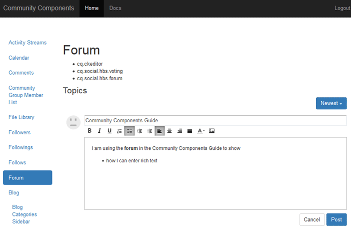

# Essentiële elementen van de Rich Text Editor {#rich-text-editor-essentials}

## Overzicht {#overview}

Een Rich Text Editor (RTE) biedt de mogelijkheid om tekst met opmaak in te voeren.

Voor de componenten van de Gemeenschappen, terwijl gelijkend op [rijke tekstredacteur in het auteursmilieu](../../help/sites-authoring/rich-text-editor.md), het tekst ingegaan in het publicatiemilieu beïnvloedt.



## RTF-editor {#enabling-rich-text-editor} inschakelen

De componenten van gemeenschappen die gebruiker geproduceerde inhoud (UGC) toestaan kunnen worden toegelaten om RTE toe te staan. Afhankelijk van of de component aan een pagina werd toegevoegd of binnen een [functie](functions.md) inbegrepen, kan RTE al dan niet door gebrek worden toegelaten.

Als deze optie niet is ingeschakeld, voert u [bewerkingsmodus auteur](sites-console.md#authoring-site-content) in, selecteert u de component die u wilt bewerken en schakelt u het selectievakje `Rich Text Editor` in.

RTE is beschikbaar voor de volgende componenten van de Gemeenschappen:

* [Blog](blog-feature.md)
* [Kalender](calendar.md)
* [Opmerkingen](comments.md)
* [FileLibrary](file-library.md)
* [Forum](forum.md)
* [Berichten](configure-messaging.md)
* [QnA](working-with-qna.md)
* [Revisies](reviews.md)

## Aanpassing {#customization}

Aanpassing van de rijke tekstredacteur is mogelijk aangezien de implementatie op [CKEditor](https://www.ckeditor.com/) wordt gebaseerd.

De huidige configuratie voor Community-componenten bevindt zich in de `cq.social.  scf   clientlib`, die zich bevindt in de repository op

`/libs/clientlibs/social/commons/scf/ckrte.js`

Het wijzigen van de client lib cq.social.scf wordt niet aangeraden, omdat toekomstige upgrades mogelijk alle bewerkingen overschrijven.

### Voorbeeld van aanpassing: Inline-koppelingen {#example-customization-inline-links}

Vanwege beveiligingsproblemen zijn de hyperlinkopties niet opgenomen in de set met RTF-pictogrammen die standaard aan leden worden gepresenteerd. De mogelijkheid tot stuipen is uitgebreid wanneer hrefs in UGC zijn toegestaan.

De hyperlinkopties toevoegen aan de werkbalk:

* Een werkbalk toevoegen met de naam &quot; `links`&quot;
   * `{ name: 'links', items: [ 'Link','Unlink','Anchor' ] }`
* Selecteer **[!UICONTROL Save All]**

#### /libs/clientlibs/social/commons/scf/ckrte.js {#libs-clientlibs-social-commons-scf-ckrte-js}

```
CKRte.prototype.config = {
    toolbar: [
        { name: "basicstyles",
           items: ["Bold", "Italic", "Underline", "NumberedList", "BulletedList", "Outdent", "Indent", "JustifyLeft", "JustifyCenter", "JustifyRight", "JustifyBlock", "TextColor"]
        },
        { name: 'links',
           items: [ 'Link','Unlink','Anchor' ]
        }
    ],
    autoParagraph: false,
    autoUpdateElement: false,
    removePlugins: "elementspath",
    resize_enabled: false
};
```

