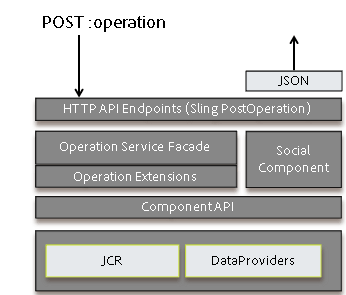

# Framework sociale component {#social-component-framework}

Het sociale componentenkader (SCF) vereenvoudigt het proces om, componenten van Gemeenschappen op zowel server-kant als cliënt-kant te vormen aan te passen en uit te breiden.

De voordelen van het kader:

* **Functioneel**: Eenvoud van integratie buiten de handgreep met weinig of geen aanpassing voor 80% van de gebruikscategorieën.
* **Schildbaar**: Consistent gebruik van HTML-kenmerken voor CSS-opmaak.
* **Uitbreidbaar**: De implementatie van de component is object-oriented en licht op bedrijfslogica - gemakkelijk om stijgende bedrijfslogin op server toe te voegen.
* **Flexibel**: Eenvoudige JavaScript-sjablonen zonder logica die eenvoudig kunnen worden overschreven en aangepast.
* **Toegankelijk**: De HTTP-API ondersteunt het posten vanaf elke client, inclusief mobiele apps.
* **Draagbaar**: Integreer/sluit in om het even welke webpagina in die op om het even welke technologie wordt gebouwd.

Onderzoek op een auteur of publiceer instantie gebruikend de interactieve gids [van de Componenten van de](components-guide.md)Gemeenschap.

## Overzicht {#overview}

In SCF, wordt een component samengesteld uit een POJO SocialComponent, een Malplaatje van Handlebars JS (om de component terug te geven), en CSS (om de component te stileren).

Een JS-sjabloon Handlebars kan de JS-componenten model/weergave uitbreiden om gebruikersinteractie met de component op de client af te handelen.

Als een component wijziging van gegevens moet ondersteunen, kan de implementatie van de API voor sociale componenten worden geschreven ter ondersteuning van het bewerken/opslaan van gegevens die vergelijkbaar zijn met model- en gegevensobjecten in traditionele webtoepassingen. Daarnaast kunnen bewerkingen (controllers) en een bewerkingsservice worden toegevoegd om bewerkingsverzoeken te verwerken, bedrijfslogica uit te voeren en de API&#39;s op het model/de gegevensobjecten aan te roepen.

De API van de sociale component kan worden uitgebreid om gegevens te verstrekken die door een cliënt voor een meningslaag of een cliënt van HTTP worden vereist.

### Hoe pagina&#39;s voor de client worden gerenderd {#how-pages-are-rendered-for-client}


### Component Customization and Extension {#component-customization-and-extension}

Als u de componenten wilt aanpassen of uitbreiden, schrijft u alleen de overlays en extensies naar de map /apps waarmee u het upgradeproces naar toekomstige releases kunt vereenvoudigen.

* Voor skin:
   * Alleen de [CSS hoeft te worden bewerkt](client-customize.md#skinning-css).
* Voor uiterlijk:
   * Wijzig de JS-sjabloon en de CSS.
* Voor look, Voel en UX:
   * Wijzig de JS-sjabloon, CSS en [breid JavaScript](client-customize.md#extending-javascript)uit of overschrijf JavaScript.
* Om de informatie te wijzigen beschikbaar aan het Malplaatje JS of aan het eindpunt van GET:
   * Breid de [Sociale Component](server-customize.md#socialcomponent-interface)uit.
* Aangepaste verwerking toevoegen tijdens bewerkingen:
   * Schrijf een [OperationExtension](server-customize.md#operationextension-class).
* Een nieuwe aangepaste bewerking toevoegen:
   * Maak een nieuwe bewerking [Verzending](server-customize.md#postoperation-class)Sling Post.
   * Gebruik indien nodig bestaande [OperationServices](server-customize.md#operationservice-class) .
   * Voeg JavaScript-code toe om de bewerking zo nodig vanaf de client aan te roepen.

## Server-Side Framework {#server-side-framework}

Het framework biedt API&#39;s voor toegang tot functionaliteit op de server en voor ondersteuning van interactie tussen de client en de server.

### Java API&#39;s {#java-apis}

De Java API&#39;s bieden abstracte klassen en interfaces die gemakkelijk kunnen worden overgeërfd of gesubclassificeerd.

De belangrijkste klassen worden beschreven op de [server-kant pagina van de Aanpassing](server-customize.md) .

Bezoek het Overzicht [van de Leverancier van het Middel van de](srp.md) Opslag om over het werken met UGC te leren.

### HTTP API {#http-api}

De HTTP-API ondersteunt eenvoudige aanpassingen en keuzemogelijkheden van clientplatforms voor PhoneGap-apps, native apps en andere integraties en mashups. Bovendien staat HTTP API een communautaire plaats toe om als dienst zonder een cliënt te lopen, zodat de kadercomponenten in om het even welke webpage kunnen worden geïntegreerd die op om het even welke technologie wordt voortgebouwd.

### HTTP API - GET {#http-api-get-requests}

Voor elke SocialComponent, verstrekt het kader een op HTTP-Gebaseerd API eindpunt. Het eindpunt wordt betreden door een verzoek van de GET naar het middel met &quot;.social.json&quot;selecteur + uitbreiding te verzenden. Gebruikend Sling, wordt het verzoek overhandigd aan `DefaultSocialGetServlet`.

**`DefaultSocialGetServlet`**

1. Geeft de bron (resourceType) door aan de bron `SocialComponentFactoryManager` en ontvangt een SocialComponentFactory die een `SocialComponent` representatiebron kan selecteren.

1. Roept de fabriek aan en ontvangt een apparaat `SocialComponent` waarmee de bron en het verzoek kunnen worden afgehandeld.
1. Roept het `SocialComponent`aan, dat het verzoek verwerkt en een vertegenwoordiging JSON van de resultaten terugkeert.
1. Retourneert de JSON-reactie op de client.

**`GET Request`**

Een standaard GET servlet luistert naar .social.json verzoeken waaraan de SocialComponent met klantgerichte JSON antwoordt.


### HTTP API - POST-aanvragen {#http-api-post-requests}

Naast de (Gelezen) verrichtingen van de GET, bepaalt het kader een eindpuntpatroon om andere verrichtingen op een component toe te laten, met inbegrip van Create, Update en Schrapping. Deze eindpunten zijn HTTP-API&#39;s die invoer accepteren en reageren met HTTP-statuscodes of met een JSON-reactieobject.

Met dit eindpuntpatroon van het framework worden CUD-bewerkingen uitbreidbaar, herbruikbaar en getest.

**`POST Request`**

Er is een Sling POST:verrichting voor elke verrichting SocialComponent. De bedrijfslogica en onderhoudscode voor elke verrichting zijn verpakt in een OperationService die door HTTP API of van elders als dienst OSGi toegankelijk is. Hooks wordt geleverd ter ondersteuning van instelbare bewerkingsextensies voor acties voor en na acties.



### Storage Resource Provider (SRP) {#storage-resource-provider-srp}

Ga voor meer informatie over de verwerking van UGC die is opgeslagen in de [community content store](working-with-srp.md)naar:

* [Overzicht](srp.md) van Storage Resource Provider - Inleiding en overzicht van het opslaggebruik.
* [SRP en de Hoofdzaak](srp-and-ugc.md) UGC - SRP API hulpprogrammamethodes en voorbeelden.
* [Toegang tot UGC met SRP](accessing-ugc-with-srp.md) - Coderingsrichtlijnen.

### Aanpassingen op de server {#server-side-customizations}

Bezoek [Server-Side Aanpassingen](server-customize.md) voor informatie over het aanpassen van de bedrijfslogica en het gedrag van een component van Communities op de server.

## Handlebars JS Templating Language {#handlebars-js-templating-language}

Een van de merkbaardere wijzigingen in het nieuwe framework is het gebruik van de JS-sjabloontaal ( [Handlebars JS) (HBS)](https://www.handlebarsjs.com/), een populaire open-source technologie voor server-client rendering.

HBS-scripts zijn eenvoudig, zonder logica, kunnen op zowel de server als de client worden gecompileerd, zijn eenvoudig te bedekken en aan te passen en zijn op natuurlijke wijze gebonden aan de client-UX, omdat HBS renderen aan de clientzijde ondersteunt.

Het framework biedt verschillende helpers [van](handlebars-helpers.md) Handlebars die nuttig zijn bij het ontwikkelen van sociale componenten.

Op de server, wanneer het Sling een verzoek van de GET verhelpt, identificeert het het manuscript dat zal worden gebruikt om op het verzoek te antwoorden. Als het manuscript een malplaatje HBS (.hbs) is, zal het Sling het verzoek aan de Motor van Handlebars delegeren. De Motor Handlebars zal dan de SocialComponent van aangewezen SocialComponentFactory krijgen, een context bouwen, en HTML teruggeven.

### Geen toegangsbeperking {#no-access-restriction}

Handlebars (HBS) malplaatjedossiers (.hbs) zijn analoog aan .jsp en .html malplaatjedossiers, behalve zij kunnen voor het teruggeven zowel in cliëntbrowser als op de server worden gebruikt. Daarom zal een cliëntbrowser die om een cliënt-zijmalplaatje verzoekt een .hbs dossier van de server ontvangen.

Dit vereist dat alle malplaatjes van HBS in de sling onderzoekspad (om het even welke .hbs dossiers onder /libs/ of /apps) door om het even welke gebruiker van auteur kunnen worden gehaald of publiceren.

De toegang van HTTP tot .hbs dossiers kan niet worden verboden.

### Een onderdeel van een Gemeenschappen toevoegen of opnemen {#add-or-include-a-communities-component}

De meeste communautaire componenten moeten als Verlenen adresseerbare middel worden *toegevoegd* . Een aantal van de onderdelen van de Gemeenschappen kan in een sjabloon worden *opgenomen* als een niet-bestaande bron, zodat de locatie waarop door gebruikers gegenereerde inhoud (UGC) moet worden geschreven, dynamisch kan worden opgenomen en aangepast.

In beide gevallen moeten ook de [vereiste clientbibliotheken](clientlibs.md) van de component aanwezig zijn.

**Een component toevoegen**

Het toevoegen van een component verwijst naar het proces om een geval van een middel (component) toe te voegen, zoals wanneer gesleept van componentenbrowser (sidekick) op een pagina in auteur uitgeeft wijze.

Het resultaat is een JCR-onderliggend knooppunt onder een pari-knooppunt, dat adresseerbaar is.

**Een component opnemen**

Het opnemen van een component verwijst naar het proces waarbij een verwijzing naar een [&quot;niet-bestaande&quot; resource](srp.md#for-non-existing-resources-ners) (geen JCR-knooppunt) binnen de sjabloon wordt toegevoegd, zoals het gebruik van een scripttaal.

Vanaf AEM 6.1, wanneer een component dynamisch in plaats van toegevoegd wordt omvat, is het mogelijk om de eigenschappen van de component in auteur *design *mode uit te geven.

Slechts een paar AEM Communities-componenten kunnen dynamisch worden opgenomen. Het zijn:

* [Opmerkingen](essentials-comments.md)
* [Classificatie](rating-basics.md)
* [Revisies](reviews-basics.md)
* [Stemming](essentials-voting.md)

Met de [Community Components Guide](components-guide.md) kunnen meegeleverde onderdelen van het toevoegen naar het opnemen worden geschakeld.

**Wanneer het gebruiken van de het malplaatjetaal van Handlebars** , wordt het niet bestaande middel inbegrepen gebruikend [omvat helper](handlebars-helpers.md#include) door zijn resourceType te specificeren:

`{{include this.id path="comments" resourceType="social/commons/components/hbs/comments"}}`

**Wanneer u JSP** gebruikt, wordt een bron opgenomen met de tag [cq:include](../../help/sites-developing/taglib.md#lt-cq-include):

```
<cq:include path="votes"
 resourceType="social/tally/components/voting" />
```

>[!NOTE]
>
>Zie [Component Sideloading](sideloading.md)als u een component dynamisch aan een pagina wilt toevoegen in plaats van deze toe te voegen aan of op te nemen in een sjabloon.


### Handlebars Helpers {#handlebars-helpers}

Zie [SCF Handlebars Helpers](handlebars-helpers.md) voor een lijst en een beschrijving van douanehelpers beschikbaar in SCF.

## Client-Side Framework {#client-side-framework}

### JavaScript-framework voor modelweergave {#model-view-javascript-framework}

Het framework omvat een uitbreiding van [Backbone.js](https://www.backbonejs.org/), een model-weergave JavaScript-framework, om de ontwikkeling van rijke, interactieve componenten te vergemakkelijken. De objectgeoriënteerde aard ondersteunt een uitbreidbaar/herbruikbaar framework. De communicatie tussen client en server wordt vereenvoudigd door middel van de HTTP API.

Het framework maakt gebruik van Handlebars-sjablonen aan de serverzijde om de componenten voor de client te renderen. De modellen zijn gebaseerd op de JSON-reacties die door de HTTP-API zijn gegenereerd. De meningen binden zich aan HTML die door de malplaatjes van Handlebars wordt geproduceerd en verstrekken interactiviteit.

### CSS-conventies {#css-conventions}

Hieronder vindt u aanbevolen conventies voor het definiëren en gebruiken van CSS-klassen:

* Gebruik duidelijk benoemde CSS-klassenselectienamen en vermijd generieke namen zoals &#39;kop&#39;, &#39;afbeelding&#39;, enzovoort.
* Definieer specifieke klassenselectorstijlen, zodat de CSS-opmaakmodellen goed werken met andere elementen en stijlen op de pagina. Bijvoorbeeld: `.social-forum .topic-list .li { color: blue; }`
* Houd CSS-klassen voor opmaak gescheiden van CSS-klassen voor UX die door JavaScript worden aangestuurd.

### Aanpassingen op de client {#client-side-customizations}

Voor het aanpassen van de verschijning en het gedrag van een component van de Gemeenschappen op de cliënt-kant, verwijzing [Cliënt-Kant Aanpassingen](client-customize.md), die informatie omvatten over:

* [Bedekkingen](client-customize.md#overlays)
* [Extensies](client-customize.md#extensions)
* [HTML-opmaak](client-customize.md#htmlmarkup)
* [CSS schuintrekken](client-customize.md#skinning-css)
* [JavaScript uitbreiden](client-customize.md#extending-javascript)
* [Clientlibs voor SCF](client-customize.md#clientlibs-for-scf)

## Essentiële functies en componenten {#feature-and-component-essentials}

De essentiële informatie voor ontwikkelaars wordt beschreven in de sectie [Functie en Component Essentials](essentials.md) .

Aanvullende ontwikkelaarsinformatie vindt u in de sectie [Codeerrichtlijnen](code-guide.md) .

## Problemen oplossen {#troubleshooting}

Veelvoorkomende problemen en bekende problemen worden beschreven in de sectie [Problemen oplossen](troubleshooting.md) .

