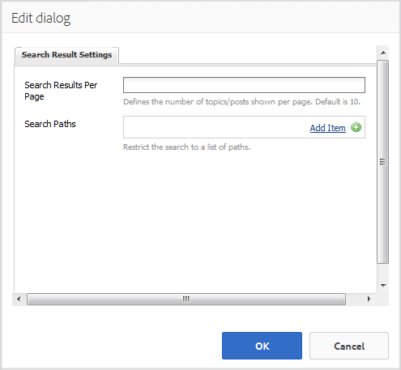

# Zoekfunctie {#search-feature}

De zoekfunctie werkt met verschillende andere functies, zoals forums, om inhoud te kunnen zoeken.

Wanneer het toevoegen van de capaciteit aan onderzoeksposten ingegaan door communautaire leden, die als gebruiker geproduceerde inhoud (UGC) worden bedoeld, zijn er twee componenten: [Zoekresultaten](#search) en [zoekresultaten](#search-results).

De pagina die de `Search Results` component bevat, ondersteunt zowel het zoeken als het weergeven van resultaten.

De pagina die de `Search` component bevat, biedt een plaats om een zoekopdracht te starten met resultaten die op de `Search Results` pagina worden weergegeven.

De zoekfunctie kan worden gebruikt met elke andere functie waarmee bezoekers en leden van de site inhoud kunnen bekijken.

## Zoeken {#search-features}

### Zoeken toevoegen aan een pagina {#add-search-to-a-page}

Als u een `Search` component aan een pagina wilt toevoegen in de ontwerpmodus, gebruikt u de componentbrowser om de component te zoeken `Communities / Search` en naar de juiste positie op een pagina te slepen. Voor het gebruik van `Search` is een tweede pagina vereist voor de `Search Results.`

Ga voor de benodigde informatie naar [Community Components Basics](basics.md).

Wanneer de vereiste bibliotheek aan de clientzijde `cq.social.hbs.search`is opgenomen, wordt de `Search` component op deze manier weergegeven.

### De toegevoegde zoekopdracht configureren {#configure-the-added-search}

Selecteer de geplaatste `Search` component die u wilt openen en selecteer het `Configure` pictogram waarmee het dialoogvenster Bewerken wordt geopend.

Geef op onder het tabblad **[!UICONTROL Zoekinstellingen]** op hoe wordt gezocht in welke paden een zoekopdracht wordt uitgevoerd door een bezoeker.

* **[!UICONTROL Zoekpaden]** Door zoekpaden toe te voegen met de knop Item toevoegen, wordt de zoekopdracht beperkt. Als voorbeeld, om het onderzoek tot een specifiek forum te beperken, selecteer een forumcomponent die binnen een pagina wordt geplaatst:

   * `/content/community-components/en/forum/jcr:content/content/forum`

* **[!UICONTROL Resulterende pagina]** De resultaten worden weergegeven op een aparte pagina die met de browser is opgegeven om een pagina met de `Search Results` component te selecteren.

## Zoekresultaten {#search-results}

### Zoekresultaten toevoegen aan een pagina {#add-search-results-to-a-page}

Als u een `Search Results` component aan een pagina wilt toevoegen in de ontwerpmodus, gebruikt u de componentbrowser om te zoeken naar

* `Communities / Search Results`

en sleep het naar de juiste plaats op een pagina. In tegenstelling tot de zoekcomponent is geen tweede pagina nodig omdat de resultaten op dezelfde pagina worden weergegeven.

Als u Zoeken elders op de website gebruikt, `Search Results` kan deze ene pagina met de pagina worden geconfigureerd als de pagina `Result Page` voor een of alle instanties van `Search`.

Ga voor de benodigde informatie naar [Community Components Basics](basics.md).

Wanneer de vereiste bibliotheek aan de clientzijde `cq.social.hbs.search`is opgenomen, ziet u hier de `Search Result` component als volgt:

### Het toegevoegde zoekresultaat configureren {#configure-the-added-search-result}

Selecteer de geplaatste `Search Results` component die u wilt openen en selecteer het `Configure` pictogram waarmee het dialoogvenster Bewerken wordt geopend.

Op het tabblad Instellingen **[!UICONTROL van]** zoekresultaat kunt u opgeven welke paden in de zoekopdracht worden opgenomen wanneer een bezoeker een query invoert.

* **[!UICONTROL Zoekresultaten per pagina]**

   Bepaal het aantal onderwerpen/posten dat per pagina wordt getoond. De standaardwaarde is 10.

* **[!UICONTROL Paden zoeken]**

   Door zoekpaden toe te voegen met de knop Item toevoegen, is de zoekopdracht naar inhoud beperkt.

## Additional Information {#additional-information}

Meer informatie vindt u op de pagina [Doorzoekfuncties](search-implementation.md) voor ontwikkelaars.
