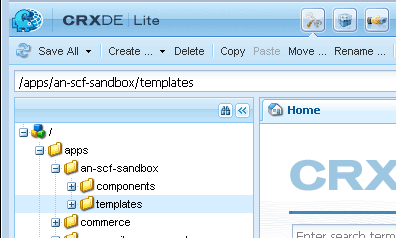

# Websitestructuur instellen {#setup-website-structure}

In de onderstaande instructies worden de mappen beschreven die op de volgende locaties moeten worden gemaakt om uw website in te stellen:

* `/apps/an-scf-sandbox`

   Hier bevinden zich aangepaste toepassingen en sjablonen.

* `/etc/designs/an-scf-sandbox`

   Hier bevinden zich downloadbare ontwerpelementen.

* `/content/an-scf-sandbox`

   Hier bevinden zich de downloadbare webpagina&#39;s.

De code in deze zelfstudie vertrouwt erop dat de naam van de hoofdmap gelijk is voor de toepassing, het ontwerp en de inhoud. Als u een andere naam voor uw website kiest, vervangt u deze altijd `an-scf-sandbox` door de naam die u hebt gekozen.

>[!NOTE]
>
>Namen:
>
>* De namen die in CRXDE worden gezien zijn knooppuntnamen die de weg aan adresseerbare inhoud vormen.
>* Node names may contain spaces, but when used in an URI, the space must be encoded either as &#39;%20&#39; or &#39;+&#39;.
>* Node-namen kunnen afbreekstreepjes en onderstrepingstekens bevatten, maar deze moeten worden gecodeerd als er in een Java-bestand naar wordt verwezen als een pakketnaam. Zowel koppeltekens als onderstrepingstekens worden overgeslagen met een onderstrepingsteken gevolgd door de Unicode-waarde:

   >
   >   
   * afbreekstreepje wordt &#39;_002d&#39;
   >   * onderstrepingsteken wordt &#39;_005f&#39;

## De toepassingsmap (/apps) instellen {#setup-the-application-directory-apps}

De map /apps in de opslagplaats bevat de code met implementaties van het gedrag en de rendering van de pagina&#39;s die vanuit de map /content worden aangeboden.

De map /apps is beveiligd en niet toegankelijk voor het publiek, net als de mappen /content en /etc/designs.

1. Map maken `/apps/an-scf-sandbox` .

   Werken **[!UICONTROL CRXDE Lite]**, in het deelvenster Verkenner

   1. Selecteer de `/apps` map.
   1. Klikken met rechtermuisknop **[!UICONTROL Create]**... of trek het **[!UICONTROL Create...]** menu omlaag.
   1. Selecteer **[!UICONTROL Create Folder...]**.
   1. In the **[!UICONTROL Create Folder]** dialog, enter `an-scf-sandbox`.
   1. Klik op **[!UICONTROL OK]**.

1. Submap maken **[!UICONTROL components]** .

   1. Selecteer de `/apps/an-scf-sandbox` map.
   1. Klik op **[!UICONTROL Create > Create Folder]**.
   1. In the **[!UICONTROL Create Folder]** dialog, enter **[!UICONTROL components]**.
   1. Klik op **[!UICONTROL OK]**.

1. Submap maken **[!UICONTROL templates]** .

   1. Selecteer de `/apps/an-scf-sandbox` map.
   1. Klik op **[!UICONTROL Create > Create Folder]**.
   1. In the **[!UICONTROL Create Folder]** dialog, enter **[!UICONTROL templates]**.
   1. Klik op **[!UICONTROL OK]**.
   1. Opnieuw selecteren `/apps/an-scf-sandbox`.
   1. Selecteer **[!UICONTROL Save All]**.

   Net als bij elk bewerkingsproces, kunt u dit vaak opslaan. Als u problemen ondervindt met het invoeren van gegevens, kan dit zijn omdat er een time-out is opgetreden bij uw aanmelding of omdat u vorige bewerkingen moet opslaan.

1. De structuur in het deelvenster Verkenner van CRXDE Lite moet er nu ongeveer als volgt uitzien:

   

## De ontwerpmap instellen (/etc/designs) {#setup-the-design-directory-etc-designs}

De map /etc/designs bevat de afbeeldingen, scripts en opmaakmodellen die samen met de pagina-inhoud moeten worden gedownload.

1. Als u het Designer-gereedschap wilt gebruiken in de klassieke gebruikersinterface, bladert u naar [https://&lt;server>:&lt;port>/miscadmin](http://localhost:4502/miscadmin).

   Opmerking: Als u CRXDE Lite gebruikt om een Knoop van type tot stand te brengen `cq:Page`, zouden het Toegangsbeheer en de Replicatie niet aan standaardmontages voor een pagina worden geplaatst.

1. Selecteer de **[!UICONTROL Designs]** map in het deelvenster Verkenner en klik op **[!UICONTROL New]** > **[!UICONTROL New Page]**.

   Enter:

   * Titel: **[!UICONTROL An SCF Sandbox]**
   * Naam: **[!UICONTROL an-scf-sandbox]**
   * Selecteer **[!UICONTROL Design Page Template]**

   Klik op **[!UICONTROL Create]**.

   

1. Vernieuw het verkennervenster als de map &quot;An SCF Sandbox&quot; niet wordt weergegeven.

1. Ga terug naar CRXDE Lite (http:// localhost:4502/crx/de) en vouw /etc/designs uit om het knooppunt met de naam &quot;an-scf-sandbox&quot; weer te geven.

   In de rechterbenedenruit van CRXDE, kunt u het lusje van Eigenschappen, het lusje van het Controle van de Toegang en het lusje van de Replicatie bekijken om te zien wat gebruikend het Malplaatje van de Pagina van het Ontwerp werd bepaald.

   

## De inhoudsdirectory (/inhoud) instellen {#setup-the-content-directory-content}

De map /content in de opslagmap is waar de website-inhoud zich bevindt. De paden onder /content bestaan uit de paden van de URL voor browserverzoeken.

*Nadat* de [paginasjabloon](initial-app.md#createthepagetemplate) is gemaakt als onderdeel van de oorspronkelijke toepassing, kan de eerste pagina-inhoud worden gemaakt op basis van de sjabloon.... [**ê&#x200B;**](initial-app.md)
