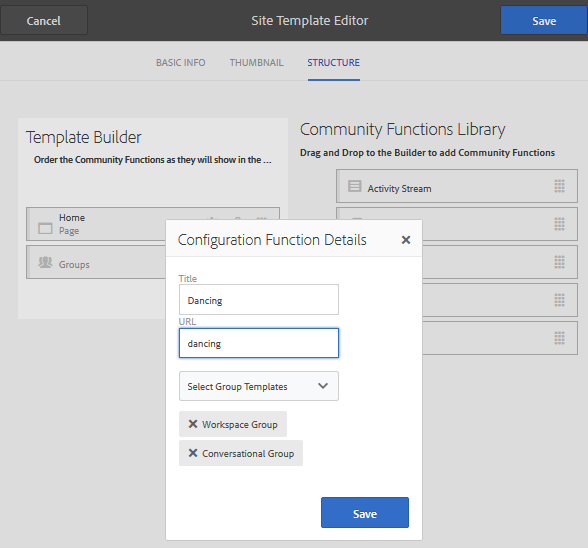

# Sitesjablonen {#site-templates}

De Sitesjabloonconsole is vergelijkbaar met de [Groepssjablonen](tools-groups.md) console, die gericht is op functies die van belang zijn voor groepen van de Gemeenschap.

>[!NOTE]
>
>De consoles voor het creëren van [communitysites](sites-console.md), [communitysjablonen](sites.md), [communitygroepsjablonen](tools-groups.md), en [communautaire functies](functions.md) zijn alleen bestemd voor gebruik in de ontwerpomgeving.

## Sitesjabloonconsole {#site-templates-console}

In het milieu van de Auteur, om de console van communautaire plaatsen te bereiken:

* Vanuit globale navigatie: **[!UICONTROL Tools > Communities > Site Templates]**

Deze console toont de malplaatjes waarvan een [community-site](sites-console.md) kunnen worden gemaakt en kunnen nieuwe sitesjablonen worden gemaakt.

## Sitesjabloon maken {#create-site-template}

Als u een sitesjabloon wilt gaan maken, selecteert u `Create`.

Hiermee wordt het deelvenster Site-editor geopend dat drie subdeelvensters bevat:

### Basisinformatie {#basic-info}

In het deelvenster Basisinformatie worden een naam, beschrijving en of de sjabloon is ingeschakeld of uitgeschakeld, geconfigureerd:

* **[!UICONTROL Community Site Template Name]**

  De naam-id van de sjabloon.

* **[!UICONTROL Community Site Template Description]**

  De sjabloonbeschrijving.

* **[!UICONTROL Disabled/Enabled]**

  Een schakeloptie die bepaalt of naar de sjabloon kan worden verwezen.

### Miniatuur {#thumbnail}

(Optioneel) Selecteer het pictogram Afbeelding uploaden om een miniatuur weer te geven met de naam en beschrijving voor de makers van gemeenschapssites.

### Structuur {#structure}

Als u communityfuncties wilt toevoegen, sleept u van de rechterkant naar links in de volgorde waarin de koppelingen in het sitemenu moeten worden weergegeven. Stijlen worden toegepast op de sjabloon tijdens het maken van de site.

Als u bijvoorbeeld een homepage wilt, sleept u de functie Pagina uit de bibliotheek en zet u de pagina onder de sjabloonbuilder neer. Dit leidt tot het openen van het dialoogvenster voor paginaconfiguratie. Zie de [functies console](functions.md) voor informatie over de configuratievensters.

U kunt doorgaan met slepen en neerzetten van alle andere communityfuncties die voor een communitysite op basis van deze sjabloon zijn gewenst.

De paginafunctie biedt een lege pagina. Met de functie Groepen kunt u een groepssite (subcommunity) maken binnen de communitysite.

>[!CAUTION]
>
>De functie Groepen moet *niet de eerste of de enige* in de sitestructuur.
>
>Elke andere functie, zoals de [page, functie](functions.md#page-function), moet worden opgenomen en als eerste worden vermeld.

### Groepsjablonen voor groepfuncties {#group-templates-for-groups-function}

Wanneer het omvatten van een functie van Groepen in het plaatssjabloon, vereist de configuratie de specificatie van de keuzen van het groepsmalplaatje toegestaan wanneer een nieuwe groep in het publicatiemilieu wordt gecreeerd.

>[!CAUTION]
>
>De functie Groepen moet *niet de eerste of de enige* in de sitestructuur.

Door twee of meer groepsmalplaatjes te selecteren, wordt een keus verstrekt aan de groepsbeheerder wanneer eigenlijk het creëren van een groep in de gemeenschap.

## Sitesjabloon bewerken {#edit-site-template}

Bij het weergeven van sitesjablonen in de hoofdmap [Sitesjabloonconsole](#site-templates-console)kunt u een bestaande sitesjabloon selecteren om te bewerken.

Dit proces biedt dezelfde deelvensters als [een sitesjabloon maken](#create-site-template).
