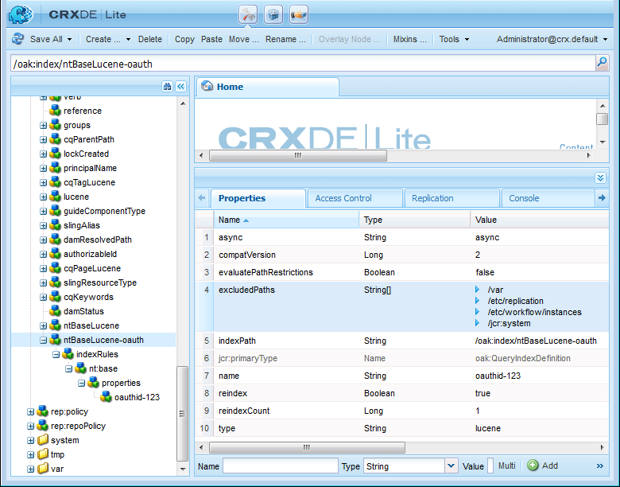

# Sociale aanmelding met Facebook en Twitter {#social-login-with-facebook-and-twitter}

Met aanmelden via een sociaal netwerk kunt u een sitebezoeker de mogelijkheid bieden zich aan te melden bij zijn Facebook- of Twitter-account. Daarom moeten toegestane Facebook- of Twitter-gegevens worden opgenomen in het profiel AEM lid.

## Overzicht van sociale aanmelding {#social-login-overview}

Om sociale login te omvatten, wordt het *vereist* om de toepassingen van de douaneFacebook en van de Twitter tot stand te brengen.

Terwijl wij-kleinhandelssteekproef steekproef steekproef voorbeeldFacebook en Twitter apps en de wolkendiensten verstrekt, zijn zij niet beschikbaar op de website van de a [&#x200B; productie &#x200B;](../../help/sites-administering/production-ready.md).

De vereiste stappen zijn:

1. [&#x200B; laat OAuth authentificatie &#x200B;](#adobe-granite-oauth-authentication-handler) op alle AEM toe publiceert instanties.

   Als OAuth niet is ingeschakeld, mislukken pogingen om u aan te melden.

1. **creeer** een sociale app en de wolkendienst.

   * Aanmelden met Facebook ondersteunen:

      * Creeer a [&#x200B; app van Facebook &#x200B;](#create-a-facebook-app).
      * Creeer en publiceer a [&#x200B; Facebook Connect wolkendienst &#x200B;](#create-a-facebook-connect-cloud-service).

   * Aanmelden met Twitter ondersteunen:

      * Creeer app van de a [&#x200B; Twitter &#x200B;](#create-a-twitter-app).
      * Creeer en publiceer a [&#x200B; Twitter verbindt de wolkendienst &#x200B;](#create-a-twitter-connect-cloud-service).

1. [**laat** sociale login &#x200B;](#enable-social-login) voor een communautaire plaats toe.

Er zijn twee basisbeginselen:

1. **Reikwijdte** (toestemmingen) specificeert de gegevens app wordt toegestaan om te verzoeken.

   * De Facebook en de Twitter [&#x200B; van de Adobe granite OAuth van de Toepassing en van de Leverancier &#x200B;](#adobe-granite-oauth-application-and-provider) instanties, door gebrek, omvatten de basis toepassingstoestemmingen binnen hun werkingsgebied.

1. **Gebieden** (params) specificeert de daadwerkelijke gevraagde gegevens gebruikend parameters URL.

   * Deze gebieden worden gespecificeerd in [&#x200B; AEM Communities Facebook OAuth Provider &#x200B;](#aem-communities-facebook-oauth-provider) en [&#x200B; de Twitter OAuth Provider van AEM Communities &#x200B;](#aem-communities-twitter-oauth-provider).
   * De standaardvelden zijn toereikend voor de meeste gevallen waarin het wordt gebruikt, maar kunnen worden gewijzigd.

## Aanmelden bij facebook {#facebook-login}

### Facebook API-versie {#facebook-api-version}

De sociale aanmelding en het voorbeeld van de wij-retail Facebook werden ontwikkeld toen de Facebook Graph API versie 1.0 was.
Vanaf AEM 6.4 GA en AEM 6.3 SP1 is de sociale aanmelding bijgewerkt om te werken met de nieuwere versie van Facebook Graph API 2.5.

>[!NOTE]
>
>Voor oudere AEM versies, als u een uitzondering in logboeken **onder ogen ziet kan geen teken uit dit** halen, verbetering aan recentste GFP voor die AEM versie.

Voor de de versieinformatie van de Grafiek API van Facebook, zie de [&#x200B; verandering van Facebook API &#x200B;](https://developers.facebook.com/docs/apps/changelog).

### Een Facebook-app maken {#create-a-facebook-app}

Een correct geconfigureerde Facebook-toepassing is vereist om de aanmelding voor sociale Facebook in te schakelen.

Om de toepassing van Facebook tot stand te brengen, volg Facebook instructies in [&#x200B; https://developers.facebook.com/apps/ &#x200B;](https://developers.facebook.com/apps/). Wijzigingen in de instructies worden niet in de volgende informatie weergegeven.

In het algemeen geldt vanaf Facebook API v2.7 het volgende:

* *voeg een Nieuwe app van Facebook toe*
   * Voor *Platform*, kies Website:
      * Voor *Plaats URL*, ga `  https://<server>:<port>.` in
      * Voor *Naam van de Vertoning*, ga een titel voor gebruik als Titel van Facebook in verbindt de dienst.
      * Voor *Categorie*, geadviseerd het kiezen *Apps voor Pagina&#39;s*, maar kan om het even wat zijn.
      * *voeg Product toe: Login Facebook*
      * Voor *Geldige OAuth richt URIs*, ga `  https://<server>:<port>.` in

>[!NOTE]
>
>Voor ontwikkeling werkt http://localhost:4503.

Zoek de instellingen **[!UICONTROL App ID]** en **[!UICONTROL App Secret]** nadat de toepassing is gemaakt. Deze informatie wordt vereist voor het vormen van de [&#x200B; wolkendienst van Facebook &#x200B;](#createafacebookcloudservice).

### Een Facebook Connect-Cloud Service maken {#create-a-facebook-connect-cloud-service}

De [&#x200B; Adobe granite OAuth Application en de 1&rbrace; instantie van de Leverancier, die door een configuratie van de wolkendienst te creëren wordt geconcretiseerd, identificeert de toepassing van Facebook en de lidgroep(en) waaraan de nieuwe gebruikers worden toegevoegd.](#adobe-granite-oauth-application-and-provider)

1. Meld u aan bij de AEM auteur-instantie met beheerdersrechten.
1. Selecteer **[!UICONTROL Tools]** > **[!UICONTROL Cloud Services]** > **[!UICONTROL Facebook Social login configuration]** bij globale navigatie.
1. Selecteer de configuratie **[!UICONTROL context path]** .

   **[!UICONTROL Context path]** moet hetzelfde zijn als het pad voor cloudconfiguratie dat u hebt geselecteerd bij het maken/bewerken van een communitysite.

1. Controleer of uw contextpad is ingeschakeld om hieronder cloudservices te maken.
1. Ga naar **[!UICONTROL Tools]** > **[!UICONTROL General]** > **[!UICONTROL Configuration Browser]** . Selecteer de context en bewerk de eigenschappen. Schakel cloudconfiguraties in als deze nog niet zijn ingeschakeld.

   

   * Zie Browser van de Configuratie [&#128279;](/help/sites-administering/configurations.md) documentatie 0&rbrace; &lbrace;voor meer informatie.

1. **creeer/geef** de wolkendienstconfiguratie van Facebook uit.

   

   * **[!UICONTROL Title]** (*Vereist*) ga een vertoningstitel in die Facebook App identificeert. Gebruik de zelfde naam ingegaan als *Naam van de Vertoning* voor Facebook app.
   * **[!UICONTROL App ID/API Key]** (*Vereiste*) ga ***identiteitskaart van de Toepassing*** voor Facebook App in. Dit identificeert de [&#x200B; Adobe granite OAuth Application en 1&rbrace; instantie van de Leverancier die van de dialoog wordt gecreeerd.](https://helpx.adobe.com/nl/experience-manager/6-3/communities/using/social-login.html#AdobeGraniteOAuthApplicationandProvider)
   * **[!UICONTROL App Secret]** (*Vereiste*) ga ***Geheime app*** voor Facebook App in.
   * **[!UICONTROL Create Users]** Als deze optie is ingeschakeld, wordt bij het aanmelden met een Facebook-account een AEM gebruikervermelding gemaakt en toegevoegd aan de geselecteerde gebruikersgroep(en).  Standaard is ingeschakeld (sterk aanbevolen).
   * **[!UICONTROL Mask User IDs]**: Laat deze optie uitgeschakeld.
   * **[!UICONTROL Scope Email]**: e-mailadres van gebruiker moet worden opgehaald uit Facebook.
   * **[!UICONTROL Add to User Groups]** uitgezocht voeg de Groep van de Gebruiker toe om één of meerdere [&#x200B; lidgroepen &#x200B;](https://helpx.adobe.com/nl/experience-manager/6-3/communities/using/users.html) voor de communautaire plaats te kiezen waaraan de gebruikers zullen worden toegevoegd.

   >[!NOTE]
   >
   >Groepen kunnen op elk gewenst moment worden toegevoegd of verwijderd. Het lidmaatschap van bestaande gebruikers wordt echter niet beïnvloed. Automatisch lidmaatschap is alleen van toepassing op nieuwe gebruikers die worden gemaakt na deze veldupdate. Voor sites waar anonieme gebruikers zijn uitgeschakeld, kiest u ervoor gebruikers toe te voegen aan de overeenkomende groep met leden van de community die voor die gesloten communitysite is bedoeld.

   * Selecteer **[!UICONTROL SAVE]** .
   * **[!UICONTROL Publish]**.

Het resultaat is een [&#x200B; Adobe granite OAuth Application en de instantie van de Leverancier &#x200B;](https://helpx.adobe.com/nl/experience-manager/6-3/communities/using/social-login.html#adobe-granite-oauth-application-and-provider) die geen verdere wijziging vereist tenzij het toevoegen van extra werkingsgebied (toestemmingen). Het standaardbereik is de standaardmachtigingen voor Facebook-aanmelding. Als extra werkingsgebied wordt gewenst, is het noodzakelijk om de configuratie direct uit te geven OSGI. Als er aanpassingen rechtstreeks via systeem/console worden uitgevoerd, moet u de configuraties van de cloudservice niet via de interface van de aanraakinterface bewerken om te voorkomen dat deze worden overschreven.

### AEM Communities Facebook OAuth Provider {#aem-communities-facebook-oauth-provider}

De leverancier van AEM Communities breidt de [&#x200B; Adobe granite OAuth Application en de instantie van de Leverancier &#x200B;](#adobe-granite-oauth-application-and-provider) uit.

Voor deze provider moet u het volgende bewerken:

* Gebruikers kunnen bijwerken
* Voeg extra gebieden [&#x200B; binnen werkingsgebied &#x200B;](#adobe-granite-oauth-application-and-provider) toe

   * Niet alle velden die standaard zijn toegestaan, worden standaard opgenomen.

Als bewerken nodig is, wordt op elke AEM-publicatie-instantie het volgende weergegeven:

1. Meld u aan met beheerdersrechten.
1. Navigeer aan de [&#x200B; Console van het Web &#x200B;](../../help/sites-deploying/configuring-osgi.md). Bijvoorbeeld http://localhost:4503/system/console/configMgr.
1. Zoek AEM Communities Facebook OAuth Provider.
1. Selecteer het potloodpictogram dat u wilt openen voor bewerking.

   

   * **[!UICONTROL OAuth Provider ID]**

     (*Vereiste*) De standaardwaarde is *soco - facebook*. Niet bewerken.

   * **[!UICONTROL Cloud Service Config]**

     De standaardwaarde is `/etc/  cloudservices /  facebookconnect` . Niet bewerken.

   * **[!UICONTROL OAuth Provider Service Config]**

     De standaardwaarde is `/apps/social/facebookprovider/config/` . Niet bewerken.

   * **[!UICONTROL Enable Tags]**

     Bewerken niet.

   * **[!UICONTROL User Path]**

     Locatie in de opslagplaats waar gebruikersgegevens worden opgeslagen. Voor een communautaire plaats, om toestemmingen voor leden te verzekeren om elkaars profiel te bekijken, zou de weg het gebrek */home/users/community* moeten zijn.

   * **[!UICONTROL Enable fields]**

     Als deze optie is ingeschakeld, worden de vermelde velden opgegeven in de aanvraag naar Facebook voor gebruikersverificatie en -informatie. De standaardinstelling is uitgeschakeld.

   * **[!UICONTROL Fields]**

     Wanneer Velden zijn ingeschakeld, worden de volgende velden opgenomen wanneer de Facebook Graph API wordt aangeroepen. De velden moeten zijn toegestaan binnen het bereik dat is gedefinieerd in de configuratie van de cloudservice. Voor extra velden is mogelijk goedkeuring door Facebook vereist. Raadpleeg het gedeelte Facebook-aanmeldingsmachtigingen van de Facebook-documentatie. De standaardvelden die als parameters worden toegevoegd, zijn:

      * id
      * name
      * first_name
      * last_name
      * link
      * landinstelling
      * beeld
      * tijdzone
      * update_time
      * geverifieerd
      * email

   Als een veld wordt toegevoegd of gewijzigd, werkt u de overeenkomstige standaardconfiguratie van de synchronisatiehandler bij om de toewijzing te corrigeren.

   * **[!UICONTROL Update User]**

     Als deze optie is ingeschakeld, worden de gebruikersgegevens in de dataopslag bij elke aanmelding vernieuwd om rekening te houden met profielwijzigingen of aanvullende aangevraagde gegevens. De optie Standaard is uitgeschakeld.

#### Volgende stappen {#next-steps}

De volgende stappen zijn hetzelfde voor zowel Facebook als Twitter:

* [Publish de configuraties van de cloudservice](#publishcloudservices)
* [Inschakelen voor een communitysite](#enable-social-login)

## Aanmelding twitter {#twitter-login}

### Een Twitter-app maken {#create-a-twitter-app}

Een gevormde toepassing van de Twitter wordt vereist om Twitter sociale login toe te laten.

Volg de recentste instructies om een toepassing van de Twitter in [&#x200B; https://apps.twitter.com &#x200B;](https://apps.twitter.com/) tot stand te brengen.

In het algemeen:

1. Ga a *Naam* in die uw toepassing van de Twitter aan de gebruikers van uw website zal identificeren.
1. Ga a *Beschrijving* in.
1. Voor *website* - ga `https://<server>` in.
1. Voor *Callback URL* - ga `https://server` in.

   >[!NOTE]
   >
   >Het is niet nodig om de poort op te geven.
   >
   >Voor ontwikkeling werkt https://127.0.0.1/.

1. Wanneer de toepassing is gemaakt, zoekt u de **[!UICONTROL Consumer (API) Key]** en **[!UICONTROL Consumer (API) Secret]** . Deze informatie zal nodig zijn voor het vormen van de [&#x200B; wolkendienst van de Twitter &#x200B;](#createatwittercloudservice).

#### Machtigingen {#permissions}

In de sectie met machtigingen voor toepassingsbeheer van de Twitter:

* **[!UICONTROL Access]**: Selecteer `Read only` .

   * Andere opties worden niet ondersteund

* **[!UICONTROL Additional Permissions]**: kies optioneel `Request email addresses from users` .

   * Als deze optie niet is geselecteerd, bevat het gebruikersprofiel in AEM geen e-mailadres.
   * In de instructies van de twitter worden aanvullende stappen vermeld die moeten worden ondernomen.

Het enige REST verzoek dat voor sociale login wordt gemaakt is *[rekening van de GET/verifieert geloofsbrieven &#x200B;](https://dev.twitter.com/rest/reference/get/account/verify_credentials)*.

### Een Twitter Connect-Cloud Service maken {#create-a-twitter-connect-cloud-service}

De [&#x200B; Adobe granite OAuth Application en de 1&rbrace; instantie van de Leverancier, die door een configuratie van de wolkendienst te creëren wordt geconcretiseerd, identificeert de toepassing van de Twitter en de lidgroep(en) waaraan de nieuwe gebruikers worden toegevoegd.](#adobe-granite-oauth-application-and-provider)

1. Meld u aan met beheerdersrechten voor de auteurinstantie.
1. Selecteer **[!UICONTROL Tools]** > **[!UICONTROL Cloud Services]** > **[!UICONTROL Twitter Social login configuration]** bij globale navigatie.
1. Kies de **[!UICONTROL context path]** -configuratie.

   Het pad naar de context moet hetzelfde zijn als het pad naar de cloudconfiguratie dat u hebt geselecteerd bij het maken/bewerken van een communitysite.

1. Controleer of uw contextpad is ingeschakeld om hieronder cloudservices te maken.
1. Ga naar **[!UICONTROL Tools]** > **[!UICONTROL General]** > **[!UICONTROL Configuration Browser]** . Selecteer de context en bewerk de eigenschappen. Schakel cloudconfiguraties in als deze nog niet zijn ingeschakeld.

   

   * Zie Browser van de Configuratie [&#128279;](/help/sites-administering/configurations.md) documentatie 0&rbrace; &lbrace;voor meer informatie.

1. Configuratie cloudservice Twitter maken/bewerken.

   

   * **[!UICONTROL Title]**

     (*Vereiste*) ga een vertoningstitel in die de Twitter App identificeert. Gebruik de zelfde naam ingegaan als *Naam van de Vertoning* voor Twitter app.

   * **[!UICONTROL Consumer Key]**

     (*Vereiste*) ga **Verbruikssleutel (API)** voor Twitter in app. Dit identificeert de [&#x200B; Adobe granite OAuth Application en 1&rbrace; instantie van de Leverancier die van de dialoog wordt gecreeerd.](https://helpx.adobe.com/nl/experience-manager/6-3/communities/using/social-login.html#AdobeGraniteOAuthApplicationandProvider)

   * **[!UICONTROL Consumer Secret]**

     (*Vereiste*) ga de ***Geheime consument (API)*** voor Twitter App in.

   * **[!UICONTROL Create Users]**

     Als deze optie is ingeschakeld, wordt bij aanmelding met een Twitter-account een AEM gebruikersinvoer gemaakt en toegevoegd aan de geselecteerde gebruikersgroep(en). Standaard is ingeschakeld (sterk aanbevolen).

   * **[!UICONTROL Mask User IDs]**

     Laat de selectie uitgeschakeld.

   * **[!UICONTROL Add to User Groups]**

     Selecteer toevoegen de Groep van de Gebruiker om één of meerdere [&#x200B; lidgroepen &#x200B;](https://helpx.adobe.com/nl/experience-manager/6-3/communities/using/users.html) voor de communautaire plaats te kiezen waaraan de gebruikers zullen worden toegevoegd.

   >[!NOTE]
   >
   >Groepen kunnen op elk gewenst moment worden toegevoegd of verwijderd. Het lidmaatschap van bestaande gebruikers wordt echter niet beïnvloed. Automatisch lidmaatschap is alleen van toepassing op nieuwe gebruikers die worden gemaakt na deze veldupdate. Voor Plaatsen waar de anonieme gebruikers gehandicapt zijn, voeg gebruikers aan overeenkomstige gemeenschap-lidgroep toe die voor die gesloten communautaire plaats wordt bedoeld.
   >

1. Selecteer **[!UICONTROL SAVE]** en **[!UICONTROL Publish]** .

Het resultaat is een [&#x200B; Adobe granite OAuth Application en de instantie van de Leverancier &#x200B;](https://helpx.adobe.com/nl/experience-manager/6-3/communities/using/social-login.html#adobe-granite-oauth-application-and-provider) die geen verdere wijziging vereist. Het standaardwerkingsgebied is de standaardtoestemmingen voor login van de Twitter.

### AEM Communities Twitter OAuth Provider {#aem-communities-twitter-oauth-provider}

De configuratie van AEM Communities breidt de [&#x200B; Adobe granite OAuth Application en de instantie van de Leverancier &#x200B;](#adobe-granite-oauth-application-and-provider) uit. Deze provider moet worden bewerkt om gebruikersupdates toe te staan.

Als bewerken nodig is, wordt op elke AEM-publicatie-instantie het volgende weergegeven:

1. Meld u aan met beheerdersrechten.
1. Navigeer aan de [&#x200B; Console van het Web &#x200B;](../../help/sites-deploying/configuring-osgi.md).

   Bijvoorbeeld http://localhost:4503/system/console/configMgr.

1. Zoek AEM Communities Twitter OAuth Provider.
1. Selecteer het potloodpictogram dat u wilt openen voor bewerking.

   

   * **[!UICONTROL OAuth Provider ID]**

   (*Vereist*) de standaardwaarde is soco - twitter **. Niet bewerken.

   * **[!UICONTROL Cloud Service Config]**

     De standaardwaarde is *conf.* Niet bewerken.

   * **[!UICONTROL OAuth Provider Service Config]**

     De standaardwaarde is `/apps/social/twitterprovider/config/` . Niet bewerken.

   * **[!UICONTROL User Path]**

     Locatie in de opslagplaats waar gebruikersgegevens worden opgeslagen. Voor een communautaire site moet het pad het standaardpad zijn `/home/users/community` om ervoor te zorgen dat leden elkaars profiel kunnen bekijken.

   * **[!UICONTROL Enable Params]** - bewerken niet
   * **[!UICONTROL URL Parameters]** - bewerken niet
   * **[!UICONTROL Update User]**

     Als deze optie is ingeschakeld, worden de gebruikersgegevens in de dataopslag bij elke aanmelding vernieuwd om rekening te houden met profielwijzigingen of aanvullende aangevraagde gegevens. De standaardinstelling is uitgeschakeld.

#### Volgende stappen {#next-steps-1}

De volgende stappen zijn hetzelfde voor zowel Facebook als Twitter:

* [Publish de configuraties van de cloudservice](#publishcloudservices)
* [Inschakelen voor een communitysite](#enable-social-login)

## Sociale aanmelding inschakelen {#enable-social-login}

### AEM Communities Sites Console {#aem-communities-sites-console}

Zodra een wolkendienst wordt gevormd, kan het voor de relevante Sociale Login worden toegelaten die voor een communautaire plaats plaatst gebruikend het [&#128279;](https://helpx.adobe.com/nl/experience-manager/6-3/communities/using/sites-console.html#USERMANAGEMENT) sub-paneel van de Montages van het Beheer van de Gebruiker 1&rbrace; tijdens communautaire plaats [&#x200B; creatie &#x200B;](https://helpx.adobe.com/nl/experience-manager/6-3/communities/using/sites-console.html#SiteCreation) of [&#x200B; beheer &#x200B;](https://helpx.adobe.com/nl/experience-manager/6-3/communities/using/sites-console.html#ModifyingSiteProperties).

1. Kies de context van uw siteconfiguratie waarin u uw inlogconfiguraties voor sociale media hebt opgeslagen.

1. Stel op het tabblad Algemeen cloudconfiguraties in.

   

1. Schakel op het tabblad Instellingen **[!UICONTROL Social Logins]** en Opslaan in.

   

## Sociale aanmelding testen {#test-social-login}

* Verzeker [&#x200B; de Handler van de Authentificatie van Granite OAuth van de Adobe &#x200B;](#adobe-granite-oauth-authentication-handler) op alle publiceer instanties is toegelaten.
* Controleer of de cloudservices zijn gepubliceerd.
* Controleer of de site van de community is gepubliceerd.
* Start de gepubliceerde site in een browser.
Bijvoorbeeld http://localhost:4503/content/sites/engage/en.html
* Selecteer **[!UICONTROL Login In]** .
* Selecteer **[!UICONTROL Sign in with Facebook]** of **[!UICONTROL Sign in with Twitter]** .
* Als u zich nog niet hebt aangemeld bij Facebook of Twitter, meldt u zich aan met de juiste referenties.
* Het kan nodig zijn machtigingen te verlenen afhankelijk van het dialoogvenster dat wordt weergegeven door de Facebook- of Twitter-app.
* De werkbalk boven aan de pagina wordt bijgewerkt met de geslaagde aanmelding.
* Selecteer **[!UICONTROL Profile]**: op de pagina Profiel worden de avatar-afbeelding, voornaam en achternaam van de gebruiker weergegeven. De informatie uit het Facebook- of Twitter-profiel wordt ook weergegeven op basis van de toegestane velden/params.

## OAuth-configuraties AEM platform {#aem-platform-oauth-configurations}

### Adobe graniet OAuth-verificatiehandler {#adobe-granite-oauth-authentication-handler}

`Adobe Granite OAuth Authentication Handler` wordt niet toegelaten door gebrek en ***moet op alle AEM worden toegelaten publiceert instanties.***

Om de authentificatiemanager bij toe te laten publiceren, open eenvoudig OSGi config en bewaar het:

* Meld u aan met beheerdersrechten.
* Navigeer aan de [&#x200B; Console van het Web &#x200B;](../../help/sites-deploying/configuring-osgi.md).
Bijvoorbeeld http://localhost:4503/system/console/configMgr
* Zoek `Adobe Granite OAuth Authentication Handler` .
* Selecteer deze optie om de configuratie voor bewerking te openen.
* Selecteer **[!UICONTROL Save]** .

>[!CAUTION]
>
>Wees voorzichtig om de authentificatiemanager niet met een Facebook of een instantie van de Twitter van *toepassing OAuth van de Adobe van de Granite en van de Leverancier* te verwarren.

### Adobe granite OAuth Application and Provider {#adobe-granite-oauth-application-and-provider}

Wanneer een cloudservice voor Facebook of Twitter wordt gemaakt, wordt een instantie van `Adobe Granite OAuth Authentication Handler` gemaakt.

Ga als volgt te werk om de gemaakte instantie te zoeken voor een Facebook- of Twitter-app:

1. Meld u aan met beheerdersrechten.
1. Navigeer aan de [&#x200B; Console van het Web &#x200B;](../../help/sites-deploying/configuring-osgi.md).

   Bijvoorbeeld http://localhost:4503/system/console/configMgr.

1. Zoek Adobe granite OAuth Application and Provider.

   * Zoek de instantie waarbij **[!UICONTROL Client ID]** overeenkomt met **[!UICONTROL App ID]** .

     

     Met uitzondering van de volgende eigenschappen, verlaat u de andere eigenschappen van de config ongewijzigd:

   * **[!UICONTROL Config ID]**

     (*Vereiste*) OAuth configuratie IDs moet uniek zijn. Automatisch gegenereerd wanneer een cloudservice wordt gemaakt.

   * **[!UICONTROL Client ID]**

     (*Vereiste*) toepassingsidentiteitskaart verstrekte toen de wolkendienst werd gecreeerd.

   * **[!UICONTROL Client Secret]**

     (*Vereist*) Het toepassingsgeheim verstrekte toen de wolkendienst werd gecreeerd.

   * **[!UICONTROL Scope]**

     (*Facultatieve*) Extra werkingsgebied voor wat van de leverancier kan worden gevraagd wordt toegelaten. Het standaardbereik omvat de machtigingen die nodig zijn voor het verstrekken van sociale verificatie- en profielgegevens.

   * **[!UICONTROL Provider ID]**

     (*Vereist*) Leverancieringsidentiteitskaart voor AEM Communities wordt geplaatst toen de wolkendienst werd gecreeerd. Niet bewerken. Voor Facebook Connect, is de waarde *soco - facebook*. Voor Twitter verbindt, is de waarde *soco - twitter*.

   * **[!UICONTROL Groups]**

     (*geadviseerde*) Één of meerdere lidgroepen waaraan de gecreeerde gebruikers worden toegevoegd. Voor AEM Communities wordt aangeraden de lidgroep voor de community-site op te nemen.

   * **[!UICONTROL Callback URL]**

     (*Facultatieve*) URL die met de Leveranciers wordt gevormd OAuth om de cliënt terug te leiden. Gebruik een relatieve URL om de host van de oorspronkelijke aanvraag te gebruiken. Laat leeg om de oorspronkelijk aangevraagde URL te gebruiken. Achtervoegsel &quot;/callback/j_security_check&quot; wordt automatisch toegevoegd aan deze URL.

   >[!NOTE]
   >
   >Het domein voor de callback moet bij de leverancier (Facebook of Twitter) worden geregistreerd.

Voor elke configuratie van de authentificatiemanager OAuth, zijn er twee extra configuraties die in de instantie worden gecreeerd:

* Apache Jackrabbit Oak Default Sync Handler (org.apache.jackrabbit.oak.spi.security.authentication.external.impl.DefaultSyncHandler) - Geen bewerkingen zijn in dit venster vereist, maar u kunt de toewijzingen van gebruikersvelden bekijken hoe Facebook-velden worden toegewezen aan een CQ-gebruikersprofielknooppunt. U ziet ook dat &#39;Naam synchronisatiehandler&#39; overeenkomt met de configuratie-id van de configuratie van de OAuth-provider.
* Apache Jackrabbit Oak External Login Module (org.apache.jackrabbit.oak.spi.security.authentication.external.impl.ExternalLoginModuleFactory) - In deze module zijn geen bewerkingen vereist, maar het is mogelijk dat &#39;Naam identiteitsprovider&#39; en &#39;Naam synchronisatiehandler&#39; hetzelfde zijn en verwijzen naar respectievelijk de overeenkomende OAuth- en sync-handlerconfiguraties.

Voor meer informatie, zie [&#x200B; Authentificatie met Apache Oak Externe Login Module &#x200B;](https://jackrabbit.apache.org/oak/docs/security/authentication/externalloginmodule.html).

## OAuth-prestaties van het gebruikerstraject {#oauth-user-traversal-performance}

Voor gemeenschapssites die honderdduizenden gebruikers zien registreren met hun Facebook- of Twitter-aanmelding, kunt u de traversale prestaties van de query die wordt uitgevoerd wanneer een sitebezoeker zijn sociale aanmelding gebruikt, verbeteren door de volgende Oak-index toe te voegen.

Als er traversale waarschuwingen worden weergegeven in de logboeken, wordt aangeraden deze index toe te voegen.

Op een instantie van de auteur, aangemeld met beheerdersrechten:

1. Van globale navigatie: selecteer **Hulpmiddelen, [&#x200B; CRX/DE Lite &#x200B;](../../help/sites-developing/developing-with-crxde-lite.md).**
1. Creeer een index genoemd ntBaseLucene-oauth van een exemplaar van ntBaseLucene:

   * Onder knooppunt `/oak:index`
   * Knooppunt selecteren `ntBaseLucene`
   * Selecteren **[!UICONTROL Copy]**
   * Selecteren `/oak:index`
   * Selecteren **[!UICONTROL Paste]**
   * Naam van kopie van ntBaseLucene wijzigen in `ntBaseLucene-oauth`

1. Wijzig de eigenschappen van node ntBaseLucene-oauth:

   * **[!UICONTROL indexPath]**: `/oak:index/ntBaseLucene-oauth`
   * **[!UICONTROL name]**: `oauthid-123&#x200B;**&#x200B;**`
   * **[!UICONTROL reindex]**: `true`
   * **[!UICONTROL reindexCount]**: `1`

1. Onder node/oak:index/ntBaseLucene-oauth/indexRules/nt:base/properties:

   * Verwijder alle onderliggende knooppunten, behalve cqTags.
   * Naam van cqTags wijzigen in `oauthid-123**&#x200B;**`
   * De eigenschappen van het knooppunt wijzigen `oauthid-123**&#x200B;**`

      * **[!UICONTROL name]**: `oauthid-123&#x200B;**&#x200B;**`

   * Selecteer **[!UICONTROL Save All]** .

* Voor de **naam** `oauthid-123`, vervang *123* met Facebook ***identiteitskaart van de Toepassing*** of Twitter ***Verbruiks (API) Sleutel*** die de waarde van **identiteitskaart van de Cliënt** in de [&#x200B; Adobe Granite OAuth Toepassing en 12&rbrace; configuratie is.](social-login.md#adobe-granite-oauth-application-and-provider)

  

Voor extra informatie en hulpmiddelen, zie [&#x200B; Vragen van Oak en het Indexeren &#x200B;](../../help/sites-deploying/queries-and-indexing.md).

## Dispatcher-configuratie {#dispatcher-configuration}

Zie [&#x200B; het Vormen Dispatcher voor Gemeenschappen &#x200B;](dispatcher.md).
