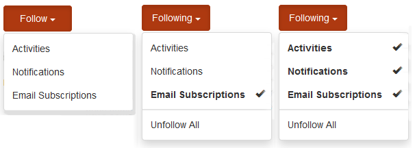

# Communityabonnementen {#communities-subscriptions}

## Overzicht {#overview}

Vanaf het Communautair [KP1](deploy-communities.md#latestfeaturepack)kunnen de leden van de gemeenschap met de gemeenschap door e-mail interactie aangaan gebruikend een eigenschap die als abonnementen wordt bedoeld.

Abonnementen zijn vergelijkbaar met [meldingen](notifications.md) omdat leden zich kunnen abonneren wanneer ze blogartikelen, forumonderwerpen of vragen in het kader van het kwaliteitsbeheer volgen.

Abonnementen worden onderscheiden van meldingen:

* Leden kunnen zich niet abonneren wanneer zij andere leden volgen.
* De enige actie die leden kunnen ondernemen, is het selecteren `Email Subscriptions` wanneer ze volgen.
* Wanneer e-mailantwoord is geconfigureerd, kunnen leden inhoud effectief posten door eenvoudig te antwoorden op de ontvangen e-mail.

### Vereisten {#requirements}

**E-mail configureren**

E-mail moet worden gevormd om abonnementen te functioneren en voor leden te antwoorden per e-mail.

Zie E-mail [configureren](email.md)voor instructies over het instellen van e-mail.

**Abonnementen inschakelen en volgen**

Componenten moeten worden geconfigureerd om abonnementen *en* volgende mogelijkheden te bieden. Functies die abonnementen toestaan, zijn [blog](blog-feature.md), [forum](forum.md) en [QnA](working-with-qna.md).

## Abonnementen van volgende {#subscriptions-from-following}

Met de knop **Volgen** kunt u items opvolgen als activiteiten, abonnementen en/of meldingen. Telkens wanneer de knop **Volgen** is geselecteerd, kunt u een selectie in- of uitschakelen.

Als er een methode van het volgende is geselecteerd, verandert de tekst van de knop in **Volgende**. Voor het gemak is het mogelijk om alle methoden uit `Unfollow All` te schakelen.

De knop **Volgen** bevat alleen de `Email Subscriptions` optie wanneer een forum, QnA of blog is geconfigureerd om e-mailabonnementen in te schakelen. Deze knop wordt weergegeven:

* Op de hoofdpagina met functies voor het ingeschakelde forum, stuurt QnA of blog een e-mail voor alle activiteiten onder die functie.

* Voor een specifiek bericht, zoals een forumonderwerp, een QnA-vraag of een blogartikel Er wordt een e-mail verzonden wanneer er activiteit is voor dat specifieke bericht.

## Reageren per e-mail {#reply-by-email}

Als e-mail is [geconfigureerd voor het beantwoorden via e-mail](email.md#configure-polling-importer), ontvangt het lid dat zich heeft geabonneerd een e-mail met de geposte inhoud en een koppeling naar de online-inhoud.

Als ze op het e-mailbericht reageren, wordt de inhoud die ze in het antwoord invoeren, online weergegeven als inhoud.

De hoeveelheid tijd die nodig is om een antwoord te verzenden, wordt bepaald door het updateinterval [van de](email.md#configure-polling-importer)stemgerechtigde importeur.

