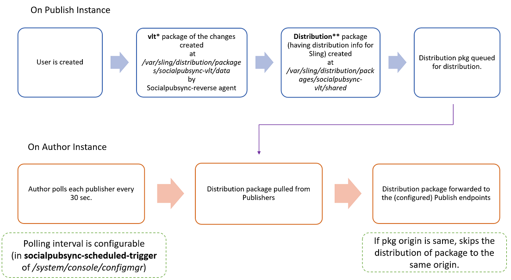

# Gebruikerssynchronisatie {#communities-user-synchronization} van gemeenschappen

## Inleiding {#introduction}

In AEM Communities kunnen *sitebezoekers* in de publicatieomgeving (afhankelijk van geconfigureerde machtigingen) *leden* worden, *gebruikersgroepen* maken en hun *lidprofiel* bewerken.

*De* gegevens van de gebruiker een termijn die wordt gebruikt om naar  *gebruikers*,  *gebruikersprofielen* en  *gebruikersgroepen* te verwijzen.

*Een* membersis is een term die wordt gebruikt om te verwijzen naar  ** gebruikers die zijn geregistreerd in de publicatieomgeving, in tegenstelling tot gebruikers die zijn geregistreerd in de auteursomgeving.

Voor meer informatie betreffende gebruikersgegevens, bezoek [Beherende Gebruikers en Gebruikersgroepen](/help/communities/users.md).

## Gebruikers synchroniseren in een publicatiebedrijf {#synchronizing-users-across-a-publish-farm}

Gebruikersgegevens die in de publicatieomgeving zijn gemaakt, worden door het ontwerp niet weergegeven in de ontwerpomgeving.

De meeste gebruikersgegevens die in de auteursomgeving worden gemaakt, blijven in de auteursomgeving en worden niet gesynchroniseerd of gerepliceerd om instanties te publiceren.

Wanneer [topologie](/help/communities/topologies.md) een [publicerend landbouwbedrijf](/help/sites-deploying/recommended-deploys.md#tarmk-farm) is, moeten de registratie en de wijzigingen die op één publicatieinstantie worden aangebracht met andere publicatieinstanties worden gesynchroniseerd. Leden moeten zich kunnen aanmelden en hun gegevens op elk publicatieknooppunt kunnen bekijken.

Wanneer gebruikerssynchronisatie wordt toegelaten, worden de gebruikersgegevens automatisch gesynchroniseerd over publiceer instanties in het landbouwbedrijf.

### Instructies {#user-sync-setup-instructions} voor het instellen van gebruikerssynchronisatie

Voor gedetailleerde, geleidelijke instructies, op hoe te om synchronisatie over toe te laten publiceert landbouwbedrijf, zie:

* [Gebruikerssynchronisatie](/help/sites-administering/sync.md)

## Gebruikerssynchronisatie op de achtergrond {#user-sync-in-the-background}



* **vlt-pakket**

   Het is een ZIP-bestand met alle wijzigingen die op een uitgever zijn aangebracht en die over alle uitgevers moeten worden verspreid. Wijzigingen op een uitgever genereren gebeurtenissen die door de gebeurtenislistener voor wijzigingen worden gekozen. Hiermee maakt u een vlt-pakket dat alle wijzigingen bevat.

* **distributiepakket**

   Het bevat distributiegegevens voor verkopen. Dat is informatie over waar de inhoud moet worden verspreid en wanneer deze als laatste werd verspreid.

## Wat gebeurt er als ... {#what-happens-when}

### Site publiceren vanuit console Sites van gemeenschappen {#publish-site-from-communities-sites-console}

Wanneer een communitysite op de auteur wordt gepubliceerd via de [Community Sites console](/help/communities/sites-console.md), heeft dit effect als gevolg dat [replicate](/help/sites-deploying/configuring.md#replication-reverse-replication-and-replication-agents) de bijbehorende pagina&#39;s worden weergegeven en dat de dynamisch gemaakte community-gebruikersgroepen, inclusief hun lidmaatschap, worden gedistribueerd.

### Gebruiker is gemaakt of bewerkt profiel bij publicatie {#user-is-created-or-edits-profile-on-publish}

Gebruikers en profielen die zijn gemaakt in de publicatieomgeving (bijvoorbeeld via zelfinschrijving, aanmelden via een sociaal netwerk of LDAP-verificatie) worden per ontwerp niet weergegeven in de auteursomgeving.

Wanneer de topologie [publiceer landbouwbedrijf](/help/communities/topologies.md) is en de gebruikerssynchronisatie correct is gevormd, *user* en *gebruikersprofiel* wordt gesynchroniseerd over het publicatielandbouwbedrijf gebruikend het Verschuiven distributie.

### Nieuwe Community Group wordt gemaakt bij Publiceren {#new-community-group-is-created-on-publish}

Hoewel de aanmaak van een communitygroep vanuit een publicatie-instantie wordt gestart, met als resultaat nieuwe sitepagina&#39;s en een nieuwe gebruikersgroep, gebeurt dit in feite op de auteur-instantie.

Als onderdeel van het proces worden de nieuwe sitepagina&#39;s gekopieerd naar alle publicatie-instanties. De dynamisch gecreeerde communautaire gebruikersgroep en zijn lidmaatschap verkopen die aan alle publicatieinstanties worden verdeeld.

### Gebruikers of gebruikersgroepen worden gemaakt met Beveiligingsconsole {#users-or-user-groups-are-created-using-security-console}

Gebruikersgegevens die in de publicatieomgeving zijn gemaakt, worden door het ontwerp niet weergegeven in de auteursomgeving en andersom.

Wanneer de [User Administration and Security](/help/sites-administering/security.md) console wordt gebruikt om nieuwe gebruikers toe te voegen in het publicatiemilieu, zal de gebruikerssynchronisatie de nieuwe gebruikers en hun groepslidmaatschap aan andere publiceren instanties synchroniseren, indien nodig. Gebruikerssynchronisatie synchroniseert ook gebruikersgroepen die zijn gemaakt via de beveiligingsconsole.

### Inhoud gebruikersberichten in publicatie {#user-posts-content-on-publish}

Voor door de gebruiker gegenereerde inhoud (UGC) worden de gegevens die zijn ingevoerd op een publicatieinstantie benaderd via de [geconfigureerde SRP](/help/communities/srp-config.md).

## Aanbevolen werkwijzen {#bestpractices}

Gebruikerssynchronisatie is standaard **uitgeschakeld**. Als u gebruikerssynchronisatie inschakelt, moet u *bestaande* OSGi-configuraties wijzigen. Er mogen geen nieuwe configuraties worden toegevoegd als gevolg van het inschakelen van gebruikerssynchronisatie.

De gebruikerssynchronisatie is afhankelijk van de auteursomgeving voor het beheer van de gegevensdistributies van de gebruiker, ook al worden de gebruikersgegevens niet op auteur gecreeerd.

**Vereisten**

1. Als gebruikers en gebruikersgroepen al op één uitgever zijn gecreeerd, wordt het geadviseerd om [de gebruikersgegevens aan alle uitgevers manueel te synchroniseren alvorens gebruikerssynchronisatie te vormen en toe te laten.](/help/sites-administering/sync.md#manually-syncing-users-and-user-groups)

   Zodra gebruikerssynchronisatie is ingeschakeld, worden alleen nieuwe gebruikers en groepen gesynchroniseerd.

1. Controleer of de laatste code is geïnstalleerd:

   * [AEM platformupdates](https://helpx.adobe.com/experience-manager/kb/aem62-available-hotfixes.html)
   * [AEM Communities-updates](/help/communities/deploy-communities.md#latestfeaturepack)

De volgende configuraties zijn nodig om gebruikerssynchronisatie op AEM Communities in te schakelen. Zorg ervoor dat deze configuraties correct zijn om te voorkomen dat de distributie van de inhoud van de sling mislukt.

### Apache Sling Distribution Agent - Sync Agents Factory {#apache-sling-distribution-agent-sync-agents-factory}

Met deze configuratie haalt u de inhoud op die voor alle uitgevers moet worden gesynchroniseerd. De configuratie bevindt zich op de instantie Auteur. De auteur moet alle uitgevers die er zijn en waar alle informatie kan worden gesynchroniseerd, volgen.

De standaardwaarden in de configuratie zijn voor één publicatie-instantie. Aangezien gebruikerssynchronisatie nuttig is om veelvoudige te synchroniseren publiceer instanties, zoals voor publiceer landbouwbedrijf, moet de extra publiceer instanties aan de configuratie worden toegevoegd.

**Hoe wordt de inhoud gesynchroniseerd?**

De instantie van de auteur pingelt het exportereindpunt van uitgevers. Wanneer een gebruiker op specifieke uitgevers (n) wordt gecreeerd of bijgewerkt, krijgt de Auteur de inhoud van hun exporter eindpunten en [duwt de inhoud ](/help/communities/sync.md#main-pars-image-1413756164) aan andere uitgevers (n-1, die behalve de uitgevers is waarvan de inhoud wordt gehaald).

Configuratie van Apache Sling Sync Agents configureren:

1. Meld u aan met beheerdersrechten voor de AEM auteur.
1. Open de [Webconsole](https://helpx.adobe.com/experience-manager/6-4/help/sites-deploying/configuring-osgi.html). Bijvoorbeeld [https://localhost:4502/system/console/configMgr](https://localhost:4502/system/console/configMgr).
1. Zoek **Apache Sling Distribution Agent - Sync Agents Factory**.

   * Selecteer de bestaande configuratie die u wilt openen voor bewerken (potloodpictogram).

      Naam verifiëren: **socialpubsync.**

   * Schakel het selectievakje **Ingeschakeld** in.
   * Selecteer **Meerdere wachtrijen gebruiken.**
   * Geef **Eindpunten van exportserver** en **Eindpunten van importmodule** op (u kunt meer eindpunten voor exportfuncties en importers toevoegen).

      Deze eindpunten bepalen waar u de inhoud van wilt krijgen en waar u de inhoud wilt duwen. De auteur haalt de inhoud van het gespecificeerde exportereindpunt op en duwt de inhoud aan de uitgevers (buiten de uitgever waarvan het de inhoud haalde).
   

### Adobe granietdistributie - gecodeerde geheime provider van wachtwoordvervoer {#adobe-granite-distribution-encrypted-password-transport-secret-provider}

Hiermee kan de auteur de geautoriseerde gebruiker identificeren, zodat deze kan zien welke machtiging hij heeft om gebruikersgegevens van de auteur te synchroniseren voor publicatie.

Met de [geautoriseerde gebruiker die is gemaakt](/help/sites-administering/sync.md#createauthuser) op alle publicatie-exemplaren kunnen de uitgevers verbinding maken met de auteur en de distributie van Sling op de auteur configureren. Deze geautoriseerde gebruiker heeft alle vereiste [ACLs](/help/sites-administering/sync.md#howtoaddacl).

Wanneer gegevens op of moeten worden geïnstalleerd van uitgevers, dan verbindt de auteur met uitgevers gebruikend de geloofsbrieven (gebruikersnaam en wachtwoord) die in deze configuratie worden geplaatst.

De auteur verbinden met uitgevers die geautoriseerde gebruiker gebruiken:

1. Meld u aan met beheerdersrechten voor de AEM auteur.
1. Open de [Webconsole](/help/sites-deploying/configuring-osgi.md).

   Bijvoorbeeld [https://localhost:4502/system/console/configMgr](https://localhost:4502/system/console/configMgr).
1. Zoek **Adobe granietdistributie - gecodeerde wachtwoordtransportgeheim provider.**
1. Selecteer de bestaande configuratie die u wilt openen voor bewerken (potloodpictogram).

   Verifieer bezit **social pubsync** - **publishUser.**

1. Stel de gebruikersnaam en het wachtwoord in op de [geautoriseerde gebruiker](/help/sites-administering/sync.md#createauthorizeduser).

   Bijvoorbeeld **usersync - admin**


### Apache Sling Distribution Agent - Queue Agents Factory {#apache-sling-distribution-agent-queue-agents-factory}

Deze configuratie wordt gebruikt om de gegevens te vormen u over uitgevers wilt synchroniseren. Wanneer gegevens worden gemaakt/bijgewerkt in paden die zijn opgegeven in **Toegestane hoofdmappen**, wordt &quot;var/community/distribution/diff&quot; geactiveerd en haalt de gemaakte replicator de gegevens op van een uitgever en installeert deze op andere uitgevers.

De te synchroniseren gegevens (knooppaden) configureren:

1. Meld u aan met de beheerdersrechten voor uw auteurinstantie.
1. Open de [Webconsole](https://helpx.adobe.com/experience-manager/6-4/help/sites-deploying/configuring-osgi.html).

   Bijvoorbeeld [https://localhost:4503/system/console/configMgr](https://localhost:4503/system/console/configMgr).

1. Zoek **Apache Sling Distribution Agent - Queue Agents Factory**.
1. Selecteer de bestaande configuratie die u wilt openen voor bewerken (potloodpictogram).

   Naam verifiëren: **socialpubsync -reverse**

1. Schakel het selectievakje **Ingeschakeld** in en sla het bestand op.
1. Geef de knooppaden op die moeten worden gerepliceerd in **Toegestane wortels**.
1. Herhaal deze bewerking voor elke **publish**-instantie.

   

### Adobe granietdistributie - Diff Observer Factory {#adobe-granite-distribution-diff-observer-factory}

Met deze configuratie wordt groepslidmaatschap voor alle uitgevers gesynchroniseerd.
Als het wijzigen van het lidmaatschap van een groep in één uitgever zijn lidmaatschap op andere uitgevers niet bijwerkt, dan zorg ervoor dat **ref:members** aan **look properties names** wordt toegevoegd.

Lidsynchronisatie garanderen:

1. Meld u aan met beheerdersrechten voor de AEM auteur.
1. Open de [Webconsole](https://helpx.adobe.com/experience-manager/6-4/help/sites-deploying/configuring-osgi.html).

   Bijvoorbeeld [https://localhost:4503/system/console/configMgr](https://localhost:4503/system/console/configMgr).

1. Zoek **Adobe granietdistributie - Diff Observer Factory**.
1. Selecteer de bestaande configuratie die u wilt openen voor bewerken (potloodpictogram).

   Verifieer **naam van agent: socialpubsync -reverse**.

1. Schakel het selectievakje **Ingeschakeld** in.
1. Specificeer **rep:members** als beschrijving voor propertyName in **look eigenschappen names**, en sparen.

   

### Apache Sling Distribution Trigger - Scheduled Triggers Factory {#apache-sling-distribution-trigger-scheduled-triggers-factory}

Met deze configuratie kunt u het opiniepeilingsinterval (waarna uitgevers worden gepingeld en wijzigingen door de auteur worden aangeroepen) configureren om de wijzigingen in de verschillende uitgevers te synchroniseren.

De auteur opiniepeilt uitgevers om de 30 seconden (standaard). Als de map `/var/sling/distribution/packages/  socialpubsync -  vlt /shared` pakketten bevat, worden deze pakketten opgehaald en op andere uitgevers geïnstalleerd.

Het opiniepeilingsinterval wijzigen:

1. Meld u aan met beheerdersrechten voor de AEM auteur.
1. Open de [Webconsole](/help/sites-deploying/configuring-osgi.md), bijvoorbeeld [https://localhost:4502/system/console/configMgr](https://localhost:4502/system/console/configMgr)
1. **Apache Sling Distribution Trigger - Scheduled Triggers Factory** zoeken

   * Selecteer de bestaande configuratie die u wilt openen voor bewerken (potloodpictogram).

      Verifiëren **socialpubsync -scheduled-trigger**

   * Stel het interval in seconden in op het gewenste interval en sla het op.

   

### AEM Communities User Sync Listener {#aem-communities-user-sync-listener}

Voor kwesties in het Verkopen distributie waar er een discrepantie in abonnementen en volgt is, controleer of de volgende eigenschappen in **AEM Communities de Listener van de Synchronisatie van de Gebruiker** configuraties worden geplaatst:

* NodeTypes
* IgnorableProperties
* IgnorableNodes
* DistributedFolders

Abonnementen, volgen en meldingen synchroniseren

Op elke AEM-publicatie-instantie:

1. Meld u aan met beheerdersrechten.
1. Open de [Webconsole](/help/sites-deploying/configuring-osgi.md). Bijvoorbeeld [https://localhost:4503/system/console/configMgr](https://localhost:4503/system/console/configMgr).
1. Zoek **AEM Communities User Sync Listener**.
1. Selecteer de bestaande configuratie die u wilt openen voor bewerken (potloodpictogram)

   Naam verifiëren: **socialpubsync -scheduled-trigger**

1. Stel de volgende **NodeTypes** in:

   `rep:User`

   `nt:unstructured`

   `nt:resource`

   `rep:ACL`

   `sling:Folder`

   `sling:OrderedFolder`

   De knooppunttypen die in deze eigenschap worden opgegeven, worden gesynchroniseerd en de meldingen (blogs en configuraties die worden gevolgd) worden gesynchroniseerd tussen verschillende uitgevers.

1. Voeg alle mappen toe die u wilt synchroniseren in **DistributedFolders**. Bijvoorbeeld,

   `segments/scoring`

   `social/relationships`

   `activities`

1. Stel **onwetablenodes** in op:

   `.tokens`

   `system`

   `rep:cache` (aangezien wij kleverige zittingen gebruiken, moeten wij deze knoop niet aan verschillende uitgevers synchroniseren).

   

### Unieke verkoop-id {#unique-sling-id}

AEM auteurinstantie gebruikt Verschuivende identiteitskaart om te identificeren van waar de gegevens komen en aan welke uitgevers het (of niet nodig) het pakket moet terugsturen naar.

Zorg ervoor alle uitgevers in een publicatielandbouwbedrijf een unieke Verkoop identiteitskaart hebben Als het Verdelen identiteitskaart het zelfde voor veelvoudige publiceer instanties in publiceer landbouwbedrijf is, dan zal de gebruikerssynchronisatie ontbreken. Aangezien de auteur niet zal weten waar te om het pakket van en te halen waar te om het pakket te installeren.

Om ervoor te zorgen dat de uitgevers in het publicatielandbouwbedrijf unieke verkoopidentiteitskaart hebben, op elke publicatieinstantie:

1. Blader naar [https://_host:port_/system/console/status-slingsettings](https://localhost:4503/system/console/status-slingsettings).
1. Controleer de waarde van **Sling ID**.

   

   Als de Verschuivende-id van een publicatie-instantie overeenkomt met de Verschuivende-id van een andere publicatie-instantie, geldt het volgende:

1. Stop een van de publicatie-instanties met een overeenkomende slingerID.
1. Zoek in de map `crx-quickstart/launchpad/felix` naar het bestand *sling.id.file.* en verwijder het bestand.

   Bijvoorbeeld op een Linux-systeem:

   `rm -i $(find . -type f -name sling.id.file)`

   Bijvoorbeeld op een Windows-systeem:

   Windows Verkenner gebruiken en zoeken naar `sling.id.file`

1. Start de publicatie-instantie. Bij het opstarten wordt er een nieuwe verkoop-id toegewezen.
1. Valideer dat **Sling ID** nu uniek is.

Herhaal deze stappen totdat alle publicatie-instanties een unieke id voor verkopers hebben.

### Vault Package Builder-fabriek {#vault-package-builder-factory}

Voor updates die correct worden gesynchroniseerd, is het nodig om de builder van het vault-pakket te wijzigen voor gebruikerssynchronisatie.
In `/home/users` wordt een `*/rep:cache`-knooppunt gemaakt. Het is een geheime voorgeheugen dat wordt gebruikt om te vinden dat als wij op de belangrijkste naam van een knoop dan vragen dit geheime voorgeheugen direct kan worden gebruikt.

De synchronisatie van de gebruiker kan stoppen als `rep :cache` knopen over uitgevers worden gesynchroniseerd.

Om ervoor te zorgen dat updates correct over uitgevers, op elke AEM publicatieinstantie worden gesynchroniseerd:

1. Toegang tot de [webconsole](/help/sites-deploying/configuring-osgi.md)

   Bijvoorbeeld [https://localhost:4503/system/console/configMgr](https://localhost:4503/system/console/configMgr).
1. Zoek de **Apache Sling Distribution Packaging - Vault Package Builder Factory**

   Builder-naam: socialpubsync-vlt.

1. Selecteer het bewerkingspictogram.
1. Twee filters voor pakketknooppunten toevoegen:
   * `/home/users|-.*/.tokens`
   * `/home/users|-.*/rep:cache`
1. Beleidsafhandeling
   * Om bestaande rep:beleidsknopen met nieuwe te overschrijven, voeg een derde Filter van het Pakket toe: `/home/users|+.*/rep:policy`
   * Als u wilt voorkomen dat beleid wordt verspreid, stelt u: `Acl Handling: IGNORE`

   

## Probleemoplossing voor distributie bij verkoop in AEM Communities {#troubleshoot-sling-distribution-in-aem-communities}

Als de distributie van het Verdelen ontbreekt, probeer de volgende het zuiveren stappen:

1. **Controleren op  [onjuist toegevoegde configuraties](/help/sites-administering/sync.md#improperconfig)**

   Zorg ervoor dat er geen meerdere configuraties worden toegevoegd of bewerkt, maar dat de bestaande standaardconfiguraties worden bewerkt.
1. **Configuraties controleren**

   Zorg ervoor dat alle [configuraties](/help/communities/sync.md#bestpractices) correct in uw instantie van de Auteur van AEM worden geplaatst, zoals vermeld in [Beste praktijken](/help/communities/sync.md#main-pars-header-863110628).

1. **Machtigingsgebruikersmachtigingen controleren**

   Als de pakketten niet behoorlijk worden geïnstalleerd, dan controleer dat [geautoriseerde gebruiker](/help/sites-administering/sync.md#createauthuser) in eerste wordt gecreeerd publiceer instantie correcte ACLs heeft.

   Om dit te bevestigen, in plaats van de [gecreeerde geautoriseerde gebruiker](/help/sites-administering/sync.md#createauthuser) verander de [Adobe granietdistributie - de Encrypted Configuratie van het Vervoer van het Wachtwoord van de Beveiligde Leverancier ](/help/sites-administering/sync.md#adobegraniteencpasswrd) op de instantie van de Auteur om Admin gebruikersgeloofsbrieven te gebruiken. Installeer de pakketten nu opnieuw. Als de gebruikerssynchronisatie prima met beheerdergeloofsbrieven werkt, dan betekent het dat gecreeerd publiceerde gebruiker geen aangewezen ACLs had.

1. **Configuratie van de fabriek van Diff Observer controleren**

   Als alleen specifieke knooppunten niet worden gesynchroniseerd via het publicatiebedrijf, worden groepsleden bijvoorbeeld niet gesynchroniseerd. Zorg er vervolgens voor dat de configuratie [Adobe Granite Distribution - Diff Observer Factory](/help/sites-administering/sync.md#diffobserver) is ingeschakeld en **rep: members** worden ingesteld in **look properties names**.

1. **Controleer de configuratie van AEM Communities User Sync Listener.** Als de gemaakte gebruikers zijn gesynchroniseerd maar de volgende abonnementen en abonnementen niet werken, moet u ervoor zorgen dat de configuratie van AEM Communities User Sync Listener:

   * Knooppunttypen - ingesteld op **rep:User, nt:unStructured**, **nt:resource**, **rep:ACL**, **sling:Folder**, en **sling:OrderedFolder**.
   * Genegeerde knooppunten - ingesteld op **.tokens**, **system** en **rep:cache**.
   * Gedistribueerde mappen - ingesteld op de mappen die u wilt distribueren.

1. **Logboeken controleren die zijn gegenereerd bij het maken van een gebruiker in de instantie Publiceren**

   Als de bovenstaande configuraties juist zijn ingesteld maar gebruikerssynchronisatie nog niet werkt, controleert u de logbestanden die bij het maken van de gebruiker worden gegenereerd.

   Controleer als volgt of de volgorde van de logbestanden gelijk is:

   ```shell
   15.05.2016 18:33:01.523 *INFO* [sling-oak-observation-7422] com.adobe.cq.social.sync.impl.PublisherSyncServiceImpl Handing these paths to the distribution subsystem: [/home/users/C, /home/users/C/Cw-5avWqilmqsNn5hCvK]
   15.05.2016 18:33:01.523 *INFO* [sling-oak-observation-7422] org.apache.sling.distribution.agent.impl.SimpleDistributionAgent [agent][socialpubsync-reverse] REQUEST-START DSTRQ2: ADD paths=[/home/users/C, /home/users/C/Cw-5avWqilmqsNn5hCvK], user=communities-user-admin
   15.05.2016 18:33:01.523 *INFO* [sling-oak-observation-7431] com.adobe.cq.social.sync.impl.PublisherSyncServiceImpl Handing these paths to the distribution subsystem: [/home/users/C/Cw-5avWqilmqsNn5hCvK, /home/users/C/Cw-5avWqilmqsNn5hCvK/profile, /home/users/C/Cw-5avWqilmqsNn5hCvK/rep:policy]
   15.05.2016 18:33:01.523 *INFO* [sling-oak-observation-7431] org.apache.sling.distribution.agent.impl.SimpleDistributionAgent [agent][socialpubsync-reverse] REQUEST-START DSTRQ3: ADD paths=[/home/users/C/Cw-5avWqilmqsNn5hCvK, /home/users/C/Cw-5avWqilmqsNn5hCvK/profile, /home/users/C/Cw-5avWqilmqsNn5hCvK/rep:policy], user=communities-user-admin
   15.05.2016 18:33:01.757 *INFO* [sling-oak-observation-7431] org.apache.jackrabbit.vault.packaging.impl.JcrPackageDefinitionImpl unwrapping package sling/distribution:socialpubsync-vlt_1463337181554_ebb27ad9-a861-4405-9342-d64c916654e2:0.0.1
   15.05.2016 18:33:01.820 *INFO* [sling-oak-observation-7422] org.apache.jackrabbit.vault.packaging.impl.JcrPackageDefinitionImpl unwrapping package sling/distribution:socialpubsync-vlt_1463337181554_58811273-5861-48fe-95d2-4aff367b99c3:0.0.1
   15.05.2016 18:33:02.023 *INFO* [sling-oak-observation-7430] com.adobe.cq.social.sync.impl.PublisherSyncServiceImpl Handing these paths to the distribution subsystem: [/home/users/C/Cw-5avWqilmqsNn5hCvK/profile]
   15.05.2016 18:33:02.023 *INFO* [sling-oak-observation-7430] org.apache.sling.distribution.agent.impl.SimpleDistributionAgent [agent][socialpubsync-reverse] REQUEST-START DSTRQ4: ADD paths=[/home/users/C/Cw-5avWqilmqsNn5hCvK/profile], user=communities-user-admin
   15.05.2016 18:33:02.273 *INFO* [sling-oak-observation-7430] org.apache.jackrabbit.vault.packaging.impl.JcrPackageDefinitionImpl unwrapping package sling/distribution:socialpubsync-vlt_1463337182039_f34f4fa6-10b9-42eb-8740-4da9d4d38f99:0.0.1
   ```

Foutopsporing:

1. De gebruikerssynchronisatie uitschakelen:
1. Meld u aan bij AEM instantie van de auteur met beheerdersrechten.

   1. Open de [Webconsole](/help/sites-deploying/configuring-osgi.md). Bijvoorbeeld [https://localhost:4502/system/console/configMgr](https://localhost:4502/system/console/configMgr).
   1. Zoek de configuratie **Apache Sling Distribution Agent - Sync Agents Factory**.
   1. Schakel het selectievakje **Ingeschakeld** uit.

      Wanneer de gebruikerssynchronisatie wordt uitgeschakeld bij de instantie van de auteur, worden de eindpunten (exportfunctie en importer) uitgeschakeld en is de instantie van de auteur statisch. De pakketten **vlt** worden niet gepingeld of opgehaald door de auteur.

      Als een gebruiker nu op publicatieinstantie wordt gecreeerd, wordt het **vlt** pakket gecreeerd in */var/sling/distribution/packages/ socialpubsync - vlt /data* knoop. En als deze pakketten door de auteur aan een andere dienst worden geduwd. U kunt deze gegevens downloaden en uitpakken om te controleren wat alle eigenschappen aan andere diensten worden geduwd.

1. Ga naar een uitgever en maak een gebruiker op de uitgever. Hierdoor worden gebeurtenissen gemaakt.
1. Controleer de [volgorde van logbestanden](/help/communities/sync.md#troubleshoot-sling-distribution-in-aem-communities) die bij het maken van de gebruiker zijn gemaakt.
1. Controleer of een **vlt**-pakket is gemaakt op **/var/sling/distribution/packages/socialpubsync-vlt/data**.
1. Schakel nu de gebruikerssynchronisatie in AEM instantie van de auteur.
1. Wijzig bij de uitgever de eindpunten voor de exportfunctie of de importer in **Apache Sling Distribution Agent - Sync Agents Factory**.
We kunnen pakketgegevens downloaden en uitpakken om te controleren welke eigenschappen aan andere uitgevers worden doorgegeven en welke gegevens verloren gaan.
