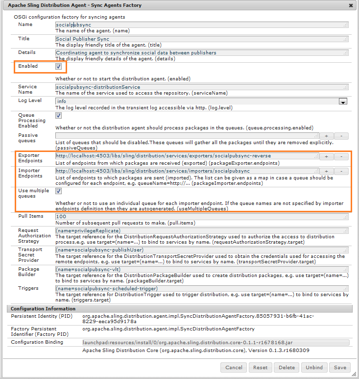

# Gebruikerssynchronisatie van gemeenschappen {#communities-user-synchronization}

## Inleiding {#introduction}

In Adobe Experience Manager (AEM) Gemeenschappen, van het milieu van Publish (afhankelijk van toestemmingen die worden gevormd), *bezoekers van de plaats* kunnen *leden* worden, *gebruikersgroepen* creëren, en hun *lidprofiel* uitgeven.

*gegevens van de Gebruiker* verwijst naar *gebruikers*, *gebruikersprofielen*, en *gebruikersgroepen*.

*Leden* verwijzen naar *gebruikers* die in het milieu van Publish, in tegenstelling tot gebruikers worden geregistreerd in het auteursmilieu.

Voor meer informatie betreffende gebruikersgegevens, bezoek [&#x200B; het Leiden Gebruikers en de Groepen van de Gebruiker &#x200B;](/help/communities/users.md).

## Gebruikers synchroniseren op een Publish-farm {#synchronizing-users-across-a-publish-farm}

Gebruikersgegevens die in de Publish-omgeving zijn gemaakt, worden door het ontwerp niet weergegeven in de Auteur-omgeving.

De meeste gebruikersgegevens die in de ontwerpomgeving zijn gemaakt, blijven in de ontwerpomgeving en worden niet gesynchroniseerd en niet gerepliceerd naar Publish-instanties.

Wanneer de [&#x200B; topologie &#x200B;](/help/communities/topologies.md) a [&#x200B; landbouwbedrijf &#x200B;](/help/sites-deploying/recommended-deploys.md#tarmk-farm) publiceert, moeten de registratie en de wijzigingen die op één instantie van Publish worden aangebracht met andere instanties van Publish worden gesynchroniseerd. Leden moeten zich kunnen aanmelden en hun gegevens op elk Publish-knooppunt kunnen bekijken.

Wanneer gebruikerssynchronisatie wordt toegelaten, worden de gebruikersgegevens automatisch gesynchroniseerd over de instanties van Publish in het landbouwbedrijf.

### Instructies voor het synchroniseren van gebruikers {#user-sync-setup-instructions}

Voor gedetailleerde, geleidelijke instructies op hoe te om synchronisatie over te laten publiceren landbouwbedrijf, zie [&#x200B; Synchronisatie van de Gebruiker &#x200B;](/help/sites-administering/sync.md).

## Gebruikerssynchronisatie op de achtergrond {#user-sync-in-the-background}


* **vlt pakket**

  Het is een ZIP-bestand met alle wijzigingen die op een uitgever zijn aangebracht en die over alle uitgevers moeten worden verspreid. Wijzigingen op een uitgever genereren gebeurtenissen die door de gebeurtenislistener voor wijzigingen worden gekozen. Hiermee maakt u een vlt-pakket dat alle wijzigingen bevat.

* **distributiepakket**

  Het bevat distributieinformatie voor Sling. Dat is informatie over waar de inhoud moet worden verspreid en wanneer deze als laatste is verspreid.

## Wat gebeurt er als ... {#what-happens-when}

### Publish-site van de Sites-console van Gemeenschappen {#publish-site-from-communities-sites-console}

Op Auteur, wanneer een communautaire plaats van de [&#x200B; console van de Plaatsen van Gemeenschappen &#x200B;](/help/communities/sites-console.md) wordt gepubliceerd, moet het effect [&#128279;](/help/sites-deploying/configuring.md#replication-reverse-replication-and-replication-agents) de bijbehorende pagina&#39;s herhalen, en het Sling verspreidt dynamisch de gecreeerde communautaire gebruikersgroepen, met inbegrip van hun lidmaatschap.

### Gebruiker is gemaakt of bewerkt profiel op Publish {#user-is-created-or-edits-profile-on-publish}

Door ontwerp worden gebruikers en profielen die zijn gemaakt in de Publish-omgeving (zoals zelfregistratie, aanmelden via een sociaal netwerk en LDAP-verificatie), niet weergegeven in de auteursomgeving.

Wanneer de topologie a [&#x200B; landbouwbedrijf &#x200B;](/help/communities/topologies.md) publiceert en de gebruikerssynchronisatie correct is gevormd, wordt het *gebruiker* en *gebruikersprofiel* gesynchroniseerd over het publiceerlandbouwbedrijf gebruikend het Schuiven distributie.

### Nieuwe Community Group is gemaakt op Publish {#new-community-group-is-created-on-publish}

Hoewel de aanmaak van een gebruikersgroep vanuit een Publish-instantie in gang is gezet, leidt dit tot nieuwe sitepagina&#39;s en een nieuwe gebruikersgroep in feite tot de instantie Auteur.

Als onderdeel van het proces worden de nieuwe sitepagina&#39;s naar alle Publish-instanties gerepliceerd. De dynamisch gecreëerde gebruikersgroep van de gemeenschap en zijn lidmaatschap worden verkocht die aan alle instanties van Publish wordt verdeeld.

### Gebruikers of gebruikersgroepen worden gemaakt met Beveiligingsconsole {#users-or-user-groups-are-created-using-security-console}

Gebruikersgegevens die in de publicatieomgeving zijn gemaakt, worden door het ontwerp niet weergegeven in de auteuromgeving en omgekeerd.

Wanneer de [&#x200B; console van het Beleid van de Gebruiker en van de Veiligheid &#x200B;](/help/sites-administering/security.md) wordt gebruikt om nieuwe gebruikers in toe te voegen publiceert milieu, synchroniseert de gebruikerssynchronisatie de nieuwe gebruikers en hun groepslidmaatschap aan andere publiceer instanties, indien nodig. Gebruikerssynchronisatie synchroniseert ook gebruikersgroepen die zijn gemaakt via de beveiligingsconsole.

### Inhoud gebruikersberichten op Publish {#user-posts-content-on-publish}

Voor gebruiker-geproduceerde inhoud (UGC), worden de gegevens ingegaan op publiceer instantie betreden door [&#x200B; gevormde SRP &#x200B;](/help/communities/srp-config.md).

## Aanbevolen procedures {#bestpractices}

Door gebrek, wordt de gebruikerssynchronisatie onbruikbaar gemaakt **&#x200B;**. Het toelaten van gebruikerssynchronisatie impliceert het wijzigen van *bestaande* configuraties OSGi. Er mogen geen nieuwe configuraties worden toegevoegd als gevolg van het inschakelen van gebruikerssynchronisatie.

De gebruikerssynchronisatie is afhankelijk van de auteursomgeving voor het beheer van de gegevensdistributies van de gebruiker, ook al worden de gebruikersgegevens niet op auteur gecreeerd.

**Eerste vereisten**

1. Als de gebruikers en de gebruikersgroepen reeds op één uitgever zijn gecreeerd, wordt het geadviseerd [&#x200B; manueel te synchroniseren &#x200B;](/help/sites-administering/sync.md#manually-syncing-users-and-user-groups) de gebruikersgegevens aan alle uitgevers voorafgaand aan het vormen en het toelaten van gebruikerssynchronisatie.

   Nadat gebruikerssynchronisatie is ingeschakeld, worden alleen nieuwe gebruikers en groepen gesynchroniseerd.

1. Controleer of de laatste code is geïnstalleerd:

   * [&#x200B; AEM platformupdates &#x200B;](https://helpx.adobe.com/experience-manager/kb/aem62-available-hotfixes.html)
   * [AEM Communities-updates](/help/communities/deploy-communities.md#latestfeaturepack)

De volgende configuraties zijn nodig om gebruikerssynchronisatie op AEM Communities in te schakelen. Zorg ervoor dat deze configuraties correct zijn om te voorkomen dat de distributie van de inhoud van de sling mislukt.

### Apache Sling Distribution Agent - Sync Agents Factory {#apache-sling-distribution-agent-sync-agents-factory}

Met deze configuratie haalt u de inhoud op die voor alle uitgevers moet worden gesynchroniseerd. De configuratie bevindt zich op de instantie Auteur. De auteur moet alle uitgevers die er zijn en waar alle informatie kan worden gesynchroniseerd, volgen.

De standaardwaarden in de configuratie zijn voor één publicatie-instantie. Aangezien gebruikerssynchronisatie nuttig is om veelvoudige te synchroniseren publiceer instanties, zoals voor publiceer landbouwbedrijf, moet de extra publiceer instanties aan de configuratie worden toegevoegd.

**hoe wordt de inhoud gesynchroniseerd?**

De instantie van de auteur pingelt het exportereindpunt van uitgevers. Wanneer een gebruiker wordt gecreeerd of op specifieke uitgevers (n) bijgewerkt, krijgt de Auteur de inhoud van hun exporter eindpunten en [&#x200B; duwt de inhoud &#x200B;](/help/communities/sync.md#main-pars-image-1413756164) aan andere uitgevers (n-1, die behalve de uitgevers is waarvan de inhoud wordt gehaald).

Configuratie van Apache Sling Sync Agents configureren:

1. Meld u aan met beheerdersrechten voor de AEM auteur.
1. Heb toegang tot de [&#x200B; Console van het Web &#x200B;](/help/sites-deploying/configuring-osgi.md). Bijvoorbeeld, [&#x200B; https://localhost:4502/system/console/configMgr &#x200B;](https://localhost:4502/system/console/configMgr).
1. Zoek **Apache Sling Distribution Agent - de Factory van de Agenten van de Synchronisatie**.

   * Selecteer de bestaande configuratie die u wilt openen voor bewerken (potloodpictogram).

     Verifieer naam: **sociale pubsync.**

   * Selecteer **Toegelaten** checkbox.
   * Selecteer **Veelvoudige rijen van het Gebruik.**
   * Specificeer **Eindpunten van de Exporteur** en **Eindpunten van de Importeur** (u kunt meer exporter en importeur eindpunten toevoegen).

     Deze eindpunten bepalen waar u de inhoud van wilt krijgen en waar u de inhoud wilt duwen. De auteur haalt de inhoud van het gespecificeerde exportereindpunt op en duwt de inhoud aan de uitgevers (buiten de uitgever waarvan het de inhoud haalde).

   

### Adobe Granite Distribution - Encrypted Password Transport Secret Provider {#adobe-granite-distribution-encrypted-password-transport-secret-provider}

Hiermee kan de auteur de geautoriseerde gebruiker identificeren, zodat deze kan zien welke machtiging hij heeft om gebruikersgegevens van de auteur te synchroniseren voor publicatie.

De [&#x200B; erkende gebruiker creeerde &#x200B;](/help/sites-administering/sync.md#createauthuser) op alle publiceer instanties helpt uitgevers om met auteur te verbinden en de distributie van het Schelpen op de auteur te vormen. Deze erkende gebruiker heeft al vereiste [&#x200B; ACLs &#x200B;](/help/sites-administering/sync.md#howtoaddacl).

Wanneer gegevens op of moeten worden geïnstalleerd van uitgevers, dan verbindt de auteur met uitgevers gebruikend de geloofsbrieven (gebruikersnaam en wachtwoord) die in deze configuratie worden geplaatst.

De auteur verbinden met uitgevers die geautoriseerde gebruiker gebruiken:

1. Meld u aan met beheerdersrechten voor de AEM auteur.
1. Heb toegang tot de [&#x200B; Console van het Web &#x200B;](/help/sites-deploying/configuring-osgi.md).

   Bijvoorbeeld, [&#x200B; https://localhost:4502/system/console/configMgr &#x200B;](https://localhost:4502/system/console/configMgr).
1. Bepaal de plaats van **Adobe Granite Distribution - de Gecodeerde Secret Leverancier van het Vervoer van het Wachtwoord.**
1. Selecteer de bestaande configuratie die u wilt openen voor bewerken (potloodpictogram).

   Verifieer bezit **sociale pubsync** - **publishUser.**

1. Plaats de gebruikersbenaming en het wachtwoord aan de [&#x200B; erkende gebruiker &#x200B;](/help/sites-administering/sync.md#createauthorizeduser).

   Bijvoorbeeld, **gebruikerssync - admin**


### Apache Sling Distribution Agent - Queue Agents Factory {#apache-sling-distribution-agent-queue-agents-factory}

Deze configuratie wordt gebruikt om de gegevens te vormen u over uitgevers wilt synchroniseren. Wanneer het gegeven wordt gecreeerd/in wegen bijgewerkt die in **worden gespecificeerd Toegestane Worden**, wordt &quot;var/community/distribution/diff&quot;geactiveerd en de gecreeerde replicator haalt de gegevens van een uitgever en installeert het op andere uitgevers.

De te synchroniseren gegevens (knooppaden) configureren:

1. Meld u aan met beheerdersrechten voor uw publicatieexemplaar.
1. Heb toegang tot de [&#x200B; Console van het Web &#x200B;](/help/sites-deploying/configuring-osgi.md).

   Bijvoorbeeld, [&#x200B; https://localhost:4503/system/console/configMgr &#x200B;](https://localhost:4503/system/console/configMgr).

1. Zoek **Apache Sling Distribution Agent - de Fabriek van de Agenten van de Rij**.
1. Selecteer de bestaande configuratie die u wilt openen voor bewerken (potloodpictogram).

   Verifieer Naam: **sociale pubsync - omgekeerd**

1. Selecteer **Toegelaten** controledoos en bewaar.
1. Specificeer de knoopwegen die in **Toegestane wortels** moeten worden herhaald.
1. Herhaal voor elk **publiceer** instantie.

   

### Adobe granietdistributie - Diff Observer Factory {#adobe-granite-distribution-diff-observer-factory}

Met deze configuratie wordt groepslidmaatschap voor alle uitgevers gesynchroniseerd.
Als het veranderen van het lidmaatschap van een groep in één uitgever zijn lidmaatschap op andere uitgevers niet bijwerkt, dan zorg ervoor dat **ref:members** aan **wordt toegevoegd keek eigenschappen namen**.

Synchronisatie van leden garanderen:

1. Meld u aan met beheerdersrechten voor uw publicatieexemplaar.
1. Heb toegang tot de [&#x200B; Console van het Web &#x200B;](/help/sites-deploying/configuring-osgi.md).

   Bijvoorbeeld, [&#x200B; https://localhost:4503/system/console/configMgr &#x200B;](https://localhost:4503/system/console/configMgr).

1. Bepaal de plaats van **Adobe granietdistributie - de Fabriek van de Waarnemer van Diff**.
1. Selecteer de bestaande configuratie die u wilt openen voor bewerken (potloodpictogram).

   Verifieer **agentennaam: sociale pubsync - omgekeerd**.

1. Selecteer **Toegelaten** checkbox.
1. Specificeer **rep:leden** als beschrijving voor propertyName in **keek eigenschappen namen**, en sparen.

   

### Apache Sling Distribution Trigger - Scheduled Triggers Factory {#apache-sling-distribution-trigger-scheduled-triggers-factory}

Met deze configuratie kunt u het opiniepeilingsinterval (waarna uitgevers worden gepingeld en wijzigingen door de auteur worden doorgevoerd) configureren om de wijzigingen voor alle uitgevers te synchroniseren.

De auteur opiniepeilt uitgevers om de 30 seconden (standaard). Als de map `/var/sling/distribution/packages/  socialpubsync -  vlt /shared` pakketten bevat, worden deze opgehaald en op andere uitgevers geïnstalleerd.

Het opiniepeilingsinterval wijzigen:

1. Meld u aan met beheerdersrechten voor de AEM auteur.
1. Heb toegang tot de [&#x200B; Console van het Web &#x200B;](/help/sites-deploying/configuring-osgi.md), bijvoorbeeld, [&#x200B; https://localhost:4502/system/console/configMgr &#x200B;](https://localhost:4502/system/console/configMgr)
1. Bepaal de plaats **Apache het Verdelen Trigger van de Distributie - Gepland Triggers Factory**

   * Selecteer de bestaande configuratie die u wilt openen voor bewerken (potloodpictogram).

     Verifieer **sociale pubsync - gepland-trekker**

   * Stel het interval in seconden in op het gewenste interval en sla het op.

   

### AEM Communities User Sync Listener {#aem-communities-user-sync-listener}

Voor kwesties in het Verdelen van distributie waar er een discrepantie in abonnementen en volgt is, controleer of de volgende eigenschappen in **de Listener van de Synchronisatie van de Gebruiker van AEM Communities** configuraties worden geplaatst:

* NodeTypes
* IgnorableProperties
* IgnorableNodes
* DistributedFolders

Abonnementen, volgen en meldingen synchroniseren

Op elke AEM-publicatie-instantie:

1. Meld u aan met beheerdersrechten.
1. Heb toegang tot de [&#x200B; Console van het Web &#x200B;](/help/sites-deploying/configuring-osgi.md). Bijvoorbeeld, [&#x200B; https://localhost:4503/system/console/configMgr &#x200B;](https://localhost:4503/system/console/configMgr).
1. Zoek **de Listener van de Synchronisatie van de Gebruiker van AEM Communities**.
1. Selecteer de bestaande configuratie die u wilt openen voor bewerken (potloodpictogram)

   Verifieer Naam: **sociale pubsync - gepland-trekker**

1. Plaats volgende **NodeTypes**:

   `rep:User`

   `nt:unstructured`

   `nt:resource`

   `rep:ACL`

   `sling:Folder`

   `sling:OrderedFolder`

   De knooppunttypen die in deze eigenschap worden opgegeven, worden gesynchroniseerd en de meldingen (blogs en configuraties gevolgd) worden gesynchroniseerd tussen verschillende uitgevers.

1. Voeg alle omslagen toe om in **te synchroniseren DistributedFolders**. Bijvoorbeeld:

   `segments/scoring`

   `social/relationships`

   `activities`

1. Plaats de **onwetendheid** aan:

   `.tokens`

   `system`

   `rep:cache` (omdat er kleverige sessies worden gebruikt, hoeft u dit knooppunt niet te synchroniseren met verschillende uitgevers).

   

### Unieke verkoper-id {#unique-sling-id}

AEM auteurinstantie gebruikt Verschuivende identiteitskaart om te identificeren van waar de gegevens komen en aan welke uitgevers het (of niet nodig) het pakket moet terugsturen naar.

Zorg ervoor alle uitgevers in een publicatielandbouwbedrijf een unieke Verkoop identiteitskaart hebben Als het Verdelen identiteitskaart het zelfde voor veelvoudige publiceer instanties in publiceer landbouwbedrijf is, dan ontbreekt de gebruikerssynchronisatie. Aangezien de auteur niet weet waar het pakket moet worden opgehaald en waar het pakket moet worden geïnstalleerd.

Om ervoor te zorgen dat uitgevers in de publicatiefarm unieke verkoopgegevens hebben, vindt u op elk exemplaar van Publish:

1. Blader naar [&#x200B; https:// _gastheer:haven_/system/console/status-hellingInstellingen &#x200B;](https://localhost:4503/system/console/status-slingsettings).
1. Controleer de waarde van **het Schuiven identiteitskaart**.

   

   Als de Verschuivende-id van een Publish-instantie overeenkomt met de Verschuivende-id van een andere Publish-instantie, dan:

1. Stop een van de Publish-instanties met een overeenkomende id voor verkopers.
1. In de `crx-quickstart/launchpad/felix` folder, onderzoek naar en schrap het genoemde dossier *sling.id.file.*

   Bijvoorbeeld op een Linux-systeem:

   `rm -i $(find . -type f -name sling.id.file)`

   Op een Windows-systeem:

   Windows Verkenner gebruiken en zoeken naar `sling.id.file`

1. Start de Publish-instantie. Bij het opstarten wordt er een nieuwe verkoop-id toegewezen.
1. Valideer dat **het Schuiven identiteitskaart** nu uniek is.

Herhaal deze stappen totdat alle Publish-instanties een unieke id voor verkopers hebben.

### Vault Package Builder-fabriek {#vault-package-builder-factory}

Voor updates die correct worden gesynchroniseerd, is het nodig om de builder van het vault-pakket te wijzigen voor gebruikerssynchronisatie.
In `/home/users` wordt een knooppunt `*/rep:cache` gemaakt. Het is een geheime voorgeheugen dat wordt gebruikt om te vinden dat als wij op de belangrijkste naam van een knoop dan vragen dit geheime voorgeheugen direct kan worden gebruikt.

De gebruikerssynchronisatie kan worden beëindigd wanneer `rep :cache` -knooppunten worden gesynchroniseerd tussen uitgevers.

Om ervoor te zorgen dat updates op de juiste wijze worden gesynchroniseerd tussen uitgevers, vindt u op elk exemplaar van AEM Publish:

1. Heb toegang tot de [&#x200B; Console van het Web &#x200B;](/help/sites-deploying/configuring-osgi.md)

   Bijvoorbeeld, [&#x200B; https://localhost:4503/system/console/configMgr &#x200B;](https://localhost:4503/system/console/configMgr).
1. Bepaal de plaats van **Apache het Verspreiden van de Distributie - de Factory van de Bouwer van het Pakket van het Pakket**

   Builder-naam: social pubsync-vlt.

1. Selecteer het pictogram Bewerken.
1. Twee filters voor pakketknooppunten toevoegen:
   * `/home/users|-.*/.tokens`
   * `/home/users|-.*/rep:cache`
1. Beleidsafhandeling
   * Als u bestaande rep:policy-knooppunten wilt overschrijven met nieuwe, voegt u een derde pakketfilter toe: `/home/users|+.*/rep:policy`
   * Stel het volgende in om te voorkomen dat beleidsregels worden gedistribueerd: `Acl Handling: IGNORE`

   

## Probleemoplossing voor verkoopverdeling in AEM Communities {#troubleshoot-sling-distribution-in-aem-communities}

Als de distributie van het Verdelen ontbreekt, probeer de volgende het zuiveren stappen:

1. **Controle voor [&#x200B; onjuist toegevoegde configuraties](/help/sites-administering/sync.md#improperconfig)**

   Zorg ervoor dat er geen meerdere configuraties worden toegevoegd of bewerkt, maar dat de bestaande standaardconfiguraties worden bewerkt.
1. **configuraties van de Controle**

   Zorg ervoor dat alle [&#x200B; configuraties &#x200B;](/help/communities/sync.md#bestpractices) geschikt in uw AEM instantie van de Auteur, zoals vermeld in de [&#x200B; Beste praktijken &#x200B;](/help/communities/sync.md#main-pars-header-863110628) worden geplaatst.

1. **Controle erkende gebruikerstoestemmingen**

   Als de pakketten niet behoorlijk geïnstalleerd zijn, dan controle dat de [&#x200B; erkende gebruiker &#x200B;](/help/sites-administering/sync.md#createauthuser) die in de eerste instantie van Publish wordt gecreeerd correcte ACLs heeft.

   Om dit te bevestigen, in plaats van de [&#x200B; gecreeerde geautoriseerde gebruiker &#x200B;](/help/sites-administering/sync.md#createauthuser) verandert de [&#x200B; Distributie van de Adobe graniet - de Gecodeerde Configuratie van de Leverancier van het Vervoer van het Wachtwoord Geheime &#x200B;](/help/sites-administering/sync.md#adobegraniteencpasswrd) op de instantie van de Auteur om Admin gebruikersgeloofsbrieven te gebruiken. Installeer de pakketten nu opnieuw. Als de gebruikerssynchronisatie prima met beheerdergeloofsbrieven werkt, dan betekent het dat gecreeerd publiceerde gebruiker geen aangewezen ACLs had.

1. **de Configuratie van de Fabriek van de Controle Diff Observer**

   Als slechts de specifieke knopen niet over publiceer landbouwbedrijf worden gesynchroniseerd - bijvoorbeeld, zijn de groepsleden niet gesynchroniseerd - dan ervoor zorgen dat de [&#x200B; Distributie van de Adobe Graniet - de Configuratie van de Fabriek van de Server van Diff &#x200B;](/help/sites-administering/sync.md#diffobserver) wordt toegelaten en **rep: leden** worden geplaatst in **keek eigenschappen**.

1. **controleer de configuratie van de Listener van de Synchronisatie van de Gebruiker van AEM Communities.** Als de gemaakte gebruikers zijn gesynchroniseerd maar de abonnementen en de volgende versies niet werken, moet u ervoor zorgen dat de configuratie van AEM Communities User Sync Listener:

   * De types van knoop die aan **worden geplaatst rep:Gebruiker, niet:ongestructureerde**, **niet:middel**, **rep:ACL**, **het slingeren:Omslag**, en **het sling:OrderedFolder**.
   * De genestelde knopen - aan **.tokens**, **systeem**, en **rep:cache**.
   * Gedistribueerde mappen - ingesteld op de mappen die u wilt distribueren.

1. **Logboeken van de Controle die op gebruikersverwezenlijking op de instantie van Publish worden geproduceerd**

   Als de bovenstaande configuraties juist zijn ingesteld maar gebruikerssynchronisatie nog niet werkt, controleert u de logbestanden die bij het maken van de gebruiker worden gegenereerd.

   Controleer als volgt of de volgorde van de logbestanden gelijk is:

   ```shell
   15.05.2016 18:33:01.523 *INFO* [sling-oak-observation-7422] com.adobe.cq.social.sync.impl.PublisherSyncServiceImpl Handing these paths to the distribution subsystem: [/home/users/C, /home/users/C/Cw-5avWqilmqsNn5hCvK]
   15.05.2016 18:33:01.523 *INFO* [sling-oak-observation-7422] org.apache.sling.distribution.agent.impl.SimpleDistributionAgent [agent][socialpubsync-reverse] REQUEST-START DSTRQ2: ADD paths=[/home/users/C, /home/users/C/Cw-5avWqilmqsNn5hCvK], user=communities-user-admin
   15.05.2016 18:33:01.523 *INFO* [sling-oak-observation-7431] com.adobe.cq.social.sync.impl.PublisherSyncServiceImpl Handing these paths to the distribution subsystem: [/home/users/C/Cw-5avWqilmqsNn5hCvK, /home/users/C/Cw-5avWqilmqsNn5hCvK/profile, /home/users/C/Cw-5avWqilmqsNn5hCvK/rep:policy]
   15.05.2016 18:33:01.523 *INFO* [sling-oak-observation-7431] org.apache.sling.distribution.agent.impl.SimpleDistributionAgent [agent][socialpubsync-reverse] REQUEST-START DSTRQ3: ADD paths=[/home/users/C/Cw-5avWqilmqsNn5hCvK, /home/users/C/Cw-5avWqilmqsNn5hCvK/profile, /home/users/C/Cw-5avWqilmqsNn5hCvK/rep:policy], user=communities-user-admin
   15.05.2016 18:33:01.757 *INFO* [sling-oak-observation-7431] org.apache.jackrabbit.vault.packaging.impl.JcrPackageDefinitionImpl unwrapping package sling/distribution:socialpubsync-vlt_1463337181554_ebb27ad9-a861-4405-9342-d64c916654e2:0.0.1
   15.05.2016 18:33:01.820 *INFO* [sling-oak-observation-7422] org.apache.jackrabbit.vault.packaging.impl.JcrPackageDefinitionImpl unwrapping package sling/distribution:socialpubsync-vlt_1463337181554_58811273-5861-48fe-95d2-4aff367b99c3:0.0.1
   15.05.2016 18:33:02.023 *INFO* [sling-oak-observation-7430] com.adobe.cq.social.sync.impl.PublisherSyncServiceImpl Handing these paths to the distribution subsystem: [/home/users/C/Cw-5avWqilmqsNn5hCvK/profile]
   15.05.2016 18:33:02.023 *INFO* [sling-oak-observation-7430] org.apache.sling.distribution.agent.impl.SimpleDistributionAgent [agent][socialpubsync-reverse] REQUEST-START DSTRQ4: ADD paths=[/home/users/C/Cw-5avWqilmqsNn5hCvK/profile], user=communities-user-admin
   15.05.2016 18:33:02.273 *INFO* [sling-oak-observation-7430] org.apache.jackrabbit.vault.packaging.impl.JcrPackageDefinitionImpl unwrapping package sling/distribution:socialpubsync-vlt_1463337182039_f34f4fa6-10b9-42eb-8740-4da9d4d38f99:0.0.1
   ```

Foutopsporing:

1. De gebruikerssynchronisatie uitschakelen:
1. Meld u aan bij AEM instantie van de auteur met beheerdersrechten.

   1. Heb toegang tot de [&#x200B; Console van het Web &#x200B;](/help/sites-deploying/configuring-osgi.md). Bijvoorbeeld, [&#x200B; https://localhost:4502/system/console/configMgr &#x200B;](https://localhost:4502/system/console/configMgr).
   1. Bepaal de plaats van de configuratie **Apache Sling Distribution Agent - de Factory van de Agenten van de Synchronisatie**.
   1. Deselecteer **Toegelaten** controledoos.

      Wanneer de gebruikerssynchronisatie wordt uitgeschakeld op eindpunten van de Auteur (exportfunctie en importer), wordt de instantie Auteur statisch. De **vlt** pakketten worden niet gepingeld of worden gehaald door de auteur.

      Nu als een gebruiker op publiceer instantie wordt gecreeerd, wordt het **vlt** pakket gecreeerd in */var/sling/distribution/packages/ socialpubsync - vlt /data* knoop. En als deze pakketten door de auteur aan een andere dienst worden geduwd. U kunt deze gegevens downloaden en uitpakken om te controleren wat alle eigenschappen aan andere diensten worden geduwd.

1. Ga naar een uitgever en maak een gebruiker op de uitgever. Hierdoor worden gebeurtenissen gemaakt.
1. Controleer de [&#x200B; orde van logboeken &#x200B;](/help/communities/sync.md#troubleshoot-sling-distribution-in-aem-communities) die op gebruikersverwezenlijking worden gecreeerd.
1. Controleer of het pakket van a **vlt** op **/var/sling/distribution/packages/social pubsync-vlt/data** wordt gecreeerd.
1. Schakel nu de gebruikerssynchronisatie in AEM instantie Auteur in.
1. Op uitgever, verander de exporteur of de importeur eindpunten in **Apache die de Agent van de Distributie - de Factory van de Agenten van de Synchronisatie** ruilt.
We kunnen pakketgegevens downloaden en uitpakken om te controleren welke eigenschappen aan andere uitgevers worden doorgegeven en welke gegevens verloren gaan.
