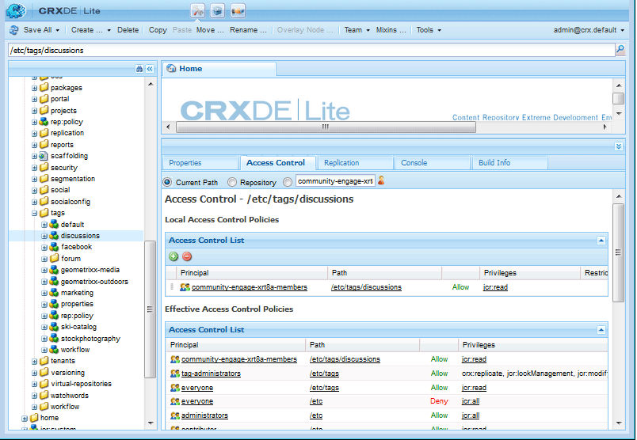

# Door gebruiker gegenereerde inhoud labelen {#tagging-user-generated-content}

## Overzicht {#overview}

Door een tag op te geven aan door gebruikers gegenereerde inhoud (UGC) kunnen leden van de gebruikersgemeenschap andere leden helpen bij het zoeken naar inhoud.

Codes worden doorgaans toegepast door auteurs en beheerders in de auteursomgeving. Het coderen van UGC is uniek in die zin dat de markeringen UGC door communautaire leden in het publicatiemilieu worden toegepast.

De tagnaamruimten en taxonomieën zijn voor beide toepassingen hetzelfde.

## Functies van Gemeenschappen {#communities-features}

De AEM Communities-functies die kunnen worden geconfigureerd om tags toe te staan, zijn:

* [Blog](blog-feature.md)
* [Kalender](calendar.md)
* [Bestandsbibliotheek](file-library.md)
* [Forum](forum.md#configuretheaddedforum)
* [Vragen en antwoorden](working-with-qna.md)

## Tags beheren {#administering-tags}

Zie [Tags](../../help/sites-administering/tags.md#tagging-console) beheren voor het maken en beheren van tagnaamruimten en -taxonomieën.

Zie Grondbeginselen van [tags](tag.md) voor informatie over ontwikkelaars.

Zie [De cloud](tagcloud.md) voor sociale tags gebruiken voor het toevoegen van een component Social Tag Cloud aan een pagina om het zoeken naar een gepubliceerde UGC met behulp van de toegepaste tags te vergemakkelijken.

### Tagmachtigingen {#tag-permissions}

De standaardmachtigingen zijn ingesteld om te voorkomen dat tagnaamruimten worden gelezen door iedereen in de publicatieomgeving.

Omdat tags worden toegepast op UGC in de publicatieomgeving, moet leesmachtigingen zijn ingeschakeld voor leden van de community om tags te kunnen selecteren die moeten worden toegepast.

Zie Tagmachtigingen [instellen](../../help/sites-administering/tags.md#setting-tag-permissions).

Hieronder ziet u hoe het wordt weergegeven in CRXDE wanneer een beheerder leesmachtigingen toepast op `/etc/tag/discussions` de groep `Community Engage Members`.

