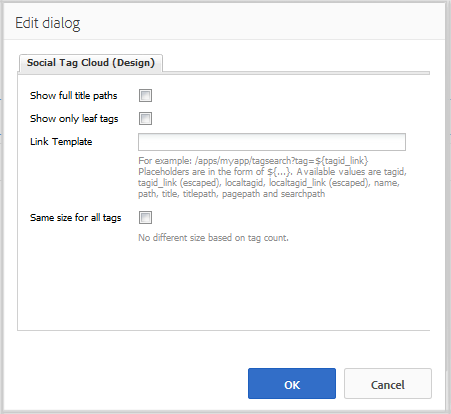

# Sociale tagcloud gebruiken {#using-social-tag-cloud}

## Inleiding {#introduction}

De `Social Tag Cloud` component markeert tags die door leden van de gemeenschap worden toegepast bij het plaatsen van inhoud. Dit is een manier om trending onderwerpen te identificeren en bezoekers van de site in staat te stellen snel gelabelde inhoud te zoeken.

Voor een andere manier om huidige trends te identificeren, gaat u naar [Activiteitendensen](trends.md).

Op deze pagina worden de instellingen van het `Social Tag Cloud` deelvenster gedocumenteerd en wordt de gebruikerservaring beschreven.

Zie [Tagelementen](tag.md)voor gedetailleerde informatie voor ontwikkelaars.

Zie [Tags](../../help/sites-administering/tags.md) beheren voor informatie over het maken en beheren van tags en over de inhoudstags die zijn toegepast.

## Een sociale-tagcloud toevoegen {#adding-a-social-tag-cloud}

Als u een `Social Tag Cloud` component wilt toevoegen aan een pagina in de ontwerpmodus, gebruikt u de componentbrowser om de component te zoeken `Communities / Social Tag Cloud` en naar de gewenste locatie op een pagina te slepen waarop de tagcloud moet verschijnen.

Ga voor de benodigde informatie naar [Community Components Basics](basics.md).

Wanneer de [vereiste client-side bibliotheken](tag.md#essentials-for-client-side) worden opgenomen, wordt de `Social Tag Cloud` component als volgt weergegeven:

## Cloud voor sociale tags configureren {#configuring-social-tag-cloud}

Selecteer de geplaatste `Social Tag Cloud` component die u wilt openen en selecteer het `Configure` pictogram waarmee het dialoogvenster Bewerken wordt geopend.

Geef op onder het tabblad **[!UICONTROL Sociale tag Cloud]** op welke tags u wilt weergeven en geef, als de tags actieve koppelingen zijn, de locatie van de pagina op voor de zoekresultaten:

* **[!UICONTROL Sociale tags die moeten worden weergegeven]** Identificeren welke UGC-tags moeten worden weergegeven. De pull-down opties zijn:

   * `From page and child pages`
   * `All tags`
   De standaardinstelling is `From page and child pages`, waarbij &quot;pagina&quot; verwijst naar de onderstaande **pagina** -instelling.

* **[!UICONTROL Pagina]**

   (Vereist als niet `All tags)` de weg aan UGC voor een pagina. Standaard is de huidige pagina als deze leeg blijft.

* **[!UICONTROL Geen koppelingen op tags]**

   Als deze optie is ingeschakeld, worden de labels in de labelcloud weergegeven als onbewerkte tekst. Als deze optie is uitgeschakeld, worden de tags weergegeven als actieve koppelingen die zoeken op alle inhoud waarop de tag wordt toegepast. De optie Standaard is uitgeschakeld en de optie Pad **[!UICONTROL zoekresultaat]** moet zijn ingesteld.

* **[!UICONTROL Resultaatpad zoeken]**

   Het pad naar een pagina waarop een `Search Result` component is geplaatst, geconfigureerd om te verwijzen naar UGC, dat het UGC-pad bevat dat is opgegeven door de instelling **Pagina** .

## Weergave van sociale-tagcloud wijzigen {#change-display-of-social-tag-cloud}

Als u de weergave van de **sociale-tagcloud** wilt bewerken, voert u de [ontwerpmodus](../../help/sites-authoring/default-components-designmode.md) in en dubbelklikt u op de geplaatste `Social Tag Cloud` component om een dialoogvenster met een extra tabblad te openen.

Geef op het tabblad **[!UICONTROL Sociale tag - Cloud (Ontwerp)]** op hoe tags moeten worden weergegeven. Een tag kan een eenvoudige tag zijn, een enkel woord in de standaardnaamruimte of een hiërarchische taxonomie:

* **[!UICONTROL Volledige-titelpaden tonen]**

   Als deze optie is ingeschakeld, worden de titels voor de bovenliggende tags en naamruimte voor elke toegepaste tag weergegeven.

   Bijvoorbeeld:

   * Ingeschakeld: `Geometrixx Media: Gadgets / Cars`
   * Niet ingeschakeld: `Cars`
   Er is geen verschil voor een eenvoudige tag.

   De optie Standaard is uitgeschakeld.

* **[!UICONTROL Alleen bladlabels tonen]**

   Als deze optie is ingeschakeld, worden alleen toegepaste tags weergegeven die geen andere tags bevatten.

   Voorbeeld van de tagID van:

   `Geometrixx Media: Gadgets / Cars`

   Er zijn drie tags die kunnen worden toegepast:

   `Geometrixx Media (the namespace)`, `Gadgets`en `Cars`

   * Ingeschakeld: Alleen `Cars` wordt weergegeven, indien toegepast.
   * Niet ingeschakeld: `Geometrixx Media` en `Gadgets``Cars` ook worden weergegeven, indien van toepassing.
   Een eenvoudige tag is een bladtag.

   De optie Standaard is uitgeschakeld.

* **[!UICONTROL Koppelingssjabloon]**

   Een andere sjabloon dan een standaard die wordt gebruikt om de koppelingen in een tagcloud weer te geven wanneer koppelingen zijn ingeschakeld via het dialoogvenster voor bewerken van componenten.

* **[!UICONTROL Dezelfde grootte voor alle tags]**

   Als deze optie is ingeschakeld, worden alle woorden in de tagcloud dezelfde stijl toegewezen. Als deze optie is uitgeschakeld, worden woorden anders opgemaakt op basis van hun gebruik. De optie Standaard is uitgeschakeld.

## Additional Information {#additional-information}

Meer informatie vindt u op de pagina [Tagelementen](tag.md) voor ontwikkelaars.

Zie Door gebruiker gegenereerde inhoud  labelen (UGC) voor informatie over het maken en beheren van tags.
