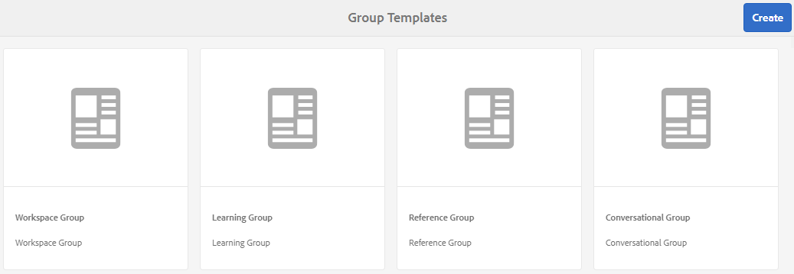

# Groepssjablonen {#group-templates}

De console van de Malplaatjes van de Groep is gelijkaardig aan de console van de Malplaatjes [van de](/help/communities/sites.md) Plaats. Beide zijn blauwdrukken voor een set vooraf bekabelde pagina&#39;s en functies die een gemeenschapssite vormen. Het verschil is dat een plaatsmalplaatje voor de belangrijkste gemeenschap is en een groepsmalplaatje voor een communautaire groep, een subgemeenschap die binnen de belangrijkste gemeenschap wordt genesteld.

Een community-groep wordt opgenomen in een sitesjabloon door de functie  Groepen op te nemen (die niet de eerste of enige functie in de sjabloon mag zijn).

Vanaf Community [feature pack 1](/help/communities/deploy-communities.md#latestfeaturepack)is het mogelijk om groepen te nesten door de functie Groepen op te nemen in een groepssjabloon.

Wanneer een actie wordt ondernomen om een nieuwe communautaire groep tot stand te brengen, wordt het malplaatje (de structuur) van de groep geselecteerd. De selectie hangt van af hoe de functie van Groepen toen toegevoegd aan het plaats of groepsmalplaatje werd gevormd.

>[!NOTE]
>
>De consoles voor de verwezenlijking van [communautaire plaatsen](/help/communities/sites-console.md), de malplaatjes [van de](/help/communities/sites.md)communautaire plaats, [communautaire groepsmalplaatjes](/help/communities/tools-groups.md) en [communautaire functies](/help/communities/functions.md) zijn voor gebruik slechts in het auteursmilieu.

## Groep sjablonen {#group-templates-console}

Om de console van groepsmalplaatjes in het milieu van de Auteur te bereiken AEM:

* Selecteer **gereedschappen| Gemeenschappen| Groepsjablonen,** van globale navigatie.

Deze console toont de malplaatjes waarvan een [communautaire plaats](/help/communities/sites-console.md) kan worden gecreeerd en laat nieuwe groepsmalplaatjes toe om worden gecreeerd.

## Groepssjabloon maken {#create-group-template}

Selecteer `Create`.

Hiermee wordt het deelvenster Site-editor weergegeven met drie subdeelvensters:

### Basisinformatie {#basic-info}

In het deelvenster Basisinformatie worden een naam, beschrijving en of de sjabloon is ingeschakeld of uitgeschakeld, geconfigureerd:

* **Nieuwe naam groepssjabloon**

   De naam-id van de sjabloon.

* **Beschrijving**

   De sjabloonbeschrijving.

* **Uitgeschakeld/Ingeschakeld**

   Een schakeloptie die bepaalt of naar de sjabloon kan worden verwezen.

#### Miniatuur {#thumbnail}

(Optioneel) Selecteer het pictogram Afbeelding uploaden om een miniatuur met de naam en beschrijving weer te geven aan makers van gemeenschapssites.

#### Structuur {#structure}

>[!CAUTION]
>
>Als u werkt met AEM 6.1 Communities FP4 of eerder, voegt u geen groepsfunctie toe aan een groepssjabloon.
>
>De functie Geneste groepen is beschikbaar vanaf [KP1](/help/communities/communities.md#latestfeaturepack)van de Gemeenschappen.
>
>Het is nog steeds niet toegestaan een functie Groepen toe te voegen als de eerste of enige functie in een sjabloon.

Als u communityfuncties wilt toevoegen, sleept u van de rechterkant naar links in de volgorde waarin de koppelingen in het sitemenu moeten worden weergegeven. Stijlen worden toegepast op de sjabloon tijdens het maken van de site.

Als u bijvoorbeeld een forum wilt, sleept u de forumfunctie uit de bibliotheek en zet u de functie neer onder de sjabloonbuilder. Dit zal in de dialoog van de forumconfiguratie resulteren die. Zie de [functieconsole](/help/communities/functions.md) voor informatie over de configuratievensters.

Ga verder met slepen en neerzetten van andere communityfuncties die gewenst zijn voor een subcommunity-site (groep) die op deze sjabloon is gebaseerd.

Nadat alle gewenste functies in het sjabloonbuildergebied zijn neergezet en geconfigureerd, selecteert u **Opslaan** in de rechterbovenhoek.

## Groepssjabloon bewerken {#edit-group-template}

Wanneer het bekijken van communautaire groepen in de belangrijkste console [van de Malplaatjes van de](#group-templates-console)Groep, is het mogelijk om een bestaand groepsmalplaatje voor uitgeven te selecteren.

Het bewerken van een groepssjabloon heeft geen invloed op communitysites die al van de sjabloon zijn gemaakt. In plaats daarvan kunt u de structuur van een site [van de community rechtstreeks](/help/communities/sites-console.md#modify-structure)bewerken.

Dit proces biedt dezelfde deelvensters als het [maken van een groepssjabloon](#create-group-template).
