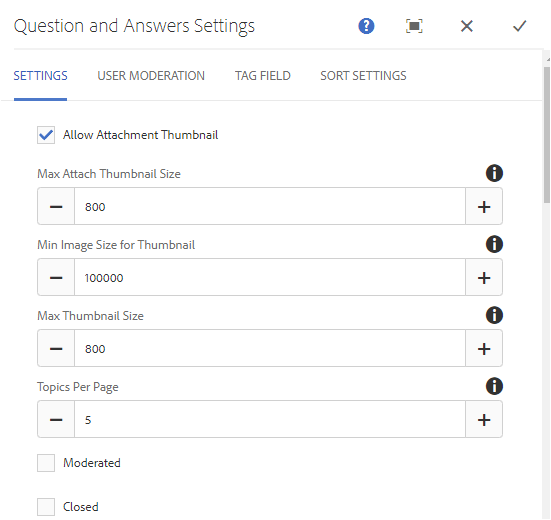

# Functie Vragen en antwoorden op forum{#q-a-forum-feature}

## Inleiding {#introduction}

De functie van het QnA-forum (vragen en antwoorden) biedt leden van de gemeenschap de mogelijkheid vragen te stellen en te beantwoorden. Leden kunnen:

* Nieuwe vragen maken
* Inline-afbeeldingen toevoegen (met ondersteuning voor slepen en neerzetten)
* Vragen weergeven en beantwoorden
* Zoeken naar een vraag
* De QnA-inhoud helpen matigen
* Beste antwoorden identificeren
* QnA-vragen van de ene pagina naar de andere verplaatsen

In de documentatie wordt beschreven:

* Het toevoegen van de QnA-forumfunctie aan een AEM-site.
* De montages van de configuratie voor de `QnA`component.

## Een forum voor vragen en antwoorden toevoegen aan een pagina {#adding-a-q-a-forum-to-a-page}

Om een `QnA` component aan een pagina op auteurswijze toe te voegen, gebruik componentenbrowser om van de plaats de plaats te bepalen `Communities / QnA`en het te slepen op een pagina waar het forum QnA zou moeten verschijnen.

Ga voor de benodigde informatie naar [Community Components Basics](/help/communities/basics.md).

Wanneer de [vereiste clientbibliotheken](/help/communities/qna-essentials.md#essentials-for-client-side) worden opgenomen, ziet u de `QnA`component als volgt:

### QnA configureren {#configuring-qna}

Selecteer de geplaatste `QnA` component die u wilt openen en selecteer het `Configure` pictogram waarmee het dialoogvenster Bewerken wordt geopend.

 

#### Het tabblad Instellingen {#settings-tab}

Geef op het tabblad **Instellingen** instellingen op voor onderwerpen (vragen) en antwoorden (antwoorden):

* **Miniatuur van bijlage toestaan**

   Als deze optie is ingeschakeld, wordt een miniatuur van de bijgevoegde afbeelding gemaakt.

* **Maximale grootte miniatuur bijvoegen**

   Maximale grootte (in pixels) van de miniatuurafbeelding van de bijlage. De standaardwaarde is 800 x 800.

* **Minimale afbeeldingsgrootte voor miniatuur**

   Minimale afbeeldingsgrootte (in bytes) voor het genereren van miniaturen voor inline-afbeeldingen. De standaardwaarde is 100000 bytes (100 kB).

* **Maximale miniatuurgrootte**

   Maximale grootte (in pixels) van de miniatuurafbeelding voor inline-afbeelding. De standaardwaarde is 800 x 800.

* **Onderwerpen per pagina**

   Hiermee definieert u het aantal vragen/berichten dat per pagina wordt weergegeven. De standaardwaarde is 10.

* **Gematigd**

   Als deze optie is ingeschakeld, moet het posten van onderwerpen en opmerkingen worden goedgekeurd voordat ze op een publicatiesite worden weergegeven. Standaard is uitgeschakeld.

* **Gesloten**

   Als het forum wordt gecontroleerd, is het gesloten voor nieuwe vragen en commentaren. Standaard is uitgeschakeld.

* **RTF-editor**

   Als deze optie is ingeschakeld, kunnen onderwerpen en opmerkingen worden ingevoerd met een markering. Standaard is uitgeschakeld.

* **Tags toestaan**

   Als deze optie is ingeschakeld, kunnen leden labellabels aan hun post toevoegen (zie tabblad **Tagveld** ). Standaard is uitgeschakeld.

* **Uploaden van bestanden toestaan**

   Als deze optie is ingeschakeld, kunt u bestandsbijlagen toevoegen aan de vraag of opmerking. Standaard is uitgeschakeld.

* **Volgen toestaan**

   Indien deze optie is ingeschakeld, dient u de volgende functie voor forumposten op te nemen, waardoor leden op de [hoogte kunnen worden gebracht](/help/communities/notifications.md) van nieuwe posten. Standaard is uitgeschakeld.

* **Vastzetten toestaan**

   Indien gecontroleerd, kunnen de forumonderwerpen aan de bovenkant van de lijst van onderwerpen worden vastgezet. Standaard is uitgeschakeld.

* **E-mailabonnementen toestaan**

   Als deze optie is ingeschakeld, kunnen leden via e-mail op de hoogte worden gesteld van nieuwe berichten ([abonnement](/help/communities/subscriptions.md)). Vereist toestaan na om worden gecontroleerd en [e-mail wordt gevormd](/help/communities/email.md). Standaard is uitgeschakeld.

* **Max. bestandsgrootte**

   Alleen relevant als `Allow File Uploads` is gecontroleerd. Dit veld beperkt de grootte (in bytes) van een geüpload bestand. De standaardwaarde is 104857600 (10 MB).

* **Toegestane bestandstypen**

   Alleen relevant als `Allow File Uploads` is gecontroleerd. Een door komma&#39;s gescheiden lijst met bestandsextensies met het scheidingsteken &#39;punt&#39;. Bijvoorbeeld: .jpg, .jpeg, .png, .doc, .docx, .pdf. Als er bestandstypen zijn opgegeven, mogen deze niet worden geüpload. De standaardinstelling is niet zodanig opgegeven dat** **alle bestandstypen zijn toegestaan.

* **Maximale bestandsgrootte afbeelding bijvoegen**

   Alleen relevant als Uploaden van bestand toestaan is ingeschakeld. Het maximum aantal bytes dat een geüploade afbeeldingsbestand kan hebben. De standaardwaarde is 2097152 (2 MB).

* **Reacties toestaan**

   Als deze optie is ingeschakeld, kunt u reacties op opmerkingen op de vraag toestaan. Standaard is uitgeschakeld.

* **Stemmen toestaan**

   Als deze optie is ingeschakeld, voegt u de functie Stemmen toe aan een vraag. Standaard is uitgeschakeld.

* **Gebruikers toestaan opmerkingen en onderwerpen te verwijderen**

   Als deze optie is ingeschakeld, kunnen leden de opmerkingen en vragen die ze hebben geplaatst verwijderen. Standaard is uitgeschakeld.

* **Geprivilegieerde leden toestaan**

   Als deze optie is ingeschakeld, mogen alleen leden met Geprivilegieerde inhoud maken.

* **Door gebruiker gegenereerde inhoud blokkeren in de bewerkingsmodus van auteur**

   Als deze optie is ingeschakeld, wordt door de gebruiker gegenereerde inhoud geblokkeerd tijdens het bewerken in de ontwerpmodus.

* **Geselecteerd antwoord bovenaan plaatsen**

   Als deze optie ingeschakeld is, wordt een eerste weergegeven antwoord geselecteerd. Standaard is uitgeschakeld.
* **Badges weergeven**

   Indien ingeschakeld, verdiende en toegewezen [badges](/help/communities/implementing-scoring.md) bij het blogbericht van een lid weergeven. Standaard is uitgeschakeld.

* **Aanbevolen inhoud toestaan**

   als deze optie is ingeschakeld, kan het idee worden geïdentificeerd als [aanbevolen inhoud](/help/communities/featured.md). Standaard is uitgeschakeld.

* **Menu inschakelen**

   Als deze optie is ingeschakeld, kunnen geregistreerde gebruikers in de gemeenschap andere geregistreerde leden identificeren (met voornaam, achternaam, gebruikersnaam) en ze tags toewijzen met behulp van de algemene syntaxis voor @user-name. De getagde gebruikers ontvangen meldingen over hun berichten.

* **Max. aantal meldingen**

   Beperk het maximum aantal berichten dat in een bericht is toegestaan. De standaardwaarde is 10.

* **Menatiepatroon gebruikersinterface**

   Geef de patroontekenreeks op die de geregistreerde gebruiker in een bericht mag labelen (@genoemd). Bijvoorbeeld, `~{{familyName}}{{givenName}}`.

#### Tabblad Gebruikersmodernisering {#user-moderation-tab}

Geef op onder het tabblad **Gebruikersmodernisering** op hoe de geposte onderwerpen (vragen) en antwoorden (door de gebruiker gegenereerde inhoud) worden beheerd. Voor meer informatie, zie het [Modereren van Gebruiker Gegenereerde Inhoud](/help/communities/moderate-ugc.md).

* **Antwoorden weigeren**

   Als deze optie is ingeschakeld, mogen vertrouwde moderatoren van leden geposte antwoorden weigeren en voorkomen dat het antwoord verschijnt op het openbare forum met vragen en antwoorden. Standaard is uitgeschakeld.

* **Onderwerpen sluiten/opnieuw openen**

   Indien gecontroleerd, kunnen de vertrouwde op lidmoderatoren een vraag (onderwerp) aan verdere uitgeeft en antwoorden sluiten, en ook een vraag heropenen. Standaard is uitgeschakeld.

* **Onderwerpen** van de beweging indien gecontroleerd, sta toe publiceert-zijmoderators om vragen te bewegen. Standaard is uitgeschakeld.

* **Vlagberichten**

   Als deze optie is ingeschakeld, kunnen leden de vragen of antwoorden van anderen als ongeschikt markeren. Standaard is uitgeschakeld.

* **Lijst met redenen voor vlag**

   Als deze optie is ingeschakeld, kunnen leden in een vervolgkeuzelijst kiezen waarom een vraag of antwoord onjuist is. Standaard is uitgeschakeld.

* **Reden voor aangepaste vlag**

   Als deze optie is ingeschakeld, kunnen leden hun eigen reden opgeven om een vraag of antwoord als ongeschikt te bestempelen. Standaard is uitgeschakeld.

* **Moderniseringsdrempel**

   Voer het aantal keren in dat een vraag of antwoord moet worden gemarkeerd door leden voordat moderatoren op de hoogte worden gesteld. De standaardwaarde is 1 (één keer).

* **Limiet voor markering**

   Voer het aantal keren in dat een vraag of antwoord moet worden gemarkeerd voordat deze wordt verborgen in de openbare weergave. Indien ingesteld op -1, wordt de gemarkeerde vraag of het gemarkeerde antwoord nooit verborgen voor de openbare weergave. Anders, moet dit aantal groter dan of gelijk aan de Drempel van de Moderatie zijn. De standaardwaarde is 5.

#### Tabblad Tagveld {#tag-field-tab}

Onder het tabblad **Tagveld** zijn de tags die kunnen worden toegepast, indien toegestaan op het tabblad **Instellingen** , beperkt op basis van de gekozen naamruimten.

* **Toegestane naamruimten**

   Relevant als `Allow Tagging` is ingeschakeld onder het tabblad **Instellingen** . De tags die kunnen worden toegepast, zijn beperkt tot de tags binnen de geselecteerde naamruimtecategorieën. De lijst met naamruimten bevat &quot;Standaardtags&quot; (de standaardnaamruimte) en &quot;Alle tags opnemen&quot;. De standaardwaarde is niet ingeschakeld, hetgeen betekent dat alle naamruimten zijn toegestaan.

* **Suggestiegrenswaarde**

   Voer het aantal tags in dat moet worden weergegeven als suggestie aan het lid dat naar het forum post. De waarde **-**1 betekent geen limieten. De standaardwaarde is 0.

#### Tabblad Instellingen sorteren {#sort-settings-tab}

Geef op onder het tabblad **Sorteerinstellingen** op hoe de geposte opmerkingen worden gesorteerd wanneer ze worden weergegeven.

* **Sorteren op**

   Alle toegestane sorteerselecties controleren: `Newest, Oldest, Last Updated, Most Viewed, Most Active, Most Followed and Most Liked`. Standaard is dit `Newest, Oldest, Last Updated`.

* **Instellen als standaard**

   Trek naar beneden om een van de geselecteerde sorteeropties te selecteren die als standaard moeten worden weergegeven. Standaard is dit `Newest`.

* **Tijdopties selecteren voor het sorteren van analysemogelijkheden**

   Vervolgkeuzelijst om een van de opties te selecteren `All, Last 24 Hours, Last 7 Days, Last 30 Days`. Standaard is dit `All`.

## Ervaring met sitebezoekers {#site-visitor-experience}

### Antwoorden identificeren {#identifying-answers}

Eén antwoord kan met de `Select Answer` knop worden gemarkeerd als correct of nuttig. Als een vraag is gemarkeerd als Beantwoord, kan een ander antwoord pas worden geselecteerd als de eerste is uitgeschakeld met de `Unmark Chosen Answer` knop.

Als deze optie is geselecteerd als een handig antwoord, kunt u de selectie ongedaan maken met de `Unmark Chosen Answer` knop.

Zodra een antwoord als levensvatbaar antwoord wordt geselecteerd, een aanwijzing dat de vraag naast het vraagonderwerp op de belangrijkste pagina QnA is getoond. `Answered`

#### Moderatoren en beheerders {#moderators-and-administrators}

Wanneer de ondertekende binnen gebruiker moderator of beheerdervoorrechten heeft, kunnen zij de matigingstaken uitvoeren die door de configuratie van de component worden toegestaan, ongeacht wie de vraag of het antwoord authored.

Ze kunnen ook antwoorden identificeren.

#### Leden {#members}

Afhankelijk van de configuratie kunnen bezoekers zich aanmelden bij de site:

* Plaats een nieuwe vraag.
* Bewerk of verwijder de vragen die ze hebben geschreven.
* Vlagvragen of antwoorden van andere leden.
* Antwoorden identificeren voor vragen die ze hebben geschreven.

#### Anoniem {#anonymous}

Sitebezoekers die niet zijn aangemeld, kunnen alleen geposte vragen en antwoorden lezen, deze vertalen als ze hiervoor ondersteuning krijgen, maar ze kunnen geen vraag of antwoord toevoegen, noch vlagberichten van anderen.

## Additional Information {#additional-information}

Meer informatie vindt u op de pagina [QnA Essentials](/help/communities/qna-essentials.md) voor ontwikkelaars.

Voor moderatie van geposte onderwerpen en commentaren, zie het [Modereren van Door Gebruiker Gegenereerde Inhoud](/help/communities/moderate-ugc.md).

Zie Door gebruiker gegenereerde inhoud labelen voor informatie over het labelen van geposte onderwerpen en opmerkingen.
