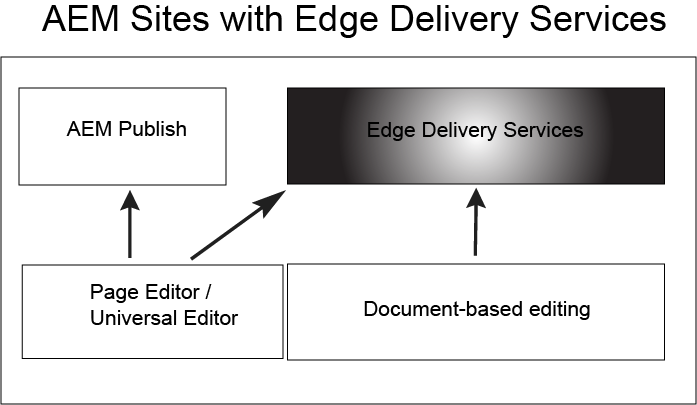

# Aan de slag met Edge Delivery Services {#getstart-edge}

Met Edge Delivery Services biedt AEM buitengewone ervaringen die de betrokkenheid en conversies stimuleren. AEM doet dit door het bieden van ervaringen met grote impact die snel bij de auteur en de ontwikkeling zijn. Het is een samenstellbare reeks diensten die een snelle ontwikkelomgeving toelaat waar de auteurs kunnen bijwerken en publiceren snel, en de nieuwe plaatsen worden gelanceerd snel. Als zodanig kunt u met Edge Delivery Services de conversie verbeteren, de kosten verlagen en de snelheid van de inhoud extreem verhogen.

Met Edge Delivery kunt u:

* Maak snelle sites met een perfecte Lighthouse Score en controleer de prestaties van uw site voortdurend via RUM (real user monitoring).
* Verhoog de efficiëntie bij het ontwerpen door inhoudsbronnen te ontkoppelen. U kunt zowel AEM ontwerpen als op documenten gebaseerd schrijven. Als zodanig kunt u met meerdere inhoudsbronnen werken op dezelfde website.
* Gebruik een ingebouwd raamwerk voor experimenteren dat het mogelijk maakt snel tests te maken, uit te voeren zonder invloed op de prestaties en snel vrij te maken voor de productie van een testwinnaar.

## Hoe Edge Delivery werkt {#edge-works}

In het volgende diagram ziet u hoe u inhoud in Microsoft Word (op documenten gebaseerde bewerking) kunt bewerken en naar Edge Delivery kunt publiceren. Ook wordt met de verschillende editors de traditionele AEM-publicatiemethode weergegeven.

Edge Delivery is een set services die u kunt samenstellen en waarmee u een hoge mate van flexibiliteit hebt bij het schrijven van inhoud op uw website. Zoals eerder vermeld, kunt u zowel [ gebruiken AEM creatie ](/help/sites-authoring/author.md) en [ op document-gebaseerde creatie ](https://www.hlx.live/docs/authoring).

U kunt inhoud bijvoorbeeld rechtstreeks vanuit Microsoft Word of Google Docs gebruiken. Dit betekent dat documenten uit deze bronnen pagina&#39;s op uw website kunnen worden. Daarnaast kunnen koppen, lijsten, afbeeldingen en lettertype-elementen allemaal van de oorspronkelijke bron naar de website worden overgebracht. De nieuwe inhoud wordt direct toegevoegd zonder een herbouwingsproces.

Edge Delivery gebruikt GitHub zodat kunnen de klanten code van hun bewaarplaats direct beheren en opstellen GitHub. U kunt bijvoorbeeld inhoud schrijven in Google Docs of Microsoft Word en de functionaliteit van uw site kan worden ontwikkeld met CSS en JavaScript in GitHub. Wanneer u klaar bent, kunt u de browser van de Sidekick extensie gebruiken om inhoudsupdates voor te vertonen en te publiceren.

Verdere lezing:

* Voor details op hoe te om met Edge Delivery te worden begonnen zie [ Bouwstijl ](https://www.hlx.live/docs/#build) sectie van de de leveringsdocumentatie van Edge.
* Om te begrijpen hoe te om inhoud te schrijven en te publiceren door Edge Delivery te gebruiken zie de [ sectie van Publish ](https://www.hlx.live/docs/authoring).
* Om te begrijpen hoe te om uw websiteproject behoorlijk te lanceren zie de [ sectie van de Lancering ](https://www.hlx.live/docs/#launch).

## Edge Delivery Services en andere producten van Adobe Experience Cloud {#edge-other-products}

Edge Delivery Services maken deel uit van Adobe Experience Manager en als zodanig kunnen Edge Delivery- en AEM-sites op hetzelfde domein naast elkaar bestaan. Dit is een veelvoorkomend geval voor het gebruik van grotere websites. Bovendien kan inhoud van Edge Delivery eenvoudig worden gebruikt op je AEM Sites-pagina&#39;s en omgekeerd.

U kunt Edge Delivery Services ook gebruiken in combinatie met Adobe Target, Analytics en Launch.

## Toegang tot Edge Delivery Services krijgen {#getting-access}

Het is eenvoudig om met Edge Delivery Services aan de slag te gaan. Krijg begonnen door het [ Begonnen krijgen te volgen - het Leerprogramma van de Ontwikkelaar ](https://www.hlx.live/developer/tutorial).

## Help van Adobe ophalen {#adobe-gethelp}

U kunt met de productteams van de Adobe via uw leverings productsamenwerkingskanaal (zie hieronder voor toegangsdetails) in gesprek gaan om vragen over productgebruik of beste praktijken te beantwoorden. Er zijn geen Termen van het Niveau van de Dienst (SLT) verbonden aan de gesprekken via het kanaal van de productsamenwerking. Als een productkwestie extra onderzoek en het oplossen van problemen vereist, en reactie SLTs moet ontmoeten, kunt u een steunkaartje na het [ steunproces ](https://experienceleague.adobe.com/?lang=en&amp;support-tab=home#support) voorleggen.

Adobe biedt drie kanalen om u te helpen met Edge Delivery Services:

* Betrokkenheid met gemeenschapsmiddelen voor algemene onderzoeken
* Toegang tot uw product Collaboration Channel voor specifieke vragen
* Logeen steunkaartje om belangrijke en kritieke kwesties op te lossen

### Toegang tot communautaire bronnen {#community-resource}

Adobe streeft ernaar u de beste betrokkenheid en ondersteuning van de gemeenschap voor Edge Delivery Services en op documenten gebaseerde authoring te bieden. Neem deel aan [ Gemeenschap van het Experience League ](https://adobe.ly/3Q6kTKl) om vragen te stellen, terugkoppelen te delen, besprekingen in werking te stellen, hulp van de deskundigen van de Adobe en Advisors/Kampen AEM, en met gelijkgestemde individuen in real time te verbinden. En sluit zich aan bij ons [ kanaal van de Opsporing ](https://discord.gg/aem-live), een meer tijdelijk platform voor interactie in real time en snelle uitwisseling van ideeën.

### Toegang tot uw product, Collaboration Channel {#collab-channel}

Gezien de waarde van direct communicatiekanaal met klanten, zullen alle AEM klanten bij lancering een kanaal van de Slack voor snelheid, kritieke updates, en geschaalde rapportering over ervaringskwaliteit vestigen. U zult een uitnodiging van Adobe ontvangen om zich bij een kanaal van de Slack aan te sluiten specifiek voor uw organisatie.

Voor meer informatie, zie [ Gebruikend het Bot van de Slack ](https://www.hlx.live/docs/slack) document voor meer details.

### Een ondersteuningsticket aanmelden {#support-ticket}

Stappen om een steunkaartje via de Admin Console te registreren:

1. Voeg **Edge Delivery** in de titel van het kaartje toe.
2. Geef in de beschrijving de volgende gegevens op:

   * URL van de live website. Bijvoorbeeld: [ www.mydomain.com ].
   * URL van de oorspronkelijke website (.hlx URL).

## Volgende functies {#whats-next}

Krijg begonnen door het volgende artikel te herzien: [ Gebruikend Edge Delivery Services ](/help/edge/using.md).

## Nuttige bronnen {#useful-resources}

Voor extra details over Edge Delivery Services, zie de [ documentatie van Edge Delivery Services ](https://www.hlx.live/docs/).
