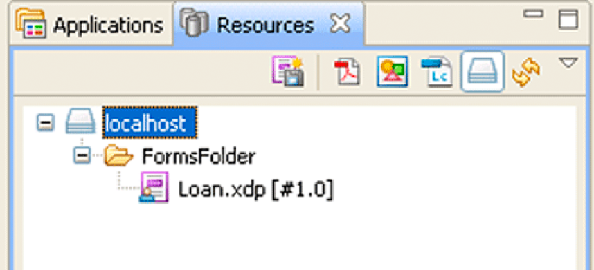

# Werken met AEM Forms Repository {#working-with-aem-forms-repository}

**Voorbeelden en voorbeelden in dit document gelden alleen voor AEM Forms in JEE-omgeving.**

**Over de Repository Service**

De Repository-service biedt AEM Forms opslagservices en beheerservices voor resources. Wanneer ontwikkelaars een *AEM Forms* kunnen ze de middelen in de opslagplaats implementeren in plaats van in het bestandssysteem. De elementen kunnen elk type onderpand bevatten, zoals XML-formulieren, PDF forms (inclusief Acrobat-formulieren), formulierfragmenten, afbeeldingen, profielen, beleid, SWF-bestanden, DDX-bestanden, XML-schema&#39;s, WSDL-bestanden en testgegevens.

Neem bijvoorbeeld de volgende Forms-toepassing met de naam *Applications/FormsApplication*:

Er bevindt zich een bestand met de naam Loan.xdp in de FormsFolder. Als u dit formulierontwerp wilt openen, geeft u het volledige pad op (inclusief versie): `Applications/FormsApplication/1.0/FormsFolder/Loan.xdp`.

>[!NOTE]
>
>Voor informatie over het maken van een Forms-toepassing met Workbench gaat u naar [Workbench Help](https://www.adobe.com/go/learn_aemforms_workbench_63).

Het pad naar een resource in de AEM Forms-opslagplaats is:

`Applications/Application-name/Application-version/Folder.../Filename`

De volgende waarden tonen enkele voorbeelden van URI-waarden:

* Applications/AppraisalReport/1.0/Forms/FullForm.xdp
* Applications/AnotherApp/1.1/Assets/picture.jpg
* Applications/SomeApp/2.0/Resources/Data/XSDs/MyData.xsd

>[!NOTE]
>
>U kunt in de AEM Forms Repository bladeren met een webbrowser. Voer de volgende URL in een webbrowser in om door de gegevensopslagruimte te bladeren `https://[server name]:[server port]/repository`. U kunt via een webbrowser controleren welke snelstartresultaten worden gekoppeld aan de sectie Werken met AEM Forms Repository. Als u bijvoorbeeld inhoud toevoegt aan de AEM Forms Repository, kunt u de inhoud zien in een webbrowser. (Zie [Snel starten (SOAP modus): een bron schrijven met de Java API](/help/forms/developing/repository-service-api-quick-starts.md#quick-start-soap-mode-writing-a-resource-using-the-java-api).)

De API van de dataopslag biedt verschillende bewerkingen die u kunt gebruiken om gegevens op te slaan en op te halen uit de dataopslag. Bijvoorbeeld, kunt u een lijst van middelen verkrijgen of specifieke middelen terugwinnen die in de bewaarplaats worden opgeslagen wanneer een middel als deel van de verwerking van een toepassing nodig is.

>[!NOTE]
>
>De API van de dataopslag kan niet worden gebruikt om met de (afgekeurde) Diensten van de Inhoud in wisselwerking te staan. Als u wilt werken met Content Services (afgekeurd), gebruikt u de API voor documentbeheer.

Met de Repository-service-API kunt u de volgende taken uitvoeren:

* Maak mappen. Zie [Mappen maken](aem-forms-repository.md#creating-folders).
* Bronnen en hun eigenschappen schrijven. Zie [Bronnen schrijven](aem-forms-repository.md#writing-resources).
* De middelen van de lijst in een bepaalde inzameling of verwant met andere middelen. Zie [Aanbiedingsbronnen](aem-forms-repository.md#listing-resources).
* Bronnen en hun eigenschappen lezen. Zie [Bronnen lezen](aem-forms-repository.md#reading-resources).
* Bronnen en hun eigenschappen bijwerken. Zie [Bronnen bijwerken](aem-forms-repository.md#updating-resources).
* Zoeken naar bronnen, waaronder hun geschiedenis, gerelateerde bronnen en eigenschappen. Zie [Zoeken naar bronnen](aem-forms-repository.md#searching-for-resources).
* Geef relaties tussen bronnen op. Zie [Resourcerelaties maken](aem-forms-repository.md#creating-resource-relationships).
* Beheer middeltoegangsbeheer, met inbegrip van het sluiten en het ontgrendelen van middelen, en het lezen en het schrijven toegangsbeheerlijsten (ACLs). Zie [Bronnen vergrendelen](aem-forms-repository.md#locking-resources).
* Bronnen en hun eigenschappen verwijderen. Zie [Bronnen verwijderen](aem-forms-repository.md#deleting-resources).

>[!NOTE]
>
>Met behulp van de API van de dataopslag kunt u het beheer van de resourcetoegang niet beheren, kunt u niet zoeken naar bronnen en kunt u geen relaties met bronnen opgeven met behulp van een ECM-opslagplaats.

>[!NOTE]
>
>Wanneer een gecodeerde PDF naar de opslagplaats wordt geschreven, kan de functie voor automatische relatieextractie niet worden gebruikt. Anders kan een gecodeerde PDF worden opgeslagen in de opslagplaats en later worden opgehaald. De terugwader kan verkiezen om de PDF te decrypteren nadat het van de bewaarplaats wordt teruggewonnen.

>[!NOTE]
>
>Zie voor meer informatie over de Repository-service [Services Reference for AEM Forms](https://www.adobe.com/go/learn_aemforms_services_63).

## Mappen maken {#creating-folders}

De omslagen (middelinzamelingen) worden gebruikt om voorwerpen (dossiers of middelen) in georganiseerde groepen op te slaan. Mappen kunnen bronnen en andere mappen bevatten, ook wel submappen genoemd. Bronnen kunnen slechts in één map tegelijk worden opgeslagen.

De dossiers erven toegangsbeheerlijsten (ACLs) van omslagen, en subfolders erven ACLs van hun ouderomslagen. Daarom moeten de bovenliggende mappen bestaan voordat u onderliggende mappen kunt maken. IDE laat u slechts op een omslag-door-omslag basis, niet op een dossier-door-dossier basis communiceren. U kunt geen mappen versieren en dat is niet nodig. Een map bevat geen gegevens zelf. In plaats daarvan is het alleen een container voor bronnen die gegevens bevatten. Standaard ACL is systeem-vlakke toestemming, zo betekent het dat de gebruikers systeemvlakke toestemmingen (lees, schrijf, traverse, het leiden ACLs) moeten hebben tot iemand hen toestemmingen voor een bepaalde omslag geeft. ACLs werkt slechts in winde.

>[!NOTE]
>
>Zie voor meer informatie over de Repository-service [Services Reference for AEM Forms](https://www.adobe.com/go/learn_aemforms_services_63).

### Overzicht van de stappen {#summary-of-steps}

Ga als volgt te werk om een map te maken:

1. Inclusief projectbestanden.
1. Maak de serviceclient.
1. Maak de map.
1. Schrijf de map naar de opslagplaats.

**Projectbestanden opnemen**

Neem de benodigde bestanden op in uw ontwikkelingsproject. Als u een clienttoepassing maakt met Java, neemt u de benodigde JAR-bestanden op. Als u webservices gebruikt, neemt u de proxybestanden op.

**De serviceclient maken**

Alvorens u een middelinzameling programmatically kunt tot stand brengen, moet u een verbinding vestigen en geloofsbrieven verstrekken. Dit wordt verwezenlijkt door een de dienstcliënt te creëren.

**De map maken**

Roep de servicemethode voor opslagplaats aan om de bronverzameling te maken en de bronverzameling te vullen met identificerende informatie, zoals de UUID, mapnaam en beschrijving van de verzameling.

**De map naar de opslagplaats schrijven**

Roep de servicemethode Repository aan om de bronverzameling te schrijven en de URI van de doelmap op te geven.

**Zie ook**

[Mappen maken met de Java API](aem-forms-repository.md#create-folders-using-the-java-api)

[Mappen maken met de webservice-API](aem-forms-repository.md#create-folders-using-the-web-service-api)

[Inclusief AEM Forms Java-bibliotheekbestanden](/help/forms/developing/invoking-aem-forms-using-java.md#including-aem-forms-java-library-files)

[Verbindingseigenschappen instellen](/help/forms/developing/invoking-aem-forms-using-java.md#setting-connection-properties)

[Repository Service API](/help/forms/developing/repository-service-api-quick-starts.md#repository-service-api-quick-starts)

### Mappen maken met de Java API {#create-folders-using-the-java-api}

Een map maken met de API voor opslagplaats (Java):

1. Projectbestanden opnemen

   Neem projectbestanden op in het klassenpad van uw Java-project.

1. De serviceclient maken

   Een `ResourceRepositoryClient` object door de constructor ervan te gebruiken en een `ServiceClientFactory` object dat verbindingseigenschappen bevat.

1. De map maken

   Als u een bronverzameling wilt maken, moet u eerst een `com.adobe.repository.infomodel.bean.RepositoryInfomodelFactoryBean` object.

   De `repositoryInfomodelFactoryBean` object `newResourceCollection` en geeft de volgende parameters door:

   * A `com.adobe.repository.infomodel.Id` UUID-id die aan de bron moet worden toegewezen.
   * A `com.adobe.repository.infomodel.Lid` UUID-id die aan de bron moet worden toegewezen.
   * A `java.lang.String` met de naam van de bronverzameling. Bijvoorbeeld: `FormsFolder`.

   De methode retourneert een `com.adobe.repository.infomodel.bean.ResourceCollection` object dat de nieuwe map vertegenwoordigt.

   De beschrijving van de map instellen met de opdracht `setDescription` methode en geef de volgende parameter door:

   * A `String` dat de middelinzameling beschrijft. In dit voorbeeld: `"test Folder"` wordt gebruikt `.`

1. De map naar de opslagplaats schrijven

   De `ResourceRepositoryClient` object `writeResource` en geeft u de URI van de map en de `ResourceCollection` object. De URI naar de map kan bijvoorbeeld de volgende waarde zijn `/Applications/FormsApplication/1.0/`.

   De methode retourneert een instantie van het zojuist gemaakte `com.adobe.repository.infomodel.bean.Resource` object. U kunt, bijvoorbeeld, de herkenningstekenwaarde van de nieuwe bron terugwinnen door het `com.adobe.repository.infomodel.bean.Resource` object `getId` methode.

**Zie ook**

[Mappen maken](aem-forms-repository.md#creating-folders)

[Snel starten (SOAP modus): een map maken met de Java API](/help/forms/developing/repository-service-api-quick-starts.md#quick-start-soap-mode-creating-a-folder-using-the-java-api)

[Inclusief AEM Forms Java-bibliotheekbestanden](/help/forms/developing/invoking-aem-forms-using-java.md#including-aem-forms-java-library-files)

[Verbindingseigenschappen instellen](/help/forms/developing/invoking-aem-forms-using-java.md#setting-connection-properties)

### Mappen maken met de webservice-API {#create-folders-using-the-web-service-api}

Een map maken met de Repository Service API (webservice):

1. Projectbestanden opnemen

   * Creeer een Microsoft .NET cliëntassemblage die de Bewaarplaats WSDL gebruikend base64 verbruikt.
   * Verwijs naar de Microsoft .NET cliëntassemblage.

1. De serviceclient maken

   Gebruikend de de cliëntassemblage van Microsoft .NET, creeer een `RepositoryServiceService` object door de standaardconstructor aan te roepen. Stel zijn `Credentials` eigenschap met een `System.Net.NetworkCredential` -object dat de gebruikersnaam en het wachtwoord bevat.

1. De map maken

   Maak de map met de standaardconstructor voor de `ResourceCollection` klasse en geef de volgende parameters door:

   * An `Id` object, dat wordt gemaakt door de standaardconstructor voor het `Id` klasse en toegewezen aan de `Resource` object `id` veld.
   * An `Lid` object, dat wordt gemaakt door de standaardconstructor voor het `Lid` klasse en toegewezen aan de `Resource` object `lid` veld.
   * Een tekenreeks met de naam van de bronverzameling die is toegewezen aan de `Resource` object `name` veld. De in dit voorbeeld gebruikte naam is `"testfolder"`.
   * Een tekenreeks die de beschrijving bevat van de bronverzameling die is toegewezen aan de `Resource` object `description` veld. In dit voorbeeld wordt de volgende beschrijving gebruikt: `"test folder"`.

1. De map naar de opslagplaats schrijven

   De `RepositoryServiceService` object `writeResource` methode en geef de volgende parameters door:

   * Het pad waar de map moet worden gemaakt.
   * De `ResourceCollection` object dat de map vertegenwoordigt.
   * Voldoende `null` voor de andere twee parameters.

**Zie ook**

[Mappen maken](aem-forms-repository.md#creating-folders)

[AEM Forms aanroepen met Base64-codering](/help/forms/developing/invoking-aem-forms-using-web.md#invoking-aem-forms-using-base64-encoding)

## Bronnen schrijven {#writing-resources}

U kunt bronnen maken op een bepaalde locatie in de opslagplaats. De natuurlijke dossiergrootte is onderworpen aan gegevensbestandbeperkingen en zittingsonderbreking. Voor de standaardconfiguratie, zijn de dossiers beperkt tot 25 MB. Als u de maximale bestandsgrootte wilt verhogen of verlagen, moet u de databaseconfiguratie wijzigen.

Het schrijven van bronnen is gelijk aan het opslaan van gegevens in de opslagplaats. Zodra u een middel aan de bewaarplaats schrijft, wordt het toegankelijk voor alle cliënten in het bewaarplaats ecosysteem. Wanneer u bronnen naar de opslagplaats schrijft, zoals XML-schema&#39;s, XDP-bestanden en XSD-bestanden, wordt de inhoud geparseerd op basis van het MIME-type. Als het MIME-type wordt ondersteund, bepaalt de parser of er een impliciete relatie met andere inhoud is. Als een CSS (Cascading Style Sheet) bijvoorbeeld een relatieve URL heeft die verwijst naar een gemeenschappelijke CSS, wordt verwacht dat u de gemeenschappelijke CSS ook in de opslagplaats zult verzenden. De relatie tussen de twee bronnen wordt gedurende een niet-aanpasbare periode van 30 dagen opgeslagen als een hangende relatie. Wanneer u de algemene CSS binnen de periode van 30 dagen naar de opslagplaats verzendt, wordt de relatie gevormd.

Wanneer u een middel creeert, wordt de toegangsbeheerlijst (ACL) geërft van de ouderomslag. De wortelomslag heeft systeem-vlakke toestemmingen tot een eerste middel of een omslag wordt gecreeerd, waarbij het middel of de omslag standaardACL toestemmingen wordt gegeven.

U kunt bronnen programmatisch schrijven met de Java API of webservice van de Repository-service.

>[!NOTE]
>
>Zie voor meer informatie over de Repository-service [Services Reference for AEM Forms](https://www.adobe.com/go/learn_aemforms_services_63).

### Overzicht van de stappen {#summary_of_steps-1}

Voer de volgende stappen uit om een resource te schrijven:

1. Inclusief projectbestanden.
1. Maak een Repository Service-client.
1. Geef de URI op van de bron die moet worden gelezen.
1. Lees de bron.

**Projectbestanden opnemen**

Neem de benodigde bestanden op in uw ontwikkelingsproject. Als u een clienttoepassing maakt met Java, neemt u de benodigde JAR-bestanden op. Als u webservices gebruikt, neemt u de proxybestanden op.

**De serviceclient maken**

Voordat u een bron via programmacode kunt lezen, moet u een verbinding tot stand brengen en referenties opgeven. Dit wordt verwezenlijkt door een de dienstcliënt te creëren.

**De URI van de doelmap voor de bron opgeven**

Maak een tekenreeks met de URI van de bron die moet worden gelezen. De syntaxis bevat slashes, zoals in dit voorbeeld: &quot;/*pad*/*map*&quot;.

**De bron maken**

Roep de servicemethode voor opslagplaats aan om de bron te maken en de bron te vullen met identificerende informatie, waaronder de UUID, de naam van de bron en een beschrijving.

**De inhoud van de bron opgeven**

Roep de de dienstmethode van de Bewaarplaats aan om middelinhoud tot stand te brengen, en die inhoud in het middel op te slaan.

**De bron naar de doelmap schrijven**

Roep de servicemethode Repository aan om de bron te schrijven en de URI van de doelmap op te geven.

**Zie ook**

[Bronnen schrijven met de Java API](aem-forms-repository.md#write-resources-using-the-java-api)

[Bronnen schrijven met de webservice-API](aem-forms-repository.md#write-resources-using-the-web-service-api)

[Inclusief AEM Forms Java-bibliotheekbestanden](/help/forms/developing/invoking-aem-forms-using-java.md#including-aem-forms-java-library-files)

[Verbindingseigenschappen instellen](/help/forms/developing/invoking-aem-forms-using-java.md#setting-connection-properties)

[Repository Service API](/help/forms/developing/repository-service-api-quick-starts.md#repository-service-api-quick-starts)

### Bronnen schrijven met de Java API {#write-resources-using-the-java-api}

Schrijf een bron met behulp van de Repository Service API (Java):

1. Projectbestanden opnemen

   Neem client-JAR-bestanden op in het klassenpad van uw Java-project.

1. De serviceclient maken

   Een `ResourceRepositoryClient` object door de constructor ervan te gebruiken en een `ServiceClientFactory` object dat verbindingseigenschappen bevat.

1. De URI van de doelmap voor de bron opgeven

   Geef de URI van de doelmap voor de bron op. In dit geval omdat de resource `testResource` wordt opgeslagen in de map `testFolder`, de URI van de map is `"/testFolder"`. De URI wordt opgeslagen als een `java.lang.String` object.

1. De bron maken

   Als u een bron wilt maken, moet u eerst een `com.adobe.repository.infomodel.bean.RepositoryInfomodelFactoryBean` object.

   De `RepositoryInfomodelFactoryBean` object `newResource` methode, die een `com.adobe.repository.infomodel.bean.Resource` object. In dit voorbeeld worden de volgende parameters opgegeven:

   * A `com.adobe.repository.infomodel.Id` object, dat wordt gemaakt door de standaardconstructor voor het `Id` klasse.
   * A `com.adobe.repository.infomodel.Lid` object, dat wordt gemaakt door de standaardconstructor voor het `Lid` klasse.
   * A `java.lang.String` met de bestandsnaam van de bron.

   Als u de beschrijving van de bron wilt opgeven, roept u de `Resource` object `setDescription` en geeft u een tekenreeks met de beschrijving door. In dit voorbeeld is de beschrijving `"test resource"`.

1. De inhoud van de bron opgeven

   Als u inhoud voor de bron wilt maken, roept u de `RepositoryInfomodelFactoryBean` object `newResourceContent` methode, die een `com.adobe.repository.infomodel.bean.ResourceContent` object. Inhoud toevoegen aan de `ResourceContent` object. In dit voorbeeld worden de volgende taken uitgevoerd:

   * De `ResourceContent` object `setDataDocument` methode en het doorgeven van een `com.adobe.idp.Document` object
   * De `ResourceContent` object `setSize` en het doorgeven van de grootte in bytes van de `Document` object

   Voeg de inhoud aan de bron toe door de `Resource` object `setContent` en geeft u de `ResourceContent` object. Zie voor meer informatie [AEM Forms API-naslag](https://www.adobe.com/go/learn_aemforms_javadocs_63_en).

1. De bron naar de doelmap schrijven

   De `ResourceRepositoryClient` object `writeResource` en geeft u de URI van de map en de `Resource` object.

**Zie ook**

[Bronnen schrijven](aem-forms-repository.md#writing-resources)

[Snel starten (SOAP modus): een bron schrijven met de Java API](/help/forms/developing/repository-service-api-quick-starts.md#quick-start-soap-mode-writing-a-resource-using-the-java-api)

[Inclusief AEM Forms Java-bibliotheekbestanden](/help/forms/developing/invoking-aem-forms-using-java.md#including-aem-forms-java-library-files)

[Verbindingseigenschappen instellen](/help/forms/developing/invoking-aem-forms-using-java.md#setting-connection-properties)

### Bronnen schrijven met de webservice-API {#write-resources-using-the-web-service-api}

Schrijf een bron met behulp van de Repository Service API (webservice):

1. Projectbestanden opnemen

   * Creeer een Microsoft .NET cliëntassemblage die de Bewaarplaats WSDL gebruikend base64 verbruikt.
   * Verwijs naar de Microsoft .NET cliëntassemblage.

1. De serviceclient maken

   Gebruikend de de cliëntassemblage van Microsoft .NET, creeer een `RepositoryServiceService` object door de standaardconstructor aan te roepen. Stel zijn `Credentials` eigenschap met een `System.Net.NetworkCredential` object met de gebruikersnaam en het wachtwoord.

1. De URI van de doelmap voor de bron opgeven

   Geef de URI van de doelmap voor de bron op. In dit geval omdat de resource `testResource` wordt opgeslagen in de map `testFolder`, de URI van de map is `"/testFolder"`. Wanneer het gebruiken van een taal volgzaam met het Kader van Microsoft .NET (bijvoorbeeld, C#), sla URI in a op `System.String` object.

1. De bron maken

   Als u een bron wilt maken, roept u de standaardconstructor voor de `Resource` klasse. In dit voorbeeld wordt de volgende informatie opgeslagen in de `Resource` object:

   * A `com.adobe.repository.infomodel.Id` object, dat wordt gemaakt door de standaardconstructor voor het `Id` klasse en toegewezen aan de `Resource` object `id` veld.
   * A `com.adobe.repository.infomodel.Lid` object, dat wordt gemaakt door de standaardconstructor voor het `Lid` klasse en toegewezen aan de `Resource` object `lid` veld.
   * Een tekenreeks met de bestandsnaam van de bron die is toegewezen aan de `Resource` object `name` veld. De in dit voorbeeld gebruikte naam is `"testResource"`.
   * Een tekenreeks met de beschrijving van de bron die is toegewezen aan de `Resource` object `description` veld. In dit voorbeeld wordt de volgende beschrijving gebruikt: `"test resource"`.

1. De inhoud van de bron opgeven

   Als u inhoud voor de bron wilt maken, roept u de standaardconstructor voor de `ResourceContent` klasse. Voeg vervolgens inhoud toe aan de `ResourceContent` object. In dit voorbeeld worden de volgende taken uitgevoerd:

   * Een `BLOB` object met een document naar het `ResourceContent` object `dataDocument` veld.
   * Wijs de grootte in bytes van de `BLOB` aan `ResourceContent` object `size` veld.

   Voeg de inhoud aan de bron toe door de `ResourceContent` aan `Resource` object `content` veld.

1. De bron naar de doelmap schrijven

   De `RepositoryServiceService` object `writeResource` en geeft u de URI van de map en de `Resource` object. Voldoende `null` voor de andere twee parameters.

**Zie ook**

[Bronnen schrijven](aem-forms-repository.md#writing-resources)

[AEM Forms aanroepen met Base64-codering](/help/forms/developing/invoking-aem-forms-using-web.md#invoking-aem-forms-using-base64-encoding)

## Aanbiedingsbronnen {#listing-resources}

Je kunt bronnen vinden door bronnen aan te bieden. Een vraag wordt uitgevoerd tegen de bewaarplaats om alle middelen te vinden die met een bepaalde middelinzameling verwant zijn.

Zodra u uw middelen organiseert, kunt u de structuur inspecteren u door een bepaalde tak van de structuur te zien creeerde, veel als u in een werkend systeem zou doen.

De lijstmiddelen werken door verhouding: de middelen zijn leden van omslagen. Lidmaatschap wordt vertegenwoordigd door een relatie van het type &quot;lid van&quot;. Wanneer u bronnen in een bepaalde map opsomt, zoekt u naar bronnen die verwant zijn aan een bepaalde map door de relatie &quot;lid van&quot;. Relaties zijn gericht: een lid van een relatie heeft een bron die lid is van het doel. De bron is de bron; het doel is de bovenliggende map.

>[!NOTE]
>
>Zie voor meer informatie over de Repository-service [Services Reference for AEM Forms](https://www.adobe.com/go/learn_aemforms_services_63).

### Overzicht van de stappen {#summary_of_steps-2}

Voer de volgende stappen uit om bronnen weer te geven:

1. Inclusief projectbestanden.
1. Maak de serviceclient.
1. Geef het mappad op.
1. Haal de lijst met bronnen op.

**Projectbestanden opnemen**

Neem de benodigde bestanden op in uw ontwikkelingsproject. Als u een clienttoepassing maakt met Java, neemt u de benodigde JAR-bestanden op. Als u webservices gebruikt, neemt u de proxybestanden op.

**De serviceclient maken**

Alvorens u een middelinzameling programmatically kunt tot stand brengen, moet u een verbinding vestigen en geloofsbrieven verstrekken. Dit wordt verwezenlijkt door een de dienstcliënt te creëren.

**Het mappad opgeven**

Maak een tekenreeks met het pad van de map met de bronnen. De syntaxis bevat slashes, zoals in dit voorbeeld: &quot;/*pad*/*map*&quot;.

**De lijst met bronnen ophalen**

Roep de servicemethode voor gegevensopslagruimte aan om de lijst met bronnen op te halen en geef het pad van de doelmap op.

**Zie ook**

[Bronnen weergeven met de Java API](aem-forms-repository.md#list-resources-using-the-java-api)

[Bronnen weergeven met de webservice-API](aem-forms-repository.md#list-resources-using-the-web-service-api)

[Inclusief AEM Forms Java-bibliotheekbestanden](/help/forms/developing/invoking-aem-forms-using-java.md#including-aem-forms-java-library-files)

[Verbindingseigenschappen instellen](/help/forms/developing/invoking-aem-forms-using-java.md#setting-connection-properties)

[Repository Service API](/help/forms/developing/repository-service-api-quick-starts.md#repository-service-api-quick-starts)

### Bronnen weergeven met de Java API {#list-resources-using-the-java-api}

Bronnen weergeven met behulp van de Repository Service API (Java):

1. Projectbestanden opnemen

   Neem client-JAR-bestanden op in het klassenpad van uw Java-project.

1. De serviceclient maken

   Een `ResourceRepositoryClient` object door de constructor ervan te gebruiken en een `ServiceClientFactory` object dat verbindingseigenschappen bevat.

1. Het mappad opgeven

   Geef de URI op van de bronverzameling die moet worden opgevraagd. In dit geval is de URI `"/testFolder"`. De URI wordt opgeslagen als een `java.lang.String` object.

1. De lijst met bronnen ophalen

   De `ResourceRepositoryClient` object `listMembers` en geeft u de URI van de map door.

   De methode retourneert een `java.util.List` van `com.adobe.repository.infomodel.bean.Resource` objecten die de bron zijn van een `com.adobe.repository.infomodel.bean.Relation` van het type `Relation.TYPE_MEMBER_OF` en hebben de broninzamelings URI als doel. U kunt dit doorlopen `List` om elk van de middelen terug te winnen. In dit voorbeeld worden de naam en beschrijving van elke bron weergegeven.

**Zie ook**

[Aanbiedingsbronnen](aem-forms-repository.md#listing-resources).

[Snel starten (SOAP modus): bronnen weergeven met de Java API](/help/forms/developing/repository-service-api-quick-starts.md#quick-start-soap-mode-listing-resources-using-the-java-api)

[Inclusief AEM Forms Java-bibliotheekbestanden](/help/forms/developing/invoking-aem-forms-using-java.md#including-aem-forms-java-library-files)

[Verbindingseigenschappen instellen](/help/forms/developing/invoking-aem-forms-using-java.md#setting-connection-properties)

### Bronnen weergeven met de webservice-API {#list-resources-using-the-web-service-api}

Bronnen weergeven met de Repository Service API (webservice):

1. Projectbestanden opnemen

   * Creeer een Microsoft .NET cliëntassemblage die de Bewaarplaats WSDL verbruikt.
   * Verwijs naar de Microsoft .NET cliëntassemblage.

1. De serviceclient maken

   Gebruikend de de cliëntassemblage van Microsoft .NET, creeer een `RepositoryServiceService` object door de standaardconstructor aan te roepen. Stel zijn `Credentials` eigenschap met een `System.Net.NetworkCredential` object met de gebruikersnaam en het wachtwoord.

1. Het mappad opgeven

   Geef een tekenreeks op die de URI bevat van de map waarnaar wordt gevraagd. In dit geval is de URI `"/testFolder"`. Wanneer het gebruiken van een taal die met het Kader van Microsoft .NET (bijvoorbeeld, C#) volgzaam is, sla URI in a op `System.String` object.

1. De lijst met bronnen ophalen

   De `RepositoryServiceService` object `listMembers` en geeft de URI van de map door als de eerste parameter. Voldoende `null` voor de andere twee parameters.

   De methode retourneert een array met objecten waarnaar gecast kan worden `Resource` objecten. U kunt de objectarray doorlopen om elk van de gerelateerde bronnen op te halen. In dit voorbeeld worden de naam en beschrijving van elke bron weergegeven.

**Zie ook**

[Aanbiedingsbronnen](aem-forms-repository.md#listing-resources).

[AEM Forms aanroepen met Base64-codering](/help/forms/developing/invoking-aem-forms-using-web.md#invoking-aem-forms-using-base64-encoding)

## Bronnen lezen {#reading-resources}

U kunt bronnen ophalen van een bepaalde locatie in de opslagplaats om de inhoud en metagegevens te lezen. De workflow wordt voorafgegaan door een initialisatieformulier. Het proces heeft alle machtigingen die het nodig heeft om het formulier te lezen. Het systeem haalt het gegevensformulier op en leest de inhoud uit de gegevensopslagruimte. De opslagplaats verleent toegang tot de inhoud en de meta-gegevens (de capaciteit zelfs om het middel te weten bestaat).

De repository heeft de volgende vier machtigingstypen:

* **doorlopen**: laat u middelen opsommen; namelijk om middelmeta-gegevens maar geen middelinhoud te lezen
* **lezen**: hiermee kunt u de inhoud van de bron lezen
* **schrijven**: hiermee kunt u broninhoud schrijven
* **het beheren van toegangsbeheerlijsten (ACLs)**: laat u ACLs op middelen manipuleren

Gebruikers kunnen alleen processen uitvoeren als zij gemachtigd zijn het proces uit te voeren. IDE-gebruikers hebben verplaatsings- en leesmachtigingen nodig om te synchroniseren met de repository. ACLs is slechts in ontwerptijd van toepassing omdat runtime binnen de systeemcontext voorkomt.

U kunt bronnen programmatisch lezen met de Java API of webservice van de Repository-service.

>[!NOTE]
>
>Zie voor meer informatie over de Repository-service [Services Reference for AEM Forms](https://www.adobe.com/go/learn_aemforms_services_63).

### Overzicht van de stappen {#summary_of_steps-3}

Voer de volgende stappen uit om een bron te lezen:

1. Inclusief projectbestanden.
1. Maak een Repository Service-client.
1. Geef de URI op van de bron die moet worden gelezen.
1. Lees de bron.

**Projectbestanden opnemen**

Neem de benodigde bestanden op in uw ontwikkelingsproject. Als u een clienttoepassing maakt met Java, neemt u de benodigde JAR-bestanden op. Als u webservices gebruikt, neemt u de proxybestanden op.

**De serviceclient maken**

Voordat u een bron via programmacode kunt lezen, moet u een verbinding tot stand brengen en referenties opgeven. Dit wordt verwezenlijkt door een de dienstcliënt te creëren.

**De URI opgeven van de te lezen bron**

Maak een tekenreeks met de URI van de bron die moet worden gelezen. De syntaxis bevat slashes, zoals in dit voorbeeld: &quot;/*pad*/*resource*&quot;.

**De bron lezen**

Roep de servicemethode Repository aan om de bron te lezen en de URI op te geven.

**Zie ook**

[Bronnen lezen met de Java API](aem-forms-repository.md#read-resources-using-the-java-api)

[Bronnen lezen met de webservice-API](aem-forms-repository.md#reading-resources-using-the-web-service-api)

[Inclusief AEM Forms Java-bibliotheekbestanden](/help/forms/developing/invoking-aem-forms-using-java.md#including-aem-forms-java-library-files)

[Verbindingseigenschappen instellen](/help/forms/developing/invoking-aem-forms-using-java.md#setting-connection-properties)

[Repository Service API](/help/forms/developing/repository-service-api-quick-starts.md#repository-service-api-quick-starts)

### Bronnen lezen met de Java API {#read-resources-using-the-java-api}

Een bron lezen met de API voor opslagplaats (Java):

1. Projectbestanden opnemen

   Neem client-JAR-bestanden op in het klassenpad van uw Java-project.

1. De serviceclient maken

   Een `ResourceRepositoryClient` object door de constructor ervan te gebruiken en een `ServiceClientFactory` object dat verbindingseigenschappen bevat.

1. De URI opgeven van de te lezen bron

   Geef een tekenreekswaarde op die de URI vertegenwoordigt van de bron die moet worden opgehaald. Bijvoorbeeld, veronderstellend wordt het middel genoemd *testResource* in een map met de naam *testFolder*, specificeren `/testFolder/testResource`.

1. De bron lezen

   De `ResourceRepositoryClient` object `readResource` en geeft de URI van de bron door als een parameter. Deze methode retourneert een `Resource` instantie die de bron vertegenwoordigt.

**Zie ook**

[Bronnen lezen](aem-forms-repository.md#reading-resources)

[Snel starten (SOAP modus): Een bron lezen met de Java API](/help/forms/developing/repository-service-api-quick-starts.md#quick-start-soap-mode-reading-a-resource-using-the-java-api)

[Inclusief AEM Forms Java-bibliotheekbestanden](/help/forms/developing/invoking-aem-forms-using-java.md#including-aem-forms-java-library-files)

[Verbindingseigenschappen instellen](/help/forms/developing/invoking-aem-forms-using-java.md#setting-connection-properties)

### Bronnen lezen met de webservice-API {#reading-resources-using-the-web-service-api}

Een bron lezen met de Repository Service API (webservice):

1. Projectbestanden opnemen

   * Creeer een Microsoft .NET cliëntassemblage die de Bewaarplaats WSDL verbruikt. (Zie [Creërend een .NET cliëntassemblage die het coderen Base64 gebruikt](/help/forms/developing/invoking-aem-forms-using-web.md#creating-a-net-client-assembly-that-uses-base64-encoding).)
   * Verwijs naar de Microsoft .NET cliëntassemblage. (Zie [Creërend een .NET cliëntassemblage die het coderen Base64 gebruikt](/help/forms/developing/invoking-aem-forms-using-web.md#creating-a-net-client-assembly-that-uses-base64-encoding).)

1. De serviceclient maken

   Gebruikend de de cliëntassemblage van Microsoft .NET, creeer een `RepositoryServiceService` object door de standaardconstructor aan te roepen. Stel zijn `Credentials` eigenschap met een `System.Net.NetworkCredential` object met de gebruikersnaam en het wachtwoord.

1. De URI opgeven van de te lezen bron

   Geef een tekenreeks op die de URI bevat van de bron die moet worden opgehaald. In dit geval omdat de resource `testResource` bevindt zich in de map `testFolder`, de URI ervan is `"/testFolder/testResource"`. Wanneer het gebruiken van een taal volgzaam met het Kader van Microsoft .NET (bijvoorbeeld, C#), sla URI in a op `System.String` object.

1. De bron lezen

   De `RepositoryServiceService` object `readResource` en geeft de URI van de bron door als de eerste parameter. Voldoende `null` voor de andere twee parameters.

**Zie ook**

[Bronnen lezen](aem-forms-repository.md#reading-resources)

[AEM Forms aanroepen met Base64-codering](/help/forms/developing/invoking-aem-forms-using-web.md#invoking-aem-forms-using-base64-encoding)

## Bronnen bijwerken {#updating-resources}

U kunt de inhoud van bronnen in de opslagplaats ophalen en bijwerken. Wanneer u middelen bijwerkt, blijft het toegangsbeheer tot die middelen onveranderd tussen versies. Wanneer u een update uitvoert, kunt u de hoofdversie verhogen. Als u er niet voor kiest de hoofdversie te verhogen, wordt de kleine versie automatisch bijgewerkt.

Wanneer u een bron bijwerkt, wordt de nieuwe versie gemaakt op basis van de opgegeven bronkenmerken. Wanneer u een bron bijwerkt, geeft u twee belangrijke parameters op: de doel-URI en een resource-instantie die alle bijgewerkte metagegevens bevat. Het is belangrijk om op te merken dat als u een bepaald attribuut (bijvoorbeeld, de naam) niet verandert, het attribuut nog wordt vereist in de instantie u binnen overgaat. De relaties die worden gemaakt bij het parseren van de inhoud, worden toegevoegd aan de specifieke versie en worden alleen naar voren gebracht als dat is opgegeven.

Als u bijvoorbeeld een XDP-bestand bijwerkt dat verwijzingen naar andere bronnen bevat, worden deze aanvullende verwijzingen ook opgenomen. Stel dat form.xdp versie 1.0 twee externe referenties heeft: een logo en een stijlpagina en u werkt form.xdp vervolgens bij, zodat het nu drie referenties heeft: een logo, een stijlpagina en een schemabestand. Tijdens de update voegt de dataopslag de derde relatie (aan het schemabestand) toe aan de relatietabel die in behandeling is. Zodra het schemadossier in de bewaarplaats aanwezig is, zal de verhouding automatisch worden gevormd. Als form.xdp versie 2.0 het logo echter niet meer gebruikt, heeft form.xdp versie 2.0 geen relatie met het logo.

Alle updatebewerkingen zijn atomisch en transactioneel. Als twee gebruikers bijvoorbeeld dezelfde bron lezen en beide besluiten versie 1.0 bij te werken naar versie 2.0, zal één van hen slagen en één van hen zal ontbreken, zal de integriteit van de repository worden gehandhaafd, en beide zullen een bericht krijgen dat succes of mislukking bevestigt. Als de transactie niet begaan, zal het terugdraaien als er een gegevensbestandmislukking is en uit tijd of terugloop afhankelijk van de toepassingsserver zal zijn.

U kunt bronnen programmatisch bijwerken met de Java API of webservice van de Repository-service.

>[!NOTE]
>
>Zie voor meer informatie over de Repository-service [Services Reference for AEM Forms](https://www.adobe.com/go/learn_aemforms_services_63).

### Overzicht van de stappen {#summary_of_steps-4}

Voer de volgende stappen uit om een bron bij te werken:

1. Inclusief projectbestanden.
1. Maak een Repository Service-client.
1. Haal de bron op die u wilt bijwerken.
1. Werk de bron bij.

**Projectbestanden opnemen**

Neem de benodigde bestanden op in uw ontwikkelingsproject. Als u een clienttoepassing maakt met Java, neemt u de benodigde JAR-bestanden op. Als u webservices gebruikt, neemt u de proxybestanden op.

**De serviceclient maken**

Voordat u een bron via programmacode kunt lezen, moet u een verbinding tot stand brengen en referenties opgeven. Dit wordt verwezenlijkt door een de dienstcliënt te creëren.

**De bron ophalen die moet worden bijgewerkt**

Lees de bron. Zie voor meer informatie [Bronnen lezen](aem-forms-repository.md#reading-resources).

**De bron bijwerken**

Plaats de nieuwe informatie in het middel en haal de de dienstmethode van de Bewaarplaats aan om het middel bij te werken, specificerend URI, het bijgewerkte middel, en hoe de versieinformatie zou moeten worden bijgewerkt.

**Zie ook**

[Bronnen bijwerken met de Java API](aem-forms-repository.md#update-resources-using-the-java-api)

[Bronnen bijwerken met de webservice-API](aem-forms-repository.md#update-resources-using-the-web-service-api)

[Inclusief AEM Forms Java-bibliotheekbestanden](/help/forms/developing/invoking-aem-forms-using-java.md#including-aem-forms-java-library-files)

[Verbindingseigenschappen instellen](/help/forms/developing/invoking-aem-forms-using-java.md#setting-connection-properties)

[Repository Service API](/help/forms/developing/repository-service-api-quick-starts.md#repository-service-api-quick-starts)

### Bronnen bijwerken met de Java API {#update-resources-using-the-java-api}

Werk een bron bij met behulp van de Repository Service API (Java):

1. Projectbestanden opnemen

   Neem client-JAR-bestanden op in het klassenpad van uw Java-project.

1. De serviceclient maken

   Een `ResourceRepositoryClient` object door de constructor ervan te gebruiken en een `ServiceClientFactory` object dat verbindingseigenschappen bevat.

1. De bron ophalen die moet worden bijgewerkt

   Geef de URI op van de bron die u wilt ophalen en lezen. In dit voorbeeld is de URI van de bron `"/testFolder/testResource"`.

1. De bron bijwerken

   Werk de `Resource` objectgegevens. Als u in dit voorbeeld de beschrijving wilt bijwerken, roept u de `Resource` object `setDescription` en geeft u de nieuwe beschrijvingstekenreeks door als een parameter.

   Roep vervolgens het `ServiceClientFactory` object `updateResource` en geeft de volgende parameters door:

   * A `java.lang.String` object met de URI van de bron.
   * De `Resource` object met de bijgewerkte broninformatie.
   * A `boolean` waarde die aangeeft of de hoofdversie of de secundaire versie moet worden bijgewerkt. In dit voorbeeld is een waarde van `true` wordt doorgegeven om aan te geven dat de hoofdversie moet worden verhoogd.

**Zie ook**

[Bronnen bijwerken](aem-forms-repository.md#updating-resources)

[Snel starten (SOAP modus): Een bron bijwerken met de Java API](/help/forms/developing/repository-service-api-quick-starts.md#quick-start-soap-mode-updating-a-resource-using-the-java-api)

[Inclusief AEM Forms Java-bibliotheekbestanden](/help/forms/developing/invoking-aem-forms-using-java.md#including-aem-forms-java-library-files)

[Verbindingseigenschappen instellen](/help/forms/developing/invoking-aem-forms-using-java.md#setting-connection-properties)

### Bronnen bijwerken met de webservice-API {#update-resources-using-the-web-service-api}

Een bron bijwerken met de Repository API (webservice):

1. Projectbestanden opnemen

   * Creeer een Microsoft .NET cliëntassemblage die de Bewaarplaats WSDL verbruikt.
   * Verwijs naar de Microsoft .NET cliëntassemblage.

1. De serviceclient maken

   Gebruikend de de cliëntassemblage van Microsoft .NET, creeer een `RepositoryServiceService` object door de standaardconstructor aan te roepen. Stel zijn `Credentials` eigenschap met een `System.Net.NetworkCredential` object met de gebruikersnaam en het wachtwoord.

1. De bron ophalen die moet worden bijgewerkt

   Geef de URI op van de bron die moet worden opgehaald en lees de bron. In dit voorbeeld is de URI van de bron `"/testFolder/testResource"`. Zie voor meer informatie [Bronnen lezen](aem-forms-repository.md#reading-resources).

1. De bron bijwerken

   Werk de `Resource` objectgegevens. In dit voorbeeld wijst u een nieuwe waarde toe aan de `Resource` object `description` veld.

1. De `RepositoryServiceService` object `updateResource` en geeft de volgende parameters door:

   * A `System.String` object met de URI van de bron.
   * De `Resource` object met de bijgewerkte broninformatie.
   * A `boolean` waarde die aangeeft of de hoofdversie of de secundaire versie moet worden bijgewerkt. In dit voorbeeld is een waarde van `true` wordt doorgegeven om aan te geven dat de hoofdversie moet worden verhoogd.
   * Voldoende `null` voor de overige twee parameters.

**Zie ook**

[Bronnen bijwerken](aem-forms-repository.md#updating-resources)

[AEM Forms aanroepen met Base64-codering](/help/forms/developing/invoking-aem-forms-using-web.md#invoking-aem-forms-using-base64-encoding)

## Zoeken naar bronnen {#searching-for-resources}

U kunt vragen construeren die worden gebruikt om naar middelen in de bewaarplaats, met inbegrip van geschiedenis, verwante middelen, en eigenschappen te zoeken.

U kunt gerelateerde bronnen ophalen om de afhankelijkheden tussen een formulier en de bijbehorende fragmenten te bepalen. Als u bijvoorbeeld een formulier hebt, kunt u bepalen welke fragmenten of externe bronnen het gebruikt. Als u een afbeelding hebt, kunt u ook nagaan in welke formulieren de afbeelding wordt gebruikt. U kunt ook naar gerelateerde bronnen zoeken door filteren op basis van eigenschappen. U kunt bijvoorbeeld zoeken naar alle formulieren die een afbeelding met een opgegeven naam gebruiken, of naar afbeeldingen die worden gebruikt door een formulier met een opgegeven naam. U kunt ook zoeken met eigenschappen van bronnen. U kunt bijvoorbeeld een query uitvoeren om alle formulieren of bronnen te zoeken waarvan de naam begint met een bepaalde tekenreeks die jokertekens &#39;%&#39; en &#39;_&#39; kan bevatten. Herinner dat de onderzoeken die op eigenschappen worden gebaseerd niet op verhoudingen zijn gebaseerd; dergelijke onderzoeken zijn gebaseerd op de veronderstelling dat u specifieke kennis over een bepaalde middel hebt.

**Query-instructies**

A *query* bevat een of meer instructies die logisch worden gekoppeld aan voorwaarden. A *statement* bestaat uit een linkeroperand, een operator en een rechteroperand. Bovendien kunt u de sorteervolgorde opgeven die voor de zoekresultaten moet worden gebruikt. De *sorteervolgorde* bevat informatie die gelijk is aan een SQL `ORDER BY` component en bestaat uit elementen die de kenmerken bevatten waarop de zoekopdracht is gebaseerd en een waarde die aangeeft of oplopende of aflopende volgorde moet worden gebruikt.

U kunt programmatically naar middelen zoeken door de dienstJava API van de Bewaarplaats te gebruiken. Op dit moment is het niet mogelijk om de webservice-API te gebruiken om te zoeken naar bronnen.

**Sorteergedrag**

De orde van de soort wordt niet gerespecteerd wanneer het aanhalen van `ResourceRepositoryClient` object `searchProperties` en geeft u een sorteervolgorde op. Stel dat u een bron maakt met drie aangepaste eigenschappen, waarbij kenmerknamen `name`, `secondName`, en `asecondName`. Vervolgens maakt u een sorteervolgordelement op de kenmerknaam en stelt u de optie `ascending` waarde aan `true`.

Vervolgens roept u de `ResourceRepositoryClient` object `searchProperties` en geeft u de sorteervolgorde door. De zoekopdracht retourneert de juiste bron, met de drie eigenschappen. De eigenschappen worden echter niet gesorteerd op kenmerknaam. Ze worden geretourneerd in de volgorde waarin ze zijn toegevoegd: `name`, `secondName`, en `asecondName`.

>[!NOTE]
>
>Zie voor meer informatie over de Repository-service [Services Reference for AEM Forms](https://www.adobe.com/go/learn_aemforms_services_63).

### Overzicht van de stappen {#summary_of_steps-5}

Ga als volgt te werk om naar bronnen te zoeken:

1. Inclusief projectbestanden.
1. Maak een Repository Service-client.
1. Geef de doelmap voor de zoekopdracht op.
1. Geef de kenmerken op die in de zoekopdracht worden gebruikt.
1. Maak de query die wordt gebruikt in de zoekopdracht.
1. Maak de sorteervolgorde voor de zoekresultaten.
1. Zoek de bronnen.
1. Haal de bronnen op uit het zoekresultaat.

**Projectbestanden opnemen**

Neem de benodigde bestanden op in uw ontwikkelingsproject. Als u een clienttoepassing maakt met Java, neemt u de benodigde JAR-bestanden op. Als u webservices gebruikt, neemt u de proxybestanden op.

**De serviceclient maken**

Voordat u een bron via programmacode kunt lezen, moet u een verbinding tot stand brengen en referenties opgeven. Dit wordt verwezenlijkt door een de dienstcliënt te creëren.

**De doelmap voor de zoekopdracht opgeven**

Maak een tekenreeks met het basispad waaruit de zoekopdracht moet worden uitgevoerd. De syntaxis bevat slashes, zoals in dit voorbeeld: &quot;/*pad*/*map*&quot;.

**De kenmerken opgeven die in de zoekopdracht worden gebruikt**

U kunt uw zoekopdracht baseren op de kenmerken in de bronnen. Geef de waarden op van de kenmerken waarop de zoekopdracht moet worden uitgevoerd.

**De query maken die wordt gebruikt in de zoekopdracht**

Construeer een vraag door verklaringen en voorwaarden te gebruiken. Elke instructie geeft het kenmerk op waarop de zoekopdracht moet worden gebaseerd, de voorwaarde die moet worden gebruikt en de kenmerkwaarde die in de zoekopdracht moet worden gebruikt.

**De sorteervolgorde voor de zoekresultaten maken**

De sorteervolgorde bestaat uit elementen, die elk een van de kenmerken bevatten die in de zoekopdracht worden gebruikt en een waarde die aangeeft of oplopende of aflopende volgorde moet worden gebruikt.

**Zoeken naar de bronnen**

Zoek naar de middelen gebruikend de omslag, de vraag, en de soortorde. Geef bovendien de diepte van de zoekopdracht en een bovengrens op voor het aantal resultaten dat moet worden geretourneerd.

**De bronnen ophalen uit het zoekresultaat**

Doorloop de geretourneerde lijst met bronnen en extraheer de informatie voor verdere verwerking.

**Zie ook**

[Zoeken naar bronnen met de Java API](aem-forms-repository.md#search-for-resources-using-the-java-api)

[Inclusief AEM Forms Java-bibliotheekbestanden](/help/forms/developing/invoking-aem-forms-using-java.md#including-aem-forms-java-library-files)

[Verbindingseigenschappen instellen](/help/forms/developing/invoking-aem-forms-using-java.md#setting-connection-properties)

[Repository Service API](/help/forms/developing/repository-service-api-quick-starts.md#repository-service-api-quick-starts)

### Zoeken naar bronnen met de Java API {#search-for-resources-using-the-java-api}

Zoek naar een bron met behulp van de Repository Service API (Java):

1. Projectbestanden opnemen

   Neem client-JAR-bestanden op in het klassenpad van uw Java-project.

1. De serviceclient maken

   Een `ResourceRepositoryClient` object door de constructor ervan te gebruiken en een `ServiceClientFactory` object dat verbindingseigenschappen bevat.

1. De doelmap voor de zoekopdracht opgeven

   Geef de URI op van het basispad waaruit de zoekopdracht moet worden uitgevoerd. In dit voorbeeld is de URI van de bron `/testFolder`.

1. De kenmerken opgeven die in de zoekopdracht worden gebruikt

   Geef de waarden op voor de kenmerken waarop de zoekopdracht moet worden uitgevoerd. De kenmerken bestaan binnen een `com.adobe.repository.infomodel.bean.Resource` object. In dit voorbeeld wordt de zoekopdracht uitgevoerd op het kenmerk name; daarom wordt een `java.lang.String` met de `Resource` de naam van het object wordt gebruikt, namelijk `testResource` in dit geval.

1. De query maken die wordt gebruikt in de zoekopdracht

   Als u een query wilt maken, maakt u een `com.adobe.repository.query.Query` object door de standaardconstructor voor het `Query` en voegt instructies toe aan de query.

   Als u een instructie wilt maken, roept u de constructor voor de `com.adobe.repository.query.Query.Statement` klasse en geef de volgende parameters door:

   * Een linkeroperand die de constante van het middelattribuut bevat. In dit voorbeeld, omdat de naam van het middel als basis voor het onderzoek wordt gebruikt, de statische waarde `Resource.ATTRIBUTE_NAME` wordt gebruikt.
   * Een operator die de voorwaarde bevat die wordt gebruikt in de zoekopdracht naar het kenmerk. De operator moet een van de statische constanten in het dialoogvenster `Query.Statement` klasse. In dit voorbeeld wordt de statische waarde `Query.Statement.OPERATOR_BEGINS_WITH` wordt gebruikt.
   * Een rechteroperand die de kenmerkwaarde bevat waarop de zoekopdracht moet worden uitgevoerd. In dit voorbeeld wordt het kenmerk name, a `String` met de waarde `"testResource"`, wordt gebruikt.

   Geef de naamruimte van de linkeroperand op door de `Query.Statement` object `setNamespace` en geeft u een van de statische waarden in de `com.adobe.repository.infomodel.bean.ResourceProperty` klasse. In dit voorbeeld: `ResourceProperty.RESERVED_NAMESPACE_REPOSITORY` wordt gebruikt.

   Voeg elke verklaring aan de vraag toe door aan te halen `Query` object `addStatement` en geeft u de `Query.Statement` object.

1. De sorteervolgorde voor de zoekresultaten maken

   Als u de sorteervolgorde wilt opgeven die in de zoekresultaten wordt gebruikt, maakt u een `com.adobe.repository.query.sort.SortOrder` object door de standaardconstructor voor het `SortOrder` en voegt elementen toe aan de sorteervolgorde.

   Als u een element voor de sorteervolgorde wilt maken, roept u een van de constructors voor de opdracht `com.adobe.repository.query.sort.SortOrder.Element` klasse. In dit voorbeeld, omdat de naam van het middel als basis voor het onderzoek wordt gebruikt, de statische waarde `Resource.ATTRIBUTE_NAME` wordt gebruikt als de eerste parameter en oplopende volgorde (a `boolean` waarde van `true`) wordt opgegeven als de tweede parameter.

   Voeg elk element aan de soortorde toe door aan te halen `SortOrder` object `addSortElement` en geeft u de `SortOrder.Element` object.

1. Zoeken naar de bronnen

   Als u wilt zoeken naar `resources` op basis van kenmerkeigenschappen, activeert u de `ResourceRepositoryClient` object `searchProperties` methode en geef de volgende parameters door:

   * A `String` met het basispad waaruit de zoekopdracht moet worden uitgevoerd. In dit geval: `"/testFolder"` wordt gebruikt.
   * De query die wordt gebruikt in de zoekopdracht.
   * De diepte van de zoekopdracht. In dit geval: `com.adobe.repository.infomodel.bean.ResourceCollection.DEPTH_INFINITE` wordt gebruikt om aan te geven dat het basispad en alle bijbehorende mappen moeten worden gebruikt.
   * An `int` waarde die de eerste rij aangeeft waaruit de niet-gepagineerde resultatenset moet worden geselecteerd. In dit voorbeeld: `0` wordt opgegeven.
   * An `int` waarde die het maximumaantal resultaten aangeeft dat moet worden geretourneerd. In dit voorbeeld: `10` wordt opgegeven.
   * De sorteervolgorde die in de zoekopdracht wordt gebruikt.

   De methode retourneert een `java.util.List` van `Resource` objecten in de opgegeven volgorde.

1. De bronnen ophalen uit het zoekresultaat

   Doorloop de `List` en elk object naar een `Resource` om zijn informatie te extraheren. In dit voorbeeld wordt de naam van elke bron weergegeven.

**Zie ook**

[Zoeken naar bronnen](aem-forms-repository.md#searching-for-resources)

[Snel starten (SOAP modus): zoeken naar bronnen met de Java API](/help/forms/developing/repository-service-api-quick-starts.md#quick-start-soap-mode-searching-for-resources-using-the-java-api)

[Inclusief AEM Forms Java-bibliotheekbestanden](/help/forms/developing/invoking-aem-forms-using-java.md#including-aem-forms-java-library-files)

[Verbindingseigenschappen instellen](/help/forms/developing/invoking-aem-forms-using-java.md#setting-connection-properties)

## Resourcerelaties maken {#creating-resource-relationships}

U kunt relaties tussen bronnen in de opslagplaats opgeven. Er zijn drie soorten relaties:

* **Afhankelijkheid**: een relatie waarin een bron afhankelijk is van andere bronnen, wat betekent dat alle gerelateerde bronnen nodig zijn in de opslagplaats.
* **Lidmaatschap (bestandssysteem)**: een relatie waarin een bron zich in een bepaalde map bevindt.
* **Aangepast**: een relatie die u opgeeft tussen bronnen. Bijvoorbeeld, als één middel is afgekeurd en een andere middel in de bewaarplaats is geïntroduceerd, kon u uw eigen vervangingsverhouding specificeren.

U kunt uw eigen aangepaste relaties maken. Als u bijvoorbeeld een HTML-bestand opslaat in de opslagplaats en een afbeelding gebruikt, kunt u een aangepaste relatie opgeven om het HTML-bestand te koppelen aan de afbeelding (aangezien doorgaans alleen XML-bestanden worden gekoppeld aan afbeeldingen die een door de opslagplaats gedefinieerde afhankelijkheidsrelatie gebruiken). Een ander voorbeeld van een aangepaste relatie is als u een andere weergave van de opslagplaats wilt maken met een cyclische grafiekstructuur in plaats van een boomstructuur. U kunt een cirkelvormige grafiek samen met een kijker definiëren om die relaties te doorlopen. Tot slot kon u erop wijzen dat een middel een andere middel vervangt alhoewel de twee middelen volledig verschillend zijn. In dat geval zou u een relatietype buiten de gereserveerde waaier kunnen bepalen en een verhouding tussen die twee middelen tot stand brengen. Uw toepassing zou de enige cliënt zijn die de verhouding kon ontdekken en verwerken, en het zou kunnen worden gebruikt om onderzoeken op die verhouding te voeren.

U kunt via programmacode relaties tussen bronnen opgeven met de Java API of webservice van de Repository-service.

>[!NOTE]
>
>Zie voor meer informatie over de Repository-service [Services Reference for AEM Forms](https://www.adobe.com/go/learn_aemforms_services_63).

### Overzicht van de stappen {#summary_of_steps-6}

Voer de volgende stappen uit om een relatie tussen twee bronnen op te geven:

1. Inclusief projectbestanden.
1. Maak een Repository Service-client.
1. Geef de URI&#39;s op van de bronnen die moeten worden gerelateerd.
1. Maak de relatie.

**Projectbestanden opnemen**

Neem de benodigde bestanden op in uw ontwikkelingsproject. Als u een clienttoepassing maakt met Java, neemt u de benodigde JAR-bestanden op. Als u webservices gebruikt, neemt u de proxybestanden op.

**De serviceclient maken**

Voordat u een bron via programmacode kunt lezen, moet u een verbinding tot stand brengen en referenties opgeven. Dit wordt verwezenlijkt door een de dienstcliënt te creëren.

**De URI&#39;s opgeven van de bronnen die moeten worden gekoppeld**

Maak tekenreeksen die de URI&#39;s bevatten van de bron die moet worden gerelateerd. De syntaxis bevat slashes, zoals in dit voorbeeld: &quot;/*pad*/*resource*&quot;.

**De relatie maken**

Roep de servicemethode voor gegevensopslagruimte aan om het type relatie te maken en op te geven.

**Zie ook**

[Relatiebronnen maken met de Java API](aem-forms-repository.md#create-relationship-resources-using-the-java-api)

[Relatiebronnen maken met de webservice-API](aem-forms-repository.md#create-relationship-resources-using-the-web-service-api)

[Inclusief AEM Forms Java-bibliotheekbestanden](/help/forms/developing/invoking-aem-forms-using-java.md#including-aem-forms-java-library-files)

[Verbindingseigenschappen instellen](/help/forms/developing/invoking-aem-forms-using-java.md#setting-connection-properties)

[Repository Service API](/help/forms/developing/repository-service-api-quick-starts.md#repository-service-api-quick-starts)

### Relatiebronnen maken met de Java API {#create-relationship-resources-using-the-java-api}

Relatiebronnen maken met de Java API van de Repository-service: voer de volgende taken uit:

1. Projectbestanden opnemen

   Neem client-JAR-bestanden op in het klassenpad van uw Java-project.

1. De serviceclient maken

   Een `ResourceRepositoryClient` object door de constructor ervan te gebruiken en een `ServiceClientFactory` object dat verbindingseigenschappen bevat.

1. De URI&#39;s opgeven van de bronnen die moeten worden gekoppeld

   Geef de URI&#39;s op van de bronnen die moeten worden gerelateerd. In dit geval, omdat de bronnen een naam hebben `testResource1` en `testResource2` en bevinden zich in de map met de naam `testFolder`, hun URI&#39;s zijn `"/testFolder/testResource1"` en `"/testFolder/testResource2"`. De URI&#39;s worden opgeslagen als een `java.lang.String` objecten. In dit voorbeeld worden de bronnen eerst naar de opslagplaats geschreven en worden hun URI&#39;s opgehaald. Voor meer informatie over het schrijven van een middel, zie [Bronnen schrijven](aem-forms-repository.md#writing-resources).

1. De relatie maken

   De `ResourceRepositoryClient` object `createRelationship` methode en geef de volgende parameters door:

   * De URI van de bronbron.
   * De URI van de doelbron.
   * Het type relatie, dat een van de statische constanten is in de `com.adobe.repository.infomodel.bean.Relation` klasse. In dit voorbeeld wordt een afhankelijkheidsrelatie ingesteld door de waarde op te geven `Relation.TYPE_DEPENDANT_OF`.
   * A `boolean` waarde die aangeeft of de doelbron automatisch wordt bijgewerkt naar de `com.adobe.repository.infomodel.Id`-based identifier van de nieuwe hoofdbron. In dit voorbeeld, wegens de afhankelijkheidsrelatie, de waarde `true` wordt opgegeven.

   U kunt ook een lijst met verwante bronnen voor een bepaalde bron ophalen door het `ResourceRepositoryClient` object `getRelated` methode en geeft de volgende parameters door:

   * De URI van de bron waarvoor gerelateerde bronnen moeten worden opgehaald. In dit voorbeeld wordt de bronbron ( `"/testFolder/testResource1"`) is opgegeven.
   * A `boolean` waarde die aangeeft of de opgegeven bron de bronbron in de relatie is. In dit voorbeeld wordt de waarde `true` is opgegeven, omdat dit het geval is.
   * Het relatietype, dat een van de statische constanten is in het dialoogvenster `Relation` klasse. In dit voorbeeld wordt een afhankelijkheidsrelatie opgegeven door dezelfde waarde te gebruiken die eerder is gebruikt: `Relation.TYPE_DEPENDANT_OF`.

   De `getRelated` methode retourneert een `java.util.List` van `Resource` objecten waardoor u kunt herhalen om elk van de gerelateerde bronnen op te halen, waarbij de objecten in de `List` tot `Resource` zoals u doet. In dit voorbeeld: `testResource2` naar verwachting in de lijst met geretourneerde bronnen staan.

**Zie ook**

[Resourcerelaties maken](aem-forms-repository.md#creating-resource-relationships)

[Snel starten (SOAP modus): relaties maken tussen bronnen met de Java API](/help/forms/developing/repository-service-api-quick-starts.md#quick-start-soap-mode-creating-relationships-between-resources-using-the-java-api)

[Inclusief AEM Forms Java-bibliotheekbestanden](/help/forms/developing/invoking-aem-forms-using-java.md#including-aem-forms-java-library-files)

[Verbindingseigenschappen instellen](/help/forms/developing/invoking-aem-forms-using-java.md#setting-connection-properties)

### Relatiebronnen maken met de webservice-API {#create-relationship-resources-using-the-web-service-api}

Relatiebronnen maken met de Repository API (webservice):

1. Projectbestanden opnemen

   * Creeer een Microsoft .NET cliëntassemblage die de Bewaarplaats WSDL verbruikt.
   * Verwijs naar de Microsoft .NET cliëntassemblage.

1. De serviceclient maken

   Gebruikend de de cliëntassemblage van Microsoft .NET, creeer een `RepositoryServiceService` object door de standaardconstructor aan te roepen. Stel zijn `Credentials` eigenschap met een `System.Net.NetworkCredential` object met de gebruikersnaam en het wachtwoord.

1. De URI&#39;s opgeven van de bronnen die moeten worden gekoppeld

   Geef de URI&#39;s op van de bronnen die moeten worden gerelateerd. In dit geval, omdat de bronnen een naam hebben `testResource1` en `testResource2` en bevinden zich in de map met de naam `testFolder`, hun URI&#39;s zijn `"/testFolder/testResource1"` en `"/testFolder/testResource2"`. Wanneer het gebruiken van een taal volgzaam met het Kader van Microsoft .NET (bijvoorbeeld, C#), worden URIs opgeslagen als a `System.String` objecten. In dit voorbeeld worden de bronnen eerst naar de opslagplaats geschreven en worden hun URI&#39;s opgehaald. Voor meer informatie over het schrijven van een middel, zie [Bronnen schrijven](aem-forms-repository.md#writing-resources).

1. De relatie maken

   De `RepositoryServiceService` object `createRelationship` methode en geef de volgende parameters door:

   * De URI van de bronbron.
   * De URI van de doelbron.
   * Het type relatie. In dit voorbeeld wordt een afhankelijkheidsrelatie ingesteld door de waarde op te geven `3`.
   * A `boolean` waarde die aangeeft of het relatietype is opgegeven. In dit voorbeeld wordt de waarde `true` wordt opgegeven.
   * A `boolean` waarde die aangeeft of de doelbron automatisch wordt bijgewerkt naar de `Id`-based identifier van de nieuwe hoofdbron. In dit voorbeeld, wegens de afhankelijkheidsrelatie, de waarde `true` wordt opgegeven.
   * A `boolean` waarde die aangeeft of de doelkop is opgegeven. In dit voorbeeld wordt de waarde `true` wordt opgegeven.
   * Voldoende `null` voor de laatste parameter.

   U kunt ook een lijst met verwante bronnen voor een bepaalde bron ophalen door het `RepositoryServiceService` object `getRelated` methode en geeft de volgende parameters door:

   * De URI van de bron waarvoor gerelateerde bronnen moeten worden opgehaald. In dit voorbeeld wordt de bronbron ( `"/testFolder/testResource1"`) is opgegeven.
   * A `boolean` waarde die aangeeft of de opgegeven bron de bronbron in de relatie is. In dit voorbeeld wordt de waarde `true` is opgegeven, omdat dit het geval is.
   * A `boolean` waarde die aangeeft of de bronbron is opgegeven. In dit voorbeeld wordt de waarde `true` wordt opgegeven.
   * Een array van gehele getallen die de relatietypen bevatten. In dit voorbeeld wordt een afhankelijkheidsrelatie opgegeven door dezelfde waarde in de array te gebruiken als eerder werd gebruikt: `3`.
   * Voldoende `null` voor de overige twee parameters.

   De `getRelated` methode retourneert een array met objecten waarop kan worden gecast `Resource` objecten waarmee u kunt herhalen om elk van de gerelateerde bronnen op te halen. In dit voorbeeld: `testResource2` naar verwachting in de lijst met geretourneerde bronnen staan.

**Zie ook**

[Resourcerelaties maken](aem-forms-repository.md#creating-resource-relationships)

[AEM Forms aanroepen met Base64-codering](/help/forms/developing/invoking-aem-forms-using-web.md#invoking-aem-forms-using-base64-encoding)

## Bronnen vergrendelen {#locking-resources}

U kunt een bron of reeks bronnen vergrendelen voor exclusief gebruik door een bepaalde gebruiker of voor gedeeld gebruik door meerdere gebruikers. Een gedeelde vergrendeling is een indicatie dat er iets met de bron zal gebeuren, maar het belet niemand anders om acties met die bron te ondernemen. Een gedeeld slot zou als signalerend mechanisme moeten worden beschouwd. Een exclusief slot betekent dat de gebruiker die het middel sloot de middel zal veranderen, en het slot zorgt ervoor dat niemand anders dit kan doen tot de gebruiker niet meer toegang tot het middel nodig heeft en het slot heeft vrijgegeven. Als een bewaarnemerbeheerder een middel ontgrendelt, zullen alle exclusieve en gedeelde sloten op dat middel automatisch worden verwijderd. Dit type actie is bedoeld voor situaties waarin een gebruiker niet meer beschikbaar is en de bron niet heeft ontgrendeld.

Wanneer een bron is vergrendeld, wordt een vergrendelingspictogram weergegeven wanneer u het tabblad Bronnen in Workbench bekijkt, zoals in de volgende afbeelding wordt getoond.

U kunt de toegang tot bronnen programmatisch beheren met de Java API of webservice van de Repository-service.

>[!NOTE]
>
>Zie voor meer informatie over de Repository-service [Services Reference for AEM Forms](https://www.adobe.com/go/learn_aemforms_services_63).

### Overzicht van de stappen {#summary_of_steps-7}

Voer de volgende stappen uit om bronnen te vergrendelen en te ontgrendelen:

1. Inclusief projectbestanden.
1. Maak een Repository Service-client.
1. Geef de URI op van de bron die moet worden vergrendeld.
1. Vergrendel de resource.
1. Haal de sloten voor de bron op.
1. De bron ontgrendelen

**Projectbestanden opnemen**

Neem de benodigde bestanden op in uw ontwikkelingsproject. Als u een clienttoepassing maakt met Java, neemt u de benodigde JAR-bestanden op. Als u webservices gebruikt, neemt u de proxybestanden op.

**De serviceclient maken**

Voordat u een bron via programmacode kunt lezen, moet u een verbinding tot stand brengen en referenties opgeven. Dit wordt verwezenlijkt door een de dienstcliënt te creëren.

**De URI opgeven van de bron die moet worden vergrendeld**

Maak een tekenreeks met de URI van de bron die moet worden vergrendeld. De syntaxis bevat slashes, zoals in dit voorbeeld: &quot;/*pad*/*resource*&quot;.

**De bron vergrendelen**

Roep de servicemethode Repository aan om de bron te vergrendelen, waarbij de URI, het type vergrendeling en de vergrendelingsdiepte worden opgegeven.

**Haalt de vergrendelingen voor de bron op**

Roep de de dienstmethode van de Bewaarplaats aan om de sloten voor het middel terug te winnen, die URI specificeren.

**De bron ontgrendelen**

Roep de servicemethode Repository aan om de bron te ontgrendelen en de URI op te geven.

**Zie ook**

[Bronnen vergrendelen met de Java API](aem-forms-repository.md#lock-resources-using-the-java-api)

[Bronnen vergrendelen met de webservice-API](aem-forms-repository.md#lock-resources-using-the-web-service-api)

[Inclusief AEM Forms Java-bibliotheekbestanden](/help/forms/developing/invoking-aem-forms-using-java.md#including-aem-forms-java-library-files)

[Verbindingseigenschappen instellen](/help/forms/developing/invoking-aem-forms-using-java.md#setting-connection-properties)

[Repository Service API](/help/forms/developing/repository-service-api-quick-starts.md#repository-service-api-quick-starts)

### Bronnen vergrendelen met de Java API {#lock-resources-using-the-java-api}

Bronnen vergrendelen met de API voor opslagplaats (Java):

1. Projectbestanden opnemen

   Neem client-JAR-bestanden op in het klassenpad van uw Java-project.

1. De serviceclient maken

   Een `ResourceRepositoryClient` object door de constructor ervan te gebruiken en een `ServiceClientFactory` object dat verbindingseigenschappen bevat.

1. De URI opgeven van de bron die moet worden vergrendeld

   Geef de URI op van de bron die moet worden vergrendeld. In dit geval omdat de resource `testResource` bevindt zich in de map `testFolder`, de URI ervan is `"/testFolder/testResource"`. De URI wordt opgeslagen als een `java.lang.String` object.

1. De bron vergrendelen

   De `ResourceRepositoryClient` object `lockResource` methode en geef de volgende parameters door:

   * De URI van de resource.
   * Het vergrendelingsbereik. In dit voorbeeld wordt het vergrendelingsbereik opgegeven zoals in `com.adobe.repository.infomodel.bean.Lock.SCOPE_EXCLUSIVE`.
   * De vergrendelingsdiepte. In dit voorbeeld wordt de vergrendelingsdiepte opgegeven als: omdat de vergrendeling alleen van toepassing is op de specifieke bron en geen van de leden of onderliggende elementen ervan `Lock.DEPTH_ZERO`.

   >[!NOTE]
   >
   >De overbelaste versie van de `lockResource` methode die vier parameters vereist werpt een uitzondering. Zorg ervoor dat u de `lockResource` methode die drie parameters zoals aangetoond in deze analyse vereist.

1. Haalt de vergrendelingen voor de bron op

   De `ResourceRepositoryClient` object `getLocks` en geeft de URI van de bron door als een parameter. De methode retourneert een lijst met vergrendelingsobjecten waarmee u kunt herhalen. In dit voorbeeld worden de eigenaar van de vergrendeling, de diepte en het bereik voor elk object afgedrukt door het aanroepen van het object Lock `getOwnerUserId`, `getDepth`, en `getType` methoden, respectievelijk.

1. De bron ontgrendelen

   De `ResourceRepositoryClient` object `unlockResource` en geeft de URI van de bron door als een parameter. Zie de klasse [AEM Forms API-naslag](https://www.adobe.com/go/learn_aemforms_javadocs_63_en).

**Zie ook**

[Bronnen vergrendelen](aem-forms-repository.md#locking-resources)

[Snel starten (SOAP modus): Een bron vergrendelen met de Java API](/help/forms/developing/repository-service-api-quick-starts.md#quick-start-soap-mode-locking-a-resource-using-the-java-api)

[Inclusief AEM Forms Java-bibliotheekbestanden](/help/forms/developing/invoking-aem-forms-using-java.md#including-aem-forms-java-library-files)

[Verbindingseigenschappen instellen](/help/forms/developing/invoking-aem-forms-using-java.md#setting-connection-properties)

### Bronnen vergrendelen met de webservice-API {#lock-resources-using-the-web-service-api}

Bronnen vergrendelen met behulp van de Repository Service API (webservice):

1. Projectbestanden opnemen

   * Creeer een Microsoft .NET cliëntassemblage die de Bewaarplaats WSDL gebruikend Base64 gebruikt.
   * Verwijs naar de Microsoft .NET cliëntassemblage.

1. De serviceclient maken

   Gebruikend de de cliëntassemblage van Microsoft .NET, creeer een `RepositoryServiceService` object door de standaardconstructor aan te roepen. Stel zijn `Credentials` eigenschap met een `System.Net.NetworkCredential` object met de gebruikersnaam en het wachtwoord.

1. De URI opgeven van de bron die moet worden vergrendeld

   Geef een tekenreeks op die de URI bevat van de bron die moet worden vergrendeld. In dit geval omdat de resource `testResource` bevindt zich in de map `testFolder`, de URI ervan is `"/testFolder/testResource"`. Wanneer het gebruiken van een taal volgzaam met het Kader van Microsoft .NET (bijvoorbeeld, C#), sla URI in a op `System.String` object.

1. De bron vergrendelen

   De `RepositoryServiceService` object `lockResource` methode en geef de volgende parameters door:

   * De URI van de resource.
   * Het vergrendelingsbereik. In dit voorbeeld wordt het vergrendelingsbereik opgegeven zoals in `11`.
   * De vergrendelingsdiepte. In dit voorbeeld wordt de vergrendelingsdiepte opgegeven als: omdat de vergrendeling alleen van toepassing is op de specifieke bron en geen van de leden of onderliggende elementen ervan `2`.
   * An `int` waarde die op het aantal seconden wijst tot het slot verloopt. In dit voorbeeld wordt de waarde van `1000` wordt gebruikt.
   * Voldoende `null` voor de laatste parameter.

1. Haalt de vergrendelingen voor de bron op

   De `RepositoryServiceService` object `getLocks` en geeft de URI van de bron door als de eerste parameter en `null` voor de tweede parameter. De methode retourneert een `object` array met `Lock` objecten waarmee u kunt herhalen. In dit voorbeeld worden de eigenaar, diepte en bereik van de vergrendeling voor elk object afgedrukt door toegang te krijgen tot elk object `Lock` object `ownerUserId`, `depth`, en `type` respectievelijk velden.

1. De bron ontgrendelen

   De `RepositoryServiceService` object `unlockResource` en geeft de URI van de bron door als de eerste parameter en `null` voor de tweede parameter.

**Zie ook**

[Bronnen vergrendelen](aem-forms-repository.md#locking-resources)

[AEM Forms aanroepen met Base64-codering](/help/forms/developing/invoking-aem-forms-using-web.md#invoking-aem-forms-using-base64-encoding)

## Bronnen verwijderen {#deleting-resources}

U kunt bronnen programmatisch verwijderen van een bepaalde locatie in de opslagplaats met de Java API(SOAP) van de Repository-service.

Wanneer u een middel schrapt, is de schrapping normaal permanent, hoewel in sommige gevallen ECM bewaart bewaarplaatsen de versies van het middel volgens hun geschiedenismechanismen. Daarom wanneer het schrappen van een middel, is het belangrijk om zeker te zijn dat u nooit die middel opnieuw zult nodig hebben. De gemeenschappelijke redenen om een middel te schrappen omvatten de behoefte om de beschikbare ruimte in het gegevensbestand te verhogen. U kunt een versie van een bron verwijderen, maar als u dat doet, moet u de resource-id opgeven en niet de logische id (LID) of het pad. Als u een map verwijdert, worden alle gegevens in die map, inclusief de submappen en bronnen, automatisch verwijderd.

Gerelateerde bronnen worden niet verwijderd. Als u bijvoorbeeld een formulier hebt waarin het bestand logo.gif wordt gebruikt en u logo.gif verwijdert, wordt een relatie opgeslagen in de relatietabel die in behandeling is. Als alternatief kunt u voor versiedrukking de objectstatus van de meest recente versie instellen op afgekeurd.

Een schrappingsverrichting is niet transactie-veilig in systemen ECM. Als u bijvoorbeeld probeert 100 bronnen te verwijderen en de bewerking op de 50e bron mislukt, worden de eerste 49 instanties verwijderd, maar de rest niet. Anders, is het standaardgedrag terugschroeven (niet-verplichting).

>[!NOTE]
>
>Wanneer u de opdracht `com.adobe.repository.bindings.dsc.client.ResourceRepositoryClient.deleteResources()` methode met ECM-opslagplaats (EMC Documentum Content Server en IBM FileNet P8 Content Manager), wordt de transactie niet teruggedraaid als de verwijdering mislukt voor een van de opgegeven bronnen, wat betekent dat bestanden die zijn verwijderd, niet kunnen worden verwijderd.

>[!NOTE]
>
>Zie voor meer informatie over de Repository-service [Services Reference for AEM Forms](https://www.adobe.com/go/learn_aemforms_services_63).

### Overzicht van de stappen {#summary_of_steps-8}

Ga als volgt te werk om een bron te verwijderen:

1. Inclusief projectbestanden.
1. Maak een Repository Service-client.
1. Geef de URI op van de bron die moet worden verwijderd.
1. Verwijder de bron.

**Projectbestanden opnemen**

Neem de benodigde bestanden op in uw ontwikkelingsproject. Als u een clienttoepassing maakt met Java, neemt u de benodigde JAR-bestanden op. Als u webservices gebruikt, neemt u de proxybestanden op.

**De serviceclient maken**

Voordat u een bron via programmacode kunt lezen, moet u een verbinding tot stand brengen en referenties opgeven. Dit wordt verwezenlijkt door een de dienstcliënt te creëren.

**De URI opgeven van de bron die moet worden verwijderd**

Maak een tekenreeks met de URI van de bron die moet worden verwijderd. De syntaxis bevat slashes, zoals in dit voorbeeld: &quot;/*pad*/*resource*&quot;. Als de te schrappen bron een omslag is, zal de schrapping recursief zijn.

**De bron verwijderen**

Roep de servicemethode Repository aan om de bron te verwijderen en de URI op te geven.

**Zie ook**

[Bronnen verwijderen met de Java API](aem-forms-repository.md#delete-resources-using-the-java-api-soap)

[Bronnen verwijderen met de webservice-API](aem-forms-repository.md#delete-resources-using-the-web-service-api)

[Inclusief AEM Forms Java-bibliotheekbestanden](/help/forms/developing/invoking-aem-forms-using-java.md#including-aem-forms-java-library-files)

[Verbindingseigenschappen instellen](/help/forms/developing/invoking-aem-forms-using-java.md#setting-connection-properties)

[Repository Service API](/help/forms/developing/repository-service-api-quick-starts.md#repository-service-api-quick-starts)

### Bronnen verwijderen met de Java API(SOAP) {#delete-resources-using-the-java-api-soap}

Verwijder een bron met de Repository API (Java):

1. Projectbestanden opnemen

   Neem client-JAR-bestanden op in het klassenpad van uw Java-project.

1. De serviceclient maken

   Een `ResourceRepositoryClient` object door de constructor ervan te gebruiken en een `ServiceClientFactory` object dat verbindingseigenschappen bevat.

1. De URI opgeven van de bron die moet worden verwijderd

   Geef de URI op van de bron die moet worden opgehaald. In dit geval, omdat de bron met de naam testResourceToBeDelette zich in de map met de naam testFolder bevindt, is zijn URI `/testFolder/testResourceToBeDeleted`. De URI wordt opgeslagen als een `java.lang.String` object. In dit voorbeeld wordt de bron eerst naar de opslagplaats geschreven en wordt de URI ervan opgehaald. Voor meer informatie over het schrijven van een middel, zie [Bronnen schrijven](aem-forms-repository.md#writing-resources).

1. De bron verwijderen

   De `ResourceRepositoryClient` object `deleteResource` en geeft de URI van de bron door als een parameter.

**Zie ook**

[Bronnen verwijderen](aem-forms-repository.md#deleting-resources)

[Snel starten (SOAP modus): zoeken naar bronnen met de Java API](/help/forms/developing/repository-service-api-quick-starts.md#quick-start-soap-mode-searching-for-resources-using-the-java-api)

[Inclusief AEM Forms Java-bibliotheekbestanden](/help/forms/developing/invoking-aem-forms-using-java.md#including-aem-forms-java-library-files)

[Verbindingseigenschappen instellen](/help/forms/developing/invoking-aem-forms-using-java.md#setting-connection-properties)

### Bronnen verwijderen met de webservice-API {#delete-resources-using-the-web-service-api}

Verwijder een bron met de Repository API (webservice):

1. Projectbestanden opnemen

   * Creeer een Microsoft .NET cliëntassemblage die de Bewaarplaats WSDL gebruikend Base64 gebruikt.
   * Verwijs naar de Microsoft .NET cliëntassemblage.

1. De serviceclient maken

   Gebruikend de de cliëntassemblage van Microsoft .NET, creeer een `RepositoryServiceService` object door de standaardconstructor aan te roepen. Stel zijn `Credentials` eigenschap met een `System.Net.NetworkCredential` object met de gebruikersnaam en het wachtwoord.

1. De URI opgeven van de bron die moet worden verwijderd

   Geef de URI op van de bron die moet worden opgehaald. In dit geval omdat de resource `testResourceToBeDeleted` bevindt zich in de map `testFolder`, de URI ervan is `"/testFolder/testResourceToBeDeleted"`. In dit voorbeeld wordt de bron eerst naar de opslagplaats geschreven en wordt de URI ervan opgehaald. Voor meer informatie over het schrijven van een middel, zie [Bronnen schrijven](aem-forms-repository.md#writing-resources).

1. De bron verwijderen

   De `RepositoryServiceService` object `deleteResources` methode en een `System.String` array met de URI van de resource als eerste parameter. Voldoende `null` voor de tweede parameter.

**Zie ook**

[Bronnen verwijderen](aem-forms-repository.md#deleting-resources)

[AEM Forms aanroepen met Base64-codering](/help/forms/developing/invoking-aem-forms-using-web.md#invoking-aem-forms-using-base64-encoding)
