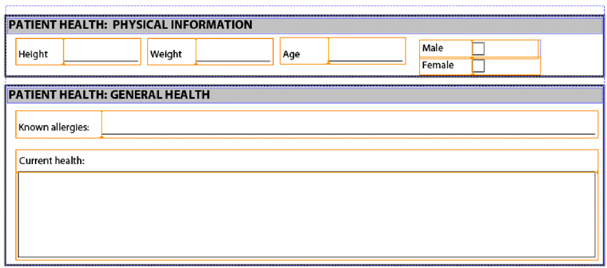

# Meerdere XDP-fragmenten samenstellen{#assembling-multiple-xdp-fragments}

U kunt meerdere XDP-fragmenten samenvoegen tot één XDP-document. Neem bijvoorbeeld XDP-fragmenten waarin elk XDP-bestand een of meer subformulieren bevat die worden gebruikt om een gezondheidsformulier te maken. In de volgende afbeelding ziet u de omtrekweergave (die staat voor het bestand tuc018_template_flowed.xdp dat in het *Meerdere XDP-fragmenten samenstellen* snel starten):


In de volgende afbeelding wordt de sectie Patiënt getoond (staat voor het bestand tuc018_contact.xdp dat in het dialoogvenster *Meerdere XDP-fragmenten samenstellen* snel starten):


In de volgende afbeelding wordt de sectie over de gezondheid van de patiënt getoond (staat voor het bestand tuc018_patiënt.xdp dat in het bestand *Meerdere XDP-fragmenten samenstellen* snel starten):



Dit fragment bevat twee subformulieren met de naam *subPatientphysical* en *subPatientHealth*. Beide subformulieren worden vermeld in het DDX-document dat wordt doorgegeven aan de Assembler-service. Met de Assembler-service kunt u al deze XDP-fragmenten combineren in één XDP-document, zoals in de volgende afbeelding wordt getoond.


In het volgende DDX-document worden meerdere XDP-fragmenten samengevoegd in een XDP-document.

```xml
 <?xml version="1.0" encoding="UTF-8"?>
 <DDX xmlns="https://ns.adobe.com/DDX/1.0/">
         <XDP result="tuc018result.xdp">
            <XDP source="tuc018_template_flowed.xdp">
             <XDPContent insertionPoint="ddx_fragment" source="tuc018_contact.xdp" fragment="subPatientContact" required="false"/>
               <XDPContent insertionPoint="ddx_fragment" source="tuc018_patient.xdp" fragment="subPatientPhysical" required="false"/>
               <XDPContent insertionPoint="ddx_fragment" source="tuc018_patient.xdp" fragment="subPatientHealth" required="false"/>
            </XDP>
         </XDP>
 </DDX>
```

Het DDX-document bevat een XDP `result` -tag die de naam van het resultaat aangeeft. In deze situatie is de waarde `tuc018result.xdp`. Naar deze waarde wordt verwezen in de toepassingslogica die wordt gebruikt om het XDP-document op te halen nadat de Assembler-service het resultaat heeft geretourneerd. Neem bijvoorbeeld de volgende Java-toepassingslogica die wordt gebruikt om het geassembleerde XDP-document op te halen (de waarde is vet):

```java
 //Iterate through the map object to retrieve the result XDP document
 for (Iterator i = allDocs.entrySet().iterator(); i.hasNext();) {
     // Retrieve the Map object’s value
     Map.Entry e = (Map.Entry)i.next();
     //Get the key name as specified in the
     //DDX document
     String keyName = (String)e.getKey();
     if (keyName.equalsIgnoreCase("tuc018result.xdp"))
                 {
         Object o = e.getValue();
         outDoc = (Document)o;
         //Save the result PDF file
         File myOutFile = new File("C:\\AssemblerResultXDP.xdp");
         outDoc.copyToFile(myOutFile);
     }
 }
```

De `XDP source` -tag geeft het XDP-bestand aan dat een volledig XDP-document vertegenwoordigt dat kan worden gebruikt als container voor het toevoegen van XDP-fragmenten of als een van de verschillende documenten die op volgorde worden toegevoegd. In deze situatie wordt het XDP-document alleen als container gebruikt (de eerste illustratie die wordt getoond in *Meerdere XDP-fragmenten samenstellen*). De andere XDP-bestanden worden dus in de XDP-container geplaatst.

Voor elk subformulier kunt u een `XDPContent` element (dit element is optioneel). In het bovenstaande voorbeeld zijn er drie subformulieren: `subPatientContact`, `subPatientPhysical`, en `subPatientHealth`. Beide `subPatientPhysical` het subformulier en de `subPatientHealth` subformulier bevindt zich in hetzelfde XDP-bestand, tuc018_patiënt.xdp. Het fragmentelement geeft de naam van het subformulier op, zoals gedefinieerd in Designer.

>[!NOTE]
>
>Voor meer informatie over de dienst van de Assembler, zie [Services Reference for AEM Forms](https://www.adobe.com/go/learn_aemforms_services_63).

>[!NOTE]
>
>Voor meer informatie over een DDX-document raadpleegt u [De Verwijzing van de AssemblerDienst en DDX](https://www.adobe.com/go/learn_aemforms_ddx_63).

## Overzicht van de stappen {#summary-of-steps}

Voer de volgende taken uit om meerdere XDP-fragmenten samen te stellen:

1. Inclusief projectbestanden.
1. Maak een PDF Assembler-client.
1. Verwijs naar een bestaand DDX-document.
1. Verwijs naar de XDP-documenten.
1. Stel runtime-opties in.
1. Stel de meerdere XDP-documenten samen.
1. Haal het samengevoegde XDP-document op.

**Projectbestanden opnemen**

Neem de benodigde bestanden op in uw ontwikkelingsproject. Als u een clienttoepassing maakt met Java, neemt u de benodigde JAR-bestanden op. Als u webservices gebruikt, dient u de proxybestanden op te nemen.

De volgende JAR-bestanden moeten worden toegevoegd aan het klassepad van uw project:

* adobe-livecycle-client.jar
* adobe-usermanager-client.jar
* adobe-assembler-client.jar
* adobe-utilities.jar (vereist als AEM Forms wordt geïmplementeerd op JBoss)
* jbossall-client.jar (vereist als AEM Forms wordt geïmplementeerd op JBoss)

**Een PDF Assembler-client maken**

Alvorens u programmatically een verrichting van de Assembler kunt uitvoeren, creeer een de dienstcliënt van de Assembler.

**Verwijzen naar een bestaand DDX-document**

Er moet naar een DDX-document worden verwezen om meerdere XDP-documenten samen te stellen. Dit DDX-document moet `XDP result`, `XDP source`, en `XDPContent` elementen.

**Verwijzen naar de XDP-documenten**

Als u meerdere XDP-documenten wilt samenstellen, verwijst u naar alle XDP-bestanden die worden gebruikt om het resultaat-XDP-document samen te stellen. Controleer of de naam van het subformulier in het XDP-document waarnaar wordt verwezen door de `source` kenmerk wordt opgegeven in het dialoogvenster `fragment` kenmerk. Een subformulier wordt gedefinieerd in Designer. Neem bijvoorbeeld de volgende XML.

```xml
 <XDPContent insertionPoint="ddx_fragment" source="tuc018_contact.xdp" fragment="subPatientContact" required="false"/>
```

Het subformulier genaamd *subPatientContact* moet in het XDP-bestand met de naam *tuc018_contact.xdp*.

**Uitvoeringsopties instellen**

U kunt runtime opties plaatsen die het gedrag van de dienst van de Assembler controleren terwijl het een baan uitvoert. U kunt bijvoorbeeld een optie instellen die de Assembler-service de opdracht geeft door te gaan met het verwerken van een taak als er een fout optreedt.

**Meerdere XDP-documenten samenstellen**

Als u meerdere XDP-bestanden wilt samenstellen, roept u de `invokeDDX` -bewerking. De dienst van de Assembler keert het geassembleerde XDP document binnen een inzamelingsvoorwerp terug.

**Het samengevoegde XDP-document ophalen**

Een samengesteld XDP-document wordt geretourneerd binnen een verzamelingsobject. Doorloop het verzamelingsobject en sla het XDP-document op als een XDP-bestand. U kunt het XDP-document ook doorgeven aan een andere AEM Forms-service, zoals Output.

**Zie ook**

[Meerdere XDP-fragmenten samenstellen met de Java API](assembling-multiple-xdp-fragments.md#assemble-multiple-xdp-fragments-using-the-java-api)

[Meerdere XDP-fragmenten samenstellen met de webservice-API](assembling-multiple-xdp-fragments.md#assemble-multiple-xdp-fragments-using-the-web-service-api)

[Inclusief AEM Forms Java-bibliotheekbestanden](/help/forms/developing/invoking-aem-forms-using-java.md#including-aem-forms-java-library-files)

[Verbindingseigenschappen instellen](/help/forms/developing/invoking-aem-forms-using-java.md#setting-connection-properties)

[PDF-documenten programmatisch samenstellen](/help/forms/developing/programmatically-assembling-pdf-documents.md#programmatically-assembling-pdf-documents)

[PDF-documenten maken met behulp van fragmenten](/help/forms/developing/creating-document-output-streams.md#creating-pdf-documents-using-fragments)

## Meerdere XDP-fragmenten samenstellen met de Java API {#assemble-multiple-xdp-fragments-using-the-java-api}

U kunt meerdere XDP-fragmenten samenstellen met behulp van de API (Java) voor vergaderingsservice:

1. Inclusief projectbestanden.

   Neem client-JAR-bestanden, zoals adobe-assembler-client.jar, op in het klassenpad van uw Java-project.

1. Maak een PDF Assembler-client.

   * Een `ServiceClientFactory` object dat verbindingseigenschappen bevat.
   * Een `AssemblerServiceClient` object door de constructor ervan te gebruiken en de `ServiceClientFactory` object.

1. Verwijs naar een bestaand DDX-document.

   * Een `java.io.FileInputStream` een object dat het DDX-document vertegenwoordigt door de constructor ervan te gebruiken en een tekenreekswaarde door te geven die de locatie van het DDX-bestand aangeeft.
   * Een `com.adobe.idp.Document` object door de constructor ervan te gebruiken en de `java.io.FileInputStream` object.

1. Verwijs naar de XDP-documenten.

   * Een `java.util.Map` object dat wordt gebruikt om invoer-XDP-documenten op te slaan met een `HashMap` constructor.
   * Een `com.adobe.idp.Document` en geeft het `java.io.FileInputStream` -object dat het invoer-XDP-bestand bevat (deze taak voor elk XDP-bestand herhalen).
   * Een item toevoegen aan de `java.util.Map` object aanroepen `put` en het doorgeven van de volgende argumenten:

      * Een tekenreekswaarde die de sleutelnaam vertegenwoordigt. Deze waarde moet overeenkomen met `source` elementwaarde opgegeven in het DDX-document (deze taak herhalen voor elk XDP-bestand).
      * A `com.adobe.idp.Document` object dat het XDP-document bevat dat overeenkomt met het `source` -element (deze taak voor elk XDP-bestand herhalen).

1. Stel de runtime-opties in.

   * Een `AssemblerOptionSpec` object dat uitvoeringsopties opslaat met de constructor ervan.
   * Stel runtime-opties in om aan uw bedrijfsvereisten te voldoen door een methode aan te roepen die tot de `AssemblerOptionSpec` object. Bijvoorbeeld, om de dienst van de Assembler op te dragen om een baan te blijven verwerken wanneer een fout voorkomt, haalt het `AssemblerOptionSpec` object `setFailOnError` methode en doorgeven `false`.

1. Stel de meerdere XDP-documenten samen.

   De `AssemblerServiceClient` object `invokeDDX` en geeft de volgende vereiste waarden door:

   * A `com.adobe.idp.Document` object dat staat voor het te gebruiken DDX-document
   * A `java.util.Map` object dat de invoer-XDP-bestanden bevat
   * A `com.adobe.livecycle.assembler.client.AssemblerOptionSpec` object dat de runtime-opties opgeeft, inclusief het standaardfont en het taaklogniveau

   De `invokeDDX` methode retourneert een `com.adobe.livecycle.assembler.client.AssemblerResult` object dat het geassembleerde XDP-document bevat.

1. Haal het samengevoegde XDP-document op.

   Voer de volgende handelingen uit om het samengevoegde XDP-document te verkrijgen:

   * De `AssemblerResult` object `getDocuments` methode. Deze methode retourneert een `java.util.Map` object.
   * Doorlopen `java.util.Map` object tot u het resultaat hebt gevonden `com.adobe.idp.Document` object.
   * De `com.adobe.idp.Document` object `copyToFile` methode voor het extraheren van het samengevoegde XDP-document.

**Zie ook**

[Meerdere XDP-fragmenten samenstellen](assembling-multiple-xdp-fragments.md#assembling-multiple-xdp-fragments)
[Snel starten (SOAP modus): meerdere XDP-fragmenten samenstellen met de Java API](/help/forms/developing/assembler-service-java-api-quick.md#quick-start-soap-mode-assembling-multiple-xdp-fragments-using-the-java-api)
[Inclusief AEM Forms Java-bibliotheekbestanden](/help/forms/developing/invoking-aem-forms-using-java.md#including-aem-forms-java-library-files)
[Verbindingseigenschappen instellen](/help/forms/developing/invoking-aem-forms-using-java.md#setting-connection-properties)

## Meerdere XDP-fragmenten samenstellen met de webservice-API {#assemble-multiple-xdp-fragments-using-the-web-service-api}

U kunt meerdere XDP-fragmenten samenstellen met behulp van de API (webservice) van de Assembler Service:

1. Inclusief projectbestanden.

   Creeer een Microsoft .NET project dat MTOM gebruikt. Zorg ervoor dat u de volgende definitie van WSDL gebruikt wanneer het plaatsen van een de dienstverwijzing:

   ```java
    https://localhost:8080/soap/services/AssemblerService?WSDL&lc_version=9.0.1.
   ```

   >[!NOTE]
   >
   >Vervangen `localhost` met het IP-adres van de server die als host fungeert voor AEM Forms.

1. Maak een PDF Assembler-client.

   * Een `AssemblerServiceClient` object met de standaardconstructor.
   * Een `AssemblerServiceClient.Endpoint.Address` object door het `System.ServiceModel.EndpointAddress` constructor. Geef een tekenreekswaarde door die de WSDL opgeeft voor de AEM Forms-service, zoals `https://localhost:8080/soap/services/AssemblerService?blob=mtom`). U hoeft de `lc_version` kenmerk. Dit kenmerk wordt gebruikt wanneer u een serviceverwijzing maakt.
   * Een `System.ServiceModel.BasicHttpBinding` object door de waarde van het object op te halen `AssemblerServiceClient.Endpoint.Binding` veld. De geretourneerde waarde omzetten in `BasicHttpBinding`.
   * Stel de `System.ServiceModel.BasicHttpBinding` object `MessageEncoding` veld naar `WSMessageEncoding.Mtom`. Deze waarde zorgt ervoor dat MTOM wordt gebruikt.
   * Laat basisauthentificatie van HTTP door de volgende taken uit te voeren toe:

      * Wijs de gebruikersnaam voor AEM formulieren toe aan de `AssemblerServiceClient.ClientCredentials.UserName.UserName` veld.
      * Wijs de overeenkomstige wachtwoordwaarde aan toe `AssemblerServiceClient.ClientCredentials.UserName.Password`veld.
      * Wijs het `HttpClientCredentialType.Basic` constante waarde voor de `BasicHttpBindingSecurity.Transport.ClientCredentialType`veld.
      * Wijs het `BasicHttpSecurityMode.TransportCredentialOnly` constante waarde voor de `BasicHttpBindingSecurity.Security.Mode`veld.

1. Verwijs naar een bestaand DDX-document.

   * Een `BLOB` object met behulp van de constructor. De `BLOB` wordt gebruikt om het DDX-document op te slaan.
   * Een `System.IO.FileStream` door de constructor aan te roepen en een tekenreekswaarde door te geven die de bestandslocatie van het DDX-document en de modus waarin het bestand moet worden geopend, vertegenwoordigt.
   * Maak een bytearray waarin de inhoud van de `System.IO.FileStream` object. U kunt de grootte van de bytearray bepalen door de `System.IO.FileStream` object `Length` eigenschap.
   * De bytearray vullen met streamgegevens door de `System.IO.FileStream` object `Read` methode. Geef de bytearray, de startpositie en de streamlengte door om te lezen.
   * Vul de `BLOB` object door het toe te wijzen `MTOM` eigenschap met de inhoud van de bytearray.

1. Verwijs naar de XDP-documenten.

   * Maak voor elk invoer-XDP-bestand een `BLOB` object met behulp van de constructor. De `BLOB` wordt gebruikt om het invoerbestand op te slaan.
   * Een `System.IO.FileStream` door de constructor aan te roepen en een tekenreekswaarde door te geven die de bestandslocatie van het invoerbestand en de modus waarin het bestand moet worden geopend, vertegenwoordigt.
   * Maak een bytearray waarin de inhoud van de `System.IO.FileStream` object. U kunt de grootte van de bytearray bepalen door de `System.IO.FileStream` object `Length` eigenschap.
   * De bytearray vullen met streamgegevens door de `System.IO.FileStream` object `Read` methode. Geef de bytearray, de startpositie en de streamlengte door om te lezen.
   * Vul de `BLOB` object door het toe te wijzen `MTOM` veld met de inhoud van de bytearray.
   * Een `MyMapOf_xsd_string_To_xsd_anyType` object. Dit verzamelingsobject wordt gebruikt voor het opslaan van invoerbestanden die nodig zijn om een samengesteld XDP-document te maken.
   * Maak voor elk invoerbestand een `MyMapOf_xsd_string_To_xsd_anyType_Item` object.
   * Wijs een tekenreekswaarde toe die de sleutelnaam vertegenwoordigt aan de `MyMapOf_xsd_string_To_xsd_anyType_Item` object `key` veld. Deze waarde moet overeenkomen met de waarde van het element dat is opgegeven in het DDX-document. (Voer deze taak uit voor elk invoer-XDP-bestand.)
   * Wijs het `BLOB` object dat het invoerbestand in het `MyMapOf_xsd_string_To_xsd_anyType_Item` object `value` veld. (Voer deze taak uit voor elk invoer-XDP-bestand.)
   * Voeg de `MyMapOf_xsd_string_To_xsd_anyType_Item` aan `MyMapOf_xsd_string_To_xsd_anyType` object. De `MyMapOf_xsd_string_To_xsd_anyType` object `Add` en geeft de `MyMapOf_xsd_string_To_xsd_anyType` object. (Voer deze taak uit voor elk invoer-XDP-document.)

1. Stel runtime-opties in.

   * Een `AssemblerOptionSpec` object dat uitvoeringsopties opslaat met de constructor ervan.
   * Stel runtime-opties in om aan uw bedrijfsvereisten te voldoen door een waarde toe te wijzen aan een gegevenslid dat tot de `AssemblerOptionSpec` object. Bijvoorbeeld, om de dienst van de Assembler op te dragen om een baan te blijven verwerken wanneer een fout voorkomt, wijs toe `false` aan de `AssemblerOptionSpec` object `failOnError` lid.

1. Stel de meerdere XDP-documenten samen.

   De `AssemblerServiceClient` object `invokeDDX` en geeft de volgende waarden door:

   * A `BLOB` object dat staat voor het DDX-document
   * De `MyMapOf_xsd_string_To_xsd_anyType` object dat de vereiste bestanden bevat
   * An `AssemblerOptionSpec` object dat uitvoeringsopties opgeeft

   De `invokeDDX` methode retourneert een `AssemblerResult` object dat de resultaten van de taak en eventuele uitzonderingen bevat die zijn opgetreden.

1. Haal het samengevoegde XDP-document op.

   Voer de volgende handelingen uit om het nieuwe XDP-document te verkrijgen:

   * Toegang krijgen tot de `AssemblerResult` object `documents` veld, dat een `Map` -object dat de resulterende PDF-documenten bevat.
   * Doorlopen `Map` om elk resulterend document te verkrijgen. Dan, giet dat serielid `value` een `BLOB`.
   * Extraheer de binaire gegevens die het document van de PDF door tot zijn toegang te hebben vertegenwoordigen `BLOB` object `MTOM` eigenschap. Hiermee wordt een array met bytes geretourneerd die u naar een XDP-bestand kunt schrijven.

**Zie ook**

[Meerdere XDP-fragmenten samenstellen](assembling-multiple-xdp-fragments.md#assembling-multiple-xdp-fragments)
[AEM Forms aanroepen met MTOM](/help/forms/developing/invoking-aem-forms-using-web.md#invoking-aem-forms-using-mtom)
