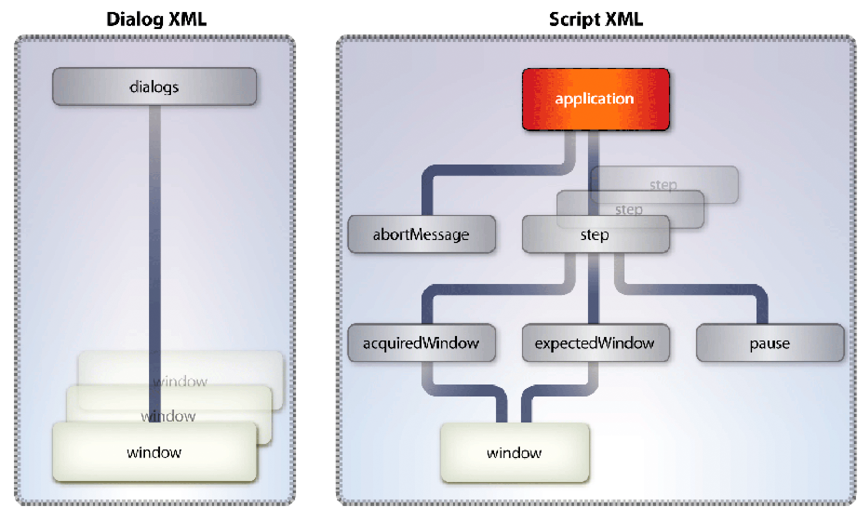

# Bestandsindelingen omzetten in PDF {#converting-between-file-formatsand-pdf}

**de Steekproeven en de voorbeelden in dit document zijn slechts voor AEM Forms op milieu JEE.**

**Ongeveer de Generate Dienst van PDF**

Met de service PDF genereren worden native bestandsindelingen geconverteerd naar PDF. Het zet ook PDF in andere dossierformaten om en optimaliseert de grootte van PDF documenten.

De service PDF genereren gebruikt native toepassingen om de volgende bestandsindelingen om te zetten in PDF. Tenzij anders aangegeven, worden alleen de Duitse, Franse, Engelse en Japanse versies van deze toepassingen ondersteund. *Vensters slechts* wijst op steun voor slechts Vensters Server® 2003 en de Server 2008 van Vensters.

* Microsoft Office 2003 en 2007 voor de conversie van DOC, DOCX, RTF, TXT, XLS, XLSX, PPT, PPTX, VSD, MPP, MPPX, XPS en PUB (alleen Windows)

>[!NOTE]
>
>Acrobat® 9.2 of hoger is vereist om de Microsoft XPS-indeling om te zetten in PDF.

* Autodesk AutoCAD 2005, 2006, 2007, 2008 en 2009 om DWF, DWG en DXW om te zetten (alleen in het Engels)
* Corel WordPerfect 12 en X4 voor conversie van WPD, QPW, SHW (alleen in het Engels)
* OpenOffice 2.0, 2.4, 3.0.1 en 3.1 voor het converteren van ODT, ODS, ODP, ODF, ODF, SXW, SXC, SXD, DOC, DOCX, RTF, TXT, XLS, XLSX, PPT, PPTX, VSD, MPP, MPPX en PUB

>[!NOTE]
>
>De dienst Generate PDF steunt niet de versies met 64 bits van OpenOffice.

* Adobe Photoshop® CS2 voor conversie van PSD (alleen Windows)

>[!NOTE]
>
>Photoshop CS3 en CS4 worden niet ondersteund omdat ze Windows Server 2003 of Windows Server 2008 niet ondersteunen.

* Adobe FrameMaker® 7.2 en 8 voor conversie van FM (alleen Windows)
* Adobe PageMaker® 7.0 om PMD, PM6, P65, en PM (Vensters slechts) om te zetten
* Native indelingen die worden ondersteund door toepassingen van derden (hiervoor moet specifieke instellingsbestanden voor de toepassing worden ontwikkeld) (alleen Windows)

Met de service PDF genereren zet u de volgende op standaarden gebaseerde bestandsindelingen om in PDF.

* Video-indelingen: SWF, FLV (alleen Windows)
* Afbeeldingsindelingen: JPEG, JPG, JP2, J2Kí, JPC, J2C, GIF, BMP, TIFF, TIF, PNG, JPF
* HTML (Windows, Sun™ Solaris™ en Linux®)

Met de service PDF genereren wordt PDF omgezet in de volgende bestandsindelingen (alleen Windows):

* Encapsulated PostScript (EPS)
* HTML 3.2
* HTML 4.01 met CSS 1.0
* DOC (Microsoft Word-indeling)
* RTF
* Tekst (zowel toegankelijk als onbewerkt)
* XML
* PDF/A-1a die alleen de DeviceRGB-kleurruimte gebruikt
* PDF/A-1b die alleen de DeviceRGB-kleurruimte gebruikt

De dienst Generate PDF vereist dat u deze administratieve taken uitvoert:

* De vereiste native toepassingen installeren op de computer die als host fungeert voor AEM Forms
* Installeer Adobe Acrobat Professional of Acrobat Pro Extended 9.2 op de computer die als host fungeert voor AEM Forms
* Instellingstaken na de installatie uitvoeren

Deze taken worden beschreven in AEM installeren en implementeren met JBoss Turnkey.

U kunt deze taken verwezenlijken gebruikend de Generate dienst van de PDF:

* Converteren van eigen bestandsindelingen naar PDF.
* HTML-documenten converteren naar PDF-documenten.
* PDF-documenten converteren naar bestandsindelingen.

>[!NOTE]
>
>Voor meer informatie over de Generate dienst van de PDF, zie [ Verwijzing van de Diensten voor AEM Forms ](https://www.adobe.com/go/learn_aemforms_services_63).

## Word-documenten converteren naar PDF-documenten {#converting-word-documents-to-pdf-documents}

In deze sectie wordt beschreven hoe u met de API PDF genereren een Microsoft Word-document programmatisch kunt converteren naar een PDF-document.

>[!NOTE]
>
>Voor meer informatie over extra dossierformaten, zie [ Toevoegend Steun voor de Extra Inheemse Formaten van het Dossier ](converting-file-formats-pdf.md#adding-support-for-additional-native-file-formats).

>[!NOTE]
>
>Voor meer informatie over de Generate dienst van de PDF, zie [ Verwijzing van de Diensten voor AEM Forms ](https://www.adobe.com/go/learn_aemforms_services_63).

### Overzicht van de stappen {#summary-of-steps}

Als u een Microsoft Word-document wilt converteren naar een PDF-document, voert u de volgende taken uit:

1. Inclusief projectbestanden.
1. Maak een Generate PDF client.
1. Haal het bestand op dat u wilt converteren naar een PDF-document.
1. Zet het bestand om in een PDF-document.
1. Haal de resultaten op.

**omvat projectdossiers**

Neem de benodigde bestanden op in uw ontwikkelingsproject. Als u een clienttoepassing maakt met Java, neemt u de benodigde JAR-bestanden op. Als u webservices gebruikt, dient u de proxybestanden op te nemen.

**creeer een Generate cliënt van PDF**

Alvorens u kunt programmatically uitvoeren PDF verrichting, creeer een Generate de dienstcliënt van de PDF. Maak een `GeneratePdfServiceClient` -object als u de Java API gebruikt. Maak een `GeneratePDFServiceService` -object als u de webservice-API gebruikt.

**wint het dossier terug om in een document van PDF om te zetten**

Haal het Microsoft Word-document op dat u wilt converteren naar een PDF-document.

**zet het dossier in een document van PDF** om

Nadat u de Generate de dienstcliënt van de PDF creeert, kunt u de `createPDF2` methode aanhalen. Deze methode heeft informatie nodig over het document dat moet worden geconverteerd, inclusief de bestandsextensie.

**wint de resultaten** terug

Nadat het bestand is geconverteerd naar een PDF-document, kunt u de resultaten ophalen. Nadat u bijvoorbeeld een Word-bestand naar een PDF-document hebt geconverteerd, kunt u het PDF-document ophalen en opslaan.

**zie ook**

[Word-documenten converteren naar PDF-documenten met de Java API](converting-file-formats-pdf.md#convert-word-documents-to-pdf-documents-using-the-java-api)

[Word-documenten converteren naar PDF-documenten met de API voor webservices](converting-file-formats-pdf.md#convert-word-documents-to-pdf-documents-using-the-web-service-api)

[Inclusief AEM Forms Java-bibliotheekbestanden](/help/forms/developing/invoking-aem-forms-using-java.md#including-aem-forms-java-library-files)

[Verbindingseigenschappen instellen](/help/forms/developing/invoking-aem-forms-using-java.md#setting-connection-properties)

[Snel aan de slag met PDF Service API](/help/forms/developing/generate-pdf-service-java-api.md#generate-pdf-service-java-api-quick-start-soap)

### Word-documenten converteren naar PDF-documenten met de Java API {#convert-word-documents-to-pdf-documents-using-the-java-api}

Converteer een Microsoft Word-document naar een PDF-document met de Generate PDF API (Java):

1. Inclusief projectbestanden.

   Neem client-JAR-bestanden, zoals adobe-generatepdf-client.jar, op in het klassenpad van uw Java-project.

1. Maak een Generate PDF client.

   * Maak een `ServiceClientFactory` -object dat verbindingseigenschappen bevat.
   * Maak een `GeneratePdfServiceClient` -object door de constructor ervan te gebruiken en het `ServiceClientFactory` -object door te geven.

1. Haal het bestand op dat u wilt converteren naar een PDF-document.

   * Maak een `java.io.FileInputStream` -object dat het Word-bestand vertegenwoordigt dat u wilt converteren met de constructor ervan. Geef een tekenreekswaarde door die de bestandslocatie opgeeft.
   * Maak een `com.adobe.idp.Document` -object door de constructor ervan te gebruiken en het `java.io.FileInputStream` -object door te geven.

1. Zet het bestand om in een PDF-document.

   Zet het bestand om in een PDF-document door de methode `createPDF2` van het object `GeneratePdfServiceClient` aan te roepen en de volgende waarden door te geven:

   * Een `com.adobe.idp.Document` -object dat het bestand vertegenwoordigt dat moet worden omgezet.
   * Een `java.lang.String` -object dat de bestandsextensie bevat.
   * Een `java.lang.String` -object dat de bestandstypen bevat die in de conversie moeten worden gebruikt. Instellingen voor bestandstypen bieden conversie-instellingen voor verschillende bestandstypen, zoals .doc of .xls.
   * Een `java.lang.String` -object dat de naam bevat van de PDF-instellingen die moeten worden gebruikt. U kunt bijvoorbeeld `Standard` opgeven.
   * Een `java.lang.String` -object dat de naam bevat van de beveiligingsinstellingen die moeten worden gebruikt.
   * Een optioneel `com.adobe.idp.Document` -object dat de instellingen bevat die moeten worden toegepast tijdens het genereren van het PDF-document.
   * Een optioneel `com.adobe.idp.Document` -object dat metagegevens bevat die op het PDF-document moeten worden toegepast.

   De methode `createPDF2` retourneert een `CreatePDFResult` -object dat het nieuwe PDF-document en logboekgegevens bevat. Het logbestand bevat doorgaans fout- of waarschuwingsberichten die worden gegenereerd door de conversieaanvraag.

1. Haal de resultaten op.

   Voer de volgende handelingen uit om het PDF-document te verkrijgen:

   * Roep de methode `getCreatedDocument` van het object `CreatePDFResult` aan, die een object `com.adobe.idp.Document` retourneert.
   * Roep de methode `copyToFile` van het object `com.adobe.idp.Document` aan om het PDF-document te extraheren uit het object dat in de vorige stap is gemaakt.

   Als u de methode `createPDF2` hebt gebruikt om het logdocument te verkrijgen (niet van toepassing op HTML-conversies), voert u de volgende handelingen uit:

   * Roep de methode `getLogDocument` van het object `CreatePDFResult` aan. Hiermee wordt een `com.adobe.idp.Document` -object geretourneerd.
   * Roep de methode `copyToFile` van het `com.adobe.idp.Document` -object aan om het logdocument te extraheren.

**zie ook**

[Overzicht van de stappen](converting-file-formats-pdf.md#summary-of-steps)

[Snel starten (SOAP modus): een Microsoft Word-document converteren naar een PDF-document met de Java API](/help/forms/developing/generate-pdf-service-java-api.md#quick-start-soap-mode-converting-a-microsoft-word-document-to-a-pdf-document-using-the-java-api)

[Inclusief AEM Forms Java-bibliotheekbestanden](/help/forms/developing/invoking-aem-forms-using-java.md#including-aem-forms-java-library-files)

[Verbindingseigenschappen instellen](/help/forms/developing/invoking-aem-forms-using-java.md#setting-connection-properties)

### Word-documenten converteren naar PDF-documenten met de API voor webservices {#convert-word-documents-to-pdf-documents-using-the-web-service-api}

Converteer een Microsoft Word-document naar een PDF-document met de Generate PDF API (webservice):

1. Inclusief projectbestanden.

   Creeer een Microsoft .NET project dat MTOM gebruikt. Gebruik de volgende WSDL-definitie: `http://localhost:8080/soap/services/GeneratePDFService?WSDL&lc_version=9.0.1` .

   >[!NOTE]
   >
   >Vervang `localhost` door het IP-adres van de server die als host fungeert voor AEM Forms.

1. Maak een Generate PDF client.

   * Maak een `GeneratePDFServiceClient` -object met de standaardconstructor.
   * Maak een `GeneratePDFServiceClient.Endpoint.Address` -object met de `System.ServiceModel.EndpointAddress` -constructor. Geef een tekenreekswaarde die de WSDL opgeeft door aan de AEM Forms-service (bijvoorbeeld `http://localhost:8080/soap/services/GeneratePDFService?blob=mtom` .) U hoeft het attribuut `lc_version` niet te gebruiken. Geef echter `?blob=mtom` op.
   * Maak een `System.ServiceModel.BasicHttpBinding` -object door de waarde van het `GeneratePDFServiceClient.Endpoint.Binding` -veld op te halen. De geretourneerde waarde wordt gecast naar `BasicHttpBinding` .
   * Stel het veld `MessageEncoding` van het `System.ServiceModel.BasicHttpBinding` -object in op `WSMessageEncoding.Mtom` . Deze waarde zorgt ervoor dat MTOM wordt gebruikt.
   * Laat basisauthentificatie van HTTP door de volgende taken uit te voeren toe:

      * Wijs de gebruikersnaam van het AEM aan het veld `GeneratePDFServiceClient.ClientCredentials.UserName.UserName` toe.
      * Wijs de bijbehorende wachtwoordwaarde toe aan het veld `GeneratePDFServiceClient.ClientCredentials.UserName.Password` .
      * Wijs de constante waarde `HttpClientCredentialType.Basic` toe aan het veld `BasicHttpBindingSecurity.Transport.ClientCredentialType` .
      * Wijs de constante waarde `BasicHttpSecurityMode.TransportCredentialOnly` toe aan het veld `BasicHttpBindingSecurity.Security.Mode` .

1. Haal het bestand op dat u wilt converteren naar een PDF-document.

   * Maak een `BLOB` -object met behulp van de constructor. Het `BLOB` -object wordt gebruikt om het bestand op te slaan dat u wilt converteren naar een PDF-document.
   * Maak een `System.IO.FileStream` -object door de constructor ervan aan te roepen. Geef een tekenreekswaarde door die de bestandslocatie vertegenwoordigt van het bestand dat moet worden omgezet en de modus waarin het bestand moet worden geopend.
   * Maak een bytearray waarin de inhoud van het object `System.IO.FileStream` wordt opgeslagen. U kunt de grootte van de bytearray bepalen door de eigenschap `Length` van het object `System.IO.FileStream` op te halen.
   * Vul de bytearray met streamgegevens door de methode `Read` van het object `System.IO.FileStream` aan te roepen en de bytearray, de startpositie en de lengte van de stream door te geven om te lezen.
   * Vul het object `BLOB` door de inhoud van de bytearray toe te wijzen aan de eigenschap `MTOM` .

1. Zet het bestand om in een PDF-document.

   Zet het bestand om in een PDF-document door de methode `CreatePDF2` van het object `GeneratePDFServiceService` aan te roepen en de volgende waarden door te geven:

   * Een `BLOB` -object dat het te converteren bestand vertegenwoordigt.
   * Een tekenreeks die de bestandsextensie bevat.
   * Een `java.lang.String` -object dat de bestandstypen bevat die in de conversie moeten worden gebruikt. Instellingen voor bestandstypen bieden conversie-instellingen voor verschillende bestandstypen, zoals .doc of .xls.
   * Een tekenreeksobject dat de PDF-instellingen bevat die moeten worden gebruikt. U kunt `Standard` opgeven.
   * Een tekenreeksobject dat de beveiligingsinstellingen bevat die moeten worden gebruikt. U kunt `No Security` opgeven.
   * Een optioneel `BLOB` -object dat de instellingen bevat die moeten worden toegepast tijdens het genereren van het PDF-document.
   * Een optioneel `BLOB` -object dat metagegevens bevat die op het PDF-document moeten worden toegepast.
   * Een uitvoerparameter van het type `BLOB` die wordt gevuld door de methode `CreatePDF2` . Met de methode `CreatePDF2` wordt dit object gevuld met het omgezette document. (Deze parameterwaarde is alleen vereist voor aanroepen van een webservice.)
   * Een uitvoerparameter van het type `BLOB` die wordt gevuld door de methode `CreatePDF2` . Met de methode `CreatePDF2` wordt dit object gevuld met het logdocument. (Deze parameterwaarde is alleen vereist voor aanroepen van een webservice.)

1. Haal de resultaten op.

   * Haal het omgezette PDF-document op door het veld `MTOM` van het `BLOB` -object aan een bytearray toe te wijzen. De bytearray vertegenwoordigt het omgezette PDF-document. Zorg ervoor dat u het object `BLOB` gebruikt als uitvoerparameter voor de methode `createPDF2` .
   * Maak een `System.IO.FileStream` -object door de constructor ervan aan te roepen en een tekenreekswaarde door te geven die de bestandslocatie van het omgezette PDF-document vertegenwoordigt.
   * Maak een `System.IO.BinaryWriter` -object door de constructor ervan aan te roepen en het `System.IO.FileStream` -object door te geven.
   * Schrijf de inhoud van de bytearray naar een PDF-bestand door de methode `Write` van het object `System.IO.BinaryWriter` aan te roepen en de bytearray door te geven.

**zie ook**

[Overzicht van de stappen](converting-file-formats-pdf.md#summary-of-steps)

[AEM Forms aanroepen met MTOM](/help/forms/developing/invoking-aem-forms-using-web.md#invoking-aem-forms-using-mtom)

[AEM Forms aanroepen met SwaRef](/help/forms/developing/invoking-aem-forms-using-web.md#invoking-aem-forms-using-swaref)

## HTML-documenten converteren naar PDF-documenten {#converting-html-documents-to-pdf-documents}

In deze sectie wordt beschreven hoe u de PDF API genereren kunt gebruiken om HTML-documenten programmatisch om te zetten in PDF-documenten.

>[!NOTE]
>
>Voor meer informatie over de Generate dienst van de PDF, zie [ Verwijzing van de Diensten voor AEM Forms ](https://www.adobe.com/go/learn_aemforms_services_63).

### Overzicht van de stappen {#summary_of_steps-1}

Als u een HTML-document wilt converteren naar een PDF-document, voert u de volgende taken uit:

1. Inclusief projectbestanden.
1. Maak een Generate PDF client.
1. Haal de HTML-inhoud op die u wilt converteren naar een PDF-document.
1. Zet de inhoud van de HTML om in een document van de PDF.
1. Haal de resultaten op.

**omvat projectdossiers**

Neem de benodigde bestanden op in uw ontwikkelingsproject. Als u een clienttoepassing maakt met Java, neemt u de benodigde JAR-bestanden op. Als u webservices gebruikt, dient u de proxybestanden op te nemen.

**creeer een Generate cliënt van PDF**

Alvorens u kunt programmatically uitvoeren PDF verrichting, moet u tot stand brengen PDF de dienstcliënt van de dienst produceert. Maak een `GeneratePdfServiceClient` -object als u de Java API gebruikt. Als u de webservice-API gebruikt, maakt u een `GeneratePDFServiceService` .

**wint de inhoud van de HTML terug om in een document van de PDF om te zetten**

Verwijs naar HTML-inhoud die u naar een PDF-document wilt converteren. U kunt verwijzen naar HTML-inhoud, zoals een HTML-bestand of HTML-inhoud die via een URL toegankelijk is.

**zet de inhoud van HTML in een document van PDF** om

Nadat u de de dienstcliënt creeert, kunt u de aangewezen verrichting van de PDF verwezenlijking aanhalen. Voor deze bewerking is informatie nodig over het document dat moet worden geconverteerd, inclusief het pad naar het doeldocument.

**wint de resultaten** terug

Nadat de inhoud van de HTML in een document van de PDF wordt omgezet, kunt u de resultaten terugwinnen en het document van de PDF bewaren.

**zie ook**

[Inhoud van HTML converteren naar een PDF-document met de Java API](converting-file-formats-pdf.md#convert-html-content-to-a-pdf-document-using-the-java-api)

[Inhoud van HTML converteren naar een PDF-document met de webservice-API](converting-file-formats-pdf.md#convert-html-content-to-a-pdf-document-using-the-web-service-api)

[Inclusief AEM Forms Java-bibliotheekbestanden](/help/forms/developing/invoking-aem-forms-using-java.md#including-aem-forms-java-library-files)

[Verbindingseigenschappen instellen](/help/forms/developing/invoking-aem-forms-using-java.md#setting-connection-properties)

[Snel aan de slag met PDF Service API](/help/forms/developing/generate-pdf-service-java-api.md#generate-pdf-service-java-api-quick-start-soap)

### Inhoud van HTML converteren naar een PDF-document met de Java API {#convert-html-content-to-a-pdf-document-using-the-java-api}

Een HTML-document converteren naar een PDF-document met behulp van de Generate PDF API (Java):

1. Inclusief projectbestanden.

   Neem client-JAR-bestanden, zoals adobe-generatepdf-client.jar, op in het klassenpad van uw Java-project.

1. Maak een Generate PDF client.

   Maak een `GeneratePdfServiceClient` -object door de constructor ervan te gebruiken en een `ServiceClientFactory` -object door te geven dat verbindingseigenschappen bevat.

1. Haal de HTML-inhoud op die u wilt converteren naar een PDF-document.

   Haal HTML-inhoud op door een tekenreeksvariabele te maken en een URL toe te wijzen die naar HTML-inhoud wijst.

1. Zet de inhoud van de HTML om in een document van de PDF.

   Roep de methode `htmlToPDF2` van het object `GeneratePdfServiceClient` aan en geef de volgende waarden door:

   * Een `java.lang.String` -object dat de URL bevat van het te converteren HTML-bestand.
   * Een `java.lang.String` -object dat de bestandstypen bevat die in de conversie moeten worden gebruikt. Instellingen voor bestandstypen kunnen spinningsniveaus bevatten.
   * Een `java.lang.String` -object dat de naam bevat van de beveiligingsinstellingen die moeten worden gebruikt.
   * Een optioneel `com.adobe.idp.Document` -object dat de instellingen bevat die moeten worden toegepast tijdens het genereren van het PDF-document. Als deze informatie niet wordt verstrekt, worden de montages automatisch gekozen gebaseerd op de vorige drie parameters.
   * Een optioneel `com.adobe.idp.Document` -object dat metagegevens bevat die op het PDF-document moeten worden toegepast.

1. Haal de resultaten op.

   De methode `htmlToPDF2` retourneert een `HtmlToPdfResult` -object dat het nieuwe PDF-document bevat dat is gegenereerd. Voer de volgende handelingen uit om het nieuwe PDF-document te verkrijgen:

   * Roep de methode `getCreatedDocument` van het object `HtmlToPdfResult` aan. Hiermee wordt een `com.adobe.idp.Document` -object geretourneerd.
   * Roep de methode `copyToFile` van het object `com.adobe.idp.Document` aan om het PDF-document te extraheren uit het object dat in de vorige stap is gemaakt.

**zie ook**

[HTML-documenten converteren naar PDF-documenten](converting-file-formats-pdf.md#converting-html-documents-to-pdf-documents)

[Snel starten (SOAP modus): HTML-inhoud converteren naar een PDF-document met de Java API](/help/forms/developing/generate-pdf-service-java-api.md#quick-start-soap-mode-converting-html-content-to-a-pdf-document-using-the-java-api)

[Snel starten (SOAP modus): HTML-inhoud converteren naar een PDF-document met de Java API](/help/forms/developing/generate-pdf-service-java-api.md#quick-start-soap-mode-converting-html-content-to-a-pdf-document-using-the-java-api)

[Inclusief AEM Forms Java-bibliotheekbestanden](/help/forms/developing/invoking-aem-forms-using-java.md#including-aem-forms-java-library-files)

[Verbindingseigenschappen instellen](/help/forms/developing/invoking-aem-forms-using-java.md#setting-connection-properties)

### Inhoud van HTML converteren naar een PDF-document met de webservice-API {#convert-html-content-to-a-pdf-document-using-the-web-service-api}

HTML-inhoud converteren naar een PDF-document met de Generate PDF API (webservice):

1. Inclusief projectbestanden.

   Creeer een Microsoft .NET project dat MTOM gebruikt. Gebruik de volgende WSDL-definitie: `http://localhost:8080/soap/services/GeneratePDFService?WSDL&lc_version=9.0.1` .

   >[!NOTE]
   >
   >Vervang `localhost` door het IP-adres van de server die als host fungeert voor AEM Forms.

1. Maak een Generate PDF client.

   * Maak een `GeneratePDFServiceClient` -object met de standaardconstructor.
   * Maak een `GeneratePDFServiceClient.Endpoint.Address` -object met de `System.ServiceModel.EndpointAddress` -constructor. Geef een tekenreekswaarde die de WSDL opgeeft door aan de AEM Forms-service (bijvoorbeeld `http://localhost:8080/soap/services/GeneratePDFService?blob=mtom` .) U hoeft het attribuut `lc_version` niet te gebruiken. Geef echter `?blob=mtom` op.
   * Maak een `System.ServiceModel.BasicHttpBinding` -object door de waarde van het `GeneratePDFServiceClient.Endpoint.Binding` -veld op te halen. De geretourneerde waarde wordt gecast naar `BasicHttpBinding` .
   * Stel het veld `MessageEncoding` van het `System.ServiceModel.BasicHttpBinding` -object in op `WSMessageEncoding.Mtom` . Deze waarde zorgt ervoor dat MTOM wordt gebruikt.
   * Laat basisauthentificatie van HTTP door de volgende taken uit te voeren toe:

      * Wijs de gebruikersnaam van het AEM aan het veld `GeneratePDFServiceClient.ClientCredentials.UserName.UserName` toe.
      * Wijs de bijbehorende wachtwoordwaarde toe aan het veld `GeneratePDFServiceClient.ClientCredentials.UserName.Password` .
      * Wijs de constante waarde `HttpClientCredentialType.Basic` toe aan het veld `BasicHttpBindingSecurity.Transport.ClientCredentialType` .
      * Wijs de constante waarde `BasicHttpSecurityMode.TransportCredentialOnly` toe aan het veld `BasicHttpBindingSecurity.Security.Mode` .

1. Haal de HTML-inhoud op die u wilt converteren naar een PDF-document.

   Haal HTML-inhoud op door een tekenreeksvariabele te maken en een URL toe te wijzen die naar HTML-inhoud wijst.

1. Zet de inhoud van de HTML om in een document van de PDF.

   Zet de HTML-inhoud om in een PDF-document door de methode `HtmlToPDF2` van het object `GeneratePDFServiceService` aan te roepen en geef de volgende waarden door:

   * Een tekenreeks die de HTML-inhoud bevat die moet worden omgezet.
   * Een `java.lang.String` -object dat de bestandstypen bevat die in de conversie moeten worden gebruikt.
   * Een tekenreeksobject dat de beveiligingsinstellingen bevat die moeten worden gebruikt.
   * Een optioneel `BLOB` -object dat de instellingen bevat die moeten worden toegepast tijdens het genereren van het PDF-document.
   * Een optioneel `BLOB` -object dat metagegevens bevat die op het PDF-document moeten worden toegepast.
   * Een uitvoerparameter van het type `BLOB` die wordt gevuld door de methode `CreatePDF2` . Met de methode `CreatePDF2` wordt dit object gevuld met het omgezette document. (Deze parameterwaarde is alleen vereist voor aanroepen van een webservice.)

1. Haal de resultaten op.

   * Haal het omgezette PDF-document op door het veld `MTOM` van het `BLOB` -object aan een bytearray toe te wijzen. De bytearray vertegenwoordigt het omgezette PDF-document. Zorg ervoor dat u het object `BLOB` gebruikt als uitvoerparameter voor de methode `HtmlToPDF2` .
   * Maak een `System.IO.FileStream` -object door de constructor ervan aan te roepen en een tekenreekswaarde door te geven die de bestandslocatie van het omgezette PDF-document vertegenwoordigt.
   * Maak een `System.IO.BinaryWriter` -object door de constructor ervan aan te roepen en het `System.IO.FileStream` -object door te geven.
   * Schrijf de inhoud van de bytearray naar een PDF-bestand door de methode `Write` van het object `System.IO.BinaryWriter` aan te roepen en de bytearray door te geven.

**zie ook**

[HTML-documenten converteren naar PDF-documenten](converting-file-formats-pdf.md#converting-html-documents-to-pdf-documents)

[AEM Forms aanroepen met MTOM](/help/forms/developing/invoking-aem-forms-using-web.md#invoking-aem-forms-using-mtom)

[AEM Forms aanroepen met SwaRef](/help/forms/developing/invoking-aem-forms-using-web.md#invoking-aem-forms-using-swaref)

## PDF-documenten omzetten in niet-afbeeldingsindelingen {#converting-pdf-documents-to-non-image-formats}

In deze sectie wordt beschreven hoe u met de API voor het genereren van PDF Java en de webservice een PDF-document programmatisch kunt converteren naar een RTF-bestand. Dit is een voorbeeld van een niet-afbeeldingsindeling. Andere indelingen dan afbeeldingen zijn HTML, tekst, DOC en EPS. Wanneer u een PDF-document converteert naar RTF, moet u ervoor zorgen dat het PDF-document geen formulierelementen bevat, zoals een verzendknop. Formulierelementen worden niet omgezet.

>[!NOTE]
>
>Voor meer informatie over de Generate dienst van de PDF, zie [ Verwijzing van de Diensten voor AEM Forms ](https://www.adobe.com/go/learn_aemforms_services_63).

### Overzicht van de stappen {#summary_of_steps-2}

Voer de volgende stappen uit om een PDF-document te converteren naar een van de ondersteunde typen:

1. Inclusief projectbestanden.
1. Maak een Generate PDF client.
1. Haal het PDF-document op dat u wilt converteren.
1. Zet het PDF-document om.
1. Sla het geconverteerde bestand op.

**omvat projectdossiers**

Neem de benodigde bestanden op in uw ontwikkelingsproject. Als u een clienttoepassing maakt met Java, neemt u de benodigde JAR-bestanden op. Als u webservices gebruikt, dient u de proxybestanden op te nemen.

**creeer een Generate cliënt van PDF**

Alvorens u kunt programmatically uitvoeren PDF verrichting, moet u tot stand brengen PDF de dienstcliënt van de dienst produceert. Maak een `GeneratePdfServiceClient` -object als u de Java API gebruikt. Maak een `GeneratePDFServiceService` -object als u de webservice-API gebruikt.

**wint het document van PDF terug om** om te zetten

Haal het PDF-document op dat u wilt omzetten in een andere indeling dan afbeeldingen.

**zet het document van PDF** om

Nadat u de de dienstcliënt creeert, kunt u de de uitvoerverrichting van de PDF aanhalen. Voor deze bewerking is informatie nodig over het document dat moet worden geconverteerd, inclusief het pad naar het doeldocument.

**sparen het omgezette dossier**

Sla het geconverteerde bestand op. Als u bijvoorbeeld een PDF-document converteert naar een RTF-bestand, slaat u het geconverteerde document op in een RTF-bestand.

**zie ook**

[Een PDF-document converteren naar een RTF-bestand met de Java API](converting-file-formats-pdf.md#convert-a-pdf-document-to-a-rtf-file-using-the-java-api)

[Een PDF-document converteren naar een RTF-bestand met de webservice-API](converting-file-formats-pdf.md#convert-a-pdf-document-to-a-rtf-file-using-the-web-service-api)

[Inclusief AEM Forms Java-bibliotheekbestanden](/help/forms/developing/invoking-aem-forms-using-java.md#including-aem-forms-java-library-files)

[Verbindingseigenschappen instellen](/help/forms/developing/invoking-aem-forms-using-java.md#setting-connection-properties)

[Snel aan de slag met PDF Service API](/help/forms/developing/generate-pdf-service-java-api.md#generate-pdf-service-java-api-quick-start-soap)

### Een PDF-document converteren naar een RTF-bestand met de Java API {#convert-a-pdf-document-to-a-rtf-file-using-the-java-api}

Een PDF-document converteren naar een RTF-bestand met behulp van de Generate PDF API (Java):

1. Inclusief projectbestanden.

   Neem client-JAR-bestanden, zoals adobe-generatepdf-client.jar, op in het klassenpad van uw Java-project.

1. Maak een Generate PDF client.

   Maak een `GeneratePdfServiceClient` -object door de constructor ervan te gebruiken en een `ServiceClientFactory` -object door te geven dat verbindingseigenschappen bevat.

1. Haal het PDF-document op dat u wilt converteren.

   * Maak een `java.io.FileInputStream` -object dat staat voor het PDF-document dat u wilt converteren met behulp van de constructor. Geef een tekenreekswaarde door die de locatie van het PDF-document aangeeft.
   * Maak een `com.adobe.idp.Document` -object door de constructor ervan te gebruiken en het `java.io.FileInputStream` -object door te geven.

1. Zet het PDF-document om.

   Roep de methode `exportPDF2` van het object `GeneratePdfServiceClient` aan en geef de volgende waarden door:

   * Een `com.adobe.idp.Document` -object dat het te converteren PDF-bestand vertegenwoordigt.
   * Een `java.lang.String` -object dat de naam bevat van het bestand dat moet worden omgezet.
   * Een `java.lang.String` -object dat de naam van de Adobe PDF-instellingen bevat.
   * Een `ConvertPDFFormatType` -object dat het bestandstype voor conversie opgeeft.
   * Een optioneel `com.adobe.idp.Document` -object dat de instellingen bevat die moeten worden toegepast tijdens het genereren van het PDF-document.

   De methode `exportPDF2` retourneert een `ExportPDFResult` -object dat het omgezette bestand bevat.

1. Zet het PDF-document om.

   Voer de volgende handelingen uit om het nieuwe bestand te verkrijgen:

   * Roep de methode `getConvertedDocument` van het object `ExportPDFResult` aan. Hiermee wordt een `com.adobe.idp.Document` -object geretourneerd.
   * Roep de methode `copyToFile` van het `com.adobe.idp.Document` -object aan om het nieuwe document te extraheren.

**zie ook**

[Overzicht van de stappen](converting-file-formats-pdf.md#summary-of-steps)

[Snel starten (SOAP modus): HTML-inhoud converteren naar een PDF-document met de Java API](/help/forms/developing/generate-pdf-service-java-api.md#quick-start-soap-mode-converting-html-content-to-a-pdf-document-using-the-java-api)

[Inclusief AEM Forms Java-bibliotheekbestanden](/help/forms/developing/invoking-aem-forms-using-java.md#including-aem-forms-java-library-files)

[Verbindingseigenschappen instellen](/help/forms/developing/invoking-aem-forms-using-java.md#setting-connection-properties)

### Een PDF-document converteren naar een RTF-bestand met de webservice-API {#convert-a-pdf-document-to-a-rtf-file-using-the-web-service-api}

Een PDF-document converteren naar een RTF-bestand met de Generate PDF API (webservice):

1. Inclusief projectbestanden.

   Creeer een Microsoft .NET project dat MTOM gebruikt. Gebruik de volgende WSDL-definitie: `http://localhost:8080/soap/services/GeneratePDFService?WSDL&lc_version=9.0.1` .

   >[!NOTE]
   >
   >Vervang `localhost` door het IP-adres van de server die als host fungeert voor AEM Forms.

1. Maak een Generate PDFf client.

   * Maak een `GeneratePDFServiceClient` -object met de standaardconstructor.
   * Maak een `GeneratePDFServiceClient.Endpoint.Address` -object met de `System.ServiceModel.EndpointAddress` -constructor. Geef een tekenreekswaarde die de WSDL opgeeft door aan de AEM Forms-service (bijvoorbeeld `http://localhost:8080/soap/services/GeneratePDFService?blob=mtom` .) U hoeft het attribuut `lc_version` niet te gebruiken. Geef echter `?blob=mtom` op.
   * Maak een `System.ServiceModel.BasicHttpBinding` -object door de waarde van het `GeneratePDFServiceClient.Endpoint.Binding` -veld op te halen. De geretourneerde waarde wordt gecast naar `BasicHttpBinding` .
   * Stel het veld `MessageEncoding` van het `System.ServiceModel.BasicHttpBinding` -object in op `WSMessageEncoding.Mtom` . Deze waarde zorgt ervoor dat MTOM wordt gebruikt.
   * Laat basisauthentificatie van HTTP door de volgende taken uit te voeren toe:

      * Wijs de gebruikersnaam van het AEM aan het veld `GeneratePDFServiceClient.ClientCredentials.UserName.UserName` toe.
      * Wijs de bijbehorende wachtwoordwaarde toe aan het veld `GeneratePDFServiceClient.ClientCredentials.UserName.Password` .
      * Wijs de constante waarde `HttpClientCredentialType.Basic` toe aan het veld `BasicHttpBindingSecurity.Transport.ClientCredentialType` .
      * Wijs de constante waarde `BasicHttpSecurityMode.TransportCredentialOnly` toe aan het veld `BasicHttpBindingSecurity.Security.Mode` .

1. Haal het PDF-document op dat u wilt converteren.

   * Maak een `BLOB` -object met behulp van de constructor. Met het `BLOB` -object wordt een geconverteerd PDF-document opgeslagen.
   * Maak een `System.IO.FileStream` -object door de constructor ervan aan te roepen en een tekenreekswaarde door te geven die de bestandslocatie van het PDF-document en de modus waarin het bestand moet worden geopend, vertegenwoordigt.
   * Maak een bytearray waarin de inhoud van het object `System.IO.FileStream` wordt opgeslagen. U kunt de grootte van de bytearray bepalen door de eigenschap `Length` van het object `System.IO.FileStream` op te halen.
   * Vul de bytearray met streamgegevens door de methode `Read` van het object `System.IO.FileStream` aan te roepen en de bytearray, de startpositie en de lengte van de stream door te geven om te lezen.
   * Vul het object `BLOB` door de inhoud van de bytearray toe te wijzen aan de eigenschap `MTOM` .

1. Zet het PDF-document om.

   Roep de methode `ExportPDF2` van het object `GeneratePDFServiceServiceWse` aan en geef de volgende waarden door:

   * Een `BLOB` -object dat het te converteren PDF-bestand vertegenwoordigt.
   * Een tekenreeks die de padnaam bevat van het bestand dat moet worden omgezet.
   * Een `java.lang.String` -object dat de bestandslocatie opgeeft.
   * Een tekenreeksobject dat het doelbestandstype voor de conversie opgeeft. Geef `RTF` op.
   * Een optioneel `BLOB` -object dat de instellingen bevat die moeten worden toegepast tijdens het genereren van het PDF-document.
   * Een uitvoerparameter van het type `BLOB` die wordt gevuld door de methode `ExportPDF2` . Met de methode `ExportPDF2` wordt dit object gevuld met het omgezette document. (Deze parameterwaarde is alleen vereist voor aanroepen van een webservice.)

1. Sla het geconverteerde bestand op.

   * Haal het omgezette RTF-document op door het veld `MTOM` van het `BLOB` -object aan een bytearray toe te wijzen. De bytearray vertegenwoordigt het omgezette RTF-document. Zorg ervoor dat u het object `BLOB` gebruikt als uitvoerparameter voor de methode `ExportPDF2` .
   * Maak een `System.IO.FileStream` -object door de constructor ervan aan te roepen. Geef een tekenreekswaarde door die de locatie van het RTF-bestand vertegenwoordigt.
   * Maak een `System.IO.BinaryWriter` -object door de constructor ervan aan te roepen en het `System.IO.FileStream` -object door te geven.
   * Schrijf de inhoud van de bytearray naar een RTF-bestand door de methode `Write` van het object `System.IO.BinaryWriter` aan te roepen en de bytearray door te geven.

**zie ook**

[Overzicht van de stappen](converting-file-formats-pdf.md#summary-of-steps)

[AEM Forms aanroepen met MTOM](/help/forms/developing/invoking-aem-forms-using-web.md#invoking-aem-forms-using-mtom)

[AEM Forms aanroepen met SwaRef](/help/forms/developing/invoking-aem-forms-using-web.md#invoking-aem-forms-using-swaref)

## Ondersteuning toevoegen voor extra eigen bestandsindelingen {#adding-support-for-additional-native-file-formats}

In deze sectie wordt uitgelegd hoe u ondersteuning voor extra eigen bestandsindelingen kunt toevoegen. Het verstrekt een overzicht van de interactie tussen de Generate dienst van PDF en de inheemse toepassingen die deze dienst gebruikt om inheemse dossierformaten in PDF om te zetten.

In dit gedeelte wordt ook het volgende uitgelegd:

* Hoe te om de reactie te wijzigen die de dienst van de PDF van de Generate aan de inheemse toepassingen verstrekt die dit product reeds gebruikt om inheemse dossierformaten in PDF om te zetten
* De interactie tussen de dienst Generate PDF, de Generate component van de de dienstToepassing van de PDF (AppMon), en inheemse toepassingen, zoals Microsoft Word
* De rollen die de grammen van XML in die interactie spelen

### Componentinteracties {#component-interactions}

Met de service PDF genereren worden eigen bestandsindelingen geconverteerd door de toepassing aan te roepen die is gekoppeld aan de bestandsindeling en vervolgens te communiceren met de toepassing om het document af te drukken met de standaardprinter. De standaardprinter moet zijn ingesteld als de Adobe PDF-printer.

In deze illustratie worden de componenten en stuurprogramma&#39;s weergegeven die bij de ondersteuning van native toepassingen betrokken zijn. Ook worden de XML-grammen genoemd die de interacties beïnvloeden.

Interacties van componenten voor conversie van native bestanden

Dit document gebruikt de term *inheemse toepassing* om op de toepassing te wijzen die wordt gebruikt om een inheems dossierformaat, zoals Microsoft Word te veroorzaken.

*AppMon* is een ondernemingscomponent die met een inheemse toepassing op dezelfde manier interactie heeft als een gebruiker door de dialoogdozen zou navigeren die door die toepassing worden voorgesteld. De grammars van XML die door AppMon worden gebruikt om een toepassing, zoals Microsoft Word, op te dragen om een dossier te openen en te drukken omvatten deze opeenvolgende taken:

1. Het bestand openen door Bestand > Openen te selecteren
1. Ervoor zorgen dat het dialoogvenster Openen wordt weergegeven; zo niet, de fout afhandelen
1. Bestandsnaam opgeven in het veld Bestandsnaam en vervolgens op de knop Openen klikken
1. Ervoor zorgen dat het bestand wordt geopend
1. Het dialoogvenster Afdrukken openen door Bestand > Afdrukken te selecteren
1. Het dialoogvenster Afdrukken wordt weergegeven

AppMon gebruikt standaard Win32 APIs om met derdetoepassingen in wisselwerking te staan om gebeurtenissen over te brengen UI zoals zeer belangrijke slagen en muisklikken, die nuttig is om deze toepassingen te controleren om PDF dossiers van hen te produceren.

Vanwege een beperking met deze Win32 APIs, kan AppMon deze gebeurtenissen UI aan sommige specifieke soorten vensters, zoals floating menu-bars (die in sommige toepassingen zoals TextPad worden gevonden), en bepaalde soorten dialogen niet verzenden de waarvan inhoud niet kan worden teruggewonnen gebruikend Win32 APIs.

Het is gemakkelijk om visueel een drijvende menubalk te identificeren; nochtans zou het niet mogelijk kunnen zijn om de speciale types van dialogen enkel door visuele inspectie te identificeren. U zou een derdetoepassing zoals Microsoft Spy++ (deel van het de ontwikkelomgeving van Microsoft Visuele C++) of zijn gelijkwaardige WinID (die vrij van kosten van [ https://www.dennisbabkin.com/php/download.php?what=WinID ](https://www.dennisbabkin.com/php/download.php?what=WinID) kan worden gedownload) vereisen om een dialoog te onderzoeken om te bepalen als AppMon met het zou kunnen in wisselwerking staan gebruikend standaardWin32 APIs.

Als WinID de dialooginhoud zoals tekst, subvensters, vensterklasse ID, etc. kan halen, dan zou AppMon het zelfde ook kunnen doen.

In deze tabel wordt het type informatie weergegeven dat wordt gebruikt bij het afdrukken van eigen bestandsindelingen.

<table>
 <thead>
  <tr>
   <th><p>Het type Informatie</p></th>
   <th><p>Beschrijving</p></th>
   <th><p>Items die verwant zijn aan native bestanden wijzigen/maken </p></th>
  </tr>
 </thead>
 <tbody>
  <tr>
   <td><p>Administratieve instellingen </p></td>
   <td><p>Bevat instellingen voor PDF, beveiliging en bestandstypen. </p><p>Instellingen voor bestandstypen koppelen bestandsextensies aan de corresponderende native toepassingen. Instellingen voor bestandstypen geven ook instellingen voor native toepassingen op die worden gebruikt om eigen bestanden af te drukken. </p></td>
   <td><p>Als u instellingen voor een reeds ondersteunde native toepassing wilt wijzigen, stelt de systeembeheerder de instellingen voor bestandstypen in de beheerconsole in. </p><p>Als u ondersteuning voor een nieuwe eigen bestandsindeling wilt toevoegen, moet u het bestand handmatig bewerken. (Zie <a href="converting-file-formats-pdf.md#adding-or-modifying-support-for-a-native-file-format"> Toevoegend of wijzigend steun voor een inheems dossierformaat </a>.) </p></td>
  </tr>
  <tr>
   <td><p>Script </p></td>
   <td><p>Geeft interacties op tussen de service PDF genereren en een native toepassing. Dergelijke interacties leiden de toepassing gewoonlijk om een dossier aan de bestuurder van Adobe PDF te drukken. </p><p>Het script bevat instructies die de oorspronkelijke toepassing de opdracht geven specifieke dialoogvensters te openen en die specifieke reacties bieden op velden en knoppen in die dialoogvensters. </p></td>
   <td><p>De service PDF genereren bevat scriptbestanden voor alle ondersteunde native toepassingen. U kunt deze bestanden wijzigen met een XML-bewerkingstoepassing.</p><p>Als u ondersteuning voor een nieuwe native toepassing wilt toevoegen, moet u een scriptbestand maken. (Zie <a href="converting-file-formats-pdf.md#creating-or-modifying-an-additional-dialog-xml-file-for-a-native-application"> Creërend of wijzigend een extra dossier van dialoogXML voor een inheemse toepassing </a>.) </p></td>
  </tr>
  <tr>
   <td><p>Instructies in het dialoogvenster Algemeen </p></td>
   <td><p>Hiermee geeft u op hoe moet worden gereageerd op dialoogvensters die in meerdere toepassingen worden gebruikt. Dergelijke dialoogvensters worden gegenereerd door besturingssystemen, helpertoepassingen (zoals PDFMaker) en stuurprogramma's. </p><p>Het bestand dat deze informatie bevat, is appmon.global.en_US.xml.</p></td>
   <td><p>Wijzig dit bestand niet. </p></td>
  </tr>
  <tr>
   <td><p>Instructies in het dialoogvenster Toepassingsspecifiek</p></td>
   <td><p>Geeft aan hoe moet worden gereageerd op toepassingsspecifieke dialoogvensters. </p><p>Het bestand dat deze informatie bevat, is appmon.<i>&grave;&grave;&grave;[appname]` </i>.dialog.<i>` ` [locale]`</i>.xml (bijvoorbeeld, appmon.word.en_US.xml).</p></td>
   <td><p>Wijzig dit bestand niet. </p><p>Om de instructies van de dialoogdoos voor een nieuwe inheemse toepassing toe te voegen, zie <a href="converting-file-formats-pdf.md#creating_or_modifying_an_additional_dialog_xml_file_for_a_native_application"> Creërend of wijzigend een extra dossier van dialoogXML voor een inheemse toepassing </a>.</p></td>
  </tr>
  <tr>
   <td><p>Aanvullende toepassingsspecifieke dialoogvensterinstructies </p></td>
   <td><p>Hiermee geeft u overschrijvingen en toevoegingen aan de instructies in het specifieke dialoogvenster voor de toepassing op. De sectie bevat een voorbeeld van dergelijke informatie. </p><p>Het bestand dat deze informatie bevat, is appmon.<i>```[appname]` </i>.adding.<i>```[locale]&grave;</i>.xml. Een voorbeeld is appmon.adding.nl_NL.xml.</p></td>
   <td><p>Bestanden van dit type kunnen worden gemaakt en gewijzigd met een XML-bewerkingstoepassing. (Zie <a href="converting-file-formats-pdf.md#creating-or-modifying-an-additional-dialog-xml-file-for-a-native-application"> Creërend of wijzigend een extra dossier van dialoogXML voor een inheemse toepassing </a>.) </p><p><strong> Belangrijk </strong>: Creeer extra toepassing-specifieke de dialoogvakje instructies voor elke inheemse toepassing uw server zal steunen. </p></td>
  </tr>
 </tbody>
</table>

### Over het script en het dialoogvenster in XML-bestanden {#about-the-script-and-dialog-xml-files}

In XML-scriptbestanden wordt de service PDF genereren gebruikt om door de dialoogvensters van de toepassing te navigeren, net zoals een gebruiker door de dialoogvensters van de toepassing zou navigeren. ScriptXML-bestanden zorgen er ook voor dat de service PDF genereren reageert op dialoogvensters door handelingen uit te voeren zoals het indrukken van knoppen, het selecteren of deselecteren van selectievakjes of het selecteren van menu-items.

Dialoogbestanden in XML-bestanden reageren daarentegen gewoon op dialoogvensters met dezelfde typen handelingen die worden gebruikt in XML-scriptbestanden.

#### Dialoogvenster en terminologie van vensterelementen {#dialog-box-and-window-element-terminology}

Deze sectie en de volgende sectie gebruiken verschillende terminologie voor dialoogvakjes en de componenten die zij, afhankelijk van het perspectief bevatten dat wordt beschreven. Componenten van dialoogvensters zijn elementen zoals knoppen, velden en keuzelijsten met invoervak.

Wanneer deze sectie en de volgende sectie dialoogdozen en hun componenten vanuit het perspectief van een gebruiker beschrijven, worden de termijnen zoals *dialoogdoos*, *knoop*, *gebied*, en *combodoos* gebruikt.

Wanneer deze sectie en de volgende sectie dialoogdozen en hun componenten vanuit het perspectief van hun interne vertegenwoordiging beschrijven, wordt het term *vensterelement* gebruikt. De interne representatie van vensterelementen is een hiërarchie, waarbij elke instantie van een vensterelement wordt aangeduid met labels. De instantie van het vensterelement beschrijft ook zijn fysieke kenmerken en gedrag.

Vanuit het perspectief van de gebruiker vertonen de dialoogvensters en hun componenten verschillende gedragingen, waarbij bepaalde elementen van dialoogvensters verborgen zijn totdat ze worden geactiveerd. Vanuit het perspectief van de interne vertegenwoordiging, bestaat zulk een kwestie van gedrag niet. De interne representatie van een dialoogvenster ziet er bijvoorbeeld hetzelfde uit als de componenten die het bevat, met als uitzondering dat de componenten in het dialoogvenster zijn genest.

Deze sectie beschrijft de elementen van XML die AppMon van instructies voorzien. Deze elementen hebben namen, zoals het element `dialog` en het element `window` . In dit document wordt een font met vaste spatiëring gebruikt om XML-elementen van elkaar te onderscheiden. Het element `dialog` identificeert een dialoogvenster dat door een XML-scriptbestand opzettelijk of onbedoeld kan worden weergegeven. Het element `window` identificeert een vensterelement (dialoogvenster of de componenten van een dialoogvenster).

#### Hiërarchie {#hierarchy}

Dit diagram toont de hiërarchie van manuscript en dialoogXML. Een script-XML-bestand voldoet aan het script.xsd-schema, dat (in XML-zin) het window.xsd-schema bevat. Op dezelfde manier voldoet een dialoogXML- dossier aan het dialogs.xsd schema, dat ook het window.xsd schema omvat.



Hiërarchie van script en dialoogvenster XML

#### Script XML-bestanden {#script-xml-files}

A *dossier van manuscriptXML* specificeert een reeks stappen die de inheemse toepassing leiden om aan bepaalde vensterelementen te navigeren en dan reacties op die elementen te leveren. De meeste reacties zijn tekst of toetsaanslagen die overeenkomen met de invoer die een gebruiker zou invoeren in een veld, keuzelijst met invoervak of knop in het bijbehorende dialoogvenster.

De service PDF genereren biedt ondersteuning voor script-XML-bestanden door een native toepassing de opdracht te geven een native bestand af te drukken. ScriptXML-bestanden kunnen echter worden gebruikt om elke taak uit te voeren die een gebruiker kan uitvoeren bij het werken met de dialoogvensters van de native toepassing.

De stappen in een script-XML-bestand worden in de juiste volgorde uitgevoerd, zonder dat er sprake is van vertakking. De enige voorwaardelijke test die wordt ondersteund, is for time-out/retry. Hiermee wordt een script beëindigd als een stap niet binnen een bepaalde periode en na een bepaald aantal keren is voltooid.

Naast stappen die opeenvolgend zijn, worden de instructies binnen een stap ook uitgevoerd in volgorde. Zorg ervoor dat de stappen en instructies de volgorde weerspiegelen waarin een gebruiker dezelfde stappen zou uitvoeren.

Elke stap in een XML-scriptbestand identificeert het vensterelement dat wordt weergegeven als de instructies van de stap correct zijn uitgevoerd. Als een onverwacht dialoogvenster wordt weergegeven tijdens het uitvoeren van een scriptstap, zoekt de dienst PDF genereren de XML-bestanden van het dialoogvenster zoals beschreven in de volgende sectie.

#### Dialoogvenster XML-bestanden {#dialog-xml-files}

Wanneer u native toepassingen uitvoert, worden verschillende dialoogvensters weergegeven, ongeacht of de native toepassingen zich in een zichtbare of onzichtbare modus bevinden. De dialoogvensters kunnen worden gegenereerd door het besturingssysteem of door de toepassing zelf. Wanneer native toepassingen worden uitgevoerd onder beheer van de service PDF genereren, worden de dialoogvensters van het systeem en de oorspronkelijke toepassing weergegeven in een onzichtbaar venster.

A *dossier van dialoogXML* specificeert hoe de dienst van de PDF aan systeem of inheemse toepassings dialoogdozen antwoordt. Met de dialoog-XML-bestanden kan de service PDF genereren reageren op dialoogvensters die niet worden weergegeven, zodat het conversieproces wordt vergemakkelijkt.

Wanneer het systeem of de inheemse toepassing een dialoogdoos toont die niet door het momenteel uitvoerende dossier van manuscriptXML wordt behandeld, zoekt de dienst van de PDF van de Generate de dossiers van dialoogXML in deze orde, die stopt wanneer het vindt een gelijke:

* appmon.`[appname]`.additional.`[locale]`.xml
* appmon.`[appname]`.`[locale]` .xml (Wijzig dit bestand niet.)
* appmon.global.`[locale]` .xml (Wijzig dit bestand niet.)

Als de dienst Generate PDF een gelijke voor de dialoogdoos vindt, het het door het de sleutelslag of andere actie te verzenden die voor de dialoogdoos wordt gespecificeerd. Als in de instructies voor het dialoogvenster een afbreekbericht wordt opgegeven, wordt de taak die momenteel wordt uitgevoerd door de service PDF genereren beëindigd en wordt een foutbericht gegenereerd. Een dergelijk afbreekbericht wordt opgegeven in het element `abortMessage` in de XML-scriptgrammatica.

Als de dienst Generate PDF een dialoogdoos ontmoet die niet in om het even welke eerder-vermelde dossiers wordt beschreven, neemt de dienst van de PDF van de Generate dienst de titel van de dialoogdoos in de ingang van het logboekdossier op. De taak die momenteel wordt uitgevoerd, wordt uiteindelijk uitgelijnd. Vervolgens kunt u met de informatie in het logbestand nieuwe instructies samenstellen in het XML-bestand van het extra dialoogvenster voor de oorspronkelijke toepassing.

### Ondersteuning voor een eigen bestandsindeling toevoegen of wijzigen {#adding-or-modifying-support-for-a-native-file-format}

In deze sectie worden de taken beschreven die u moet uitvoeren om andere native bestandsindelingen te ondersteunen of om ondersteuning voor een reeds ondersteunde native bestandsindeling te wijzigen.

Voordat u ondersteuning kunt toevoegen of wijzigen, moet u de volgende taken uitvoeren.

#### Een gereedschap kiezen voor het identificeren van vensterelementen {#choosing-a-tool-for-identifying-window-elements}

De dialoog en de dossiers van manuscriptXML vereisen u om het vensterelement (dialoogdoos, gebied, of andere component van de dialoog) te identificeren waaraan uw dialoog of manuscriptelement antwoordt. Nadat een script bijvoorbeeld een menu voor een native toepassing heeft aangeroepen, moet het script het vensterelement in dat menu identificeren waarop toetsaanslagen of een handeling moeten worden toegepast.

U kunt een dialoogvenster gemakkelijk herkennen aan het bijschrift dat wordt weergegeven in de titelbalk. U moet echter een gereedschap zoals Microsoft Spy++ gebruiken om vensterelementen op een lager niveau te identificeren. De vensterelementen op een lager niveau kunnen worden geïdentificeerd aan de hand van verschillende kenmerken, die niet voor de hand liggen. Bovendien kan elke native toepassing het vensterelement anders identificeren. Dientengevolge, zijn er veelvoudige manieren om een vensterelement te identificeren. Hier volgt de voorgestelde volgorde voor het overwegen van de identificatie van vensterelementen:

1. Bijschrift zelf als dit uniek is
1. Besturings-id die al dan niet uniek is voor een bepaald dialoogvenster
1. Klassenaam, die al dan niet uniek is

Om het even welke één of een combinatie van deze drie attributen kunnen worden gebruikt om een venster te identificeren.

Als de kenmerken een bijschrift niet identificeren, kunt u in plaats daarvan een vensterelement identificeren door de index ervan ten opzichte van het bovenliggende element te gebruiken. Een *index* specificeert de positie van het vensterelement met betrekking tot zijn sibling vensterelementen. Indexen zijn vaak de enige manier om keuzelijsten met invoervak te identificeren.

Wees op de hoogte van deze problemen:

* Met Microsoft Spy++ worden bijschriften weergegeven met behulp van een en-teken (&amp;) om de hot key van het bijschrift te identificeren. Bijvoorbeeld, toont Spy++ de titel voor één de dialoogdoos van de Druk als `Pri&nt`, die erop wijst dat hotkey *n* is. Titels van bijschriften in script- en dialoogvenster-XML-bestanden moeten ampersands weglaten.
* Sommige bijschriften bevatten regeleinden. Met de service PDF genereren kunnen geen regeleinden worden geïdentificeerd. Als een bijschrift een regeleinde bevat, neemt u genoeg van het bijschrift op om het te onderscheiden van de andere menu-items en gebruikt u vervolgens reguliere expressies voor het weggelaten deel. Een voorbeeld is ( `^Long caption title$`). (Zie [ Gebruikend regelmatige uitdrukkingen in titelattributen ](converting-file-formats-pdf.md#using-regular-expressions-in-caption-attributes).)
* Gebruik tekeneenheden (ook wel escape-reeksen genoemd) voor gereserveerde XML-tekens. Gebruik bijvoorbeeld `&` voor ampersands, `<` en `>` voor kleiner dan en groter dan symbolen, `&apos;` voor apostroffen en `&quot;` voor aanhalingstekens.

Als u aan dialoog of manuscriptdossiers van XML van plan bent te werken, zou u de toepassing Microsoft Spy++ moeten installeren.

#### Het verpakken van dialoogvenster- en scriptbestanden opheffen {#unpackaging-the-dialog-and-script-files}

Het dialoogvenster- en scriptbestand bevinden zich in het bestand appmondata.jar. Voordat u een van deze bestanden kunt wijzigen of nieuwe script- of dialoogbestanden kunt toevoegen, moet u het pakket van dit JAR-bestand opheffen. Stel dat u ondersteuning wilt toevoegen voor de toepassing EditPlus. U maakt twee XML-bestanden met de namen appmon.editplus.script.en_US.xml en appmon.editplus.script.adding.nl_NL.xml. Deze XML-scripts moeten op twee locaties aan het bestand adobe-appmondata.jar worden toegevoegd, zoals hieronder wordt aangegeven:

* adobe-livecycle-native-jreliëf-x86_win32.ear > adobe-Native2PDFSvc.war\WEB-INF\lib > adobe-native.jar > Native2PDFSvc-native.jar\bin > adobe-appmondata.jar\com\adobe\appmon. Het bestand adobe-livecycle-native-jreliëf-x86_win32.ear bevindt zich in de exportmap op `[AEM forms install directory]\configurationManager` . (Als AEM Forms wordt geïmplementeerd op een andere J2EE-toepassingsserver, vervangt u het bestand adobe-livecycle-native-jreliëf-x86_win32.ear door het EAR-bestand dat overeenkomt met uw J2EE-toepassingsserver.)
* adobe-generatepdf-dsc.jar > adobe-appmondata.jar\com\adobe\appmon (het bestand adobe-appmondata.jar bevindt zich in het bestand adobe-generatepdf-dsc.jar). Het bestand adobe-generatepdf-dsc.jar staat in de map `[AEM forms install directory]\deploy` .

Nadat u deze XML-bestanden aan het bestand adobe-appmondata.jar hebt toegevoegd, moet u de component GeneratePDF opnieuw gebruiken. Voer de volgende taken uit om XML-bestanden voor dialoog en script toe te voegen aan het bestand adobe-appmondata.jar:

1. Open met een hulpprogramma zoals WinZip of WinRAR het bestand adobe-livecycle-native-jreliëf-x86_win32.earfile > adobe-Native2PDFSvc.war\WEB-INF\lib > adobe-native.jar > Native2PDFSvc-native.jar\bin > adobe-appmondata.mondata jar file.
1. Voeg het dialoogvenster- en scriptbestand XML toe aan het bestand appmondata.jar of wijzig bestaande XML-bestanden in dit bestand. (Zie [ Creërend of wijzigend een dossier van manuscriptXML voor een inheemse toepassing ](converting-file-formats-pdf.md#creating-or-modifying-a-script-xml-file-for-a-native-application) en [ Creërend of wijzigend een extra dossier van dialoogXML voor een inheemse toepassing ](converting-file-formats-pdf.md#creating-or-modifying-an-additional-dialog-xml-file-for-a-native-application).)
1. Open adobe-generatepdf-dsc.jar > adobe-appmondata.jar met een hulpprogramma zoals WinZip of WinRAR.
1. Voeg het dialoogvenster- en scriptbestand XML toe aan het bestand appmondata.jar of wijzig bestaande XML-bestanden in dit bestand. (Zie [ Creërend of wijzigend een dossier van manuscriptXML voor een inheemse toepassing ](converting-file-formats-pdf.md#creating-or-modifying-a-script-xml-file-for-a-native-application) en [ Creërend of wijzigend een extra dossier van dialoogXML voor een inheemse toepassing ](converting-file-formats-pdf.md#creating-or-modifying-an-additional-dialog-xml-file-for-a-native-application).) Nadat u de XML-bestanden aan het bestand adobe-appmondata.jar hebt toegevoegd, plaatst u het nieuwe bestand adobe-appmondata.jar in het bestand adobe-generatepdf-dsc.jar.
1. Als u steun voor een extra inheems dossierformaat toevoegde, creeer een variabele van het systeemmilieu die de weg van de toepassing (zie [ Creërend een milieuvariabele om van de inheemse toepassing ](converting-file-formats-pdf.md#creating-an-environment-variable-to-locate-the-native-application) de plaats te bepalen.) verstrekt

**om de component GeneratePDF** opnieuw op te stellen

1. Log in bij Workbench.
1. Selecteer **Venster** > **toont Weergaven** > **Componenten**. Met deze actie voegt u de weergave Componenten toe aan Workbench.
1. Klik de component GeneratePDF met de rechtermuisknop aan, en selecteer dan **Component van het Einde**.
1. Wanneer de component is gestopt, klikt u met de rechtermuisknop en selecteert u Component verwijderen om deze te verwijderen.
1. Klik het **pictogram van Componenten** met de rechtermuisknop aan en selecteer **installeer Component**.
1. Blader naar en selecteer het gewijzigde bestand adobe-generatepdf-dsc.jar en klik op Openen. Naast de component GeneratePDF wordt een rood vierkantje weergegeven.
1. Breid de component GeneratePDF uit, selecteer de beschrijvers van de Dienst, en klik dan GeneratePDFService met de rechtermuisknop aan en selecteer de Dienst activeren.
1. Voer in het dialoogvenster voor configuratie dat wordt weergegeven de toepasselijke configuratiewaarden in. Als u deze waarden leeg laat, worden standaardconfiguratiewaarden gebruikt.
1. Klik met de rechtermuisknop op GeneratePDF en selecteer Component starten.
1. Breid Actieve Diensten uit. Er verschijnt een groene pijl naast de servicenaam als deze wordt uitgevoerd. Anders, is de dienst in een tegengehouden staat.
1. Als de dienst in een tegengehouden staat is, klik de de dienstnaam met de rechtermuisknop aan en selecteer de Dienst van het Begin.

### Een XML-scriptbestand voor een native toepassing maken of wijzigen {#creating-or-modifying-a-script-xml-file-for-a-native-application}

Als u bestanden wilt doorsturen naar een nieuwe oorspronkelijke toepassing, moet u een XML-scriptbestand voor die toepassing maken. Als u wilt wijzigen hoe de dienst Generate PDF met een inheemse toepassing in wisselwerking staat die reeds wordt gesteund, moet u het manuscript voor die toepassing wijzigen.

Het script bevat instructies die door de vensterelementen van de native toepassing navigeren en die specifieke reacties op die elementen leveren. Het dossier dat deze informatie bevat is `appmon.`[ toepassingsnaam ] &quot;`.script.`[ scène ]`.xml`. Een voorbeeld is appmon.notepad.script.en_US.xml.

#### Stappen identificeren die het script moet uitvoeren {#identifying-steps-the-script-must-execute}

Bepaal in de native toepassing door welke vensterelementen u moet navigeren en welke reacties u moet uitvoeren om het document af te drukken. Let op de dialoogvensters die het resultaat zijn van reacties. De stappen zijn vergelijkbaar met de volgende stappen:

1. Selecteer Bestand > Openen.
1. Geef het pad op en klik op Openen.
1. Selecteer Bestand > Afdrukken op de menubalk.
1. Geef de vereiste eigenschappen voor de printer op.
1. Selecteer Afdrukken en wacht tot het dialoogvenster Opslaan als wordt weergegeven. Het dialoogvenster Opslaan als is vereist voor de service PDF genereren om het doel voor het PDF-bestand op te geven.

#### Dialoogvensters identificeren die zijn opgegeven in bijschriftkenmerken {#identifying-the-dialogs-specified-in-caption-attributes}

Gebruik Microsoft Spy++ om de id&#39;s te verkrijgen van de eigenschappen van vensterelementen in de native toepassing. U moet over deze identiteiten beschikken om scripts te schrijven.

#### Reguliere expressies gebruiken in bijschriftkenmerken {#using-regular-expressions-in-caption-attributes}

U kunt reguliere expressies gebruiken in bijschriftspecificaties. De service PDF genereren gebruikt de klasse `java.util.regex.Matcher` om reguliere expressies te ondersteunen. Dat hulpprogramma ondersteunt de reguliere expressies die worden beschreven in `java.util.regex.Pattern` .

**Regelmatige uitdrukking die de dossiernaam aanpassen prepended aan Blocnote in de banner van de Blocnote**

```xml
 <!-- The regular expression ".*Notepad" means any number of non-terminating characters followed by Notepad. -->
 <step>
     <expectedWindow>
         <window caption=".*Notepad"/>
     </expectedWindow>
 </step>
```

**Regelmatige uitdrukking die Druk van de Opstelling van de Druk onderscheidt**

```xml
 <!-- This regular expression differentiates the Print dialog box from the Print Setup dialog box. The "^" specifies the beginning of the line, and the "$" specifies the end of the line. -->
 <windowList>
     <window controlID="0x01" caption="^Print$" action="press"/>
 </windowList>
```

#### De elementen window en windowList ordenen {#ordering-the-window-and-windowlist-elements}

Volgorde `window` en `windowList` -elementen als volgt:

* Wanneer meerdere `window` -elementen als onderliggende elementen in een `windowList` - of `dialog` -element worden weergegeven, ordent u deze `window` -elementen in aflopende volgorde, waarbij de lengte van de `caption` -namen de positie in de volgorde aangeeft.
* Wanneer meerdere `windowList` -elementen in een `window` -element worden weergegeven, ordent u die `windowList` -elementen in aflopende volgorde, waarbij de lengte van de `caption` -kenmerken van het eerste `indexes/` -element de positie in de volgorde aangeeft.

**die vensterelementen in een dialoogdossier opdracht geven**

```xml
 <!-- The caption attribute in the following window element is 40 characters long. It is the longest caption in this example, so its parent window element appears before the others. -->
 <window caption="Unexpected Failure in DebugActiveProcess">
     <…>
 </window>

 <!-- Caption length is 33 characters. -->
 <window caption="Adobe Acrobat - License Agreement">
     <…>
 </window>

 <!-- Caption length is 33 characters. -->
 <window caption="Microsoft Visual.*Runtime Library">
     <…>
 </window>

 <!-- The caption attribute in the following window element is 28 characters long. It is the shortest caption in this example, so its parent window element appears after the others. -->
 <window caption="Adobe Acrobat - Registration">
     <…>
 </window>
```

**die vensterelementen binnen een windowList element** opdracht geven

```xml
 <!-- The caption attribute in the following indexes element is 56 characters long. It is the longest caption in this example, so its parent window element appears before the others. -->
 <windowList>
     <window caption="Can&apos;t exit design mode because.* cannot be created"/>
     <window className="Button" caption="OK" action="press"/>
 </windowList>
 <windowList>
     <window caption="Do you want to continue loading the project?"/>
     <window className="Button" caption="No" action="press"/>
 </windowList>
 <windowList>
     <window caption="The macros in this project are disabled"/>
     <window className="Button" caption="OK" action="press"/>
 </windowList>
```

### Een XML-bestand voor een extra dialoogvenster maken of wijzigen voor een native toepassing {#creating-or-modifying-an-additional-dialog-xml-file-for-a-native-application}

Als u een script maakt voor een native toepassing die voorheen niet werd ondersteund, moet u ook een extra XML-bestand voor het dialoogvenster voor die toepassing maken. Elke native toepassing die door AppMon wordt gebruikt, mag slechts één extra XML-bestand voor het dialoogvenster hebben. Het XML-bestand van het extra dialoogvenster is vereist, zelfs als er geen ongewenste dialoogvensters worden verwacht. Het aanvullende dialoogvenster moet minstens één `window` -element bevatten, zelfs als dat `window` -element slechts een tijdelijke aanduiding is.

>[!NOTE]
>
>In deze context betekent de term &#39;extra&#39; de inhoud van het `appmon.[applicationname].addition.[locale].xml` -bestand. Met een dergelijk bestand worden overschrijvingen en toevoegingen aan het XML-bestand van het dialoogvenster opgegeven.

U kunt ook het XML-bestand met aanvullende dialoogvensters wijzigen voor een native toepassing voor de volgende doeleinden:

* Het XML-bestand van het dialoogvenster negeren voor een toepassing met een andere reactie
* Een antwoord toevoegen aan een dialoogvenster dat niet wordt geactiveerd in het XML-bestand van het dialoogvenster voor die toepassing

De bestandsnaam die een extra dialogXML-bestand aangeeft, is `appmon.[appname].addition.[locale].xml` . Een voorbeeld is appmon.excel.extension.nl_NL.xml.

De naam van het extra dossier van dialoogXML moet het formaat `appmon.[applicationname].addition.[locale].xml` gebruiken, waar *toepassingsnaam* precies de toepassingsnaam moet aanpassen die in het de configuratiedossier van XML en in het manuscript wordt gebruikt.

>[!NOTE]
>
>Geen van de generische toepassingen die in het configuratiebestand native2pdfconfig.xml zijn opgegeven, hebben een primair XML-bestand voor de dialoog. De sectie [ die of steun voor een inheems dossierformaat ](converting-file-formats-pdf.md#adding-or-modifying-support-for-a-native-file-format) toevoegt wijzigt beschrijft dergelijke specificaties.

Volgorde `windowList` -elementen die als onderliggende elementen in een `window` -element worden weergegeven. (Zie [ die tot het venster en windowList elementen ](converting-file-formats-pdf.md#ordering-the-window-and-windowlist-elements) opdracht geven.)

### Het algemene dialoogvenster-XML-bestand wijzigen {#modifying-the-general-dialog-xml-file}

U kunt het algemene dialoogvenster-XML-bestand aanpassen om te reageren op dialoogvensters die door het systeem worden gegenereerd of om te reageren op dialoogvensters die door meerdere toepassingen worden gebruikt.

#### Een filetype-item toevoegen in het XML-configuratiebestand {#adding-a-filetype-entry-in-the-xml-configuration-file}

Deze procedure verklaart hoe te om het Generate de dienstconfiguratiedossier van PDF bij te werken om dossiertypes met inheemse toepassingen te associëren. Om dit configuratiedossier bij te werken, moet u beleidsconsole gebruiken om de configuratiegegevens naar een dossier uit te voeren. De standaardbestandsnaam voor de configuratiegegevens is native2pdfconfig.xml.

**Werk het Generate dossier van de de dienstconfiguratie van de PDF** bij

1. Selecteer **Huis** > **de Diensten** > **Generator van Adobe PDF** > **de Dossiers van de Configuratie**, en selecteer dan **de Configuratie van de Uitvoer**.
1. Wijzig zo nodig het `filetype-settings` -element in het bestand native2pdfconfig.xml.
1. Selecteer **Huis** > **de Diensten** > **Generator van Adobe PDF** > **de Dossiers van de Configuratie**, en selecteer dan **de Configuratie van de Invoer**. De configuratiegegevens worden geïmporteerd in de service PDF genereren, waarbij vorige instellingen worden vervangen.

>[!NOTE]
>
>De naam van de toepassing wordt opgegeven als de waarde van het kenmerk `name` van het element `GenericApp` . Deze waarde moet exact overeenkomen met de corresponderende naam die is opgegeven in het script dat u voor die toepassing ontwikkelt. Op dezelfde manier moet het `displayName` -kenmerk van het `GenericApp` -element exact overeenkomen met het bijschrift van het corresponderende `expectedWindow` -venster van het script. Deze gelijkwaardigheid wordt geëvalueerd nadat eventuele reguliere expressies zijn opgelost die in de kenmerken `displayName` of `caption` voorkomen.

In dit voorbeeld, werden de standaardconfiguratiegegevens die met de Generate dienst van PDF worden verstrekt gewijzigd om te specificeren dat de Blocnote (niet Microsoft Word) zou moeten worden gebruikt om dossiers met de dossier te verwerken - noem uitbreiding .txt. Vóór deze wijziging is Microsoft Word opgegeven als de oorspronkelijke toepassing die dergelijke bestanden moet verwerken.

**Wijzigingen voor het leiden van tekstdossiers aan Blocnote (native2pdfconfig.xml)**

```xml
 <filetype-settings>

 <!-- Some native app file types were omitted for brevity. -->
 <!-- The following GenericApp element specifies Notepad as the native application that should be used to process files that have a txt file name extension. -->
             <GenericApp
                 extensions="txt"
                 name="Notepad" displayName=".*Notepad"/>
             <GenericApp
                 extensions="wpd"
                 name="WordPerfect" displayName="Corel WordPerfect"/>
             <GenericApp extensions="pmd,pm6,p65,pm"
                 name="PageMaker" displayName="Adobe PageMaker"/>
             <GenericApp extensions="fm"
                 name="FrameMaker" displayName="Adobe FrameMaker"/>
             <GenericApp extensions="psd"
                 name="Photoshop" displayName="Adobe Photoshop"/>
         </settings>
     </filetype-settings>
```

#### Een omgevingsvariabele maken om de oorspronkelijke toepassing te vinden {#creating-an-environment-variable-to-locate-the-native-application}

Maak een omgevingsvariabele die de locatie opgeeft van het uitvoerbare bestand van de native toepassing. De variabele moet formaat `[applicationname]_PATH` gebruiken, waar *toepassingsnaam* precies de toepassingsnaam moet aanpassen die in het de configuratiedossier van XML en in het manuscript wordt gebruikt, en waar de weg de weg aan uitvoerbaar in dubbele aanhalingstekens bevat. Een voorbeeld van een dergelijke omgevingsvariabele is `Photoshop_PATH` .

Nadat u de nieuwe omgevingsvariabele hebt gemaakt, moet u de server opnieuw opstarten waarop de service PDF genereren is geïmplementeerd.

>[!NOTE]
>
> U wordt aangeraden de SDK-server opnieuw op te starten met de opdracht &#39;Ctrl + C&#39;. Het opnieuw opstarten van de AEM SDK-server met behulp van alternatieve methoden, bijvoorbeeld het stoppen van Java-processen, kan leiden tot inconsistenties in de AEM ontwikkelomgeving.

**creeer een systeemvariabele in het milieu van Windows XP**

1. Selecteer **Controlebord > Systeem**.
1. In het de dialoogvakje van de Eigenschappen van het Systeem, klik het **Geavanceerde** lusje en klik dan **de Variabelen van het Milieu**.
1. Onder de Variabelen van het Systeem in de de dialoogdoos van de Variabelen van het Milieu, klik **Nieuw**.
1. In het Nieuwe de dialoogvakje van de Variabele van het Systeem, in de **Veranderlijke naam** doos, typ een naam die het formaat `[applicationname]_PATH` gebruikt.
1. In de **Veranderlijke waarde** doos, typ de volledige weg en de dossiernaam van het uitvoerbare dossier van de toepassing en klik dan O.K. **&#x200B;**. Typ bijvoorbeeld: `c:\windows\Notepad.exe`
1. In het de dialoogvakje van de Variabelen van het Milieu, klik O.K. **&#x200B;**.

**creeer een systeemvariabele van de bevellijn**

1. Typ in een opdrachtregelvenster de definitie van de variabele met deze notatie:

   ```shell
            [applicationname]_PATH=[Full path name]
   ```

   Typ bijvoorbeeld: `NotePad_PATH=C:\WINDOWS\NOTEPAD.EXE`

1. Begin een nieuwe herinnering van de bevellijn voor de systeemvariabele om van kracht te worden.

#### XML-bestanden {#xml-files}

AEM Forms bevat voorbeeld-XML-bestanden die ervoor zorgen dat de service PDF genereren de Kladblok gebruikt om bestanden met de extensie .txt te verwerken. Deze code is opgenomen in deze sectie. Daarnaast moet u de andere wijzigingen aanbrengen die in deze sectie worden beschreven.

#### XML-bestand van extra dialoogvenster {#additional-dialog-xml-file}

Dit voorbeeld bevat de extra dialoogdozen voor de toepassing van de Blocnote. Deze dialoogdozen kunnen naast degenen zijn die door de Generate dienst van de PDF worden gespecificeerd.

**de dialoogdozen van de Blocnote (appmon.notepad.optelling.en_US.xml)**

```xml
 <dialogs app="Notepad" locale="en_US" version="7.0" xmlns:xsi="https://www.w3.org/2001/XMLSchema-instance" xsi:noNamespaceSchemaLocation="dialogs.xsd">
     <window caption="Caption Title">
         <windowList>
             <window className="Button" caption="OK" action="press"/>
         </windowList>
     </window>
 </dialogs>
```

#### Script XML-bestand {#script-xml-file}

In dit voorbeeld wordt aangegeven hoe de service PDF genereren moet werken met Kladblok om bestanden af te drukken met de Adobe PDF-printer.

**het dossier van XML van het manuscript van de Blocnote (appmon.notepad.script.en_US.xml)**

```xml
<?xml version="1.0" encoding="UTF-8" standalone="yes"?>
<!--
*
* ADOBE CONFIDENTIAL
* ___________________
* Copyright 2004 - 2005 Adobe Systems Incorporated
* All Rights Reserved.
*
* NOTICE:  All information contained herein is, and remains
* the property of Adobe Systems Incorporated and its suppliers,
* if any.  The intellectual and technical concepts contained
* herein are proprietary to Adobe Systems Incorporated and its
* suppliers and may be covered by U.S. and Foreign Patents,
* patents in process, and are protected by trade secret or copyright law.
* Dissemination of this information or reproduction of this material
* is strictly forbidden unless prior written permission is obtained
* from Adobe Systems Incorporated.
*-->

<!-- This file automates printing of text files via notepad to Adobe PDF printer. To see the complete hierarchy Adobe recommends using the Microsoft Spy++ which details the properties of windows necessary to write scripts. In this sample there are total of eight steps-->

<application name="Notepad" version="9.0" locale="en_US" xmlns:xsi="https://www.w3.org/2001/XMLSchema-instance" xsi:noNamespaceSchemaLocation="scripts.xsd">

    <!-- In this step we wait for the application window to appear -->
    <step>
        <expectedWindow>
            <window caption=".*Notepad"/>
        </expectedWindow>
    </step>

    <!-- In this step, we acquire the application window and send File->Open menu bar, menu item commands and the expectation is the windows Open dialog-->
    <step>
        <acquiredWindow>
            <window caption=".*Notepad">
                <virtualInput>
                    <menuBar>
                        <selection>
                            <name>File</name>
                        </selection>
                        <selection>
                            <name>Open...</name>
                        </selection>
                    </menuBar>
                </virtualInput>
            </window>
        </acquiredWindow>
        <expectedWindow>
            <window caption="Open"/>
        </expectedWindow>
    </step>

    <!-- In this step, we acquire the Open window and then select the 'Edit' widget and input the source path followed by clicking on the 'Open' button . The expectation of this 'action' is that the Open dialog will disappear -->
    <step>
        <acquiredWindow>
            <window caption="Open">
                <windowList>
                    <window className="ComboBoxEx32">
                        <windowList>
                            <window className="ComboBox">
                                <windowList>
                                <window className="Edit" action="inputSourcePath"/>
                                </windowList>
                            </window>
                        </windowList>
                    </window>
                </windowList>
                <windowList>
                    <window className="Button" caption="Open" action="press"/>
                </windowList>
            </window>
        </acquiredWindow>
        <expectedWindow>
            <window caption="Open" action="disappear"/>
        </expectedWindow>
        <pause value="30"/>
    </step>

    <!-- In this step, we acquire the application window and send File->Print menu bar, menu item commands and the expectation is the windows Print dialog-->
    <step>
        <acquiredWindow>
            <window caption=".*Notepad">
                <virtualInput>
                    <menuBar>
                        <selection>
                            <name>File</name>
                        </selection>
                        <selection>
                            <name>Print...</name>
                        </selection>
                    </menuBar>
                </virtualInput>
            </window>
        </acquiredWindow>
        <expectedWindow>
            <window caption="Print">
        </window>
        </expectedWindow>
    </step>

    <!-- In this step, we acquire the Print dialog and click the 'Preferences' button and the expected window in this case is the dialog with the caption '"Printing Preferences' -->
    <step>
        <acquiredWindow>
            <window caption="Print">
                <windowList>
                    <window caption="General">
                        <windowList>
                            <window className="Button" caption="Preferences" action="press"/>
                        </windowList>
                    </window>
                </windowList>
            </window>
        </acquiredWindow>
        <expectedWindow>
            <window caption="Printing Preferences"/>
        </expectedWindow>
    </step>

    <!-- In this step, we acquire the dialog "Printing Preferences' and select the combo box which is the 10th child of window with caption '"Adobe PDF Settings' and select the first index. (Note: All indeces start with 0.) Besides this we uncheck the box which has the caption '"View Adobe PDF results' and we click the button OK. The expectation is that 'Printing Preferences' dialog disappears. -->
    <step>
        <acquiredWindow>
            <window caption="Printing Preferences">
                <windowList>
                    <window caption="Adobe PDF Settings">
                        <windowList>
                            <window className="Button" caption="View Adobe PDF results" action="uncheck"/>
                        </windowList>
                        <windowList>
                            <window className="Button" caption="Ask to Replace existing PDF file" action="uncheck"/>
                        </windowList>
                    </window>
                </windowList>
                <windowList>
                    <window className="Button" caption="OK" action="press"/>
                </windowList>
            </window>
        </acquiredWindow>
        <expectedWindow>
            <window caption="Printing Preferences" action="disappear"/>
        </expectedWindow>
    </step>

    <!-- In this step, we acquire the 'Print' dialog and click the Print button. The expectation is that the dialog with caption 'Print' disappears. In this case we use the regular expression '^Print$' for specifying the caption given there could be multiple dialogs with caption that includes the word Print. -->
    <step>
        <acquiredWindow>
            <window caption="Print">
                <windowList>
                    <window caption="General"/>
                    <window className="Button" caption="^Print$" action="press"/>
                </windowList>
            </window>
        </acquiredWindow>
        <expectedWindow>
            <window caption="Print" action="disappear"/>
        </expectedWindow>
    </step>
    <step>
        <expectedWindow>
            <window caption="Save PDF File As"/>
        </expectedWindow>
    </step>
    <!-- Finally in this step, we acquire the dialog with caption "Save PDF File As" and in the Edit widget type the destination path for the output PDF file and click the Save button. The expectation is that the dialog disappears-->
    <step>
        <acquiredWindow>
            <window caption="Save PDF File As">
                <windowList>
                    <window className="Edit" action="inputDestinationPath"/>
                </windowList>
                <windowList>
                    <window className="Button" caption="Save" action="press"/>
                </windowList>
            </window>
        </acquiredWindow>
        <expectedWindow>
            <window caption="Save PDF File As" action="disappear"/>
        </expectedWindow>
    </step>

    <!-- We can always set a retry count or a maximum time for a step. In case we surpass these limitations, PDF Generator generates this abort message and terminates processing. -->
    <abortMessage msg="15078"/>
</application>
```
