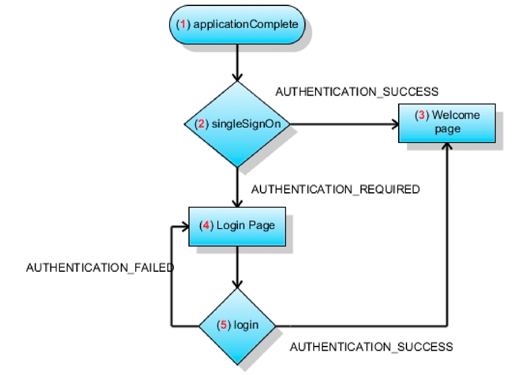

# Flash Builder-toepassingen maken die SSO-verificatie uitvoeren met behulp van HTTP-tokens {#creating-flash-builder-applicationsthat-perform-sso-authentication-using-http-tokens}

U kunt een cliënttoepassing tot stand brengen gebruikend de Bouwer van de Flits die (SSO) authentificatie het enig-sign uitvoert gebruikend de tokens van HTTP. Stel bijvoorbeeld dat u een webtoepassing maakt met Flash Builder. Ga er vervolgens van uit dat de toepassing verschillende weergaven bevat, waarbij elke weergave een andere bewerking AEM Forms aanroept. In plaats van een gebruiker te verifiëren voor elke Forms-bewerking, kunt u een aanmeldingspagina maken waarmee de gebruiker één keer kan verifiëren. Zodra voor authentiek verklaard, kan een gebruiker veelvoudige verrichtingen aanhalen zonder het moeten opnieuw voor authentiek verklaren. Als een gebruiker zich bijvoorbeeld heeft aangemeld bij Workspace (of een andere Forms-toepassing), hoeft de gebruiker zich niet opnieuw te verifiëren.

Hoewel de clienttoepassing de vereiste toepassingslogica bevat om SSO-verificatie uit te voeren, voert AEM gebruikerbeheer de werkelijke gebruikersverificatie uit. Om een gebruiker voor authentiek te verklaren gebruikend de tokens van HTTP, roept de cliënttoepassing de `authenticateWithHTTPToken` verrichting van de Dienst van de Manager van de Authentificatie aan. Gebruikersbeheer kan gebruikers verifiëren met een HTTP-token. Voor verdere remoting of Webdienst vraag aan AEM Forms, moet u geen geloofsbrieven voor authentificatie overgaan.

>[!NOTE]
>
>Voordat u deze sectie leest, wordt u aangeraden AEM Forms aanroepen met Remoting. (Zie AEM Forms [aanroepen met AEM Forms verwijderen](/help/forms/developing/invoking-aem-forms-using-remoting.md#invoking-aem-forms-using-remoting).)

Het volgende kortstondige proces van AEM Forms, genoemd `MyApplication/EncryptDocument`, wordt aangehaald nadat een gebruiker gebruikend SSO voor authentiek wordt verklaard. (Zie het voorbeeld [](/help/forms/developing/aem-forms-processes.md)van een kortstondig proces voor informatie over dit proces, zoals de invoer- en uitvoerwaarden.)


>[!NOTE]
>
>Dit proces is niet gebaseerd op een bestaand proces van AEM Forms. Om samen met de codevoorbeelden te volgen die bespreken hoe te om dit proces aan te halen, creeer een proces genoemd `MyApplication/EncryptDocument` gebruikend workbench. (Zie [Workbench](https://www.adobe.com/go/learn_aemforms_workbench_63)gebruiken.)

De clienttoepassing die is gebouwd met Flash Builder, communiceert met de beveiligingsserver van de User Manager die is geconfigureerd op `/um/login` en `/um/logout`. De clienttoepassing verzendt dus tijdens het opstarten een aanvraag naar de `/um/login` URL om de status van de gebruiker te bepalen. Vervolgens reageert Gebruikersbeheer op de gebruikersstatus. De clienttoepassing en de beveiligingsserver van Gebruikersbeheer communiceren via HTTP.

**Aanvraagindeling**

Voor de beveiligingsserver zijn de volgende invoervariabelen vereist:

* `um_no_redirect` - Deze waarde moet zijn `true`. Deze variabele vergezelt alle verzoeken die aan de de veiligheidsservlet van de Manager van de Gebruiker worden gemaakt. Het helpt de veiligheidsservlet ook het inkomende verzoek onderscheiden die uit een flex cliënt of andere Webtoepassingen komt.
* `j_username` - Deze waarde is de waarde van de aanmeldings-id van de gebruiker zoals opgegeven in het aanmeldingsformulier.
* `j_password` - Deze waarde is het overeenkomstige wachtwoord van de gebruiker zoals opgegeven in het aanmeldingsformulier.

De `j_password` waarde is alleen vereist voor referentie-aanvragen. Als de wachtwoordwaarde niet is opgegeven, controleert het beveiligingsserver of de account die u gebruikt al is geverifieerd. Zo ja, dan kunt u doorgaan; nochtans, verifieert de veiligheidsservlet u niet opnieuw.

>[!NOTE]
>
>Voor een correcte verwerking van i18n, zorg ervoor dat deze waarden in POST vorm zijn.

**Responsindeling**

Beveiligingsservlet bij `/um/login` antwoordt door het `URLVariables` formaat te gebruiken. In deze indeling wordt de uitvoer van het inhoudstype ingesteld op text/plain. De uitvoer bevat naamwaardeparen, gescheiden door een en-teken (&amp;). De reactie bevat de volgende variabelen:

* `authenticated` - De waarde is `true` of `false`.
* `authstate` - Deze waarde kan een van de volgende waarden bevatten:

   * `CREDENTIAL_CHALLENGE` - Deze status geeft aan dat Gebruikersbeheer op geen enkele manier de identiteit van de gebruiker kan bepalen. Voor verificatie zijn de gebruikersnaam en het wachtwoord van de gebruiker vereist.
   * `SPNEGO_CHALLENGE`- Deze toestand wordt op dezelfde manier behandeld als `CREDENTIAL_CHALLENGE`.
   * `COMPLETE` - Deze status geeft aan dat Gebruikersbeheer de gebruiker kan verifiëren.
   * `FAILED` - Deze status geeft aan dat Gebruikersbeheer de gebruiker niet kon verifiëren. Als reactie op deze status kan de flex-client een foutbericht aan de gebruiker weergeven.
   * `LOGGED_OUT` - Deze status geeft aan dat de gebruiker zich heeft afgemeld.

* `assertionid` - Als de status `COMPLETE` toen was, bevat deze de `assertionId` waarde van de gebruiker. Een cliënttoepassing kan de `AuthResult` voor de gebruiker verkrijgen.

**Aanmeldingsproces**

Wanneer een clienttoepassing wordt gestart, kunt u een POST-aanvraag indienen bij het `/um/login` beveiligingsservlet. Bijvoorbeeld, `https://<your_serverhost>:<your_port>/um/login?um_no_redirect=true`. Wanneer het verzoek de veiligheidsserver van de Manager van de Gebruiker bereikt, voert het de volgende stappen uit:

1. Het zoekt naar een cookie met de naam `lcAuthToken`. Als de gebruiker zich al heeft aangemeld bij een andere Forms-toepassing, is deze cookie aanwezig. Als het cookie wordt gevonden, wordt de inhoud gevalideerd.
1. Als op Kopbal gebaseerde SSO wordt toegelaten, dan zoekt servlet gevormde kopballen om de identiteit van de gebruiker te bepalen.
1. Als SPNEGO wordt toegelaten, dan probeert servlet om SPNEGO in werking te stellen en probeert om de identiteit van de gebruiker te bepalen.

Als de beveiligingsservlet een geldig token zoekt dat overeenkomt met een gebruiker, kunt u met de beveiligingsservlet verdergaan en hiermee reageren `authstate=COMPLETE`. Anders reageert de beveiligingsservlet met `authstate=CREDENTIAL_CHALLENGE`. In de volgende lijst worden deze waarden beschreven:

* `Case authstate=COMPLETE`: Geeft aan dat de gebruiker is geverifieerd en dat de `assertionid` waarde de bevestiging-id voor de gebruiker bevat. In dit stadium kan de clienttoepassing verbinding maken met AEM Forms. servlet die voor die URL wordt gevormd kan `AuthResult` voor de gebruiker verkrijgen door de `AuthenticationManager.authenticate(HttpRequestToken)` methode aan te halen. De `AuthResult` instantie kan de context van de gebruikersmanager tot stand brengen en het opslaan in de zitting.
* `Case authstate=CREDENTIAL_CHALLENGE`: Geeft aan dat voor het beveiligingsservlet de gebruikersgegevens van de gebruiker zijn vereist. Als reactie hierop kan de clienttoepassing het aanmeldingsscherm weergeven aan de gebruiker en de verkregen referentie naar het beveiligingsservlet verzenden (bijvoorbeeld `https://<your_serverhost>:<your_port>/um/login?um_no_redirect=true&j_username=administrator&j_password=password)`). Als de authentificatie succesvol is, dan antwoordt veiligheidsservlet met `authstate=COMPLETE`.

Als de authentificatie nog niet succesvol is, dan antwoordt veiligheidsservlet met `authstate=FAILED`. Om op deze waarde te reageren, kan de clienttoepassing een bericht weergeven om de gegevens opnieuw te verkrijgen.

>[!NOTE]
>
>Terwijl `authstate=CREDENTIAL_CHALLENGE`, adviseert het dat de cliënt de verkregen referentie naar de veiligheidsserver in een vorm van de POST verzendt.

**Afmeldingsproces**

Wanneer een clienttoepassing zich afmeldt, kunt u een aanvraag naar de volgende URL verzenden:

`https://<your_serverhost>:<your_port>/um/logout?um_no_redirect=true`

Bij het ontvangen van deze aanvraag verwijdert de beveiligingsserver van de User Manager de `lcAuthToken` cookie en reageert deze met `authstate=LOGGED_OUT`. Nadat de clienttoepassing deze waarde heeft ontvangen, kan de toepassing opschoningstaken uitvoeren.

## Een clienttoepassing maken die gebruikers van AEM-formulieren verifieert met behulp van SSO {#creating-a-client-application-that-authenticates-aem-forms-users-using-sso}

Om aan te tonen hoe te om een cliënttoepassing tot stand te brengen die authentificatie SSO uitvoert, wordt een voorbeeldcliënttoepassing gecreeerd. In de volgende afbeelding ziet u de stappen die de clienttoepassing uitvoert om een gebruiker te verifiëren met behulp van SSO.



In de vorige illustratie wordt de toepassingsstroom beschreven die plaatsvindt wanneer de clienttoepassing wordt gestart.

1. De clienttoepassing activeert de `applicationComplete` gebeurtenis.
1. De oproep aan `ISSOManager.singleSignOn` wordt gemaakt. De clienttoepassing verzendt een aanvraag naar de beveiligingsserver van de gebruikersbeheerder.
1. Als de beveiligingsserver de gebruiker verifieert, wordt het `ISSOManager` verzonden `SSOEvent.AUTHENTICATION_SUCCESS`. Als reactie hierop geeft de clienttoepassing de hoofdpagina weer. In dit voorbeeld roept de hoofdpagina het kortstondige proces van AEM Forms aan genoemd MyApplication/EncryptDocument.
1. Als de beveiligingsserver niet kan bepalen of de gebruiker geldig is, vraagt de toepassing opnieuw om de gebruikersgegevens. De `ISSOManager` klasse verzendt de `SSOEvent.AUTHENTICATION_REQUIRED` gebeurtenis. De aanmeldingspagina wordt weergegeven in de clienttoepassing.
1. De gegevens die op de aanmeldingspagina worden opgegeven, worden naar de `ISSOManager.login` methode verzonden. Als de verificatie succesvol is, leidt dit tot stap 3. Anders wordt de `SSOEvent.AUTHENTICATION_FAILED` gebeurtenis geactiveerd. De clienttoepassing geeft de aanmeldingspagina en een geschikt foutbericht weer.

### De clienttoepassing maken {#creating-the-client-application}

De clienttoepassing bestaat uit de volgende bestanden:

* `SSOStandalone.mxml`: Het MXML-hoofdbestand dat de clienttoepassing vertegenwoordigt. (Zie [Het bestand](creating-flash-builder-applications-perform.md#creating-the-ssostandalone-mxml-file)SSOStandalone.mxml maken.)
* `um/ISSOManager.as`: Bewerkingen met betrekking tot Single Sign On (SSO) toegankelijk maken. (Zie [Het bestand](creating-flash-builder-applications-perform.md#creating-the-issomanager-as-file)ISSOManager.as maken.)
* `um/SSOEvent.as`: De gebeurtenis `SSOEvent` wordt verzonden voor SSO-gerelateerde gebeurtenissen. (Zie [Het bestand](creating-flash-builder-applications-perform.md#creating-the-ssoevent-as-file)SSOEvent.as maken.)
* `um/SSOManager.as`: Beheert de bewerkingen met betrekking tot SSO en verzendt de juiste gebeurtenissen. (Zie Het bestand [SSOManager.as](creating-flash-builder-applications-perform.md#creating-the-ssomanager-as-file)maken.)
* `um/UserManager.as`: Bevat toepassingslogica die de dienst van de Manager van de Authentificatie gebruikend zijn WSDL aanhaalt. (Zie [Het bestand](creating-flash-builder-applications-perform.md#creating-the-usermanager-as-file)UserManager.as maken.)
* `views/login.mxml`: Vertegenwoordigt het aanmeldingsscherm. (Zie [Het bestand](creating-flash-builder-applications-perform.md#creating-the-login-mxml-file)login.mxml maken.)
* `views/logout.mxml`: Vertegenwoordigt het logout scherm. (Zie Het bestand [logout.mxml](creating-flash-builder-applications-perform.md#creating-the-logout-mxml-file)maken.)
* `views/progress.mxml`: Vertegenwoordigt een vooruitgangsmening. (Zie [Het bestand](creating-flash-builder-applications-perform.md#creating-the-progress-mxml-file)progress.mxml maken.)
* `views/remoting.mxml`: Vertegenwoordigt de mening die AEM Forms kortstondig proces genoemd MyApplication/EncryptDocument gebruikend remoting aanhaalt. (Zie Het bestand [remoting.mxml](creating-flash-builder-applications-perform.md#creating-the-remoting-mxml-file)maken.)

In de volgende afbeelding ziet u een visuele weergave van de clienttoepassing.


>[!NOTE]
>
>Er zijn twee pakketten met de naam um en views. Zorg er bij het maken van de clienttoepassing voor dat u de bestanden in de juiste pakketten plaatst. Voeg ook het bestand adobe-remoting-provider.swc toe aan het klassepad van uw project. (Zie [Inclusief het Flex-bibliotheekbestand](/help/forms/developing/invoking-aem-forms-using-remoting.md#including-the-aem-forms-flex-library-file)AEM Forms.)

### Het bestand SSOStandalone.mxml maken {#creating-the-ssostandalone-mxml-file}

De volgende code vertegenwoordigt het SSOStandalone.mxml- dossier.

```xml
 <?xml version="1.0" encoding="utf-8"?>
 <mx:Application
                 layout="absolute"
                 applicationComplete="initApp()"
                 height="400" width="550"
                 xmlns:v="views.*"
                 backgroundColor="#EDE8F0" viewSourceURL="srcview/index.html">
     <mx:Script>
         <![CDATA[
             import mx.utils.URLUtil;
             import um.SSOEvent;
             import mx.core.UIComponent;
             import um.SSOManager;
             import mx.rpc.events.ResultEvent;
             import mx.utils.ObjectUtil;
             import mx.controls.Alert;
 
             [Bindable]
             private var _serverURL:String;
 
             private var _ssoManager:SSOManager;
 
             private var _progress:UIComponent;
 
             private var _loginPage:UIComponent;
 
             private function initApp():void{
                 _serverURL = determineServerUrl();
                 _ssoManager = new SSOManager(_serverURL);
 
                 _ssoManager.addEventListener(SSOEvent.AUTHENTICATION_FAILED,loginHandler);
                 _ssoManager.addEventListener(SSOEvent.AUTHENTICATION_SUCCESS,loginHandler);
                 _ssoManager.addEventListener(SSOEvent.AUTHENTICATION_REQUIRED,loginHandler);
                 _ssoManager.addEventListener(SSOEvent.LOGOUT_COMPLETE,loginHandler);
                 _ssoManager.addEventListener(SSOEvent.AUTHENTICATION_FAULT,loginHandler);
 
                 trace("[Main] Add the required event handlers for authentication");
                 _ssoManager.singleSignOn();
 
                 showBusy();
             }
 
             private function determineServerUrl():String
             {
                 var s:String ;
                 var appUrl:String = Application.application.url;
                 var givenUrl:String  = ExternalInterface.call("serverUrl.toString");
                 trace("[Main] Application url ["+appUrl+"] Given url ["+givenUrl+"]");
                 if(appUrl != null && appUrl.search("^http") != -1){
                     s = appUrl;
                 }
                 if(s == null){
                     s = givenUrl;
                 }
                 if(s== null){
                     s = "https://hiro-xp:8080/";
                 }
                 s = URLUtil.getFullURL(s,"/");
                 trace("[Main] Would be using ["+s+"] as serverUrl");
                 return s;
             }
 
             private function loginHandler(event:SSOEvent):void
             {
                 trace("[Main] Handling event "+event.type);
                 switch(event.type)
                 {
                     case SSOEvent.AUTHENTICATION_FAILED:
                         viewContent.selectedChild = login;
                         login.showLoginFailed();
                         break;
                     case SSOEvent.AUTHENTICATION_SUCCESS:
                         viewContent.selectedChild = remoting;
                         break;
                     case SSOEvent.AUTHENTICATION_REQUIRED:
                         viewContent.selectedChild = login;
                         break;
                     case SSOEvent.LOGOUT_COMPLETE:
                         viewContent.selectedChild = logout;
                         break;
                     case SSOEvent.AUTHENTICATION_FAULT:
                         Alert.show("Error doing authentication. Root error ["+event.rootEvent+"]","Authentication Fault",Alert.OK);
                 }
             }
 
             public function get ssoManager():SSOManager
             {
                 return _ssoManager;
             }
 
             public function showBusy():void
             {
                 viewContent.selectedChild = progress;
             }
 
             public function get serverUrl():String
             {
                 return _serverURL;
             }
 
         ]]>
     </mx:Script>
     <mx:ViewStack x="0" y="0" id="viewContent" >
         <v:login id="login" />
         <v:remoting id="remoting"  />
         <v:progress id="progress" />
         <v:logout id="logout"/>
     </mx:ViewStack>
 </mx:Application>
 
```

### Het bestand ISSOManager.as maken {#creating-the-issomanager-as-file}

De volgende code vertegenwoordigt het bestand ISSOManager.as.

```java
 package um
 {
     import flash.events.IEventDispatcher;
 
     /**
      * The <code>ISSOManager</code> expose operations related to Single Sign On (SSO) in AEM Forms
      * environment. The application should register appropriate <code>SSOEvent</code> handlers prior
      * to calling any of the following operations
      */
     public interface ISSOManager extends IEventDispatcher
     {
         /**
          * Tries to validate whether the user has an already existing session or not (SSO Scenarios). The application
          * may call this method during the initialization. In general this call would lead to one of the
          * following events getting dispatched
          * <ul>
          * <li>SSOEvent.AUTHENTICATION_SUCCESS - If a SSO session was found and valid
          * <li>SSOEvent.AUTHENTICATION_REQUIRED - No SSO session was found and as such authentication is required in
          * the form of username and password.
          * <li>SSOEvent.AUTHENTICATION_FAULT - Some error has occured while connecting to the server
          * </ul>
          */
         function singleSignOn():void;
 
         /**
          * Authenticates the user using username and password. It may lead to one of the following events
          * <ul>
          * <li>SSOEvent.AUTHENTICATION_SUCCESS - The authentication is successful and a session is established
          * <li>SSOEvent.AUTHENTICATION_FAILED - Authentication has failed
          * </ul>
          */
         function login(username:String, password:String):void;
 
         /**
          * Terminates the current session and logs out the user.
          */
         function logout():void;
 
         /**
          * Get the assertionId for the logged in user
          */
         function get assertionId():String;
     }
 }
```

### Het bestand SSOEvent.as maken {#creating-the-ssoevent-as-file}

De volgende code vertegenwoordigt het SSOEvent.as-bestand.

```java
 package um
 {
     import flash.events.Event;
 
     /**
      * The <code>SSOEvent</code> is dispatched for SSO related events
      */
     public class SSOEvent extends Event
     {
         /**
          * This type of event would be dispatched when the Authentication process is successful. Authentication
          * might have been done with SSO or username and password. As a response to this event the application
          * can show the welcome page to the user
          * The application may want to perform specific check for permission/role so as to verify the user is allowed.
          * So as a response to this event the application would do those checks and then only show the welcome page
          */
         public static const AUTHENTICATION_SUCCESS:String = "authenticationSuccess";
 
         /**
          * This type of event would be dispatched when authentication fails using the username, password.
          * As a response to this type of event an application can show an error message to the user.
          * This event would only happen when authentication is done using username and password and NOT in
          * SSO case.
          */
         public static const AUTHENTICATION_FAILED:String = "authenticationFailed";
 
         /**
          * This type of event would be dispatched when authentication using SSO is not achieved. And due to
          * that we require the user's username and password for authentication. As a response to this event
          * the application can show the login page to the user.
          */
         public static const AUTHENTICATION_REQUIRED:String = "authenticationRequired";
 
         /**
          * This type of event would be dispatched when logout is complete. As a response to this event the
          * application may show a logout page informing the user that he has been logged out. Or the application
          * can take the user back to login page
          */
         public static const LOGOUT_COMPLETE:String = "logoutComplete";
 
         /**
          * This type of event would be dispatched when ever there is a problem in doing Authentication. The root cause
          * can be obtained from the <code>rootEvent</code>.
          */
         public static const AUTHENTICATION_FAULT:String = "authenticationFault";
 
         private var _rootEvent:Event;
 
         public function SSOEvent(type:String, rootEvent:Event=null)
         {
             super(type,true,false);
             _rootEvent = rootEvent;
         }
 
         /**
          * The root event. If current event type is <code>AUTHENTICATION_FAULT</code> then it would be an
          * <code>IOErrorEvent</code> in other cases it would be complete event. Its basic use is to extract the root
          * cause in case of an authentication fault.
          */
         public function get rootEvent():Event
         {
             return _rootEvent;
         }
     }
 }
```

### Het bestand SSOManager.as maken {#creating-the-ssomanager-as-file}

De volgende code vertegenwoordigt het bestand SSOManager.as.

```java
 package um
 {
     import flash.events.Event;
     import flash.events.EventDispatcher;
     import flash.events.IOErrorEvent;
     import flash.external.ExternalInterface;
     import flash.net.URLLoader;
     import flash.net.URLLoaderDataFormat;
     import flash.net.URLRequest;
     import flash.net.URLVariables;
 
     import mx.utils.ObjectUtil;
 
     /**
      * Manages the SSO related operations and dispatches appropriate events. It would connect to the UM Filter/Servlet
      * at <code>um/login</code> The UM response would be of form of url encoded variables. It would look for
      * <code>authstate</code> value in the response and depending on that it would proceed.
      *
      * <p>If there is an IO_Error while initial attempt to UM then it would assume it as a 401 response. And it would
      * be assumed that SPNEGO based authenticatin is not working and therefore user would be shown a login page.
      */
     public class SSOManager extends EventDispatcher implements ISSOManager
     {
         private static const SSO_URL:String = "um/login";
         private static const SSO_LOGOUT_URL:String = "um/logout";
         private static const AUTH_COOKIE_NAME:String = "lcAuthToken";
 
         private var _serverUrl:String;
         private var _assertionId:String;
 
         /**
          * Constructs an SSOManager with the given server url.
          *
          * @param serverUrl - The uri of the server to connect to. it must be without any context path e.g
          * http://localhost:8080/. The SSOManager would directly append the path of UM exposed SSO url to it
          * for its operations
          */
         public function SSOManager(serverUrl:String)
         {
             _serverUrl = serverUrl;
         }
 
         public function singleSignOn():void
         {
             sendRequest(SSO_URL,true);
         }
 
         public function login(username:String, password:String):void
         {
             sendRequest(SSO_URL,false,
                 function(request:URLRequest,vars:URLVariables):void
                 {
                     vars.j_username = username;
                     vars.j_password = password;
                 }
             );
         }
 
         public function logout():void
         {
             sendRequest(SSO_LOGOUT_URL);
         }
 
         public function get assertionId():String
         {
             return _assertionId;
         }
 
 
 
         /**
          * Connects to the UM security service.
          */
         private function sendRequest(relativeUrl:String,authenticationRequest:Boolean=false, requestProcessor:Function=null):void
         {
             var loader:URLLoader = new URLLoader();
             loader.dataFormat = URLLoaderDataFormat.VARIABLES;
             var request:URLRequest = new URLRequest(_serverUrl + relativeUrl);
             trace("[SSOmanager] Contacting ["+request.url+"]");
             var vars:URLVariables = new URLVariables();
             vars.um_no_redirect = "true";
             request.data = vars;
             if(requestProcessor != null){
                 requestProcessor(request,vars);
             }
 
             loader.addEventListener(Event.COMPLETE,authHandler);
             //if its an authentication request then only treat io error as a possible 401
             //for others treat them as faults
             if(authenticationRequest){
                 loader.addEventListener(IOErrorEvent.IO_ERROR,httpAuthenticationHandler);
             }else{
                 loader.addEventListener(IOErrorEvent.IO_ERROR,authFaultHandler);
             }
             trace("[SSOmanager] Sending request "+ ObjectUtil.toString(request));
             loader.load(request);
         }
 
         private function authHandler(event:Event):void
         {
             var loader:URLLoader = URLLoader(event.target);
             var response:URLVariables = URLVariables(loader.data);
             trace("[SSOmanager] Processing response ["+ObjectUtil.toString(response)+"]");
             handleAuthResult(response["authstate"],response);
         }
 
         /**
          * Handles the IOErrorEvent. Flash would dispatch IOEvent in response to HTTP 401.
          * There is no way to distinguish it from the genuine IOError.
          */
         private function httpAuthenticationHandler(event:IOErrorEvent):void
         {
             trace("[SSOmanager] Processing IOErrorEvent ["+ObjectUtil.toString(event)+"]");
             handleAuthResult("CREDENTIAL_CHALLENGE");
 
         }
 
         /**
          * Dispatches appropriate <code>SSOEvent</code> on the basis of the <code>authstate</code>
          * value of the response.
          * The response is url encoded in for of
          * <pre>
          * authenticated=false&authstate=SPNEGO_CHALLENGE
          * </pre>
          * Depending on <code>authstate</code> the SSOEvent is dispatched
          */
         private function handleAuthResult(authState:String,response:URLVariables = null):void
         {
             trace("[SSOmanager] processing state "+authState);
             switch(authState)
             {
                 case "FAILED"  :
                     dispatchEvent(new SSOEvent(SSOEvent.AUTHENTICATION_FAILED));
                     break;
                 case "COMPLETE" :
                     _assertionId = response ? response["assertionid"] : null;
                     dispatchEvent(new SSOEvent(SSOEvent.AUTHENTICATION_SUCCESS));
                     break;
                 case "CREDENTIAL_CHALLENGE" :
                     dispatchEvent(new SSOEvent(SSOEvent.AUTHENTICATION_REQUIRED));
                     break;
                 case "LOGGED_OUT" :
                     dispatchEvent(new SSOEvent(SSOEvent.LOGOUT_COMPLETE));
                     break;
                 default:
                     dispatchEvent(new SSOEvent(SSOEvent.AUTHENTICATION_REQUIRED));
                     break;
             }
         }
 
         private function authFaultHandler(event:Event):void
         {
             dispatchEvent(new SSOEvent(SSOEvent.AUTHENTICATION_FAULT,event));
         }
 
     }
 }
```

### Het bestand UserManager.as maken {#creating-the-usermanager-as-file}

De volgende code vertegenwoordigt het bestand UserManager.as.

```java
 package um
 {
     import flash.events.Event;
     import mx.rpc.soap.WebService;
     import mx.rpc.soap.Operation;
     import mx.rpc.IResponder;
     import mx.rpc.events.FaultEvent;
     import mx.rpc.events.ResultEvent;
     import mx.rpc.soap.LoadEvent;
 
     public class UserManager
     {
         private var _ssoManager:ISSOManager;
         private var _serverUrl:String;
 
         public function UserManager(ssoManager:ISSOManager,serverUrl:String)
         {
             _serverUrl = serverUrl;
             _ssoManager = ssoManager;
         }
 
         public function retrieveAssertion(responder:IResponder):String
         {
             var assertionId:String = _ssoManager.assertionId;
             if(!assertionId)
             {
                 trace("[UserManager] AssertionId not found");
                 return null;
             }
 
             var ws:WebService = new WebService();
             var wsdl:String = _serverUrl+'soap/services/AuthenticationManagerService?wsdl&lc_version=8.2.1';
             ws.loadWSDL(wsdl);
             ws.addEventListener(LoadEvent.LOAD,
                 function(event:Event):void
                 {
                     trace("[UserManager] WSDL loaded");
                     var authenticate:Operation = ws.authenticateWithHttpToken as Operation;
                     authenticate.resultFormat = "e4x";
                     authenticate.addEventListener(ResultEvent.RESULT,
                         function(event:Event):void
                         {
                             responder.result(event);
                         }
                     );
                     authenticate.send({assertionId:assertionId});
                 }
             );
 
             ws.addEventListener(FaultEvent.FAULT,
                 function(event:Event):void
                 {
                     responder.fault(event);
                 }
             );
             return null;
         }
     }
 }
```

### Het bestand login.mxml maken {#creating-the-login-mxml-file}

De volgende code vertegenwoordigt het login.mxml- dossier.

```xml
 <?xml version="1.0" encoding="utf-8"?>
 <mx:Canvas  width="500" height="400">
     <mx:Script>
         <![CDATA[
             import mx.core.Application;
             public function showLoginFailed():void
             {
                 loginMessage.text = "Username or Password incorrect";
             }
 
             private function doLogin():void
             {
                 Application.application.ssoManager.login(j_username.text,j_password.text);
                 Application.application.showBusy();
             }
 
         ]]>
     </mx:Script>
 
     <mx:VBox height="113" width="244" x="128" y="144" horizontalAlign="center" verticalGap="10">
         <mx:HBox width="100%">
             <mx:HBox width="100%" verticalAlign="middle" horizontalAlign="center" height="32">
                 <mx:Label text="Username" fontWeight="bold"/>
                 <mx:TextInput id="j_username"/>
             </mx:HBox>
         </mx:HBox>
         <mx:HBox width="100%" height="33" horizontalAlign="center" horizontalGap="10" verticalAlign="middle">
             <mx:Label text="Password" fontWeight="bold"/>
             <mx:TextInput displayAsPassword="true" id="j_password"/>
         </mx:HBox>
         <mx:Button label="Login" click="doLogin()"/>
     </mx:VBox>
     <mx:Text x="128" y="122" id="loginMessage" width="230" height="14"/>
     <mx:Label x="154" y="65" text="AEM Forms SSO Demo" fontFamily="Georgia" fontSize="20" color="#0A0A0A"/>
 </mx:Canvas>
 
```

### Het bestand logout.mxml maken {#creating-the-logout-mxml-file}

De volgende code vertegenwoordigt het logout.mxml- dossier.

```xml
 <?xml version="1.0" encoding="utf-8"?>
 <mx:Canvas  width="500" height="400">
     <mx:Label x="97" y="188" text="You have successfully logged out from the application"/>
 
 </mx:Canvas>
 
```

### Het bestand progress.mxml maken {#creating-the-progress-mxml-file}

De volgende code vertegenwoordigt het progress.mxml- dossier.

```xml
 <?xml version="1.0" encoding="utf-8"?>
 <mx:Canvas >
     <mx:Label x="151" y="141" text="Wait...."/>
     <mx:SWFLoader source="LoadingCircle.swf" width="50" height="50" horizontalCenter="0" verticalCenter="0"/>
 </mx:Canvas>
```

### Het bestand remoting.mxml maken {#creating-the-remoting-mxml-file}

De volgende code vertegenwoordigt het remoting.mxml- dossier dat het `MyApplication/EncryptDocument` proces aanhaalt. Aangezien een document aan het proces wordt doorgegeven, bevindt de toepassingslogica die verantwoordelijk is voor het doorgeven van een beveiligd document aan AEM Forms zich in dit bestand. (Zie Beveiligde documenten [doorgeven om processen aan te roepen met behulp van Verwijderen](/help/forms/developing/invoking-aem-forms-using-remoting.md#passing-secure-documents-to-invoke-processes-using-remoting).)

```xml
 <?xml version="1.0" encoding="utf-8"?>
 <mx:Canvas  width="664" height="400" creationComplete="initializeChannelSet()" xmlns:views="views.*">
     <mx:Script>
 
         <![CDATA[
 
             import mx.rpc.livecycle.DocumentReference;
             import flash.net.FileReference;
             import flash.net.URLRequest;
             import flash.events.Event;
             import flash.events.DataEvent;
             import mx.messaging.ChannelSet;
             import mx.messaging.channels.AMFChannel;
             import mx.rpc.events.ResultEvent;
             import mx.collections.ArrayCollection;
             import mx.rpc.AsyncToken;
             import um.UserManager;
             import mx.rpc.events.ResultEvent;
             import mx.rpc.events.FaultEvent;
             import mx.core.Application;
             import mx.rpc.Responder;
             import mx.utils.ObjectUtil;
 
             // Classes used in file retrieval
             private var fileRef:FileReference = new FileReference();
             private var docRef:DocumentReference = new DocumentReference();
             private var parentResourcePath:String = "/";
             //private var serverPort:String = "'[server]:[port]'";
             private var serverPort:String = "'[server]:[port]'";
             private var now1:Date;
             private var userManager:UserManager;
 
             // Define a ChannelSet object.
             public var cs:ChannelSet;
 
             // Holds information returned from AEM Forms
             [Bindable]
             public var progressList:ArrayCollection = new ArrayCollection();
 
 
             // Set up channel set to invoke AEM Forms.
             // This must be done before calling any service or process, but only
             // once for the entire application.
             private function initializeChannelSet():void {
                 cs = new ChannelSet();
                 cs.addChannel(new AMFChannel("remoting-amf", "https://" + serverPort + "/remoting/messagebroker/amf"));
                 EncryptDocument.channelSet = cs;
 
             //Get the user that is authenticated
             userManager = new UserManager(Application.application.ssoManager,Application.application.serverUrl);
             userManager.retrieveAssertion(
                     new mx.rpc.Responder(
                         function(event:ResultEvent):void
                         {
                             var name:String = XML(event.currentTarget.lastResult)..*::authenticatedUser.*::userid.text();
                             username.text = "Welcome "+name;
                         },
                         function(event:FaultEvent):void
                         {
                             mx.controls.Alert.show(event.fault.faultString,'Error')
                         }
                     )
                 );
 
             }
 
             // Call this method to upload the file.
             // This creates a file picker and lets the user select a PDF file to pass to the EncryptDocument process.
             private function uploadFile():void {
                 fileRef.addEventListener(Event.SELECT, selectHandler);
                 fileRef.addEventListener(DataEvent.UPLOAD_COMPLETE_DATA,completeHandler);
                 fileRef.browse();
             }
 
             // Gets called for selected file. Does the actual upload via the file upload servlet.
             private function selectHandler(event:Event):void {
                 var authTokenService:RemoteObject = new RemoteObject("LC.FileUploadAuthenticator");
                 authTokenService.addEventListener("result", authTokenReceived);
                 authTokenService.channelSet = cs;
                 authTokenService.getFileUploadToken();
             }
 
             private function authTokenReceived(event:ResultEvent):void
             {
                 var token:String = event.result as String;
                 var request:URLRequest = DocumentReference.constructRequestForUpload("https://hiro-xp:8080", token);
 
                 try
                 {
                     fileRef.upload(request);
                 }
                 catch (error:Error)
                 {
                     trace("Unable to upload file.");
                 }
             }
 
             // Called once the file is completely uploaded.
             private function completeHandler(event:DataEvent):void {
 
                 // Set the docRefs url and referenceType parameters
                 docRef.url = event.data as String;
                 docRef.referenceType=DocumentReference.REF_TYPE_URL;
                 executeInvokeProcess();
             }
 
             //This method invokes the EncryptDocument process
             public function executeInvokeProcess():void {
                 //Create an Object to store the input value for the EncryptDocument process
                 now1 = new Date();
 
                 var params:Object = new Object();
                 params["inDoc"]=docRef;
 
                 // Invoke the EncryptDocument process
                 var token:AsyncToken;
                 token = EncryptDocument.invoke(params);
                 token.name = name;
             }
 
 
             // This method handles a successful conversion invocation
             public function handleResult(event:ResultEvent):void
             {
 
                 //Retrieve information returned from the service invocation
                 var token:AsyncToken = event.token;
                 var res:Object = event.result;
                 var dr:DocumentReference = res["outDoc"] as DocumentReference;
                 var now2:Date = new Date();
 
                 // These fields map to columns in the DataGrid
                 var progObject:Object = new Object();
                 progObject.filename = token.name;
                 progObject.timing = (now2.time - now1.time).toString();
                 progObject.state = "Success";
                 progObject.link = "<a href='" + dr.url + "'> open </a>";
                 progressList.addItem(progObject);
             }
 
 
             private function resultHandler(event:ResultEvent):void {
             // Do anything else here.
 
             }
 
             private function logout():void
             {
                 Application.application.ssoManager.logout();
                 Application.application.showBusy();
             }
 
 
         ]]>
 
     </mx:Script>
 
     <mx:RemoteObject id="EncryptDocument" destination="MyApplication/EncryptDocument" result="resultHandler(event);">
             <mx:method name="invoke" result="handleResult(event)"/>
     </mx:RemoteObject>
 
 
     <!--//This consists of what is displayed on the webpage-->
     <mx:Panel id="lcPanel" title="EncryptDocument  (Deprecated for AEM forms) AEM Forms Remoting Example"
           height="25%" width="25%" paddingTop="10" paddingLeft="10" paddingRight="10"
           paddingBottom="10">
         <mx:Label width="100%" color="blue"
                   id="username"/>
 
         <mx:DataGrid x="10" y="0" width="500" id="idProgress" editable="false"
                          dataProvider="{progressList}" height="231" selectable="false" >
         <mx:columns>
                 <mx:DataGridColumn headerText="Filename" width="200" dataField="filename" editable="false"/>
                 <mx:DataGridColumn headerText="State" width="75" dataField="state" editable="false"/>
                 <mx:DataGridColumn headerText="Timing" width="75" dataField="timing" editable="false"/>
                 <mx:DataGridColumn headerText="Click to Open" dataField="link" editable="false" >
                 <mx:itemRenderer>
 
                         <mx:Component>
                         <mx:Text x="0" y="0" width="100%" htmlText="{data.link}"/>
                         </mx:Component>
                     </mx:itemRenderer>
             </mx:DataGridColumn>
         </mx:columns>
     </mx:DataGrid>
     <mx:Button label="Select File" click="uploadFile()" />
     <mx:Button label="Logout"  click="logout()" />
     </mx:Panel>
 </mx:Canvas>
 
 
```

### Additional Information {#additional-information}

In de volgende secties vindt u aanvullende informatie over de communicatie tussen de clienttoepassing en de beveiligingsserver van de gebruikersbeheerder.

### Er treedt een nieuwe verificatie op {#a-new-authentication-occurs}

In deze situatie probeert de gebruiker zich voor het eerst aan te melden bij een clienttoepassing bij AEM Forms. (Er bestaat geen vorige sessie met de gebruiker.) In de `applicationComplete` gebeurtenis, wordt de `SSOManager.singleSignOn` methode aangehaald die een verzoek naar de Manager van de Gebruiker verzendt.

`GET /um/login?um%5Fno%5Fredirect=true HTTP/1.1`

De beveiligingsserver van de gebruikersbeheerder reageert op de volgende waarde:

`HTTP/1.1 200 OK`

`authenticated=false&authstate=CREDENTIAL_CHALLENGE`

Als reactie op deze waarde wordt een `SSOEvent.AUTHENTICATION_REQUIRED` waarde verzonden. Het resultaat is dat de clienttoepassing een aanmeldingsscherm weergeeft aan de gebruiker. De referenties worden teruggestuurd naar de beveiligingsserver van de gebruikersbeheerder.

`GET /um/login?um%5Fno%5Fredirect=true&j%5Fusername=administrator&j%5Fpassword=password HTTP/1.1`

De beveiligingsserver van de gebruikersbeheerder reageert op de volgende waarde:

```verilog
 HTTP/1.1 200 OK
 Set-Cookie: lcAuthToken=53630BC8-F6D4-F588-5D5B-4668EFB2EC7A; Path=/
 authenticated=true&authstate=COMPLETE&assertionid=53630BC8-F6D4-F588-5D5B-4668EFB2EC7A
```

Hierdoor `authstate=COMPLETE the SSOEvent.AUTHENTICATION_SUCCESS` wordt verzonden. De clienttoepassing kan indien nodig verdere verwerking uitvoeren. U kunt bijvoorbeeld een logboek maken dat de datum en tijd bijhoudt waarop de gebruiker is geverifieerd.

### De gebruiker is al geverifieerd {#the-user-is-already-authenticated}

In deze situatie heeft de gebruiker zich al aangemeld bij AEM Forms en navigeert hij vervolgens naar de clienttoepassing. De cliënttoepassing verbindt met de veiligheidsserver van de Manager van de Gebruiker tijdens opstarten.

```verilog
 GET /um/login?um%5Fno%5Fredirect=true HTTP/1.1
 Cookie: JSESSIONID=A4E0BCC2DD4BCCD3167C45FA350BD72A; lcAuthToken=53630BC8-F6D4-F588-5D5B-4668EFB2EC7A
```

Omdat de gebruiker al voor authentiek is verklaard, is het koekje van de Manager van de Gebruiker aanwezig en wordt verzonden naar de veiligheidsserver van de Manager van de Gebruiker. De servlet krijgt dan de `assertionId` waarde en verifieert of het geldig is. Als deze geldig is, `authstate=COMPLETE` wordt deze geretourneerd. Anders `authstate=CREDENTIAL_CHALLENGE` wordt het geretourneerd. Dit is een typische reactie:

```verilog
 HTTP/1.1 200 OK
        authenticated=true&authstate=COMPLETE&assertionid=53630BC8-F6D4-F588-5D5B-4668EFB2EC7A
```

In deze situatie wordt de gebruiker geen aanmeldingsscherm getoond en rechtstreeks naar een welkomstscherm gebracht.
