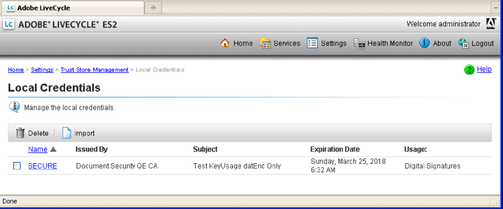

# Werken met referenties {#working-with-credentials}

**Informatie over de Credential Service**

Een referentie bevat uw persoonlijke sleutelgegevens die nodig zijn voor het ondertekenen of identificeren van documenten. Een certificaat is openbare zeer belangrijke informatie die u voor vertrouwen vormt. AEM Forms gebruikt certificaten en referenties voor verschillende doeleinden:

* Acrobat Reader DC-extensies gebruiken een referentie om Adobe Reader-gebruiksrechten in PDF-documenten in te schakelen. (Zie [Gebruiksrechten toepassen op PDF-documenten](/help/forms/developing/assigning-usage-rights.md#applying-usage-rights-to-pdf-documents).)
* De handtekeningservice krijgt toegang tot certificaten en referenties tijdens het uitvoeren van bewerkingen zoals het digitaal ondertekenen van PDF-documenten. (Zie [PDF-documenten digitaal ondertekenen](/help/forms/developing/digitally-signing-certifying-documents.md#digitally-signing-pdf-documents).)

U kunt programmatically met de dienst van de Referentie in wisselwerking staan gebruikend Java API van de Manager van het Vertrouwen. U kunt de volgende taken uitvoeren:

* [Referenties importeren met de Betrouwbaarheidsbeheer-API](credentials.md#importing-credentials-by-using-the-trust-manager-api)
* [Referenties verwijderen met de Betrouwbaarheidsbeheer-API](credentials.md#deleting-credentials-by-using-the-trust-manager-api)

>[!NOTE]
>
>U kunt certificaten ook importeren en verwijderen met behulp van de beheerconsole. (Zie [Help bij beheer.](https://www.adobe.com/go/learn_aemforms_admin_63))

## Referenties importeren met de API {#importing-credentials-by-using-the-trust-manager-api} voor Betrouwbaarheidsbeheer

Met de Betrouwbaarheidsbeheer-API kunt u via programmacode een referentie naar AEM Forms importeren. U kunt bijvoorbeeld een referentie importeren die wordt gebruikt om een PDF-document te ondertekenen. (Zie [PDF-documenten digitaal ondertekenen](/help/forms/developing/digitally-signing-certifying-documents.md#digitally-signing-pdf-documents)).

Wanneer u een referentie importeert, geeft u een alias voor de referentie op. De alias wordt gebruikt om een Forms-bewerking uit te voeren waarvoor een referentie vereist is. Zodra ingevoerd, kan een referentie in beleidsconsole worden bekeken, zoals aangetoond in de volgende illustratie. De alias voor de referentie is *Secure*.

>[!NOTE]
>
>U kunt met webservices geen referentie naar AEM Forms importeren.

### Overzicht van stappen {#summary-of-steps}

Voer de volgende stappen uit om een referentie te importeren in AEM Forms:

1. Inclusief projectbestanden.
1. Creeer een cliënt van de credentiedienst.
1. Verwijs naar de referentie.
1. Voer de importbewerking uit.

**Projectbestanden opnemen**

Neem de benodigde bestanden op in uw ontwikkelingsproject. Als u een clienttoepassing maakt met Java, neemt u de benodigde JAR-bestanden op. Als u webservices gebruikt, moet u ervoor zorgen dat u de proxybestanden opneemt.

De volgende JAR-bestanden moeten worden toegevoegd aan het klassepad van uw project:

* adobe-livecycle-client.jar
* adobe-usermanager-client.jar
* adobe-truststore-client.jar
* adobe-utilities.jar (Vereist als AEM Forms wordt geïmplementeerd op JBoss)
* jbossall-client.jar (vereist als AEM Forms wordt geïmplementeerd op JBoss)

Zie [Including AEM Forms Java-bibliotheekbestanden](/help/forms/developing/invoking-aem-forms-using-java.md#including-aem-forms-java-library-files) voor informatie over de locatie van deze JAR-bestanden.

**Een crediteurenserviceclient maken**

Voordat u via programmacode een referentie naar AEM Forms kunt importeren, maakt u een client voor de referentieservice. Zie [Verbindingseigenschappen instellen](/help/forms/developing/invoking-aem-forms-using-java.md#setting-connection-properties) voor meer informatie.

**Referentie van de referentie**

Verwijs naar een referentie die u in AEM Forms wilt importeren. De snelle start die aan deze sectie is gekoppeld, verwijst naar een P12-bestand in het bestandssysteem.

**De importbewerking uitvoeren**

Importeer de referentie naar AEM Forms nadat u naar de referentie hebt verwezen. Als de referentie niet correct is geïmporteerd, wordt een uitzondering gegenereerd. Wanneer u een referentie importeert, geeft u een alias voor de referentie op.

**Zie ook**

[Referenties importeren met de Java API](credentials.md#import-credentials-using-the-java-api)

[Inclusief AEM Forms Java-bibliotheekbestanden](/help/forms/developing/invoking-aem-forms-using-java.md#including-aem-forms-java-library-files)

[Verbindingseigenschappen instellen](/help/forms/developing/invoking-aem-forms-using-java.md#setting-connection-properties)

[Referentieservice-API: snel aan de slag](/help/forms/developing/credential-service-java-api-quick.md#credential-service-java-api-quick-start-soap)

[Referenties verwijderen met de Betrouwbaarheidsbeheer-API](credentials.md#deleting-credentials-by-using-the-trust-manager-api)

### Referenties importeren met de Java API {#import-credentials-using-the-java-api}

Een referentie importeren in AEM Forms met de Betrouwbaarheidsbeheer-API (Java):

1. Projectbestanden opnemen

   Neem client-JAR-bestanden, zoals adobe-truststore-client.jar, op in het klassenpad van uw Java-project.

1. Een crediteurenserviceclient maken

   * Maak een `ServiceClientFactory`-object dat verbindingseigenschappen bevat.
   * Maak een `CredentialServiceClient`-object door de constructor ervan te gebruiken en het object `ServiceClientFactory` door te geven.

1. Referentie van de referentie

   * Maak een `java.io.FileInputStream`-object met de constructor ervan. Geef een tekenreekswaarde door die de locatie van de referentie opgeeft.
   * Maak een `com.adobe.idp.Document`-object dat de referentie opslaat met de constructor `com.adobe.idp.Document`. Geef het object `java.io.FileInputStream` dat de referentie aan de constructor bevat, door.

1. De importbewerking uitvoeren

   * Maak een array met tekenreeksen die één element bevat. Wijs de waarde `truststore.usage.type.sign` aan het element toe.
   * Roep de methode `importCredential` van het object `CredentialServiceClient` aan en geef de volgende waarden door:

      * Een tekenreekswaarde die de aliaswaarde voor de referentie opgeeft.
      * De instantie `com.adobe.idp.Document` die de referentie opslaat.
      * Een tekenreekswaarde die het wachtwoord opgeeft dat aan de referentie is gekoppeld.
      * De tekenreeks-array die de gebruikswaarde bevat. U kunt bijvoorbeeld deze waarde `truststore.usage.type.sign` opgeven. Als u een Reader Extension-referentie wilt importeren, geeft u `truststore.usage.type.lcre` op.

**Zie ook**

[Referenties importeren met de Betrouwbaarheidsbeheer-API](credentials.md#importing-credentials-by-using-the-trust-manager-api)

[Snel starten (SOAP-modus): Referenties importeren met de Java API](/help/forms/developing/credential-service-java-api-quick.md#quick-start-soap-mode-importing-credentials-using-the-java-api)

[Inclusief AEM Forms Java-bibliotheekbestanden](/help/forms/developing/invoking-aem-forms-using-java.md#including-aem-forms-java-library-files)

[Verbindingseigenschappen instellen](/help/forms/developing/invoking-aem-forms-using-java.md#setting-connection-properties)

## Referenties verwijderen met de API {#deleting-credentials-by-using-the-trust-manager-api} voor Betrouwbaarheidsbeheer

U kunt een referentie programmatically schrappen door de Manager API van het Vertrouwen te gebruiken. Wanneer u een referentie verwijdert, geeft u een alias op die overeenkomt met de referentie. Als deze eenmaal is verwijderd, kan geen referentie worden gebruikt om een bewerking uit te voeren.

>[!NOTE]
>
>U kunt met webservices geen referentie naar AEM Forms verwijderen.

### Overzicht van stappen {#summary_of_steps-1}

Voer de volgende stappen uit om een referentie te verwijderen:

1. Inclusief projectbestanden.
1. Creeer een cliënt van de credentiedienst.
1. Voer de verwijderbewerking uit.

**Projectbestanden opnemen**

Neem de benodigde bestanden op in uw ontwikkelingsproject. Als u een clienttoepassing maakt met Java, neemt u de benodigde JAR-bestanden op. De volgende JAR-bestanden moeten worden toegevoegd aan het klassepad van uw project:

* adobe-livecycle-client.jar
* adobe-usermanager-client.jar
* adobe-truststore-client.jar
* adobe-utilities.jar (Vereist als AEM Forms wordt geïmplementeerd op JBoss)
* jbossall-client.jar (vereist als AEM Forms wordt geïmplementeerd op JBoss)

Zie [Including AEM Forms Java-bibliotheekbestanden](/help/forms/developing/invoking-aem-forms-using-java.md#including-aem-forms-java-library-files) voor informatie over de locatie van deze JAR-bestanden.

**Een crediteurenserviceclient maken**

Alvorens u een referentie programmatically kunt schrappen, creeer een de dienstcliënt van de Integratie van Gegevens. Wanneer u een serviceclient maakt, definieert u verbindingsinstellingen die vereist zijn om een service aan te roepen. Zie [Verbindingseigenschappen instellen](/help/forms/developing/invoking-aem-forms-using-java.md#setting-connection-properties) voor meer informatie.

**De verwijderbewerking uitvoeren**

Als u een referentie wilt verwijderen, geeft u de alias op die overeenkomt met de referentie. Als u een alias opgeeft die niet bestaat, wordt een uitzondering gegenereerd.

**Zie ook**

[Referenties importeren met de Java API](credentials.md#import-credentials-using-the-java-api)

[Inclusief AEM Forms Java-bibliotheekbestanden](/help/forms/developing/invoking-aem-forms-using-java.md#including-aem-forms-java-library-files)

[Verbindingseigenschappen instellen](/help/forms/developing/invoking-aem-forms-using-java.md#setting-connection-properties)

[Referenties importeren met de Java API](credentials.md#import-credentials-using-the-java-api)

### Bevoegdheden verwijderen met de Java API {#deleting-credentials-using-the-java-api}

Een referentie uit AEM Forms verwijderen met de Betrouwbaarheidsbeheer-API (Java):

1. Projectbestanden opnemen

   Neem client-JAR-bestanden, zoals adobe-truststore-client.jar, op in het klassenpad van uw Java-project.

1. Een crediteurenserviceclient maken

   * Maak een `ServiceClientFactory`-object dat verbindingseigenschappen bevat.
   * Maak een `CredentialServiceClient`-object door de constructor ervan te gebruiken en het object `ServiceClientFactory` door te geven.

1. De verwijderbewerking uitvoeren

   Roep de methode `deleteCredential` van het object `CredentialServiceClient` aan en geef een tekenreekswaarde door die de aliaswaarde opgeeft.

**Zie ook**

[Referenties verwijderen met de Betrouwbaarheidsbeheer-API](credentials.md#deleting-credentials-by-using-the-trust-manager-api)

[Snel starten (SOAP-modus): Referenties verwijderen met de Java API](/help/forms/developing/credential-service-java-api-quick.md#quick-start-soap-mode-deleting-credentials-using-the-java-api)

[Inclusief AEM Forms Java-bibliotheekbestanden](/help/forms/developing/invoking-aem-forms-using-java.md#including-aem-forms-java-library-files)

[Verbindingseigenschappen instellen](/help/forms/developing/invoking-aem-forms-using-java.md#setting-connection-properties)
