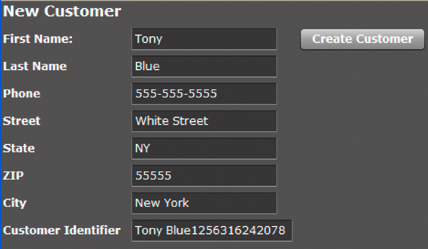

# AEM Forms aanroepen met Verwijderen {#invoking-aem-forms-using-remoting}

In Workbench gemaakte processen kunnen worden aangeroepen door Remoting te gebruiken. Dat wil zeggen dat u een AEM Forms-proces kunt aanroepen vanuit een clienttoepassing die is gebouwd met Flex. Deze eigenschap is gebaseerd op de Diensten van Gegevens.

>[!NOTE]
>
>Wanneer het gebruiken van het Verwijderen, adviseert men dat u processen aanhaalt die in Workbench in tegenstelling tot de diensten van AEM Forms werden gecreeerd. Het is echter mogelijk de diensten van de AEM Forms rechtstreeks aan te roepen. (Zie PDF-documenten versleutelen met Verwijderen in AEM Forms Developer Center.)

>[!NOTE]
>
>Als een dienst van AEM Forms niet wordt gevormd om anonieme toegang toe te staan, resulteren de verzoeken van een Flex cliënt in een Web browser uitdaging. De gebruiker moet gebruikersnaam en wachtwoord invoeren.

Het volgende kortstondige proces van AEM Forms, genoemd `MyApplication/EncryptDocument`, kan worden aangehaald gebruikend het Verwijderen. (Zie het voorbeeld [](/help/forms/developing/aem-forms-processes.md)van een kortstondig proces voor informatie over dit proces, zoals de invoer- en uitvoerwaarden.)


>[!NOTE]
>
>Om een proces van AEM Forms te roepen gebruikend een Flex toepassing, zorg ervoor dat een remoting eindpunt wordt toegelaten. Door gebrek, wordt een remoting eindpunt toegelaten wanneer u een proces opstelt.

Wanneer dit proces wordt aangeroepen, worden de volgende handelingen uitgevoerd:

1. Hiermee wordt het onbeveiligde PDF-document verkregen dat wordt doorgegeven als invoerwaarde. Deze handeling is gebaseerd op de `SetValue` bewerking. De naam van de invoerparameter is `inDoc` en het gegevenstype is `document`. (Het `document` gegevenstype is een beschikbaar gegevenstype in Workbench.)
1. Hiermee versleutelt u het PDF-document met een wachtwoord. Deze handeling is gebaseerd op de `PasswordEncryptPDF` bewerking. De naam van de uitvoerwaarde voor dit proces is `outDoc` en staat voor het PDF-document met een wachtwoord. Het gegevenstype van outDoc is `document`.
1. Hiermee slaat u het met een wachtwoord gecodeerde PDF-document op als een PDF-bestand naar het lokale bestandssysteem. Deze handeling is gebaseerd op de `WriteDocument` bewerking.

>[!NOTE]
>
>Het `MyApplication/EncryptDocument` proces is niet gebaseerd op een bestaand proces van AEM Forms. Om samen met de codevoorbeelden te volgen, creeer een proces genoemd `MyApplication/EncryptDocument` gebruikend Workbench.

>[!NOTE]
>
>Voor informatie over het gebruiken van het Verwijderen om een langdurig proces aan te halen, zie het [Oproepen van mens-Centric langlevende Processen](/help/forms/developing/invoking-human-centric-long-lived.md#invoking-human-centric-long-lived-processes).

**Zie ook**

[Inclusief het Flex-bibliotheekbestand voor AEM Forms](invoking-aem-forms-using-remoting.md#including-the-aem-forms-flex-library-file)

[Documenten verwerken met (Vervangen voor AEM-formulieren) AEM Forms Verwijderen](invoking-aem-forms-using-remoting.md#handling-documents-with-remoting)

[Een kortstondig proces aanroepen door een onbeveiligd document door te geven met (Vervangen voor AEM-formulieren) AEM Forms Verwijderen](invoking-aem-forms-using-remoting.md#invoking-a-short-lived-process-by-passing-an-unsecure-document-using-remoting)

[Client-toepassingen verifiëren die zijn gemaakt met Flex](invoking-aem-forms-using-remoting.md#authenticating-client-applications-built-with-flex)

[Beveiligde documenten doorgeven om processen aan te roepen met Verwijderen](invoking-aem-forms-using-remoting.md#passing-secure-documents-to-invoke-processes-using-remoting)

[Aanroepen van aangepaste componentenservices met Remoting](invoking-aem-forms-using-remoting.md#invoking-custom-component-services-using-remoting)

[Een clienttoepassing maken die is gebouwd met Flex en die een menselijk-centrisch proces van lange duur aanroept](/help/forms/developing/invoking-human-centric-long-lived.md#creating-a-client-application-built-with-flex-that-invokes-a-human-centric-long-lived-process)

[Flash Builder-toepassingen maken die SSO-verificatie uitvoeren met behulp van HTTP-tokens](/help/forms/developing/creating-flash-builder-applications-perform.md#creating-flash-builder-applications-that-perform-sso-authentication-using-http-tokens)

Voor informatie over hoe te om procesgegevens in een Flex grafiekcontrole te tonen, zie het [Toon van het procesgegevens van AEM Forms in Flex grafieken](https://www.adobe.com/devnet/livecycle/articles/populating_flexcontrols.html).

>[!NOTE]
>
>*Plaats het bestand crossdomain.xml op de juiste plaats. Stel bijvoorbeeld dat u AEM Forms hebt geïmplementeerd op JBoss: &lt;install_directory>\Adobe_Experience_Manager_forms\jboss\server\lc_turnkey\deploy\jboss-web.deployer\ROOT.war.*

## Inclusief het Flex-bibliotheekbestand voor AEM Forms {#including-the-aem-forms-flex-library-file}

Als u AEM Forms-processen programmatisch wilt aanroepen met Remoting, voegt u het bestand adobe-remoting-provider.swc toe aan het klassepad van uw Flex-project. Dit SWC-bestand bevindt zich op de volgende locatie:

* *&lt;install_directory>\Adobe_Experience_Manager_forms\sdk\misc\DataServices\Client-Libraries*

   waarbij &lt;*install_directory*> de map is waarin AEM Forms zijn geïnstalleerd.

**Zie ook**

[AEM Forms aanroepen met (Vervangen voor AEM-formulieren) AEM Forms verwijderen](invoking-aem-forms-using-remoting.md#invoking-aem-forms-using-remoting)

[Documenten verwerken met (Vervangen voor AEM-formulieren) AEM Forms Verwijderen](invoking-aem-forms-using-remoting.md#handling-documents-with-remoting)

[Een kortstondig proces aanroepen door een onbeveiligd document door te geven met (Vervangen voor AEM-formulieren) AEM Forms Verwijderen](invoking-aem-forms-using-remoting.md#invoking-a-short-lived-process-by-passing-an-unsecure-document-using-remoting)

[Client-toepassingen verifiëren die zijn gemaakt met Flex](invoking-aem-forms-using-remoting.md#authenticating-client-applications-built-with-flex)

## Documenten verwerken met Verwijderen {#handling-documents-with-remoting}

Een van de belangrijkste niet-primitieve Java-typen die in AEM Forms wordt gebruikt, is de `com.adobe.idp.Document` klasse. Een document wordt doorgaans vereist om een bewerking AEM Forms aan te roepen. Het is voornamelijk een PDF-document, maar kan ook andere documenttypen bevatten, zoals SWF, HTML, XML of een DOC-bestand. (Zie Gegevens [doorgeven aan AEM Forms-services met de Java API](/help/forms/developing/invoking-aem-forms-using-java.md#passing-data-to-aem-forms-services-using-the-java-api).)

Een clienttoepassing die met Flex is gebouwd, kan niet rechtstreeks een document aanvragen. U kunt Adobe Reader bijvoorbeeld niet starten om een URL aan te vragen waarmee een PDF-bestand wordt gemaakt. Verzoeken om documenttypen, zoals PDF- en Microsoft Word-documenten, retourneren een resultaat dat een URL is. Het is de verantwoordelijkheid van de client om de inhoud van de URL weer te geven. Met de service Documentbeheer kunt u informatie over de URL en het inhoudstype genereren. Verzoeken om XML-documenten retourneren het volledige XML-document in het resultaat.

### Een document doorgeven als een invoerparameter {#passing-a-document-as-an-input-parameter}

Een clienttoepassing die is gebouwd met Flex, kan een document niet rechtstreeks doorgeven aan een AEM Forms-proces. In plaats daarvan gebruikt de clienttoepassing een instantie van de `mx.rpc.livecycle.DocumentReference` ActionScript-klasse om invoerparameters door te geven aan een bewerking die een `com.adobe.idp.Document` instantie verwacht. Een Flex-clienttoepassing heeft verschillende opties voor het instellen van een `DocumentReference` object:

* Wanneer het document zich op de server bevindt en de bestandslocatie bekend is, stelt u de eigenschap referenceType van het object DocumentReference in op REF_TYPE_FILE. Stel de eigenschap fileRef in op de locatie van het bestand, zoals in het volgende voorbeeld:

```java
 ... var docRef: DocumentReference = new DocumentReference(); 
 docRef.referenceType = DocumentReference.REF_TYPE_FILE; 
 docRef.fileRef = "C:/install/adobe/cs2/How to Uninstall.pdf"; ...
```

* Wanneer het document zich op de server bevindt en u de URL kent, stelt u de eigenschap referenceType van het object DocumentReference in op REF_TYPE_URL. Stel de eigenschap url in op de URL, zoals in het volgende voorbeeld wordt getoond:

```java
... var docRef: DocumentReference = new DocumentReference(); 
docRef.referenceType = DocumentReference.REF_TYPE_URL; 
docRef.url = "https://companyserver:8080/DocumentManager/116/7855"; ...
```

* Als u een object DocumentReference wilt maken van een tekenreeks in de clienttoepassing, stelt u de eigenschap referenceType van het object DocumentReference in op REF_TYPE_INLINE. Stel de eigenschap text in op de tekst die u in het object wilt opnemen, zoals in het volgende voorbeeld wordt getoond:

```java
... var docRef: DocumentReference = new DocumentReference(); 
docRef.referenceType = DocumentReference.REF_TYPE_INLINE; 
docRef.text = "Text for my document";  // Optionally, you can override the server’s default character set  // if necessary:  // docRef.charsetName=CharacterSetName  ...
```

* Als het document zich niet op de server bevindt, gebruikt u het verwijderbare uploadserver om een document te uploaden naar AEM Forms. Nieuw in AEM Forms is de mogelijkheid om beveiligde documenten te uploaden. Wanneer u een beveiligd document uploadt, moet u een gebruiker gebruiken die de rol Gebruiker *van de Toepassing van de Toepassing van het* Document uploadt. Zonder deze rol kan de gebruiker geen beveiligd document uploaden. U wordt aangeraden een beveiligd document met één aanmeldingsnaam te uploaden. (Zie Beveiligde documenten [doorgeven om processen aan te roepen met behulp van Verwijderen](invoking-aem-forms-using-remoting.md#passing-secure-documents-to-invoke-processes-using-remoting).)

>[!NOTE]
als AEM Forms zijn geconfigureerd om onbeveiligde documenten te uploaden, kunt u een gebruiker gebruiken die niet de gebruikersrol Document Upload Application User heeft om een document te uploaden. Een gebruiker kan ook beschikken over de machtiging Document uploaden. Als AEM Forms echter zijn geconfigureerd om alleen beveiligde documenten toe te staan, moet u ervoor zorgen dat de gebruiker beschikt over de rol Gebruiker van document uploaden of de machtiging Uploaden document. (Zie AEM Forms [configureren voor het accepteren van beveiligde en onbeveiligde documenten](invoking-aem-forms-using-remoting.md#configuring-aem-forms-to-accept-secure-and-unsecure-documents).

U gebruikt standaard Flash-uploadmogelijkheden voor de opgegeven upload-URL: `https://SERVER:PORT/remoting/lcfileupload`. Vervolgens kunt u het `DocumentReference` object gebruiken op de plaats waar een invoerparameter van het type `Document` wordt verwacht` private function startUpload():void  {  fileRef.addEventListener(Event.SELECT, selectHandler);  fileRef.addEventListener("uploadCompleteData", completeHandler);  try  {   var success:Boolean = fileRef.browse();  }    catch (error:Error)  {   trace("Unable to browse for files.");  }  }      private function selectHandler(event:Event):void {  var request:URLRequest = new  URLRequest("https://SERVER:PORT/remoting/lcfileupload")  try   {   fileRef.upload(request);   }    catch (error:Error)   {   trace("Unable to upload file.");   }  }    private function completeHandler(event:DataEvent):void  {   var params:Object = new Object();   var docRef:DocumentReference = new DocumentReference();   docRef.url = event.data as String;   docRef.referenceType = DocumentReference.REF_TYPE_URL;  }`. Met Snel starten verwijderen wordt het verwijderbare uploadservlet gebruikt om een PDF-bestand door te geven aan het `MyApplication/EncryptDocument`proces. (Zie Een kortstondig proces [aanroepen door een onbeveiligd document door te geven met AEM Forms Remoting](invoking-aem-forms-using-remoting.md#invoking-a-short-lived-process-by-passing-an-unsecure-document-using-remoting)(Verouderd voor AEM-formulieren).)

```java
 
private
function startUpload(): void  { 
 fileRef.addEventListener(Event.SELECT, selectHandler); 
 fileRef.addEventListener("uploadCompleteData", completeHandler); 
 try  { 
  var success: Boolean = fileRef.browse(); 
 }  
 catch (error: Error)  { 
  trace("Unable to browse for files."); 
 } 
}   
private
function selectHandler(event: Event): void { 
 var request: URLRequest = new  URLRequest("https://SERVER:PORT/remoting/lcfileupload")  try  { 
  fileRef.upload(request); 
 }  
 catch (error: Error)  { 
  trace("Unable to upload file."); 
 } 
}  
private
function completeHandler(event: DataEvent): void  { 
 var params: Object = new Object(); 
 var docRef: DocumentReference = new DocumentReference(); 
 docRef.url = event.data as String; 
 docRef.referenceType = DocumentReference.REF_TYPE_URL; 
}
```

In het dialoogvenster Snel starten verwijderen wordt het verwijderbare uploadserver gebruikt om een PDF-bestand door te geven aan het `MyApplication/EncryptDocument`proces. (Zie Een kortstondig proces [aanroepen door een onbeveiligd document door te geven met AEM Forms Remoting](invoking-aem-forms-using-remoting.md#invoking-a-short-lived-process-by-passing-an-unsecure-document-using-remoting)(Verouderd voor AEM-formulieren).)

### Een document terugsturen naar een clienttoepassing {#passing-a-document-back-to-a-client-application}

Een cliënttoepassing ontvangt een voorwerp van type `mx.rpc.livecycle.DocumentReference` voor een de dienstverrichting die een `com.adobe.idp.Document` instantie als outputparameter terugkeert. Omdat een clienttoepassing werkt met ActionScript-objecten en niet met Java, kunt u een op Java gebaseerd Document-object niet teruggeven aan een Flex-client. In plaats daarvan genereert de server een URL voor het document en geeft de URL weer door aan de client. De `DocumentReference` eigenschap van het `referenceType` object geeft aan of de inhoud zich in het `DocumentReference` object bevindt of moet worden opgehaald van een URL in de `DocumentReference.url` eigenschap. De `DocumentReference.contentType` eigenschap geeft het type document aan.

**Zie ook**

[AEM Forms aanroepen met (Vervangen voor AEM-formulieren) AEM Forms verwijderen](invoking-aem-forms-using-remoting.md#invoking-aem-forms-using-remoting)

[Inclusief het Flex-bibliotheekbestand voor AEM Forms](invoking-aem-forms-using-remoting.md#including-the-aem-forms-flex-library-file)

[Een kortstondig proces aanroepen door een onbeveiligd document door te geven met (Vervangen voor AEM-formulieren) AEM Forms Verwijderen](invoking-aem-forms-using-remoting.md#invoking-a-short-lived-process-by-passing-an-unsecure-document-using-remoting)

[Client-toepassingen verifiëren die zijn gemaakt met Flex](invoking-aem-forms-using-remoting.md#authenticating-client-applications-built-with-flex)

[Beveiligde documenten doorgeven om processen aan te roepen met Verwijderen](invoking-aem-forms-using-remoting.md#passing-secure-documents-to-invoke-processes-using-remoting)

## Een kortstondig proces aanroepen door een onbeveiligd document door te geven met Verwijderen {#invoking-a-short-lived-process-by-passing-an-unsecure-document-using-remoting}

Om een proces van AEM Forms van een toepassing aan te halen die met Flex wordt gebouwd, voer de volgende taken uit:

1. Maak een `mx:RemoteObject` instantie.
1. Maak een `ChannelSet` instantie.
1. Geef de vereiste invoerwaarden door.
1. Retourwaarden verwerken.

>[!NOTE]
In deze sectie wordt beschreven hoe u een AEM Forms-proces activeert en een document uploadt wanneer AEM Forms zijn geconfigureerd voor het uploaden van onbeveiligde documenten. Voor informatie over hoe te om AEM Forms te roepen processen en veilige documenten te uploaden en hoe te om AEM Forms te vormen om veilige en onveilige documenten goed te keuren, zie het [overgaan van veilige documenten om processen aan te halen gebruikend het Verwijderen](invoking-aem-forms-using-remoting.md#passing-secure-documents-to-invoke-processes-using-remoting).

**Een mx:RemoteObject-instantie maken**

U maakt een `mx:RemoteObject` instantie om een in Workbench gemaakt AEM Forms-proces aan te roepen. Geef de volgende waarden op om een `mx:RemoteObject` instantie te maken:

* **id:** De naam van de `mx:RemoteObject` instantie die het aan te roepen proces vertegenwoordigt.
* **bestemming:** De naam van het AEM Forms-proces dat moet worden aangeroepen. Als u bijvoorbeeld het `MyApplication/EncryptDocument` proces wilt aanroepen, geeft u op `MyApplication/EncryptDocument`.
* **resultaat:** De naam van de Flex methode die het resultaat behandelt.

Geef binnen de `mx:RemoteObject` tag een `<mx:method>` tag op met de naam van de oproepmethode van het proces. De naam van een aanroepingsmethode van Forms is doorgaans `invoke`.

In het volgende codevoorbeeld wordt een `mx:RemoteObject` instantie gemaakt die het `MyApplication/EncryptDocument` proces aanroept.

```java
 <mx:RemoteObject id="EncryptDocument" destination="MyApplication/EncryptDocument" result="resultHandler(event);">
          <mx:method name="invoke" result="handleExecuteInvoke(event)"/>
      </mx:RemoteObject>
```

**Een kanaal naar AEM Forms maken**

Een clienttoepassing kan AEM Forms aanroepen door een kanaal op te geven in MXML of ActionScript, zoals in het volgende ActionScript-voorbeeld wordt getoond. Het kanaal moet een `AMFChannel`, `SecureAMFChannel`, `HTTPChannel`of `SecureHTTPChannel`zijn.

```java
     ...
     private function refresh():void{
         var cs:ChannelSet= new ChannelSet();
         cs.addChannel(new AMFChannel("my-amf",
             "https://yourlcserver:8080/remoting/messagebroker/amf"));
         EncryptDocument.setCredentials("administrator", "password");
         EncryptDocument.channelSet = cs;
     }
     ...
```

Wijs de `ChannelSet` instantie toe aan het `mx:RemoteObject` veld van de `channelSet` instantie (zoals in het vorige codevoorbeeld). Over het algemeen importeert u de kanaalklasse in een importinstructie in plaats van de volledig gekwalificeerde naam op te geven wanneer u de `ChannelSet.addChannel` methode aanroept.

**Invoerwaarden doorgeven**

Een in Workbench gemaakt proces kan nul of meer invoerparameters gebruiken en een uitvoerwaarde retourneren. Een cliënttoepassing gaat inputparameters binnen een `ActionScript` voorwerp met gebieden over die aan parameters beantwoorden die tot het proces van AEM Forms behoren. Voor het kortstondige proces met de naam `MyApplication/EncryptDocument`, is één invoerparameter met de naam `inDoc`. De naam van de bewerking die door het proces wordt weergegeven, is `invoke` (de standaardnaam voor een kortstondig proces). (Zie AEM Forms [aanroepen met (Vervangen voor AEM-formulieren) AEM Forms verwijderen](invoking-aem-forms-using-remoting.md#invoking-aem-forms-using-remoting).)

In het volgende codevoorbeeld wordt een PDF-document aan het `MyApplication/EncryptDocument` proces doorgegeven:

```java
     ...
     var params:Object = new Object();
 
     //Document is an instance of DocumentReference
     //that store an unsecured PDF document
     params["inDoc"] = pdfDocument;
 
     // Invoke an operation synchronously:
     EncryptDocument.invoke(params);
     ...
```

In dit codevoorbeeld `pdfDocument` is dit een `DocumentReference` instantie die een onbeveiligd PDF-document bevat. Voor informatie over een `DocumentReference`, zie het [Behandelen van documenten met (Vervangen voor AEM vormen) AEM Forms het Verwijderen](invoking-aem-forms-using-remoting.md#handling-documents-with-remoting).

**Een specifieke versie van een service aanroepen**

U kunt een specifieke versie van de dienst van Vormen aanhalen door een `_version` parameter in de de parameterkaart van de aanroeping te gebruiken. Bijvoorbeeld, om versie 1.2 van de `MyApplication/EncryptDocument` dienst aan te halen:

```java
 var params:Object = new Object();
 params["inDoc"] = pdfDocument;
 params["_version"] = "1.2"
 var token:AsyncToken = echoService.echoString(params);
```

De `version` parameter moet een tekenreeks met één punt zijn. De waarden aan de linkerzijde, de belangrijkste versie, en juiste, minder belangrijke versie, van de periode moeten gehelen zijn. Als deze parameter niet wordt gespecificeerd, wordt de hoofd actieve versie aangehaald.

**Retourwaarden afhandelen**

AEM Forms verwerken uitvoerparameters worden gedeserialiseerd naar ActionScript-objecten waaruit de clienttoepassing specifieke parameters op naam extraheert, zoals in het volgende voorbeeld wordt getoond. (De uitvoerwaarde van het `MyApplication/EncryptDocument` proces wordt genoemd `outDoc`.)

```java
     ...
     var res:Object = event.result;
     var docRef:DocumentReference = res["outDoc"] as DocumentReference;
     ...
```

**Het MyApplication/EncryptDocument-proces aanroepen**

U kunt het `MyApplication/EncryptDocument` proces aanroepen door de volgende stappen uit te voeren:

1. Maak een `mx:RemoteObject` instantie via ActionScript of MXML. Zie Een instantie mx:RemoteObject maken.
1. Stel een `ChannelSet` instantie in voor communicatie met AEM Forms en koppel deze aan de `mx:RemoteObject` instantie. Zie Een kanaal naar AEM Forms maken.
1. Roep de `login` methode van ChannelSet of de `setCredentials` methode van de dienst aan om de waarde en het wachtwoord van het gebruikersherkenningsteken te specificeren. (Zie Single Sign-On [gebruiken](invoking-aem-forms-using-remoting.md#using-single-sign-on).)
1. Een `mx.rpc.livecycle.DocumentReference` exemplaar vullen met een onbeveiligd PDF-document dat aan het `MyApplication/EncryptDocument` proces wordt doorgegeven. (Zie Een document [doorgeven als een invoerparameter](invoking-aem-forms-using-remoting.md#passing-a-document-as-an-input-parameter).)
1. Codeer het PDF-document door de `mx:RemoteObject` methode van het `invoke` exemplaar aan te roepen. Geef door `Object` welke de invoerparameter bevat (dit is het onbeveiligde PDF-document). Zie Invoerwaarden doorgeven.
1. Haal het PDF-document met wachtwoordversleuteling op dat tijdens het proces wordt geretourneerd. Zie Retourwaarden afhandelen.

[Snel starten: Een kortstondig proces aanroepen door een onbeveiligd document door te geven met (Vervangen voor AEM-formulieren) AEM Forms Verwijderen](/help/forms/developing/invocation-api-quick-starts.md#quick-start-invoking-a-short-lived-process-by-passing-an-unsecure-document-using-deprecated-for-aem-forms-aem-forms-remoting)

## Client-toepassingen verifiëren die zijn gemaakt met Flex {#authenticating-client-applications-built-with-flex}

Er zijn verschillende manieren waarop AEM-formulieren door gebruikersbeheer een aanvraag Remoting uit een Flex-toepassing kunnen verifiëren, waaronder één aanmelding voor AEM Forms via de centrale aanmeldingsservice, basisverificatie en aangepaste verificatie. Wanneer noch enige teken-op noch anonieme toegang wordt toegelaten, resulteert een verwijderend verzoek in of basisauthentificatie (het gebrek) of douaneauthentificatie.

De basisauthentificatie baseert zich op standaardJ2EE basisauthentificatie van de container van de Webtoepassing. Voor basisauthentificatie, veroorzaakt een fout van HTTP 401 een browser uitdaging. Dat betekent dat wanneer u probeert verbinding te maken met een Forms-toepassing met behulp van RemoteObject en zich nog niet hebt aangemeld bij de Flex-toepassing, de browser u om een gebruikersnaam en wachtwoord vraagt.

Voor douaneauthentificatie, verzendt de server een fout naar de cliënt om erop te wijzen dat de authentificatie wordt vereist.

>[!NOTE]
Voor informatie over het uitvoeren van authentificatie die de tokens van HTTP gebruikt, zie het [Creëren van de toepassingen van de Bouwer van de Flits die authentificatie uitvoeren SSO gebruikend de tokens](/help/forms/developing/creating-flash-builder-applications-perform.md#creating-flash-builder-applications-that-perform-sso-authentication-using-http-tokens)van HTTP.

### Aangepaste verificatie gebruiken {#using-custom-authentication}

U laat douaneauthentificatie in beleidsconsole toe door de authentificatiemethode van Basis in Douane op het remoting eindpunt te veranderen. Als u douaneauthentificatie gebruikt, roept uw cliënttoepassing de `ChannelSet.login` methode aan login en de `ChannelSet.logout` methode aan logout.

>[!NOTE]
In de vorige versie van AEM Forms, zond u geloofsbrieven naar een bestemming door de `RemoteObject.setCredentials` methode te roepen. De `setCredentials` methode heeft de gegevens pas daadwerkelijk doorgegeven aan de server als de component voor het eerst probeert verbinding te maken met de server. Daarom als de component een foutengebeurtenis uitbracht, kon u niet zeker zijn als de fout wegens een authentificatiefout, of om een andere reden gebeurde. De `ChannelSet.login` methode verbindt met de server wanneer u het roept zodat u een authentificatiekwestie kunt onmiddellijk behandelen. Hoewel u de `setCredentials` methode kunt blijven gebruiken, wordt aangeraden de `ChannelSet.login` methode te gebruiken.

Omdat de veelvoudige bestemmingen de zelfde kanalen, en het overeenkomstige voorwerp kunnen gebruiken ChannelSet, het programma openen aan één bestemming registreert de gebruiker aan een andere bestemming die het zelfde kanaal of de kanalen gebruikt. Als twee componenten verschillende geloofsbrieven op het zelfde voorwerp toepassen ChannelSet, worden de laatste toegepaste geloofsbrieven gebruikt. Als de veelvoudige componenten het zelfde voor authentiek verklaarde voorwerp ChannelSet gebruiken, het roepen van de `logout` methode registreert alle componenten uit de bestemmingen.

In het volgende voorbeeld worden de methoden `ChannelSet.login` en `ChannelSet.logout` methoden gebruikt met een RemoteObject-besturingselement. Deze toepassing voert de volgende handelingen uit:

* Maakt een `ChannelSet` object in de `creationComplete` handler dat de kanalen vertegenwoordigt die door de `RemoteObject` component worden gebruikt
* Hiermee worden referenties aan de server doorgegeven door het aanroepen van de `ROLogin` functie als reactie op een klikgebeurtenis Button
* Gebruikt de component RemoteObject om een Koord naar de server te verzenden in antwoord op een Button klikgebeurtenis. De server retourneert dezelfde String terug naar de RemoteObject-component.
* Gebruikt de resultaatgebeurtenis van de component RemoteObject om het Koord in een controle te tonen TextArea
* Logs uit de server door de `ROLogout` functie in antwoord op een Button klikgebeurtenis te roepen

```java
 <?xml version=”1.0”?>
 <!-- security/SecurityConstraintCustom.mxml -->
 <mx:Application xmlns:mx=”https://www.adobe.com/2006/mxml” width=”100%”
     height=”100%” creationComplete=”creationCompleteHandler();”>
 
     <mx:Script>
         <![CDATA[
             import mx.controls.Alert;
             import mx.messaging.config.ServerConfig;
             import mx.rpc.AsyncToken;
             import mx.rpc.AsyncResponder;
             import mx.rpc.events.FaultEvent;
             import mx.rpc.events.ResultEvent;
             import mx.messaging.ChannelSet;
 
             // Define a ChannelSet object.
             public var cs:ChannelSet;
 
             // Define an AsyncToken object.
             public var token:AsyncToken;
 
             // Initialize ChannelSet object based on the
             // destination of the RemoteObject component.
             private function creationCompleteHandler():void {
                 if (cs == null)
                 cs = ServerConfig.getChannelSet(remoteObject.destination);
             }
 
             // Login and handle authentication success or failure.
             private function ROLogin():void {
                 // Make sure that the user is not already logged in.
                 if (cs.authenticated == false) {
                     token = cs.login(“sampleuser”, “samplepassword”);
                     // Add result and fault handlers.
                     token.addResponder(new AsyncResponder(LoginResultEvent,
                     LoginFaultEvent));
                 }
             }
 
             // Handle successful login.
             private function LoginResultEvent(event:ResultEvent,
                 token:Object=null):void  {
                     switch(event.result) {
                         case “success”:
                             authenticatedCB.selected = true;
                             break;
                             default:
                     }
                 }
 
                 // Handle login failure.
                 private function LoginFaultEvent(event:FaultEvent,
                     token:Object=null):void {
                         switch(event.fault.faultCode) {
                             case “Client.Authentication”:
                                 default:
                                 authenticatedCB.selected = false;
                                 Alert.show(“Login failure: “ + event.fault.faultString);
                     }
                 }
 
                 // Logout and handle success or failure.
                 private function ROLogout():void {
                     // Add result and fault handlers.
                     token = cs.logout();
                     token.addResponder(new
                         AsyncResponder(LogoutResultEvent,LogoutFaultEvent));
                 }
 
                 // Handle successful logout.
                 private function LogoutResultEvent(event:ResultEvent,
                     token:Object=null):void {
                         switch (event.result) {
                             case “success”:
                                 authenticatedCB.selected = false;
                                 break;
                                 default:
                     }
                 }
 
                 // Handle logout failure.
                 private function LogoutFaultEvent(event:FaultEvent,
                     token:Object=null):void {
                         Alert.show(“Logout failure: “ + event.fault.faultString);
                 }
                 // Handle message recevied by RemoteObject component.
                 private function resultHandler(event:ResultEvent):void {
                     ta.text += “Server responded: “+ event.result + “\n”;
                 }
 
                 // Handle fault from RemoteObject component.
                 private function faultHandler(event:FaultEvent):void {
                     ta.text += “Received fault: “ + event.fault + “\n”;
                 }
             ]]>
     </mx:Script>
     <mx:HBox>
         <mx:Label text=”Enter a text for the server to echo”/>
         <mx:TextInput id=”ti” text=”Hello World!”/>
         <mx:Button label=”Login”
             click=”ROLogin();”/>
         <mx:Button label=”Echo”
             enabled=”{authenticatedCB.selected}”
             click=”remoteObject.echo(ti.text);”/>
         <mx:Button label=”Logout”
             click=”ROLogout();”/>
         <mx:CheckBox id=”authenticatedCB”
             label=”Authenticated?”
             enabled=”false”/>
     </mx:HBox>
     <mx:TextArea id=”ta” width=”100%” height=”100%”/>
 
     <mx:RemoteObject id=”remoteObject”
         destination=”myDest”
         result=”resultHandler(event);”
         fault=”faultHandler(event);”/>
 </mx:Application>
```

De methoden `login` `logout` en retourneren een AsyncToken-object. Wijs gebeurtenismanagers aan het voorwerp AsyncToken voor de resultaatgebeurtenis toe om een succesvolle vraag te behandelen, en voor de foutengebeurtenis om een mislukking te behandelen.

### Single Sign-On gebruiken {#using-single-sign-on}

Gebruikers van AEM-formulieren kunnen verbinding maken met meerdere webtoepassingen voor AEM Forms om een taak uit te voeren. Wanneer gebruikers van de ene webtoepassing naar de andere gaan, is het niet efficiënt om van hen te verlangen dat zij zich afzonderlijk bij elke webtoepassing aanmelden. Met het Single Sign-On-mechanisme AEM Forms kunnen gebruikers zich eenmaal aanmelden en vervolgens toegang krijgen tot alle AEM Forms webtoepassingen. Omdat de ontwikkelaars van AEM Forms cliënttoepassingen voor gebruik met AEM Forms kunnen tot stand brengen, moeten zij ook uit het enige sign-on mechanisme kunnen voordeel halen.

Elke AEM Forms-webtoepassing wordt verpakt in een eigen WAR-bestand (Web Archive), dat vervolgens wordt verpakt als onderdeel van een EAR-bestand (Enterprise Archive). Omdat een toepassingsserver het delen van zittingsgegevens over verschillende Webtoepassingen niet toestaat, gebruiken de AEM Forms de koekjes van HTTP om authentificatieinformatie op te slaan. Met verificatiecookies kan een gebruiker zich aanmelden bij een Forms-toepassing en vervolgens verbinding maken met andere AEM Forms-webtoepassingen. Deze techniek wordt Single Sign-On genoemd.

AEM Forms-ontwikkelaars schrijven clienttoepassingen om de functionaliteit van formulierhulplijnen (afgekeurd) uit te breiden en de werkruimte aan te passen. Een Workspace-toepassing kan bijvoorbeeld een proces starten. De cliënttoepassing gebruikt dan een remoting eindpunt om gegevens van de dienst van Vormen terug te winnen.

Wanneer de dienst van AEM Forms wordt aangehaald gebruikend (Vervangen voor AEM vormen) AEM Forms die, de cliënttoepassing het authentificatiecookie als deel van het verzoek overgaat. Aangezien de gebruiker al is geverifieerd, is geen aanvullende aanmelding vereist om verbinding te maken van de clienttoepassing met de service AEM Forms.

>[!NOTE]
Als een cookie ongeldig is of ontbreekt, wordt niet impliciet omgeleid naar een aanmeldingspagina. Daarom kunt u nog een anonieme dienst roepen.

U kunt het AEM Forms enige sign-on mechanisme omzeilen door een cliënttoepassing te schrijven die het programma opent en zich op zich aanmeldt. Als u het Single Sign-On mechanisme omzeilt, kunt u of basis of douaneauthentificatie met uw toepassing gebruiken.

Omdat dit mechanisme niet het enige sign-on mechanisme van AEM Forms gebruikt, wordt geen authentificatiecookie geschreven aan de cliënt. Aanmeldingsgegevens worden opgeslagen in het `ChannelSet` object voor het externe kanaal. Daarom worden om het even welke `RemoteObject` `ChannelSet` vraag u over het zelfde maakt gemaakt in de context van die geloofsbrieven.

### Single Sign-On instellen in AEM Forms {#setting-up-single-sign-on-in-aem-forms}

Als u Single Sign-On wilt gebruiken in AEM Forms, installeert u de component voor de formulierwerkstroom, die de gecentraliseerde aanmeldingsservice bevat. Nadat een gebruiker zich met succes heeft aangemeld, retourneert de gecentraliseerde aanmeldingsservice een verificatiecookie voor de gebruiker. Elke volgende aanvraag voor een Forms-webtoepassing bevat de cookie. Als het cookie geldig is, wordt de gebruiker beschouwd als zijnde geverifieerd en hoeft u zich niet opnieuw aan te melden.

### Een clienttoepassing schrijven die gebruikmaakt van Single Sign-On {#writing-a-client-application-that-uses-single-sign-on}

Wanneer u van het enige sign-on mechanisme voordeel haalt, verwacht u gebruikers om login door de gecentraliseerde login dienst te gebruiken alvorens een cliënttoepassing te beginnen. Met andere woorden, een clienttoepassing meldt zich niet aan via de browser of door de `ChannelSet.login` methode aan te roepen.

Als u het AEM Forms enige sign-on mechanisme gebruikt, vorm het Remoting eindpunt om douaneauthentificatie, niet basis te gebruiken. Anders, wanneer het gebruiken van basisauthentificatie, veroorzaakt een authentificatiefout een browser uitdaging, die u niet de gebruiker wilt zien. In plaats daarvan detecteert uw toepassing de verificatiefout en wordt een bericht weergegeven waarin de gebruiker wordt opgedragen zich aan te melden met de gecentraliseerde aanmeldingsservice.

Een cliënttoepassing heeft toegang tot AEM Forms door een remoting eindpunt door de `RemoteObject` component te gebruiken, zoals het volgende voorbeeld toont.

```java
 <?xml version="1.0"?>
 <mx:Application
        backgroundColor="#FFFFFF">
 
       <mx:Script>
          <![CDATA[
 
            import mx.controls.Alert;
            import mx.rpc.events.FaultEvent;
 
            // Prompt user to login on a fault.
            private function faultHandler(event:FaultEvent):void
            {
             if(event.fault.faultCode=="Client.Authentication")
             {
                 Alert.show(
                     event.fault.faultString + "\n" +
                     event.fault.faultCode + "\n" +
                     "Please login to continue.");
             }
         }
          ]]>
       </mx:Script>
 
       <mx:RemoteObject id="srv"
           destination="product"
           fault="faultHandler(event);"/>
 
       <mx:DataGrid
           width="100%" height="100%"
           dataProvider="{srv.getProducts.lastResult}"/>
 
       <mx:Button label="Get Data"
           click="srv.getProducts();"/>
 
 </mx:Application>
```

**Aanmelden als een nieuwe gebruiker terwijl de Flex-toepassing nog actief is**

Een toepassing die met Flex wordt gebouwd omvat het authentificatiecookie met elk verzoek aan de dienst van AEM Forms. Om prestatieredenen valideert AEM Forms de cookie niet op elk verzoek. Nochtans, ontdekken de AEM Forms wanneer een authentificatiecookie met een ander authentificatiecookie wordt vervangen.

U start bijvoorbeeld een clienttoepassing en wanneer de toepassing actief is, gebruikt u de gecentraliseerde aanmeldingsservice om u af te melden. Vervolgens kunt u zich aanmelden als een andere gebruiker. Aanmelden als een andere gebruiker vervangt het bestaande verificatiecookie door een verificatiecookie voor de nieuwe gebruiker.

Op het volgende verzoek van de cliënttoepassing, ontdekt de AEM Forms dat het koekje is veranderd, en logout de gebruiker. Daarom ontbreekt het eerste verzoek na een koekjesverandering. Alle volgende verzoeken worden gedaan in het kader van het nieuwe cookie en zijn succesvol.

**Afmelden**

Als u zich wilt afmelden bij AEM Forms en een sessie ongeldig wilt maken, moet het verificatiecookie worden verwijderd van de computer van de client. Omdat het doel van Single Sign-On is om een gebruiker toe te staan zich één keer aan te melden, wilt u geen cliënttoepassing om het koekje te schrappen. Met deze handeling wordt de gebruiker uitgelogd.

Daarom produceert het roepen van de `RemoteObject.logout` methode in een cliënttoepassing een foutenmelding op de cliënt die specificeert dat de zitting niet het programma wordt geopend. In plaats daarvan kan de gebruiker de gecentraliseerde aanmeldingsservice gebruiken om zich af te melden en het verificatiecookie te verwijderen.

**Afmelden terwijl de Flex-toepassing nog actief is**

U kunt een clienttoepassing starten die met Flex is gebouwd en de gecentraliseerde aanmeldingsservice gebruiken om u af te melden. Als onderdeel van het logout-proces wordt het verificatiecookie verwijderd. Als een verwijderingsaanvraag wordt ingediend zonder cookie of met een ongeldig cookie, wordt de gebruikerssessie ongeldig. Deze actie is in feite een logout. De volgende keer dat de clienttoepassing probeert verbinding te maken met een AEM Forms-service, wordt de gebruiker gevraagd zich aan te melden.

**Zie ook**

[AEM Forms aanroepen met (Vervangen voor AEM-formulieren) AEM Forms verwijderen](invoking-aem-forms-using-remoting.md#invoking-aem-forms-using-remoting)

[Documenten verwerken met (Vervangen voor AEM-formulieren) AEM Forms Verwijderen](invoking-aem-forms-using-remoting.md#handling-documents-with-remoting)

[Inclusief het Flex-bibliotheekbestand voor AEM Forms](invoking-aem-forms-using-remoting.md#including-the-aem-forms-flex-library-file)

[Een kortstondig proces aanroepen door een onbeveiligd document door te geven met (Vervangen voor AEM-formulieren) AEM Forms Verwijderen](invoking-aem-forms-using-remoting.md#invoking-a-short-lived-process-by-passing-an-unsecure-document-using-remoting)

[Beveiligde documenten doorgeven om processen aan te roepen met Verwijderen](invoking-aem-forms-using-remoting.md#passing-secure-documents-to-invoke-processes-using-remoting)

## Beveiligde documenten doorgeven om processen aan te roepen met Verwijderen {#passing-secure-documents-to-invoke-processes-using-remoting}

U kunt beveiligde documenten doorgeven aan AEM Forms wanneer u een proces aanroept waarvoor een of meer documenten nodig zijn. Door een beveiligd document door te geven, beschermt u bedrijfsinformatie en vertrouwelijke documenten. In dat geval kan een document verwijzen naar een PDF-document, een XML-document, een Word-document, enzovoort. Het overgaan van een veilig document aan AEM Forms van een cliënttoepassing die in Flex wordt geschreven wordt vereist wanneer de AEM Forms worden gevormd om veilige documenten toe te staan. (Zie AEM Forms [configureren voor het accepteren van beveiligde en onbeveiligde documenten](invoking-aem-forms-using-remoting.md#configuring-aem-forms-to-accept-secure-and-unsecure-documents).)

Wanneer u een beveiligd document doorgeeft, gebruikt u een eenmalige aanmelding en geeft u een gebruiker voor AEM-formulieren op die de rol Gebruiker *van toepassing voor het uploaden van* documenten heeft. Zonder deze rol kan de gebruiker geen beveiligd document uploaden. U kunt een rol programmatically toewijzen aan een gebruiker. (Zie Rollen en machtigingen [beheren](/help/forms/developing/users.md#managing-roles-and-permissions).)

>[!NOTE]
Wanneer u een nieuwe rol maakt en u wilt dat leden van die rol beveiligde documenten uploaden, controleert u of u de machtiging Document uploaden hebt opgegeven.

AEM Forms ondersteunt een bewerking met de naam `getFileUploadToken` die een token retourneert dat is doorgegeven aan het uploadservlet. De `DocumentReference.constructRequestForUpload` methode vereist een URL naar AEM Forms samen met het token dat door de `LC.FileUploadAuthenticator.getFileUploadToken` methode wordt geretourneerd. Deze methode retourneert een `URLRequest` object dat in de aanroep wordt gebruikt naar het uploadservlet. De volgende code demonstreert deze toepassingslogica.

```java
     ...
         private function startUpload():void
         {
             fileRef.addEventListener(Event.SELECT, selectHandler);
             fileRef.addEventListener("uploadCompleteData", completeHandler);
             try
             {
         var success:Boolean = fileRef.browse();
             }
             catch (error:Error)
             {
                 trace("Unable to browse for files.");
             }
 
         }
 
          private function selectHandler(event:Event):void
             {
             var authTokenService:RemoteObject = new RemoteObject("LC.FileUploadAuthenticator");
             authTokenService.addEventListener("result", authTokenReceived);
             authTokenService.channelSet = cs;
             authTokenService.getFileUploadToken();
             }
 
         private function authTokenReceived(event:ResultEvent):void
             {
             var token:String = event.result as String;
             var request:URLRequest = DocumentReference.constructRequestForUpload("http://localhost:8080", token);
 
             try
             {
           fileRef.upload(request);
             }
             catch (error:Error)
             {
             trace("Unable to upload file.");
             }
             }
 
         private function completeHandler(event:DataEvent):void
         {
 
             var params:Object = new Object();
             var docRef:DocumentReference = new DocumentReference();
             docRef.url = event.data as String;
             docRef.referenceType = DocumentReference.REF_TYPE_URL;
         }
         ...
```

)

### AEM Forms configureren voor het accepteren van beveiligde en onbeveiligde documenten {#configuring-aem-forms-to-accept-secure-and-unsecure-documents}

U kunt beheerconsole gebruiken om op te geven of documenten veilig zijn wanneer u een document doorgeeft van een Flex-clienttoepassing naar een AEM Forms-proces. Standaard zijn AEM Forms geconfigureerd voor het accepteren van beveiligde documenten. U kunt AEM Forms configureren voor het accepteren van beveiligde documenten door de volgende stappen uit te voeren:

1. Meld u aan bij de beheerconsole.
1. Klik op **Instellingen**.
1. Klik op **Basissysteeminstellingen.**
1. Klik op Configuraties.
1. Zorg ervoor dat de optie Niet-beveiligde documenten mogen worden geüpload vanuit Flex-toepassingen niet is geselecteerd.

>[!NOTE]
Als u AEM Forms wilt configureren voor het accepteren van onbeveiligde documenten, selecteert u de optie Niet-beveiligde documentupload toestaan in Flex-toepassingen. Start vervolgens een toepassing of service opnieuw om ervoor te zorgen dat de instelling van kracht wordt.

### Snel starten: Een kortstondig proces aanroepen door een beveiligd document door te geven met Verwijderen {#quick-start-invoking-a-short-lived-process-by-passing-a-secure-document-using-remoting}

In het volgende codevoorbeeld wordt de gebruiker `MyApplication/EncryptDocument.`A opgeroepen zich aan te melden om op de knop Bestand selecteren te klikken waarmee een PDF-bestand wordt geüpload en het proces wordt geactiveerd. Dat wil zeggen dat zodra de gebruiker is geverifieerd, de knop Bestand selecteren is ingeschakeld. In de volgende afbeelding ziet u de Flex-clienttoepassing nadat een gebruiker is geverifieerd. Bericht dat Authenticated CheckBox wordt toegelaten.


als AEM Forms wordt gevormd om veilige documenten slechts toe te staan om worden geupload en de gebruiker niet de rol van de Gebruiker *van de Toepassing van de Toepassing van het* Upload van het Document heeft, dan wordt een uitzondering geworpen. Als de gebruiker deze rol heeft, wordt het bestand geüpload en wordt het proces aangeroepen.

```java
 <?xml version="1.0" encoding="utf-8"?>
 <mx:Application  xmlns="*"
      creationComplete="initializeChannelSet();">
        <mx:Script>
        <![CDATA[
      import mx.rpc.livecycle.DocumentReference;
      import flash.net.FileReference;
      import flash.net.URLRequest;
      import flash.events.Event;
      import flash.events.DataEvent;
      import mx.messaging.ChannelSet;
      import mx.messaging.channels.AMFChannel;
      import mx.rpc.events.ResultEvent;
      import mx.collections.ArrayCollection;
      import mx.rpc.AsyncToken;
      import mx.controls.Alert;
      import mx.rpc.events.FaultEvent;
      import mx.rpc.AsyncResponder;
 
      // Classes used in file retrieval
      private var fileRef:FileReference = new FileReference();
      private var docRef:DocumentReference = new DocumentReference();
      private var parentResourcePath:String = "/";
      private var now1:Date;
      private var serverPort:String = "hiro-xp:8080";
 
      // Define a ChannelSet object.
      public var cs:ChannelSet;
 
      // Define an AsyncToken object.
      public var token:AsyncToken;
 
       // Holds information returned from AEM Forms
      [Bindable]
      public var progressList:ArrayCollection = new ArrayCollection();
 
 
      // Handles a successful login
     private function LoginResultEvent(event:ResultEvent,
         token:Object=null):void  {
             switch(event.result) {
                 case "success":
                     authenticatedCB.selected = true;
                     btnFile.enabled = true;
                     btnLogout.enabled = true;
                     btnLogin.enabled = false;
                         break;
                     default:
                 }
             }
 
 
 // Handle login failure.
 private function LoginFaultEvent(event:FaultEvent,
     token:Object=null):void {
     switch(event.fault.faultCode) {
                 case "Client.Authentication":
                         default:
                         authenticatedCB.selected = false;
                         Alert.show("Login failure: " + event.fault.faultString);
                 }
             }
 
 
      // Set up channel set to invoke AEM Forms
      private function initializeChannelSet():void {
        cs = new ChannelSet();
        cs.addChannel(new AMFChannel("remoting-amf", "https://" + serverPort + "/remoting/messagebroker/amf"));
        EncryptDocument2.channelSet = cs;
      }
 
     // Call this method to upload the file.
      // This creates a file picker and lets the user select a PDF file to pass to the EncryptDocument process.
      private function uploadFile():void {
        fileRef.addEventListener(Event.SELECT, selectHandler);
        fileRef.addEventListener(DataEvent.UPLOAD_COMPLETE_DATA,completeHandler);
        fileRef.browse();
      }
 
      // Gets called for selected file. Does the actual upload via the file upload servlet.
      private function selectHandler(event:Event):void {
              var authTokenService:RemoteObject = new RemoteObject("LC.FileUploadAuthenticator");
         authTokenService.addEventListener("result", authTokenReceived);
         authTokenService.channelSet = cs;
         authTokenService.getFileUploadToken();
      }
 
     private function authTokenReceived(event:ResultEvent):void
     {
     var token:String = event.result as String;
     var request:URLRequest = DocumentReference.constructRequestForUpload("https://hiro-xp:8080", token);
 
     try
     {
           fileRef.upload(request);
     }
     catch (error:Error)
     {
         trace("Unable to upload file.");
     }
 }
 
      // Called once the file is completely uploaded.
      private function completeHandler(event:DataEvent):void {
 
        // Set the docRef’s url and referenceType parameters
        docRef.url = event.data as String;
        docRef.referenceType=DocumentReference.REF_TYPE_URL;
        executeInvokeProcess();
      }
 
     //This method invokes the EncryptDocument process
      public function executeInvokeProcess():void {
         //Create an Object to store the input value for the EncryptDocument process
           now1 = new Date();
 
         var params:Object = new Object();
         params["inDoc"]=docRef;
 
         // Invoke the EncryptDocument process
         var token:AsyncToken;
         token = EncryptDocument2.invoke(params);
         token.name = name;
      }
 
      // AEM Forms  login method
      private function ROLogin():void {
         // Make sure that the user is not already logged in.
 
         //Get the User and Password
         var userName:String = txtUser.text;
         var pass:String = txtPassword.text;
 
        if (cs.authenticated == false) {
             token = cs.login(userName, pass);
 
         // Add result and fault handlers.
         token.addResponder(new AsyncResponder(LoginResultEvent,    LoginFaultEvent));
                 }
             }
 
      // This method handles a successful process invocation
      public function handleResult(event:ResultEvent):void
      {
            //Retrieve information returned from the service invocation
          var token:AsyncToken = event.token;
          var res:Object = event.result;
          var dr:DocumentReference = res["outDoc"] as DocumentReference;
          var now2:Date = new Date();
 
           // These fields map to columns in the DataGrid
          var progObject:Object = new Object();
          progObject.filename = token.name;
          progObject.timing = (now2.time - now1.time).toString();
          progObject.state = "Success";
          progObject.link = "<a href='" + dr.url + "'> open </a>";
          progressList.addItem(progObject);
      }
 
      // Prompt user to login on a fault.
       private function faultHandler(event:FaultEvent):void
            {
             if(event.fault.faultCode=="Client.Authentication")
             {
                 Alert.show(
                     event.fault.faultString + "\n" +
                     event.fault.faultCode + "\n" +
                     "Please login to continue.");
             }
            }
 
       // AEM Forms  logout method
     private function ROLogout():void {
         // Add result and fault handlers.
         token = cs.logout();
         token.addResponder(new AsyncResponder(LogoutResultEvent,LogoutFaultEvent));
     }
 
     // Handle successful logout.
     private function LogoutResultEvent(event:ResultEvent,
         token:Object=null):void {
         switch (event.result) {
         case "success":
                 authenticatedCB.selected = false;
                 btnFile.enabled = false;
                 btnLogout.enabled = false;
                 btnLogin.enabled = true;
                 break;
                 default:
             }
     }
 
     // Handle logout failure.
     private function LogoutFaultEvent(event:FaultEvent,
             token:Object=null):void {
             Alert.show("Logout failure: " + event.fault.faultString);
     }
 
          private function resultHandler(event:ResultEvent):void {
          // Do anything else here.
          }
        ]]>
 
      </mx:Script>
      <mx:RemoteObject id="EncryptDocument" destination="MyApplication/EncryptDocument" result="resultHandler(event);">
          <mx:method name="invoke" result="handleResult(event)"/>
      </mx:RemoteObject>
 
       <!--//This consists of what is displayed on the webpage-->
      <mx:Panel id="lcPanel" title="EncryptDocument  (Deprecated for AEM forms) AEM Forms Remoting Example"
           height="25%" width="25%" paddingTop="10" paddingLeft="10" paddingRight="10"
           paddingBottom="10">
         <mx:Label width="100%" color="blue"
                text="Select a PDF file to pass to the EncryptDocument process"/>
        <mx:DataGrid x="10" y="0" width="500" id="idProgress" editable="false"
           dataProvider="{progressList}" height="231" selectable="false" >
          <mx:columns>
            <mx:DataGridColumn headerText="Filename" width="200" dataField="filename" editable="false"/>
            <mx:DataGridColumn headerText="State" width="75" dataField="state" editable="false"/>
            <mx:DataGridColumn headerText="Timing" width="75" dataField="timing" editable="false"/>
            <mx:DataGridColumn headerText="Click to Open" dataField="link" editable="false" >
             <mx:itemRenderer>
                <mx:Component>
                   <mx:Text x="0" y="0" width="100%" htmlText="{data.link}"/>
                </mx:Component>
             </mx:itemRenderer>
            </mx:DataGridColumn>
          </mx:columns>
        </mx:DataGrid>
        <mx:Button label="Select File" click="uploadFile()"  id="btnFile" enabled="false"/>
        <mx:Button label="Login" click="ROLogin();" id="btnLogin"/>
        <mx:Button label="LogOut" click="ROLogout();" enabled="false" id="btnLogout"/>
        <mx:HBox>
         <mx:Label text="User:"/>
         <mx:TextInput id="txtUser" text=""/>
         <mx:Label text="Password:"/>
         <mx:TextInput id="txtPassword" text="" displayAsPassword="true"/>
         <mx:CheckBox id="authenticatedCB"
             label="Authenticated?"
             enabled="false"/>
     </mx:HBox>
      </mx:Panel>
 </mx:Application>
```

**Zie ook**

[AEM Forms aanroepen met (Vervangen voor AEM-formulieren) AEM Forms verwijderen](invoking-aem-forms-using-remoting.md#invoking-aem-forms-using-remoting)

[Documenten verwerken met (Vervangen voor AEM-formulieren) AEM Forms Verwijderen](invoking-aem-forms-using-remoting.md#handling-documents-with-remoting)

[Inclusief het Flex-bibliotheekbestand voor AEM Forms](invoking-aem-forms-using-remoting.md#including-the-aem-forms-flex-library-file)

[Een kortstondig proces aanroepen door een onbeveiligd document door te geven met (Vervangen voor AEM-formulieren) AEM Forms Verwijderen](invoking-aem-forms-using-remoting.md#invoking-a-short-lived-process-by-passing-an-unsecure-document-using-remoting)

[Client-toepassingen verifiëren die zijn gemaakt met Flex](invoking-aem-forms-using-remoting.md#authenticating-client-applications-built-with-flex)

## Aanroepen van aangepaste componentenservices met Remoting {#invoking-custom-component-services-using-remoting}

U kunt de diensten aanhalen die in een douanecomponent worden gevestigd gebruikend het Verwijderen. Neem bijvoorbeeld de bankcomponent die de klantenservice bevat. U kunt verrichtingen aanhalen die tot de dienst van de Klant behoren gebruikend een cliënttoepassing die in Flex wordt geschreven. Voordat u de snelstartcomponent van deze sectie kunt uitvoeren, moet u de aangepaste component Bank maken.

De klantenservice stelt een benoemde bewerking beschikbaar `createCustomer`. In deze beschrijving wordt beschreven hoe u een Flex-clienttoepassing kunt maken die de klantenservice aanroept en een klant maakt. Deze verrichting vereist een complex voorwerp van type `com.adobe.livecycle.sample.customer.Customer` dat de nieuwe klant vertegenwoordigt. De volgende illustratie toont de cliënttoepassing die de dienst van de Klant aanhaalt en een nieuwe klant creeert. De `createCustomer` bewerking retourneert een id-waarde voor de klant. De identificatiewaarde wordt weergegeven in het tekstvak Customer Identifier.



De volgende lijst maakt een lijst van de controles die deel van deze cliënttoepassing uitmaken.

<table>
 <thead>
  <tr>
   <th><p>Naam besturingselement</p></th>
   <th><p>Beschrijving</p></th>
  </tr>
 </thead>
 <tbody>
  <tr>
   <td><p>txtFirst</p></td>
   <td><p>Specificeert de voornaam van de klant. </p></td>
  </tr>
  <tr>
   <td><p>txtLast</p></td>
   <td><p>Geeft de achternaam van de klant aan. </p></td>
  </tr>
  <tr>
   <td><p>txtPhone</p></td>
   <td><p>Specificeert het de telefoonaantal van de klant.</p></td>
  </tr>
  <tr>
   <td><p>txtStreet</p></td>
   <td><p>Specificeert de straatnaam van de klant.</p></td>
  </tr>
  <tr>
   <td><p>txtState</p></td>
   <td><p>Specificeert de staat van de klant. </p></td>
  </tr>
  <tr>
   <td><p>txtZIP</p></td>
   <td><p>Geeft de postcode van de klant aan. </p></td>
  </tr>
  <tr>
   <td><p>txtCity</p></td>
   <td><p>Geeft de plaats van de klant aan.</p></td>
  </tr>
  <tr>
   <td><p>txtCustId</p></td>
   <td><p>Hiermee geeft u de id-waarde van de klant op waartoe de nieuwe account behoort. Dit tekstvakje wordt bevolkt door de terugkeerwaarde van de <code>createCustomer</code> verrichting van de dienst van de Klant. </p></td>
  </tr>
 </tbody>
</table>

### Toewijzing van AEM Forms voor complexe gegevenstypen {#mapping-aem-forms-complex-data-types}

Voor sommige AEM Forms-bewerkingen zijn complexe gegevenstypen vereist als invoerwaarden. Deze complexe gegevenstypen definiëren de runtimewaarden die door de bewerking worden gebruikt. De `createCustomer` werking van de klantenservice vereist bijvoorbeeld een `Customer` instantie die runtimewaarden bevat die door de service worden vereist. Zonder het complexe type, werpt de dienst van de Klant een uitzondering en voert niet de verrichting uit.

Wanneer u een service AEM Forms aanroept, maakt u ActionScript-objecten die zijn toegewezen aan de vereiste typen AEM Forms. Voor elk complex gegevenstype dat een bewerking vereist, maakt u een afzonderlijk ActionScript-object.

Gebruik in de ActionScript-klasse de `RemoteClass` metagegevenstag om het complexe type AEM Forms toe te wijzen. Wanneer u bijvoorbeeld de `createCustomer` bewerking van de klantenservice aanroept, maakt u een ActionScript-klasse die is toegewezen aan het `com.adobe.livecycle.sample.customer.Customer` gegevenstype.

De volgende ActionScript-klasse met de naam Klant laat zien hoe u het gegevenstype AEM Forms kunt toewijzen `com.adobe.livecycle.sample.customer.Customer`.

```java
 package customer
 
 {
     [RemoteClass(alias="com.adobe.livecycle.sample.customer.Customer")]
     public class Customer
     {
            public var name:String;
            public var street:String;
            public var city:String;
            public var state:String;
            public var phone:String;
            public var zip:int;
        }
 }
```

Het volledig gekwalificeerde gegevenstype van het complexe type AEM Forms wordt toegewezen aan de alias-tag.

De velden van de ActionScript-klasse komen overeen met de velden die tot het complexe type AEM Forms behoren. De zes velden in de ActionScript-klasse van de Klant komen overeen met de velden waartoe de Klant behoort `com.adobe.livecycle.sample.customer.Customer`.

>[!NOTE]
Een goede manier om de gebiedsnamen te bepalen die tot een complex type van Vormen behoren is WSDL van de dienst in Webbrowser te bekijken. Een WSDL specificeert de complexe types van de dienst en de overeenkomstige gegevensleden. De volgende WSDL wordt gebruikt voor de klantenservice: `https://[yourServer]:[yourPort]/soap/services/CustomerService?wsdl.`

De klasse ActionScript van de Klant behoort tot een pakket genoemd klant. Het wordt aanbevolen alle ActionScript-klassen die zijn toegewezen aan complexe gegevenstypen van AEM Forms, in een eigen pakket te plaatsen. Maak een map in de bronmap van het Flex-project en plaats het ActionScript-bestand in de map, zoals in de volgende afbeelding wordt getoond.


### Snel starten: Aangepaste service van de klant aanroepen met Verwijderen {#quick-start-invoking-the-customer-custom-service-using-remoting}

Het volgende codevoorbeeld roept de dienst van de Klant aan en leidt tot een nieuwe klant. Wanneer u dit codevoorbeeld in werking stelt, zorg ervoor dat u alle tekstvakjes invult. Zorg er ook voor dat u het bestand Customer.as maakt waarnaar wordt toegewezen `com.adobe.livecycle.sample.customer.Customer`.

>[!NOTE]
Voordat u deze snelle start kunt uitvoeren, moet u de aangepaste component Bank maken en implementeren.

```java
 <?xml version="1.0" encoding="utf-8"?>
 <mx:Application  layout="absolute" backgroundColor="#B1ABAB">
 
 <mx:Script>
            <![CDATA[
 
      import flash.net.FileReference;
      import flash.net.URLRequest;
      import flash.events.Event;
      import flash.events.DataEvent;
      import mx.messaging.ChannelSet;
      import mx.messaging.channels.AMFChannel;
      import mx.rpc.events.ResultEvent;
      import mx.collections.ArrayCollection;
      import mx.rpc.AsyncToken;
      import mx.managers.CursorManager;
      import mx.rpc.remoting.mxml.RemoteObject;
 
 
      // Custom class that corresponds to an input to the
      // AEM Forms encryption method
      import customer.Customer;
 
      // Classes used in file retrieval
      private var fileRef:FileReference = new FileReference();
      private var parentResourcePath:String = "/";
      private var serverPort:String = "hiro-xp:8080";
      private var now1:Date;
      private var fileName:String;
 
      // Prepares parameters for encryptPDFUsingPassword method call
      public function executeCreateCustomer():void
      {
 
        var cs:ChannelSet= new ChannelSet();
     cs.addChannel(new AMFChannel("remoting-amf", "https://" + serverPort + "/remoting/messagebroker/amf"));
 
     customerService.setCredentials("administrator", "password");
     customerService.channelSet = cs;
 
     //Create a Customer object required to invoke the Customer service's
     //createCustomer operation
     var myCust:Customer = new Customer();
 
     //Get values from the user of the Flex application
     var fullName:String = txtFirst.text +" "+txtLast.text ;
     var Phone:String = txtPhone.text;
     var Street:String = txtStreet.text;
     var State:String = txtState.text;
     var Zip:int = parseInt(txtZIP.text);
     var City:String = txtCity.text;
 
     //Populate Customer fields
     myCust.name = fullName;
     myCust.phone = Phone;
     myCust.street= Street;
     myCust.state= State;
     myCust.zip = Zip;
     myCust.city = City;
 
     //Invoke the Customer service's createCustomer operation
     var params:Object = new Object();
        params["inCustomer"]=myCust;
     var token:AsyncToken;
        token = customerService.createCustomer(params);
        token.name = name;
      }
 
      private function handleResult(event:ResultEvent):void
      {
          // Retrieve the information returned from the service invocation
          var token:AsyncToken = event.token;
          var res:Object = event.result;
          var custId:String = res["CustomerId"] as String;
 
          //Assign to the custId to the text box
          txtCustId.text = custId;
      }
 
 
      private function resultHandler(event:ResultEvent):void
      {
 
      }
            ]]>
 </mx:Script>
 <mx:RemoteObject id="customerService" destination="CustomerService" result="resultHandler(event);">
 <mx:method name="createCustomer" result="handleResult(event)"/>
 </mx:RemoteObject>
 
 
 <mx:Style source="../bank.css"/>
     <mx:Grid>
                     <mx:GridRow width="100%" height="100%">
                         <mx:GridItem width="100%" height="100%">
                             <mx:Label text="New Customer" fontSize="16" fontWeight="bold"/>
                         </mx:GridItem>
                         <mx:GridItem width="100%" height="100%">
                         </mx:GridItem>
                         <mx:GridItem width="100%" height="100%">
                         </mx:GridItem>
                     </mx:GridRow>
                     <mx:GridRow width="100%" height="100%">
                         <mx:GridItem width="100%" height="100%">
                             <mx:Label text="First Name:" fontSize="12" fontWeight="bold"/>
                         </mx:GridItem>
                         <mx:GridItem width="100%" height="100%">
                             <mx:TextInput styleName="textField" id="txtFirst"/>
                         </mx:GridItem>
                         <mx:GridItem width="100%" height="100%">
                             <mx:Button label="Create Customer" id="btnCreateCustomer" click="executeCreateCustomer()"/>
                         </mx:GridItem>
                     </mx:GridRow>
                     <mx:GridRow width="100%" height="100%">
                         <mx:GridItem width="100%" height="100%">
                             <mx:Label text="Last Name" fontSize="12" fontWeight="bold"/>
                         </mx:GridItem>
                         <mx:GridItem width="100%" height="100%">
                             <mx:TextInput styleName="textField" id="txtLast"/>
                         </mx:GridItem>
                         <mx:GridItem width="100%" height="100%">
                         </mx:GridItem>
                     </mx:GridRow>
                     <mx:GridRow width="100%" height="100%">
                         <mx:GridItem width="100%" height="100%">
                             <mx:Label text="Phone" fontSize="12" fontWeight="bold"/>
                         </mx:GridItem>
                         <mx:GridItem width="100%" height="100%">
                             <mx:TextInput styleName="textField" id="txtPhone"/>
                         </mx:GridItem>
                         <mx:GridItem width="100%" height="100%">
                         </mx:GridItem>
                     </mx:GridRow>
                     <mx:GridRow width="100%" height="100%">
                         <mx:GridItem width="100%" height="100%">
                             <mx:Label text="Street" fontSize="12" fontWeight="bold"/>
                         </mx:GridItem>
                         <mx:GridItem width="100%" height="100%">
                             <mx:TextInput styleName="textField" id="txtStreet"/>
                         </mx:GridItem>
                         <mx:GridItem width="100%" height="100%">
                         </mx:GridItem>
                     </mx:GridRow>
                     <mx:GridRow width="100%" height="100%">
                         <mx:GridItem width="100%" height="100%">
                             <mx:Label text="State" fontSize="12" fontWeight="bold"/>
                         </mx:GridItem>
                         <mx:GridItem width="100%" height="100%">
                             <mx:TextInput styleName="textField" id="txtState"/>
                         </mx:GridItem>
                         <mx:GridItem width="100%" height="100%">
                         </mx:GridItem>
                     </mx:GridRow>
                     <mx:GridRow width="100%" height="100%">
                         <mx:GridItem width="100%" height="100%">
                             <mx:Label text="ZIP" fontSize="12" fontWeight="bold"/>
                         </mx:GridItem>
                         <mx:GridItem width="100%" height="100%">
                             <mx:TextInput styleName="textField" id="txtZIP"/>
                         </mx:GridItem>
                         <mx:GridItem width="100%" height="100%">
                         </mx:GridItem>
                     </mx:GridRow>
                     <mx:GridRow width="100%" height="100%">
                         <mx:GridItem width="100%" height="100%">
                             <mx:Label text="City" fontSize="12" fontWeight="bold"/>
                         </mx:GridItem>
                         <mx:GridItem width="100%" height="100%">
                             <mx:TextInput styleName="textField" id="txtCity"/>
                         </mx:GridItem>
                         <mx:GridItem width="100%" height="100%">
                         </mx:GridItem>
                     </mx:GridRow>
                             <mx:GridRow width="100%" height="100%">
                         <mx:GridItem width="100%" height="100%">
                             <mx:Label text="Customer Identifier" fontSize="12" fontWeight="bold"/>
                         </mx:GridItem>
                         <mx:GridItem width="100%" height="100%">
                             <mx:TextInput styleName="textField" id="txtCustId" editable="false"/>
                         </mx:GridItem>
                         <mx:GridItem width="100%" height="100%">
                         </mx:GridItem>
                     </mx:GridRow>
                 </mx:Grid>
 </mx:Application>
 
```

**Stijlblad**

Deze snelle start bevat een stijlpagina met de naam *bank.css*. De volgende code vertegenwoordigt de stijlpagina die wordt gebruikt.

```css
 /* CSS file */
 global
 {
          backgroundGradientAlphas: 1.0, 1.0;
          backgroundGradientColors: #525152,#525152;
          borderColor: #424444;
          verticalAlign: middle;
          color: #FFFFFF;
          font-size:12;
          font-weight:normal;
 }
 
 ApplicationControlBar
 {
          fillAlphas: 1.0, 1.0;
          fillColors: #393839, #393839;
 }
 
 .textField
 {
          backgroundColor: #393839;
          background-disabled-color: #636563;
 }
 
 
 .button
 {
          fillColors: #636563, #424242;
 }
 
 .dropdownMenu
 {
          backgroundColor: #DDDDDD;
          fillColors: #636563, #393839;
          alternatingItemColors: #888888, #999999;
 }
 
 .questionLabel
 {
 
 }
 
 ToolTip
 {
        backgroundColor: black;
        backgroundAlpha: 1.0;
        cornerRadius: 0;
        color: white;
 }
 
 DateChooser
 {
        cornerRadius: 0; /* pixels */
        headerColors: black, black;
        borderColor: black;
        themeColor: black;
        todayColor: red;
        todayStyleName: myTodayStyleName;
        headerStyleName: myHeaderStyleName;
        weekDayStyleName: myWeekDayStyleName;
        dropShadowEnabled: true;
 }
 
 .myTodayStyleName
 {
        color: white;
 }
 
 .myWeekDayStyleName
 {
        fontWeight: normal;
 }
 
 .myHeaderStyleName
 {
        color: red;
        fontSize: 16;
        fontWeight: bold;
 }
```

**Zie ook**

[AEM Forms aanroepen met (Vervangen voor AEM-formulieren) AEM Forms verwijderen](invoking-aem-forms-using-remoting.md#invoking-aem-forms-using-remoting)

[Documenten verwerken met (Vervangen voor AEM-formulieren) AEM Forms Verwijderen](invoking-aem-forms-using-remoting.md#handling-documents-with-remoting)

[Inclusief het Flex-bibliotheekbestand voor AEM Forms](invoking-aem-forms-using-remoting.md#including-the-aem-forms-flex-library-file)

[Een kortstondig proces aanroepen door een onbeveiligd document door te geven met (Vervangen voor AEM-formulieren) AEM Forms Verwijderen](invoking-aem-forms-using-remoting.md#invoking-a-short-lived-process-by-passing-an-unsecure-document-using-remoting)

[Client-toepassingen verifiëren die zijn gemaakt met Flex](invoking-aem-forms-using-remoting.md#authenticating-client-applications-built-with-flex)

[Beveiligde documenten doorgeven om processen aan te roepen met Verwijderen](invoking-aem-forms-using-remoting.md#passing-secure-documents-to-invoke-processes-using-remoting)
