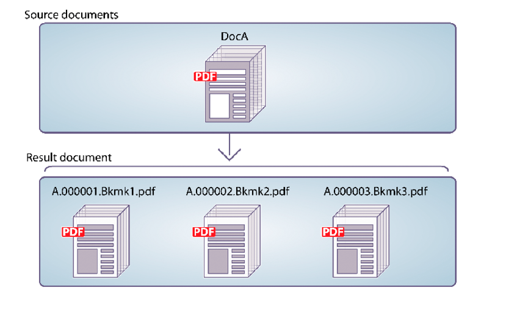

# PDF-documenten programmatisch demonteren {#programmatically-disassembling-pdf-documents}

**Voorbeelden en voorbeelden in dit document gelden alleen voor AEM Forms in JEE-omgeving.**

U kunt een document van de PDF demonteren door het tot de dienst van de Assembler over te gaan. Deze taak is meestal handig wanneer het PDF-document oorspronkelijk is gemaakt op basis van veel afzonderlijke documenten, zoals een verzameling instructies. In de volgende afbeelding wordt DocA opgedeeld in meerdere resulterende documenten, waarbij de bladwijzer van het eerste niveau 1 op een pagina het begin van een nieuw resulterend document aangeeft.



Als u een PDF-document wilt demonteren, controleert u of de `PDFsFromBookmarks` -element in het DDX-document. De `PDFsFromBookmarks` element is een resulterend element en kan slechts een onderliggend element van het `DDX` element. Het heeft geen `result` omdat dit kan leiden tot het genereren van meerdere documenten.

De `PDFsFromBookmarks` het element veroorzaakt dat één enkel document wordt geproduceerd voor elke niveau 1 referentie in het brondocument.

Voor deze bespreking, veronderstel het volgende Dx- document wordt gebruikt.

```xml
 <?xml version="1.0" encoding="UTF-8"?>
 <DDX xmlns="https://ns.adobe.com/DDX/1.0/">
      <PDFsFromBookmarks prefix="stmt">
     <PDF source="AssemblerResultPDF.pdf"/>
 </PDFsFromBookmarks>
 </DDX>
```

>[!NOTE]
>
>Alvorens deze sectie te lezen, adviseert men dat u met het assembleren van de documenten van PDF door de dienst van de Assembler vertrouwd bent. (Zie [PDF-documenten programmatisch samenstellen](/help/forms/developing/programmatically-assembling-pdf-documents.md).)

>[!NOTE]
>
>Wanneer u één PDF-document doorgeeft aan de Assembler-service en één document terugkrijgt, kunt u de opdracht `invokeOneDocument` -bewerking. Als u een PDF-document echter wilt demonteren, gebruikt u de opdracht `invokeDDX` bewerking omdat, hoewel er één invoerdocument PDF wordt doorgegeven aan de Assembler-service, de Assembler-service een verzamelingsobject retourneert dat een of meer documenten bevat.

>[!NOTE]
>
>Voor meer informatie over de dienst van de Assembler, zie [Services Reference for AEM Forms](https://www.adobe.com/go/learn_aemforms_services_63).

>[!NOTE]
>
>Voor meer informatie over een DDX-document raadpleegt u [De Verwijzing van de AssemblerDienst en DDX](https://www.adobe.com/go/learn_aemforms_ddx_63).

## Overzicht van de stappen {#summary-of-steps}

Als u een PDF-document wilt demonteren, voert u de volgende taken uit:

1. Inclusief projectbestanden.
1. Maak een PDF Assembler-client.
1. Verwijs naar een bestaand DDX-document.
1. Verwijs naar een document van de PDF om te demonteren.
1. Stel runtime-opties in.
1. Haal het PDF-document uit elkaar.
1. Sla de gedemonteerde PDF-documenten op.

**Projectbestanden opnemen**

Neem de benodigde bestanden op in uw ontwikkelingsproject. Als u een clienttoepassing maakt met Java, neemt u de benodigde JAR-bestanden op. Als u webservices gebruikt, dient u de proxybestanden op te nemen.

De volgende JAR-bestanden moeten worden toegevoegd aan het klassepad van uw project:

* adobe-livecycle-client.jar
* adobe-usermanager-client.jar
* adobe-assembler-client.jar
* adobe-utilities.jar (vereist als AEM Forms wordt geïmplementeerd op JBoss)
* jbossall-client.jar (vereist als AEM Forms wordt geïmplementeerd op JBoss)

als AEM Forms wordt geïmplementeerd op een ondersteunde J2EE-toepassingsserver die geen JBoss is, moet u adobe-utilities.jar en jbossall-client.jar vervangen door JAR-bestanden die specifiek zijn voor de J2EE-toepassingsserver waarop AEM Forms wordt geïmplementeerd.

**Een PDF Assembler-client maken**

Alvorens u programmatically een verrichting van de Assembler kunt uitvoeren, moet u een de dienstcliënt van de Assembler tot stand brengen.

**Verwijzen naar een bestaand DDX-document**

Er moet naar een DDX-document worden verwezen om een PDF-document te demonteren. Dit DDX-document moet de `PDFsFromBookmarks` element.

**Verwijzen naar een PDF-document om te demonteren**

Als u een PDF-document wilt demonteren, verwijst u naar een PDF-bestand dat het PDF-document vertegenwoordigt dat u wilt demonteren. Wanneer het tot de dienst van de Assembler wordt overgegaan, wordt een afzonderlijk document van PDF teruggegeven voor elke niveau 1 referentie in het document.

**Uitvoeringsopties instellen**

U kunt runtime opties plaatsen die het gedrag van de dienst van de Assembler controleren terwijl het een baan uitvoert. U kunt bijvoorbeeld een optie instellen die de Assembler-service de opdracht geeft door te gaan met het verwerken van een taak als er een fout optreedt.

**Het PDF-document demonteren**

Nadat u de de dienstcliënt van de Assembler creeert, van verwijzingen het DX- document, van verwijzingen een document van PDF om te demonteren, en runtime opties te plaatsen, kunt u een document van de PDF demonteren door de `invokeDDX` methode. Mits het DDX-document instructies bevat voor het demonteren van het PDF-document, retourneert de Assembler-service gedemonteerde PDF-documenten binnen een verzamelingsobject.

**De gedemonteerde PDF-documenten opslaan**

Alle gedemonteerde PDF-documenten worden geretourneerd in een verzamelingsobject. Doorloop het verzamelingsobject en sla elk PDF-document op als een PDF-bestand.

**Zie ook**

[Inclusief AEM Forms Java-bibliotheekbestanden](/help/forms/developing/invoking-aem-forms-using-java.md#including-aem-forms-java-library-files)

[Verbindingseigenschappen instellen](/help/forms/developing/invoking-aem-forms-using-java.md#setting-connection-properties)

[PDF-documenten programmatisch samenstellen](/help/forms/developing/programmatically-assembling-pdf-documents.md)

## Een PDF-document dempen met de Java API {#disassemble-a-pdf-document-using-the-java-api}

U kunt een PDF-document desassembleren met de Java-API (Assembler Service):

1. Inclusief projectbestanden.

   Neem client-JAR-bestanden, zoals adobe-assembler-client.jar, op in het klassenpad van uw Java-project.

1. Maak een PDF Assembler-client.

   * Een `ServiceClientFactory` object dat verbindingseigenschappen bevat.
   * Een `AssemblerServiceClient` object door de constructor ervan te gebruiken en de `ServiceClientFactory` object.

1. Verwijs naar een bestaand DDX-document.

   * Een `java.io.FileInputStream` een object dat het DDX-document vertegenwoordigt door de constructor ervan te gebruiken en een tekenreekswaarde door te geven die de locatie van het DDX-bestand aangeeft.
   * Een `com.adobe.idp.Document` object door de constructor ervan te gebruiken en de `java.io.FileInputStream` object.

1. Verwijs naar een document van de PDF om te demonteren.

   * Een `java.util.Map` object dat wordt gebruikt voor het opslaan van PDF-invoerdocumenten met behulp van een `HashMap` constructor.
   * Een `java.io.FileInputStream` -object door de constructor ervan te gebruiken en de locatie van het PDF-document door te geven om te demonteren.
   * Een `com.adobe.idp.Document` en geeft het `java.io.FileInputStream` -object dat het PDF-document bevat dat moet worden gedemonteerd.
   * Een item toevoegen aan de `java.util.Map` object aanroepen `put` en het doorgeven van de volgende argumenten:

      * Een tekenreekswaarde die de sleutelnaam vertegenwoordigt. Deze waarde moet overeenkomen met de waarde van het PDF-bronelement dat is opgegeven in het DDX-document.
      * A `com.adobe.idp.Document` -object dat het PDF-document bevat dat moet worden gedemonteerd.

1. Stel runtime-opties in.

   * Een `AssemblerOptionSpec` object dat uitvoeringsopties opslaat met de constructor ervan.
   * Stel runtime-opties in om aan uw bedrijfsvereisten te voldoen door een methode aan te roepen die tot de `AssemblerOptionSpec` object. Bijvoorbeeld, om de dienst van de Assembler op te dragen om een baan te blijven verwerken wanneer een fout voorkomt, haalt het `AssemblerOptionSpec` object `setFailOnError` methode en doorgeven `false`.

1. Haal het PDF-document uit elkaar.

   De `AssemblerServiceClient` object `invokeDDX` en geeft de volgende vereiste waarden door:

   * A `com.adobe.idp.Document` object dat staat voor het te gebruiken DDX-document
   * A `java.util.Map` object dat het te demonteren PDF-document bevat
   * A `com.adobe.livecycle.assembler.client.AssemblerOptionSpec` object dat de runtime-opties opgeeft, inclusief het standaardfont en het taaklogniveau

   De `invokeDDX` methode retourneert een `com.adobe.livecycle.assembler.client.AssemblerResult` -object dat de gedemonteerde PDF-documenten en eventuele uitzonderingen bevat.

1. Sla de gedemonteerde PDF-documenten op.

   Voer de volgende handelingen uit om de gedemonteerde PDF-documenten te verkrijgen:

   * De `AssemblerResult` object `getDocuments` methode. Dit retourneert een `java.util.Map` object.
   * Doorlopen `java.util.Map` object tot u het resultaat hebt gevonden `com.adobe.idp.Document` object.
   * De `com.adobe.idp.Document` object `copyToFile` methode om het PDF-document te extraheren.

**Zie ook**

[PDF-documenten programmatisch demonteren](#programmatically-disassembling-pdf-documents)

[Snel starten (SOAP modus): Een PDF-document ontkoppelen met de Java API](/help/forms/developing/assembler-service-java-api-quick.md#quick-start-soap-mode-disassembling-a-pdf-document-using-the-java-api)

[Inclusief AEM Forms Java-bibliotheekbestanden](/help/forms/developing/invoking-aem-forms-using-java.md#including-aem-forms-java-library-files)

[Verbindingseigenschappen instellen](/help/forms/developing/invoking-aem-forms-using-java.md#setting-connection-properties)

## Een PDF-document dempen met de webservice-API {#disassemble-a-pdf-document-using-the-web-service-api}

U kunt een PDF-document desassembleren met de API (webservice) van de Assembler-service:

1. Inclusief projectbestanden.

   Creeer een Microsoft .NET project dat MTOM gebruikt. Zorg ervoor dat u de volgende definitie van WSDL gebruikt wanneer het plaatsen van een de dienstverwijzing: `http://localhost:8080/soap/services/AssemblerService?WSDL&lc_version=9.0.1`.

   >[!NOTE]
   >
   >Vervangen `localhost` met het IP-adres van de server die als host fungeert voor AEM Forms.

1. Maak een PDF Assembler-client.

   * Een `AssemblerServiceClient` object met de standaardconstructor.
   * Een `AssemblerServiceClient.Endpoint.Address` object door het `System.ServiceModel.EndpointAddress` constructor. Geef een tekenreekswaarde die de WSDL opgeeft door aan de AEM Forms-service (bijvoorbeeld `http://localhost:8080/soap/services/AssemblerService?blob=mtom`). U hoeft de `lc_version` kenmerk. Dit kenmerk wordt gebruikt wanneer u een serviceverwijzing maakt.
   * Een `System.ServiceModel.BasicHttpBinding` object door de waarde van het object op te halen `AssemblerServiceClient.Endpoint.Binding` veld. De geretourneerde waarde omzetten in `BasicHttpBinding`.
   * Stel de `System.ServiceModel.BasicHttpBinding` object `MessageEncoding` veld naar `WSMessageEncoding.Mtom`. Deze waarde zorgt ervoor dat MTOM wordt gebruikt.
   * Laat basisauthentificatie van HTTP door de volgende taken uit te voeren toe:

      * Wijs de gebruikersnaam van het AEM aan het veld toe `AssemblerServiceClient.ClientCredentials.UserName.UserName`.
      * De bijbehorende wachtwoordwaarde aan het veld toewijzen `AssemblerServiceClient.ClientCredentials.UserName.Password`.
      * De constante waarde toewijzen `HttpClientCredentialType.Basic` naar het veld `BasicHttpBindingSecurity.Transport.ClientCredentialType`.
      * De constante waarde toewijzen `BasicHttpSecurityMode.TransportCredentialOnly` naar het veld `BasicHttpBindingSecurity.Security.Mode`.

1. Verwijs naar een bestaand DDX-document.

   * Een `BLOB` object met behulp van de constructor. De `BLOB` wordt gebruikt om het DDX-document op te slaan.
   * Een `System.IO.FileStream` object door de constructor ervan aan te roepen. Geef een tekenreekswaarde door die staat voor de bestandslocatie van het DDX-document en de modus waarin het bestand moet worden geopend.
   * Maak een bytearray waarin de inhoud van de `System.IO.FileStream` object. U kunt de grootte van de bytearray bepalen door de `System.IO.FileStream` object `Length` eigenschap.
   * De bytearray vullen met streamgegevens door de `System.IO.FileStream` object `Read` en geeft u de bytearray, de startpositie en de streamlengte door die u wilt lezen.
   * Vul de `BLOB` object door het toe te wijzen `MTOM` eigenschap met de inhoud van de bytearray.

1. Verwijs naar een document van de PDF om te demonteren.

   * Een `BLOB` object met behulp van de constructor. De `BLOB` wordt gebruikt om het invoerdocument PDF op te slaan. Dit `BLOB` object wordt doorgegeven aan de `invokeOneDocument` als argument.
   * Een `System.IO.FileStream` door de constructor aan te roepen en een tekenreekswaarde door te geven die de bestandslocatie van het invoerdocument PDF en de modus waarin het bestand moet worden geopend, vertegenwoordigt.
   * Maak een bytearray waarin de inhoud van de `System.IO.FileStream` object. U kunt de grootte van de bytearray bepalen door de `System.IO.FileStream` object `Length` eigenschap.
   * De bytearray vullen met streamgegevens door de `System.IO.FileStream` object `Read` en geeft u de bytearray, de startpositie en de streamlengte door die u wilt lezen.
   * Vul de `BLOB` object door het toe te wijzen `MTOM` veld de inhoud van de bytearray.
   * Een `MyMapOf_xsd_string_To_xsd_anyType` object. Dit verzamelingsobject wordt gebruikt om de PDF op te slaan die moet worden gedemonteerd.
   * Een `MyMapOf_xsd_string_To_xsd_anyType_Item` object.
   * Wijs een tekenreekswaarde toe die de sleutelnaam vertegenwoordigt aan de `MyMapOf_xsd_string_To_xsd_anyType_Item` object `key` veld. Deze waarde moet overeenkomen met de waarde van het PDF-bronelement dat is opgegeven in het DDX-document.
   * Wijs het `BLOB` object waarin het PDF-document is opgeslagen in het `MyMapOf_xsd_string_To_xsd_anyType_Item` object `value` veld.
   * Voeg de `MyMapOf_xsd_string_To_xsd_anyType_Item` aan `MyMapOf_xsd_string_To_xsd_anyType` object. De `MyMapOf_xsd_string_To_xsd_anyType` object&#39; `Add` en geeft de `MyMapOf_xsd_string_To_xsd_anyType` object.

1. Stel runtime-opties in.

   * Een `AssemblerOptionSpec` object dat uitvoeringsopties opslaat met de constructor ervan.
   * Stel runtime-opties in om aan uw bedrijfsvereisten te voldoen door een waarde toe te wijzen aan een gegevenslid dat tot de `AssemblerOptionSpec` object. Bijvoorbeeld, om de dienst van de Assembler op te dragen om een baan te blijven verwerken wanneer een fout voorkomt, wijs toe `false` aan de `AssemblerOptionSpec` object `failOnError` veld.

1. Haal het PDF-document uit elkaar.

   De `AssemblerServiceClient` object `invokeDDX` en geeft de volgende waarden door:

   * A `BLOB` object dat staat voor het DDX-document dat het PDF-document demonteert
   * De `MyMapOf_xsd_string_To_xsd_anyType` object dat het te demonteren PDF-document bevat
   * An `AssemblerOptionSpec` object dat uitvoeringsopties opgeeft

   De `invokeDDX` methode retourneert een `AssemblerResult` -object dat de taakresultaten en eventuele uitzonderingen bevat die zijn opgetreden.

1. Sla de gedemonteerde PDF-documenten op.

   Voer de volgende handelingen uit om de nieuwe PDF-documenten te verkrijgen:

   * Toegang krijgen tot de `AssemblerResult` object `documents` veld, dat een `Map` -object dat de gedemonteerde PDF-documenten bevat.
   * Doorlopen `Map` om elk resulterend document te verkrijgen. Dan, giet dat serielid `value` een `BLOB`.
   * Extraheer de binaire gegevens die het document van de PDF door tot zijn toegang te hebben vertegenwoordigen `BLOB` object `MTOM` eigenschap. Hiermee wordt een array met bytes geretourneerd die u naar een PDF-bestand kunt schrijven.

**Zie ook**

[PDF-documenten programmatisch demonteren](#programmatically-disassembling-pdf-documents)

[AEM Forms aanroepen met MTOM](/help/forms/developing/invoking-aem-forms-using-web.md#invoking-aem-forms-using-mtom)
