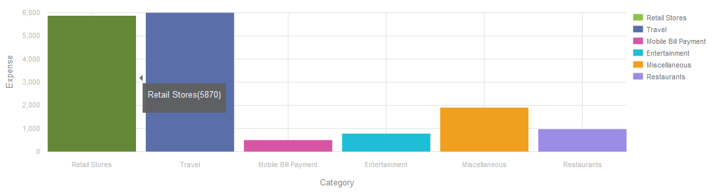

# Adaptieve formuliergrafieken {#af-charts}


Een grafiek of grafiek is een visuele weergave van gegevens. Zo kunt u grote hoeveelheden informatie samenvoegen tot een eenvoudig te begrijpen visuele indeling, zodat u complexe gegevens beter kunt visualiseren, interpreteren en analyseren.
AEM Forms add-on package biedt een out-of-the-box component Chart. U kunt in uw adaptieve vormen en documenten voor visuele vertegenwoordiging van tweedimensionale gegevens in **herhaalbare panelen** en **lijsten** gebruiken. Met de component Chart kunt u de volgende typen grafieken toevoegen en configureren:

1. Schijf
1. Kolom
1. Donut
1. Balk
1. Lijn
1. Lijn en punt
1. Punt
1. Gebied

De component van de Grafiek steunt en verstrekt ingebouwde statistische functies - som, gemiddelde, maximum, minimum, wijze, mediaan, waaier, en frequentie - om waarden op een grafiek te berekenen en te plotten. Naast de functies die offline beschikbaar zijn, kunt u ook uw eigen aangepaste functies schrijven en deze beschikbaar maken voor gebruik in grafieken.

Laten wij nu bekijken hoe te om de component van de Grafiek toe te voegen en te vormen:

## Diagram toevoegen {#add-chart}

De component Chart is beschikbaar in AEM zijbalk, door gebrek. U kunt de component Chart van AEM zijbalk naar het aangepaste formulier of document in de ontwerpmodus slepen. Wanneer u de component neerzet, wordt er een tijdelijke aanduiding voor een grafiek gemaakt.

## Diagram configureren {#configure-chart}

>[!NOTE]
> 
> Alvorens de grafiek te vormen, zorg ervoor dat het paneel of de lijstrij waarvoor u de grafiek vormt aan herhaalbaar wordt geplaatst. U kunt minimum- en maximumwaarden opgeven voor herhaalbare deelvensters of tabelrijen op het tabblad Herhalingsinstellingen van het dialoogvenster Component bewerken.

Om de grafiek te vormen, klik de component van de Grafiek en klik  om de Edit dialoog van de Grafiek te openen. Het dialoogvenster bevat de tabbladen Titel en tekst, Configuratie, Geavanceerde opties en Opmaak waarmee u de grafiek kunt configureren.

### Basis {#basic}

Op het tabblad Standaard kunt u de volgende eigenschappen configureren:


* **naam van het Element**: Een herkenningsteken voor het grafiekelement in JCR inhoudsstructuur. Het is niet zichtbaar op de grafiek maar helpt wanneer het verwijzen naar het element van andere componenten, manuscripten, en uitdrukkingen SOM.
* **type van Grafiek**: Specificeert het type van grafiek dat u wilt produceren. De beschikbare opties zijn Schijf, Donut, Bar, Kolom, Lijn, Lijn en Punt, Punt, en Gebied. In het voorbeeld is het diagramtype Column.
* **Herhalende Naam van de Rij of de Naam van het Comité voor Gegevens Source**: Specificeert de elementennaam van de lijstrij of het herhaalbare paneel van waar de gegevens zullen worden geput. In het voorbeeld, is statementDetails de elementnaam van de herhaalbare rij in de lijst van de Details van de Verklaring.
* **x-As > Titel**: Specificeert de titel voor de x-as. In het voorbeeld is de titel voor de X-as Categorie.
* **x-As > Gebied**: Specificeert de elementnaam van het gebied (of een cel in een lijst) dat op x-as moet worden getekend. In het voorbeeld worden categorieën geconfigureerd op de X-as. De elementnaam voor de tabelcel in de kolom Categorie van de voorbeeldtabel is een categorie.
* **x-As > de functie van het Gebruik**: Specificeert de statistische functie om voor het berekenen van de waarden op x-as te gebruiken. In het voorbeeld is Geen de geselecteerde optie. Zie Functies in diagram gebruiken voor meer informatie over functies.
* **y-as > Titel**: Specificeert de titel voor de y-as. In het voorbeeld is de titel voor de Y-as Kosten.
* **y-as > Gebied**: Specificeert de elementnaam van het gebied (of de cel in een lijst) dat op y-as moet worden getekend. In het voorbeeld, vorm hoeveelheid op y-as. De elementnaam voor de tabelcel in de kolom Bedrag van de voorbeeldtabel is de hoeveelheid.
* **y-as > functie van het Gebruik**: Specificeert de statistische functie om voor het berekenen van de waarden op y-as te gebruiken. In het voorbeeld wordt de hoeveelheid die in elke categorie wordt uitgegeven, opgeteld en wordt de berekende waarde uitgezet op de Y-as. Selecteer daarom Som in de vervolgkeuzelijst Functie gebruiken. Zie Functies in diagram gebruiken voor meer informatie over functies.
* **positie van de Legenda**: Specificeert de positie van de legenda met betrekking tot de grafiek. De beschikbare opties zijn Rechts, Links, Boven en Onder.
* **toon legenda**: Toon een legenda voor de grafiek, wanneer toegelaten.
* **Tooltip**: Specificeert het formaat waarin het hulpmiddeluiteinde op mouseover op een gegevenspunt in de grafiek verschijnt. De standaardwaarde is **\$ {x} (\ $ {y})**. Afhankelijk van het grafiektype, wanneer u de muis op een punt, een bar, of een plak in de grafiek richt, worden de variabelen **\$ {x}** en **\$ {y}** dynamisch vervangen met de overeenkomstige waarden op X-as en y-as en getoond in het hulpmiddeluiteinde. Zoals aangetoond in het voorbeeld hieronder, wordt het hulpmiddeluiteinde getoond als **Detailhandel (5870)** wanneer het richten van muis bij de kolom van Retails. Laat het veld Knopinfo leeg als u knopinfo wilt uitschakelen. Deze optie is niet van toepassing op lijnen en vlakgrafieken.
* **diagram-specifieke configuraties**: Naast gemeenschappelijke configuraties, is de volgende grafiek-specifieke configuratie beschikbaar:
* **Binnenstraal**: beschikbaar voor grafieken van de Donut om de straal (in pixel) van de binnencirkel in de grafiek te specificeren.
* **kleur van de Lijn**: beschikbaar voor de grafieken van de Lijn, van de Lijn en van het Punt, en van het Gebied om de hexadecimale waarde van de kleur voor de lijn in de grafiek te specificeren.
* **kleur van het Punt**: beschikbaar voor Punt en Lijn, en de grafieken van het Punt om de hexadecimale waarde van de kleur voor de punten in de grafiek te specificeren.
* **kleur van het Gebied**: beschikbaar voor de grafieken van het Gebied om de hexadecimale waarde van de kleur voor het gebied onder de lijn in de grafiek te specificeren.
* **CSS Klasse**: specificeer de naam van een CSS klasse op het CSS klassengebied om douane het stileren op de grafiek toe te passen.

### Configuratie {#configuration}

Op het tabblad Standaard definieert u het type grafiek, het bronvenster of de tabelrij met gegevens, de waarden die moeten worden uitgezet op de X-as en Y-as van het diagram en eventueel de statistische functie die de waarden voor het uitzetten op het diagram berekent.

Laten we de informatie die op dit tabblad wordt weergegeven in detail begrijpen, met behulp van een voorbeeld van een herhaalbare tabel in een creditcardinstructie. Bedenk dat u een grafiek wilt genereren waarin de totale kosten in verschillende categorieën worden weergegeven en gecorreleerd in de sectie met de details van de verklaring van een creditcardoverzicht, zoals hieronder wordt weergegeven.

Hiervoor moet u categorieën op de X-as plaatsen en op de Y-as de totale uitgaven in elke categorie.


De creditcardverklaring in dit voorbeeld wordt gebruikt is een adaptief vormdocument en de sectie van verklaringsdetails is een lijst, die als volgt op de auteurswijze kijkt.


Laten we de volgende vereisten en voorwaarden voor het genereren van het diagram in overweging nemen:

* De grafiek toont de totale uitgave in elke categorie in de lijst van de Details van de Verklaring.
* Het grafiektype is Kolom, hoewel u een ander grafiektype kunt kiezen, zoals aangewezen.
* De rij van de Lijst in de lijst van de Details van de Verklaring is herhaalbaar. U kunt dit configureren in het veld Herhalingsinstellingen van de tabelrijeigenschappen.
* De elementnaam voor de rij is de Details van de Verklaring. U kunt het in de eigenschappen van de Rij van de Lijst vormen.
* De elementnaam voor de tabelcel in de kolom Categorie is een categorie. U kunt deze inline opgeven. Selecteer de cel en tik op de knop Bewerken.
* De elementnaam voor de tabelcel in de kolom Bedrag is de hoeveelheid. Bovendien is de tabelcel in de kolom Bedrag een numeriek vak.
* Met de gespecificeerde configuratie, zal de grafiek van de Kolom in het voorbeeld als volgt verschijnen. Elke kleur vertegenwoordigt een categorie en afzonderlijke regelitems of bedragen voor een categorie worden in het diagram opgeteld.

  

De legenda en de knopinfo worden als volgt weergegeven.



### Stijlen {#styling}

In de modus Stijl kunt u de breedte configureren, uitgedrukt als percentage van de totale breedte die beschikbaar is in het formulier of document, en de hoogte in pixels voor het diagram. Andere opties zijn tekst, achtergrond, rand, effecten en CSS-overschrijvingen.

Om op het stileren wijze, op de paginagoolbar over te schakelen, **tikken>>Stijl**.


## Functies in diagram gebruiken {#use-functions}

U kunt een grafiek vormen om statistische functies te gebruiken om waarden van de brongegevens voor het tekenen op de grafiek te berekenen. Terwijl de component van de Grafiek sommige ingebouwde functies heeft, kunt u uw eigen functies schrijven en hen voor gebruik in de grafiekconfiguratie ter beschikking stellen.

>[!NOTE]
>
> U kunt functies gebruiken om waarden voor de X- of Y-as in een grafiek te berekenen.

### Standaardfuncties {#default-functions}

De volgende functies zijn standaard beschikbaar met de component Chart:

* **Gemiddeld (Gemiddeld)**: Keert het gemiddelde van de waarden op X of de as van Y voor een bepaalde waarde op de andere as terug.
* **Som**: Keert de som alle waarden op X of de as van Y voor een bepaalde waarde op de andere as terug.
* **Maximum**: Keert het maximum van de waarden op as X of Y voor een bepaalde waarde op de andere as terug.
* **Frequentie**: Keert het aantal waarden op X of de as van Y voor een bepaalde waarde op de andere as terug.
* **Waaier**: Keert het verschil tussen het maximum en het minimum van de waarden op X of de as van Y voor een bepaalde waarde op de andere as terug.
* **Mediaan**: Keert de waarde terug die hogere en lagere waarden in de helft op de as van X of van Y voor een bepaalde waarde op de andere as scheidt.
* **Minimum**: Keert het minimum van de waarden op X of de as van Y voor een bepaalde waarde op de andere as terug.
* **Wijze**: Keert de waarde met de meeste voorkomen op X of Y as voor een bepaalde waarde op de andere as terug

### Aangepaste functies {#custom-functions}

Naast het gebruiken van de standaardfuncties in grafieken, kunt u [ douanefuncties ](/help/forms/using/rule-editor.md#custom-functions-in-rule-editor-custom-functions) in JavaScript schrijven en hen beschikbaar maken in de lijst van functies in de component van de Grafiek.

Een functie neemt een array of waarden en een categorienaam als invoer en retourneert een waarde. Bijvoorbeeld:

```
Multiply(valueArray, category) {
    var val = 1;
    _.each(valueArray, function(value) {
        val = val * value;
    });
    return val;
}
```

Zodra u een douanefunctie hebt geschreven, doe het volgende om het voor gebruik in de grafiekconfiguratie beschikbaar te maken:

1. Voeg de aangepaste functie toe aan de clientbibliotheek die is gekoppeld aan het adaptieve formulier of document.
1. Maak in CRXDE Lite een knooppunt nt:unStructured in de map apps met de volgende eigenschappen:
   * Stel guideComponentType in op fd/af/reducer. (verplicht)
   * Stel waarde in op een volledig gekwalificeerde naam van de aangepaste JavaScript-functie. (verplicht)
   * Stel jcr:description in op een betekenisvolle naam. Het verschijnt in de **functie van het Gebruik** drop-down lijst. Bijvoorbeeld, **vermenigvuldigt**.
   * Stel qtip in op een korte beschrijving van de functie. Deze verschijnt als knopinfo wanneer u de aanwijzer boven de functienaam in de vervolgkeuzelijst Functie gebruiken plaatst.
   * Klik **sparen allen** om de configuratie te bewaren.
   * De functie is nu beschikbaar voor gebruik in de Grafiek.


## Diagram automatisch vernieuwen {#auto-refresh-chart}

Een diagram wordt automatisch vernieuwd wanneer gebruikers een van de volgende handelingen uitvoeren:
* Voeg of verwijder een geval van het paneel van de gegevensbron of lijstrij toe.
* Wijzig de waarden die op de X- of Y-as in het deelvenster of de tabelrij van de gegevensbron worden getekend.
* Wijzig het diagramtype.

## Type diagram gebruiken in adaptieve formulierregels {#chart-in-rules}

De eigenschap chartType geeft het type grafiek op. De mogelijke waarden zijn taart, donut, bar, lijn, lijnpunt, punt, en gebied. Het is een scriptable bezit, wat betekent u het in [ aanpassende vormregels ](/help/forms/using/rule-editor.md) kunt gebruiken om grafiekconfiguraties te manipuleren. Laten we het begrijpen met behulp van een voorbeeld.

Bedenk dat u een grafiek van de Kolom vormde. U wilt gebruikers echter ook een optie bieden waarmee u een ander diagramtype in een vervolgkeuzelijst kunt selecteren en het diagram opnieuw kunt tekenen. U kunt dit bereiken gebruikend het chartType bezit in een regel als volgt:

1. Sleep een vervolgkeuzelijstcomponent vanuit AEM zijbalk op het adaptieve formulier.
1. Selecteer de component en tik .
1. Geef een titel op voor de vervolgkeuzelijst. Bijvoorbeeld, selecteer grafiektype.
1. Voeg ondersteunde diagramtypen toe in de sectie Items om de vervolgkeuzelijst te vullen. Klik **Gedaan**.
   

1. Selecteer de drop-down component en tik . In de regelredacteur, schrijf een regel in de visuele regelredacteur zoals hieronder getoond.
   

   In dit voorbeeld, is de elementnaam van de grafiekcomponent **myChart**.

   Alternatief, kunt u de volgende regels in de coderedacteur schrijven.

   

   Voor meer informatie over het schrijven van regels, zie [ de redacteur van de Regel ](/help/forms/using/rule-editor.md)

1. Klik op Gereed om de regel op te slaan.

Nu, kunt u een grafiektype van de drop-down lijst selecteren en de klik verfrist zich om de grafiek opnieuw te trekken.
