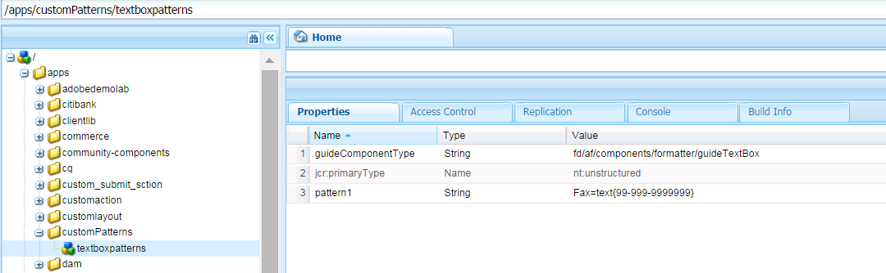

# Adaptieve formulierexpressies{#adaptive-form-expressions}

Adaptieve formulieren bieden een geoptimaliseerde en vereenvoudigde manier van invullen van formulieren voor eindgebruikers met dynamische scriptmogelijkheden. Hiermee kunt u expressies schrijven waarmee u verschillende gedragingen kunt toevoegen, zoals dynamische tonen/verbergen van velden en deelvensters. Ook kunt u berekende velden toevoegen, velden alleen-lezen maken, validatielogica toevoegen en nog veel meer. Het dynamische gedrag is gebaseerd op de gebruikersinvoer of voorgevulde gegevens.

JavaScript is de expressietaal van adaptieve formulieren. Alle expressies zijn geldige JavaScript-expressies en gebruiken API&#39;s van het scriptmodel voor aangepaste formulieren. Deze expressies retourneren waarden van bepaalde typen. Zie de API-naslaggids voor [JavaScript-bibliotheken voor adaptieve formulieren](https://helpx.adobe.com/experience-manager/6-5/forms/javascript-api/index.html)voor een volledige lijst met adaptieve formulierklassen, gebeurtenissen, objecten en openbare API&#39;s.

## Aanbevolen werkwijzen voor het schrijven van expressies {#best-practices-for-writing-expressions}

* Wanneer u expressies schrijft, kunt u de naam van een veld of deelvenster gebruiken om velden en deelvensters te openen. Gebruik de eigenschap value om toegang te krijgen tot de waarde van een veld. Bijvoorbeeld, `field1.value`
* Gebruik unieke namen voor velden en deelvensters in het formulier. Hiermee voorkomt u mogelijke conflicten met veldnamen die tijdens het schrijven van expressies worden gebruikt.
* Gebruik tijdens het schrijven van expressies met meerdere regels een puntkomma om een instructie te beëindigen.

## Aanbevolen werkwijzen voor expressies waarbij het deelvenster wordt herhaald {#best-practices-for-expressions-involving-repeating-panel}

Herhalende deelvensters zijn instanties van een deelvenster die dynamisch worden toegevoegd of verwijderd met behulp van API voor scripts of vooraf ingevulde gegevens. Zie Formulieren [met herhaalbare secties](/help/forms/using/creating-forms-repeatable-sections.md)maken voor meer informatie over het gebruik van een deelvenster voor herhalingen.

* Als u een herhalend deelvenster wilt maken, opent u in het dialoogvenster van het deelvenster de instellingen en stelt u de waarde van het maximale telveld in op meer dan 1.
* De minimale telwaarde van de herhalingsinstellingen van het deelvenster kan een of meer zijn, maar mag niet meer zijn dan de maximale telwaarde.
* Wanneer een expressie verwijst naar een veld van een herhalend deelvenster, worden de veldnamen in de expressie omgezet naar het dichtstbijzijnde herhalende element.
* Adaptieve formulieren bieden een aantal speciale functies om de berekening voor herhaalbare deelvensters, zoals som, telling, min, max, filter en nog veel meer, te vereenvoudigen. Zie de API-naslaggids voor [JavaScript-bibliotheken voor adaptieve formulieren voor de volledige lijst met functies](https://helpx.adobe.com/aem-forms/6/javascript-api/af.html)
* API&#39;s voor het manipuleren van instanties van herhalende deelvensters zijn:

   * Een deelvensterinstantie toevoegen: `panel1.instanceManager.addInstance()`
   * Een herhalingsindex voor een deelvenster ophalen: `panel1.instanceIndex`
   * De instanceManager van een deelvenster ophalen: `_panel1 or panel1.instanceManager`
   * Een instantie van een deelvenster verwijderen: `_panel1.removeInstance(panel1.instanceIndex)`

## Expressietypen {#expression-types}

In adaptieve formulieren kunt u expressies schrijven om gedrag toe te voegen, zoals velden en deelvensters voor dynamisch tonen/verbergen. U kunt ook expressies schrijven om berekende velden toe te voegen, velden alleen-lezen te maken, validatielogica toe te voegen en nog veel meer. Adaptieve formulieren ondersteunen de volgende expressies:

* **[Toegang tot expressies](#access-expression-enablement-expression)**: om een veld in of uit te schakelen.
* **[Expressies](#calculate-expression)** berekenen: om de waarde van een veld automatisch te berekenen.
* **[Klikexpressie](#click-expression)**: om handelingen af te handelen bij klikgebeurtenis van een knop.
* **[Initialisatiescript](#initialization-script):** een handeling uitvoeren bij initialisatie van een veld.
* **[Uitdrukking](#options-expression)** opties: om een vervolgkeuzelijst dynamisch in te vullen.
* **[Samenvattingsexpressie](#summary)**: om de titel van een accordeon dynamisch te berekenen.
* **[Expressies](#validate-expression)** valideren: om een veld te valideren.
* **[Waarde script](#value-commit-script)vastleggen:** om de componenten van een formulier te wijzigen nadat de waarde van een veld is gewijzigd.
* **[Visibility expression](#visibility-expression)**: om de zichtbaarheid van een veld en deelvenster te regelen.
* **[Uitdrukking](#step-completion-expression)** voor stapvoltooiing: om te voorkomen dat een gebruiker naar de volgende stap van een wizard gaat.

### Access Expression (Enablement Expression) {#access-expression-enablement-expression}

U kunt de toegangsuitdrukking gebruiken om een gebied in of onbruikbaar te maken. Als de expressie de waarde van een veld gebruikt, wordt de expressie opnieuw geactiveerd wanneer de waarde van het veld verandert.

**Van toepassing op**: velden

**Retourneringstype**: De expressie retourneert een Booleaanse waarde die aangeeft of het veld is in- of uitgeschakeld. **true** vertegenwoordigt dat het veld is ingeschakeld en **false** vertegenwoordigt dat het veld is uitgeschakeld.

**Voorbeeld**: Als u een veld alleen wilt inschakelen wanneer de waarde van **veld1** op **X** is ingesteld, is de toegangsuitdrukking: `field1.value == "X"`

### Expressie berekenen {#calculate-expression}

De expressie calculate wordt gebruikt om de waarde van een veld automatisch te berekenen met behulp van een expressie. In dergelijke expressies wordt doorgaans de eigenschap value van een ander veld gebruikt. Bijvoorbeeld, `field2.value + field3.value`. Wanneer de waarde van de expressie `field2`of `field3`wijzigingen wordt aangebracht, wordt de expressie opnieuw geactiveerd en wordt de waarde opnieuw berekend.

**Van toepassing op**: velden

**Retourneringstype**: De expressie retourneert een waarde die compatibel is met het veld waarin het resultaat van de expressie wordt weergegeven (bijvoorbeeld decimaal).

**Voorbeeld**: De berekeningsexpressie die de som van twee velden in **veld1** moet weergeven, is:
`field2.value + field3.value`

### Klikken op uitdrukking {#click-expression}

De klikuitdrukking behandelt de acties die op de klikgebeurtenis van een knoop worden uitgevoerd. GuideBridge beschikt over API&#39;s die verschillende functies kunnen uitvoeren, zoals verzenden, valideren die samen met de klikexpressie worden gebruikt. Zie [GuideBridge API&#39;s voor een volledige lijst met API&#39;s](https://helpx.adobe.com/aem-forms/6/javascript-api/GuideBridge.html).

**Van toepassing op**: Knopvelden

**Retourneringstype**: De klikuitdrukking keert geen waarde terug. Als een expressie een waarde retourneert, wordt de waarde genegeerd.

**Voorbeeld**: Als u een tekstvak **textbox1** wilt vullen bij het klikken van een knop met de waarde **AEM Forms**, klikt u op de knop `textbox1.value="AEM Forms"`

### Initialisatiescript {#initialization-script}

Het initialisatiescript wordt geactiveerd wanneer een adaptief formulier wordt geïnitialiseerd. Afhankelijk van scenario&#39;s, gedraagt het initialisatiescript zich op de volgende manier:

* Wanneer een adaptief formulier wordt gegenereerd zonder dat er een gegevensprefulling is, wordt het initialisatiescript uitgevoerd nadat het formulier is geïnitialiseerd.
* Wanneer een adaptief formulier wordt weergegeven met een gegevensvoorvoegsel, wordt het script uitgevoerd nadat de voorvulbewerking is voltooid.
* Wanneer de validatie van een adaptief formulier aan de serverzijde wordt geactiveerd, wordt het initialisatiescript uitgevoerd.

**Van toepassing op:** velden en deelvenster

**Retourneringstype:** De initialisatiescript-expressie retourneert geen waarde. Als een expressie een waarde retourneert, wordt de waarde genegeerd.

**Voorbeeld:** In een scenario waarin gegevens vooraf worden ingevuld, is de initialisatiescript-expressie als u velden wilt vullen met de standaardwaarde `'Adaptive Forms'` als de waarde null is.
`if(this.value==null) this.value='Adaptive Forms';`

### Opties {#options-expression}

De optiesuitdrukking wordt gebruikt om opties van een drop-down lijstgebied dynamisch te vullen.

**Van toepassing op**: vervolgkeuzelijstvelden

**Retourneringstype**: De optiesuitdrukking keert een serie van koordwaarden terug. Elke waarde kan een eenvoudige tekenreeks zijn, zoals **Mannelijk**, of in een sleutelwaarde-paar, zoals **1=Mannelijk**

**Voorbeeld**: Als u de waarde van een veld wilt vullen op basis van de waarde van een ander veld, geeft u een eenvoudige expressie voor opties op. Als u bijvoorbeeld een veld, **Aantal kinderen**, wilt vullen op basis van de **burgerlijke staat** die in een ander veld wordt uitgedrukt, wordt de volgende expressie gebruikt:

**`marital_status.value == "married" ? ["1=One", "2=two"] : ["0=Zero"]`.**

Wanneer de waarde van het veld **marital_status** verandert, wordt de expressie opnieuw geactiveerd. U kunt dropdown van de dienst van REST ook bevolken. Zie [Dropdowns dynamisch vullen voor gedetailleerde informatie](../../forms/using/dynamically-populate-dropdowns.md).

### Samenvattingsexpressie {#summary}

De expressie Samenvatting berekent dynamisch de titel van een onderliggend deelvenster van een accordeonlay-outdeelvenster. U kunt de expressie Samenvatting opgeven in een regel, die een formulierveld of een aangepaste logica gebruikt om de titel te evalueren. De expressie wordt uitgevoerd wanneer het formulier wordt geïnitialiseerd. Als u een formulier vooraf invult, wordt de expressie uitgevoerd nadat de gegevens zijn voorgevuld of wanneer de waarde van afhankelijke velden die in de expressie worden gebruikt, verandert.

De expressie Samenvatting wordt doorgaans gebruikt voor het herhalen van onderliggende items van een accordeonlay-outdeelvenster, zodat elk onderliggend deelvenster een betekenisvolle titel krijgt.

**Van toepassing op:** Deelvensters die directe onderliggende elementen zijn van een deelvenster waarvan de lay-out is geconfigureerd als Accordeon.

**Retourneringstype:** De expressie retourneert een tekenreeks die de titel van de accordeon wordt.

**Voorbeeld:** &quot;Rekeningnummer: &quot;+ textbox1.value

### Expressie valideren {#validate-expression}

De expressie validate wordt gebruikt om de velden te valideren met de opgegeven expressie. Dergelijke expressies gebruiken doorgaans reguliere expressies samen met de veldwaarde om een veld te valideren. De expressie wordt opnieuw geactiveerd en de validatiestatus van het veld wordt opnieuw berekend bij elke wijziging in de waarde van een veld.

**Van toepassing op**: velden

**Retourneringstype**: De expressie retourneert een Booleaanse waarde die de validatiestatus van het veld vertegenwoordigt. De waarde **false** geeft aan dat het veld ongeldig is en **true** vertegenwoordigt dat het veld geldig is.
**Voorbeeld**: Voor een veld met postcode van het Verenigd Koninkrijk is de validatie-expressie:

(**this.value** &amp;&amp; `this.value.match(/^(GIR 0AA|[A-Z]{1,2}\d[A-Z0-9]? ?[0-9][A-Z]{2}\s*)$/i) == null) ? false : true`

Als in het bovenstaande voorbeeld de niet-lege waarde niet overeenkomt met het patroon, retourneert de expressie **false** om aan te geven dat het veld niet geldig is.

>[!NOTE]
>
>Als u een validatie-expressie schrijft voor een niet-verplicht of verplicht veld, wordt de expressie geëvalueerd, ongeacht de zichtbaarheidsstatus van het veld. Als u de validatie voor de verborgen velden wilt stoppen, stelt u de eigenschap validationsDisabled in het script Initialization of Value Commit in op true. Bijvoorbeeld, `this.validationsDisabled=true`

### Waarde script vastleggen {#value-commit-script}

Het script voor vastleggen van waarde wordt geactiveerd wanneer:

* Een gebruiker wijzigt de waarde van een veld in de gebruikersinterface.
* De waarde van een veld verandert via de programmacode als gevolg van een wijziging in een ander veld.

**Van toepassing op:** velden

**Retourneringstype:** De waarde commit script expression retourneert geen waarde. Als een expressie een waarde retourneert, wordt de waarde genegeerd.

**Voorbeeld:** Als u het hoofdlettergebruik van in het veld ingevoerde alfabeten wilt omzetten in hoofdletters bij doorvoeren, voert u de volgende expressie voor waarde uit:
`this.value=this.value.toUpperCase()`

>[!NOTE]
>
>U kunt de uitvoering van het Script van het Vastleggen van de Waarde onbruikbaar maken wanneer de waarde van een gebied programmatically wordt veranderd. Ga hiertoe naar https://&#39;[server]:[port]&#39;/system/console/configMgr en wijzig **Adaptive Forms Version for Compatibility** in **AEM Forms 6.1**. Vervolgens wordt het script voor vastleggen van waarde alleen uitgevoerd wanneer de gebruiker de waarde van het veld wijzigt in de gebruikersinterface.

### Zichtbaarheidsexpressie {#visibility-expression}

De uitdrukking van de Zichtbaarheid wordt gebruikt om de zichtbaarheid van gebied/paneel te controleren. De zichtbaarheidsexpressie gebruikt doorgaans de eigenschap value van een veld en wordt opnieuw geactiveerd wanneer die waarde verandert.

**Van toepassing op**: velden en deelvenster

**Retourneringstype**: De uitdrukking keert een waarde Van Boole terug, die het gebied/het paneel vertegenwoordigt is zichtbaar of niet. **false** geeft aan dat het veld of deelvenster niet zichtbaar is en true staat voor weergave van het veld of deelvenster.

**Voorbeeld**: Voor een deelvenster dat alleen zichtbaar wordt als de waarde van **veld1** is ingesteld op **Mannelijk**, is de zichtbaarheidsexpressie: `field1.value == "Male"`

### Uitdrukking voor stapvoltooiing {#step-completion-expression}

De expressie voor het voltooien van de stap wordt gebruikt om te voorkomen dat een gebruiker naar de volgende stap van een wizardlay-out gaat. Deze expressies worden gebruikt wanneer deelvensters een wizardlay-out hebben (een formulier dat uit meerdere stappen bestaat en één stap tegelijk weergeeft). De gebruiker kan alleen naar de volgende stap, het volgende deelvenster of de volgende subsectie gaan als alle vereiste waarden in de huidige sectie zijn ingevuld en geldig zijn.

**Van toepassing op**: Deelvensters waarvan de layout van het item is ingesteld op de wizard.

**Retourneringstype**: De uitdrukking keert een waarde Van Boole terug, die het huidige paneel vertegenwoordigt is geldig of niet. **True** vertegenwoordigt dat het huidige deelvenster geldig is en de gebruiker naar het volgende deelvenster kan navigeren.

**Voorbeeld**: Voordat u naar het volgende venster navigeert in een formulier dat is ingedeeld in verschillende deelvensters, wordt het huidige deelvenster gevalideerd. In dergelijke gevallen worden de expressies voor stapvoltooiing gebruikt. Over het algemeen maken deze expressies gebruik van de GuideBridge-API voor validatie. Een voorbeeld van een expressie voor het voltooien van stappen is:
`window.guideBridge.validate([],this.panel.navigationContext.currentItem.somExpression)`

## Validaties in adaptieve vorm {#validations-in-adaptive-form}

Er zijn meerdere methoden om veldvalidatie toe te voegen aan een adaptief formulier. Als een validatiecontrole aan een veld wordt toegevoegd, geeft **True** aan dat de waarde die in het veld wordt ingevoerd, geldig is. **False** vertegenwoordigt dat de waarde ongeldig is. Als u in- en uitgaat van een veld, wordt het foutbericht niet gegenereerd.

U kunt als volgt validaties toevoegen aan een veld:

### Vereist {#required}

Als u een component verplicht wilt maken, kunt u in het dialoogvenster **Bewerken** van de component de optie **Titel en Tekst > Vereist** selecteren. U kunt ook het juiste **vereiste bericht** (optioneel) toevoegen. .

### Validatiepatronen {#validation-patterns}

Er zijn meerdere validatiepatronen beschikbaar voor een veld. Als u een validatiepatroon wilt selecteren, gaat u in het dialoogvenster **Bewerken** van de component naar het gedeelte **Patronen** en selecteert u **patronen**. U kunt uw eigen aangepaste validatiepatroon maken in een tekstvak **Patroon** . De validatiestatus wordt alleen **True** geretourneerd als de gegevens die zijn ingevuld, voldoen aan het validatiepatroon. Anders wordt **False** geretourneerd. Zie Ondersteuning van [afbeeldingscomponenten voor HTML5-formulieren](/help/forms/using/picture-clause-support.md)voor informatie over het schrijven van uw eigen aangepaste validatiepatroon.

### Validatie-expressies {#validation-expressions}

De validatie van een veld kan ook worden berekend met behulp van expressies in verschillende velden. Deze expressies worden geschreven in het veld **Validatiescript** van het tabblad **Script** van het dialoogvenster **Bewerken** van de component. De validatiestatus van een veld is afhankelijk van de waarde die de expressie retourneert. Zie Uitdrukking [valideren voor informatie over het schrijven van dergelijke expressies](../../forms/using/adaptive-form-expressions.md#p-validate-expression-p).

## Additional Information {#additional-information}

### Veldweergave-indeling gebruiken {#using-field-display-format}

De indeling van de weergave kan worden gebruikt om de gegevens in verschillende indelingen weer te geven. U kunt bijvoorbeeld de weergave-indeling gebruiken om een telefoonnummer met afbreekstreepjes, ZIP-code of datumkiezer weer te geven. Deze weergavepatronen kunnen worden geselecteerd in het gedeelte **Patronen** van het dialoogvenster Bewerken van een component. U kunt aangepaste weergavepatronen schrijven, vergelijkbaar met de hierboven vermelde validatiepatronen.

### GuideBridge - API&#39;s en gebeurtenissen {#guidebridge-apis-and-events}

GuideBridge is een verzameling API&#39;s die kunnen worden gebruikt voor interactie met adaptieve formulieren in het geheugenmodel in een browser. Zie de API-naslaggids voor [JavaScript-bibliotheken voor adaptieve formulieren](https://helpx.adobe.com/aem-forms/6/javascript-api/)voor een gedetailleerde inleiding tot de Guide Bridge-API, klassemethoden, belichte gebeurtenissen.

>[!NOTE]
>
>Het wordt aanbevolen de gebeurtenislisteners GuideBridge niet te gebruiken in expressies.

#### Gebruik van GuideBridge in verschillende expressies {#guidebridge-usage-in-various-expressions}

* Als u formuliervelden opnieuw wilt instellen, kunt u de API activeren door op de klikexpressie van een knop te klikken. `guideBridge.reset()` Er is ook een API voor verzenden die als klikexpressie kan worden aangeroepen `guideBridge.submit()`**.**

* U kunt de `setFocus()` API gebruiken om de focus in te stellen op verschillende velden of deelvensters (voor de vensterfocus wordt automatisch ingesteld op het eerste veld). `setFocus()`biedt een breed scala aan opties voor navigatie, zoals navigatie tussen deelvensters, Vorige/Volgende verplaatsing, focus instellen op een bepaald veld en nog veel meer. Als u bijvoorbeeld naar het volgende deelvenster wilt gaan, kunt u het volgende gebruiken: `guideBridge.setFocus(this.panel.somExpression, 'nextItem').`

* Als u een adaptief formulier of de specifieke deelvensters ervan wilt valideren, gebruikt u `guideBridge.validate(errorList, somExpression).`

#### GuideBridge gebruiken buiten expressies  {#using-guidebridge-outside-expressions-nbsp}

U kunt de GuideBridge API&#39;s ook buiten de expressies gebruiken. U kunt bijvoorbeeld de GuideBridge-API gebruiken om communicatie in te stellen tussen pagina-HTML die als host fungeert voor het adaptieve formulier en het formuliermodel. Bovendien kunt u de waarde instellen die afkomstig is van het bovenliggende item van het Iframe-bestand dat het formulier host.

Als u GuideBridge API wilt gebruiken voor het bovenstaande voorbeeld, legt u een instantie van GuideBridge vast. Om de instantie vast te leggen, luistert u naar de `bridgeInitializeStart`gebeurtenis van een `window`object:

```javascript
window.addEventListener("bridgeInitializeStart", function(evnt) {

     // get hold of the guideBridge object

     var gb = evnt.detail.guideBridge;

     //wait for the completion of AF

     gb.connect(function (){

        //this function will be called after Adaptive Form is initialized

     })

})
```

>[!NOTE]
>
>In AEM is het een goede praktijk om code in een clientLib te schrijven en het in uw pagina (header.jsp of footer.jsp van de pagina) op te nemen

Als u GuideBridge wilt gebruiken nadat het formulier is geïnitialiseerd (de `bridgeInitializeComplete` gebeurtenis is verzonden), gebruikt u de GuideBridge-instantie `window.guideBridge`. U kunt de GuideBridge-initialisatiestatus controleren met de `guideBride.isConnected` API.

#### GuideBridge-gebeurtenissen {#guidebridge-events}

GuideBridge biedt ook bepaalde gebeurtenissen voor externe scripts op de hostpagina. Externe scripts kunnen naar deze gebeurtenissen luisteren en verschillende bewerkingen uitvoeren. Als de gebruikersnaam in een formulier bijvoorbeeld wordt gewijzigd, verandert ook de naam die in de koptekst van de pagina wordt weergegeven. Zie de API-naslaggids voor [JavaScript-bibliotheken voor adaptieve formulieren](https://helpx.adobe.com/aem-forms/6/javascript-api/GuideBridge.html)voor meer informatie over dergelijke gebeurtenissen.

Gebruik de volgende code om handlers te registreren:

```javascript
guideBridge.on("elementValueChanged", function (event, data)  {

      // execute some logic when value of a field is changed

});
```

### Aangepaste patronen maken voor een veld {#creating-custom-patterns-for-a-field}

Zoals hierboven vermeld, kunnen met adaptieve formulieren ontwerpers patronen voor validatie- of weergaveindelingen leveren. U kunt niet alleen patronen uit het vak gebruiken, maar ook herbruikbare aangepaste patronen definiëren voor een adaptieve formuliercomponent. U kunt bijvoorbeeld een tekstveld of een numeriek veld definiëren. Als u deze patronen eenmaal hebt gedefinieerd, kunt u deze patronen in alle formulieren gebruiken voor het opgegeven type component. U kunt bijvoorbeeld een aangepast patroon maken voor een tekstveld en dit gebruiken in de tekstvelden in de aangepaste formulieren. U kunt het aangepaste patroon selecteren door de patroonsectie te openen in het dialoogvenster Bewerken van een component. Zie Ondersteuning van [afbeeldingscomponenten voor HTML5-formulieren](/help/forms/using/picture-clause-support.md)voor meer informatie over de definitie of indeling van patronen.

Voer de volgende stappen uit om een aangepast patroon te maken voor een specifiek veldtype en dit opnieuw te gebruiken voor andere velden van hetzelfde type:

1. Navigeer naar CRXDE Lite op de ontwerpinstantie.
1. Maak een map om uw aangepaste patronen te behouden. Maak onder de map /apps een knooppunt van het type sling:folder. Maak bijvoorbeeld een knooppunt met de naam `customPatterns`. Onder dit knooppunt maakt u een ander knooppunt van het type `nt:unstructed` en geeft u dit een naam `textboxpatterns`. Dit knooppunt bevat de verschillende aangepaste patronen die u wilt toevoegen.
1. Open het tabblad Eigenschappen van het gemaakte knooppunt. Open bijvoorbeeld het tabblad Eigenschappen van `textboxpatterns`. Voeg de `guideComponentType` eigenschap toe aan dit knooppunt en stel de waarde ervan in op *fd/af/components/formatter/guideTextBox*.

1. De waarde van deze eigenschap is afhankelijk van het veld waarvoor u de patronen wilt definiëren. Voor een numeriek veld is de waarde van de `guideComponentType` eigenschap *fd/af/components/formatter/guideNumericBox*. De waarde voor het veld Datepicker is *fd/af/components/formatter/guideDatepicker*.
&quot;
1. U kunt een aangepast patroon toevoegen door een eigenschap toe te wijzen aan het `textboxpatterns` knooppunt. Voeg een eigenschap met een naam toe (bijvoorbeeld `pattern1`) en stel de waarde ervan in op het patroon dat u wilt toevoegen. Bijvoorbeeld, voeg een bezit `pattern1` met waarde Fax=text {99-999-9999999} toe. Het patroon is beschikbaar voor alle tekstvakken die u in Adaptief Forms gebruikt.

   

   Aangepaste patronen maken

