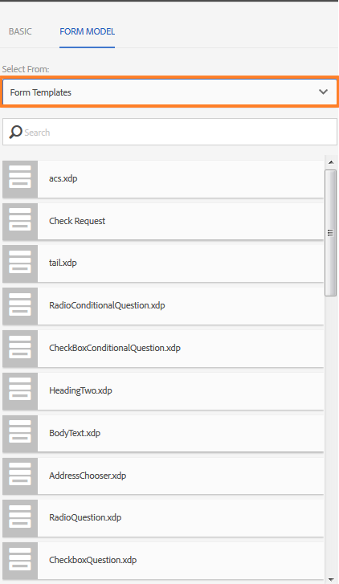

# Adaptieve formulierfragmenten{#adaptive-form-fragments}

| Versie | Artikelkoppeling |
| -------- | ---------------------------- |
| AEM as a Cloud Service | [Klik hier](https://experienceleague.adobe.com/docs/experience-manager-cloud-service/content/forms/adaptive-forms-authoring/authoring-adaptive-forms-core-components/create-an-adaptive-form-on-forms-cs/adaptive-form-fragments-core-components.html) |
| AEM 6,5 | Dit artikel |

 Adobe beveelt aan moderne en uitbreidbare gegevensvastlegging te gebruiken [Kernonderdelen](https://experienceleague.adobe.com/docs/experience-manager-core-components/using/adaptive-forms/introduction.html) for [nieuwe Adaptieve Forms maken](/help/forms/using/create-an-adaptive-form-core-components.md) of [Aangepaste Forms toevoegen aan AEM Sites-pagina&#39;s](/help/forms/using/create-or-add-an-adaptive-form-to-aem-sites-page.md). Deze componenten betekenen een aanzienlijke vooruitgang in de aanmaak van Adaptive Forms en zorgen voor indrukwekkende gebruikerservaring. In dit artikel wordt een oudere aanpak beschreven voor de auteur Adaptive Forms die gebruikmaakt van stichtingscomponenten. 

Hoewel elk formulier voor een bepaald doel is ontworpen, zijn er in de meeste vormen enkele gangbare segmenten, zoals het verstrekken van persoonlijke gegevens zoals naam en adres, familiedetails, inkomstengegevens enzovoort. Formulierontwikkelaars moeten deze algemene segmenten telkens maken wanneer een nieuw formulier wordt gemaakt.

Adaptieve formulieren bieden een handig mechanisme om slechts eenmaal een formuliersegment als een deelvenster of een groep velden te maken en deze in adaptieve formulieren opnieuw te gebruiken. Deze herbruikbare en op zichzelf staande segmenten worden adaptieve vormfragmenten genoemd.

## Een fragment maken {#create-a-fragment}

U kunt een aangepast formulierfragment helemaal opnieuw maken of een deelvenster in een bestaande adaptieve vorm als fragment opslaan.

### Een volledig nieuw fragment maken {#create-fragment-from-scratch}

1. Log in bij AEM Forms auteur instance op https://[*hostnaam*]:[*poort*]/aem/forms.html.
1. Klikken **Maken > Adaptief formulierfragment**.
1. Geef een titel, naam, beschrijving en tags voor het fragment op.

   >[!NOTE]
   >
   >Zorg ervoor dat u een unieke naam voor het fragment opgeeft. Als er al een ander fragment met dezelfde naam bestaat, kan het fragment niet worden gemaakt.

1. Klik om het dialoogvenster **Formuliermodel** en van de **Selecteren uit** selecteert u een van de volgende modellen voor het fragment:

   * **Geen**: Hiermee geeft u op het fragment helemaal opnieuw te maken zonder een formuliermodel te gebruiken.

     >[!NOTE]
     >
     > In Adaptief Forms op basis van kerncomponenten kunt u één formulierfragment meerdere keren gebruiken in een formulier. Deze ondersteunt zowel op geen gebaseerde als op schema gebaseerde formulierfragmenten.

   * **Formuliersjabloon**: Geeft op om het fragment te maken met een XDP-sjabloon die naar AEM Forms is geüpload. Selecteer de juiste XDP-sjabloon als het formuliermodel voor het fragment.

   

   De subformulieren die als fragmenten zijn gemarkeerd in de geselecteerde formuliersjabloon, worden ook weergegeven. U kunt een subformulier voor adaptief formulierfragment selecteren in de vervolgkeuzelijst.

   

   Daarnaast kunt u een adaptief formulierfragment maken met subformulieren die niet zijn gemarkeerd als fragmenten in de formuliersjabloon door de SOM-expressie voor het subformulier op te geven in de vervolgkeuzelijst.

   * **XML-schema**: Geeft op om het fragment te maken met een XML-schema dat naar AEM Forms is geüpload. U kunt een van de beschikbare XML-schema&#39;s uploaden of selecteren als het formuliermodel voor het fragment.

   

   U kunt ook een adaptief formulierfragment maken door in de vervolgkeuzelijst een complexType te selecteren dat aanwezig is in het geselecteerde schema.

   

1. Klikken **Maken** en klik vervolgens op **Openen** om het fragment met een standaardsjabloon te openen in de bewerkingsmodus.

In de bewerkingsmodus kunt u elke adaptieve formuliercomponent van het AEM hulpstuk naar het fragment slepen en neerzetten. Zie voor informatie over adaptieve formuliercomponenten [Inleiding tot het ontwerpen van adaptieve formulieren](../../forms/using/introduction-forms-authoring.md).

Als u bovendien een XML-schema of XDP-formuliersjabloon hebt geselecteerd als het formuliermodel voor uw fragment, wordt een nieuw tabblad met de hiërarchie van het formuliermodel weergegeven in de zoeker naar inhoud. Hiermee kunt u formuliermodelelementen naar het fragment slepen en neerzetten. De toegevoegde formuliermodelelementen worden geconverteerd naar formuliercomponenten, terwijl de oorspronkelijke eigenschappen van de gekoppelde XDP of XSD behouden blijven.

### Deelvenster opslaan als een fragment {#save-panel-as-a-fragment}

1. Open een adaptief formulier met het deelvenster dat u wilt opslaan als adaptief formulierfragment.
1. Klik in de werkbalk van het deelvenster op **[!UICONTROL Save as Fragment]**. Het dialoogvenster Opslaan als fragment wordt geopend.

   >[!NOTE]
   >
   >Als het deelvenster dat u opslaat als fragment een onderliggend deelvenster bevat, worden deze deelvensters opgenomen in het resulterende fragment.

1. Geef in het dialoogvenster Fragment maken de volgende informatie op:

   * **Naam**: de naam van het fragment. De standaardwaarde is de elementnaam van het deelvenster. Het is een verplicht veld.
     >[!NOTE]
     >
     >Zorg ervoor dat u een unieke naam voor het fragment opgeeft. Als er al een ander fragment met dezelfde naam bestaat, kan het fragment niet worden gemaakt.

   * **Titel**: Titel van het fragment. De standaardwaarde is de titel van het deelvenster.

   * **Beschrijving**: Beschrijving van het fragment.

   * **Tags**: Hiermee worden metagegevens voor het fragment gecodeerd.

   * **Doelpad**: Pad naar opslagplaats waar het fragment wordt opgeslagen. Als u geen pad opgeeft, wordt een knooppunt met dezelfde naam als dat van het fragment gemaakt naast het knooppunt dat het adaptieve formulier bevat. Het fragment wordt opgeslagen in dit knooppunt.

   * **Formuliermodel**: Afhankelijk van het formuliermodel voor het aangepaste formulier wordt in dit veld het volgende weergegeven: **XML-schema**, **Formuliersjabloon**, of **Geen**. Het is een niet-bewerkbaar veld.

   * **Hoofdmap van fragmentmodel**: wordt alleen weergegeven in op XSD gebaseerde adaptieve formulieren. Hiermee geeft u de basis voor het fragmentmodel op. U kunt **/** of het XSD-complexe type uit de vervolgkeuzelijst. U kunt het fragment alleen opnieuw gebruiken in een ander adaptief formulier als u het complexe type selecteert als hoofdknooppunt van het fragmentmodel.
Als u **/** Als hoofdmap van het fragmentmodel is de volledige XSD-structuur van het basismodel zichtbaar op het tabblad van het adaptieve formuliergegevensmodel. Voor de hoofdmap van een complex type fragmentmodel zijn alleen de onderliggende elementen van het geselecteerde complexe type zichtbaar op het tabblad van het adaptieve formuliergegevensmodel. Als u een fragment maakt en een complex type kiest als de **Hoofdmap van fragmentmodel**, kunt u het overal gebruiken waar dat complexe type wordt gebruikt, of binnen de zelfde vorm of over veelvoudige vormen.

   * **XSD Ref**: wordt alleen weergegeven in op XSD gebaseerde adaptieve formulieren. De locatie van het XML-schema wordt weergegeven.

   * **XDP-ref**: wordt alleen weergegeven in op XDP gebaseerde adaptieve vormen. Hier ziet u de locatie van de XDP-formuliersjabloon.

   

   Dialoogvenster Opslaan als fragment

1. Klikken **OK**.

   Het deelvenster wordt opgeslagen op de opgegeven of standaardlocatie in de opslagplaats. In het aangepaste formulier wordt het deelvenster vervangen door een opname van het fragment. Zoals hieronder wordt weergegeven, worden het deelvenster Algemene informatie en de onderliggende deelvensters Persoonlijke gegevens en Adres als een fragment opgeslagen.

   Klik op **[!UICONTROL Edit Asset]** in de paneelwerkbalk. Het fragment wordt in de bewerkingsmodus op een nieuw tabblad of in een nieuw venster geopend.

   

## Werken met fragmenten {#working-with-fragments}

### Fragmentweergave configureren {#configure-fragment-appearance}

Elk fragment dat u in adaptieve formulieren invoegt, wordt weergegeven als een voorlopige afbeelding. De plaatsaanduiding bevat titels van maximaal tien onderliggende deelvensters in het fragment. U kunt AEM-formulieren zo configureren dat het volledige fragment wordt weergegeven in plaats van de tijdelijke aanduiding.

Voer de volgende stappen uit om volledige fragmenten in formulieren weer te geven:

1. Ga naar de configuratiepagina van de AEM-webconsole op https:[*host*]:[*port*]/system/console/configMgr.

1. Zoek en klik **[!UICONTROL Adaptive Form and Interactive Communication Web Channel Configuration]** om het te openen in de bewerkingsmodus.
1. Uitschakelen **[!UICONTROL Enable Placeholder in place of Fragment]** Schakel dit selectievakje in om volledige fragmenten te tonen in plaats van de voorlopige afbeelding.

### Een fragment invoegen in een adaptief formulier {#insert-a-fragment-in-an-adaptive-form}

De adaptieve formulierfragmenten die u maakt, worden weergegeven op het tabblad Adaptieve formulierfragmenten van de zoeker AEM inhoud. Een adaptief formulierfragment invoegen in een adaptief formulier:

1. Open het adaptieve formulier in de bewerkingsmodus waarin u een adaptief formulierfragment wilt invoegen.
1. Klikken **Activa**  in de zijbalk. Selecteer in de middelenbrowser de optie **Adaptieve formulierfragmenten** in de vervolgkeuzelijst.

   U kunt er ook voor kiezen om alle adaptieve formulierfragmenten of filters weer te geven op basis van het formuliermodel (Formuliersjabloon, XML-schema of Standaard).

1. Sleep een adaptief formulierfragment naar het adaptieve formulier.

   >[!NOTE]
   >
   >Het adaptieve formulierfragment is niet ingeschakeld voor ontwerpen vanuit het adaptieve formulier. Bovendien kunt u een XSD-fragment niet gebruiken in een JSON-gebaseerd adaptief formulier en omgekeerd.

Het adaptieve formulierfragment wordt door verwijzing ingevoegd in het adaptieve formulier en wordt gesynchroniseerd met het standalone adaptieve formulierfragment. Dit betekent dat wanneer u het adaptieve formulierfragment bijwerkt, de wijzigingen worden doorgevoerd in alle adaptieve formulieren waarin het fragment wordt gebruikt.

### Een fragment in adaptieve vorm insluiten {#embed-a-fragment-in-adaptive-form}

U kunt een adaptief formulierfragment insluiten in een adaptief formulier door op **Element insluiten: &lt;*fragmentName*>** op de paneelwerkbalk van het toegevoegde fragment, zoals in de volgende voorbeeldafbeelding wordt getoond.

>[!NOTE]
>
>Het ingesloten fragment is niet meer gekoppeld aan het zelfstandige fragment. U kunt de componenten in het ingesloten fragment bewerken vanuit het adaptieve formulier.

### Fragmenten in fragmenten gebruiken {#using-fragments-within-fragments}

U kunt geneste adaptieve formulierfragmenten maken, wat betekent dat u een fragment naar een ander fragment kunt slepen en neerzetten en dat u een geneste fragmentstructuur kunt hebben.

### Fragmenten wijzigen {#change-fragments}

U kunt een adaptief formulierfragment vervangen of wijzigen door een ander fragment met de opdracht **Fragmentelement selecteren** in het dialoogvenster Component bewerken voor een adaptief deelvenster voor formulierfragmenten.

### Document van record genereren voor adaptief formulierfragment {#generate-DOR-for-fragments}

Met Document of Record (DOR) kunt u gegevens van uw formulieren in de afdruk- of documentindeling bewaren. Hierdoor kunt u op elk gewenst moment later informatie over uw klanten bijhouden en u kunt het Document of Record ook gebruiken om formulieren en inhoud samen te archiveren in de indeling PDF. [Leer een recorddocument te genereren voor adaptieve formulierfragmenten](/help/forms/using/generate-document-of-record-for-non-xfa-based-adaptive-forms.md).

### Een formulierfragment meerdere keren gebruiken in een adaptief formulier {#using-form-fragment-mutiple-times-in-af}

U kunt een formulierfragment op basis van een schema meerdere keren gebruiken in een adaptief formulier om gegevens uniek op te slaan voor elk formulierfragmentveld. U kunt bijvoorbeeld een fragment van een adresformulier gebruiken om adresgegevens te verzamelen voor permanente communicatie en het weergeven van levende adressen in een aanvraagformulier voor een lening.

>[!NOTE]
>
> * Als u op geen gebaseerde formulierfragmenten meerdere keren gebruikt in een adaptief formulier, worden gegevens gesynchroniseerd tussen de fragmentvelden. Het probleem met gegevenssynchronisatie doet zich niet voor in op kerncomponenten gebaseerde formulierfragmenten, waar u een fragment op basis van een schema of een fragment op basis van geen meerdere keren in een formulier kunt gebruiken.

## Automatische toewijzing van fragmenten voor gegevensbinding {#auto-mapping-of-fragments-for-data-binding}

Wanneer u een adaptief formulierfragment maakt met een XFA-formuliersjabloon of een XSD-complex type en het fragment naar een adaptief formulier sleept, wordt het XFA-fragment of het XSD-complexe type automatisch vervangen door het bijbehorende adaptieve formulierfragment waarvan de hoofdmap van het fragmentmodel is toegewezen aan het XFA-fragment of het XSD-complexe type.

U kunt het fragmentelement en de bijbehorende bindingen wijzigen in het dialoogvenster Component bewerken.

>[!NOTE]
>
>U kunt een gebonden adaptief formulierfragment ook slepen en neerzetten vanuit de bibliotheek met adaptief formulierfragment in AEM zoekfunctie voor inhoud en de juiste bindingsverwijzing opgeven in het dialoogvenster Component bewerken van het adaptieve deelvenster voor formulierfragmenten.

## Fragmenten beheren {#manage-fragments}

U kunt verschillende bewerkingen op adaptieve formulierfragmenten uitvoeren met de gebruikersinterface van AEM Forms.

1. Ga naar `https://[hostname]:'port'/aem/forms.html`.

1. Klikken **Selecteren** in de gebruikersinterface van AEM Forms en selecteer een adaptief formulierfragment. De werkbalk bevat de volgende bewerkingen die u kunt uitvoeren op het geselecteerde adaptieve formulierfragment.

<table>
 <tbody>
  <tr>
   <td>
<strong>Bewerking</strong>
 </td>
   <td>
<strong>Beschrijving</strong>
 </td>
  </tr>
  <tr>
   <td>
Openen
 </td>
   <td>
Hiermee opent u het geselecteerde adaptieve formulierfragment in de bewerkingsmodus.    
 </td>
  </tr>
  <tr>
   <td>
Eigenschappen weergeven
 </td>
   <td>
Hiermee opent u het deelvenster Eigenschappen. In het deelvenster Eigenschappen kunt u eigenschappen weergeven en bewerken, een voorvertoning genereren en een miniatuurafbeelding voor het geselecteerde fragment uploaden. Zie voor meer informatie <a href="../../forms/using/manage-form-metadata.md" target="_blank">Metagegevens beheren</a>.    
 </td>
  </tr>
  <tr>
   <td>
Kopiëren
 </td>
   <td>
Kopieert het geselecteerde fragment. De knop Plakken wordt weergegeven op de werkbalk.    
 </td>
  </tr>
  <tr>
   <td>
Downloaden
 </td>
   <td>
Het geselecteerde fragment downloaden.    
 </td>
  </tr>
  <tr>
   <td>
Voorvertoning
 </td>
   <td>
Hiermee kunt u een voorbeeld van het fragment weergeven als een HTML of aangepaste voorvertoning door gegevens uit een XML-bestand samen te voegen met het fragment. Zie voor meer informatie <a href="/help/forms/using/previewing-forms.md" target="_blank">Een voorbeeld van een formulier bekijken</a>.    
 </td>
  </tr>
  <tr>
   <td>
Revisie starten/Revisie beheren
 </td>
   <td>
Hiermee kunt u een revisie van het geselecteerde fragment starten en beheren. Zie voor meer informatie <a href="../../forms/using/create-reviews-forms.md" target="_blank">Revisies maken en beheren</a>.    
 </td>
  </tr>
  <tr>
   <td>
Woordenboek maken
 </td>
   <td>
Genereert een woordenboek voor het lokaliseren van het geselecteerde fragment. Zie voor meer informatie <a href="/help/forms/using/lazy-loading-adaptive-forms.md" target="_blank">Aangepaste formulieren lokaliseren</a>.    
 </td>
  </tr>
  <tr>
   <td>
Publiceren/Publiceren ongedaan maken
 </td>
   <td>
Hiermee publiceert u het geselecteerde fragment of maakt u de publicatie ervan ongedaan.    
 </td>
  </tr>
  <tr>
   <td>
Verwijderen
 </td>
   <td>
Hiermee verwijdert u het geselecteerde fragment.    
 </td>
  </tr>
 </tbody>
</table>

## Aangepaste formulieren met fragmenten lokaliseren {#localizing-adaptive-form-containing-fragments}

Als u een adaptief formulier met adaptieve formulierfragmenten wilt lokaliseren, moet u het fragment en het formulier afzonderlijk lokaliseren. Het is de bedoeling een fragment één keer te lokaliseren en opnieuw te gebruiken in meerdere adaptieve formulieren.

>[!NOTE]
>
>De lokalisatietoetsen in het fragment worden niet weergegeven in het XLIFF-bestand voor een adaptief formulier.

## Belangrijke punten die u moet onthouden wanneer u werkt met fragmenten {#key-points-to-remember-when-working-with-fragments}

* Zorg ervoor dat de fragmentnaam uniek is. Het fragment kan niet worden gemaakt als er een bestaand fragment met dezelfde naam bestaat.
* Als u in een op XDP gebaseerd adaptief formulier een deelvenster opslaat als fragment dat een ander XDP-fragment bevat, wordt het resulterende fragment automatisch gebonden aan het onderliggende XDP-fragment. Als er een adaptief formulier op basis van XSD is, wordt het resulterende fragment gebonden aan de hoofdmap van het schema.
* Wanneer u een adaptief formulierfragment maakt, wordt in CRXDe Lite een fragmentknooppunt gemaakt, dat vergelijkbaar is met het knooppunt guideContainer voor een adaptief formulier.
* Een fragment in een adaptief formulier dat een ander formuliergegevensmodel gebruikt, wordt niet ondersteund. Een op XDP gebaseerd fragment wordt bijvoorbeeld niet ondersteund in een adaptief XSD-formulier en omgekeerd.
* Adaptieve formulierfragmenten zijn beschikbaar voor gebruik via het tabblad Adaptieve formulierfragmenten in AEM zoekfunctie.
* Expressies, scripts of stijlen in een op zichzelf staand adaptief formulierfragment blijven behouden wanneer deze via verwijzing worden ingevoegd of in een adaptieve vorm worden ingesloten.
* U kunt een adaptief formulierfragment, dat via verwijzing wordt ingevoegd, niet bewerken vanuit een adaptief formulier. Als u het fragment wilt bewerken, bewerkt u het zelfstandige, adaptieve formulierfragment of sluit u het fragment in het adaptieve formulier in.
* Wanneer u een adaptief formulier publiceert, moet u de stand-alone adaptieve formulierfragmenten publiceren die door verwijzing in het adaptieve formulier zijn ingevoegd.
* Wanneer u een bijgewerkt adaptief formulierfragment opnieuw publiceert, worden de wijzigingen weerspiegeld in de gepubliceerde exemplaren van het adaptieve formulier waarin het fragment wordt gebruikt.
* Het aangepaste formulier dat de component Verifiëren bevat, biedt geen ondersteuning voor anonieme gebruikers. Ook wordt het niet opnieuw aangeraden om de component Verifiëren in een adaptief formulierfragment te gebruiken.
* (**Alleen** Mac) Voeg het volgende item toe aan het bestand /private/etc/hosts om ervoor te zorgen dat de functionaliteit van formulierfragmenten in alle scenario&#39;s perfect werkt:
  `127.0.0.1 <Host machine>`**Hostcomputer**: de Apple Mac-computer waarop AEM Forms is gedistribueerd.

## Referentiefragmenten {#reference-fragments}

Aangepaste formulierfragmenten voor verwijzingen die u kunt gebruiken om uw formulier te maken, zijn beschikbaar. Zie voor meer informatie [Referentiekaders](../../forms/using/reference-adaptive-form-fragments.md).
