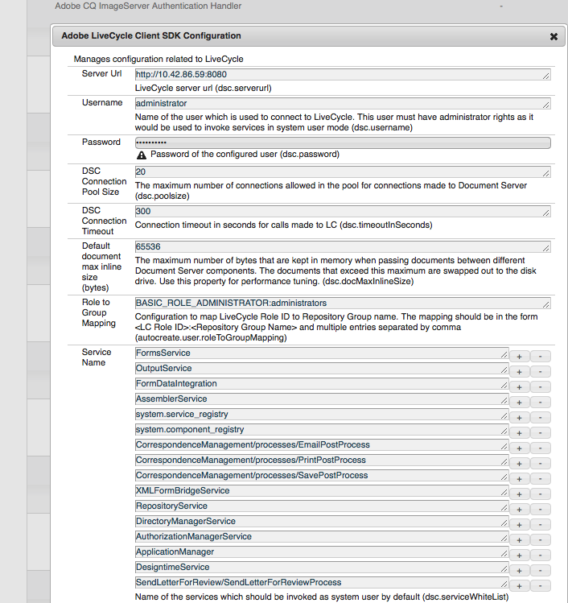

# Aangepaste actie/knop toevoegen in interface voor correspondentie maken {#add-custom-action-button-in-create-correspondence-ui}

## Overzicht {#overview}

Met de oplossing Correspondence Management kunt u aangepaste handelingen toevoegen aan de gebruikersinterface Correspondentie maken.

In het scenario in dit document wordt uitgelegd hoe u een knop in de gebruikersinterface voor correspondentie maken kunt maken om een brief te delen als een revisie-PDF die is gekoppeld aan een e-mail.

### Vereisten {#prerequisites}

Om dit scenario te voltooien, vereist u het volgende:

* Kennis van CRX en JavaScript
* LiveCycle Server

## Scenario: Maak de knop in de gebruikersinterface Correspondentie maken om een brief ter controle te verzenden {#scenario-create-the-button-in-the-create-correspondence-user-interface-to-send-a-letter-for-review}

Het toevoegen van een knop met een actie (hier verzend brief voor overzicht) aan Create Correspondence Gebruikersinterface omvat:

1. De knop toevoegen aan de gebruikersinterface Correspondentie maken
1. Handeling-afhandeling aan de knop toevoegen
1. Het LiveCycle-proces toevoegen om handelingen te kunnen afhandelen

### De knop toevoegen aan de gebruikersinterface Correspondentie maken {#add-the-button-to-the-create-correspondence-user-interface}

1. Ga naar Beheerder `https://'[server]:[port]'/[ContextPath]/crx/de` en meld u aan.
1. Maak in de map Apps een map met de naam pad/structuur, vergelijkbaar `defaultApp` met de map defaultApp (in configuratiemap). Gebruik de volgende stappen om de map te maken:

   1. Klik met de rechtermuisknop op de map **defaultApp** in het volgende pad en selecteer **Overlay Node**:

      /libs/fd/cm/config/defaultApp/

      

   1. Zorg ervoor dat het dialoogvenster Overlay-knooppunt de volgende waarden heeft:

      **Pad:** /libs/fd/cm/config/defaultApp/

      **Locatie bedekking:** /apps/

      **Identieke knooppunttypen:** Ingeschakeld

      

   1. Click **OK**.
   1. Klik op Alles **opslaan**.

1. Maak een kopie van het bestand acmExtensionsConfig.xml (bestaat onder de tak /libs) onder de tak /apps.

   1. Ga naar &quot;/libs/fd/cm/config/defaultApp/acmExtensionsConfig.xml&quot;

   1. Klik met de rechtermuisknop op het bestand acmExtensionsConfig.xml en selecteer **Kopiëren**.

      

   1. Klik met de rechtermuisknop op de map **defaultApp** op &quot;/apps/fd/cm/config/defaultApp/&quot; en selecteer **Plakken**.
   1. Klik op Alles **opslaan**.

1. Dubbelklik op de kopie van acmExtencesConfig.xml die u net in de map apps hebt gemaakt. Het bestand wordt geopend voor bewerking.
1. Zoek de volgende code:

   ```xml
   <?xml version="1.0" encoding="utf-8"?>
   <extensionsConfig>
       <modelExtensions>
           <modelExtension type="LetterInstance">
     <customAction name="Preview" label="loc.letterInstance.preview.label" tooltip="loc.letterInstance.preview.tooltip" styleName="previewButton"/>
               <customAction name="Submit" label="loc.letterInstance.submit.label" tooltip="loc.letterInstance.submit.tooltip" styleName="submitButton" permissionName="forms-users"/>
               <customAction name="SaveAsDraft" label="loc.letterInstance.saveAsDraft.label" tooltip="loc.letterInstance.saveAsDraft.tooltip" styleName="submitButton" permissionName="forms-users"/>
               <customAction name="Close" label="loc.letterInstance.close.label" tooltip="loc.letterInstance.close.tooltip" styleName="closeButton"/>
           </modelExtension>
       </modelExtensions>
   </extensionsConfig>
   ```

1. U kunt LiveCycle Forms Workflow gebruiken om een e-mailbrief te verzenden. Voeg als volgt een customAction-tag toe onder de modelExtension-tag in acmExtensionsConfig.xml:

   ```xml
    <customAction name="Letter Review" label="Letter Review" tooltip="Letter Review" styleName="" permissionName="forms-users" actionHandler="CM.domain.CCRCustomActionHandler">
         <serviceName>Forms Workflow -> SendLetterForReview/SendLetterForReviewProcess</serviceName>
       </customAction>
   ```

   

   De tag modelExtension heeft een set onderliggende tags van customAction die de handeling, machtigingen en weergave van de actieknop configureren. Hieronder volgt een lijst met aangepasteAction-configuratietags:

   | **Naam** | **Beschrijving** |
   |---|---|
   | name | De alfanumerieke naam voor de handeling die moet worden uitgevoerd. Waarde van deze tag is vereist, moet uniek zijn (binnen de tag modelExtension) en moet beginnen met een alfabet. |
   | label | Het label dat op de actieknop moet worden weergegeven |
   | tooltip | Knopinfo-tekst van de knop, die wordt weergegeven wanneer de gebruiker de muisaanwijzer op de knop plaatst. |
   | styleName | Naam van de aangepaste stijl die op de actieknop wordt toegepast. |
   | permissionName | De overeenkomstige actie wordt getoond slechts als de gebruiker de toestemming heeft die door permissionName wordt gespecificeerd. Wanneer u permissionName als specificeert `forms-users`, krijgen alle gebruikers toegang tot deze optie. |
   | actionHandler | Volledig gekwalificeerde naam van de klasse ActionHandler die wordt aangeroepen wanneer de gebruiker op de knop klikt. |

   Naast de bovenstaande parameters, kunnen er extra configuraties verbonden aan een customAction zijn. Deze extra configuraties worden ter beschikking gesteld aan de manager door het voorwerp CustomAction.

   | **Naam** | **Beschrijving** |
   |---|---|
   | serviceName | Als een customAction een kindmarkering met name serviceName bevat, dan wanneer het klikken van de relevante knoop/de verbinding, wordt een proces geroepen met de naam die door serviceName markering wordt vertegenwoordigd. Zorg ervoor dat dit proces dezelfde handtekening heeft als het PostProcess Letter. Voeg het voorvoegsel &quot;Forms Workflow ->&quot; toe aan de servicenaam. |
   | Parameters die het voorvoegsel cm_ bevatten in tagnaam | Als een customAction een kindmarkeringen bevat die met naam cm_ beginnen, dan in postproces (of het Proces van de Post van de Brief of het speciale proces door de markering serviceName wordt vertegenwoordigd) zijn deze parameters beschikbaar in de inputXML code onder de relevante markering met cm_ prefix verwijderd. |
   | actionName | Wanneer een postproces aan een klik toe te schrijven is, bevat voorgelegde XML een speciale markering met naam onder de markering met de naam van de gebruikersactie. |

1. Klik op Alles **opslaan**.

#### Een map met eigenschappen voor een landinstelling maken in de tak /apps {#create-a-locale-folder-with-properties-file-in-the-apps-branch}

Het bestand ACMExtensionsMessages.properties bevat labels en knopinfo-berichten van verschillende velden in de gebruikersinterface Correspondentie maken. Maak een kopie van dit bestand in de tak /apps om de aangepaste handelingen/knoppen te laten werken.

1. Klik met de rechtermuisknop op de **landinstellingenmap** in het volgende pad en selecteer **Overlayknooppunt**:

   /libs/fd/cm/config/defaultApp/locale

1. Zorg ervoor dat het dialoogvenster Overlay-knooppunt de volgende waarden heeft:

   **Pad:** /libs/fd/cm/config/defaultApp/locale

   **Locatie bedekking:** /apps/

   **Identieke knooppunttypen:** Ingeschakeld

1. Click **OK**.
1. Klik op Alles **opslaan**.
1. Klik met de rechtermuisknop op het volgende bestand en selecteer **Kopiëren**:

   `/libs/fd/cm/config/defaultApp/locale/ACMExtensionsMessages.properties`

1. Klik met de rechtermuisknop op de **landinstellingenmap** in het volgende pad en selecteer **Plakken**:

   `/apps/fd/cm/config/defaultApp/locale/`

   Het bestand ACMExtensionsMessages.properties wordt gekopieerd naar de map locale.

1. Als u de labels van de zojuist toegevoegde aangepaste handeling/knop wilt lokaliseren, maakt u het bestand ACMExtensionsMessages.properties voor de relevante landinstelling in `/apps/fd/cm/config/defaultApp/locale/`.

   Als u bijvoorbeeld de aangepaste handeling/knop wilt lokaliseren die in dit artikel is gemaakt, maakt u een bestand met de naam ACMExtensionsMessages_fr.properties met de volgende vermelding:

   `loc.letterInstance.letterreview.label=Revue De Lettre`

   Op dezelfde manier kunt u in dit bestand meer eigenschappen toevoegen, zoals voor knopinfo en stijl.

1. Klik op Alles **opslaan**.

#### Start de Adobe Asset Composer Building Block-bundel opnieuw {#restart-the-adobe-asset-composer-building-block-bundle}

Nadat u elke wijziging aan de serverzijde hebt aangebracht, start u de bundel Adobe Asset Composer Building Block opnieuw. In dit scenario worden de bestanden acmExtensionsConfig.xml en ACMExtensionsMessages.properties op de server bewerkt. Daarom moet de bundel Adobe Asset Composer Building Block opnieuw worden gestart.

>[!NOTE]
>
>Mogelijk moet u de cache van de browser wissen.

1. Ga naar `https://[host]:'port'/system/console/bundles`. Meld u indien nodig aan als beheerder.

1. Zoek de Adobe Asset Composer Building Block-bundel. Start de bundel opnieuw: Klik op Stoppen en vervolgens op Start.

   

Nadat u de bundel Adobe Asset Composer Building Block opnieuw hebt gestart, verschijnt de aangepaste knop in de Create Correspondence User Interface. U kunt een letter openen in de gebruikersinterface Correspondentie maken om een voorvertoning van de aangepaste knop weer te geven.

### Handeling toevoegen aan de knop {#add-action-handling-to-the-button}

De gebruikersinterface Correspondentie maken is standaard geïmplementeerd door ActionHandler in het bestand cm.domain.js op de volgende locatie:

/libs/fd/cm/ccr/gui/components/admin/clientlibs/ccr/js/cm.domain.js

Voor aangepaste handelingen-afhandeling maakt u een bedekking van het bestand cm.domain.js in de /apps-vertakking van CRX.

De handeling/knop bij klikken op handeling/knop wordt uitgevoerd met logica voor:

* De nieuw toegevoegde actie zichtbaar/onzichtbaar maken: gedaan door de actionVisible() functie te negeren.
* Nieuwe toegevoegde actie in-/uitschakelen: doet dit door de actionEnabled() functie te negeren.
* Werkelijke afhandeling van actie wanneer de gebruiker op de knop klikt: gedaan door de implementatie van de handleAction() functie te negeren.

1. Ga naar `https://'[server]:[port]'/[ContextPath]/crx/de`. Meld u indien nodig aan als beheerder.

1. Maak in de map Apps een map met de naam `js` in de tak /apps van CRX met een structuur die lijkt op de volgende map:

   `/libs/fd/cm/ccr/gui/components/admin/clientlibs/ccrui/js`

   Gebruik de volgende stappen om de map te maken:

   1. Klik met de rechtermuisknop op de map **js** in het volgende pad en selecteer **Overlay Node**:

      `/libs/fd/cm/ccr/gui/components/admin/clientlibs/ccrui/js`

   1. Zorg ervoor dat het dialoogvenster Overlay-knooppunt de volgende waarden heeft:

      **Pad:** /libs/fd/cm/ccr/gui/components/admin/clientlibs/ccrui/js

      **Locatie bedekking:** /apps/

      **Identieke knooppunttypen:** Ingeschakeld

   1. Click **OK**.
   1. Klik op Alles **opslaan**.

1. Maak in de map js een bestand met de naam ccrcustomization.js met de code voor het uitvoeren van handelingen met de knop door de volgende stappen uit te voeren:

   1. Klik met de rechtermuisknop op de map **js** in het volgende pad en selecteer **Maken > Bestand** maken:

      `/apps/fd/cm/ccr/gui/components/admin/clientlibs/ccrui/js`

      Geef het bestand een naam als ccrcustomization.js.

   1. Dubbelklik op het bestand ccrcustomization.js om dit te openen in CRX.
   1. Plak de volgende code in het bestand en klik op Alles **** opslaan:

      ```
      /* for adding and handling custom actions in Extensible Toolbar.
        * One instance of handler will be created for each action.
        * CM.domain.CCRCustomActionHandler is actionHandler class.
        */
      var CCRCustomActionHandler;
          CCRCustomActionHandler = CM.domain.CCRCustomActionHandler = new Class({
              className: 'CCRCustomActionHandler',
              extend: CCRDefaultActionHandler,
              construct : function(action,model){
              }
          });
          /**
           * Called when user user click an action
           * @param extraParams additional arguments that may be passed to handler (For future use)
           */
          CCRCustomActionHandler.prototype.handleAction = function(extraParams){
              if (this.action.name == CCRCustomActionHandler.SEND_FOR_REVIEW) {
                  var sendForReview = function(){
                      var serviceName = this.action.actionConfig["serviceName"];
                      var inputParams = {};
                      inputParams["dataXML"] = this.model.iccData.data;
                      inputParams["letterId"] = this.letterVO.id;
                      inputParams["letterName"] = this.letterVO.name;
                      inputParams["mailId"] = $('#email').val();
                      /*function to invoke the LivecyleService */
                      ServiceDelegate.callJSONService(this,"lc.icc.renderlib.serviceInvoker.json","invokeProcess",[serviceName,inputParams],this.onProcessInvokeComplete,this.onProcessInvokeFail);
                      $('#ccraction').modal("hide");
                  }
                  if($('#ccraction').length == 0){
                      /*For first click adding popup & setting letterName.*/
                      $("body").append(popUp);
                      $("input[id*='letterName']").val(this.letterVO.name);
                      $(document).on('click',"#submitLetter",$.proxy( sendForReview, this ));
                  }
                  $('#ccraction').modal("show");
              }
          };
          /**
           * Should the action be enabled in toolbar
           * @param extraParams additional arguements that may be passed to handler (For future use)
           * @return flag indicating whether the action should be enabled
           */
         CCRCustomActionHandler.prototype.actionEnabled = function(extraParams){
                  /*can be customized as per user requirement*/
                  return true;
          };
          /**
           * Should the action be visible in toolbar
           * @param extraParams additional arguments that may be passed to handler (For future use)
           * @return flag indicating whether the action should be enabled
           */
          CCRCustomActionHandler.prototype.actionVisible = function(extraParams){
              /*Check can be enabled for Non-Preview Mode.*/
              return true;
          };
          /*SuccessHandler*/
          CCRCustomActionHandler.prototype.onProcessInvokeComplete = function(response) {
              ErrorHandler.showSuccess("Letter Sent for Review");
          };
          /*FaultHandler*/
          CCRCustomActionHandler.prototype.onProcessInvokeFail = function(event) {
              ErrorHandler.showError(event.message);
          };
          CCRCustomActionHandler.SEND_FOR_REVIEW  = "Letter Review";
      /*For PopUp*/
          var popUp = '<div class="modal fade" id="ccraction" tabindex="-1" role="dialog" aria-hidden="true">'+
          '<div class="modal-dialog modal-sm">'+
              '<div class="modal-content">' +
                  '<div class="modal-header">'+
                      '<button type="button" class="close" data-dismiss="modal" aria-label="Close"><span aria-hidden="true">&times;</code></button>'+
                      '<h4 class="modal-title"> Send Review </h4>'+
                  '</div>'+
                  '<div class="modal-body">'+
                      '<form>'+
                          '<div class="form-group">'+
                              '<label class="control-label">Email Id</label>'+
                              '<input type="text" class="form-control" id="email">'+
                          '</div>'+
                          '<div class="form-group">'+
                              '<label  class="control-label">Letter Name</label>'+
                              '<input id="letterName" type="text" class="form-control" readonly>'+
                          '</div>'+
                          '<div class="form-group">'+
                              '<input id="letterData" type="text" class="form-control hide" readonly>'+
                          '</div>'+
                      '</form>'+
                  '</div>'+
                  '<div class="modal-footer">'+
                     '<button type="button" class="btn btn-default" data-dismiss="modal"> Cancel </button>'+
                     '<button type="button" class="btn btn-primary" id="submitLetter"> Submit </button>'+
                  '</div>'+
              '</div>'+
          '</div>'+
      '</div>';
      ```

### Het LiveCycle-proces toevoegen om <span class="acrolinxCursorMarker"></code>handelingen te kunnen afhandelen {#add-the-livecycle-process-to-enable-action-span-class-acrolinxcursormarker-span-handling}

In dit scenario schakelt u de volgende componenten in, die deel uitmaken van het bestand components.zip in de bijlage:

* DSC-component jar (DSCSample.jar)
* Letter verzenden voor revisieproces LCA (SendLetterForReview.lca)

Download en decomprimeer het bestand components.zip om de bestanden DSCSample.jar en SendLetterForReview.lca op te halen. Gebruik deze bestanden volgens de onderstaande procedures.
components.zip

#### De LiveCycle-server configureren om het LCA-proces uit te voeren {#configure-the-livecycle-server-to-run-the-lca-process}

>[!NOTE]
>
>Deze stap wordt vereist slechts als u op een opstelling OSGI bent en LC integratie wordt vereist voor het type van aanpassing u implementeert.

Het LCA-proces wordt uitgevoerd op de LiveCycle-server en vereist het serveradres en de aanmeldingsgegevens.

1. Ga naar Beheerder `https://'[server]:[port]'/system/console/configMgr` en meld u aan.
1. Zoek Adobe LiveCycle Client SDK Configuration en klik op **Edit** (bewerkingspictogram). Het deelvenster Configuraties wordt geopend.

1. Voer de volgende gegevens in en klik op **Opslaan**:

   * **Server-URL**: URL van de server LC waarvan verzendt voor de dienst van het Overzicht de code van de actiemanager gebruikt.
   * **Gebruikersnaam**: Gebruikersnaam beheerder van de LC-server
   * **Wachtwoord**: Wachtwoord voor de gebruikersnaam van de beheerder
   

#### LiveCycle Archive (LCA) installeren {#install-livecycle-archive-lca}

Het vereiste LiveCycle-proces dat het e-mailserviceproces mogelijk maakt.

>[!NOTE]
>
>Als u wilt zien wat dit proces doet of een vergelijkbaar proces wilt maken, hebt u Workbench nodig.

1. Meld u aan als beheerder bij Livecycle Server adminui bij `https:/[lc server]/:[lc port]/adminui`.

1. Ga naar **Home > Services > Toepassingen en services > Toepassingsbeheer**.

1. Als de toepassing SendLetterForReview al aanwezig is, sla de resterende stappen in deze procedure over, anders ga aan de volgende stappen verder.

   

1. Klik op **Importeren**.

1. Klik op Bestand **** kiezen en selecteer SendLetterForReview.lca.

   

1. Klik op **Voorvertoning**.

1. Selecteer Elementen **bij uitvoering implementeren wanneer het importeren is voltooid**.

1. Klik op **Importeren**.

#### ServiceName toevoegen aan de lijst van de Dienst WhiteListed {#adding-servicename-to-the-whitelisted-service-list}

Vermeld in de AEM-server de LiveCycle-services die u wilt openen tot de AEM-server.

1. Meld u aan als beheerder bij `https:/[host]:'port'/system/console/configMgr`.

1. Zoek en klik op **Adobe LiveCycle Client SDK Configuration**. Het deelvenster Configuration van Adobe LiveCycle Client SDK wordt weergegeven.
1. Klik in de lijst Servicenaam op + pictogram en voeg een serviceName **SendLetterForReview/SendLetterForReviewProcess** toe.

1. Click **Save**.

#### De e-mailservice configureren {#configure-the-email-service}

In dit scenario configureert u de e-mailservice in de LiveCycle-server, zodat Correspondence Management een e-mailbericht kan verzenden.

1. Meld u met beheerdersgegevens aan bij Livecycle Server-beheerder om `https:/[lc server]:[lc port]/adminui`.

1. Ga naar **Home > Services > Toepassingen en services > Servicebeheer**.

1. Zoek en klik op **EmailService**.

1. In **Gastheer** SMTP, vorm de e-maildienst.

1. Click **Save**.

#### De DSC-service configureren {#configure-the-dsc-service}

Als u de API voor correspondentiebeheer wilt gebruiken, downloadt u de DSCSample.jar (die in dit document is gekoppeld als onderdeel van components.zip) en uploadt u deze naar de LiveCycle-server. Nadat het bestand DSCSample.jar naar de LiveCycle-server is geüpload, gebruikt de AEM-server het bestand DSCSample.jar om toegang te krijgen tot de renderLetter-API.

Zie [AEM-formulieren verbinden met Adobe LiveCycle](/help/forms/using/aem-livecycle-connector.md)voor meer informatie.

1. Werk de URL van de AEM-server in cmsa.properties bij in DSCSample.jar, die zich op de volgende locatie bevindt:

   DSCSample.jar\com\adobe\livecycle\cmsa.properties

1. Geef de volgende parameters op in het configuratiebestand:

   * **crx.serverUrl**=https:/host:port/[contextpad]/[AEM URL]
   * **crx.username**= AEM-gebruikersnaam
   * **crx.password**= AEM-wachtwoord
   * **crx.appRoot**=/content/apps/cm
   >[!NOTE]
   >
   >Start de LiveCycle Server telkens opnieuw wanneer u wijzigingen op de server aanbrengt. Zie LiveCycle ES [uitbreiden via aangepaste DSC-ontwikkeling](https://www.adobe.com/devnet/livecycle/articles/dsc_development.html)voor informatie over het maken van uw eigen LiveCycle-component.

   Het bestand DSCSample.jar gebruikt de renderLetter-API. Voor meer informatie over renderLetter API, zie [Interface LetterRenderService](https://helpx.adobe.com/aem-forms/6-2/javadocs/com/adobe/icc/ddg/api/LetterRenderService.html).

#### DSC importeren in LiveCyle {#import-dsc-to-livecyle}

Het bestand DSCSample.jar gebruikt de renderLetter-API om de letter te renderen als PDF-bytes van XML-gegevens die C als invoer geeft. Zie [Letter Render Service](https://helpx.adobe.com/aem-forms/6-2/javadocs/com/adobe/icc/ddg/api/LetterRenderService.html)voor meer informatie over renderLetter en andere API&#39;s.

1. Start Workbench en meld u aan.
1. Selecteer **Venster > Weergaven tonen > Componenten**. De weergave Componenten wordt toegevoegd aan Workbench ES2.

1. Klik met de rechtermuisknop op **Componenten** en selecteer Component **** installeren.

1. Selecteer het bestand **DSCSample.jar** in de bestandenbrowser en klik op **Openen**.
1. Klik met de rechtermuisknop op **RenderWrapper** en selecteer **Component** starten. Als de component start, verschijnt er een groene pijl naast de naam van de component.

## Ter controle verzenden {#send-letter-for-review}

Nadat u de actie en de knoop voor het verzenden van de brief voor overzicht hebt gevormd:

1. Wis de browsercache.

1. Klik in de gebruikersinterface Correspondentie maken op **Letter Review** en geef de e-mailadres van de revisor op.

1. Klik op **Verzenden**.


De controleur ontvangt een e-mail van het systeem met de brief als PDF-bijlage.
