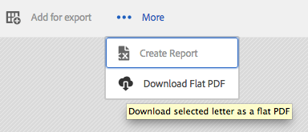

# Aangepaste actie toevoegen aan de weergave Lijst met activa{#add-custom-action-to-the-asset-listing-view}

## Overzicht {#overview}

Met de oplossing Correspondence Management kunt u aangepaste handelingen toevoegen aan de gebruikersinterface Middelen beheren.

U kunt een aangepaste actie toevoegen aan de weergave Lijst met middelen voor:

* Een of meer elementtypen of letters
* Uitvoering (handeling/opdracht wordt actief) bij selectie van afzonderlijke, meerdere elementen/letters of zonder selectie

Deze aanpassing wordt geïllustreerd met het scenario waarin de opdracht Vlakke PDF downloaden wordt toegevoegd aan de weergave Lijst met activa voor letters. Met dit aanpassingsscenario kunnen gebruikers één PDF-bestand met één geselecteerde letter downloaden.

### Vereisten {#prerequisites}

Om het volgende scenario of gelijkaardige te voltooien, vereist u kennis van:

* CRX
* JavaScript
* Java

## Scenario: Voeg een opdracht toe aan de gebruikersinterface van de lijst Letters om de platte PDF-versie van een letter te downloaden {#addcommandtoletters}

In de onderstaande stappen voegt u de opdracht Vlakke PDF downloaden toe aan de weergave Lijst met activa voor letters en stelt u uw gebruikers in staat om de platte PDF van de geselecteerde brief te downloaden. Als u deze stappen gebruikt met de juiste code en parameters, kunt u een andere functionaliteit toevoegen voor een ander element, zoals gegevenswoordenboeken of teksten.

Voer de volgende stappen uit als u Correspondentiebeheer wilt aanpassen, zodat uw gebruikers een PDF met standaardletters kunnen downloaden:

1. Ga naar Beheerder `https://'[server]:[port]'/[ContextPath]/crx/de` en meld u aan.

1. Maak in de map apps een map met de naam items met een pad/structuur die lijkt op de map met items in de selectiemap en voer daarbij de volgende stappen uit:

   1. Klik met de rechtermuisknop op de map **Items** in het volgende pad en selecteer **Overlayknooppunt**:

      `/libs/fd/cm/ma/gui/content/cmassets/jcr:content/body/content/header/items/selection/items`

      >[!NOTE]
      >
      >Dit pad is specifiek voor het maken van een handeling die werkt met de selectie van een of meer elementen/letters. Als u een handeling wilt maken die zonder selectie werkt, moet u een overlayknooppunt maken voor het volgende pad en de overige stappen dienovereenkomstig uitvoeren:
      >
      >
      >`/libs/fd/cm/ma/gui/content/cmassets/jcr:content/body/content/header/items/default/items`

      

   1. Zorg ervoor dat het dialoogvenster Overlay-knooppunt de volgende waarden heeft:

      **Pad:** /libs/fd/cm/ma/gui/content/cmassets/jcr:content/body/content/header/items/selection/items

      **Locatie:** /apps/

      **Identieke knooppunttypen:** Geselecteerd

      

   1. Click **OK**. De mapstructuur wordt gemaakt in de map apps.

      Klik op Alles **opslaan**.

1. Voeg onder de map met nieuw gemaakte items een knooppunt toe voor de aangepaste knop/handeling in een bepaald element (bijvoorbeeld: downloadFlatPDF) gebruikend de volgende stappen:

   1. Klik met de rechtermuisknop op de map **Items** en selecteer **Maken** > **Knooppunt** maken.

   1. Zorg ervoor dat het dialoogvenster Knooppunt maken de volgende waarden heeft en klik op **OK**:

      **Naam:** downloadFlatPDF (of de naam die u aan deze eigenschap wilt geven)

      **Type:** nt:ongestructureerd

   1. Klik op het nieuwe knooppunt dat u hebt gemaakt (hier downloadFlatPDF). CRX geeft de eigenschappen van het knooppunt weer.

   1. Voeg de volgende eigenschappen toe aan het knooppunt (hier downloadFlatPDF) en klik op Alles **** opslaan:

      <table>
        <tbody>
        <tr>
        <td><strong>Naam</strong></td>
        <td><strong>Type</strong></td>
        <td><strong>Waarde en beschrijving</strong></td>
        </tr>
        <tr>
        <td>class</td>
        <td>Tekenreeks</td>
        <td>stichting-collectie-actie</td>
        </tr>
        <tr>
        <td>stichting-collectie-actie</td>
        <td>Tekenreeks</td>
        <td><p>{"target": ".cq-manageasset-admin-childpages", "activeSelectionCount": "single","type": "LETTER"}<br /> <br /> <br /> activeSelectionCount <strong></strong> kan enkelvoudig of meervoudig zijn om selecties van enkelvoudige of meervoudige elementen mogelijk te maken waarop de aangepaste handeling wordt uitgevoerd.</p> <p><strong>type</strong> kan een of meer (komma's scheiden meerdere items) van het volgende zijn: LETTER,TEKST,LIJST,VOORWAARDE,GEGEVENSWOORDENBOEK</p> </td>
        </tr>
        <tr>
        <td>pictogram</td>
        <td>Tekenreeks</td>
        <td>pictogram-download<br /> <br /> het pictogram dat Correspondence Management aan de linkerkant van uw bevel/menu toont. Raadpleeg de documentatie bij <a href="https://docs.adobe.com/docs/en/aem/6-3/develop/ref/coral-ui/coralui3/Coral.Icon.html" target="_blank"></a>CoralUI-pictogrammen voor meer informatie over de beschikbare pictogrammen en instellingen.<br /> </td>
        </tr>
        <tr>
        <td>jcr:primaryType</td>
        <td>Naam</td>
        <td>nt:ongestructureerd</td>
        </tr>
        <tr>
        <td>vat</td>
        <td>Tekenreeks</td>
        <td>download-flat-pdf-button</td>
        </tr>
        <tr>
        <td>sling:resourceType</td>
        <td>Tekenreeks</td>
        <td>graniet/ui/componenten/endor/actionbar/knop</td>
        </tr>
        <tr>
        <td>text</td>
        <td>Tekenreeks</td>
        <td>Vlakke PDF downloaden (of een ander label)<br /><br /> De opdracht die wordt weergegeven in de interface Asset Listening</td>
        </tr>
        <tr>
        <td>title</td>
        <td>Tekenreeks</td>
        <td>Download een vlakke PDF van de geselecteerde brief (of een andere etiket/alt tekst)<br /> <br /> De titel is de alt tekst die de Managementvertoningen van de Overeenstemming wanneer de gebruiker over het douanebevel beweegt.</td>
        </tr>
        </tbody>
       </table>

1. Maak in de map apps een map met de naam js met een pad/structuur die lijkt op de map met items in de map admin met de volgende stappen:

   1. Klik met de rechtermuisknop op de map **js** in het volgende pad en selecteer **Overlay Node**:

      `/libs/fd/cm/ma/gui/components/admin/clientlibs/admin/js`

   1. Zorg ervoor dat het dialoogvenster Overlay-knooppunt de volgende waarden heeft:

      **Pad:** /libs/fd/cm/ma/gui/components/admin/clientlibs/admin/js

      **Locatie:** /apps/

      **Identieke knooppunttypen:** Geselecteerd

   1. Click **OK**. De mapstructuur wordt gemaakt in de map apps. Klik op Alles **opslaan**.

1. Maak in de map js een bestand met de naam formaction.js met de code voor de afhandeling van handelingen van de knop door de volgende stappen uit te voeren:

   1. Klik met de rechtermuisknop op de map **js** in het volgende pad en selecteer **Maken > Bestand** maken:

      `/apps/fd/cm/ma/gui/components/admin/clientlibs/admin/js`

      Geef het bestand een naam als formaction.js.

   1. Dubbelklik op het bestand om het te openen in CRX.
   1. Kopieer in het bestand formaction.js (onder de tak /apps) de code uit het bestand formaction.js op de volgende locatie:

      `/libs/fd/cm/ma/gui/components/admin/clientlibs/admin/js/formaction.js`

      Voeg vervolgens de volgende code aan het einde toe in het bestand formaction.js (onder de tak /apps) en klik op Alles **** opslaan:

      ```javascript
      /* Action url for xml file to be added.*/
      var ACTION_URL = "/apps/fd/cm/ma/gui/content/commons/actionhandlers/items/letterpdfdownloader.html";
      
      /* File upload handling*/
      var fileSelectedHandler = function(e){
          if(e && e.target && e.target.value)
              $(".downloadLetterPDFBtn").removeAttr('disabled');
          else
              $(".downloadLetterPDFBtn").attr('disabled','disabled');
      }
      
      /*Handing of Download button in pop up.*/
      var downloadClickHandler = function(){
          $('#downloadLetterPDFDilaog').modal("hide");
          var element = $('.foundation-selections-item');
          var path = $(element).data("path");
          $("#fileUploadForm").attr('action', ACTION_URL + "?letterId="+path).submit();
      }
      
      /*Click handling on action button.*/
      $(document).on("click",'.download-flat-pdf-button',function(e){
          $("#uploadSamepledata").val("");
           if($('#downloadLetterPDFDilaog').length == 0){
              $(document).on("click",".downloadLetterPDFBtn",downloadClickHandler);
              $(document).on("change","#uploadSamepledata",fileSelectedHandler);
              $("body").append(downloadLetterPDFDilaog);
          }
            $('#downloadLetterPDFDilaog').modal("show");
      });
      
      /*Download popup.*/
      var downloadLetterPDFDilaog = '<div id="downloadLetterPDFDilaog" class="coral-Modal notice " role="dialog"  aria-hidden="true">'+
          '<form id="fileUploadForm" method="POST" enctype="multipart/form-data">'+
              '<div class="coral-Modal-header">'+
                  '<h2 class="coral-Modal-title coral-Heading coral-Heading--2" id="modal-header1443020790107-label" tabindex="0">Download Letter as PDF.</h2>'+
                  '<button type="button" class="coral-MinimalButton coral-Modal-closeButton" data-dismiss="modal">×</button>'+
              '</div>'+
              '<div class="coral-Modal-body" id="modal-header1443020790107-message" role="document" tabindex="0">'+
                  '<div class="coral-Modal-message">'+
                      '<p></p>'+
                  '</div>'+
                  '<div class="coral-Modal-uploader">'+
                      '<p>Select sample data for letter.</p>'+
                      '<input type="file" id="uploadSamepledata" name="file" accept=".xml" size="70px">'+
                  '</div>'+
              '</div>'+
           '</form>'+
              '<div class="coral-Modal-footer">'+
                  '<button type="button" class="coral-Button" data-dismiss="modal">Cancel</button>'+
                  '<button type="button" class="coral-Button coral-Button--primary downloadLetterPDFBtn" disabled="disabled">Download</button>'+
              '</div>'+
      '</div>';
      ```

      De code die u in deze stap toevoegt, overschrijft de code onder de map libs. Kopieer daarom de vorige code naar het bestand formaction.js in de vertakking /apps. Het kopiëren van de code van de /libs tak aan de /apps tak zorgt ervoor dat de vorige functionaliteit ook werkt.

      De bovenstaande code is bedoeld voor handelingen met letters van de opdracht die in deze procedure wordt gemaakt. Wijzig de JavaScript-code voor de afhandeling van handelingen met andere elementen.

1. Maak in de map apps een map met de naam items met een pad/structuur die lijkt op de map met items in de map met actionhandlers. Ga hierbij als volgt te werk:

   1. Klik met de rechtermuisknop op de map **Items** in het volgende pad en selecteer **Overlayknooppunt**:

      `/libs/fd/cm/ma/gui/content/commons/actionhandlers/items/`

   1. Zorg ervoor dat het dialoogvenster Overlay-knooppunt de volgende waarden heeft:

      **Pad:** /libs/fd/cm/ma/gui/content/commons/actionhandlers/items/

      **Locatie:** /apps/

      **Identieke knooppunttypen:** Geselecteerd

   1. Click **OK**. De mapstructuur wordt gemaakt in de map apps.

   1. Klik op Alles **opslaan**.

1. Voeg onder het nieuwe knooppunt Items een knooppunt toe voor de aangepaste knop/handeling in een bepaald element (bijvoorbeeld: letterpdfdownloader) met behulp van de volgende stappen:

   1. Klik met de rechtermuisknop op de map met items en selecteer **Maken > Knooppunt** maken.

   1. Zorg ervoor dat het dialoogvenster Knooppunt maken de volgende waarden heeft en klik op **OK**:

      **Naam:** letterpdfdownloader (Of de naam die u aan deze eigenschap wilt geven) moet uniek zijn. Als u hier een andere naam gebruikt, geeft u hetzelfde op in de variabele ACTION_URL van het bestand formaction.js.)

      **Type:** nt:ongestructureerd

   1. Klik op het nieuwe knooppunt dat u hebt gemaakt (hier downloadFlatPDF). CRX geeft de eigenschappen van het knooppunt weer.

   1. Voeg de volgende eigenschap toe aan het knooppunt (hier letterpdfdownloader) en klik op Alles **** opslaan:

      | **Naam** | **Type** | **Waarde** |
      |---|---|---|
      | sling:resourceType | Tekenreeks | fd/cm/ma/gui/components/admin/clientlibs/admin |

1. Maak een bestand met de naam POST.jsp met de code voor de afhandeling van handelingen van de opdracht op de volgende locatie:

   /apps/fd/cm/ma/gui/components/admin/clientlibs/admin

   1. Klik met de rechtermuisknop op de **beheermap** op het volgende pad en selecteer **Maken > Bestand** maken:

      /apps/fd/cm/ma/gui/components/admin/clientlibs/admin

      Geef het bestand een naam als POST.jsp. (De bestandsnaam moet alleen POST.jsp zijn.)

   1. Dubbelklik op het bestand **POST.jsp** om het te openen in CRX.
   1. Voeg de volgende code toe aan het POST.jsp-bestand en klik op **Alles** opslaan:

      Deze code is specifiek voor de brief teruggeeft dienst. Voeg voor andere elementen de Java-bibliotheken van dat element aan deze code toe. Zie [AEM Forms API](https://adobe.com/go/learn_aemforms_javadocs_63_en)voor meer informatie over AEM Forms API&#39;s.

      Zie AEM [Components](/help/sites-developing/components.md)voor meer informatie over AEM-bibliotheken.

      ```xml
      /*Import libraries. Here we are downloading letter flat pdf with input xml data so we require letterRender Api. For any other Module functionality we need to first import that library. */
      <%@include file="/libs/foundation/global.jsp"%>
      <!DOCTYPE html lang="en" PUBLIC "-//W3C//DTD XHTML 1.1//EN" "https://www.w3.org/TR/xhtml11/DTD/xhtml11.dtd">
      <%@page import="com.adobe.icc.ddg.api.*"%>
      <%@page import="com.adobe.icc.dbforms.obj.*"%>
      <%@page import="com.adobe.icc.render.obj.*" %>
      <%@page import="com.adobe.icc.services.api.*" %>
      <%@page import="org.apache.sling.api.resource.*" %>
      <%@page import="java.io.File" %>
      <%@page import="java.util.*" %>
      <%@page import="com.adobe.livecycle.content.appcontext.AppContextManager"%>
      <%@page import=" com.adobe.icc.dbforms.exceptions.ICCException"%>
      <%@page import="java.io.InputStream" %>
      <%@page import="java.io.FileInputStream" %>
      <%@page import="org.apache.commons.io.IOUtils" %>
      <%@page session="false" contentType="text/html; charset=utf-8"%>
      <%@taglib prefix="sling" uri="https://sling.apache.org/taglibs/sling/1.0"%>
      <%@taglib prefix="cq" uri="https://www.day.com/taglibs/cq/1.0" %>
       <%@page session="false" contentType="text/html; charset=utf-8"%>
      <%
         AppContextManager.setCurrentAppContext("/content/apps/cm");
         /*Get letter id sent in js file.*/
          String letterId = request.getParameter("letterId");
          if(letterId.lastIndexOf("?") != -1)
              letterId = letterId.substring(0, letterId.indexOf("?"));
          String fileName = null;
          String letterName = null;
          InputStream inputStream = null;
          /*Get xml file data*/
          if (slingRequest.getRequestParameter("file") != null)
              inputStream = slingRequest.getRequestParameter("file").getInputStream();
          if(letterId != null){
              String xmlData = null;
              try{
                  xmlData = IOUtils.toString(inputStream, "UTF-8");
              }
              catch (Exception e) {
                  log.error("Xml data does not exists.");
              }
              /*letter Name from letter letter id.*/
              letterName = letterId.substring(letterId.lastIndexOf("/")+1);
              /*Invoking letter render services API.*/
              LetterRenderService letterRenderService = sling.getService(LetterRenderService.class);
              /*using CM renderLetter api to get pdfbytes.*/
              PDFResponseType  pdfResponseType= letterRenderService.renderLetter(letterId,xmlData,true,false,false,false);
              byte[] bytes = null;
              /*Downloading pdf bytes as pdf.*/
              if(pdfResponseType != null && pdfResponseType.getFile() != null){
                  bytes = pdfResponseType.getFile().getDocument();
                  /*set the response header to enable download*/
                  response.setContentType("application/OCTET-STREAM");
                  response.setHeader("Content-Disposition", "attachment;filename=\"" + letterName + ".pdf\"");
                  response.setHeader("Pragma", "cache");
                  response.setHeader("Cache-Control", "private");
                  out.clear();
                  response.getOutputStream().write(bytes);
              }
          }
          else{
              log.error("Letter id does not exists.");
          }
      %>
      ```

## Vlakke PDF van een letter downloaden met behulp van de aangepaste functionaliteit {#download-flat-pdf-of-a-letter-using-the-custom-functionality}

Nadat u aangepaste functionaliteit hebt toegevoegd om de platte PDF van uw brieven te downloaden, kunt u de volgende stappen gebruiken om de vlakke versie PDF van de brief te downloaden u uitgezocht:

1. Ga naar `https://'[server]:[port]'/[ContextPath]/projects.html` en meld u aan.

1. Selecteer **Formulieren > Letters**. Correspondentiebeheer geeft een overzicht van de beschikbare letters in het systeem.
1. Klik op **Selecteren** en klik vervolgens op een letter om deze te selecteren.
1. Selecteer **Meer** > **&lt;Alleen PDF downloaden>** (De aangepaste functionaliteit die u hebt gemaakt met de instructies in dit artikel). Het dialoogvenster Letter downloaden als PDF wordt geopend.

   De naam, functionaliteit en alt-text van het menu-item zijn gebaseerd op de aanpassing die in [Scenario is gemaakt: Voeg een opdracht toe aan de gebruikersinterface van de lijst Letters om de platte PDF-versie van een letter te downloaden.](#addcommandtoletters)

   

1. Selecteer in het dialoogvenster Letter downloaden als PDF de relevante XML waaruit u de gegevens in de PDF wilt invullen.

   >[!NOTE]
   >
   >Voordat u de brief als een platte PDF downloadt, kunt u het XML-bestand met de gegevens in de brief maken met de optie Rapport **** maken.

   

   De brief wordt gedownload aan uw computer als vlakke PDF.

