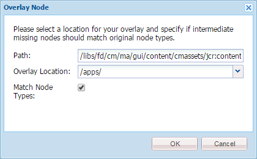

# Aangepaste actie toevoegen aan de weergave Lijst met activa{#add-custom-action-to-the-asset-listing-view}

## Overzicht {#overview}

Met de oplossing Correspondence Management kunt u aangepaste handelingen toevoegen aan de gebruikersinterface Middelen beheren.

U kunt een aangepaste actie toevoegen aan de weergave Lijst met middelen voor:

* Een of meer elementtypen of letters
* Uitvoering (handeling/opdracht wordt actief) bij selectie van afzonderlijke, meerdere elementen/letters of zonder selectie

Deze aanpassing wordt getoond met het scenario dat een bevel &quot;PDF van de Download Flat&quot;aan de mening van de Lijst van Activa voor Letters toevoegt. Met dit aanpassingsscenario kunnen uw gebruikers één PDF van één geselecteerde letter downloaden.

### Vereisten {#prerequisites}

Om het volgende scenario of gelijkaardige te voltooien, vereist u kennis van:

* CRX
* JavaScript
* Java™

## Scenario: voeg een bevel aan het de lijstgebruikersinterface van Letters toe om vlakke versie van PDF van een brief te downloaden {#addcommandtoletters}

In de onderstaande stappen voegt u de opdracht Vlakke PDF downloaden toe aan de weergave Lijst met activa voor letters en kunt u gebruikers de platte PDF van de geselecteerde letter downloaden. Als u deze stappen gebruikt met de juiste code en parameters, kunt u een andere functionaliteit toevoegen voor een ander element, zoals gegevenswoordenboeken of teksten.

Voer de volgende stappen uit als u Correspondentiebeheer wilt aanpassen, zodat uw gebruikers een vlakke PDF van letters kunnen downloaden:

1. Ga naar `https://'[server]:[port]'/[ContextPath]/crx/de` en aanmelden als beheerder.

1. Maak in de map Apps een map met de naam Items met een pad/structuur die vergelijkbaar is met de map Items in de selectiemap. Ga hierbij als volgt te werk:

   1. Klik met de rechtermuisknop op de knop **items** map op het volgende pad en selecteer **Overlayknooppunt**:

      `/libs/fd/cm/ma/gui/content/cmassets/jcr:content/body/content/header/items/selection/items`

      >[!NOTE]
      >
      >Dit pad is specifiek voor het maken van een handeling die werkt met de selectie van een of meer elementen/letters. Als u een actie wilt maken die zonder selectie werkt, maakt u een overlayknooppunt voor het volgende pad en voert u de overige stappen dienovereenkomstig uit:
      >
      >
      >`/libs/fd/cm/ma/gui/content/cmassets/jcr:content/body/content/header/items/default/items`

      

   1. Zorg ervoor dat het dialoogvenster Overlay-knooppunt de volgende waarden heeft:

      **Pad:** /libs/fd/cm/ma/gui/content/cmassets/jcr:content/body/content/header/items/selection/items

      **Locatie:** /apps/

      **Identieke knooppunttypen:** Geselecteerd

      

   1. Klikken **OK**. De mapstructuur wordt gemaakt in de map apps.

      Klikken **Alles opslaan**.

1. Voeg onder de map met nieuw gemaakte items een knooppunt toe voor de aangepaste knop/handeling in een bepaald element (bijvoorbeeld: downloadFlatPDF) door de volgende stappen uit te voeren:

   1. Klik met de rechtermuisknop op de knop **items** map en selecteer **Maken** > **Knooppunt maken**.

   1. Zorg ervoor dat het dialoogvenster Knooppunt maken de volgende waarden heeft en klik op **OK**:

      **Naam:** downloadFlatPDF (of de naam die u aan deze eigenschap wilt geven)

      **Type:** nt:ongestructureerd

   1. Klik op het nieuwe knooppunt dat u hebt gemaakt (hier downloadFlatPDF). CRX geeft de eigenschappen van het knooppunt weer.

   1. Voeg de volgende eigenschappen toe aan het knooppunt (hier downloadFlatPDF) en klik **Alles opslaan**:

      <table>
        <tbody>
        <tr>
        <td><strong>Naam</strong></td>
        <td><strong>Type</strong></td>
        <td><strong>Waarde en beschrijving</strong></td>
        </tr>
        <tr>
        <td>class</td>
        <td>String</td>
        <td>stichting-collectie-actie</td>
        </tr>
        <tr>
        <td>stichting-collectie-actie</td>
        <td>String</td>
        <td><p>{"target": ".cq-manageasset-admin-children pages", "activeSelectionCount": "single","type": "LETTER"}<br /> <br /> <br /> <strong>activeSelectionCount</strong> kan enkelvoudig of meervoudig zijn om selecties toe te staan van enkelvoudige of meervoudige elementen waarop de aangepaste handeling wordt uitgevoerd.</p> <p><strong>type</strong> kan één of meerdere (komma's scheiden veelvoudige ingangen) van het volgende zijn: BRIEF, TEKST, LIJST, VOORWAARDE, DATADICTIONARY</p> </td>
        </tr>
        <tr>
        <td>pictogram</td>
        <td>String</td>
        <td>icon-download<br /> <br /> Het pictogram dat Correspondence Management links van uw opdracht/menu weergeeft. Voor verschillende beschikbare pictogrammen en instellingen raadpleegt u <a href="https://experienceleague.adobe.com/docs/experience-manager-release-information/aem-release-updates/previous-updates/aem-previous-versions.html" target="_blank">documentatie over CoralUI-pictogrammen</a>.<br /> </td>
        </tr>
        <tr>
        <td>jcr:primaryType</td>
        <td>Naam</td>
        <td>nt:ongestructureerd</td>
        </tr>
        <tr>
        <td>vat</td>
        <td>String</td>
        <td>download-flat-pdf-button</td>
        </tr>
        <tr>
        <td>sling:resourceType</td>
        <td>String</td>
        <td>graniet/ui/componenten/endor/actionbar/knop</td>
        </tr>
        <tr>
        <td>text</td>
        <td>String</td>
        <td>Vlakke PDF downloaden (of een ander label)<br /> <br /> De opdracht die wordt weergegeven in de interface Asset Listing</td>
        </tr>
        <tr>
        <td>titel</td>
        <td>String</td>
        <td>Een vlakke PDF van de geselecteerde letter downloaden (of een andere label/Alt-tekst)<br /> <br /> De titel is de alt tekst die het Beheer van de Correspondentie toont wanneer de gebruiker over het douanebevel beweegt.</td>
        </tr>
        </tbody>
       </table>

1. Maak in de map apps een map met de naam js met een pad/structuur die vergelijkbaar is met de map met items in de map admin met behulp van de volgende stappen:

   1. Klik met de rechtermuisknop op de knop **js** map op het volgende pad en selecteer **Overlayknooppunt**:

      `/libs/fd/cm/ma/gui/components/admin/clientlibs/admin/js`

   1. Zorg ervoor dat het dialoogvenster Overlay-knooppunt de volgende waarden heeft:

      **Pad:** /libs/fd/cm/ma/gui/components/admin/clientlibs/admin/js

      **Locatie:** /apps/

      **Identieke knooppunttypen:** Geselecteerd

   1. Klikken **OK**. De mapstructuur wordt gemaakt in de map apps. Klikken **Alles opslaan**.

1. Maak in de map js een bestand met de naam formaction.js met de code voor de afhandeling van handelingen van de knop door de volgende stappen uit te voeren:

   1. Klik met de rechtermuisknop op de knop **js** map op het volgende pad en selecteer **Maken > Bestand maken**:

      `/apps/fd/cm/ma/gui/components/admin/clientlibs/admin/js`

      Geef het bestand een naam als formaction.js.

   1. Dubbelklik op het bestand om het te openen in CRX.
   1. Kopieer in het bestand formaction.js (onder de tak /apps) de code uit het bestand formaction.js op de volgende locatie:

      `/libs/fd/cm/ma/gui/components/admin/clientlibs/admin/js/formaction.js`

      Voeg vervolgens de volgende code aan het einde toe in het bestand formaction.js (onder de tak /apps) en klik op **Alles opslaan**:

      ```javascript
      /* Action url for xml file to be added.*/
      var ACTION_URL = "/apps/fd/cm/ma/gui/content/commons/actionhandlers/items/letterpdfdownloader.html";
      
      /* File upload handling*/
      var fileSelectedHandler = function(e){
          if(e && e.target && e.target.value)
              $(".downloadLetterPDFBtn").removeAttr('disabled');
          else
              $(".downloadLetterPDFBtn").attr('disabled','disabled');
      }
      
      /*Handing of Download button in pop up.*/
      var downloadClickHandler = function(){
          $('#downloadLetterPDFDilaog').modal("hide");
          var element = $('.foundation-selections-item');
          var path = $(element).data("path");
          $("#fileUploadForm").attr('action', ACTION_URL + "?letterId="+path).submit();
      }
      
      /*Click handling on action button.*/
      $(document).on("click",'.download-flat-pdf-button',function(e){
          $("#uploadSamepledata").val("");
           if($('#downloadLetterPDFDilaog').length == 0){
              $(document).on("click",".downloadLetterPDFBtn",downloadClickHandler);
              $(document).on("change","#uploadSamepledata",fileSelectedHandler);
              $("body").append(downloadLetterPDFDilaog);
          }
            $('#downloadLetterPDFDilaog').modal("show");
      });
      
      /*Download popup.*/
      var downloadLetterPDFDilaog = '<div id="downloadLetterPDFDilaog" class="coral-Modal notice " role="dialog"  aria-hidden="true">'+
          '<form id="fileUploadForm" method="POST" enctype="multipart/form-data">'+
              '<div class="coral-Modal-header">'+
                  '<h2 class="coral-Modal-title coral-Heading coral-Heading--2" id="modal-header1443020790107-label" tabindex="0">Download Letter as PDF.</h2>'+
                  '<button type="button" class="coral-MinimalButton coral-Modal-closeButton" data-dismiss="modal">×</button>'+
              '</div>'+
              '<div class="coral-Modal-body" id="modal-header1443020790107-message" role="document" tabindex="0">'+
                  '<div class="coral-Modal-message">'+
                      '<p></p>'+
                  '</div>'+
                  '<div class="coral-Modal-uploader">'+
                      '<p>Select sample data for letter.</p>'+
                      '<input type="file" id="uploadSamepledata" name="file" accept=".xml" size="70px">'+
                  '</div>'+
              '</div>'+
           '</form>'+
              '<div class="coral-Modal-footer">'+
                  '<button type="button" class="coral-Button" data-dismiss="modal">Cancel</button>'+
                  '<button type="button" class="coral-Button coral-Button--primary downloadLetterPDFBtn" disabled="disabled">Download</button>'+
              '</div>'+
      '</div>';
      ```

      De code die u in deze stap toevoegt, overschrijft de code onder de map libs. Kopieer daarom de vorige code naar het bestand formaction.js in de vertakking /apps. Het kopiëren van de code van de /libs tak aan de /apps tak zorgt ervoor dat de vorige functionaliteit ook werkt.

      De bovenstaande code is bedoeld voor handelingen met letters van de opdracht die in deze procedure wordt gemaakt. Wijzig de JavaScript-code voor de afhandeling van handelingen met andere elementen.

1. Maak in de map apps een map met de naam items met een pad/structuur die vergelijkbaar is met de map met items in de map met actionhandlers. Ga hierbij als volgt te werk:

   1. Klik met de rechtermuisknop op de knop **items** map op het volgende pad en selecteer **Overlayknooppunt**:

      `/libs/fd/cm/ma/gui/content/commons/actionhandlers/items/`

   1. Zorg ervoor dat het dialoogvenster Overlay-knooppunt de volgende waarden heeft:

      **Pad:** /libs/fd/cm/ma/gui/content/commons/actionhandlers/items/

      **Locatie:** /apps/

      **Identieke knooppunttypen:** Geselecteerd

   1. Klikken **OK**. De mapstructuur wordt gemaakt in de map apps.

   1. Klikken **Alles opslaan**.

1. Voeg onder het nieuwe knooppunt Items een knooppunt toe voor de aangepaste knop/handeling in een bepaald element (bijvoorbeeld: letterpdfdownloader) door de volgende stappen uit te voeren:

   1. Klik met de rechtermuisknop op de map met items en selecteer **Maken > Knooppunt maken**.

   1. Zorg ervoor dat het dialoogvenster Knooppunt maken de volgende waarden heeft en klik op **OK**:

      **Naam:** letterpdfdownloader (Of de naam die u aan deze eigenschap wilt geven) moet uniek zijn. Als u hier een andere naam gebruikt, geeft u hetzelfde op in de variabele ACTION_URL van het bestand formaction.js.)

      **Type:** nt:ongestructureerd

   1. Klik op het nieuwe knooppunt dat u hebt gemaakt (hier downloadFlatPDF). CRX geeft de eigenschappen van het knooppunt weer.

   1. Voeg de volgende eigenschap toe aan het knooppunt (hier letterpdfdownloader) en klik op **Alles opslaan**:

      | **Naam** | **Type** | **Waarde** |
      |---|---|---|
      | sling:resourceType | String | fd/cm/ma/gui/components/admin/clientlibs/admin |

1. Maak een bestand met de naam POST.jsp met de code voor de afhandeling van handelingen van de opdracht op de volgende locatie:

   /apps/fd/cm/ma/gui/components/admin/clientlibs/admin

   1. Klik met de rechtermuisknop op de knop **admin** map op het volgende pad en selecteer **Maken > Bestand maken**:

      /apps/fd/cm/ma/gui/components/admin/clientlibs/admin

      Geef het bestand een naam als POST.jsp. (De bestandsnaam moet alleen POST.jsp zijn.)

   1. Dubbelklik op de knop **POST.jsp** bestand openen in CRX.
   1. Voeg de volgende code aan POST.jsp- dossier toe en klik **Alles opslaan**:

      Deze code is specifiek voor de brief teruggeeft dienst. Voeg de Java™-bibliotheken van dat element aan deze code toe voor andere elementen. Zie voor meer informatie over AEM Forms API&#39;s [AEM FORMS API](https://experienceleague.adobe.com/docs/experience-manager-release-information/aem-release-updates/previous-updates/aem-previous-versions.html).

      Zie AEM voor meer informatie over AEM bibliotheken [Componenten](/help/sites-developing/components.md).

      ```xml
      /*Import libraries. Here we are downloading letter flat pdf with input xml data so we require letterRender Api. For any other Module functionality we need to first import that library. */
      <%@include file="/libs/foundation/global.jsp"%>
      <!DOCTYPE html lang="en" PUBLIC "-//W3C//DTD XHTML 1.1//EN" "https://www.w3.org/TR/xhtml11/DTD/xhtml11.dtd">
      <%@page import="com.adobe.icc.ddg.api.*"%>
      <%@page import="com.adobe.icc.dbforms.obj.*"%>
      <%@page import="com.adobe.icc.render.obj.*" %>
      <%@page import="com.adobe.icc.services.api.*" %>
      <%@page import="org.apache.sling.api.resource.*" %>
      <%@page import="java.io.File" %>
      <%@page import="java.util.*" %>
      <%@page import="com.adobe.livecycle.content.appcontext.AppContextManager"%>
      <%@page import=" com.adobe.icc.dbforms.exceptions.ICCException"%>
      <%@page import="java.io.InputStream" %>
      <%@page import="java.io.FileInputStream" %>
      <%@page import="org.apache.commons.io.IOUtils" %>
      <%@page session="false" contentType="text/html; charset=utf-8"%>
      <%@taglib prefix="sling" uri="https://sling.apache.org/taglibs/sling/1.0"%>
      <%@taglib prefix="cq" uri="https://www.day.com/taglibs/cq/1.0" %>
       <%@page session="false" contentType="text/html; charset=utf-8"%>
      <%
         AppContextManager.setCurrentAppContext("/content/apps/cm");
         /*Get letter id sent in js file.*/
          String letterId = request.getParameter("letterId");
          if(letterId.lastIndexOf("?") != -1)
              letterId = letterId.substring(0, letterId.indexOf("?"));
          String fileName = null;
          String letterName = null;
          InputStream inputStream = null;
          /*Get xml file data*/
          if (slingRequest.getRequestParameter("file") != null)
              inputStream = slingRequest.getRequestParameter("file").getInputStream();
          if(letterId != null){
              String xmlData = null;
              try{
                  xmlData = IOUtils.toString(inputStream, "UTF-8");
              }
              catch (Exception e) {
                  log.error("Xml data does not exists.");
              }
              /*letter Name from letter letter id.*/
              letterName = letterId.substring(letterId.lastIndexOf("/")+1);
              /*Invoking letter render services API.*/
              LetterRenderService letterRenderService = sling.getService(LetterRenderService.class);
              /*using CM renderLetter api to get pdfbytes.*/
              PDFResponseType  pdfResponseType= letterRenderService.renderLetter(letterId,xmlData,true,false,false,false);
              byte[] bytes = null;
              /*Downloading pdf bytes as pdf.*/
              if(pdfResponseType != null && pdfResponseType.getFile() != null){
                  bytes = pdfResponseType.getFile().getDocument();
                  /*set the response header to enable download*/
                  response.setContentType("application/OCTET-STREAM");
                  response.setHeader("Content-Disposition", "attachment;filename=\"" + letterName + ".pdf\"");
                  response.setHeader("Pragma", "cache");
                  response.setHeader("Cache-Control", "private");
                  out.clear();
                  response.getOutputStream().write(bytes);
              }
          }
          else{
              log.error("Letter id does not exists.");
          }
      %>
      ```

## Vlakke PDF van een letter downloaden met de aangepaste functionaliteit {#download-flat-pdf-of-a-letter-using-the-custom-functionality}

Nadat u aangepaste functionaliteit hebt toegevoegd om de vlakke PDF van uw brieven te downloaden, kunt u de volgende stappen gebruiken om de vlakke versie van de PDF van de brief te downloaden u uitgezocht:

1. Ga naar `https://'[server]:[port]'/[ContextPath]/projects.html` en aanmelden.

1. Selecteren **Forms > Letters**. Correspondentiebeheer geeft een overzicht van de beschikbare letters in het systeem.
1. Klikken **Selecteren** en klik vervolgens op een letter om deze te selecteren.
1. Selecteren **Meer** > **&lt;download flat=&quot;&quot; pdf=&quot;&quot;>** (De aangepaste functionaliteit die is gemaakt met behulp van de instructies in dit artikel.) Het dialoogvenster Letter downloaden als PDF wordt weergegeven.

   De naam, functionaliteit en alt-text van het menu-item zijn gebaseerd op de aanpassing die in [Scenario: voeg een bevel aan het de lijstgebruikersinterface van Letters toe om vlakke versie van PDF van een brief te downloaden.](#addcommandtoletters)

   

1. Selecteer in het dialoogvenster Letter downloaden als PDF de XML waaruit u de gegevens in de PDF wilt vullen.

   >[!NOTE]
   >
   >Voordat u de letter downloadt als platte PDF, kunt u het XML-bestand met de gegevens in de letter maken met de **Rapport maken** -optie.

   

   De brief wordt gedownload aan uw computer als vlakke PDF.
