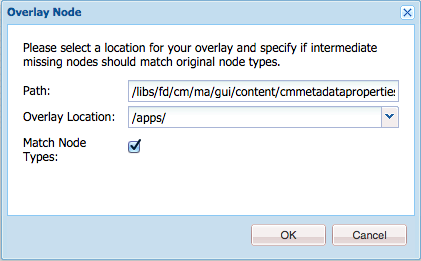
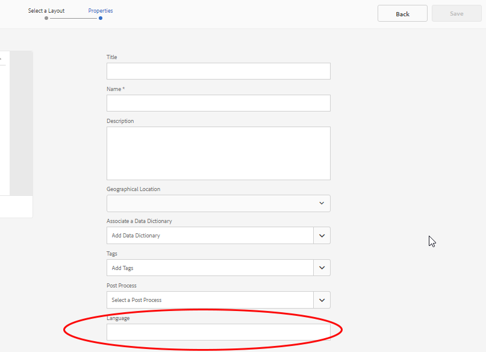

# Aangepaste eigenschappen toevoegen aan Correspondentenbeheerelementen{#add-custom-properties-to-correspondence-management-assets}

## Overzicht {#overview}

U kunt de gebruikersinterface van Correspondentiebeheer aanpassen en gebruikers een op maat gemaakte set eigenschappen en tabbladen geven. Deze aanpassing omvat het toevoegen van aangepaste velden/eigenschappen en tabbladen aan specifieke elementtypen/letters of aan alle elementtypen en letters.

## Aangepaste eigenschappen toevoegen aan Correspondentenbeheerelementen {#adding-custom-properties-to-correspondence-management-assets}

De volgende scenario&#39;s tonen hoe u eigenschappen/lusjes aan de activa en de brieven van het Beheer van de Correspondentie kunt toevoegen:

* Een algemene eigenschap toevoegen aan alle elementtypen
* Een gemeenschappelijk tabblad toevoegen aan alle elementtypen
* Aangepaste eigenschappen toevoegen aan specifieke elementtypen

Door de eigenschappen, paden en waarden in deze scenario&#39;s aan te passen, kunt u aangepaste eigenschappen en tabbladen toevoegen aan een andere set elementen, afhankelijk van uw vereisten.

### Scenario: Een gemeenschappelijk veld (eigenschap) toevoegen aan alle elementtypen {#scenario-adding-a-common-field-property-to-all-the-asset-types}

In dit scenario ziet u hoe u een aangepaste eigenschap kunt toevoegen aan alle elementtypen (tekst, lijst, voorwaarde en layoutfragmenten) en aan de letters. Met dit scenario kunt u een eigenschap, Locatie van ontvangers, toevoegen aan alle elementen en letters. Met de eigenschap Locatie van ontvangers kunt u bepalen voor welk geografisch gebied van levering een element of brief relevant is.

>[!NOTE]
>
>Als u al een aangepaste eigenschap hebt toegevoegd, wordt de eigenschap weergegeven op de pagina voor het maken van elementen. Zie Aangepaste eigenschappen bij het maken van elementen en de pagina&#39;s Eigenschappen tonen/verbergen om een dergelijke eigenschap te verbergen.


Voer de volgende stappen uit om een aangepaste eigenschap toe te voegen aan alle elementtypen en letters:

1. Ga naar Beheerder `https://'[server]:[port]'/[ContextPath]/crx/de` en meld u aan.
1. Maak in de map apps een map met de naam css met een pad/structuur die lijkt op de css-map (in de map ccrui) en voer de volgende stappen uit:

   1. Klik met de rechtermuisknop op de itemmap in het volgende pad en selecteer **Overlayknooppunt**:

      `/libs/fd/cm/ma/gui/content/cmmetadataproperties/commonproperties/col1/items`

      

   1. Zorg ervoor dat het dialoogvenster Overlay-knooppunt de volgende waarden heeft:

      **Pad:** /libs/fd/cm/ma/gui/content/cmmetadataproperties/commonproperties/col1/items

      **Locatie:** /apps/

      **Identieke knooppunttypen:** Geselecteerd

      

   1. Click **OK**. De mapstructuur wordt gemaakt in de map apps.

   1. Klik op Alles **opslaan**.

1. Voeg onder de map met nieuw gemaakte items een knooppunt toe voor de aangepaste eigenschap in alle elementen (voorbeeld: GeoLocation) gebruikend de volgende stappen:

   1. Klik met de rechtermuisknop op de map met items en selecteer **Maken** > **Knooppunt** maken.

      

   1. Zorg ervoor dat het dialoogvenster Knooppunt maken de volgende waarden heeft en klik op **OK**:

      **Naam:** GeoLocation (of de naam die u aan deze eigenschap wilt geven)

      **Type:** nt:ongestructureerd

      

   1. Klik op het nieuwe knooppunt dat u hebt gemaakt (hier GeoLocation). CRX geeft de eigenschappen van het knooppunt weer.
   1. Voeg de volgende eigenschappen toe aan het knooppunt (hier GeoLocation):

      | **Naam** | **Type** | **Waarde** |
      |---|---|---|
      | fieldLabel | Tekenreeks | De naam die u het veld of de eigenschap wilt geven. (Hier: Locatie van ontvangers) |
      | name | Tekenreeks | `./extendedproperties/GeoLocation` (Houd dezelfde waarde als de veldnaam die u onder het knooppunt Items hebt gemaakt) |
      | renderReadOnly | Boolean | true |
      | sling:resourceType | Tekenreeks | `granite/ui/components/coral/foundation/form/textfield` |

   1. Klik op Alles **opslaan**.

1. Als u de aanpassing wilt bekijken, plaatst u de muisaanwijzer boven een element (tekst, lijst, voorwaarde of layoutfragment) of letter, klikt u op Eigenschappen **** weergeven en klikt u op **Bewerken**. Het nieuwe veld (Locatie van ontvangers) wordt weergegeven op het tabblad Standaard in de eigenschappen element/letter.

   >[!NOTE]
   >
   >Mogelijk moet u de browsercache wissen voordat de aanpassing in de gebruikersinterface wordt weergegeven.

   

   >[!NOTE]
   >

   >De gemeenschappelijke eigenschappen voor alle activa die u toevoegt verschijnen in het basislusje van de activa eigenschappen. Standaard worden de gemeenschappelijke eigenschappen die voor alle elementen zijn toegevoegd, weergegeven op de pagina met eigenschappen en op de pagina met het maken van elementen. Als u de algemene eigenschappen wilt verbergen, moet u dat <!--link to show / hide properties]-->doen.

### Scenario: Aangepaste vervolgkeuzelijsten en waarden toevoegen aan een aangepaste eigenschap/veld {#scenario-add-custom-drop-down-and-values-to-a-custom-property-field}

In dit scenario ziet u hoe u een aangepaste eigenschap aan alle elementtypen kunt toevoegen en er vervolgkeuzelijsten aan kunt toevoegen.

1. Klik met de rechtermuisknop op de itemmap in het volgende pad en selecteer **Overlayknooppunt**:

   `/libs/fd/cm/ma/gui/content/cmmetadataproperties/commonproperties/col1/items`

1. Onder het nieuwe overlayknooppunt (/apps/fd/cm/ma/gui/content/cmmetadataproperties/commonproperties/col1/items) maakt u een knooppunt voor elk van de eigenschappen (velden) waarvoor u een vervolgkeuzelijst (hier `geographicallocation`) van het type nt:unStructured moet maken.
1. Voeg de volgende eigenschappen aan de knoop (hier geografische toewijzing) toe en klik **sparen allen**:

   <table>
   <tbody>
   <tr>
      <td><strong>Naam</strong></td>
      <td><strong>Type</strong></td>
      <td><strong>Waarde</strong></td>
   </tr>
   <tr>
      <td>fieldLabel</td>
      <td>Tekenreeks</td>
      <td>De naam die u het veld of de eigenschap wilt geven. (Hier: geografische toewijzing)</td>
   </tr>
   <tr>
      <td>name</td>
      <td>Tekenreeks</td>
      <td>./extendedProperties/geographicaletoewijzing (houd de waarde zelfde als de gebiedsnaam u onder de puntenknoop creeerde)</td>
   </tr>
   <tr>
      <td>renderReadOnly</td>
      <td>Boolean</td>
      <td>true</td>
   </tr>
   <tr>
      <td>sling:resourceType</td>
      <td>Tekenreeks</td>
      <td>graniet/ui/componenten/koraal/stichting/vorm/selecteren<br /> </td>
   </tr>
   </tbody>
   </table>

1. Onder bezitsknoop (hier geografische toewijzing), voeg een nieuw knooppunt met naam toe `items`. Onder de puntenknoop, voeg een knoop elk voor de waarden in drop-down toe. U kunt het beste het eerste knooppunt als leeg toevoegen, zodat dit de standaardwaarde van de vervolgkeuzelijst is en de gebruiker de optie krijgt om geen waarde voor het veld op te geven. Herhaal de volgende stappen om meerdere opties/vervolgkeuzelijsten toe te voegen:

   1. Klik met de rechtermuisknop op het eigenschapknooppunt (hier geografische toewijzing) en selecteer **Maken** > **Knooppunt** maken.
   1. Typ de naam van het veld als `item1,` behouden type als niet:ongestructureerd en klik op **OK**.
   1. Voeg de volgende eigenschappen aan de pas gecreëerde knoop (hier punt1) toe en klik dan **sparen allen**:

      <table>
         <tbody>
         <tr>
          <td><strong>Naam</strong></td>
          <td><strong>Type</strong></td>
          <td><strong>Waarde</strong></td>
         </tr>
         <tr>
          <td>text</td>
          <td>Tekenreeks</td>
          <td>Dit is de waarde van de drop-down optie die aan de gebruiker zichtbaar is. Laat deze leeg voor de lege waarde (standaardwaarde) of voer de waarde in, bijvoorbeeld <strong>International</strong> of <strong>Within US</strong>.<br /> </td>
         </tr>
         <tr>
          <td>value</td>
          <td>Tekenreeks</td>
          <td>Waarde die is opgeslagen in CRXDE voor de tekst. Voer een uniek trefwoord in. <br /> </td>
         </tr>
         </tbody>
   </table>

   

De aangepaste vervolgkeuzelijst wordt als volgt weergegeven in de eigenschappen van elementen:


### Scenario: Algemeen tabblad voor alle elementtypen {#scenario-common-tab-for-all-asset-types}

In dit scenario ziet u hoe u een aangepast tabblad, Ontvangers, kunt toevoegen aan alle elementtypen (tekst, lijst, voorwaarde en layoutfragmenten) en aan de letters. Op het tabblad Ontvangers kunt u alle aangepaste eigenschappen die relevant zijn voor de ontvangers plaatsen.


Met de volgende procedure kunt u een tabblad met een veld toevoegen aan al uw elementen:

1. Ga naar Beheerder `https://'[server]:[port]'/[ContextPath]/crx/de` en meld u aan.
1. Maak in de map apps een map met de naam cmmetadataproperties met een pad/structuur die vergelijkbaar is met de map cmmetadataproperties (in de inhoudsmap) en voer de volgende stappen uit:

   1. Klik met de rechtermuisknop op de map CommetadataProperties in het volgende pad en selecteer **Overlay Node**:

      `/libs/fd/cm/ma/gui/content/cmmetadataproperties`

      

   1. Zorg ervoor dat het dialoogvenster Overlay-knooppunt de volgende waarden heeft:

      **Pad:** /libs/fd/cm/ma/gui/content/cmmetadataproperties

      **Locatie:** /apps/

      **Identieke knooppunttypen:** Geselecteerd

   1. Click **OK**. De mapstructuur wordt gemaakt in de map apps.

      

      Klik op Alles **opslaan**.

1. Voeg onder de map cmmetadataproperties een knooppunt toe voor het maken van een aangepast tabblad voor alle elementen (voorbeeld: commontab) met behulp van de volgende stappen:

   1. Klik met de rechtermuisknop op de map CommetadataProperties en selecteer **Maken** > **Node** maken.

      

   1. Zorg ervoor dat het dialoogvenster Knooppunt maken de volgende waarden heeft en klik op **OK**:

      **Naam:** commontab (of de naam die u aan deze eigenschap wilt geven)

      **Type:** nt:ongestructureerd

   1. Klik op het nieuwe knooppunt dat u hebt gemaakt (hier komt het gemeenschappelijke tabblad). CRX geeft de eigenschappen van het knooppunt weer.
   1. Voeg de volgende eigenschappen toe aan het knooppunt (hier komt het algemene tabblad):

      <table>
         <tbody>
         <tr>
          <td><strong>Naam</strong></td>
          <td><strong>Type</strong></td>
          <td><strong>Waarde</strong></td>
         </tr>
         <tr>
          <td>jcr:titel</td>
          <td>Tekenreeks</td>
          <td>De naam die u aan de kolom wilt geven. (Hier: Ontvangers)</td>
         </tr>
         <tr>
          <td>sling:resourceType</td>
          <td>Tekenreeks</td>
          <td>graniet/ui/componenten/koraal/stichting/container<br /> </td>
   </tr>
         </tbody>
       </table>

   1. Klik op Alles **opslaan**.

1. Voor de tabnode die in de laatste stap (hier gemeenschappelijke tab) is gemaakt, maakt u een knooppunt met de naam Item met de volgende stap:

   1. Klik met de rechtermuisknop op het relevante knooppunt (hier op het tabblad Algemeen) en selecteer **Maken** > **Knooppunt** maken.
   1. Zorg ervoor dat het dialoogvenster Knooppunt maken de volgende waarden heeft en klik op **OK**:

      **Naam:** items

      **Type:** nt:ongestructureerd

   1. Klik op Alles **opslaan:**

1. In de puntenknoop u in de vorige stap (onder gemeenschappelijk lusje) creeerde, voeg een knoop voor het creëren van een kolom (hier Kolom1) in het douanetabblad (gemeenschappelijk lusje) toe gebruikend de volgende stappen (om meer kolommen toe te voegen, herhaal deze stap):

   1. Klik met de rechtermuisknop op het knooppunt Items en selecteer **Maken** > **Knooppunt** maken.
   1. Zorg ervoor dat het dialoogvenster Knooppunt maken de volgende waarden heeft en klik op **OK**:

      **Naam:** Column1 (Of de naam u aan de knoop wilt geven - deze naam verschijnt niet in het Gebruikersinterface.)

      **Type:** nt:ongestructureerd

   1. Voeg de volgende eigenschap toe aan het knooppunt (hier kolom1) en klik op Alles **** opslaan:

      <table>
         <tbody>
         <tr>
           <td><strong>Naam</strong></td>
           <td><strong>Type</strong></td>
           <td><strong>Waarde</strong></td>
         </tr>
         <tr>
           <td>sling:resourceType</td>
           <td>Tekenreeks</td>
           <td>graniet/ui/componenten/koraal/stichting/container<br /> </td>
         </tr>
         </tbody>
       </table>

1. In de knoop u in de vorige stap (hier Column1) creeerde, voeg een knoop genoemd punten toe gebruikend de volgende stappen:

   1. Klik met de rechtermuisknop op het knooppunt (hier Column1) en selecteer **Maken** > **Knooppunt** maken.
   1. Zorg ervoor dat het dialoogvenster Knooppunt maken de volgende waarden heeft en klik op **OK**:

      **Naam:** items

      **Type:** nt:ongestructureerd

   1. Klik op Alles **opslaan**.

1. Als u een veld wilt maken op het aangepaste tabblad (hier Ontvangers), voegt u een knooppunt toe (hier GeogragraphicLocation). Deze eigenschap komt overeen met de kolom die u hebt gemaakt. Gebruik de volgende stappen om het veld te maken (als u meer velden/knooppunten wilt maken, herhaalt u deze stappen.):

   1. Klik met de rechtermuisknop op het knooppunt Items en selecteer **Maken** > **Knooppunt** maken.
   1. Zorg ervoor dat het dialoogvenster Knooppunt maken de volgende waarden heeft en klik op **OK**:

      **Naam:** GeogragraphicLocation (of een andere naam voor de veldeigenschap)

      **Type:** nt:ongestructureerd

   1. Voeg de volgende eigenschappen toe aan het veldknooppunt (hier GeogragraphicLocation) en klik op Alles **** opslaan.

      | **Naam** | **Type** | **Waarde** |
      |---|---|---|
      | fieldLabel | Tekenreeks | Locatie van ontvangers (of de naam die u het veld wilt geven). |
      | name | Tekenreeks | ./extendedProperties/GeogragraphicLocation |
      | renderReadOnly | Boolean | true |
      | sling:resourceType | Tekenreeks | `/libs/granite/ui/components/coral/foundation/form/textfield` |

1. Als u dit tabblad voor letters wilt toevoegen, maakt u een overlaymap met een pad/structuur die lijkt op de volgende itemmap in het volgende pad:

   `/libs/fd/cm/ma/gui/content/cmmetadataproperties/properties/letter/items/tabs/items`

   Als u een bedekking voor een letter of ander element wilt maken, gebruikt u het volgende pad door [het type] element te vervangen door tekst, voorwaarde, lijst, gegevenswoordenboek of fragment:

   `/libs/fd/cm/ma/gui/content/cmmetadataproperties/properties/[assettype]/items/tabs/items`

   1. Klik met de rechtermuisknop op de itemmap in het volgende pad en selecteer **Overlayknooppunt**:

      `/libs/fd/cm/ma/gui/content/cmmetadataproperties/properties/letter/items/tabs/items`

   1. Zorg ervoor dat het dialoogvenster Overlay-knooppunt de volgende waarden heeft:

      **Pad:** `/libs/fd/cm/ma/gui/content/cmmetadataproperties/properties/letter/items/tabs/items`

      **Locatie:** /apps/

      **Identieke knooppunttypen:** Geselecteerd

   1. Click **OK**. De map wordt gemaakt. Klik op Alles **opslaan**.

1. Voeg in de map met nieuw gemaakte items een knooppunt toe voor het aangepaste tabblad in het element (hier wordt mijn tabblad - deze naam wordt niet weergegeven in de gebruikersinterface) met de volgende stappen:

   1. Klik met de rechtermuisknop op de map met items en selecteer **Maken** > **Knooppunt** maken.
   1. Zorg ervoor dat het dialoogvenster Knooppunt maken de volgende waarden heeft en klik op **OK**:

      **Naam:** mytab (of de naam die u aan deze eigenschap wilt geven)

      **Type:** nt:ongestructureerd

   1. Klik op het nieuwe knooppunt dat u hebt gemaakt (hier mijntabblad). CRX geeft de eigenschappen van het knooppunt weer.
   1. Voeg de volgende twee eigenschappen toe aan het knooppunt (hier customtab):

      <table>
         <tbody>
         <tr>
           <td><strong>Naam</strong></td>
           <td><strong>Type</strong></td>
           <td><strong>Waarde</strong></td>
         </tr>
         <tr>
           <td>path<br /> </td>
           <td>Tekenreeks</td>
           <td>fd/cm/ma/gui/content/cmmetadataproperties/commontab<br /> </td>
         </tr>
         <tr>
           <td>sling:resourceType</td>
           <td>Tekenreeks</td>
           <td>graniet/ui/componenten/koraal/stichting/inclusief<br /> </td>
         </tr>
         </tbody>
       </table>

   1. Klik op Alles **opslaan**.

1. Als u de aanpassing wilt weergeven, plaatst u de muisaanwijzer boven het desbetreffende element (hier een brief), klikt u op Eigenschappen weergeven en klikt u op **Bewerken**. Het nieuwe tabblad (Ontvangers) en het nieuwe veld (Locatie van ontvangers) worden weergegeven in de gebruikersinterface.

   >[!NOTE]
   >
   >Mogelijk moet u de browsercache wissen voordat de aanpassing in de gebruikersinterface wordt weergegeven.

   

### Scenario: Aangepaste eigenschappen toevoegen voor specifieke elementtypen {#scenario-adding-custom-properties-for-specific-asset-types}

In dit scenario ziet u hoe u een eigenschap aan een bepaald elementtype kunt toevoegen, zoals een veld, voor alle tekstelementen. Met behulp van dit proces kunt u eigenschappen toevoegen aan een van de volgende:

* Tekst
* Voorwaarde
* Lijst
* Lay-outfragment
* Gegevenswoordenboek
* Letter

Als u bijvoorbeeld alleen de tekstelementen wilt bewerken, wilt u een eigenschap, Locatie van ontvangers, toevoegen om aan te geven voor welk geografisch gebied een element relevant is.  

Voer de volgende stappen uit om een eigenschap aan een elementtype toe te voegen:

1. Ga naar Beheerder `https://'[server]:[port]'/[ContextPath]/crx/de` en meld u aan.
1. Als u een tab wilt maken in een elementtype (zoals Tekst), maakt u de volgende mapstructuur in de map apps:

   `/libs/fd/cm/ma/gui/content/cmmetadataproperties/properties/[AssetType]/items/tabs/items`

   [AssetType] = tekst, voorwaarde, lijst, letter, gegevenswoordenboek of fragment

   Ga als volgt te werk om deze mapstructuur te maken:

   1. Klik met de rechtermuisknop op de itemmap in het volgende pad en selecteer **Overlayknooppunt**:

      `/libs/fd/cm/ma/gui/content/cmmetadataproperties/properties/[AssetType]/items/tabs/items`

      Als u bijvoorbeeld een eigenschap voor tekstelementen wilt maken, selecteert u de volgende map:

      `/libs/fd/cm/ma/gui/content/cmmetadataproperties/properties/text/items/tabs/items`

      

   1. Zorg ervoor dat het dialoogvenster Overlay-knooppunt de volgende waarden heeft:

      **Pad:** /libs/fd/cm/ma/gui/content/cmmetadataproperties/properties/[AssetType]/items/tabs/items

      **Locatie:** /apps/

      **Identieke knooppunttypen:** Geselecteerd

   1. Click **OK**. De mapstructuur wordt gemaakt in de map apps.

      Klik op Alles **opslaan**.

1. Voeg in de map met nieuw gemaakte items een knooppunt toe voor het aangepaste tabblad in het element (voorbeeld: aangepaste tab) met behulp van de volgende stappen:

   1. Klik met de rechtermuisknop op de map met items en selecteer **Maken** > **Knooppunt** maken.
   1. Zorg ervoor dat het dialoogvenster Knooppunt maken de volgende waarden heeft en klik op **OK**:

      **Naam:** customtab (of de naam die u aan deze eigenschap wilt geven)

      **Type:** nt:ongestructureerd

   1. Klik op het nieuwe knooppunt dat u hebt gemaakt (hier customtab). CRX geeft de eigenschappen van het knooppunt weer.
   1. Voeg de volgende twee eigenschappen toe aan het knooppunt (hier customtab):

      | **Naam** | **Type** | **Waarde** |
      |---|---|---|
      | sling:resourceType | Tekenreeks | graniet/ui/componenten/koraal/stichting/container |
      | jcr:titel | Tekenreeks | De naam van het veld in de gebruikersinterface (hier het tabblad Mijn) |

   1. Klik op Alles **opslaan**.

1. Voeg in het knooppunt dat u in de vorige stap hebt gemaakt (hier customtab) een knooppunt met de naam items toe door de volgende stappen uit te voeren:

   1. Klik met de rechtermuisknop op het knooppunt (hier op het aangepaste tabblad) en selecteer **Maken** > **Knooppunt** maken.
   1. Zorg ervoor dat het dialoogvenster Knooppunt maken de volgende waarden heeft en klik op **OK**:

      **Naam:** items

      **Type:** nt:ongestructureerd

   1. Klik op Alles **opslaan**.

1. In de puntenknoop u in de vorige stap (onder customtab) creeerde, voeg een knoop voor het creëren van een kolom (hier Kolom1) op het douanetabblad toe gebruikend de volgende stappen (om meer kolommen toe te voegen, herhaal deze stap):

   1. Klik met de rechtermuisknop op het knooppunt Items en selecteer **Maken** > **Knooppunt** maken.
   1. Zorg ervoor dat het dialoogvenster Knooppunt maken de volgende waarden heeft en klik op **OK**:

      **Naam:** Column1 (of de naam u aan de knoop wilt geven)

      **Type:** nt:ongestructureerd

   1. Voeg de volgende eigenschap toe aan het knooppunt (hier kolom1) en klik op Alles **** opslaan.

      <table>
         <tbody>
         <tr>
           <td><strong>Naam</strong></td>
           <td><strong>Type</strong></td>
           <td><strong>Waarde</strong></td>
         </tr>
         <tr>
           <td>sling:resourceType</td>
           <td>Tekenreeks</td>
           <td>graniet/ui/componenten/koraal/stichting/container<br /> </td>
         </tr>
         </tbody>
       </table>

1. Voor elke kolom die u maakt (zoals opgegeven in de vorige stap - hier Column1), maakt u een knooppunt met de naam Item door de volgende stappen uit te voeren:

   1. Klik met de rechtermuisknop op het relevante kolomknooppunt (hier Kolom1) en selecteer **Maken** > **Knooppunt** maken.
   1. Zorg ervoor dat het dialoogvenster Knooppunt maken de volgende waarden heeft en klik op **OK**:

      **Naam:** items

      **Type:** nt:ongestructureerd

   1. Klik op Alles **opslaan:**

1. Maak voor elk van de gemaakte kolommen een knooppunt onder het knooppunt Items voor het maken van een veld op het nieuwe tabblad in de gebruikersinterface. Herhaal deze stap om meer velden in de kolom te maken:

   1. Klik met de rechtermuisknop op het relevante knooppunt (hier items onder Kolom1) en selecteer **Maken** > **Knooppunt** maken.
   1. Zorg ervoor dat het dialoogvenster Knooppunt maken de volgende waarden heeft en klik op **OK**:

      **Naam:** Een naam van uw keuze (hier GeoLocation)

      **Type:** nt:ongestructureerd

   1. Voeg de volgende eigenschappen aan de knoop toe en klik dan **sparen allen**.

      | **Naam** | **Type** | **Waarde** |
      |---|---|---|
      | fieldLabel | Tekenreeks | Locatie van ontvangers (of de naam die u het veld wilt geven). |
      | name | Tekenreeks | `./extendedproperties/GeoLocation` |
      | renderReadOnly | Boolean | true |
      | sling:resourceType | Tekenreeks | graniet/ui/componenten/koraal/stichting/vorm/tekstveld |

1. Als u de aanpassing wilt weergeven, plaatst u de muisaanwijzer boven het desbetreffende element (hier een tekst), klikt u op Eigenschappen weergeven en klikt u op **Bewerken**. Het nieuwe tabblad en veld (Locatie van ontvangers) worden weergegeven in de gebruikersinterface.

   >[!NOTE]
   >
   >Mogelijk moet u de browsercache wissen voordat de aanpassing in de gebruikersinterface wordt weergegeven.

   

### Aangepaste eigenschappen weergeven op de pagina voor het maken van elementen {#display-custom-properties-on-the-asset-creation-page}

Standaard zijn de aangepaste eigenschappen die aan nieuwe tabbladen zijn toegevoegd, alleen zichtbaar op de eigenschappenpagina en niet op de pagina voor het maken van elementen, omdat de pagina voor het maken van elementen geen tablay-out heeft. Als u de aangepaste eigenschappen samen met andere eigenschappen op de pagina voor het maken van elementen wilt weergeven, moet u het volgende doen:

1. Klik met de rechtermuisknop op de itemmap in het volgende pad en selecteer **Overlayknooppunt**:

   `/libs/fd/cm/ma/gui/content/createasset/createletter/jcr:content/body/items/form/items/letterWizard/items/properties/items/properties/items/letterproperties/items`

1. Zorg ervoor dat het dialoogvenster Overlay-knooppunt de volgende waarden voor letter heeft. Voor andere elementtypen wordt het pad gegeven in de volgende tabel:

   **Pad:** /libs/fd/cm/maa/gui/content/createAsset/createletter/jcr:content/body/items/form/items/letterWizard/items/properties/items/properties/items/items/lettereigenschappen/items/lettereigenschappen/items

   **Locatie:** /apps/

   **Identieke knooppunttypen:** Geselecteerd

   Afhankelijk van het type element moet het volgende het pad zijn:

   | **Type element/document** | **Pad dat moet worden toegevoegd** |
   |---|---|
   | Tekst | /libs/fd/cm/maa/gui/content/createAsset/createtext/jcr:content/body/items/form/items/textwizard/items/editproperties/items/items/tabs/items/tab1/items |
   | Lijst | /libs/fd/cm/ma/gui/content/createAsset/createlist/jcr:content/body/items/form/items/listwizard/items/editproperties/items/properties/items/tabs/items/tab1/items |
   | Voorwaarde | /libs/fd/cm/ma/gui/content/createAsset/createcondition/jcr:content/body/items/form/items/conditionWizard/items/editproperties/items/properties/tabs/items/tab1/items |
   | Fragment | /libs/fd/cm/maa/gui/content/createAsset/createfragment/jcr:content/body/items/form/items/fragmentwizard/items/properties/Items/tabs2/items/tab1/items |
   | Letter | /libs/fd/cm/maa/gui/content/createAsset/createletter/jcr:content/body/items/form/items/letterWizard/items/properties/items/properties/items/items/lettereigenschappen/items/lettereigenschappen/items |

1. Click **OK**. De mapstructuur wordt gemaakt in de map apps.

1. Maak onder het knooppunt voor overlayitems dat u hebt gemaakt een knooppunt met de naam col4 (of een andere naam) en klik op Alles **** opslaan.

   Hier volgt bijvoorbeeld het bedekkingsknooppunt dat voor letters is gemaakt.

   `/apps/fd/cm/ma/gui/content/createasset/createletter/jcr:content/body/items/form/items/letterWizard/items/properties/items/properties/items/letterproperties/items`

1. Voeg de volgende eigenschappen toe aan het nieuwe knooppunt (hier col4) en klik op **Alles** opslaan:

<table>
 <tbody>
  <tr>
   <td><strong>Naam</strong></td>
   <td><strong>Type</strong></td>
   <td><strong>Waarde</strong></td>
  </tr>
  <tr>
   <td>path</td>
   <td>Tekenreeks</td>
   <td><p>Dit pad is de aanwijzer naar de kolom die is gemaakt in:</p>
    <ul>
     <li>Voor het algemene tabblad voor alle elementtypen: /apps/fd/cm/ma/gui/content/cmmetadataproperties/commontab/items/col1</li>
     <li>Voor verschillende eigenschappen voor verschillende elementtypen: /apps/fd/cm/ma/gui/content/cmmetadataproperties/properties/items/tabs/items/customtab/items/col1</li>
    </ul> </td>
  </tr>
  <tr>
   <td>sling:resourceType</td>
   <td>Tekenreeks</td>
   <td> graniet/ui/componenten/koraal/stichting/inclusief<br /> </td>
  </tr>
 </tbody>
</table>



Aangepaste eigenschap, taal, die wordt weergegeven in de gebruikersinterface voor het maken van een letter

## De lijstweergave aanpassen om aangepaste eigenschappen weer te geven {#customize-the-list-view-to-show-custom-properties}

Nadat u een douanebezit aan de activa van het Beheer van de Correspondentie hebt toegevoegd, moet u verdere veranderingen in CRX/DE aanbrengen om ervoor te zorgen dat het douanebezit in Correspondence Management UI wordt getoond.

Voer de volgende stappen uit om de aangepaste eigenschap weer te geven in de gebruikersinterface van de middelenlijst van het Correspondentiebeheer:

1. Ga naar Beheerder `https://'[server]:[port]'/[ContextPath]/crx/de` en meld u aan.
1. Maak de volgende mapstructuur in de map apps:

   `/libs/fd/cm/ma/gui/content/cmassets/jcr:content/views/lists/columns`

   Ga als volgt te werk om deze mapstructuur te maken:

   1. Klik met de rechtermuisknop op de map columns in het volgende pad en selecteer **Overlay Node**:

      `/libs/fd/cm/ma/gui/content/cmassets/jcr:content/views/lists/columns`

   1. Zorg ervoor dat het dialoogvenster Overlay-knooppunt de volgende waarden heeft:

      **Pad:** /libs/fd/cm/ma/gui/content/cmassets/jcr:content/views/lists/columns

      **Locatie:** /apps/

      **Identieke knooppunttypen:** Geselecteerd

   1. Click **OK**. De mapstructuur wordt gemaakt in de map apps.

      Klik op Alles **opslaan**.

1. Maak voor elk van de gemaakte eigenschappen een knooppunt onder het knooppunt columns voor het maken van een kolom in de gebruikersinterface. Herhaal deze stap om meer kolommen in UI tot stand te brengen:

   1. Klik met de rechtermuisknop op het relevante knooppunt (kolommen) en selecteer **Maken** > **Knooppunt** maken.
   1. Zorg ervoor dat het dialoogvenster Knooppunt maken de volgende waarden heeft en klik op **OK**:

      **Naam:** Een naam van uw keuze (hier GeogragraphicLocation)

      **Type:** nt:ongestructureerd

   1. Voeg de volgende eigenschappen aan de knoop toe en klik dan **sparen allen**.

      <table>
         <tbody>
         <tr>
           <td><strong>Naam</strong></td>
           <td><strong>Type</strong></td>
           <td><strong>Waarde</strong></td>
         </tr>
         <tr>
           <td>jcr:primaryType</td>
           <td>Naam</td>
           <td><p>nt:ongestructureerd</p> </td>
         </tr>
         <tr>
           <td>jcr:titel</td>
           <td>Tekenreeks</td>
           <td><p>GeographicLocation</p> <p>Deze waarde wordt als kolomkop in de gebruikersinterface weergegeven. </p> </td>
         </tr>
         <tr>
           <td>sorteerbaar</td>
           <td>Boolean</td>
           <td><p>true</p> <p>De waarde true geeft aan dat de gebruiker de waarden in deze kolom kan sorteren. </p> </td>
         </tr>
         </tbody>
       </table>

1. Maak de volgende mapstructuur in de map apps:

   `/libs/fd/cm/ma/gui/components/admin/childpagerenderer/childlistpage`

   Ga als volgt te werk om deze mapstructuur te maken:

   1. Klik met de rechtermuisknop op de map columns in het volgende pad en selecteer **Overlay Node**:

      `/libs/fd/cm/ma/gui/components/admin/childpagerenderer/childlistpage`

   1. Zorg ervoor dat het dialoogvenster Overlay-knooppunt de volgende waarden heeft:

      **Pad:** /libs/fd/cm/ma/gui/components/admin/child/pagerenderer/child-listpage

      **Locatie:** /apps/

      **Identieke knooppunttypen:** Geselecteerd

   1. Click **OK**. De mapstructuur wordt gemaakt in de map apps.

      Klik op Alles **opslaan**.

1. Kopieer het bestand childListpage.jsp van de volgende locatie:

   /libs/fd/cm/ma/gui/components/admin/childpagerenderer/childlistpage/childlistpage.jsp

   Plak het bestand op de volgende locatie:

   /apps//fd/cm/ma/gui/components/admin/child pagerenderer/child listpage/.

1. Open het bestand childListpage.jsp (/apps/fd/cm/ma/gui/components/admin/childpagerenderer/childlistpage/childlistpage.jsp) en breng de volgende wijzigingen aan:

   1. Voeg het volgende toe aan regel 19 van het bestand (na de copyrightinstructie).

      ```jsp
      <%@page import="java.util.Map"%>
      ```

   1. Voeg de volgende code van een functie die waarde voor elke douanebezit aan het eind van het dossier krijgt:

      ```jsp
      <%!
          private String getCustomPropertyValue(Map<String, Object> extendedProperties, String propertyName) {
      
              String propertyValue = "";
              if (extendedProperties.containsKey(propertyName)) {
                  propertyValue = (String) extendedProperties.get(propertyName);
              }
      
              return propertyValue;
          }
      %>
      ```

   1. Voeg het volgende toe vóór het begin van de &lt;tr>-tag (&lt;tr &lt;%= attrs.build() %>>):

      ```jsp
      <%
          String GeoLocation = "";
          if (asset != null) {
                  Map<String, Object> extendedProperties = asset.getExtendedProperties();
                  if (extendedProperties != null) {
                      GeoLocation = getCustomPropertyValue(extendedProperties,"GeoLocation");
                  }
          }
      %>
      ```

      In de code is GeoLocation de waarde die u instelt in de eigenschap name tijdens het maken van het aangepaste knooppunt/veld. Tijdens het maken van een aangepast knooppunt/veld hebt u de naam van de eigenschap opgegeven met ./extendedProperties/ prefix: ./extendedProperties/GeoLocation. In de code is het voorvoegsel niet vereist.

   1. Als u de nieuwe eigenschap wilt weergeven in de gebruikersinterface, voegt u als volgt een TD-tag toe vóór de eindtag tr (&lt;/tr>):

      ```jsp
      <td is="coral-td" value="<%= xssAPI.encodeForHTMLAttr(geographicalLocation) %>"><%= xssAPI.encodeForHTML(geographicalLocation) %></td>
      ```

      Herhaal de stappen 6.3 en 6.4 om meer kolommen toe te voegen.

   1. Klik op Alles **opslaan**.

1. Als u de aanpassing wilt bekijken, opent u de lijstweergave van documentfragmenten of letters waaraan u de aangepaste eigenschap hebt toegevoegd.

   De UI-kolom en -eigenschap die in deze procedure worden toegevoegd, worden voor alle elementtypen weergegeven. De waarden in deze eigenschappen kunnen echter alleen worden ingevoerd en weergegeven voor de elementtypen waarvoor u oorspronkelijk de aangepaste eigenschap hebt toegevoegd.

   Met het scenario kunt u bijvoorbeeld: Wanneer u aangepaste eigenschappen toevoegt voor specifieke elementtypen en een aangepaste eigenschap toevoegt aan tekstelementen, kunt u alleen aangepaste eigenschappen invoeren voor tekstelementen. Als u die aangepaste eigenschap echter weergeeft in de gebruikersinterface, wordt de kolom weergegeven voor alle elementtypen.

   

1. (Optioneel) Standaard wordt de nieuwe kolom weergegeven als de laatste kolom in de gebruikersinterface. Als u de kolom op een specifieke positie wilt weergeven, voegt u de volgende eigenschap toe aan het kolomknooppunt:

<table>
 <tbody>
  <tr>
   <td><strong>Naam</strong></td>
   <td><strong>Type</strong></td>
   <td><strong>Waarde</strong></td>
  </tr>
  <tr>
   <td>sling:orderBefore</td>
   <td>Tekenreeks</td>
   <td><p>De naam van het kolomknooppunt op het pad "/libs/fd/cm/ma/gui/content/cmassets/jcr:content/views/list/columns", waarna de aangepaste kolom moet worden weergegeven in de gebruikersinterface.</p> <p>Als u hier de kolom Geografische locatie wilt weergeven vóór (links van) de kolom Versie, voegt u de eigenschap sling:orderBefore toe aan het knooppunt GeoLocation op het pad ""/apps/fd/cm/gui/content/cmassets/jcr:content/views/list/columns/GeoLocation" en stelt u de waarde van de eigenschap in op version.</p> </td>
  </tr>
 </tbody>
</table>

Wanneer u de eigenschap sling:orderBefore toevoegt om de kolomlocatie op te geven, moet u ook de volgorde van de corresponderende &lt;td>-tag die in stap 6.4 van deze procedure is opgegeven, bijwerken. In dit geval moet u er bijvoorbeeld voor zorgen dat de tag &lt;td> van Geografische locatie wordt geplaatst vóór de tag &lt;td> van de kolom Versie:

```xml
<td is="coral-td" value="<%= xssAPI.encodeForHTMLAttr(geographicalLocation) %>"><%= xssAPI.encodeForHTML(geographicalLocation) %></td>
<td is="coral-td" value="<%= xssAPI.encodeForHTMLAttr(version) %>"><%= xssAPI.encodeForHTML(version) %></td>
```

## Zoeken naar aangepaste eigenschappen inschakelen {#enable-search-for-custom-properties}

Standaard bevat de volledige tekstzoekopdracht geen aangepaste eigenschappen die u met behulp van CRX/DE toevoegt aan de gebruikersinterface.

Als u de aangepaste eigenschappen wilt opnemen in de zoekopdracht, moet u indexering van aangepaste eigenschappen toestaan.

Voer de volgende stappen uit om het indexeren van aangepaste eigenschappen toe te staan:

1. Ga naar Beheerder `https://'[server]:[port]'/[ContextPath]/crx/de` en meld u aan.
1. Ga naar `/oak:index/cmLucene`en voeg een knooppunt toe met de naam **aggregaten** eronder.

   1. Klik met de rechtermuisknop op de map cmLucene en selecteer **Maken** > **Knooppunt** maken.
   1. Zorg ervoor dat het dialoogvenster Knooppunt maken de volgende waarden heeft en klik op **OK**:

      **Naam:** aggregaten

      **Type:** nt:ongestructureerd

   1. Klik op Alles **opslaan**.

1. Voeg onder de nieuwe map aggregates een knooppunt cm:resource toe. En onder cm:resource, voeg een knoop genoemd include0 toe.

   1. Klik met de rechtermuisknop op de map aggregates en selecteer **Maken** > **Knooppunt** maken. Zorg ervoor dat het dialoogvenster Knooppunt maken de volgende waarden heeft en klik op **OK**:

      **Naam:** cm:resource

      **Type:** nt:ongestructureerd

   1. Klik met de rechtermuisknop op de map cm:resource en selecteer **Maken** > **knooppunt** maken. Zorg ervoor dat het dialoogvenster Knooppunt maken de volgende waarden heeft en klik op **OK**:

      **Naam:** include0

      **Type:** nt:ongestructureerd

   1. Klik de nieuwe knoop u (hier include0) hebt gecreeerd. CRX geeft de eigenschappen van het knooppunt weer.
   1. Voeg het volgende bezit aan de knoop (hier include0) toe:

      <table>
         <tbody>
         <tr>
           <td><strong>Naam</strong></td>
           <td><strong>Type</strong></td>
           <td><strong>Waarde</strong></td>
         </tr>
         <tr>
           <td>path</td>
           <td>Tekenreeks</td>
           <td>extendedProperties<br /> </td>
         </tr>
         </tbody>
       </table>

   1. Klik op Alles **opslaan**.

1. Ga naar eigenschappen op de volgende locatie en voeg er een knooplocatie onder toe: `/oak:index/cmLucene/indexRules/cm:resource/properties`

   Herhaal deze stap voor alle aangepaste eigenschappen die u aan de zoekopdracht wilt toevoegen.

   1. Klik met de rechtermuisknop op de map met eigenschappen en selecteer **Maken** > **Knooppunt** maken.
   1. Zorg ervoor dat het dialoogvenster Knooppunt maken de volgende waarden heeft en klik op **OK**:

      **Naam:** locatie (of de naam van de aangepaste eigenschap die u aan de zoekopdracht wilt toevoegen)

      **Type:** nt:ongestructureerd

   1. Klik op het nieuwe knooppunt dat u hebt gemaakt (hier de locatie). CRX geeft de eigenschappen van het knooppunt weer.
   1. Voeg de volgende eigenschappen aan de knoop (hier plaats) toe:

      | **Naam** | **Type** | **Waarde** |
      |---|---|---|
      | geanalyseerd | Tekenreeks | true |
      | name | Tekenreeks | extendedProperties/location (of the name of the property you want to add to search) |
      | propertyIndex | Boolean | true |
      | useInSuggest | Boolean | true |

   1. Klik op Alles **opslaan**.

1. Nu kunt u aangepaste eigenschapswaarden gebruiken in de zoekopdracht voor volledige tekst om relevante elementen te zoeken.

>[!NOTE]
>
>Als u nog steeds niet kunt zoeken, kan dit komen door een indexeringsprobleem. Ga voor het opnieuw indexeren naar het volgende knooppunt en wijzig de waarde van de eigenschap &#39;re-index&#39; in true:
>
>/oak:index/cmLucene&quot; en wijzigingswaarde van eigenschap

## Standaardweergave van de zoekpagina wijzigen {#change-default-view-of-the-search-page}

1. Ga naar Beheerder `https://'[server]:[port]'/[ContextPath]/crx/de` en meld u aan.
1. Maak in de map Apps een map met de naam list met een pad/structuur die lijkt op de map met lijsten in /libs/granite/ui/content/shell/omnissearch/search results/singleresults/views:

   1. Klik met de rechtermuisknop op de itemmap in het volgende pad en selecteer **Overlayknooppunt**:

      `/libs/granite/ui/content/shell/omnisearch/searchresults/singleresults/views/list`

   1. Zorg ervoor dat het dialoogvenster Overlay-knooppunt de volgende waarden heeft:

      **Pad:** /libs/granite/ui/content/shell/omnissearch/results/singleresults/views/list

      **Locatie:** /apps/

      **Identieke knooppunttypen:** Geselecteerd

   1. Click **OK**. De mapstructuur wordt gemaakt in de map apps.

   1. Klik op Alles **opslaan**.

1. Voeg in het nieuwe knooppunt de volgende eigenschap toe en klik op **Alles** opslaan:

   <table>
   <tbody>
   <tr>
      <td><strong>Naam</strong></td>
      <td><strong>Type</strong></td>
      <td><strong>Waarde</strong></td>
   </tr>
   <tr>
      <td>sling:orderBefore<br /> </td>
      <td>Tekenreeks</td>
      <td>kaart</td>
   </tr>
   </tbody>
   </table>

1. De aanpassing toont onderzoeksresultaten in de mening van de Lijst voor alle consoles, met inbegrip van Vormen en Documenten, Activa, en Plaatsen.

## Standaardweergave van de pagina Elementen wijzigen {#change-default-view-of-the-assets-page}

>[!NOTE]
>
>Deze stappen veranderen de standaardmening van alle consoles zoals Vormen en Documenten, Activa, en Plaatsen.

1. Ga naar Beheerder `https://'[server]:[port]'/[ContextPath]/crx/de` en meld u aan.
1. Maak in de map Apps een map met de naam Lijst met paden/structuur die lijkt op de map met lijsten in:

   /libs/fd/cm/ma/gui/content/cmassets/jcr:content/views/

   1. Klik met de rechtermuisknop op de itemmap in het volgende pad en selecteer **Overlayknooppunt**:

      `/libs/fd/cm/ma/gui/content/cmassets/jcr:content/views/list`

   1. Zorg ervoor dat het dialoogvenster Overlay-knooppunt de volgende waarden heeft:

      **Pad:** /libs/fd/cm/ma/gui/content/cmassets/jcr:content/views/list

      **Locatie:** /apps/

      **Identieke knooppunttypen:** Geselecteerd

   1. Click **OK**. De mapstructuur wordt gemaakt in de map apps.

   1. Klik op Alles **opslaan**.

1. Voeg in het nieuwe knooppunt de volgende eigenschap toe en klik op **Alles** opslaan:

   <table>
   <tbody>
   <tr>
      <td><strong>Naam</strong></td>
      <td><strong>Type</strong></td>
      <td><strong>Waarde</strong></td>
   </tr>
   <tr>
      <td>sling:orderBefore<br /> </td>
      <td>Tekenreeks</td>
      <td>kaart</td>
   </tr>
   </tbody>
   </table>

1. Wis de browsercookies of gebruik de incogingmodus van uw browser om de elementen weer te geven. De elementenpagina wordt standaard weergegeven in de kaartindeling.

## Aangepaste eigenschappen weergeven/verbergen op de pagina&#39;s voor het maken van elementen en eigenschappen {#show-hide-custom-properties-on-asset-creation-and-properties-pages}

Voer de volgende stappen uit om de aangepaste eigenschappen weer te geven of te verbergen:

1. Onder het knooppunt voor aangepaste eigenschappen, zoals geografische toewijzing, maakt u een nieuw knooppunt met de naam &quot;granite:rendercondition&quot; van het type &quot;nt:unStructured&quot;.
1. Voeg de volgende eigenschap toe aan het knooppunt en klik op **Alles** opslaan:

   <table>
   <tbody>
   <tr>
      <td><strong>Naam</strong></td>
      <td><strong>Type</strong></td>
      <td><strong>Waarde</strong></td>
   </tr>
   <tr>
      <td>sling:resourceType<br /> </td>
      <td>Tekenreeks</td>
      <td>fd/cm/ma/gui/components/admin/assetsproperties/custompropertyconfig<br /> </td>
   </tr>
   </tbody>
   </table>

1. Als u deze eigenschap op de pagina voor het maken van elementen wilt verbergen, voegt u de volgende eigenschap toe en klikt u op Alles **** opslaan:

   <table>
   <tbody>
   <tr>
      <td><strong>Naam</strong></td>
      <td><strong>Type</strong></td>
      <td><strong>Waarde</strong></td>
   </tr>
   <tr>
      <td>hideOnCreate<br /> </td>
      <td>Boolean</td>
      <td>true<br /> </td>
   </tr>
   </tbody>
   </table>

1. Als u de aangepaste eigenschap op de eigenschappenpagina van de elementen wilt verbergen, voegt u de volgende eigenschap toe en klikt u op Alles **** opslaan:

   <table>
   <tbody>
   <tr>
      <td><strong>Naam</strong></td>
      <td><strong>Type</strong></td>
      <td><strong>Waarde</strong></td>
   </tr>
   <tr>
      <td>hideOnEdit<br /> </td>
      <td>Boolean</td>
      <td>true<br /> </td>
   </tr>
   </tbody>
   </table>

   Als u de waarden opnieuw wilt weergeven, moet u de eigenschapswaarden opnieuw instellen op `false` of de eigenschapitems verwijderen.
