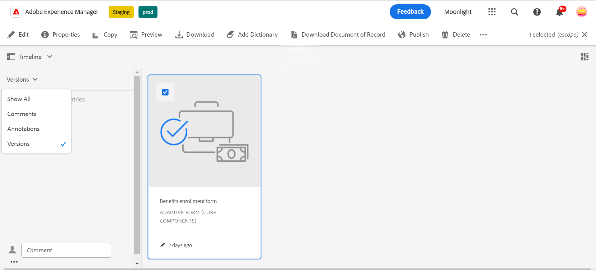
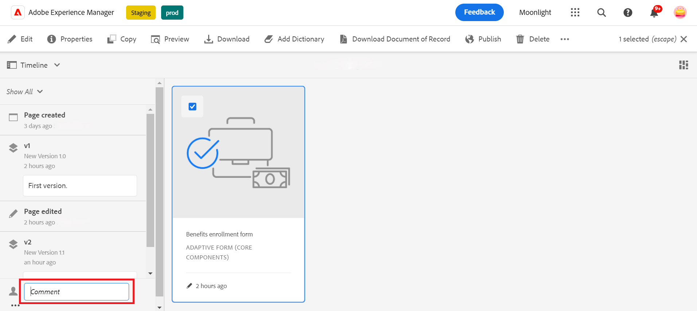

# Versioning, revisie en opmerkingen op een adaptief formulier

<!--
 This feature is under the early adopter program. If you’re interested in joining our early access program for this feature, send an email from your official address to aem-forms-ea@adobe.com to request access 
-->

 Deze eigenschap wordt niet toegelaten door gebrek. U kunt van uw officieel adres aan aem-forms-ea@adobe.com schrijven om toegang tot de eigenschap te verzoeken.

Met Adaptieve Core-componenten van formulieren kunnen auteurs van formulieren versies, opmerkingen en annotaties toevoegen aan formulieren. Deze functies vereenvoudigen de ontwikkeling van formulieren doordat gebruikers meerdere versies kunnen maken en beheren, door opmerkingen kunnen samenwerken en notities kunnen toevoegen aan specifieke formuliersecties, waardoor het samenstellen van formulieren gemakkelijker wordt.

## Vereiste {#prerequisite-versioning}

Om versioning, het becommentariëren, en annotatieeigenschappen in een Aanpassings Vorm te gebruiken, zorg ervoor dat de [ Aangepaste Componenten van de Kern van de Vorm ](https://experienceleague.adobe.com/en/docs/experience-manager-65/content/forms/adaptive-forms-core-components/enable-adaptive-forms-core-components) op uw AEM 6.5 milieu van Forms wordt toegelaten.

## Adaptieve formulierversie {#adaptive-form-versioning}

Met een adaptieve formulierversie kunt u versies toevoegen aan een formulier. Formulierauteurs kunnen eenvoudig meerdere versies van een formulier maken en ten slotte het formulier gebruiken dat geschikt is voor de zakelijke doelstellingen. Daarnaast kunnen gebruikers van formulieren het formulier ook terugzetten naar vorige versies. Het vergemakkelijkt auteurs ook om het even welke twee versies van een vorm te vergelijken door hen te previewing, die hen toestaan om vormen uit perspectief UI beter te analyseren. Laten we in detail gaan voor elke adaptieve functionaliteit voor formulierversies:

### Een formulierversie maken {#create-a-form-version}

Voer de volgende stappen uit om een versie van een formulier te maken:

1. Op uw milieu van AEM Forms, navigeer aan **[!UICONTROL Form]**>> **[!UICONTROL Forms & Documents]** en selecteer uw **Vorm**.
1. Selecteer **[!UICONTROL Versions]** in het keuzemenu Selectie in het linkerdeelvenster.
   
1. Klik **drie punten** die op het lagere paneel op de linkerzijde worden gevestigd, klik **[!UICONTROL Save as Version]**.
1. Geef een label op aan de formulierversie en u kunt ook informatie over het formulier toevoegen door een opmerking toe te voegen.
   

### Een formulierversie bijwerken {#update-a-form-version}

Nadat u het formulier hebt bewerkt en bijgewerkt, voegt u een nieuwe versie toe aan het formulier. Voer de stappen in de laatste sectie uit om een nieuwe versie van het formulier een naam te geven, zoals wordt weergegeven in de afbeelding:

 bij

### Een formulierversie herstellen {#revert-a-form-version}

Als u de vorige versie van een formulier wilt herstellen, selecteert u een formulierversie en klikt u op **[!UICONTROL Revert to this Version]** .

 terug

### Formulierversies vergelijken {#compare-form-versions}

Formulierauteurs kunnen twee verschillende versies van een formulier vergelijken voor voorbeelddoeleinden. Als u versies wilt vergelijken, selecteert u een formulierversie en klikt u op **[!UICONTROL Compare to Current]** . Er worden twee verschillende formulierversies weergegeven in de voorbeeldmodus.

## Opmerkingen toevoegen {#add-comments}

Een revisie is een mechanisme waarmee een of meer revisoren opmerkingen op formulieren kunnen plaatsen. Elke gebruiker van het formulier kan opmerkingen plaatsen op een formulier of een formulier reviseren via opmerkingen. Als u opmerkingen wilt maken over een formulier, selecteert u een **[!UICONTROL Form]** en voegt u een **[!UICONTROL Comment]** toe aan het formulier.

>[!NOTE]
> Wanneer u commentaren in adaptieve componenten van de vormkern zoals hierboven besproken gebruikt, wordt de vormfunctionaliteit, [ toevoegend recensenten aan vormen ](/help/forms/using/create-reviews-forms.md) onbruikbaar gemaakt.

 toe

## Annotaties toevoegen {#adaptive-form-annotations}

In veel gevallen moeten gebruikers van formuliergroepen annotaties toevoegen aan een formulier voor revisiedoeleinden, zoals op een specifiek tabblad of op onderdelen van een formulier. In dergelijke gevallen kunnen auteurs annotaties gebruiken.
Voer de volgende stappen uit om notities aan een formulier toe te voegen:

1. Open een formulier in de modus **[!UICONTROL Edit]** .

1. Klik **voeg pictogram** toe dat op de hogere juiste spoorstaaf zoals die in het beeld wordt gegeven.
   

1. Nu, klik **voeg pictogram** toe dat op de hogere linkerspoorstaaf zoals die in het beeld wordt gegeven om de aantekening toe te voegen.
    toe

1. Nu kunt u opmerkingen toevoegen en schetsen met meerdere kleuren tekenen in formuliercomponenten.

1. Als u alle toegevoegde aantekeningen op een formulier wilt bekijken, selecteert u het formulier en ziet u dat de aantekeningen links in het venster zijn toegevoegd, zoals in de afbeelding wordt getoond.

   

## Zie ook

* [Adaptieve Forms Core-componenten vergelijken](/help/forms/using/compare-forms-core-components.md)
