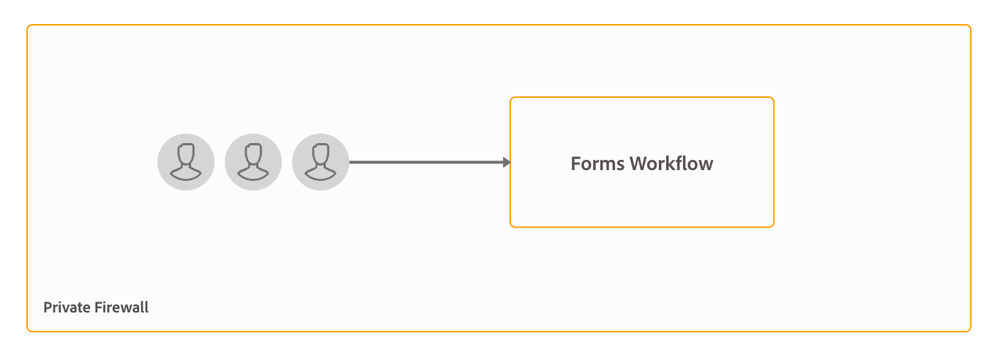

# Architectuur en plaatsingstopologieën voor AEM Forms {#architecture-and-deployment-topologies-for-aem-forms}

## Architectuur {#architecture}

AEM Forms is een toepassing die in AEM als AEM-pakket wordt geïmplementeerd. Het pakket wordt AEM Forms-invoegpakket genoemd. Het add-on AEM Forms-pakket bevat beide services (API-providers), die worden geïmplementeerd in de AEM OSGi-container, en servlets of JSPs (die zowel front-end als REST API-functionaliteit biedt) die worden beheerd door het AEM Sling-framework. Het volgende diagram toont deze opstelling:

De architectuur voor AEM Forms omvat de volgende componenten:

* **Core AEM-services:** De basisdiensten die AEM aan een opgestelde toepassing verleent. Deze services omvatten een inhoudsopslagruimte die compatibel is met JCR, een OSGI-servicecontainer, een workflowengine, een vertrouwde opslag, een sleutelarchief, enzovoort. Deze diensten zijn beschikbaar aan de toepassing van AEM Forms maar niet door de pakketten van AEM Forms. Deze services vormen een integraal onderdeel van de algemene AEM-stapel en verschillende AEM Forms gebruiken deze services.
* **Formulierservices:** PDF-documenten maken, samenstellen, distribueren en archiveren, digitale handtekeningen toevoegen om de toegang tot documenten te beperken en streepjescodes voor formulieren te decoderen. Deze diensten zijn openbaar beschikbaar voor consumptie door douanecode die in AEM wordt opgesteld.
* **Weblaag:** JSPs of servlets, die over gemeenschappelijke en vormdiensten worden gebouwd, die de volgende functionaliteit verstrekken:

   * **Voorkant** ontwerpen: Een gebruikersinterface voor het ontwerpen en beheren van formulieren voor het ontwerpen en beheren van formulieren.
   * **Formulieruitvoering en verzendvoorzijde**: Een eindgebruiker die wordt geconfronteerd met interface voor gebruik door de eindgebruikers van de AEM Forms (bijvoorbeeld, burgers die tot een overheidswebsite toegang hebben). Dit biedt formulieruitvoering (weergaveformulier in een webbrowser) en verzendfuncties.
   * **REST-API&#39;s**: JSPs en servlets voeren een ondergroep vormdiensten voor ver gebruik door HTTP-Gebaseerde cliënten, zoals de vormen mobiele SDK uit.

**AEM Forms over OSGi:** Een AEM Forms op milieu OSGi is standaardAEM Author of AEM Publish met AEM Forms die op het worden opgesteld pakket. U kunt AEM Forms op OSGi in [één enkel servermilieu, Farm, en gegroepeerde montages](/help/sites-deploying/recommended-deploys.md)in werking stellen. Clusterinstellingen zijn alleen beschikbaar voor AEM Author-instanties.

**AEM Forms op JEE:** AEM Forms op JEE zijn AEM Forms-server die op een JEE-stapel wordt uitgevoerd. Het heeft AEM Author met AEM Forms toe:voegen-op pakketten en extra AEM Forms JEE mogelijkheden die op één enkele stapel JEE die op een toepassingsserver loopt worden gecodeerd. U kunt AEM Forms op JEE in enig-server en gegroepeerde montages in werking stellen. AEM Forms op JEE zijn alleen vereist voor het uitvoeren van documentbeveiliging, procesbeheer en voor klanten van LiveCycle die upgraden naar AEM Forms. Hier zijn een paar extra scenario&#39;s om AEM Forms op JEE te gebruiken:

* **Ondersteuning voor HTML-werkruimte (voor klanten die de HTML-werkruimte gebruiken):** AEM Forms in JEE maken een eenmalige aanmelding met Verwerkingsinstanties mogelijk, dienen bepaalde elementen die bij Verwerkingsinstanties worden weergegeven en verwerken de verzending van formulieren die in de HTML-werkruimte worden gegenereerd.
* **Geavanceerde verwerking** van aanvullende formulieren/interactieve communicatiegegevens: AEM Forms over JEE kunnen worden gebruikt voor het extra verwerken van formulier-/interactieve communicatiegegevens (en het opslaan van de resultaten in een geschikte gegevensopslag) in complexe gebruiksgevallen waarin geavanceerde mogelijkheden voor procesbeheer vereist zijn.

AEM Forms over JEE omvat ook de volgende ondersteunende diensten voor de AEM-componenten:

* **Geïntegreerd gebruikersbeheer:** Hiermee kunnen gebruikers van AEM Forms op JEE worden herkend als AEM-formulieren op OSGi-gebruikers en kan SSO worden ingeschakeld voor zowel OSGi- als JEE-gebruikers. Dit is vereist voor scenario&#39;s waarbij eenmalige aanmelding tussen AEM-formulieren op OSGi en AEM Forms op JEE vereist is (bijvoorbeeld HTML-werkruimte).
* **Asset hosting:** AEM Forms op JEE kunnen middelen (bijvoorbeeld HTML5-formulieren) leveren die worden weergegeven op AEM Forms op OSGi.

AEM Forms die een gebruikersinterface ontwerpen, ondersteunen het maken van Document of Record (DOR), PDF forms en HTML5 Forms niet. Dergelijke middelen worden ontworpen met behulp van de stand-alone toepassing van de Ontwerper van Forms en geupload individueel aan de Manager van AEM Forms. Voor AEM Forms op JEE kunnen formulieren ook worden ontworpen als toepassingselementen (in AEM Forms Workbench) en worden geïmplementeerd in AEM Forms op de JEE-server.

AEM Forms op OSGi en AEM Forms op JEE hebben beide werkschemamogelijkheden. U kunt basisworkflows voor diverse taken op de AEM-formulieren op OSGi snel bouwen en implementeren, zonder dat u de volledige capaciteit voor Process Management van AEM Forms op JEE hoeft te installeren. Er is wat verschil in de [eigenschappen van vorm-centric werkschema op AEM Forms over OSGi en vermogen van het Beheer van het Proces van AEM Forms op JEE](capabilities-osgi-jee-workflows.md). De ontwikkeling en het beheer van Form-centric werkschema&#39;s op AEM Forms op OSGi gebruikt de bekende AEM- Werkschema en AEM Inbox mogelijkheden.

## Terminologie {#terminologies}

In de volgende afbeelding worden verschillende AEM Form Server-configuraties en hun onderdelen weergegeven die worden gebruikt bij een standaardimplementatie van AEM Forms:

**Auteur:** Een auteurinstantie is een server van AEM Forms die in de standaardwijze van de de looppas van de Auteur loopt. Het kan AEM Forms op JEE of AEM Forms op milieu OSGi zijn. Het is bedoeld voor interne gebruikers, formulieren en interactieve communicatieontwerpers, en ontwikkelaars. Het maakt de volgende functies mogelijk:

* **Formulieren en interactieve communicatie ontwerpen en beheren:** Ontwerpers en ontwikkelaars kunnen adaptieve formulieren en interactieve communicatie maken en bewerken, andere soorten extern gemaakte formulieren uploaden, bijvoorbeeld formulieren die zijn gemaakt in Adobe Forms Designer, en deze middelen beheren met de Forms Manager-console.
* **Publiceren van formulieren en interactieve communicatie:** Elementen die op een auteurinstantie worden gehost, kunnen naar een publicatie-instantie worden gepubliceerd om runtimebewerkingen uit te voeren. Bij het publiceren van bedrijfsmiddelen worden de replicatiefuncties van AEM gebruikt. Adobe raadt aan dat op alle exemplaren van de auteur een replicatieagent wordt geconfigureerd voor het handmatig duwen van gepubliceerde formulieren naar verwerkingsinstanties en dat een andere replicatieagent wordt geconfigureerd op verwerkingsinstanties waarbij de trigger *Bij ontvangst* is ingeschakeld om de ontvangen formulieren automatisch te repliceren om instanties te publiceren.

**Publiceren:** Een publicatie-instantie is een AEM Forms-server die wordt uitgevoerd in de standaardmodus Publiceren. Publicatie-instanties zijn bedoeld voor eindgebruikers van formuliertoepassingen, bijvoorbeeld gebruikers die een openbare website openen en formulieren verzenden. Het maakt de volgende functies mogelijk:

* Formulieren renderen en verzenden voor eindgebruikers.
* Het vervoer van ruwe ingediende formuliergegevens naar verwerkingsinstanties voor verdere verwerking en opslag in het definitieve registratiesysteem. De standaardimplementatie die in AEM Forms wordt verstrekt bereikt dit gebruikend de omgekeerde replicatiemogelijkheden van AEM. Er is ook een alternatieve implementatie beschikbaar voor het rechtstreeks verplaatsen van formuliergegevens naar verwerkingsservers in plaats van deze eerst lokaal op te slaan (de laatste is een noodzakelijke voorwaarde voor het activeren van reverse-replicatie). Klanten die zich zorgen maken over de opslag van mogelijk vertrouwelijke gegevens over publicatieinstanties kunnen zich aanmelden voor deze [alternatieve implementatie](/help/forms/using/configuring-draft-submission-storage.md), aangezien verwerkingsinstanties doorgaans in een veiligere zone liggen.
* Interactieve communicatie en letters renderen en verzenden: Bij publicatie-instanties wordt een interactieve communicatie en brief weergegeven en de bijbehorende gegevens worden naar verwerkingsinstanties verzonden voor opslag en naverwerking. De gegevens kunnen lokaal op een publicatie-instantie worden opgeslagen en later worden gerepliceerd naar een verwerkingsinstantie (de standaardoptie), of rechtstreeks naar een verwerkingsinstantie worden geduwd zonder op de publicatie-instantie op te slaan. De laatstgenoemde implementatie is nuttig voor veiligheid-bewuste klanten.

**Verwerking:** Een instantie van AEM Forms die worden uitgevoerd in de uitvoeringsmodus Auteur zonder gebruikers die zijn toegewezen aan de groep met formulierbeheer. U kunt AEM Forms op JEE of AEM Forms op OSGi als verwerkingsinstantie opstellen. De gebruikers worden niet toegewezen om ervoor te zorgen dat de activiteiten van de creatie en het beheer van de vorm niet op de instantie van de Verwerking worden uitgevoerd en slechts op de instantie van de Auteur voorkomen. Een verwerkingsinstantie schakelt de volgende functies in:

* **Verwerking van onbewerkte formuliergegevens die afkomstig zijn van een instantie Publish:** Dit wordt voornamelijk bereikt op een verwerkingsinstantie via AEM-workflows die worden geactiveerd wanneer de gegevens aankomen. De workflows kunnen gebruikmaken van de stap Formuliergegevensmodel die buiten het vak wordt weergegeven om de gegevens of het document naar een geschikte gegevensopslag te archiveren.
* **Beveiligde opslag van formuliergegevens**: Verwerking biedt een opslagplaats achter de firewall voor onbewerkte formuliergegevens die van gebruikers is geïsoleerd. Geen van de formulierontwerpers op de instantie Auteur en eindgebruikers op de instantie Publiceren hebben toegang tot deze opslagplaats.

   >[!NOTE]
   >
   > Adobe raadt u aan een gegevensopslagruimte van derden te gebruiken om de uiteindelijke verwerkte gegevens op te slaan in plaats van AEM-opslagruimte te gebruiken.

* **Opslag en naverwerking van correspondentiegegevens afkomstig uit een instantie Publish:** AEM-workflows voeren de optionele naverwerking van de bijbehorende letterdefinities uit. Deze workflows kunnen de uiteindelijke verwerkte gegevens opslaan in een geschikte externe gegevensopslag.

* **HTML-werkruimte hosten**: Een verwerkingsinstantie host de voorzijde voor HTML Workspace. De werkruimte van HTML verstrekt UI voor bijbehorende taak/groepstoewijzing voor overzicht en goedkeuringsprocessen.

Een instantie van de Verwerking wordt gevormd om op de wijze in werking te stellen van de Auteur omdat:

* Hiermee wordt omgekeerde replicatie van onbewerkte formuliergegevens van een instantie Publish ingeschakeld. De manager van de standaardgegevensopslag vereist de omgekeerde replicatieeigenschap.
* AEM Workflows, de belangrijkste manier om onbewerkte formuliergegevens die afkomstig zijn van een instantie Publish, te verwerken, worden aanbevolen voor gebruik op een auteurssysteem.

## Steekproef fysieke topologieën voor AEM Forms op JEE {#sample-physical-topologies-for-aem-forms-on-jee}

De hieronder aanbevolen AEM Forms voor JEE-topologieën zijn voornamelijk bedoeld voor klanten die een upgrade uitvoeren van LiveCycle of een eerdere versie van AEM Forms op JEE. Adobe raadt u aan AEM Forms op OSGi te gebruiken voor nieuwe installaties. Een nieuwe installatie van AEM Forms op JEE wordt alleen aanbevolen voor het gebruik van de functies Documentbeveiliging en Process Management.

### Topologie voor het gebruiken van de diensten van het document of documentveiligheidsmogelijkheden {#topology-for-using-document-services-or-document-security-capabilities}

Klanten van AEM Forms die alleen documentservices of documentbeveiligingsmogelijkheden willen gebruiken, kunnen een topologie hebben die vergelijkbaar is met de hieronder weergegeven topologie. Deze topologie adviseert gebruikend één enkel geval van AEM Forms. U kunt een cluster of een landbouwbedrijf van de servers van AEM Forms, indien nodig ook tot stand brengen. Deze topologie wordt geadviseerd wanneer de meeste gebruikers programmatically tot mogelijkheden van de server van AEM Forms en interventie door het gebruikersinterface minimum toegang hebben. De topologie is nuttig in partijverwerkingsverrichtingen van de documentdiensten. Met de uitvoerservice kunt u bijvoorbeeld dagelijks honderden niet-bewerkbare PDF-documenten maken.

Hoewel, AEM Forms u toestaat om alle functionaliteit van één enkele server op te zetten en in werking te stellen, toch, zou u capaciteit planning, lading het in evenwicht brengen, en opstelling specifieke servers voor specifieke mogelijkheden in een productiemilieu moeten doen. Voor een omgeving waarin bijvoorbeeld de service PDF Generator wordt gebruikt om duizenden pagina&#39;s per dag te converteren en digitale handtekeningen toe te voegen om de toegang tot documenten te beperken, stelt u aparte AEM Forms-servers in voor de service PDF Generator en de mogelijkheden voor digitale handtekeningen. Het helpt optimale prestaties te bieden en de servers onafhankelijk van elkaar te schalen.

### Topologie voor het gebruiken van het procesbeheer van AEM Forms {#topology-for-using-aem-forms-process-management}

AEM Forms klanten die van plan zijn om de eigenschappen van het procesbeheer van AEM Forms te gebruiken, bijvoorbeeld, kan de Werkruimte van HTML een topologie hebben gelijkend op hieronder getoond. De AEM Forms op de JEE-server kunnen zich in één server- of clusterconfiguratie bevinden.

Als u van LiveCycle ES4 bevordert, spiegelt deze topologie dicht met wat u reeds in LiveCycle behalve de toevoeging van ingebouwde AEM Author aan AEM Forms op JEE hebt. Bovendien is er geen verandering in de het groeperen vereisten voor klanten die een verbetering uitvoeren. Als u AEM Forms in een gegroepeerde omgeving gebruikte, kunt u met hetzelfde doorgaan in AEM 6.5 Forms. Voor een nieuwe installatie van AEM Forms van JEE voor het gebruiken van de Werkruimte van HTML, is het runnen van AEM auteursinstantie ingebouwde aan het milieu JEE een extra vereiste.

De opslag van formuliergegevens is een gegevensopslagruimte van derden die wordt gebruikt voor de opslag van de uiteindelijke verwerkte gegevens van formulieren en interactieve communicatie. Dit is een facultatief element in de topologie. U kunt er ook voor kiezen om een verwerkingsinstantie in te stellen en de opslagplaats ervan te gebruiken als het uiteindelijke systeem van gegevensbestanden, indien nodig.

De topologie wordt aanbevolen voor klanten die AEM Forms op de JEE-server willen gebruiken voor procesbeheermogelijkheden (HTML Workspace) zonder gebruik te maken van naverwerking, adaptieve formulieren, HTML5-formulieren en interactieve communicatiemogelijkheden.

### Topologie voor het gebruik van adaptieve formulieren, HTML5-formulieren, interactieve communicatiemogelijkheden {#topology-for-using-adaptive-forms-html-forms-interactive-communication-capabilities}

Klanten van AEM Forms die van plan zijn om AEM Forms te gebruiken vangen mogelijkheden, bijvoorbeeld, kunnen de adaptieve vormen, HTML5 Vormen, PDF forms, een topologie hebben gelijkend op hieronder getoond. Deze topologie wordt ook geadviseerd voor het gebruiken van interactieve communicatie mogelijkheden van AEM Forms.

U kunt de volgende veranderingen/aanpassingen aan de bovengenoemde topologie aanbrengen:

* Voor het gebruik van de HTML Workspace- en AEM Forms-app is een AEM-auteur of verwerkingsinstantie vereist. U kunt de ingebouwde AEM-auteurinstantie gebruiken voor AEM Forms op de JEE-server in plaats van een extra externe AEM-auteurserver op te zetten.
* Een AEM Author- of verwerkingsexemplaar is alleen vereist voor Forms-centric-workflows op OSGi, adaptieve formulieren, Formulierportal en interactieve communicatie.
* De interactieve UI van de communicatieAgent wordt over het algemeen in werking gesteld binnen de organisatie. Zo, kunt u een publicatieserver voor Agent UI binnen het privé netwerk houden.
* AEM-formulieren op een OSGi-instantie die zijn ingebouwd in AEM Forms op een JEE-server, kunnen ook Forms-centric workflows uitvoeren op OSGi en Gecontroleerde mappen.

## Steekproef fysieke topologieën voor het gebruiken van AEM Forms op OSGi {#sample-physical-topologies-for-using-aem-forms-on-osgi}

### Topologie voor gegevensvangst, interactieve mededeling, vorm-Centric Workflow op mogelijkheden OSGi {#topology-for-data-capture-interactive-communication-form-centric-workflow-on-osgi-capabilities}

Klanten van AEM Forms die van plan zijn om AEM Forms te gebruiken vangen mogelijkheden, bijvoorbeeld, kunnen de adaptieve vormen, HTML5 Vormen, PDF forms, een topologie hebben gelijkend op hieronder getoond. Deze topologie wordt ook geadviseerd voor het gebruiken van interactieve mededelingen en Forms-Centric Workflows op vermogen OSGi, bijvoorbeeld, voor het gebruiken van AEM Inbox en AEM Forms App voor bedrijfsproceswerkschema&#39;s.

### Topologie voor het gebruiken van gelete op omslagmogelijkheden voor off-line partijverwerking {#topology-for-using-watched-folder-capabilities-for-offline-batch-processing}

Klanten van AEM Forms die gecontroleerde mappen voor batchverwerking willen gebruiken, kunnen een soortgelijke topologie hebben als hieronder wordt weergegeven. De topologie toont een gegroepeerd milieu maar u besluit om één enkele instantie of een landbouwbedrijf van de servers van AEM Forms afhankelijk van de lading te gebruiken. De gegevensbron van derden is uw eigen systeem-van-verslag. Deze functie fungeert als invoerbron voor Gecontroleerde mappen. De topologie toont ook output in de vorm van een gedrukt dossier. U kunt de uitvoerinhoud ook opslaan in een bestandssysteem, verzenden via e-mail en andere aangepaste methoden gebruiken om uitvoer te verbruiken.

### Topologie voor het gebruiken van de mogelijkheden van de documentdiensten voor off-line API-Gebaseerde verwerking {#topology-for-using-document-services-capabilities-for-offline-api-based-processing}

De klanten van AEM Forms die van plan zijn om slechts het vermogen van de documentdiensten te gebruiken kunnen een topologie hebben gelijkend op hieronder getoond. Deze topologie adviseert gebruikend een cluster van AEM Forms op servers OSGi. Deze topologie wordt geadviseerd wanneer de meeste gebruikers programmatically (Gebruikend APIs) toegangsmogelijkheden van de server van AEM Forms en interventie door het gebruikersinterface minimum zijn. De topologie is vrij nuttig in veelvoudige scenario&#39;s van de softwarecliënt. Meerdere clients maken bijvoorbeeld PDF Generator-service om PDF-documenten op aanvraag te maken.

Hoewel u met AEM Forms kunt instellen en alle functies vanaf één server kunt uitvoeren, moet u wel capaciteitsplanning, taakverdeling en specifieke servers instellen voor specifieke mogelijkheden in een productieomgeving. Als u bijvoorbeeld in een omgeving met de service PDF Generator duizenden pagina&#39;s per dag converteert en meerdere adaptieve formulieren gebruikt om gegevens vast te leggen, stelt u aparte AEM Forms-servers in voor de service PDF Generator en de mogelijkheden voor adaptieve formulieren. Het helpt optimale prestaties te bieden en de servers onafhankelijk van elkaar te schalen.

