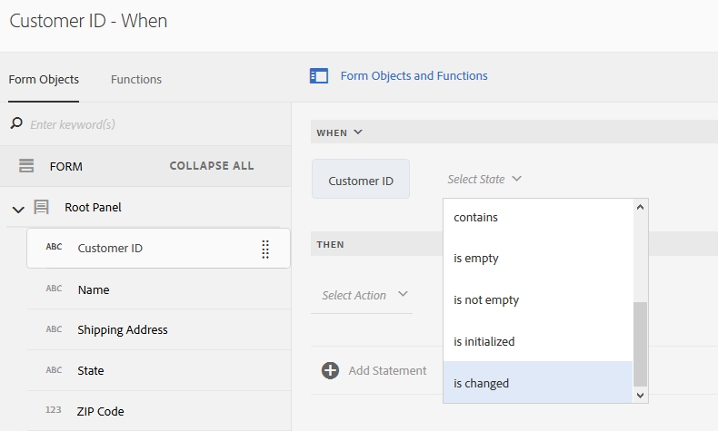

# Zelfstudie: regels toepassen op aangepaste formuliervelden {#tutorial-apply-rules-to-adaptive-form-fields}


Deze zelfstudie is een stap in de [Uw eerste adaptieve formulier maken](/help/forms/using/create-your-first-adaptive-form.md) reeks. De Adobe raadt aan de reeks in chronologische volgorde te volgen om de volledige Gebruikssituatie van de zelfstudie te begrijpen, uit te voeren en te demonstreren.

## Over de zelfstudie {#about-the-tutorial}

Met regels kunt u interactiviteit, bedrijfslogica en slimme validaties toevoegen aan een adaptief formulier. Adaptieve formulieren hebben een ingebouwde regeleditor. De regelredacteur verstrekt belemmering-en-dalingsfunctionaliteit, gelijkend op geleide reizen. De methode slepen en neerzetten is de snelste en eenvoudigste methode om regels te maken. De regelredacteur verstrekt ook een codevenster voor gebruikers geinteresseerd in het testen van hun coderingsvaardigheden of het nemen van de regels aan het volgende niveau.

U kunt meer over de regelredacteur leren bij [Adaptieve Forms-regeleditor](/help/forms/using/rule-editor.md).

Aan het einde van de zelfstudie leert u regels maken voor:

* Een service van het formuliergegevensmodel aanroepen om gegevens uit de database op te halen
* Een service van het formuliergegevensmodel aanroepen om gegevens aan de database toe te voegen
* Een validatiecontrole uitvoeren en foutberichten weergeven

Met interactieve afbeeldingen van GIFFEN aan het einde van elke sectie van de zelfstudie leert u de functionaliteit van het formulier dat u maakt en controleert u deze.

## Stap 1: Haal een klantenverslag van het gegevensbestand terug {#retrieve-customer-record}

U hebt een formuliergegevensmodel gemaakt door het volgende te doen: [formuliergegevensmodel maken](/help/forms/using/create-form-data-model.md) artikel. Nu, kunt u de regelredacteur gebruiken om de diensten van het Gegevensmodel van Forms aan te halen en informatie aan het gegevensbestand toe te voegen.

Elke klant krijgt een uniek klant-id-nummer toegewezen, waarmee relevante klantgegevens in een database kunnen worden geïdentificeerd. In de onderstaande procedure wordt de klant-id gebruikt om gegevens op te halen uit de database:

1. Open het aangepaste formulier voor bewerking.

   [http://localhost:4502/editor.html/content/forms/af/change-billing-shipping-address.html](http://localhost:4502/editor.html/content/forms/af/change-billing-shipping-address.html)

1. Selecteer de **[!UICONTROL Customer ID]** en selecteer de **[!UICONTROL Edit Rules]** pictogram. Het venster van de Redacteur van de Regel opent.
1. Selecteer de **[!UICONTROL + Create]** om een regel toe te voegen. Het opent de Visuele Redacteur.

   In de Visuele Redacteur, **[!UICONTROL WHEN]** is standaard geselecteerd. Ook het formulierobject (in dit geval, **[!UICONTROL Customer ID]**) vanaf waar u de regeleditor hebt gestart, opgegeven in het dialoogvenster **[!UICONTROL WHEN]** instructie.

1. Selecteer de **[!UICONTROL Select State]** vervolgkeuzelijst en selecteer **[!UICONTROL is changed]**.

   

1. In de **[!UICONTROL THEN]** instructie, selecteren **[!UICONTROL Invoke Service]** van de **[!UICONTROL Select Action]** vervolgkeuzelijst.
1. Selecteer de **[!UICONTROL Retrieve Shipping Address]** van de **[!UICONTROL Select]** vervolgkeuzelijst.
1. Sleep de **[!UICONTROL Customer ID]** van het tabblad Formulierobjecten naar het tabblad **[!UICONTROL Drop object or select here]** in het veld **[!UICONTROL INPUT]** doos.

   

1. Sleep de **[!UICONTROL Customer ID, Name, Shipping Address, State, and Zip Code]** van het tabblad Formulierobjecten naar het tabblad **[!UICONTROL Drop object or select here]** in het veld **[!UICONTROL OUTPUT]** doos.

   

   Selecteren **[!UICONTROL Done]** om de regel op te slaan. Voor het venster van de regeleditor selecteert u **[!UICONTROL Close]**.

1. Geef een voorvertoning weer van het adaptieve formulier. Voer een id in het dialoogvenster **[!UICONTROL Customer ID]** veld. Het formulier kan nu klantgegevens uit de database ophalen.

   

## Stap 2: Voeg het bijgewerkte klantenadres aan het gegevensbestand toe {#updated-customer-address}

Nadat de klantgegevens uit de database zijn opgehaald, kunt u het verzendadres, de provincie en de postcode bijwerken. Met de onderstaande procedure wordt een service Formuliergegevensmodel aangeroepen om klantgegevens bij te werken naar de database:

1. Selecteer de **[!UICONTROL Submit]** en selecteer de **[!UICONTROL Edit Rules]** pictogram. Het venster van de Redacteur van de Regel opent.
1. Selecteer de **[!UICONTROL Submit - Click]** en selecteert u de **[!UICONTROL Edit]** pictogram. De opties voor het bewerken van de regel Verzenden worden weergegeven.

   

   In de optie WHEN **[!UICONTROL Submit]** en **[!UICONTROL is clicked]** zijn al geselecteerd.

   

1. In de **[!UICONTROL THEN]** selecteert u de optie **[!UICONTROL + Add Statement]** -optie. Selecteren **[!UICONTROL Invoke Service]** van de **[!UICONTROL Select Action]** vervolgkeuzelijst.
1. Selecteer de **[!UICONTROL Update Shipping Address]** van de **[!UICONTROL Select]** vervolgkeuzelijst.

   

   

1. Sleep de **[!UICONTROL Shipping Address, State, and Zip Code]** veld van de [!UICONTROL Form Objects] tab naar de overeenkomstige tableName.property (bijvoorbeeld, customerdetails.ShippingAddress) van het **[!UICONTROL Drop object or select here]** in het veld **[!UICONTROL INPUT]** doos. Alle velden met een tabelnaam (bijvoorbeeld details van de klant in dit geval) fungeren als invoergegevens voor de updateservice. Alle inhoud die in deze velden wordt geleverd, wordt bijgewerkt in de gegevensbron.

   >[!NOTE]
   >
   >Sleep de **[!UICONTROL Name]** en **[!UICONTROL Customer ID]** velden naar de overeenkomstige tablename.property (bijvoorbeeld customerdetails.name). Zo voorkomt u per ongeluk dat de naam en id van de klant worden bijgewerkt.

1. Sleep de **[!UICONTROL Customer ID]** veld van de [!UICONTROL Form Objects] aan het id-veld in het dialoogvenster **[!UICONTROL INPUT]** doos. Velden zonder een vooraf ingestelde tabelnaam (bijvoorbeeld klantgegevens in dit geval) fungeren als zoekparameter voor de updateservice. De **[!UICONTROL id]** veld in dit gebruiksgeval een record op unieke wijze identificeert in het  **klantgegevens**  tabel.
1. Selecteren **[!UICONTROL Done]** om de regel op te slaan. Voor het venster van de regeleditor selecteert u **[!UICONTROL Close]**.
1. Geef een voorvertoning weer van het adaptieve formulier. Haal de gegevens van een klant op, werk het verzendadres bij en verzend het formulier. Wanneer u de details van dezelfde klant opnieuw ophaalt, wordt het bijgewerkte verzendadres weergegeven.

## Stap 3: (sectie Bonus) Gebruik de code-editor om validaties uit te voeren en foutberichten weer te geven {#step-bonus-section-use-the-code-editor-to-run-validations-and-display-error-messages}

Voer de validatie op het formulier uit om te controleren of de gegevens in het formulier correct zijn en of er een foutbericht wordt weergegeven als er onjuiste gegevens zijn. Als bijvoorbeeld een niet-bestaande klant-id in het formulier wordt ingevoerd, moet een foutbericht worden weergegeven.

Aangepaste formulieren bieden verschillende componenten ingebouwde validaties, zoals e-mail en numerieke velden die u kunt gebruiken voor veelvoorkomende gebruiksgevallen. Gebruik de regeleditor voor geavanceerde gebruiksgevallen bijvoorbeeld om een foutbericht weer te geven wanneer de database nul (0) records (geen records) retourneert.

De volgende procedure laat zien hoe u een regel maakt om een foutbericht weer te geven als de klant-id die u in het formulier hebt ingevoerd, niet bestaat in de database. De regel brengt ook de focus naar en stelt de **[!UICONTROL Customer ID]** veld. De regel gebruikt [de API dataIntegrationUtils van de service van het formuliergegevensmodel](/help/forms/using/invoke-form-data-model-services.md) om te controleren of de klant-id in de database aanwezig is.

1. Selecteer de **[!UICONTROL Customer ID]** en selecteer de `Edit Rules` pictogram. De [!UICONTROL Rule Editor] wordt geopend.
1. Selecteer de **[!UICONTROL + Create]** om een regel toe te voegen. Het opent de Visuele Redacteur.

   In de Visuele Redacteur, **[!UICONTROL WHEN]** is standaard geselecteerd. Ook het formulierobject (in dit geval, **[!UICONTROL Customer ID]**) vanaf waar u de regeleditor hebt gestart, opgegeven in het dialoogvenster **[!UICONTROL WHEN]** instructie.

1. Selecteer de **[!UICONTROL Select State]** vervolgkeuzelijst en selecteer **[!UICONTROL is changed]**.

   

   In de **[!UICONTROL THEN]** instructie, selecteren **[!UICONTROL Invoke Service]** van de **[!UICONTROL Select Action]** vervolgkeuzelijst.

1. Overschakelen van **[!UICONTROL Visual Editor]** tot **[!UICONTROL Code Editor]**. De schakelaarcontrole is op de rechterkant van het venster. De Redacteur van de Code opent, tonend code gelijkend op het volgende:

   

1. Vervang de sectie met invoervariabelen door de volgende code:

   ```javascript
   var inputs = {
       "id" : this
   };
   ```

1. Vervang de `guidelib.dataIntegrationUtils.executeOperation (operationInfo, inputs, outputs)` met de volgende code:

   ```javascript
   guidelib.dataIntegrationUtils.executeOperation(operationInfo, inputs, outputs, function (result) {
     if (result) {
         result = JSON.parse(result);
       customer_Name.value = result.name;
       customer_Shipping_Address = result.shippingAddress;
     } else {
       if(window.confirm("Invalid Customer ID. Provide a valid customer ID")) {
             customer_Name.value = " ";
            guideBridge.setFocus(customer_ID);
       }
     }
   });
   ```

1. Geef een voorvertoning weer van het adaptieve formulier. Voer een onjuiste klant-id in. Er verschijnt een foutbericht.

   
