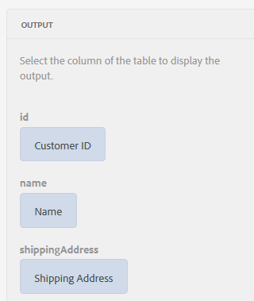
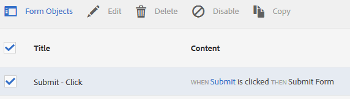

# Zelfstudie: regels toepassen op aangepaste formuliervelden {#tutorial-apply-rules-to-adaptive-form-fields}


Dit leerprogramma is een stap in [&#x200B; creeert Uw Eerste AanpassingsVorm &#x200B;](/help/forms/using/create-your-first-adaptive-form.md) reeksen. De Adobe raadt aan de reeks in chronologische volgorde te volgen om de volledige Gebruikssituatie van de zelfstudie te begrijpen, uit te voeren en te demonstreren.

## Over de zelfstudie {#about-the-tutorial}

Met regels kunt u interactiviteit, bedrijfslogica en slimme validaties toevoegen aan een adaptief formulier. Adaptieve formulieren hebben een ingebouwde regeleditor. De regelredacteur verstrekt belemmering-en-dalingsfunctionaliteit, gelijkend op geleide reizen. De methode slepen en neerzetten is de snelste en eenvoudigste methode om regels te maken. De regelredacteur verstrekt ook een codevenster voor gebruikers geinteresseerd in het testen van hun coderingsvaardigheden of het nemen van de regels aan het volgende niveau.

U kunt meer over de regelredacteur bij [&#x200B; Aangepaste de regelredacteur van Forms &#x200B;](/help/forms/using/rule-editor.md) leren.

Aan het einde van de zelfstudie leert u regels maken voor:

* Een service van het formuliergegevensmodel aanroepen om gegevens uit de database op te halen
* Een service van het formuliergegevensmodel aanroepen om gegevens aan de database toe te voegen
* Een validatiecontrole uitvoeren en foutberichten weergeven

Met interactieve afbeeldingen van GIFFEN aan het einde van elke sectie van de zelfstudie leert u de functionaliteit van het formulier dat u maakt en controleert u deze.

## Stap 1: Haal een klantenverslag van het gegevensbestand terug {#retrieve-customer-record}

U creeerde een model van vormgegevens door [&#x200B; te volgen creeert modelgegevensmodel &#x200B;](/help/forms/using/create-form-data-model.md) artikel. Nu, kunt u de regelredacteur gebruiken om de diensten van het Gegevensmodel van Forms aan te halen en informatie aan het gegevensbestand toe te voegen.

Elke klant krijgt een uniek klant-id-nummer toegewezen, waarmee relevante klantgegevens in een database kunnen worden geïdentificeerd. In de onderstaande procedure wordt de klant-id gebruikt om gegevens op te halen uit de database:

1. Open het aangepaste formulier voor bewerking.

   [&#x200B; http://localhost:4502/editor.html/content/forms/af/change-billing-shipping-address.html](http://localhost:4502/editor.html/content/forms/af/change-billing-shipping-address.html)

1. Selecteer het veld **[!UICONTROL Customer ID]** en selecteer het pictogram **[!UICONTROL Edit Rules]** . Het venster van de Redacteur van de Regel opent.
1. Selecteer het pictogram **[!UICONTROL + Create]** om een regel toe te voegen. Het opent de Visuele Redacteur.

   In de Visuele Editor wordt de instructie **[!UICONTROL WHEN]** standaard geselecteerd. Bovendien wordt het formulierobject (in dit geval **[!UICONTROL Customer ID]** ) waaruit u de regeleditor hebt gestart, opgegeven in de instructie **[!UICONTROL WHEN]** .

1. Selecteer de vervolgkeuzelijst **[!UICONTROL Select State]** en selecteer **[!UICONTROL is changed]** .

   

1. Selecteer **[!UICONTROL Invoke Service]** in de vervolgkeuzelijst **[!UICONTROL Select Action]** in de instructie **[!UICONTROL THEN]** .
1. Selecteer de service **[!UICONTROL Retrieve Shipping Address]** in de vervolgkeuzelijst **[!UICONTROL Select]** .
1. Sleep het veld **[!UICONTROL Customer ID]** van het tabblad Formulierobjecten naar het veld **[!UICONTROL Drop object or select here]** in het vak **[!UICONTROL INPUT]** .

   

1. Sleep het veld **[!UICONTROL Customer ID, Name, Shipping Address, State, and Zip Code]** van het tabblad Formulierobjecten naar het veld **[!UICONTROL Drop object or select here]** in het vak **[!UICONTROL OUTPUT]** .

   

   Selecteer **[!UICONTROL Done]** om de regel op te slaan. Selecteer **[!UICONTROL Close]** in het regeleditorvenster.

1. Geef een voorvertoning weer van het adaptieve formulier. Voer een id in het veld **[!UICONTROL Customer ID]** in. Het formulier kan nu klantgegevens uit de database ophalen.

   

## Stap 2: Voeg het bijgewerkte klantenadres aan het gegevensbestand toe {#updated-customer-address}

Nadat de klantgegevens uit de database zijn opgehaald, kunt u het verzendadres, de provincie en de postcode bijwerken. Met de onderstaande procedure wordt een service Formuliergegevensmodel aangeroepen om klantgegevens bij te werken naar de database:

1. Selecteer het veld **[!UICONTROL Submit]** en selecteer het pictogram **[!UICONTROL Edit Rules]** . Het venster van de Redacteur van de Regel opent.
1. Selecteer de regel **[!UICONTROL Submit - Click]** en selecteer het pictogram **[!UICONTROL Edit]** . De opties voor het bewerken van de regel Verzenden worden weergegeven.

   

   In de optie WHEN zijn de opties **[!UICONTROL Submit]** en **[!UICONTROL is clicked]** al geselecteerd.

   

1. Selecteer de optie **[!UICONTROL + Add Statement]** in de optie **[!UICONTROL THEN]** . Selecteer **[!UICONTROL Invoke Service]** in de vervolgkeuzelijst **[!UICONTROL Select Action]** .
1. Selecteer de service **[!UICONTROL Update Shipping Address]** in de vervolgkeuzelijst **[!UICONTROL Select]** .

   

   

1. Sleep het veld **[!UICONTROL Shipping Address, State, and Zip Code]** van de tab [!UICONTROL Form Objects] naar de overeenkomstige eigenschap tableName.property (bijvoorbeeld customerdetails.ShippingAddress) van het veld **[!UICONTROL Drop object or select here]** in het vak **[!UICONTROL INPUT]** . Alle velden met een tabelnaam (bijvoorbeeld details van de klant in dit geval) fungeren als invoergegevens voor de updateservice. Alle inhoud die in deze velden wordt geleverd, wordt bijgewerkt in de gegevensbron.

   >[!NOTE]
   >
   >Sleep de velden **[!UICONTROL Name]** en **[!UICONTROL Customer ID]** niet naar de bijbehorende eigenschap tabName.property (bijvoorbeeld customerdetails.name). Zo voorkomt u per ongeluk dat de naam en id van de klant worden bijgewerkt.

1. Sleep het veld **[!UICONTROL Customer ID]** van de tab [!UICONTROL Form Objects] naar het veld ID in het vak **[!UICONTROL INPUT]** . Velden zonder een vooraf ingestelde tabelnaam (bijvoorbeeld klantgegevens in dit geval) fungeren als zoekparameter voor de updateservice. Het **[!UICONTROL id]** gebied in dit gebruiksgeval identificeert uniek een verslag in de **klantDetails** lijst.
1. Selecteer **[!UICONTROL Done]** om de regel op te slaan. Selecteer **[!UICONTROL Close]** in het regeleditorvenster.
1. Geef een voorvertoning weer van het adaptieve formulier. Haal de gegevens van een klant op, werk het verzendadres bij en verzend het formulier. Wanneer u de details van dezelfde klant opnieuw ophaalt, wordt het bijgewerkte verzendadres weergegeven.

## Stap 3: (sectie Bonus) Gebruik de code-editor om validaties uit te voeren en foutberichten weer te geven {#step-bonus-section-use-the-code-editor-to-run-validations-and-display-error-messages}

Voer de validatie op het formulier uit om te controleren of de gegevens in het formulier correct zijn en of er een foutbericht wordt weergegeven als er onjuiste gegevens zijn. Als bijvoorbeeld een niet-bestaande klant-id in het formulier wordt ingevoerd, moet een foutbericht worden weergegeven.

Aangepaste formulieren bieden verschillende componenten ingebouwde validaties, zoals e-mail en numerieke velden die u kunt gebruiken voor veelvoorkomende gebruiksgevallen. Gebruik de regeleditor voor geavanceerde gebruiksgevallen bijvoorbeeld om een foutbericht weer te geven wanneer de database nul (0) records (geen records) retourneert.

De volgende procedure laat zien hoe u een regel maakt om een foutbericht weer te geven als de klant-id die u in het formulier hebt ingevoerd, niet bestaat in de database. Met de regel wordt ook de focus naar het veld **[!UICONTROL Customer ID]** gebracht en opnieuw ingesteld. De regel gebruikt [&#x200B; dataIntegrationUtils API van de modeldienst van vormgegevens &#x200B;](/help/forms/using/invoke-form-data-model-services.md) om te controleren of identiteitskaart van de Klant in het gegevensbestand bestaat.

1. Selecteer het veld **[!UICONTROL Customer ID]** en selecteer het pictogram `Edit Rules` . Het venster [!UICONTROL Rule Editor] wordt geopend.
1. Selecteer het pictogram **[!UICONTROL + Create]** om een regel toe te voegen. Het opent de Visuele Redacteur.

   In de Visuele Editor wordt de instructie **[!UICONTROL WHEN]** standaard geselecteerd. Bovendien wordt het formulierobject (in dit geval **[!UICONTROL Customer ID]** ) waaruit u de regeleditor hebt gestart, opgegeven in de instructie **[!UICONTROL WHEN]** .

1. Selecteer de vervolgkeuzelijst **[!UICONTROL Select State]** en selecteer **[!UICONTROL is changed]** .

   

   Selecteer **[!UICONTROL Invoke Service]** in de vervolgkeuzelijst **[!UICONTROL Select Action]** in de instructie **[!UICONTROL THEN]** .

1. Schakel van **[!UICONTROL Visual Editor]** naar **[!UICONTROL Code Editor]** . De schakelaarcontrole is op de rechterkant van het venster. De Redacteur van de Code opent, tonend code gelijkend op het volgende:

   

1. Vervang de sectie met invoervariabelen door de volgende code:

   ```javascript
   var inputs = {
       "id" : this
   };
   ```

1. Vervang de sectie `guidelib.dataIntegrationUtils.executeOperation (operationInfo, inputs, outputs)` door de volgende code:

   ```javascript
   guidelib.dataIntegrationUtils.executeOperation(operationInfo, inputs, outputs, function (result) {
     if (result) {
         result = JSON.parse(result);
       customer_Name.value = result.name;
       customer_Shipping_Address = result.shippingAddress;
     } else {
       if(window.confirm("Invalid Customer ID. Provide a valid customer ID")) {
             customer_Name.value = " ";
            guideBridge.setFocus(customer_ID);
       }
     }
   });
   ```

1. Geef een voorvertoning weer van het adaptieve formulier. Voer een onjuiste klant-id in. Er verschijnt een foutbericht.

   
