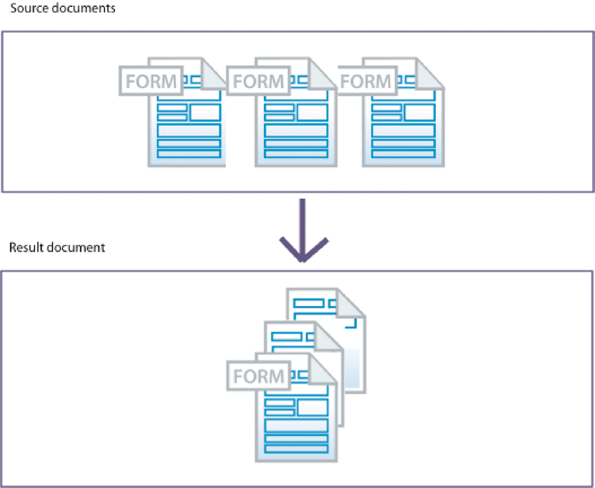

# De Assembler-service gebruiken{#using-assembler-service}

Met de Assembler-service kunt u PDF- en XDP-documenten combineren, opnieuw rangschikken en vergroten en informatie ophalen over PDF-documenten. Elke baan die aan de dienst van de Assembler wordt voorgelegd omvat een document van XML van de Beschrijving van het Document (DDX), brondocumenten, en externe middelen (koorden en grafiek). Voor meer informatie over de assembleerdienst, zie [Overzicht van de Dienst](../../forms/using/overview-aem-document-services.md#p-assembler-service-p)van de Assembler.

U kunt de verzamelservice gebruiken voor de volgende bewerkingen:

## PDF-documenten samenstellen {#assemble-pdf-documents}

U kunt de Assembler-service gebruiken om twee of meer PDF-documenten samen te voegen tot één PDF-document of PDF-portfolio. U kunt ook functies toepassen op het PDF-document die navigatie ondersteunen of de beveiliging verbeteren. Hier volgen enkele voorbeelden van manieren waarop u PDF-documenten kunt samenstellen:

### Een eenvoudig PDF-document samenstellen {#assemble-a-simple-pdf-document}

In de volgende afbeelding ziet u drie brondocumenten die in één resulterend document worden samengevoegd.


Een eenvoudig PDF-document samenstellen op basis van meerdere PDF-documenten

Het volgende voorbeeld is een eenvoudig DDX-document dat wordt gebruikt om het document samen te stellen. Hierin worden de namen van de brondocumenten opgegeven die worden gebruikt om het resulterende document te produceren, en de naam van het resulterende document:

```xml
<PDF result="Doc4">
<PDF source="Doc1"/>
<PDF source="Doc2"/>
<PDF source="Doc3"/>
</PDF>
```

De assemblage van het document veroorzaakt een resulterend document dat de volgende inhoud bevat en\
kenmerken:

* Alle of een deel van elk brondocument
* De bladwijzers van elk brondocument of een deel ervan worden genormaliseerd voor het samengevoegde resulterende document
* Andere kenmerken die zijn overgenomen uit het basisdocument (Doc1), waaronder metagegevens, paginalabels en paginagrootte
* Het resulterende document bevat eventueel een inhoudsopgave die is opgebouwd uit de bladwijzers in de brondocumenten

### Een PDF-portfolio maken {#create-a-pdf-portfolio}

Met de Assembler-service kunt u PDF-portfolio&#39;s maken die een verzameling documenten en een eigen gebruikersinterface bevatten. De interface wordt een PDF-portfolio-indeling of een PDF-portfolio-navigator (navigator) genoemd. PDF-portfolio&#39;s vergroten de mogelijkheden van PDF-pakketten door een navigator, mappen en welkomstpagina&#39;s toe te voegen. De interface kan de gebruikerservaring verbeteren door gebruik te maken van gelokaliseerde tekst, aangepaste kleurenschema&#39;s en grafische bronnen. Het PDF-portfolio kan ook mappen bevatten voor het ordenen van de bestanden in het portfolio.

Wanneer de Assembler-service het volgende DDX-document interpreteert, wordt een PDF-portfolio samengesteld met daarin een navigator voor PDF-portfolio en een pakket van twee bestanden. De dienst verkrijgt de navigator van de plaats die door myNavigator bron wordt gespecificeerd. Hiermee wordt het standaardkleurenschema van de navigator gewijzigd in het rozeScheme-kleurenschema.

```xml
<DDX xmlns="https://ns.adobe.com/DDX/1.0/">
<PDF result="Untitled 1">
<Portfolio>
<Navigator source="myNavigator"/>
<ColorScheme scheme="pinkScheme"/>
</Portfolio>
<PackageFiles>
<PDF source="sourcePDF1"/>
<PDF source="sourcePDF2"/>
</PackageFiles>
</PDF>
</DDX>
```

### Gecodeerde documenten samenstellen {#assemble-encrypted-documents}

Wanneer u een document samenstelt, kunt u het PDF-document ook versleutelen met een wachtwoord. Nadat een PDF-document met een wachtwoord is versleuteld, moet de gebruiker het wachtwoord opgeven om het PDF-document in Adobe Reader of Acrobat te kunnen bekijken. Als u een PDF-document met een wachtwoord wilt versleutelen, moet het DDX-document waarden voor versleutelingselementen bevatten die vereist zijn om een PDF-document te versleutelen.

De coderingsservice hoeft geen deel uit te maken van uw LiveCycle-installatie om een PDF-document met een wachtwoord te coderen.

Als een of meer invoerdocumenten zijn versleuteld, geeft u een wachtwoord op om het document te openen als onderdeel van de DDX.

### Documenten samenstellen met Bates-nummering {#assemble-documents-using-bates-numbering}

Wanneer u een document samenstelt, kunt u Bates-nummering gebruiken om een unieke pagina-id toe te passen op elke pagina. Wanneer u Bates-nummering gebruikt, wordt aan elke pagina in het document (of in een set documenten) een nummer toegewezen dat de pagina op unieke wijze identificeert. Bijvoorbeeld, kunnen de productiedocumenten die rekening van materiaalinformatie bevatten en met de productie van een assemblage worden geassocieerd een herkenningsteken bevatten. Een Bates-nummer bevat een opeenvolgend verhoogde numerieke waarde en een optioneel voor- en achtervoegsel. Het voorvoegsel + de numerieke waarde + achtervoegsel wordt een bonepatroon genoemd.

In de volgende afbeelding ziet u een PDF-document dat een unieke id bevat die zich in de koptekst van het document bevindt.


Een PDF-document dat een unieke id bevat die zich in de koptekst van het document bevindt

### Documenten samenvoegen en samenvoegen {#flatten-and-assemble-documents}

Met de Assembler-service kunt u een interactief PDF-document (bijvoorbeeld een formulier) transformeren naar een niet-interactief PDF-document. Met een interactief PDF-document kunnen gebruikers gegevens in de PDF-documentvelden invoeren of wijzigen. Het transformeren van een interactief PDF-document naar een niet-interactief PDF-document wordt afvlakking genoemd. Wanneer een PDF-document wordt afgevlakt, behouden formuliervelden hun grafische weergave maar zijn ze niet meer interactief. Een reden om een PDF-document af te vlakken is ervoor te zorgen dat gegevens niet kunnen worden gewijzigd. Daarnaast werken scripts die aan de velden zijn gekoppeld niet meer.

Wanneer u een PDF-document maakt dat is samengesteld op basis van interactieve PDF-documenten, voegt de Assembler-service deze formulieren samen voordat u ze samenvoegt tot het resulterende document.

>[!NOTE]
>
>De Assembler-service gebruikt de Output-service om dynamische XFA-formulieren af te vlakken. Als de dienst van de Assembler een DDX verwerkt die het vereist om een XFA dynamische vorm af te vlakken en de dienst van de Output niet beschikbaar is, wordt een uitzondering geworpen. Met de Assembler-service kunt u een Acrobat-formulier of een statisch XFA-formulier afvlakken zonder de Output-service te gebruiken.

## XDP-documenten samenstellen {#assemble-xdp-documents}

Met de Assembler-service kunt u meerdere XDP-documenten samenvoegen tot één XDP-document of tot één PDF-document. Voor XDP-bronbestanden die invoegpunten bevatten, kunt u opgeven welke fragmenten moeten worden ingevoegd.

Hier volgen enkele voorbeelden van manieren waarop u XDP-documenten kunt samenstellen:

### Een eenvoudig XDP-document samenstellen {#assemble-a-simple-xdp-document}

In de volgende afbeelding ziet u drie XDP-brondocumenten die in één resulterend XDP-document worden samengevoegd. Het resulterende XDP-document bevat de drie bron-XDP-documenten inclusief de bijbehorende gegevens. Het resulterende document krijgt basiskenmerken van het basisdocument, het eerste bron-XDP-document.



Een eenvoudig XDP-document samenstellen op basis van meerdere XDP-documenten

Hier volgt een DDX-document dat het hierboven weergegeven resultaat oplevert.

```xml
<DDX xmlns="https://ns.adobe.com/DDX/1.0/">
<XDP result="MyXDPResult">
<XDP source="sourceXDP1"/>
<XDP source="sourceXDP2"/>
<XDP source="sourceXDP3"/>
</XDP>
</DDX>
```

### Referenties oplossen tijdens verzameling {#resolving-references-during-assembly}

XDP-documenten kunnen doorgaans afbeeldingen bevatten waarnaar wordt verwezen door absolute of relatieve verwijzingen. Standaard blijven in de verzamelingsservice de verwijzingen naar de afbeeldingen in het resulterende XDP-document behouden.

U kunt specificeren hoe de dienst van de Assembler de beelden van verwijzingen in de bronXDP documenten of door absolute of relatieve verwijzingen in de XDP dossiers wanneer het assembleren van behandelt. U kunt ervoor kiezen om alle afbeeldingen in de resulterende afbeelding in te sluiten, zodat deze geen relatieve of absolute verwijzingen bevat. U definieert dit door de waarde van de tag resolveAssets in te stellen. Dit kan een van de volgende opties hebben. Standaard worden geen verwijzingen omgezet in het resultaatdocument.

<table>
 <tbody> 
  <tr> 
   <th>Waarde</th> 
   <th>Beschrijving</th> 
  </tr> 
  <tr> 
   <td>none</td> 
   <td>Hiermee worden referenties niet opgelost.</td> 
  </tr> 
  <tr> 
   <td>all</td> 
   <td>Hiermee worden alle afbeeldingen waarnaar wordt verwezen, ingesloten in het XDP-brondocument.</td> 
  </tr> 
  <tr> 
   <td>relatief</td> 
   <td>Hiermee worden alle afbeeldingen waarnaar wordt verwezen door relatieve verwijzingen ingesloten in het XDP<br /> -brondocument.</td> 
  </tr> 
  <tr> 
   <td>absoluut</td> 
   <td>Hiermee worden alle afbeeldingen waarnaar wordt verwezen door absolute verwijzingen in het XDP<br /> -brondocument ingesloten.</td> 
  </tr> 
 </tbody> 
</table>

U kunt de waarde van het kenmerk resolveAssets opgeven in de XDP-brontag of in de bovenliggende XDP-resultaattag. Als het attribuut aan de XDP resultaatmarkering wordt gespecificeerd, zal het door alle XDP bronelementen worden geërft die kinderen van XDP resultaat zijn. Nochtans, treedt uitdrukkelijk het specificeren van de attributen voor een bronelement met voeten het plaatsen van het resultaatelement voor dat brondocument alleen.

#### Alle bronverwijzingen in een XDP-document omzetten {#resolve-all-source-references-in-an-xdp-document}

Als u alle verwijzingen in de bron-XDP-documenten wilt oplossen, geeft u het kenmerk resolveAssets op voor de\
resulterend document aan allen, zoals in het onderstaande voorbeeld:

```xml
<DDX xmlns="https://ns.adobe.com/DDX/1.0/">
<XDP result="result.xdp" resolveAssets="all">
<XDP source="input1.xdp" />
<XDP source="input2.xdp" />
<XDP source="input3.xdp" />
</XDP>
</DDX
```

U kunt ook het kenmerk voor alle XDP-brondocumenten afzonderlijk opgeven om hetzelfde te verkrijgen\
resultaat.

```xml
<DDX xmlns="https://ns.adobe.com/DDX/1.0/">
<XDP result="result.xdp">
<XDP source="input1.xdp" resolveAssets="all"/>
<XDP source="input2.xdp" resolveAssets="all"/>
<XDP source="input3.xdp" resolveAssets="all"/>
</XDP>
</DDX>
```

#### Geselecteerde bronverwijzingen omzetten in een XDP-document {#resolve-selected-source-references-in-an-xdp-document}

U kunt selectief de bronverwijzingen specificeren die u wilt oplossen door de resolveAssets attributen voor hen te specificeren. De kenmerken voor afzonderlijke brondocumenten overschrijven de instelling van het resulterende XDP-document. In dit voorbeeld worden de opgenomen fragmenten ook opgelost.

```xml
<DDX xmlns="https://ns.adobe.com/DDX/1.0/">
<XDP result="result.xdp" resolveAssets="all">
<XDP source="input1.xdp" >
<XDPContent source="fragment.xdp" insertionPoint="MyInsertionPoint"
fragment="myFragment"/>
</XDP>
<XDP source="input2.xdp" />
</XDP>
</DDX>
```

#### Absolute of relatieve verwijzingen selectief oplossen {#selectively-resolve-absolute-or-relative-references}

U kunt absolute of relatieve verwijzingen selectief oplossen in alle of sommige brondocumenten, zoals aangetoond in het hieronder voorbeeld:

```xml
<DDX xmlns="https://ns.adobe.com/DDX/1.0/">
<XDP result="result.xdp" resolveAssets="absolute">
<XDP source="input1.xdp" />
<XDP source="input2.xdp" />
</XDP>
</DDX
```

### Formulierfragmenten dynamisch invoegen in een XFA-formulier {#dynamically-insert-form-fragments-into-an-xfa-form}

Met de Assembler-service kunt u een XFA-formulier maken dat is gemaakt op basis van een ander XFA-formulier waarin fragmenten worden ingevoegd. Met deze functie kunt u fragmenten gebruiken om meerdere formulieren te maken.

Ondersteuning voor dynamische invoeging van formulierfragmenten ondersteunt single-source-beheer. U behoudt één bron van veelgebruikte componenten. U kunt bijvoorbeeld een fragment voor uw bedrijfsbanner maken. Als de banner verandert, hoeft u alleen het fragment te wijzigen. De andere formulieren met het fragment blijven ongewijzigd.

Formulierontwerpers maken met LiveCycle Designer formulierfragmenten. Deze fragmenten hebben een unieke naam voor subformulieren in een XFA-formulier. De formulierontwerpers gebruiken Designer ook om XFA-formulieren te maken met invoegpunten met een unieke naam. U (de programmeur) schrijft DX- documenten die specificeren hoe de fragmenten in de vorm XFA worden opgenomen.

In de volgende afbeelding ziet u twee XML-formulieren (XFA-sjablonen). Het formulier aan de linkerkant bevat een invoegpunt met de naam myInsertionPoint. Het formulier aan de rechterkant bevat een fragment met de naam myFragment.


Formulierfragmenten invoegen in een XFA-formulier

Wanneer de Assembler-service het volgende DDX-document interpreteert, wordt een XML-formulier gemaakt dat een ander XML-formulier bevat. Het subformulier myFragment uit het document myFragmentSource wordt ingevoegd bij myInsertionPoint in het document myFormSource.

```xml
<DDX xmlns="https://ns.adobe.com/DDX/1.0/">
<XDP result="myFormResult">
<XDP source="myFormSource">
<XDPContent fragment="myFragment" insertionPoint="myInsertionPoint"
source="myFragmentSource"/>
</XDP>
</XDP>
</DDX
```

### Een XDP-document verpakken als PDF {#package-an-xdp-document-as-pdf}

Met de Assembler-service kunt u een XDP-document verpakken als een PDF-document, zoals in dit DDX-document wordt getoond.

```xml
<DDX xmlns="https://ns.adobe.com/DDX/1.0/">
<PDF result="Untitled 1" encryption="passEncProfile1">
<XDP>
<XDP source="sourceXDP3"/>
<XDP source="sourceXDP4"/>
</XDP>
</PDF>
</DDX>
```

## PDF-documenten dempen {#disassemble-pdf-documents}

U kunt de Assembler-service gebruiken om een PDF-document te demonteren. De service kan pagina&#39;s uitnemen uit het brondocument of een brondocument splitsen op basis van bladwijzers. Deze taak is meestal handig als het PDF-document oorspronkelijk is gemaakt op basis van veel afzonderlijke documenten, zoals een verzameling instructies.

### Pagina&#39;s uit een brondocument extraheren {#extract-pages-from-a-source-document}

In de volgende afbeelding worden pagina&#39;s 1-3 uit het brondocument geëxtraheerd en in een nieuw resulterend document geplaatst.


Specifieke pagina&#39;s uit een brondocument extraheren

Het volgende voorbeeld is een DDX-document dat wordt gebruikt om het document te demonteren.

```xml
<PDF result="Doc4">
<PDF source="Doc2" pages="1-3"/>
</PDF>
```

### Een brondocument splitsen op basis van bladwijzers {#divide-a-source-document-based-on-bookmarks}

In de volgende afbeelding wordt DocA verdeeld in meerdere resulterende documenten. De eerste bladwijzer van niveau 1 op een pagina identificeert het begin van een nieuw resulterend document.


Een brondocument dat is gebaseerd op bladwijzers, opsplitsen in meerdere documenten

Het volgende voorbeeld is een DDX-document dat bladwijzers gebruikt om een brondocument te demonteren.

```xml
<PDFsFromBookmarks prefix="A">
<PDF source="DocA"/>
</PDFsFromBookmarks>
```

## Bepalen of documenten PDF/A-compatibel zijn {#determine-whether-documents-are-pdf-a-compliant}

U kunt met de Assembler-service bepalen of een PDF-document compatibel is met PDF/A. PDF/A is een archiefindeling die is bedoeld voor langdurige bewaring van de inhoud van het document. De lettertypen worden ingesloten in het document en het bestand wordt niet gecomprimeerd. Een PDF/A-document is daarom doorgaans groter dan een standaard PDF-document. Een PDF/A-document bevat ook geen audio- en video-inhoud.

## Informatie opvragen over een PDF-document {#obtain-information-about-a-pdf-document}

Met de Assembler-service kunt u de volgende informatie over een PDF-document opvragen:

* Tekstgegevens.

   * Woorden op elke pagina van het document
   * Positie van elk woord op elke pagina van het document
   * Zinnen in elke alinea van elke pagina van het document

* Bladwijzers, inclusief het paginanummer, de titel, het doel en de weergave. U kunt dit exporteren\
   gegevens uit een PDF-document en importeren in een PDF-document.

* Bestandsbijlagen, inclusief bestandsinformatie. Voor bijlagen op paginaniveau bevat deze eigenschap ook de\
   locatie van de annotatie voor bestandsbijlagen. U kunt deze gegevens exporteren uit een PDF-document en\
   importeert u het bestand in een PDF-document.

* Pakketbestanden, waaronder bestandsinformatie, mappen, pakket, schema en veldgegevens. U kunt deze gegevens uit een PDF-document exporteren en importeren in een PDF-document.

## DDX-documenten valideren {#validate-ddx-documents}

U kunt de dienst van de Assembler gebruiken om te bepalen of een Dx- document geldig is. Als u bijvoorbeeld een upgrade hebt uitgevoerd vanaf een eerdere versie van LiveCycle, zorgt de validatie ervoor dat uw DDX-document geldig is.

## Andere services bellen {#call-other-services}

U kunt DX- documenten gebruiken die de dienst van de Assembler veroorzaken om de volgende LiveC cyclusdiensten te roepen. De Assembler-service kan alleen de services aanroepen die met LiveCycle zijn geïnstalleerd.

**Reader Extensions-service**: Hiermee kunnen gebruikers van Adobe Reader het resulterende PDF-document digitaal ondertekenen.

**Formulierservice**: Hiermee voegt u een XDP-bestand en een XML-gegevensbestand samen om een PDF-document te maken dat het ingevulde interactieve formulier bevat.

**Uitvoerservice**: Hiermee converteert u een dynamisch XML-formulier naar een PDF-document dat een niet-interactief formulier bevat (het formulier wordt afgevlakt). Met de service Assembler worden statische XML-formulieren en Acrobat-formulieren afgevlakt zonder dat de service Output wordt aangeroepen.

```xml
<?xml version="1.0" encoding="UTF-8"?>
<DDX xmlns="https://ns.adobe.com/DDX/1.0/">
<PDF result="outDoc">
<PDF source="doc1"/>
<PDF source="doc2"/>
<ReaderRights
credentialAlias="LCESCred"
digitalSignatures="true"/>
</PDF>
</DDX>
```

Het gebruiken van DDX en de dienst van de Assembler om andere LiveC cyclusdiensten te roepen kan uw procesdiagram vereenvoudigen. Het kan zelfs de moeite die u besteedt aan het aanpassen van uw workflows verminderen. (Zie ook
