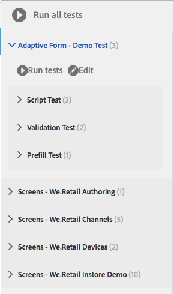

# Testen van adaptieve formulieren automatiseren{#automate-testing-of-adaptive-forms}

## Overzicht {#overview}

Adaptieve formulieren zijn een integraal onderdeel van de interactie van uw klant. Het is belangrijk dat u uw aangepaste formulieren test met elke wijziging die u erin aanbrengt, bijvoorbeeld tijdens het uitrollen van een nieuw fixeerpakket of het wijzigen van een regel in het formulier. Het kan echter vervelend zijn om adaptieve formulieren en alle velden erin te testen.

Met Calvin kunt u het testen van uw adaptieve formulieren automatiseren in de webbrowser. Calvin gebruikt het gebruikersinterface van [Hobbes](/help/sites-developing/hobbes.md)voor het runnen van de tests en verstrekt de volgende hulpmiddelen:

* Een JavaScript API voor het maken van tests.
* Een gebruikersinterface voor het uitvoeren van tests.

Met Calvin kunt u testgevallen maken in CRXDE en UI-tests rechtstreeks uitvoeren in de webbrowser om de volgende aspecten van uw adaptieve formulieren grondig te testen:

<table>
 <tbody>
  <tr>
   <td><strong>Adaptief vormaspect om te testen</strong></td>
   <td><strong>Beschrijving</strong></td>
  </tr>
  <tr>
   <td>Vooraf ingevuld met een adaptief formulier</td>
   <td>
    <ul>
     <li>Wordt het formulier vooraf ingevuld zoals verwacht op basis van het type gegevensmodel?</li>
     <li>Worden de standaardwaarden van formulierobjecten naar behoren voorgevuld?</li>
    </ul> </td>
  </tr>
  <tr>
   <td>Ervaring van een adaptief formulier verzenden</td>
   <td>
    <ul>
     <li>Worden correcte gegevens gegenereerd bij verzending?</li>
     <li>Wordt het formulier tijdens het verzenden opnieuw gevalideerd op de server?</li>
     <li>Is de verzendactie geconfigureerd voor het formulier dat wordt uitgevoerd?</li>
    </ul> </td>
  </tr>
  <tr>
   <td><p>Expressieregels</p> <p> </p> </td>
   <td>
    <ul>
     <li>Worden de expressies die aan formulierobjecten zijn gekoppeld, zoals berekenen, zichtbaar, scripts uitgevoerd nadat een veld is afgesloten en worden deze uitgevoerd nadat de relevante UI-bewerkingen zijn uitgevoerd?<br /> </li>
    </ul> </td>
  </tr>
  <tr>
   <td>Validaties</td>
   <td>
    <ul>
     <li>Worden veldvalidaties uitgevoerd zoals verwacht na het uitvoeren van de bewerkingen?</li>
    </ul> </td>
  </tr>
  <tr>
   <td><p>Lazy Loading</p> <p> </p> </td>
   <td>
    <ul>
     <li>Wordt bij klikken op tabs (of een navigatie-item van een deelvenster) de HTML opgehaald van de server volgens de lazy laadconfiguratie?</li>
    </ul></td>
  </tr>
  <tr>
   <td><p>UI-interactie</p> </td>
   <td>
    <ul>
     <li><a href="https://helpx.adobe.com/aem-forms/6-3/calvin-sdk-javascript-api/calvin.html#toc2__anchor" target="_blank">Interactie van de testgebruikersinterface met adaptieve formulierobjecten</a></li>
    </ul> </td>
  </tr>
 </tbody>
</table>

### Vereisten {#prerequisites}

Voordat u dit artikel kunt gebruiken voor het maken van testcase, moet u het volgende weten:

* Testsuites maken en testcase uitvoeren met [obbes](https://docs.adobe.com/docs/en/aem/6-3/develop/components/hobbes.html)
* [JavaScript-API&#39;s blokkeren](https://docs.adobe.com/docs/en/aem/6-2/develop/ref/test-api/index.html)
* [JavaScript-API&#39;s Calvin](https://helpx.adobe.com/aem-forms/6-3/calvin-sdk-javascript-api/calvin.html)

## Voorbeeld: Een testsuite maken voor een adaptief formulier met Hobbes als testframework {#example-create-a-test-suite-for-an-adaptive-form-using-hobbes-as-testing-framework}

In het volgende voorbeeld wordt het maken van een testsuite voor het testen van meerdere adaptieve formulieren besproken. U moet een afzonderlijk testcase maken voor elk formulier dat u moet testen. Als u in stap 11 vergelijkbare stappen uitvoert en de JavaScript-code wijzigt, kunt u uw eigen testsuite maken om uw aangepaste formulieren te testen.

1. Ga naar CRXDE Lite in uw webbrowser: `https://'[server]:[port]'/crx/de`.
1. Klik met de rechtermuisknop op de submap /etc/clientlibs en klik op **Maken** > **Knooppunt** maken. Voer een naam in (hier afTestRegistration), geef het type knooppunt op als cq:ClientLibraryFolder en klik op **OK.**

   De clientlibs-map bevat het registratieaspect van uw toepassing (JS en Init). U wordt aangeraden alle Hobbes-testreekobjecten te registreren die specifiek zijn voor een formulier in de clientlibs-map.

1. Geef de volgende eigenschapswaarden op in het nieuwe knooppunt (hier afTestRegistration) en klik op Alles **** opslaan. Met deze eigenschappen herkent Hobbes de map als een test. Om deze cliëntbibliotheek als gebiedsdeel in andere cliëntbibliotheken opnieuw te gebruiken, noem het als granite.testing.calvin.tests.

<table>
 <tbody>
  <tr>
   <td>Eigenschap</td>
   <td>Type</td>
   <td>Waarde</td>
  </tr>
  <tr>
   <td><p>categorieën</p> </td>
   <td><p>Tekenreeks[]</p> </td>
   <td><p>granite.testing.hobbes.tests, granite.testing.calvin.tests</p> </td>
  </tr>
  <tr>
   <td><p>afhankelijkheden</p> </td>
   <td><p>Tekenreeks[]</p> </td>
   <td><p>granite.testing.hobbes.testrunner, granite.testing.calvin, apps.testframework.all</p> </td>
  </tr>
 </tbody>
</table>

>[!NOTE]
>
>granite.testing.calvin.af clientlib bevat alle API&#39;s voor adaptieve formulieren. Deze API&#39;s maken deel uit van de naamruimte calvin.


1. Klik met de rechtermuisknop op het testknooppunt (hier **afTestRegistration)** en klik vervolgens op **Maken** > **Bestand** maken. Geef het bestand de naam js.txt en klik op **OK**.
1. Voeg de volgende tekst toe aan het bestand js.txt:

   ```javascript
   #base=.
   js.txt
   ```

1. Klik op Alles **** opslaan en sluit het bestand js.txt.
1. Klik met de rechtermuisknop op het testknooppunt (hier **afTestRegistration)** en klik op **Maken** > **Bestand** maken. Geef het bestand een naam in it.js en klik op **OK**.
1. Kopieer de volgende code naar het bestand init.js en klik op Alles **** opslaan:

   ```javascript
   (function(window, hobs) {
       'use strict';
       window.testsuites = window.testsuites || {};
     // Registering the test form suite to the sytem
     // If there are other forms, all registration should be done here
       window.testsuites.testForm = new hobs.TestSuite("Adaptive Form - Demo Test", {
           path: '/etc/clientlibs/afTestRegistration/init.js',
           register: true
       });
    // window.testsuites.testForm1 = new hobs.TestSuite("testForm1");
   }(window, window.hobs));
   ```

   De bovenstaande code maakt een testsuite met de naam **Adaptief formulier - Demo Test**. Als u een testsuite met een andere naam wilt maken, wijzigt u de naam.

1. Klik op **Maken** > **Knooppunt** maken om een knooppunt onder de clientlib-map te maken voor elk formulier dat u wilt testen. In dit voorbeeld wordt een knooppunt met de naam **testForm** gebruikt om een adaptief formulier met de naam **testForm** te testen. Geef de volgende eigenschappen op en klik op **OK**:

   * Naam: testForm (uw formuliernaam)
   * Type: cq:ClientLibraryFolder

1. Voeg de volgende eigenschappen toe aan het nieuwe knooppunt (hier testForm) om een adaptief formulier te testen:

   | **Eigenschap** | **Type** | **Waarde** |
   |---|---|---|
   | categorieën | Tekenreeks[] | granite.testing.hobbes.tests, granite.testing.hobbes.tests.testForm |
   | afhankelijkheden | Tekenreeks[] | granite.testing.calvin.tests |

   >[!NOTE]
   >
   >Dit voorbeeld gebruikt een gebiedsdeel op de cliënt lib granite.testing.calvin.tests voor beter beheer. In dit voorbeeld wordt ook de client-lib-categorie &quot;granite.testing.hobbes.tests.testForm&quot; toegevoegd om deze client-lib indien nodig opnieuw te gebruiken.

   

1. Klik met de rechtermuisknop op de map die u voor het testformulier hebt gemaakt (hier testForm) en selecteer **Maken** > **Bestand** maken. Geef het bestand een naam met de scriptingTest.js, voeg de volgende code toe aan het bestand en klik op Alles **opslaan.**

   Als u de volgende code wilt gebruiken om een ander adaptief formulier te testen, wijzigt u het pad en de naam van het formulier in **navigateTo** (lijnen 11, 36 en 62) en de respectieve testgevallen. Zie API&#39;s van [Calvin voor meer informatie over API&#39;s voor het testen van verschillende aspecten van formulieren en formulierobjecten](https://helpx.adobe.com/aem-forms/6-3/calvin-sdk-javascript-api/calvin.html).

   ```javascript
   (function(window, hobs) {
       'use strict';
   
    var ts = new hobs.TestSuite("Script Test", {
           path: '/etc/clientlibs/testForm/scriptingTest.js',
     register: false
    })
   
       .addTestCase(new hobs.TestCase("Checking execution of calculate script")
           // navigate to the testForm which is to be tested
           .navigateTo("/content/forms/af/testForm.html?wcmmode=disabled")
           // check if adaptive form is loaded
           .asserts.isTrue(function () {
               return calvin.isFormLoaded()
           })
           .execSyncFct(function () {
               // create a spy before checking for the expression
               calvin.spyOnExpression("panel1.textbox1");
               // setValue would trigger enter, set the value and exit from the field
               calvin.setValueInDOM("panel1.textbox", "5");
           })
           // if the calculate expression was setting "textbox1" value to "5", let's also check that
           .asserts.isTrue(function () {
               return calvin.isExpressionExecuted("panel1.textbox1", "Calculate");
           })
           .execSyncFct(function () {
               calvin.destroySpyOnExpression("panel1.textbox1");
           })
           .asserts.isTrue(function () {
               return calvin.model("panel1.textbox1").value == "5"
           })
       )
   
       .addTestCase(new hobs.TestCase("Calculate script Test")
           // navigate to the testForm which is to be tested
           .navigateTo("/content/forms/af/cal/demoform.html?wcmmode=disabled&dataRef=crx:///content/forms/af/cal/prefill.xml")
           // check if adaptive form is loaded
           .asserts.isTrue(function () {
               return calvin.isFormLoaded()
           })
   
           .execSyncFct(function () {
               // create a spy before checking for the expression
               calvin.spyOnExpression("panel2.panel1488218690733.downPayment");
               // setValue would trigger enter, set the value and exit from the field
               calvin.setValueInDOM("panel2.panel1488218690733.priceProperty", "1000000");
           })
           .asserts.isTrue(function () {
               return calvin.isExpressionExecuted("panel2.panel1488218690733.downPayment", "Calculate");
           })
           .execSyncFct(function () {
               calvin.destroySpyOnExpression("panel2.panel1488218690733.downPayment");
           })
           .asserts.isTrue(function () {
               // if the calculate expression was setting "downPayment" value to "10000", let's also check that
      return calvin.model("panel2.panel1488218690733.downPayment").value == 10000
           })
       )
   
       .addTestCase(new hobs.TestCase("Checking execution of Value commit script")
           // navigate to the testForm which is to be tested
           .navigateTo("/content/forms/af/cal/demoform.html?wcmmode=disabled&dataRef=crx:///content/forms/af/cal/prefill.xml")
           // check if adaptive form is loaded
           .asserts.isTrue(function () {
               return calvin.isFormLoaded()
           })
   
           .execSyncFct(function () {
               // create a spy before checking for the expression
               calvin.spyOnExpression("panel2.panel1488218690733.priceProperty");
               // setValue would trigger enter, set the value and exit from the field
               calvin.setValueInDOM("panel2.panel1488218690733.priceProperty", "100");
           })
           .asserts.isTrue(function () {
               return calvin.isExpressionExecuted("panel2.panel1488218690733.priceProperty", "Value Commit");
           })
           .execSyncFct(function () {
               calvin.destroySpyOnExpression("panel2.panel1488218690733.priceProperty");
           })
           .asserts.isTrue(function () {
            // if the value commit expression was setting "textbox1488215618594" value to "0", let's also check that
               return calvin.model("panel2.panel1488218690733.textbox1488215618594").value == 0
           })
       );
   
    // register the test suite with testForm
     window.testsuites.testForm.add(ts);
   
    }(window, window.hobs));
   ```

   De testcase wordt gemaakt. Voer de testcase uit om adaptieve formulieren via Hobbes te testen. Voor stappen voor het runnen van de testgevallen, zie het [Uitvoeren van Tests in het Testen van Uw UI die Geautomatiseerde Tests](/help/sites-developing/hobbes.md)gebruikt.

U kunt het pakket ook installeren in het bijgevoegde bestand SampleTestPackage.zip om dezelfde resultaten te bereiken als met de stappen die in het voorbeeld worden beschreven: Maak een testsuite voor een adaptief formulier met Hobbes als testframework.

[Bestand ophalen](assets/sampletestpackage.zip)

## Uw gebruikersinterface testen met behulp van automatische tests {#testing-your-ui-using-automated-tests}

### Eén testsuite uitvoeren {#running-a-single-test-suite}

Testsets kunnen afzonderlijk worden uitgevoerd. Wanneer u een testsuite uitvoert, verandert de pagina terwijl de testcase wordt uitgevoerd en de bijbehorende handelingen worden uitgevoerd. De resultaten verschijnen na afloop van de test. Pictogrammen geven de resultaten aan.

Een vinkje geeft aan dat een test is geslaagd: 

Een X-pictogram geeft aan dat een test is mislukt: 

Een testsuite uitvoeren:

1. Klik of tik in het deelvenster Tests op de naam van de testcase die u wilt uitvoeren om de details van de handelingen uit te vouwen.

   

1. Klik of tik de knoop van de tests van de Looppas. 

   

1. De tijdelijke aanduiding wordt tijdens de test vervangen door pagina-inhoud.

   

1. Bekijk de resultaten van de testcase door op de beschrijving te tikken of te klikken om het resultatenvenster te openen. Als u in het deelvenster Resultaat op de naam van uw testcase tikt of erop klikt, worden alle details weergegeven.

   

De stappen voor het testen van uw AEM adaptieve formulieren zijn vergelijkbaar met die voor het testen van de gebruikersinterface van uw AEM. Raadpleeg de volgende onderwerpen in [Uw gebruikersinterface](https://helpx.adobe.com//experience-manager/6-3/help/sites-developing/hobbes.html)testen voor meer informatie over het testen van uw aangepaste formulieren:

* Testuiteinden weergeven
* Meerdere tests uitvoeren

## Verklarende woordenlijst {#glossary}

<table>
 <tbody>
  <tr>
   <td><strong>Term</strong></td>
   <td><strong>Beschrijving</strong></td>
  </tr>
  <tr>
   <td><p>Testsuite</p> </td>
   <td><p>Een testsuite is een verzameling verwante testgevallen.</p> </td>
  </tr>
  <tr>
   <td><p>Testcase</p> </td>
   <td><p>Een testcase vertegenwoordigt een taak die een gebruiker uitvoert gebruikend uw UI. Voeg testcase toe aan uw testsuite om de activiteiten te testen die gebruikers uitvoeren.</p> </td>
  </tr>
  <tr>
   <td><p>Acties</p> </td>
   <td><p>Handelingen zijn methoden die een beweging in de gebruikersinterface uitvoeren, zoals op een knop klikken of een invoervak met een waarde invullen.</p> <p>De methoden van de klassen hobs.actions.Asserts, hobs.actions.Core en hobs.utils.af zijn acties die u in uw tests kunt gebruiken. Alle handelingen worden synchroon uitgevoerd.</p> </td>
  </tr>
  <tr>
   <td><p>Auteur- of publicatieomgeving</p> </td>
   <td><p>In het algemeen kunnen formulieren worden getest in de auteur of in de publicatieomgeving. In het geval van een publicatieomgeving is de toegang tot de test standaard beperkt. Dit komt doordat alle clientbibliotheken met betrekking tot de testruntime zich binnen de /libs in de JCR-structuur bevinden.</p> </td>
  </tr>
 </tbody>
</table>

