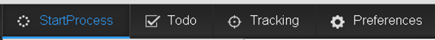

# Het lettertype in de interface wijzigen{#changing-the-font-on-the-interface}

U kunt het lettertype wijzigen dat wordt weergegeven in de werkruimte van AEM-formulieren. Lettertypen die in een specifieke sectie van de gebruikersinterface worden gebruikt, worden gedefinieerd in de bijbehorende sectie van het stijlblad. U kunt de lettertypen in de gebruikersinterface selectief wijzigen.

Voer de [algemene stappen voor de aanpassing](../../forms/using/generic-steps-html-workspace-customization.md) van de AEM Forms-werkruimte uit en voer, afhankelijk van uw vereisten, de stappen uit voor het aanpassen van CSS, HTML of beide.

1. Wijzig of voeg de lettertypefamilie toe aan een bestaande stijl.
1. Wijzig of voeg de lettertypefamilie inline voor het HTML-element toe.
1. Voeg een stijl toe en gebruik deze voor het HTML-element.

Voer bijvoorbeeld de volgende stappen uit als u het font van het ankerpunt op de bovenste navigatiebalk wilt wijzigen in Courier New:

1. Meld u aan bij CRXDE Lite door toegang te krijgen tot `https://'[server]:[port]'/lc/crx/de/index.jsp`.
1. Voer een van de volgende handelingen uit:

   1. Als u de lettertypefamilie wilt wijzigen in een bestaande stijl, voegt u het volgende toe in het bestand newStyle.css op /apps/ws/css.

      ```css
      #topnav a {
         font-family: "Courier New";
      }
      ```

   1. Als u de lettertype-familie inline wilt toevoegen voor het HTML-element, kopieert u het `/libs/ws/js/runtime/templates/appnavigation.html` bestand naar `/apps/ws/js/runtime/templates/appnavigation.html`.

      Werk het bestand /apps/ws/js/runtime/templates/appnavigation.html als volgt bij:

      ```
      <li class="process"><a href="#" title="<%= $.t('index.header.topnav.startprocess.detail')%>" style="font-family:Courier New;" ><%= $.t('index.header.topnav.startprocess.name')%></a></li>
      <li class="todo"><a href="#/todo" title="<%= $.t('index.header.topnav.todo.detail')%>" style="font-family:Courier New;" ><%= $.t('index.header.topnav.todo.name')%></a></li>
      <li class="track"><a href="#/tracking" title="<%= $.t('index.header.topnav.tracking.detail')%>" style="font-family:Courier New;" ><%= $.t('index.header.topnav.tracking.name')%></a></li>
      <li class="preference"><a href="#/preferences" title="<%= $.t('index.header.topnav.preferences.detail')%>" style="font-family:Courier New;" ><%= $.t('index.header.topnav.preferences.name')%></a></li>
      ```

      Open het bestand /apps/ws/js/registry.js en vervang het door `text!/lc/libs/ws/js/runtime/templates/appnavigation.html` het bestand `text!/lc/apps/ws/js/runtime/templates/appnavigation.html`.

   1. Als u een stijl wilt toevoegen die de lettertypefamilie definieert, voegt u het volgende toe in het bestand newStyle.css op /apps/ws/css.

      ```css
      .myNewFontStyle a {
         font-family: "Courier New";
      }
      ```

      Als u de lettertypefamilie inline voor het HTML-element wilt toevoegen, voegt u het volgende toe in het bestand appnavigation.html op /apps/ws/js/runtime/templates.

      ```css
      <div id="topnav" class="myNewFontStyle">
          <ul>
              <li class="process"><a href="#" title="<%= $.t('index.header.topnav.startprocess.detail')%>" ><%= $.t('index.header.topnav.startprocess.name')%></a></li>
              <li class="todo"><a href="#/todo" title="<%= $.t('index.header.topnav.todo.detail')%>"><%= $.t('index.header.topnav.todo.name')%></a></li>
              <li class="track"><a href="#/tracking" title="<%= $.t('index.header.topnav.tracking.detail')%>" ><%= $.t('index.header.topnav.tracking.name')%></a></li>
              <li class="preference"><a href="#/preferences" title="<%= $.t('index.header.topnav.preferences.detail')%>" ><%= $.t('index.header.topnav.preferences.name')%></a></li>
          </ul>
      </div>
      ```

1. Start de werkruimte opnieuw en wis de browsercache zodat de wijzigingen zichtbaar zijn.



Bovenste navigatiebalk voor aanpassing van lettertypen


Bovenste navigatiebalk na aanpassing van lettertype van eerste tab
