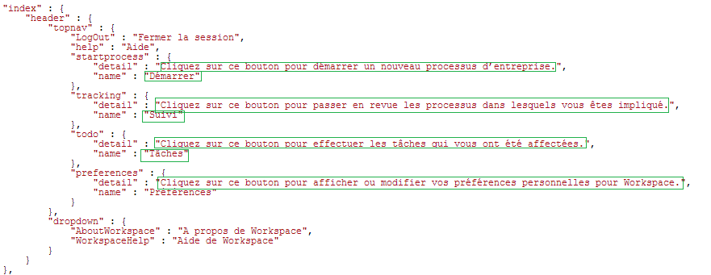

# De landinstelling van de gebruikersinterface van de AEM Forms-werkruimte wijzigen{#changing-the-locale-of-aem-forms-workspace-user-interface}

De werkruimte van AEM Forms biedt vanuit de verpakking ondersteuning voor Engelse, Franse, Duitse en Japanse talen. Het biedt ook de mogelijkheid om de gebruikersinterface van de AEM Forms-werkruimte te lokaliseren naar een andere taal.

U kunt als volgt de gebruikersinterface van de AEM Forms-werkruimte lokaliseren naar de taal van uw keuze:

* Tekst van de AEM Forms-werkruimte lokaliseren.
* U kunt samengevouwen categorieën, wachtrijen en processen lokaliseren.
* Datumkiezer lokaliseren

Voordat u de bovenstaande stappen uitvoert, moet u de volgende stappen uitvoeren: [Algemene stappen voor aanpassing van de AEM Forms-werkruimte](../../forms/using/generic-steps-html-workspace-customization.md).

>[!NOTE]
>
>Als u de taal van het aanmeldingsscherm van de AEM Forms-werkruimte wilt wijzigen, raadpleegt u [Een aanmeldingsscherm maken](../../forms/using/creating-new-login-screen.md).

## Tekst lokaliseren {#localizing-text}

Voer de volgende stappen uit zodat u ondersteuning voor een taal kunt toevoegen *Nieuw* en de landcode van de browser *nw*.

1. Meld u aan bij CRXDE Lite.
De standaard-URL van CRXDE Lite is `https://'[server]:[port]'/lc/crx/de/index.jsp`.
1. Naar de locatie navigeren `apps/ws/locales` en maak een map `nw.`
1. Het bestand kopiëren `translation.json`vanaf de locatie `/apps/ws/locales/en-US` naar locatie `/apps/ws/locales/nw` .
1. Navigeren naar `/apps/ws/locales/nw` en open `translation.json` voor bewerken. Wijzig de landinstelling in het bestand translatie.json.

   De volgende voorbeelden bevatten het bestand translatie.json voor Engelse en Franse landinstellingen van de AEM Forms-werkruimte.

    

## Samengevouwen categorieën, wachtrijen en processen lokaliseren {#localizing-collapsed-categories-queues-and-processes}

In de AEM Forms-werkruimte worden afbeeldingen gebruikt om koppen van categorieën, wachtrijen en processen weer te geven. U hebt een ontwikkelingspakket nodig om deze koppen te lokaliseren. Voor gedetailleerde informatie over het maken van een ontwikkelingspakket gaat u naar [AEM Forms-werkruimtecode samenstellen.](introduction-customizing-html-workspace.md#building-html-workspace-code)

In de volgende stappen wordt aangenomen dat de nieuwe gelokaliseerde afbeeldingsbestanden *Categorieën_nw.png*, *Wachtrij_nw.png*, en *Processes_nw.png*. De aanbevolen breedte van de afbeeldingen moet op 19 pixels worden ingesteld.

>[!NOTE]
>
>U kunt als volgt de landinstellingscode van de browser voor de taal vinden. Open `https://'[server]:[port]'/lc/libs/ws/Locale.html`.


Voer de volgende stappen uit om de afbeeldingen te lokaliseren:

1. Plaats de afbeeldingsbestanden met een WebDAV-client in het dialoogvenster */apps/ws/images* map.
1. Navigeren naar */apps/ws/css*. Openen *newStyle.css* voor het bewerken en toevoegen van de volgende vermeldingen:

   ```css
   #categoryListBar .content.nw {
        background: #3e3e3e url(../images/Categories_nw.png) no-repeat 10px 10px;
    }
   
   #filterListBar .content.nw {
       background: #3e3e3e url(../images/Queues_nw.png) no-repeat 10px 10px;
   }
   
   #processNameListBar .content.nw {
       background: #3e3e3e url(../images/Processes_nw.png) no-repeat 10px 10px;
   }
   ```

1. Alle semantische wijzigingen uitvoeren die worden vermeld in het dialoogvenster [Aanpassing werkruimte](../../forms/using/introduction-customizing-html-workspace.md) artikel.
1. Ga naar de *js/runtime/utility* en opent u de *usersessie.js* bestand voor bewerking.
1. Zoek de code in het oorspronkelijke codeblok en voeg de voorwaarde toe *lang !== &#39;nw&#39;* op de instructie if:

   ```javascript
   // Orignal code
   setLocale = function () {
           var lang = $.trim(i18n.lng());
           if (lang === null || lang === '' || (lang !== 'fr-FR' && lang !== 'de-DE' && lang !== 'ja-JP')) {
               window.lcWorkspace.locale = 'en-US';
           } else {
               window.lcWorkspace.locale = lang;
           }
       }
   ```

   ```javascript
   //new code
    setLocale = function () {
           var lang = $.trim(i18n.lng());
           if (lang === null || lang === '' || (lang !== 'fr-FR' && lang !== 'de-DE' && lang !== 'ja-JP' && lang !== 'nw')) {
               window.lcWorkspace.locale = 'en-US';
           } else {
               window.lcWorkspace.locale = lang;
           }
       }
   ```

## Datumkiezer lokaliseren {#localizing-date-picker}

U hebt een ontwikkelingspakket nodig om de *datepicker* API. Voor gedetailleerde informatie over het maken van een ontwikkelingspakket gaat u naar [AEM Forms-werkruimtecode samenstellen](introduction-customizing-html-workspace.md#building-html-workspace-code).

1. Download en extraheer de [jQuery-UI-pakket](https://jqueryui.com/download/all/), navigeer naar *&lt;extracted jquery=&quot;&quot; ui=&quot;&quot; package=&quot;&quot;>*\jquery-ui-1.10.2.zip\jquery-ui-1.10.2\ui\i18n.
1. Kopieer het bestand jquery.ui.datepicker-nw.js voor code van de landinstelling nu naar apps/ws/js/libs/jqueryui en breng wijzigingen aan die specifiek zijn voor de landinstelling.
1. Navigeren naar `apps/ws/js` en opent u de `jquery.ui.datepicker-nw.js` bestand voor bewerking.
1. Maak in het bestand main.js een alias voor `jquery.ui.datepicker-nw.js.` De code waarmee een alias voor de `jquery.ui.datepicker-nw.js` bestand is:

   ```javascript
   jqueryuidatepickernw : pathprefix + 'libs/jqueryui/jquery.ui.datepicker-nw'
   ```

1. Alias gebruiken `jqueryuidatepickernw` om de `jquery.ui.datepicker-nw.js` in alle bestanden die datepicker gebruiken. De datepicker wordt gebruikt in de volgende bestanden:

   * `js/runtime/views/outofoffice.js`
   * `js/runtime/views/searchtemplatedetails.js`

   De voorbeeldcode hieronder laat zien hoe u de vermelding jquery.ui.datepicker-nw.js toevoegt:

   ```json
   //Original Code
   define([
       'jquery',
       'underscore',
       'backbone',
       'jqueryui',
       'jqueryuidatepickerja',
       'jqueryuidatepickerde',
       'jqueryuidatepickerfr',
       'slimscroll',
       'usersearchview',
       'logmanagerutil',
       'loggerutil'
   ], function ($, _, Backbone, jQueryUI, jQueryUIDatePickerJA, jQueryUIDatePickerDE, jQueryUIDatePickerFR, slimScroll, UserSearch, LogManager, Logger) {
   ```

   ```json
   // Code with Date Picker alias for new language
   define([
       'jquery',
       'underscore',
       'backbone',
       'jqueryui',
       'jqueryuidatepickerja',
       'jqueryuidatepickerde',
       'jqueryuidatepickerfr',
       'jqueryuidatepickernw', // Date Picker alias
       'slimscroll',
       'usersearchview',
       'logmanagerutil',
       'loggerutil'
   ], function ($, _, Backbone, jQueryUI, jQueryUIDatePickerJA, jQueryUIDatePickerDE, jQueryUIDatePickerFR, jQueryUIDatePickerNW, slimScroll, UserSearch, LogManager, Logger) {
   ```

1. Wijzig in alle bestanden die de datepicker-API gebruiken de standaard datepicker API-instellingen. De datepicker-API wordt gebruikt in de volgende bestanden:

   * apps\ws\js\runtime\views\searchtemplatedetails.js
   * apps\ws\js\runtime\views\outofoffice.js

   Wijzig de volgende code om de nieuwe landinstelling toe te voegen:

   ```javascript
   if (locale === 'ja-JP') {
      $.datepicker.setDefaults($.datepicker.regional.ja);
   } else if (locale === 'de-DE') {
      $.datepicker.setDefaults($.datepicker.regional.de);
   } else if (locale === 'fr-FR') {
      $.datepicker.setDefaults($.datepicker.regional.fr);
   } else {
      $.datepicker.setDefaults($.datepicker.regional['']);
   }
   ```

   ```javascript
   if (locale === 'ja-JP') {
       $.datepicker.setDefaults($.datepicker.regional.ja);
   } else if (locale === 'de-DE') {
       $.datepicker.setDefaults($.datepicker.regional.de);
   } else if (locale === 'fr-FR') {
       $.datepicker.setDefaults($.datepicker.regional.fr);
   } else if (locale === 'nw') {
       $.datepicker.setDefaults($.datepicker.regional.nw);
   } else {
       $.datepicker.setDefaults($.datepicker.regional['']);
   }
   ```
