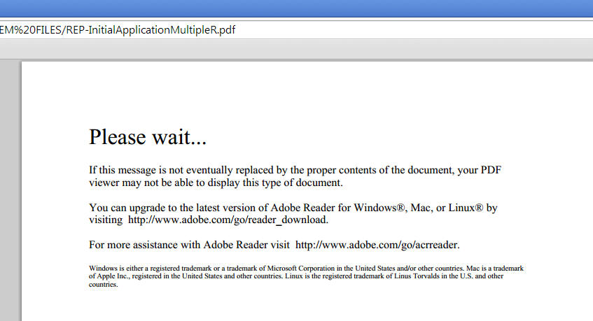

# Pagina-nulinhoud wijzigen in Designer {#changing-page-zero-content-in-designer}

Pagina Nul-inhoud wordt standaard weergegeven wanneer een niet-Adobe PDF-viewer, zoals de standaard PDF-viewer in [!DNL Chrome] of [!DNL Firefox], kan de inhoud van het PDF/XFA-formulier niet lezen. Het standaardbericht Pagina Nul wordt hieronder weergegeven.

[!DNL AEM Forms] Met de versie van Designer kunt u het bericht wijzigen dat wordt weergegeven op Pagina Nul. Voer de volgende stappen uit om het bericht Pagina nul te wijzigen:

1. Zorg ervoor dat u de [!DNL AEM Forms] versie van Designer geïnstalleerd. U kunt de versie controleren van het ongeveer scherm van ontwerper.

1. Open het formulier waarvoor u de inhoud Pagina nul wilt wijzigen.

1. Klikken **[!UICONTROL File]** > **[!UICONTROL Form Properties]**.

1. In de [!UICONTROL Form Properties] dialoogvenster, klikt u op  (Plus-pictogram) om een aangepaste eigenschap toe te voegen.

1. Opgeven **_pagezerocontent** als de naam van de eigenschap.
1. Voeg het nieuwe bericht Pagina Nul, in Rich Text-indeling, als waarde toe. Bijvoorbeeld:

   `<body xmlns="https://www.w3.org/1999/xhtml" xmlns:xfa="https://www.xfa.org/schema/xfa-data/1.0/">
 </code>

You are seeing this message maybe because you are using a non Adobe PDF Viewer or an Old version of Adobe Reader. You can upgrade to the latest version of Adobe Reader for Windows, Mac, or Linux by visiting  </code>https://www.adobe.com/go/reader_download.

 </code>

For more assistance with Adobe Reader visit  </code>https://www.adobe.com/go/acrreader.
</body>`

1. Sla het formulier op als PDF.

1. Bekijk het formulier PDF in browser om te bevestigen dat het bericht is bijgewerkt. De bovenstaande voorbeeldwaarde ziet er als volgt uit:

   

>[!NOTE]
>
>De aangepaste eigenschap die u hebt gemaakt, wordt mogelijk niet correct weergegeven in het dialoogvenster Formuliereigenschappen wanneer u het formulier opnieuw opent. Het werkt echter prima en in het formulier wordt het bijgewerkte bericht Pagina nul weergegeven.
