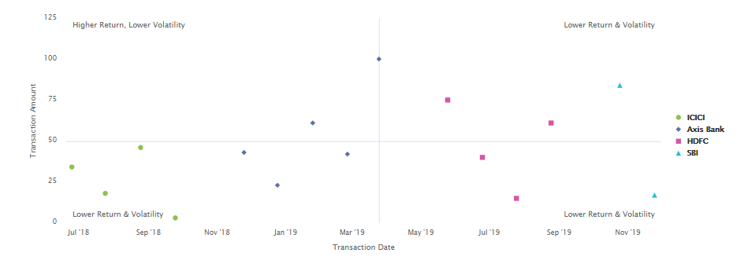

# Het gebruiken van grafieken in Interactieve Communicatie{#using-charts-in-interactive-communications}

Een grafiek of grafiek is een visuele weergave van gegevens. Het versleept grote hoeveelheden informatie in gemakkelijk-aan-begrijpelijke visuele formaat, toelatend de ontvangers van de Interactieve Mededeling om complexe gegevens beter te visualiseren, te interpreteren en te analyseren.

Terwijl het creëren van een Interactieve Communicatie, kunt u grafieken toevoegen om tweedimensionale gegevens van het de vormgegevensmodel van de Interactieve Communicatie visueel te vertegenwoordigen. Met de component Diagram kunt u de volgende typen grafieken toevoegen en configureren: Schijf, Kolom, Donut, Staaf, Lijn, Lijn en Punt, Punt, Gebied en Kwadrant.

## Voeg en vorm grafiek in een Interactieve Communicatie toe {#add-and-configure-chart-in-an-interactive-communication}

Voer de volgende stappen uit om een grafiek in een Interactieve Mededeling toe te voegen en te vormen:

1. Selecteer **Componenten** van het hulpje van de Interactieve Communicatie.
1. Sleep en laat vallen de **component van de Grafiek** aan één van de volgende componenten:

   * Kanaal afdrukken: doelgebied of afbeeldingsveld
   * Webkanaal: Deelvenster of Doelgebied

1. Selecteer de grafiekcomponent in de Interactieve Communicatie redacteur en selecteer **[!UICONTROL Configure (]** ) van de toolbar van de Component.

   De grafiekeigenschappen worden in het linkerdeelvenster weergegeven.

   

   Basiseigenschappen van een lijntekstdiagram in een afdrukkanaal

   

   Basiseigenschappen van een lijntekstdiagram in een webkanaal

1. Vorm de [&#x200B; grafiekeigenschappen &#x200B;](../../forms/using/chart-component-interactive-communications.md#configure-chart-properties) die op het kanaaltype worden gebaseerd.
1. (Alleen kanaal afdrukken) Geef in de **[!UICONTROL Agent Settings]** op of de agent dit diagram moet gebruiken. Als i **[!UICONTROL t Is Mandatory For the Agent To Use This Chart]** optie niet wordt geselecteerd, kan de agent het oogpictogram voor de grafiek in het **[!UICONTROL Content]** lusje van de UI van de Agent selecteren om de grafiek te tonen of te verbergen.

   

1. Selecteer  om de grafiekeigenschappen te bewaren.

   Selecteer **[!UICONTROL Preview]** om de weergave en de gegevens weer te geven die aan het diagram zijn gekoppeld. Selecteer **[!UICONTROL Edit]** om de eigenschappen van het diagram opnieuw te configureren.

## Eigenschappen van diagram configureren {#configure-chart-properties}

Configureer de volgende eigenschappen tijdens het maken van grafieken voor afdrukken en webkanalen:

<table>
 <tbody>
  <tr>
   <td>Veld</td>
   <td>Beschrijving</td>
   <td>Kanaaltype</td>
  </tr>
  <tr>
   <td>Naam</td>
   <td>Identifier voor het grafiekelement. De naam van het diagram dat in dit veld is opgegeven, is niet zichtbaar in het diagram. Het wordt gebruikt wanneer het verwijzen naar het element van andere componenten, manuscripten, en uitdrukkingen SOM.</td>
   <td>Afdrukken en web</td>
  </tr>
  <tr>
   <td>Type diagram</td>
   <td>Type diagram dat u wilt genereren. De beschikbare opties zijn Schijf, Kolom, Donut, Bar, Lijn, Lijn en Punt, Punt, en Gebied.</td>
   <td>Afdrukken en web</td>
  </tr>
  <tr>
   <td>Reeks &gt; Meerdere reeksen</td>
   <td>Selecteer deze optie om meerdere reeksen toe te voegen voor de verzamelingsitems van het formuliergegevensmodel die zijn uitgezet op de X- en Y-as.</td>
   <td>Afdrukken en web</td>
  </tr>
  <tr>
   <td>Reeks &gt; Gegevensmodelobject</td>
   <td>Naam van het de inzamelingspunt van het model van vormgegevens om veelvoudige reeksen aan de grafiek toe te voegen.<br /> Kies een objecteigenschap van het bovenliggende formuliergegevensmodel voor de eigenschappen die op de X-as en Y-as zijn getekend om een betekenisvolle reeks te vormen. Het gegevensmodelobject dat u koppelt, moet van het type Number, String of Date zijn.</td>
   <td>Afdrukken en web</td>
  </tr>
  <tr>
   <td>Gestapeld tonen</td>
   <td>Selecteer deze optie om de waarden van elke reeks boven op elkaar te plaatsen.</td>
   <td>Afdrukken en web</td>
  </tr>
  <tr>
   <td>X-as &gt; Titel</td>
   <td>Titel voor de X-as.</td>
   <td>Afdrukken en web</td>
  </tr>
  <tr>
   <td>X-as &gt; Gegevensmodelobject</td>
   <td><p>Naam van het gegevensmodel van het formulier dat moet worden getekend op de X-as.</p> <p>Kies twee eigenschappen voor verzamel-/arraytype van hetzelfde bovenliggende gegevensmodelobject die van betekenis zijn ten opzichte van elkaar om te plotten op de X- en Y-as van een grafiek. Het gegevensmodelobject dat u koppelt, moet van het type Number, String of Date zijn.</p> </td>
   <td>Afdrukken en web</td>
  </tr>
  <tr>
   <td>Y-as &gt; Titel</td>
   <td>Titel voor de Y-as. </td>
   <td>Afdrukken en web</td>
  </tr>
  <tr>
   <td>Y-as &gt; Gegevensmodelobject</td>
   <td><p>Verzamelingsitem van formuliergegevensmodel dat moet worden getekend op Y-as. In het kanaal van de Druk, zou het gegevensmodelvoorwerp voor de y-as van het type van Aantal moeten zijn.</p> <p>Kies twee eigenschappen voor verzamel-/arraytype van hetzelfde bovenliggende gegevensmodelobject die van betekenis zijn ten opzichte van elkaar om te plotten op de X- en Y-as van een grafiek. </p> </td>
   <td>Afdrukken en web</td>
  </tr>
  <tr>
   <td>Y-as &gt; Functie</td>
   <td>Statistische/aangepaste functie die moet worden gebruikt voor het berekenen van de waarden op y-as.</td>
   <td>Afdrukken en web</td>
  </tr>
  <tr>
   <td>Object verbergen</td>
   <td>Selecteer deze optie om het diagram in de uiteindelijke uitvoer te verbergen.</td>
   <td>Afdrukken en web</td>
  </tr>
  <tr>
   <td>Titel</td>
   <td>Titel van het diagram. </td>
   <td>Afdrukken</td>
  </tr>
  <tr>
   <td>Hoogte</td>
   <td>Hoogte van het diagram in pixels.</td>
   <td>Afdrukken</td>
  </tr>
  <tr>
   <td>Breedte</td>
   <td>Breedte van het diagram in pixels. U kunt de breedte van het diagram in het webkanaal bepalen met behulp van de stijllaag of door een thema toe te passen.</td>
   <td>Afdrukken</td>
  </tr>
  <tr>
   <td>Verplicht pagina-einde voor</td>
   <td>Selecteer deze optie om een verplicht pagina-einde toe te voegen vóór het diagram en het diagram boven op een nieuwe pagina te plaatsen. </td>
   <td>Afdrukken</td>
  </tr>
  <tr>
   <td>Verplicht pagina-einde na</td>
   <td>Selecteer deze optie om een verplicht pagina-einde toe te voegen na het diagram en de inhoud te volgen op het diagram boven aan een nieuwe pagina. </td>
   <td>Afdrukken</td>
  </tr>
  <tr>
   <td>Inspringing</td>
   <td>Inspringing van het diagram links op de pagina. </td>
   <td>Afdrukken</td>
  </tr>
  <tr>
   <td>Knopinfo</td>
   <td><p>Indeling waarin de knopinfo wordt weergegeven op de muis boven een gegevenspunt in het diagram in het webkanaal. De standaardwaarde is $ {x} ($ {y}). Afhankelijk van het grafiektype, wanneer u de muis op een punt, bar, of plak in de grafiek richt, worden variabelen $ {x} en $ {y} dynamisch vervangen met de overeenkomstige waarden op x-as en y-as en getoond in tooltip.</p> <p>Om hulpmiddeluiteinde onbruikbaar te maken, verlaat <span class="uicontrol"> Tooltip</code> veld leeg. Deze optie is niet van toepassing op lijnen en vlakgrafieken. Bijvoorbeeld, zie <a href="#chartoutputprintweb"> Voorbeeld 1: De output van de grafiek in druk en Web </a>.</p> </td>
   <td>Web</td>
  </tr>
  <tr>
   <td>Diagramspecifieke configuraties</td>
   <td><p>Naast gemeenschappelijke configuraties, zijn de volgende grafiek-specifieke configuratie beschikbaar:</p>
    <ul>
     <li><strong> toon legenda: </strong> toont een legenda voor de taart of donutgrafiek wanneer toegelaten.</li>
     <li><strong> positie van de Legenda: </strong> specificeert de positie van de legenda met betrekking tot de grafiek. De beschikbare opties zijn Rechts, Links, Boven en Onder. Gebruik de rechterlegenda in het afdrukkanaal.</li>
     <li><strong> Binnenstraal </strong>: Beschikbaar voor grafieken van de Donut om de straal (in pixel) van de binnencirkel in de grafiek te specificeren.</li>
     <li><strong> kleur van de Lijn </strong>: Beschikbaar voor de grafieken van de Lijn, van de Lijn en van het Punt, en van het Gebied om de kleur voor de lijn in de grafiek te specificeren.</li>
     <li><strong> Kleur van het Punt </strong>: Beschikbaar voor Punt en de grafieken van de Lijn en van het Punt om de kleur voor de punten in de grafiek te specificeren.<br /> </li>
     <li><strong> kleur van het Gebied </strong>: Beschikbaar voor de grafieken van het Gebied om de kleur voor het gebied onder de lijn in de grafiek te specificeren.</li>
     <li><strong> Punt van het Referentie &gt; Bindend Type: </strong> Beschikbaar voor Kwadrant grafieken aan <strong> </strong> specificeer het bindende type voor het verwijzingspunt. Gebruik statische tekst of objecteigenschap van gegevensmodel om de waarde voor het referentiepunt te definiëren.</li>
     <li><strong> Punt van het Verwijzing &gt; x-as: </strong> Beschikbaar voor de grafieken van het Kwadrant als u <span class="uicontrol"> Statische selecteert</code> in de vervolgkeuzelijst Type binding om de waarde voor de X-as van het referentiepunt op te geven.</li>
     <li><strong> Punt van het Verwijzing &gt; y-as: </strong> Beschikbaar voor de grafieken van het Kwadrant als u <span class="uicontrol"> Statische selecteert</code> in de vervolgkeuzelijst Type binding om de waarde voor de Y-as voor het referentiepunt op te geven.</li>
     <li><strong> Punt van het Verwijzing &gt; Voorwerp van het Model van Gegevens voor Reeks: </strong> Beschikbaar voor veelvoudige grafieken van het reekskwadrant als u <span class="uicontrol"> het ModelVoorwerp van Gegevens selecteert</code> in de vervolgkeuzelijst Bindingstype. Definieer de objecteigenschap van het formuliergegevensmodel om de reeks voor het referentiepunt te identificeren. </li>
     <li><strong> Punt van het Verwijzing &gt; de Waarde van Objecten van het Model van Gegevens voor Reeks: </strong> Beschikbaar voor veelvoudige grafieken van het reekskwadrant als u <span class="uicontrol"> ModelVoorwerp van Gegevens selecteert</code> in de vervolgkeuzelijst Bindingstype. Gebruik de objecteigenschap van het formuliergegevensmodel voor reeksen en de waarde die in dit veld is gedefinieerd om de reeks voor het referentiepunt te identificeren.</li>
     <li><strong> Punt van het Verwijzing &gt; Object van het Model van Gegevens voor Punt van het Verwijzing: </strong> Beschikbaar voor Grafieken van het Kwadrant als u <span class="uicontrol"> ModelVoorwerp van Gegevens selecteert</code> in de vervolgkeuzelijst Bindingstype. Definieer een objecteigenschap van het formuliergegevensmodel die vergelijkbaar is met de eigenschappen die op de X- en Y-as zijn getekend. Daarnaast definieert u voor meerdere reeksen een objecteigenschap van het gegevensmodel die een onderliggende entiteit is van de objecteigenschap van het gegevensmodel die voor de reeks is gedefinieerd.</li>
     <li><strong> Punt van het Verwijzing &gt; de Waarde van Objecten van het Model van Gegevens voor Punt van het Verwijzing: </strong> beschikbaar voor Grafieken van het Kwadrant als u <span class="uicontrol"> ModelVoorwerp van Gegevens selecteert</code> in de vervolgkeuzelijst Bindingstype. Gebruik de objecteigenschap van het formuliergegevensmodel voor het referentiepunt en de waarde die in dit veld is gedefinieerd om het referentiepunt voor het diagram te identificeren.<br /> {de Etiketten van 1} Kwadrant &gt; Linksboven:</strong> Beschikbaar voor de grafieken van het Kwadrant om de naam voor de Linkerkwadrant van de Bovenkant te specificeren.<strong></li>
     <li><strong> de Etiketten van het Kwadrant &gt; Hoogste Rechts:</strong> Beschikbaar voor de grafieken van het Kwadrant om de naam voor het Hoogste juiste kwadrant te specificeren.</li>
     <li><strong> Etiketten van het Kwadrant &gt; Rechtsonder: </strong> beschikbaar voor Grafieken van het Kwadrant om de naam voor het Hoogste kwadrant van de Onderkant te specificeren.</li>
     <li><strong> Etiketten van het Kwadrant &gt; Linksonder: </strong> beschikbaar voor Grafieken van het Kwadrant om de naam voor het Linkerkwadrant van de Onderkant te specificeren.</li>
    </ul> </td>
   <td>Afdrukken en web</td>
  </tr>
 </tbody>
</table>

## Functies in diagram gebruiken {#use-functions-in-chart}

U kunt een grafiek vormen om statistische functies te gebruiken om waarden van de brongegevens voor het tekenen op de grafiek te berekenen. Door functies in een grafiek toe te passen, kunt u gegevens plotten die niet direct door het model van vormgegevens worden verstrekt.


Terwijl de component van de Grafiek met sommige in-gebouwde functies komt, kunt u [&#x200B; douanefuncties &#x200B;](#customfunctionsweb) schrijven en hen voor gebruik in de grafiekconfiguratie in het Webkanaal ter beschikking stellen.

De volgende functies zijn standaard beschikbaar met de component Chart:

**Gemiddeld (Gemiddeld)** keert het gemiddelde van de waarden op X of de as van Y voor een bepaalde waarde op de andere as terug.

**Som** keert de som alle waarden op X of de as van Y voor een bepaalde waarde op de andere as terug.

**Maximum** keert het maximum van de waarden op X of de as van Y voor een bepaalde waarde op de andere as terug.

**Frequentie** keert het aantal waarden op X of de as van Y voor een bepaalde waarde op de andere as terug.

**Waaier** keert het verschil tussen het maximum en het minimum van de waarden op X of de as van Y voor een bepaalde waarde op de andere as terug.

**Mediaan** keert de waarde terug die hogere en lagere waarden in de helft op X of de as van Y voor een bepaalde waarde op de andere as scheidt.

**Minimum** keert het minimum van de waarden op X of de as van Y voor een bepaalde waarde op de andere as terug.

**de Wijze** keert de waarde met de meeste voorkomen op X of de as van Y voor een bepaalde waarde op de andere as terug.

Voor meer informatie, zie [&#x200B; Voorbeeld 2: De toepassing van Som en de functies van de Frequentie in een lijngrafiek &#x200B;](#applicationsumfrequency).

### Aangepaste functies in webkanaal {#customfunctionsweb}

Naast het gebruik van de standaardfuncties in grafieken, kunt u douanefuncties in JavaScript™ schrijven en hen ter beschikking stellen in de lijst van functies in de component van de Grafiek voor Webkanaal.

Een functie neemt een array of waarden en een categorienaam als invoer en retourneert een waarde. Bijvoorbeeld:

```javascript
Multiply(valueArray, category) {
 var val = 1;
 _.each(valueArray, function(value) {
 val = val * value;
 });
 return val;
}
```

Zodra u een douanefunctie hebt geschreven, doe het volgende om het voor gebruik in de grafiekconfiguratie beschikbaar te maken:

1. Voeg de douanefunctie in de cliëntbibliotheek toe verbonden aan de relevante Interactieve Communicatie. Voor meer informatie, zie [&#x200B; Vormend de Submit actie &#x200B;](/help/forms/using/configuring-submit-actions.md) en [&#x200B; Gebruikend Cliënt-Kant Bibliotheken &#x200B;](/help/sites-developing/clientlibs.md).

1. Als u de aangepaste functie wilt weergeven in de vervolgkeuzelijst Functie, maakt u in CRXDe Lite een knooppunt `nt:unstructured` in de map apps met de volgende eigenschappen:

   * Voeg eigenschap `guideComponentType` toe met waarde als `fd/af/reducer` . (verplicht)

   * Voeg eigenschap `value` toe aan een volledig gekwalificeerde naam van de aangepaste JavaScript™-functie. (verplicht) en de waarde ervan instellen op de naam van de aangepaste functie, zoals Vermenigvuldigen.
   * Voeg eigenschap `jcr:description` toe met de waarde die u wilt weergeven als de naam van de aangepaste functie die wordt weergegeven in de vervolgkeuzelijst Functie. Bijvoorbeeld, **vermenigvuldigt**.

   * Voeg eigenschap `qtip` toe met een waarde die een korte beschrijving van de aangepaste functie is. Het verschijnt als tooltip wanneer het bedekken van wijzer over de functienaam in de **drop-down lijst van de Functie**.

1. Klik **sparen allen** om de configuratie te bewaren.

De functie is nu beschikbaar voor gebruik in de Grafiek.

## Voorbeeld 1: Grafiekuitvoer in gedrukte vorm en op het web {#chartoutputprintweb}

Op het tabblad Standaard definieert u het type grafiek, de eigenschappen van het gegevensmodel van het bronformulier die gegevens bevatten, de labels die moeten worden getekend op de X-as en Y-as van het diagram en eventueel de statistische functie die de waarden voor tekenen op het diagram berekent.

Laten we de minimaal vereiste informatie in basiseigenschappen in detail begrijpen, met behulp van een kaartinstructie die is gegenereerd met een interactieve communicatie. Bedenk dat u een grafiek wilt produceren om de hoeveelheid verschillende uitgaven in de verklaring te schilderen. U wilt verschillende soorten grafieken voor druk en Weboutput van de Interactieve Communicatie gebruiken.

### Kolomdiagram voor afdrukken {#columnchartprint}

Hiervoor geeft u de volgende eigenschappen op:

* **[!UICONTROL Name]** - Geef de naam voor het diagram op.
* **[!UICONTROL Chart Type]** - selecteer **Kolom** van de drop-down lijst.
* **[!UICONTROL Title]** - Geef het type kosten op voor de X-as en de hoeveelheid transacties voor de Y-as.
* **[!UICONTROL Data Model Objects]** - Selecteer de eigenschappen van het gegevensmodelobject om gegevensbindingen te maken voor de X-as (Type kosten) en de Y-as (Hoeveelheid transactie).


Kolomdiagram in het afdrukkanaal van een interactieve communicatie

### Donut-diagram voor web {#donutchartweb}

Hiervoor geeft u de volgende eigenschappen op:

* **[!UICONTROL Name]** - Geef de naam voor het diagram op.
* **[!UICONTROL Chart Type]** - Selecteer **[!UICONTROL Donut]** in de vervolgkeuzelijst.
* **[!UICONTROL Data Model Objects]** - Selecteer de eigenschappen van het gegevensmodelobject om gegevensbindingen te maken voor de X-as (Type kosten) en de Y-as (Hoeveelheid transactie).
* **[!UICONTROL Inner Radius]** - Geef de waarde voor Binnenste straal op als 150 om de straal (in pixels) van de binnenste cirkel in het diagram op te geven.
* **[!UICONTROL Tooltip]** - gebruik $ {x} ($ {y}) standaardformaat om tooltip te tonen. De knopinfo wordt weergegeven als: Type kosten (transactiebedrag). Voorbeeld: Debit voor bitmap (10000).


Donut grafiek in het Webkanaal van een Interactieve Mededeling

## Voorbeeld 2: De toepassing van de functies van de Som en van de Frequentie in een lijngrafiek {#applicationsumfrequency}

Door functies in een grafiek toe te passen, kunt u gegevens plotten die niet direct door het model van vormgegevens worden verstrekt. In dit voorbeeld, gebruiken wij een voorbeeld van de creditcardverklaring om te begrijpen hoe de functies van de Som en van de Frequentie op de grafiek kunnen worden toegepast.


Regeldiagram zonder functie met twee &quot;Debit for AirBnB&quot;-transacties

### Sum, functie {#sum-function}

U kunt de functie sum toepassen om waarden van meerdere instanties van dezelfde gegevenseigenschap op te tellen en deze slechts eenmaal weer te geven. In de volgende grafiek wordt bijvoorbeeld de functie Som toegepast op de Y-as om het bedrag van de twee Debit voor AirBnB-transacties (2050 en 1050) op te tellen en slechts één transactie (3100) weer te geven.

De functie van de som kan grafiek nuttiger maken wanneer u som voor vele instanties van het zelfde gegevensbezit wilt sorteren en tonen.


### Frequentiefunctie {#frequency-function}

De functie Frequentie retourneert het aantal waarden Y-as voor een bepaalde waarde op de andere as. Met de toepassing van de Frequentiefunctie op de Y-as (Transactiesom) toont de grafiek dat er twee exemplaren van de Debit voor AirBnB-transacties zijn geweest en één exemplaar van de rest van de soorten transacties.


## Voorbeeld 3: Quadrant-diagram met meerdere reeksen in het web {#example-multi-series-quadrant-chart-in-web}

De grafiek geeft een overzicht van het bedrag voor transacties die in een bepaald datumbereik worden uitgevoerd. Het diagram van het kwadrant biedt de mogelijkheid om het grafiekgebied te verdelen in vier gelabelde secties. Het teken gebruikt een statisch referentiepunt voor de X- en Y-as. Gebruik de functie voor meerdere reeksen om gegevens te scheiden op basis van de naam van de bank.

Hiervoor geeft u de volgende eigenschappen op:

* **Naam:** specificeer de naam voor de grafiek.
* **Type van Grafiek:** Uitgezochte **Kwadrant** van de drop-down lijst.

* Selecteer **Veelvoudige Reeks** checkbox.
* **ModelVoorwerp van Gegevens**: Specificeer het bezit van het gegevensmodel voor de reeks. De objecteigenschap van het gegevensmodel voor de naam van de bank is een bovenliggend element van de eigenschappen van het gegevensmodel die zijn getekend in de X-as en Y-as.
* **Modelvoorwerpen van Gegevens:** selecteer de eigenschappen van het gegevensmodel om gegevensbanden voor x-as (de Datum van de Transactie) en y-as (het Bedrag van de Transactie) tot stand te brengen.
* In de **sectie van het Punt van de Verwijzing**, uitgezochte **Statische** als Bindend Type.

* Geef de waarden op voor de referentiepunten op de X-as en de Y-as.
* Geef de kwadranslabels op voor de kwadranten Linksboven, Rechtsboven, Rechtsonder en Linksonder.
* Selecteer **tonen legenda** checkbox om de kleurencodes voor de banknamen te tonen.


