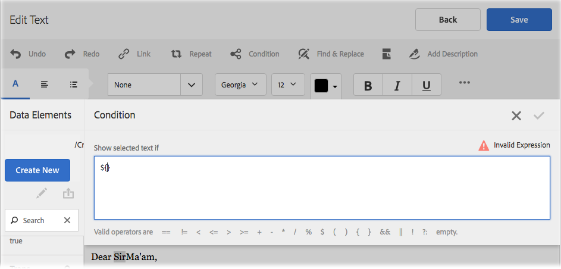
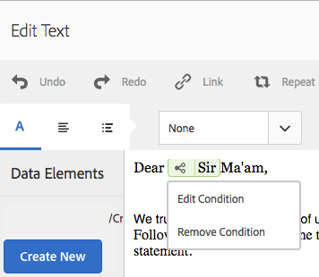
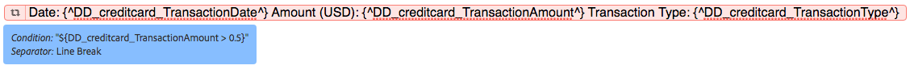

# Inline voorwaarde en herhaling in Interactieve Mededelingen en letters{#inline-condition-and-repeat-in-interactive-communications-and-letters}

## Inline-voorwaarden {#inline-conditions}

Met AEM Forms kunt u inline-voorwaarden in tekstmodules gebruiken om de weergave van tekst te automatiseren die afhankelijk is van de context of de gegevens die aan het formuliergegevensmodel (in interactieve communicatie) of het gegevenswoordenboek (in letters) zijn gekoppeld. De gealigneerde voorwaarde toont specifieke inhoud die op voorwaardevaluatie wordt gebaseerd waar of vals is.

De voorwaarden voeren berekeningen uit op gegevenswaarden die door het model/gegevenswoordenboek van de vormgegevens of door eind - gebruikers worden verstrekt. Met inline voorwaarden kunt u tijd besparen en menselijke fouten verminderen, terwijl u tegelijkertijd zeer contextuele en gepersonaliseerde interactieve communicatie/letters maakt.

Meer informatie:

* [Een interactieve communicatie maken](../../forms/using/create-interactive-communication.md)
* [Overzicht van Correspondentenbeheer](/help/forms/using/cm-overview.md)
* [Tekst in interactieve communicatie](../../forms/using/texts-interactive-communications.md)

### Voorbeeld: Regels gebruiken om inline tekst in interactieve communicatie te conditioneren {#example-using-rules-to-conditionalize-inline-text-in-interactive-communication}

Als u een zin, alinea of tekenreeks in een interactieve communicatie wilt conditionaliseren, kunt u een regel maken in het desbetreffende tekstdocumentfragment. In het volgende voorbeeld wordt een regel gebruikt om alleen aan de Amerikaanse ontvangers van de interactieve communicatie een gratis nummer weer te geven.

Zie Regel maken in tekst in [Teksten in interactieve communicatie](../../forms/using/texts-interactive-communications.md)voor meer informatie.

Zodra u het tekstfragment in een Interactieve Communicatie omvat en de Agent gebruikt de Agent UI om een Interactieve Mededeling voor te bereiden, worden de (model van vormgegevens) gegevens voor de ontvangers geëvalueerd en de tekst wordt getoond slechts aan de ontvangers in de V.S.

### Voorbeeld: Het gebruiken van gealigneerde voorwaarde in een brief om het aangewezen adres terug te geven  {#example-using-inline-condition-in-a-letter-to-render-the-appropriate-address}

U kunt inline voorwaarde in een brief opnemen door de gealigneerde voorwaarde in de aangewezen tekstmodule op te nemen. Het volgende voorbeeld gebruikt twee voorwaarden om het aangewezen adres, Sir of Ma&#39;am, in een brief te evalueren en te tonen die op het DD element Gender wordt gebaseerd. Met vergelijkbare stappen kunt u andere voorwaarden maken.

>[!NOTE]
>
>Als uw bestaande activa oude voorwaarde/herhaalde uitdrukkingen (pre 6.2 SP1 GFP 4) omvatten, tonen de activa oude syntaxis van voorwaarde en herhalen. De oude voorwaarde/herhaling werkt echter wel. De nieuwe en oude voorwaarde/herhalingsexpressies zijn compatibel met elkaar om een geneste mix van oude en nieuwe voorwaarde/herhalingsexpressies te maken.

1. Selecteer in de relevante tekstmodule het tekstgedeelte dat u wilt conditionaliseren en tikken op **Voorwaarde**.

   

   Het dialoogvenster Voorwaarde wordt weergegeven met een lege voorwaarde.

   

   >[!NOTE]
   >
   >Lege of ongeldige voorwaardelijke expressie kan niet worden opgeslagen. Er moet een geldige voorwaardelijke expressie binnen voorkomen `${}` om de expressie op te slaan.

1. Ga als volgt te werk om een voorwaarde te maken voor het evalueren of de geselecteerde/geconditioneerde tekst in de letter staat en tik vervolgens op het vinkje om de expressie op te slaan:

   Dubbeltik op een DD-element om dit in de voorwaarde in te voegen. Voeg de juiste operator in en stel de volgende voorwaarde in het dialoogvenster samen.

   ```javascript
   ${DD_creditcard_Gender=="Male"}
   ```

   Voor meer informatie bij het creëren van de uitdrukking, zie het **Creëren van uitdrukkingen en verre functies met uitdrukkingsbouwer** in de Bouwer [van de](../../forms/using/expression-builder.md)Uitdrukking. De waarde die in de expressie wordt opgegeven, moet worden ondersteund voor het element in het gegevenswoordenboek. Zie [Gegevenswoordenboek](../../forms/using/data-dictionary.md)voor meer informatie.

   Nadat de voorwaarde is ingevoegd, kunt u de muisaanwijzer boven de greep aan de linkerkant van de voorwaarde houden om de voorwaarde weer te geven. Tik op de handgreep om het pop-upmenu van de voorwaarde weer te geven. U kunt de voorwaarde dan bewerken of verwijderen.

    

1. Voeg een vergelijkbare voorwaarde in door de tekst te selecteren `Ma'am`.

   ```javascript
   ${DD_creditcard_Gender == "Female"}
   ```

1. Geef een voorvertoning van de relevante letter weer. U ziet dat de tekst wordt weergegeven volgens de inline voorwaarde. U kunt de waarde van DD-element gendergerelateerd invoeren met:

   * Een voorbeeld-XML-gegevensbestand dat is gemaakt op basis van het relevante gegevenswoordenboek terwijl de letter wordt voorvertoond met voorbeeldgegevens.
   * Een XML-gegevensbestand dat is gekoppeld aan het desbetreffende gegevenswoordenboek.

   Zie [Gegevenswoordenboek](../../forms/using/data-dictionary.md)voor meer informatie.

   

## Herhalen {#repeat}

U kunt dynamische informatie in uw Interactieve Communicatie/brief, zoals transacties in een creditcardverklaring hebben, waarvan de instantie of het voorkomen met elke geproduceerde brief kan blijven veranderen. Met Herhalen kunt u dergelijke dynamische informatie in het tekstdocumentfragment opmaken en structureren.

Verder, kunt u regel/voorwaarde binnen de herhalingsconstructie specificeren om de informatie/ingangen te conditionaliseren die in de Interactieve Mededeling/de brief worden teruggegeven.

### Voorbeeld: Herhaling gebruiken in een Interactieve Mededeling aan formaat, structuur, en vertoning een lijst van creditcardtransacties {#example-using-repeat-in-an-interactive-communication-to-format-structure-and-display-a-list-of-credit-card-transactions}

Het volgende voorbeeld geeft u de stappen voor het gebruiken van herhaling aan structuur en geef de creditcardtransacties in een Interactieve Mededeling terug.

1. Voeg in een tekstdocumentfragment dat is gebaseerd op een formuliergegevensmodel de relevante formuliergegevensmodelobjecten in (en ingesloten tekst die is vereist voor de labels, zoals in dit voorbeeld):

   

   >[!NOTE]
   >
   >De herhaalbare inhoud moet ten minste één eigenschap van het type Collection bevatten.

1. Selecteer de inhoud waarop u een herhaling wilt toepassen.

   

1. Tik op Herhalen.

   Het dialoogvenster Herhalen wordt weergegeven.

   

1. Selecteer Regeleinde als scheidingsteken en tik, indien vereist, op Voorwaarde toevoegen om een regel te maken. U kunt tekst ook als scheidingsteken gebruiken en de teksttekens opgeven die als scheidingsteken moeten worden gebruikt.

   Het dialoogvenster Regel maken wordt weergegeven.

1. Maak een regel voor het weergeven van transacties die na 28 februari 2018 zijn gedateerd om de transacties alleen voor de maand maart in de interactieve mededeling op te nemen.

   >[!NOTE]
   >
   >In dit voorbeeld wordt ervan uitgegaan dat de Agent de instructie eind maart 2018 zal maken. Anders kunt u een andere regel maken om transacties vóór 2018-04-01 op te nemen om transacties na maart 2018 uit te sluiten.

   

1. Sla de voorwaarde/regel op en sla de herhaling op. Voorwaardelijke herhaling wordt toegepast op de geselecteerde inhoud.

   

   Als u de muis erboven plaatst, worden in het tekstdocumentfragment de voorwaarde en het scheidingsteken weergegeven die worden gebruikt in de herhaling die op de inhoud is toegepast.

1. Sla het tekstdocumentfragment op en bekijk een voorvertoning van de relevante interactieve communicatie. Afhankelijk van de gegevens in het formuliergegevensmodel geeft de herhaling die op de elementen is toegepast, de transactiedetails weer zoals in het voorbeeld:

   

### Voorbeeld: Herhaling gebruiken in een brief om een lijst met creditcardtransacties op te maken, te structureren en weer te geven {#example-using-repeat-in-a-letter-to-format-structure-and-display-a-list-of-credit-card-transactions}

In het volgende voorbeeld worden de stappen beschreven voor het gebruik van herhalen om de creditcardtransacties in een letter te structureren en weer te geven. Met vergelijkbare stappen kunt u herhalen in een ander scenario gebruiken.

1. Open (tijdens het bewerken of maken) een tekstmodule met DD-elementen die herhaalde/dynamische gegevens renderen en de vereiste tekst rond de DD-elementen insluiten. Een tekstmodule heeft bijvoorbeeld de volgende DD-elementen om een overzicht van transacties op een creditcard te maken:

   ```javascript
   {^DD_creditcard_TransactionDate^} {^DD_creditcard_TransactionAmount^}
   {^DD_creditcard_TransactionType^}
   ```

   Deze DD-elementen geven een lijst weer van de op de creditcard verrichte transacties met de volgende informatie:

   Transactiedatum, transactiebedrag en transactietype (debitering of creditering)

1. Sluit de tekst in de DD-elementen in om de instructie leesbaarder te maken, zoals:

   

   ```javascript
   Date: {^DD_creditcard_TransactionDate^} Amount (USD): {^DD_creditcard_TransactionAmount^} Transaction Type: {^DD_creditcard_TransactionType^}
   ```

   Het renderen van een instructie met een goede indeling is echter nog niet voltooid. Als u een brief teruggeeft die op het tot dusver verrichte werk wordt gebaseerd, verschijnt het als volgt:

   

   Als u de statische tekst samen met de DD-elementen wilt herhalen, moet u een herhaling toepassen, zoals in de volgende stappen wordt uitgelegd.

1. Selecteer de statische tekst en de DD-elementen die u wilt herhalen, zoals hieronder wordt weergegeven:

   

1. Tik op **Herhalen**. Het dialoogvenster Herhalen wordt weergegeven met een lege inline voorwaarde.

   

1. Voeg zo nodig een voorwaarde in om de transacties selectief te renderen, bijvoorbeeld om transactiebedragen van meer dan 50 cent te renderen:

   ```javascript
   ${DD_creditcard_TransactionAmount > 0.5}
   ```

   Als u de informatie niet selectief hoeft te renderen (hier transacties), laat u de voorwaarde leeg door het volgende te verwijderen uit het dialoogvenster: `${}`. Het opslaan van een herhalingsexpressie wordt ingeschakeld wanneer het venster met de herhalingsexpressie leeg is (zonder ${} wanneer geen herhaling nodig is) of wanneer het een geldige voorwaarde voor herhaling bevat.

1. Selecteer een scheidingsteken voor de opmaak van de dynamische tekst en tik op het vinkje dat u wilt opslaan:

   * **Regeleinde**: Voegt een regeleinde in na elk transactieitem in de uitvoerletter.
   * **Tekst**: Hiermee wordt het opgegeven tekstteken ingevoegd na elk transactiemateriaal in de uitvoerletter.

   Nadat de voorwaarde is ingevoegd, wordt de tekst met de herhaling rood gemarkeerd en wordt er een greep aan de linkerkant weergegeven. U kunt de aanwijzer boven de greep links van de herhaling plaatsen om de herhalingsconstructie weer te geven.

   

   Tik op de handgreep om het pop-upmenu van de herhaling weer te geven. U kunt de herhalingsconstructie dan bewerken of verwijderen.

   

1. Geef een voorvertoning van de relevante letter weer. U ziet dat de tekst volgens herhaling wordt weergegeven. U kunt de waarde van DD-elementen invoeren met:

   * Een voorbeeld-XML-gegevensbestand dat is gemaakt op basis van het relevante gegevenswoordenboek terwijl de letter wordt voorvertoond met voorbeeldgegevens.
   * Een XML-gegevensbestand dat is gekoppeld aan het desbetreffende gegevenswoordenboek.

   Zie [Gegevenswoordenboek](https://helpx.adobe.com/aem-forms/6-2/data-dictionary.html)voor meer informatie.

   

   De statische tekst wordt herhaald met de transactiedetails. Herhalende statische tekst wordt vergemakkelijkt door de herhaling die op de tekst in deze procedure wordt toegepast. De voorwaarde, ${DD_creditcard_TransactionAmount > 0.5}, zorgt ervoor dat de transacties onder USD.5 niet in de brief worden teruggegeven.

   >[!NOTE]
   >
   >U kunt voorwaarde en herhaling slechts opnemen terwijl het creëren van of het uitgeven van de relevante tekstmodule. Terwijl u een voorvertoning van de letter weergeeft, kunt u wel bewerkingen in de tekstmodule uitvoeren, maar kunt u geen voorwaarde of herhaling invoegen.

## Inline voorwaarde en herhaling gebruiken - sommige gebruiksgevallen  {#using-inline-condition-and-repeat-some-use-cases}

### Herhalen binnen voorwaarde {#repeat-within-condition}

Het kan nodig zijn om herhaling te gebruiken binnen een bepaalde conditie. Met Correspondentiebeheer kunt u herhalingen gebruiken binnen een inlineconstructie.

Hierna volgt bijvoorbeeld een herhaling (in rood opgemaakt) binnen een voorwaarde (in groen opgemaakt).

Terwijl de herhaling de creditcardtransacties teruggeeft, verzekert de voorwaarde ${DD_creditcard_nooftransactions > 0} dat de herhalingsconstructie slechts wordt teruggegeven als er minstens één transactie is.


Op dezelfde manier kunt u volgens uw vereiste het volgende maken:

* Een of meer voorwaarden binnen een voorwaarde
* Een of meer voorwaarden binnen een herhaling
* Een combinatie van voorwaarden en herhaling binnen een voorwaarde of herhaling

### Lege inline-voorwaarde {#empty-inline-condition}

Mogelijk moet u lege inline-voorwaarden invoegen en later tekst en DD-elementen insluiten. Met Correspondence Management kunt u dat doen.


Het wordt echter aanbevolen om indien mogelijk eerst de tekst en de DD-elementen in de tekstmodule in te voegen met de gewenste opmaak, zoals opsommingstekens, en nadien een inline-voorwaarde toe te passen.
