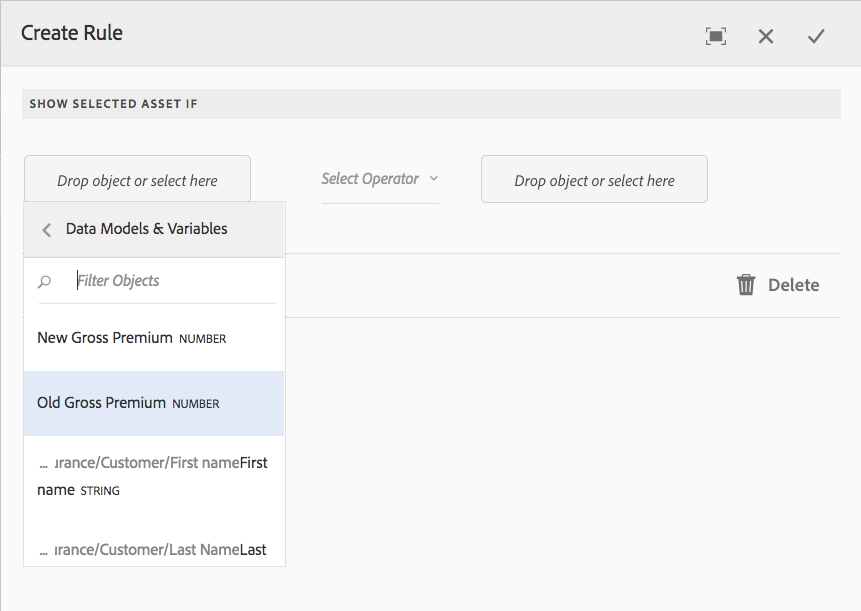
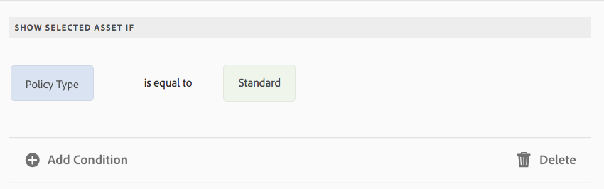

# Voorwaarden voor interactieve communicatie{#conditions-in-interactive-communications}

Het creëren en het uitgeven van voorwaardelementen die in Interactieve Mededelingen moeten worden gebruikt - de voorwaarde is één van de vier soorten documentfragmenten die worden gebruikt om Interactieve Mededelingen te bouwen. De andere drie zijn teksten, lijsten, en lay-outfragmenten.

## Overzicht {#overview}

Voorwaarde is een documentfragment dat u kunt opnemen in een interactieve communicatie. De andere documentfragmenten zijn [&#x200B; tekst &#x200B;](../../forms/using/texts-interactive-communications.md), lijst, en lay-outfragment. De voorwaarden laten u toe om één of meerdere contextafhankelijke activa te bepalen die in een Interactieve Mededeling inbegrepen worden die op de verstrekte gegevens en de regels wordt gebaseerd.

Voorbeelden:

* Geef in een creditcardafschrift de jaarlijkse kosten van de creditcard en de afbeelding van de creditcard weer op basis van het type creditcard van de klant.
* In een herinnering voor de verzekeringspremie kunt u berekeningen van de belasting weergeven op basis van de belastingen van de staat van de klant.

De elementen in de voorwaarden die worden gerenderd op basis van de toegepaste regels en de waarden die aan de regel worden doorgegeven. De regels in de voorwaarden kunnen waarden in de volgende soorten gegevens controleren:

* Eigenschap van gekoppeld formuliergegevensmodel
* Alle variabelen die u in de voorwaarde maakt
* Tekenreeksen
* Getallen
* Wiskundige expressies
* Datums

## Voorwaarde maken {#createcondition}

1. Selecteer **[!UICONTROL Forms]** > **[!UICONTROL Document Fragments]** .
1. Selecteer **[!UICONTROL Create]** > **[!UICONTROL Condition]** .
1. Geef de volgende informatie op:

   * **[!UICONTROL Title]**: (Optioneel) Voer de titel voor de voorwaarde in. Titels hoeven niet uniek te zijn en kunnen speciale tekens en niet-Engelse tekens bevatten. De voorwaarden worden verwezen door hun titels (indien beschikbaar) zoals in duimnagels en eigenschappen.
   * **[!UICONTROL Name]**: De unieke naam voor de voorwaarde, in een map. Geen twee documentfragmenten (tekst, voorwaarde of lijst) in een staat kunnen bestaan met dezelfde naam in een map. In het veld Naam kunt u alleen Engelse tekens, cijfers en afbreekstreepjes invoeren. Het veld Naam wordt automatisch ingevuld op basis van het veld Titel. De speciale tekens, spaties, getallen en niet-Engelse tekens die in het veld Titel zijn ingevoerd, worden vervangen door afbreekstreepjes in het veld Naam. Hoewel de waarde in het veld Titel automatisch naar de naam wordt gekopieerd, kunt u de waarde bewerken.

   * **[!UICONTROL Description]**: typ een beschrijving van het documentfragment.
   * **[!UICONTROL Form Data Model]**: Selecteer desgewenst het keuzerondje Formuliergegevensmodel om de voorwaarde te maken op basis van een formuliergegevensmodel. Wanneer u het keuzerondje Formuliergegevensmodel selecteert, wordt het veld **[!UICONTROL Form Data Model]** weergegeven. Blader naar een formuliergegevensmodel en selecteer dit. Zorg tijdens het creëren van voorwaarde voor een Interactieve Communicatie, dat u het zelfde gegevensmodel gebruikt dat u in Interactieve Communicatie van plan bent te gebruiken. Voor meer informatie over het model van vormgegevens, zie [&#x200B; Integratie van Gegevens &#x200B;](../../forms/using/data-integration.md).

   * **[!UICONTROL Tags]**: Als u een aangepaste tag wilt maken, voert u desgewenst een waarde in het tekstveld in en selecteert u Enter. Wanneer u deze voorwaarde opslaat, worden de nieuwe tags gemaakt.

1. Selecteer **[!UICONTROL Next]** .

   De pagina Voorwaarde maken wordt weergegeven.

   

1. Selecteer **[!UICONTROL Add Assets]** .

   Selecteer de Assets-pagina en geef de beschikbare teksten, lijsten, voorwaarden en afbeeldingen weer die u in de voorwaarde kunt toevoegen.

   >[!NOTE]
   >
   >Alleen op basis van geen gemaakte, nieuw gemaakte elementen en op FDM gebaseerde elementen (die zijn gemaakt met dezelfde FDM als de voorwaarde die wordt gemaakt) worden weergegeven op de pagina Selecteer Assets.

1. Selecteer de juiste elementen om deze in de voorwaarde te selecteren en selecteer vervolgens **[!UICONTROL Done]** .

   De pagina Voorwaarde maken wordt weergegeven met de toegevoegde elementen.

   

   U kunt de volgende opties gebruiken om elementen in een bepaalde situatie te beheren:

   

   **[a ] verwerping Verandering.** Selecteer dit pictogram om de wijzigingen in het element en de regel in de voorwaarde af te wijzen.
   **[B ] keurt Verandering goed.** Selecteer dit pictogram om de wijzigingen te accepteren die u in het element en de regel in de voorwaarde hebt aangebracht.
   **[C ] Dubbele Activa.** Selecteer dit pictogram om een kopie van het element te maken, samen met de eventueel toegepaste regel in de voorwaarde. Vervolgens kunt u doorgaan met het bewerken van de regel en het element voor gedupliceerde elementen. Het dupliceren van een element is handig voor het maken van vergelijkbare regels voor het weergeven van alternatieve elementen op basis van een bepaalde context.
   **[D ] toont Voorproef.** Selecteer dit pictogram om een voorvertoning van het element weer te geven op de pagina Voorwaarde maken\bewerken.
   **&#39;server&#39; Opnieuw ordenen.** Selecteer dit pictogram en houd het ingedrukt om elementen te slepen en neer te zetten om ze binnen een voorwaarde opnieuw te ordenen.

   U kunt de volgende opties selecteren om op te geven hoe de voorwaarde zich gedraagt bij uitvoering:

   * **Veelvoudige Uitgeschakelde van de Evaluatie van Resultaten \ Veelvoudige Toegelaten Evaluatie van Resultaten**: Wanneer deze optie wordt toegelaten (verschijnt als &quot;Veelvoudige Toegelaten Evaluatie van Resultaten&quot;), worden alle regels geëvalueerd en het resultaat is de som van alle ware regels. Als deze optie is uitgeschakeld (wordt &#39;&#39;Multiple Results Evaluation Disabled&#39; weergegeven), wordt alleen de eerste regel die waar wordt gevonden, geëvalueerd en wordt deze de uitvoer van de voorwaarde.

   * **de Onderbreking van de Pagina**: Selecteer deze optie ( ) om een paginaonderbreking tussen de activa van de voorwaarden toe te voegen. Wanneer deze optie niet wordt geselecteerd ( ), als een voorwaarde aan de volgende pagina in de drukoutput overvloeit, wordt de volledige voorwaarde verplaatst naar de volgende pagina in plaats van het breken in de pagina tussen de activa in de voorwaarde.

1. Selecteer **[!UICONTROL Create Rule]** als u regels wilt toevoegen om de elementen weer te geven of te verbergen. Om variabelen in de regels te gebruiken, zie [&#x200B; het creëren van variabelen &#x200B;](#variables). Voor meer informatie, zie [&#x200B; Toevoegend regels aan voorwaarde &#x200B;](#ruleeditor).

   De gemaakte regels worden weergegeven in de kolom REGEL in het scherm Voorwaarde maken.

   

   >[!NOTE]
   >
   >U kunt elementen in uw voorwaarde invoegen waarop al regels of herhalingen zijn toegepast.

1. Selecteer **[!UICONTROL Save]** .

   De voorwaarde wordt gemaakt. Nu kunt u aan het gebruiken van de voorwaarde als bouwsteen te werk gaan terwijl het creëren van een Interactieve Communicatie.

   >[!NOTE]
   >
   >Als u een nieuwe of bewerkte voorwaarde wilt opslaan, moet u ten minste één regel hebben voor elk element dat in de voorwaarde is toegevoegd.

## Een voorwaarde bewerken {#edit-a-condition}

U kunt een voorwaarde bewerken door de volgende stappen uit te voeren. U kunt een voorwaarde ook bewerken vanuit een interactieve communicatie door Fragment bewerken te selecteren in het pop-upmenu.

1. Selecteer **[!UICONTROL Forms]** > **[!UICONTROL Document Fragments]** .
1. Navigeer naar de voorwaarde en selecteer deze.
1. Selecteer **[!UICONTROL Edit]** .
1. Breng de gewenste wijzigingen aan in de voorwaarde. Voor meer details op de informatie kunt u in een voorwaarde veranderen, zie [&#x200B; voorwaarde &#x200B;](#createcondition) creëren.
1. Selecteer **[!UICONTROL Save]** en selecteer vervolgens **[!UICONTROL Close]** .

## Voorwaardelijke regels maken {#ruleeditor}

Gebruikend regelredacteur in een voorwaarde, kunt u regels tot stand brengen om activa te tonen of te verbergen die op **worden gebaseerd vooraf ingestelde voorwaarden**. Deze voorwaarden kunnen worden geconstrueerd op basis van:

* Tekenreeksen
* Getallen
* Wiskundige expressies
* Datums
* Eigenschappen van gekoppeld formuliergegevensmodel
* Om het even welke [&#x200B; variabelen &#x200B;](#variables) die u kunt gecreeerd hebben

### Regel maken in voorwaarde {#create-rule-in-condition}

1. Terwijl het creëren van of het uitgeven van een voorwaarde, uitgezochte  (de Redacteur van de Regel) pictogram voor de relevante activa.

   Het dialoogvenster Regel maken wordt weergegeven. Naast tekenreeks, nummer, wiskundige expressie en datum zijn in de Regeleditor ook de volgende opties beschikbaar voor het maken van instructies van de regels:

   * Eigenschappen van gekoppeld formuliergegevensmodel
   * Om het even welke [&#x200B; variabelen &#x200B;](#variables) die u kunt tot stand gebracht hebben.

   

   Selecteer de gewenste optie die u wilt evalueren.

   >[!NOTE]
   >
   >Inzamelingseigenschap wordt niet ondersteund voor het maken van regels voor het weergeven van elementen.

1. Selecteer de juiste operator om de regel te evalueren, zoals Is gelijk aan, Bevat en Begint met.
1. Voeg de evaluatiereferentie, tekenreeks, gegevensmodeleigenschap, variabele of datum in.

    is

   Regel om een element te tonen wanneer het beleidstype standaard is

   * Terwijl het creëren van of het uitgeven van een regel, kunt u  (Resize) ook selecteren om de Create lijn uit te breiden/geef de dialoog van de Regel uit. Het uitgebreide, volledig-vensterdialoog laat u [&#x200B; variabelen &#x200B;](#variables) tot stand brengen om regels te construeren. Selecteer Opnieuw vergroten/verkleinen om terug te keren naar het normale dialoogvenster Regel maken.

   * U kunt ook meerdere voorwaarden in een regel maken.

1. Selecteer **[!UICONTROL Done]** .

   De regel wordt toegepast op het element.

## Variabelen in een voorwaarde maken en gebruiken {#variables}

Terwijl het creëren van of het uitgeven van een regel in een voorwaarde, kunt u  (Resize) selecteren om de Create dialoog van de Regel uit te breiden \ uitgeeft. Met het uitgebreide dialoogvenster van een volledig venster kunt u het volgende doen:

* Variabelen in de regel maken en gebruiken
* De eigenschappen en variabelen van het formuliergegevensmodel slepen en neerzetten in de regel

Selecteer Opnieuw vergroten/verkleinen om terug te gaan naar het dialoogvenster Regel maken.\nRegel bewerken.

### Variabelen maken {#create-variables}

1. Terwijl het creëren van of het uitgeven van een regel in een voorwaarde, kunt u  (Resize) selecteren om de Create dialoog van de Regel uit te breiden \ uitgeeft.

   Het dialoogvenster Uitgebreid en volledig venster wordt weergegeven.

   

1. Selecteer **[!UICONTROL Variables]** in het linkerdeelvenster.

   Het deelvenster Variabelen wordt weergegeven.

   

1. Selecteer **[!UICONTROL Create]** .

   Het deelvenster Variabelen maken wordt weergegeven.

1. Voer de volgende informatie in en selecteer **[!UICONTROL Create]** :

   * **[!UICONTROL Name]**: naam van de variabele.
   * **[!UICONTROL Description]**: Voer desgewenst een beschrijving van de variabele in.
   * **[!UICONTROL Type]**: Selecteer een type variabele: String, Number, Boolean of Date.
   * **[!UICONTROL Allow Specific Values Only]**: Voor de variabelen van het Koord en van het Aantal, kunt u ervoor zorgen dat de agent van een specifieke reeks waarden voor placeholder in de Agent UI kiest. Als u de reeks waarden wilt opgeven, selecteert u deze optie en geeft u door komma&#39;s gescheiden waarden op die zijn toegestaan in het veld **[!UICONTROL Values]** .

1. Selecteer **[!UICONTROL Create]** .

   De variabele wordt gemaakt en vermeld in het deelvenster Variabelen.

1. Als u een variabele in de regel wilt invoegen, sleept u de variabele naar een tijdelijke aanduiding voor een optie in de regel.
1. Nadat u een geldige regel hebt samengesteld, selecteert u **[!UICONTROL Done]** .

   Ga zo nodig verder met het aanbrengen van wijzigingen in de voorwaarde en sla deze op.
